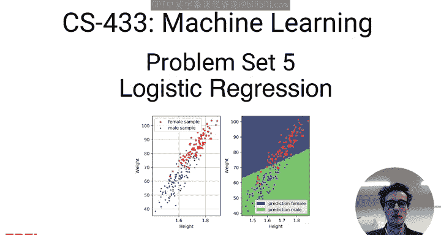
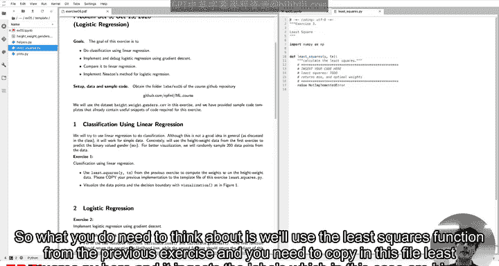
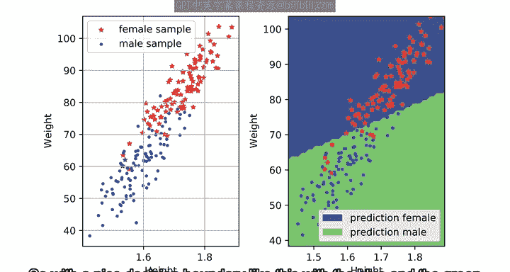
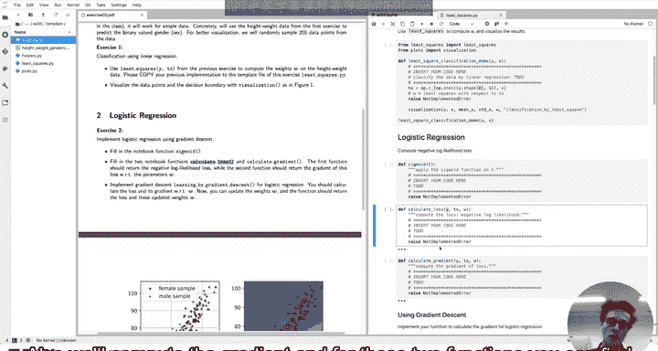

# 15：逻辑回归与分类 🧠

在本节课中，我们将学习如何使用逻辑回归进行二元分类。我们将从使用线性回归进行简单分类开始，逐步过渡到更严谨的逻辑回归方法，并最终探讨正则化技术。本教程将引导你完成习题集中的核心任务。



---

## 练习一：使用线性回归进行分类 📈

上一节我们回顾了线性回归的基础。本节中，我们来看看如何将其应用于分类问题。虽然线性回归通常不适用于分类，但在处理简单数据时，它可以作为一个直观的起点。

我们将使用第一课中的身高体重数据，这次的目标是预测一个二元变量：性别。为了更好的可视化，代码会从数据中随机抽取200个点。

以下是需要你完成的核心步骤：

1.  你需要将之前练习中的最小二乘法函数复制到当前文件中。
2.  该函数将接收二元标签和已添加截距项的特征数据。
3.  运行代码后，你将通过最小二乘法获得权重参数。



完成计算后，使用提供的可视化函数绘制数据点和决策边界。运行结果应类似于下图，其中蓝色和绿色区域分别代表模型预测的男性和女性类别。


---

## 练习二：实现逻辑回归 🔄



线性回归为分类提供了直观认识。本节中，我们将学习处理二元分类更根本的方法：逻辑回归。我们将分步实现它。

首先，我们需要实现 **Sigmoid 函数**。该函数将实数映射到 (0, 1) 区间，其公式如下：

**公式：** `σ(z) = 1 / (1 + e^{-z})`

在代码中，你可以这样实现：
```python
def sigmoid(z):
    return 1.0 / (1.0 + np.exp(-z))
```

接下来，我们需要计算损失函数和梯度。以下是需要填写的两个函数：

*   **计算损失 (`calculate_loss`)**: 返回给定模型参数 `w`、特征数据 `x` 和标签 `y` 下的负对数似然。
*   **计算梯度 (`calculate_gradient`)**: 返回损失函数关于参数 `w` 的梯度。

这两个函数的公式可以在课程讲义中找到，你也可以自行推导。




有了损失和梯度计算函数后，我们就可以进行学习了。学习过程涉及对参数 `w` 执行一步梯度下降。

你需要实现函数 `learning_by_gradient_descent`，它计算当前损失和梯度，然后更新权重并返回。这样设计的原因是，在接下来的Jupyter Notebook单元格中，我们将使用学习率进行多次迭代训练。

完成训练后，可视化预测结果。你应该得到一个与之前类似的决策边界图，但这次是使用Sigmoid函数和逻辑回归的更严谨方法。

---

## 练习三：实现牛顿法 ⚡

我们已实现了梯度下降法。本节中，我们来看看一种更快的二阶优化方法：牛顿法。牛顿法需要使用海森矩阵 (Hessian)。

首先，实现 **计算海森矩阵 (`calculate_hessian`)** 函数。它接收标准参数，并返回损失函数关于参数 `w` 的海森矩阵。

然后，完成 **逻辑回归 (`logistic_regression`)** 函数。该函数应利用我们之前构建的所有功能，并返回损失、梯度和海森矩阵。注意，此函数不应更新参数 `w`，因为更新将在下一步进行。

最后，实现 **牛顿法学习 (`learning_by_newton_method`)** 函数，它执行一步牛顿法更新并返回损失及更新后的参数 `w`。

完成上述步骤后，进行迭代学习。如果实现正确，你会发现牛顿法所需的迭代次数远少于梯度下降法。思考一下为什么会这样是很有益的。

---

## 练习四：添加正则化 🛡️

我们已经实现了基础逻辑回归及其优化。本节中，我们将在损失函数中加入正则化项以防止过拟合。

你需要实现 **带惩罚项的逻辑回归 (`penalized_logistic_regression`)** 函数。它返回正则化后的损失、梯度以及海森矩阵。

作为一个完整性检查，你可以将正则化系数 `lambda_` 设为一个非常小的值。此时，正则化损失应近似等于未正则化的损失。

接着，实现 **带惩罚项的学习步骤 (`learning_by_penalized_gradient`)** 函数，它更新参数并返回损失。

最后，运行学习过程并再次可视化结果。这应该会生成一个与之前相似的决策边界图。


---

## 总结

本节课中，我们一起学习了分类问题的多种方法。我们从使用线性回归进行简单分类入手，然后深入实现了标准的逻辑回归模型，包括其损失函数、梯度以及使用梯度下降进行优化。接着，我们探索了更高效的牛顿法。最后，我们通过添加正则化项来增强模型的泛化能力。通过这些练习，你应该对二元分类的基本原理和实现有了扎实的理解。