# 16：指数族与广义线性模型 🧮

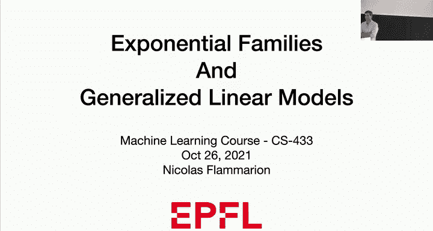


在本节课中，我们将要学习两个核心概念：**指数族** 和 **广义线性模型**。我们将从回顾线性回归和逻辑回归的动机开始，理解如何将概率模型推广到更广泛的分布类别，并学习如何利用这些模型进行统一的机器学习建模。

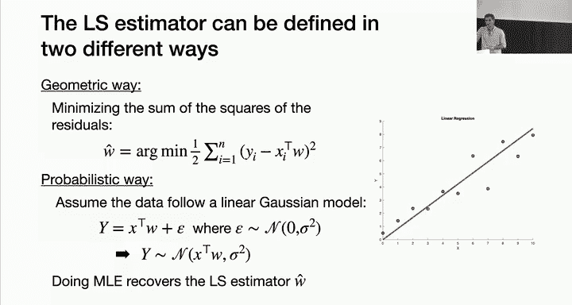

---

## 动机：从线性回归到更广泛的模型 🔄

上一节我们介绍了线性回归和逻辑回归。本节中我们来看看如何将它们统一到一个更广泛的框架中。

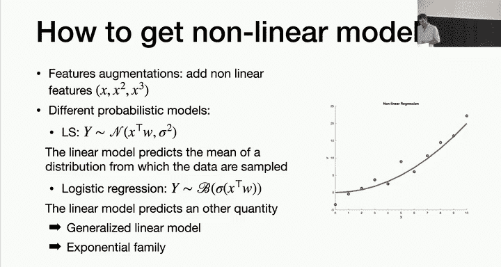

在线性回归中，我们有两种方式得到最小二乘估计器：
1.  **几何方法**：最小化残差平方和。
2.  **概率方法**：假设数据来自一个带有高斯噪声的线性模型 `y = x^T w + ε`，然后通过**最大似然估计**来恢复参数 `w`。

然而，线性模型对于许多复杂数据来说过于简单。我们通过**特征增强**（例如添加 `x^2`, `x^3` 等）来引入非线性。

另一种思路是考虑不同的概率模型。在线性回归中，线性预测 `x^T w` 直接预测了输出 `y` 的**条件均值**。在逻辑回归中，线性预测 `x^T w` 并不直接预测均值，而是预测了一个通过**链接函数**（sigmoid）与均值相关联的量。

这引出了一个问题：我们能否将这种思路推广到高斯分布和伯努利分布之外？答案是肯定的，这就是**指数族**和**广义线性模型**。

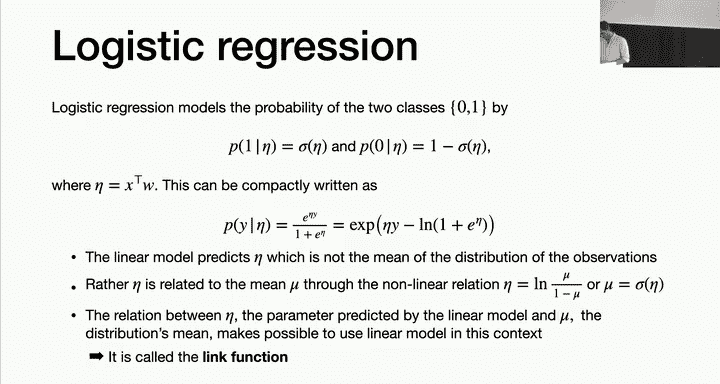

---

## 指数族分布 📊

指数族是一类非常重要的概率分布族，在统计学和信息论中广泛应用。它为许多常见的分布（如高斯、伯努利、泊松）提供了一个统一的表达形式。

一个分布属于指数族，如果其概率密度函数或质量函数可以写成以下形式：

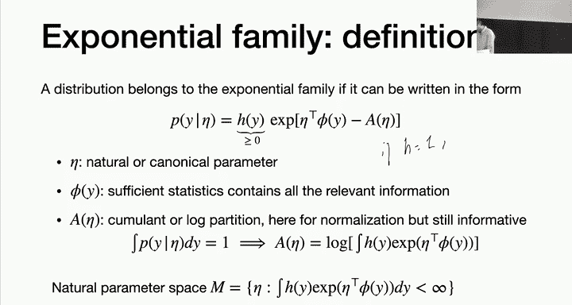

```
p(y | η) = h(y) * exp( η^T φ(y) - A(η) )
```

以下是公式中各项的含义：

*   **η**：**自然参数**或**典范参数**。
*   **φ(y)**：**充分统计量**。它包含了从数据中估计参数 `η` 所需的全部信息。
*   **h(y)**：一个只与 `y` 有关的非负函数。
*   **A(η)**：**对数配分函数**或**累积量函数**。它的作用是确保概率分布的归一化（积分为1）。其表达式为：
    ```
    A(η) = log( ∫ h(y) exp(η^T φ(y)) dy )
    ```


指数族的自由度由 `h(y)`, `φ(y)` 和 `η` 决定。我们只考虑使积分有限的 `η` 的集合，称为**自然参数空间**。

---

## 实例：常见分布属于指数族 ✅

让我们验证几个常见分布确实是指数族成员。

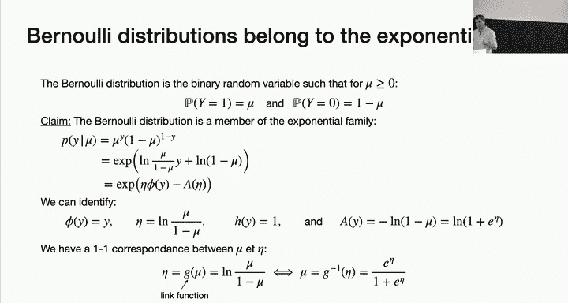

### 1. 伯努利分布 (Bernoulli)

伯努利分布描述二值随机变量（如抛硬币）。其概率为：
```
P(y | μ) = μ^y * (1-μ)^(1-y), 其中 y ∈ {0, 1}
```
我们可以将其重写为指数族形式：
```
P(y | η) = exp( η y - log(1 + exp(η)) )
```
其中：
*   **自然参数**：`η = log( μ / (1-μ) )`
*   **充分统计量**：`φ(y) = y`
*   **对数配分函数**：`A(η) = log(1 + exp(η))`
*   **基函数**：`h(y) = 1`

这里的链接函数 `g` 是 **logit 函数**：`η = g(μ) = log(μ/(1-μ))`。其反函数，即均值函数，正是 **sigmoid 函数**：`μ = σ(η) = exp(η)/(1+exp(η))`。

### 2. 高斯分布 (Gaussian)

单变量高斯分布 `N(μ, σ^2)` 的概率密度函数为：
```
p(y | μ, σ^2) = 1/√(2πσ^2) * exp( -(y-μ)^2/(2σ^2) )
```
经过代数变换，可以写成：
```
p(y | η) = exp( η_1 y + η_2 y^2 - A(η) )
```
其中：
*   **自然参数**：`η = [η_1, η_2]^T = [μ/σ^2, -1/(2σ^2)]^T`
*   **充分统计量**：`φ(y) = [y, y^2]^T`
*   **对数配分函数**：`A(η) = -η_1^2/(4η_2) - 1/2 log(-2η_2)`
*   **基函数**：`h(y) = 1/√(2π)`

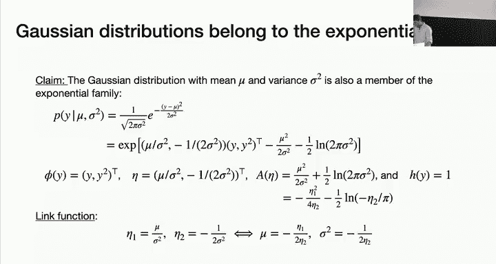

### 3. 泊松分布 (Poisson)

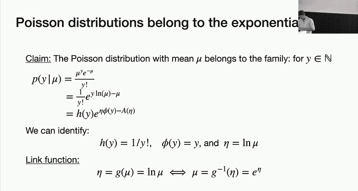

泊松分布常用于计数数据。其概率质量函数为：
```
P(y | μ) = (μ^y * e^{-μ}) / y!
```
可以重写为：
```
P(y | η) = (1/y!) * exp( η y - exp(η) )
```
其中：
*   **自然参数**：`η = log(μ)`
*   **充分统计量**：`φ(y) = y`
*   **对数配分函数**：`A(η) = exp(η)`
*   **基函数**：`h(y) = 1/y!`

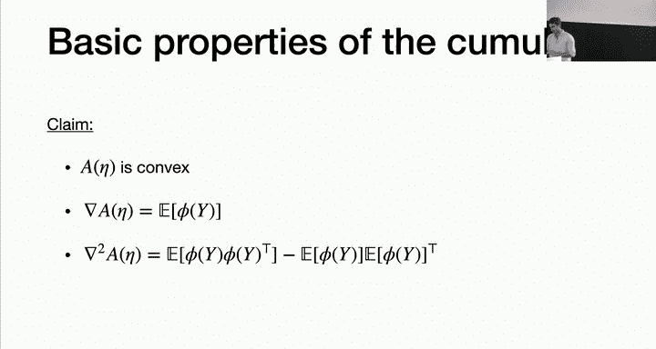

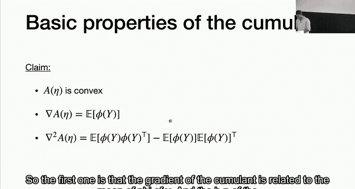

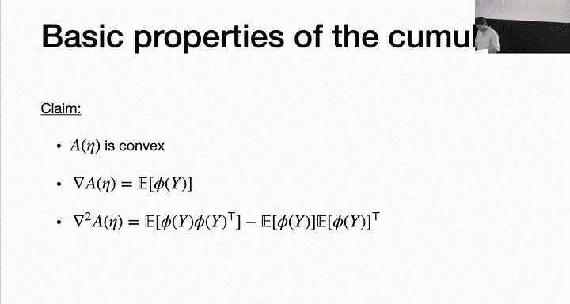

链接函数是**对数函数**：`η = log(μ)`。

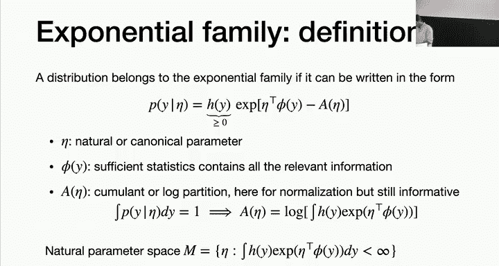


---

## 对数配分函数 A(η) 的性质 🔬

上一节我们看到了指数族的形式。本节中我们来看看其核心组件 `A(η)` 的两个关键性质，这些性质在推导广义线性模型时至关重要。

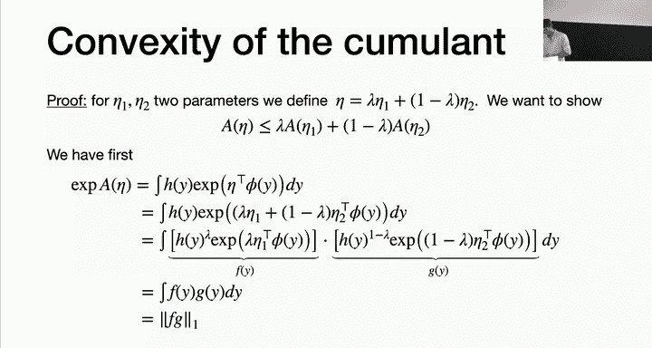

`A(η)` 具有以下优美性质：

1.  **凸性**：`A(η)` 是关于 `η` 的凸函数。
2.  **导数与矩**：
    *   一阶导数给出充分统计量的期望：`∇A(η) = E[φ(y)]`
    *   二阶导数（Hessian矩阵）给出充分统计量的协方差：`∇^2 A(η) = Cov(φ(y))`

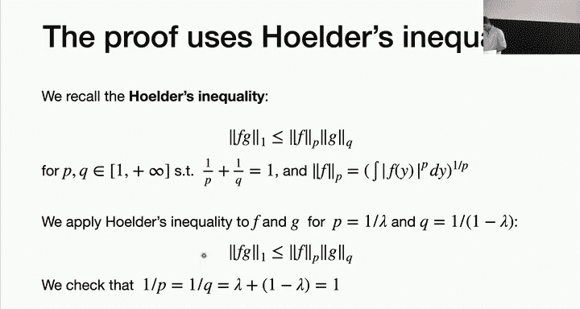

**性质1证明思路**：利用 `exp(A(η))` 的定义和 **Hölder 不等式**，可以直接验证凸函数的定义不等式成立。

**性质2证明**：通过对 `A(η) = log( ∫ h(y) exp(η^T φ(y)) dy )` 直接求梯度，并交换梯度与积分次序，可得：
```
∇A(η) = ∫ φ(y) * h(y) exp(η^T φ(y) - A(η)) dy = ∫ φ(y) p(y|η) dy = E[φ(y)]
```
求二阶导即可得到协方差。

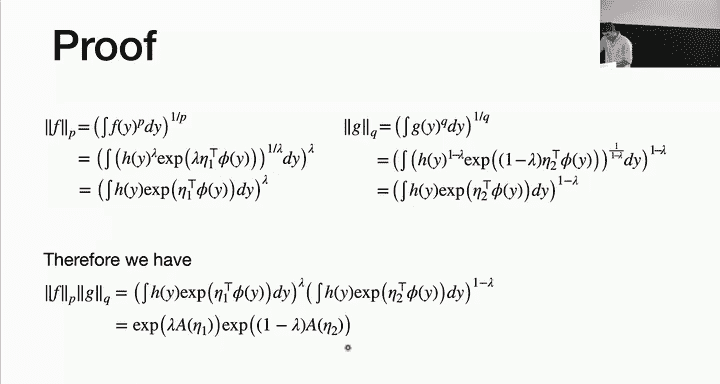

这些性质意味着，通过对 `A(η)` 求导，我们可以轻松得到分布的所有矩信息。

---

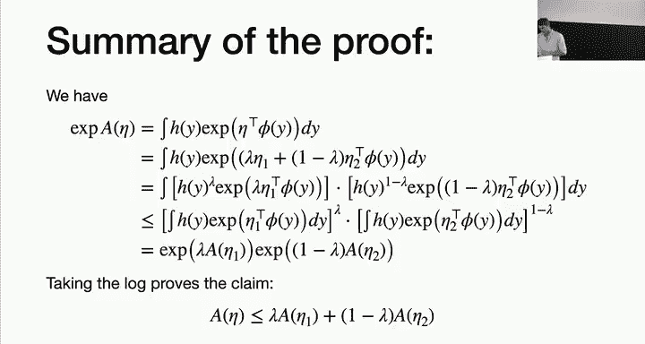

## 广义线性模型 🚀

前面我们为独立同分布数据介绍了指数族。现在，我们将其与机器学习中的预测问题结合，就得到了**广义线性模型**。

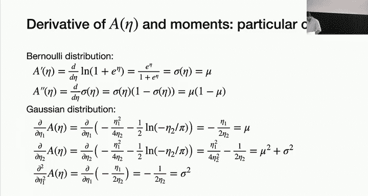

在广义线性模型中，我们对于每一个输入 `x`，假设输出 `y` 的条件分布是指数族的一员，并且其**自然参数 `η` 是输入 `x` 的线性函数**。

GLM 做出以下三个核心假设：

1.  **条件分布**：给定 `x`，`y` 的条件分布属于指数族：`p(y | x; w) = h(y) exp( η φ(y) - A(η) )`。
2.  **线性预测器**：自然参数 `η` 通过线性组合与输入相关联：`η = x^T w`。
3.  **链接函数**：系统的均值响应 `μ = E[φ(y) | x]` 通过一个可逆的链接函数 `g` 与线性预测器关联：`μ = g^{-1}(η) = g^{-1}(x^T w)`。

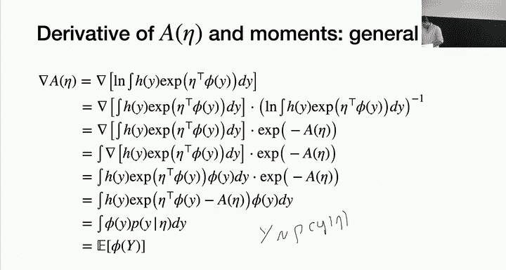

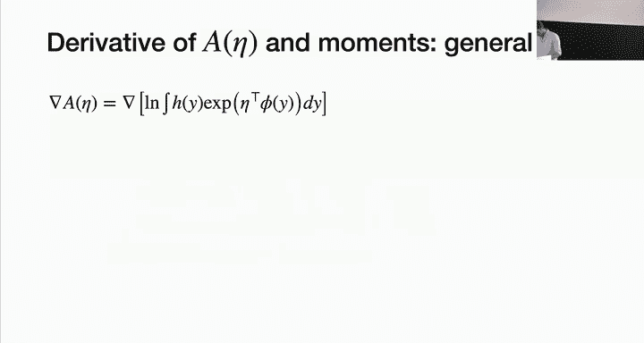

**重要说明**：当链接函数 `g` 使得 `η = g(μ)` 恰好等于分布的自然参数时（如伯努利中的 logit，泊松中的 log），该链接函数称为**典范链接函数**。使用典范链接可以简化计算。

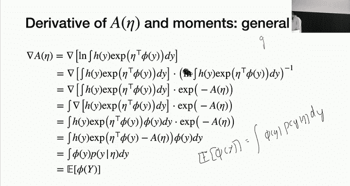

---

## GLM 的参数估计与学习 📈

给定数据集 `{(x_i, y_i)}`，假设数据由某个 GLM 生成，我们的目标是找到最优参数 `w`。我们使用**最大似然估计**。

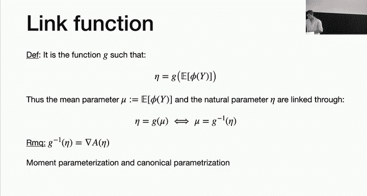


负对数似然函数为：
```
L(w) = -∑ [ log h(y_i) + η_i φ(y_i) - A(η_i) ]，其中 η_i = x_i^T w
```


由于 `-log h(y_i)` 项与 `w` 无关，`η_i φ(y_i)` 是 `w` 的线性项，而 `-A(η_i)` 是凸函数 `A` 与线性函数 `η_i(w)` 的复合，因此 `L(w)` 是关于 `w` 的**凸函数**。这意味着我们可以使用梯度下降等优化方法找到全局最优解。

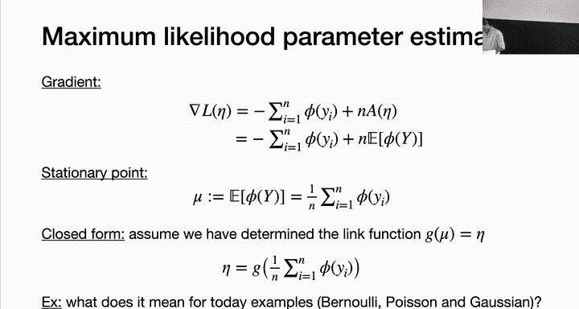

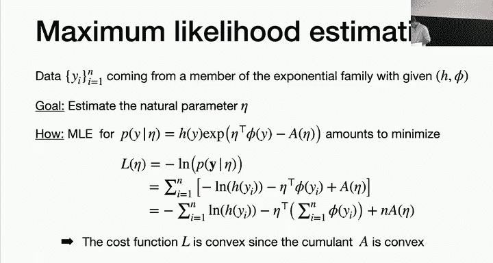

计算梯度并令其为零，我们可以得到似然方程。利用 `∇A(η) = E[φ(y)] = μ` 和链接函数 `μ = g^{-1}(η)`，方程可以写为：
```
∑ [ (y_i - μ_i) * (∂μ_i/∂η_i) * x_i ] = 0
```
其中 `μ_i = g^{-1}(x_i^T w)`。这个方程正是我们在线性回归（`g` 为恒等函数）和逻辑回归（`g^{-1}` 为 sigmoid）中看到的正规方程的推广形式。

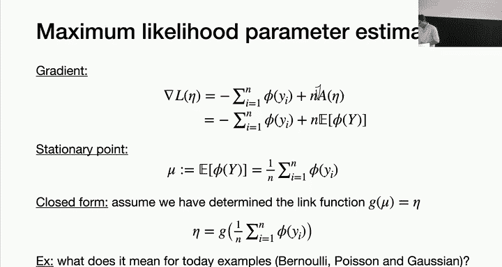

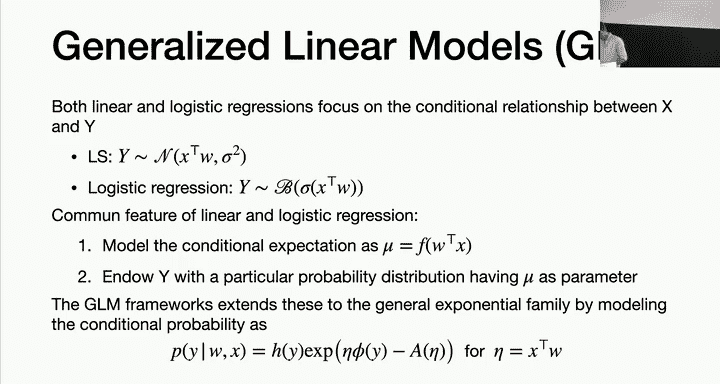

---

## 总结 🎯

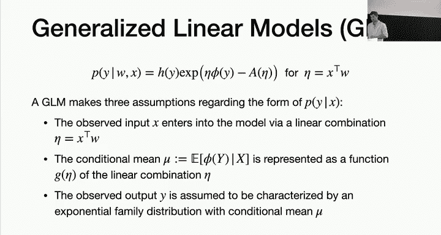

本节课中我们一起学习了：

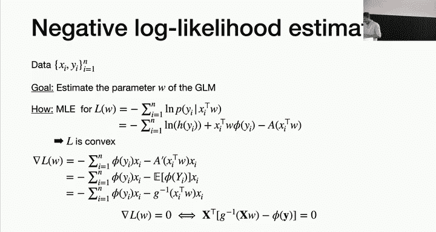

1.  **指数族**：一个统一表达多种概率分布（高斯、伯努利、泊松等）的框架，其形式为 `p(y|η) = h(y) exp(η^T φ(y) - A(η))`。
2.  **指数族的性质**：对数配分函数 `A(η)` 是凸函数，其导数给出了充分统计量的期望和方差。
3.  **广义线性模型**：将指数族用于预测建模。其核心是假设响应变量 `y` 的条件分布属于指数族，且其自然参数 `η` 是输入特征 `x` 的线性组合（`η = x^T w`），并通过一个链接函数与均值关联。
4.  **GLM 的学习**：通过最大似然估计来拟合 GLM，其负对数似然损失是凸函数，保证了优化过程的可靠性。

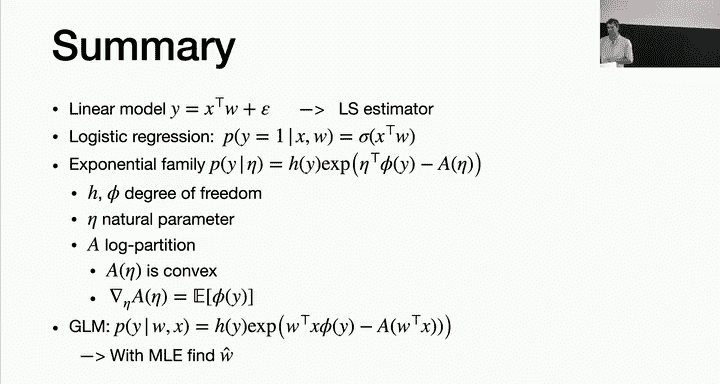

GLM 的强大之处在于，它为我们提供了一套系统的方法，将线性模型的思想扩展到各种类型的响应数据（连续值、二分类、计数等），而无需为每种情况单独推导学习算法。