# 17：最近邻分类器与维度诅咒 📚

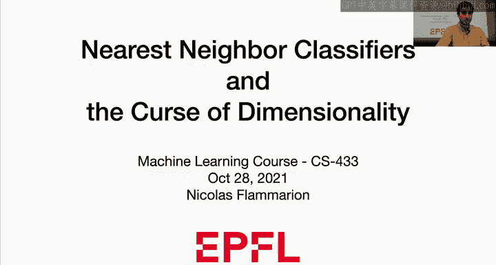

在本节课中，我们将学习最近邻分类器，并探讨所谓的“维度诅咒”。我们将看到，最近邻方法既可用于分类，也可用于回归。今天我们将主要讨论分类场景，但请记住，它同样适用于回归。

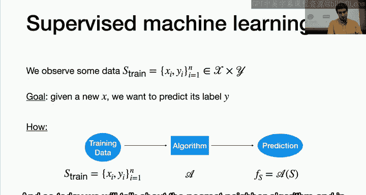

我们将首先正确定义最近邻方法，然后查看其不同版本，并尝试分析它在何时有效、何时无效。在本节课的最后，我们将对 **k=1** 的情况进行正式分析。

本节课的核心要点是：在低维输入空间中，如果你有足够的数据，最近邻方法会表现得非常好，能够建模非常复杂的决策边界。然而，随着输入空间维度的增加，该方法将不再有效。因此，它本质上是一种在低维空间中表现优异的方法。

---

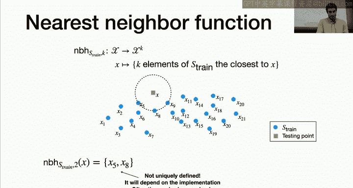

## 监督学习场景回顾 📖

首先，我们快速回顾一下监督学习的设置。我们有一个训练集 **S_train**，目标是利用这个训练集，当给定一个新的输入 **x** 时，预测其输出 **y**。通常，我们会使用训练集学习一个算法 **A**，然后用这个算法进行预测。今天我们要讨论的算法就是**最近邻算法**。

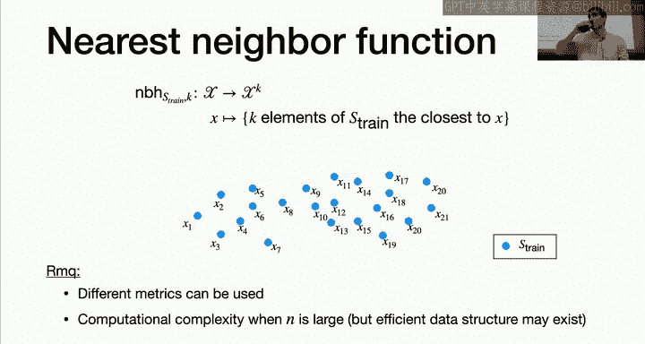

---

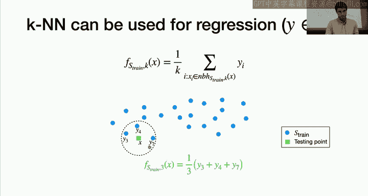

## 最近邻函数的定义 🎯

为了定义最近邻，我们首先需要一个函数，称为 **最近邻函数**。

**定义**：
我们有一个输入空间 **X**，一个训练集 **S_train**，以及一个参数 **k**（即我们要寻找的邻居数量）。函数 **N(S_train, k, x)** 的输出是训练集中与输入点 **x** 最接近的 **k** 个元素。

这个定义很明确：给定训练集和 **k**，你寻找训练集中与点 **x** 距离最小的 **k** 个点。

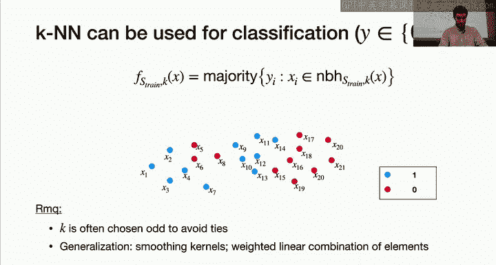

**什么是“最接近”？**
它意味着最小的距离。这里我们假设已经定义了一个距离度量，例如欧几里得距离。

**示例**：
假设我们有一个测试点 **x**，我们寻找它的3个最近邻点。我们会在训练集中找到距离 **x** 最近的三个点。

**注意**：
有时，可能存在多个点与 **x** 的距离完全相同。在这种情况下，最近邻的集合可能不是唯一定义的，具体取决于你的实现方式（例如，可能选择索引最小的前两个点）。在实践中，这种情况不常发生，但了解这一点很重要。

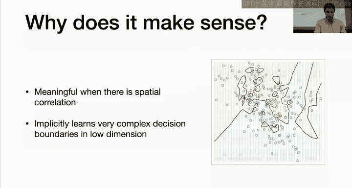

---

## 关于最近邻函数的说明 💡

关于这个函数，有几点需要注意：
1.  **隐含的距离度量**：你隐式地假设了一个距离（如欧几里得距离）。如果改变距离度量（例如使用其他 Lp 距离或任何自定义度量），函数的行为也会改变。
2.  **计算复杂度**：查询最近邻的复杂度通常是 **O(N)**，其中 N 是训练集的大小。因为为了找到最近的点，你可能需要检查所有点。有时，通过特定的数据结构（如 k-d 树）可以实现亚线性的近似算法，但今天我们假设计算是“免费”的。

这个函数定义简单明确，现在我们将用它来定义用于回归和分类的最近邻规则。

---

## 最近邻回归 📈

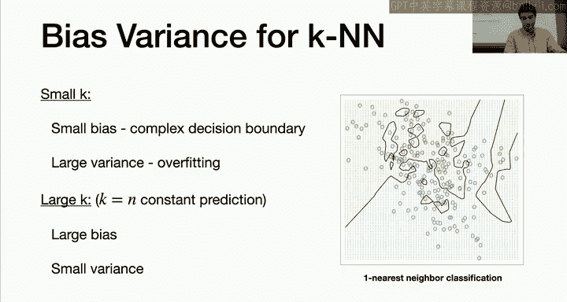

对于回归任务，做法很简单：
1.  找到点 **x** 的 **k** 个最近邻。
2.  计算这些邻居的输出值 **y_i** 的平均值。
3.  将这个平均值作为你的预测值。

**公式**：
`预测值 = (1/k) * Σ( y_i )`，其中求和针对 **k** 个最近邻的标签。

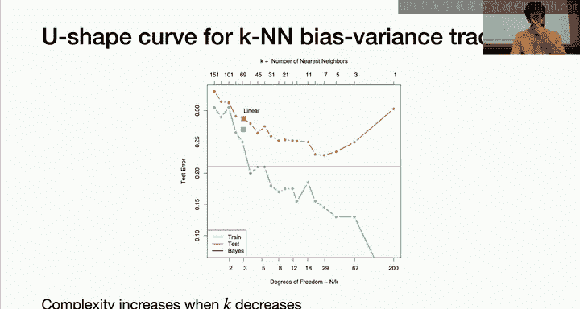

**示例**：
对于一个点 **x**，其三个最近邻的输出值分别为 **y1**, **y2**, **y3**，则预测值为 `(y1 + y2 + y3) / 3`。

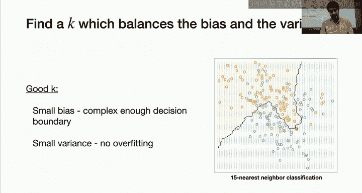

---

## 最近邻分类 🏷️

对于分类任务，做法类似，但使用**多数投票**：
1.  找到点 **x** 的 **k** 个最近邻。
2.  统计这些邻居中每个类别出现的次数。
3.  预测出现次数最多的类别（即进行多数投票）。

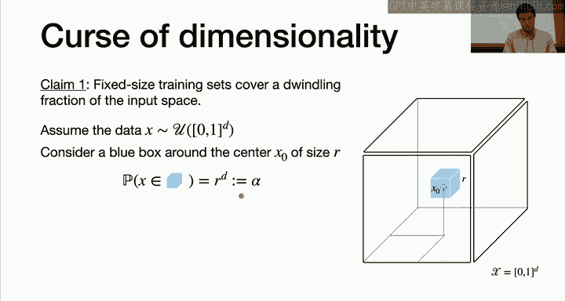

**示例**：
对于一个点 **x**，其三个最近邻的标签分别是 `[0, 1, 0]`。通过多数投票，类别 `0` 出现两次，类别 `1` 出现一次，因此预测类别为 `0`。

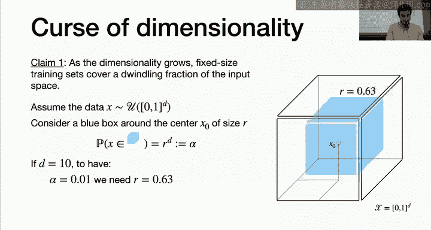

**平局问题**：
如果 **k** 是偶数，可能会出现两个类别票数相同的情况（例如，两个邻居是类别0，两个是类别1）。为了避免这种不确定性，一个常见的技巧是**选择奇数的 k 值**，这样总能产生一个明确的获胜类别。

**扩展**：
当 **k** 很大时，你可能不希望所有邻居的权重相同，而希望给更近的点更高的权重。这引出了**核平滑方法**，但今天我们只讨论简单的多数投票。在理论分析中，我们甚至会专注于最简单的情况：**k=1**。此时，你只需找到最近的一个点，并输出与其相同的标签。

---

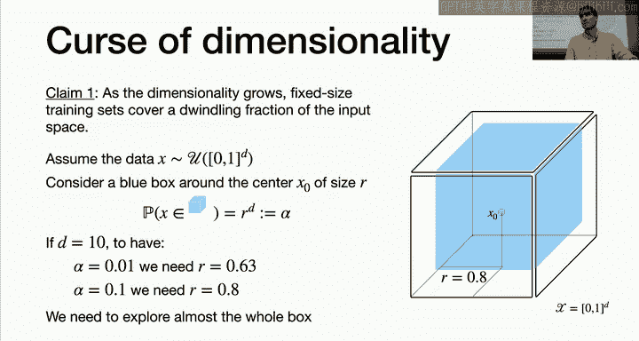

## 最近邻方法何时有意义？ 🤔

最近邻方法只有在数据点之间存在**空间相关性**时才有意义。也就是说，你需要相信“相近的点很可能具有相同的标签”。如果这个假设成立，那么使用最近邻分类就是合理的。

反之，如果输出 **y** 与输入 **x** 完全独立（例如随机抛硬币），那么使用邻近点的信息进行预测就没有任何意义。

最近邻方法在**低维空间**中且数据点足够多时非常有效。它可以学习非常复杂的决策边界，这是其优点。例如，对于某些复杂的数据集，线性模型（如逻辑回归）可能无法很好地区分类别，但最近邻方法可以。

---

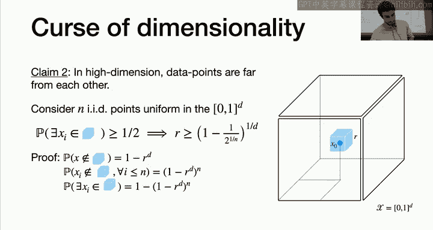

## 参数 k 与偏差-方差权衡 ⚖️

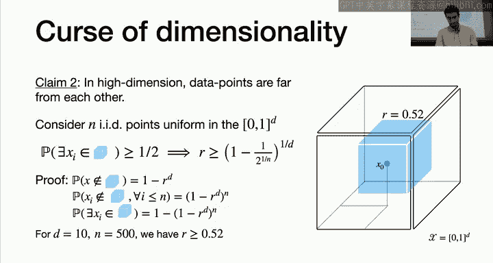

参数 **k** 控制着模型的复杂度，并与我们之前讨论的**偏差-方差权衡**密切相关。

*   **k 很小（例如 k=1）**：
    *   **低偏差**：模型非常灵活，能够拟合复杂的决策边界。
    *   **高方差**：预测结果对训练数据非常敏感。换一个训练集，最近邻点可能完全不同，导致预测结果变化很大。这本质上是**过拟合**。

*   **k 很大（例如 k = N，即训练集大小）**：
    *   **高偏差**：模型变得非常简单。对于分类，预测结果将是整个训练集中最多的类别（一个常数预测），无法捕捉数据中的复杂模式。
    *   **低方差**：预测结果非常稳定，几乎不随训练集的变化而改变。这本质上是**欠拟合**。

因此，我们需要选择一个合适的 **k** 值，在偏差和方差之间取得平衡，从而获得良好的测试性能。实验表明，测试误差随 **k** 的变化通常呈 U 形曲线。选择合适的 **k**（例如下图中 k=11），可以使最近邻方法的性能优于简单的线性分类器。

---

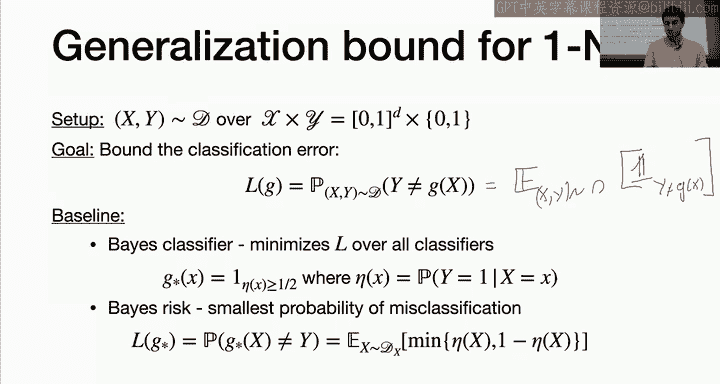

## 维度诅咒 😱

到目前为止，我们看到在低维且数据充足时，最近邻方法效果很好。现在我们要探讨为什么在**高维空间**中，这个方法会失效。这就是所谓的“维度诅咒”。

核心思想是：在低维空间中，“邻居”的概念很直观。但在高维空间中，数据点会变得非常稀疏，所有点之间的距离都差不多，因此“最近邻”的概念就失去了意义。

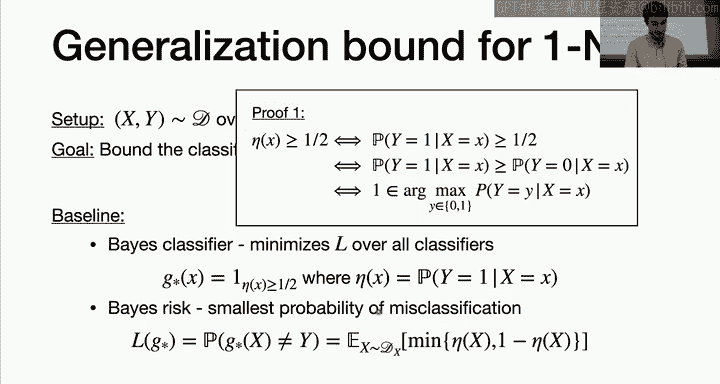

### 第一个论断：固定训练集大小，增加维度

假设我们的输入空间是 **D** 维超立方体 `[0, 1]^D`，数据点均匀分布在其中。考虑中心点 **x0** 和一个边长为 **r** 的小超立方体（以 **x0** 为中心）。

**问题**：随机采样一个新点 **x**，它落在这个小超立方体中的概率是多少？
**答案**：概率是 `r^D`（小立方体体积）除以 `1^D`（大立方体体积），即 `r^D`。

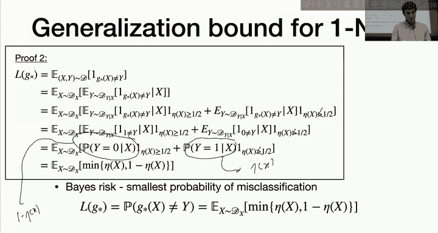

**分析**：
*   设我们想让这个概率为 `α`（例如 10% 或 1%），则需要 `r = α^(1/D)`。
*   当维度 **D** 增大时，为了保持一个固定的概率 `α`，所需的边长 **r** 会急剧增大。
*   例如，`D=10`，`α=1%` 时，`r ≈ 0.63`。`α=10%` 时，`r ≈ 0.8`。

这意味着，在高维空间中，为了捕捉哪怕一小部分（如10%）的数据点来进行局部平均，你实际上需要考察几乎整个空间的大部分区域。因此，“局部性”不复存在。

### 第二个论断：高维空间中点与点之间的距离

同样考虑 **D** 维超立方体 `[0, 1]^D`，其中有 **n** 个均匀分布的训练点。再次考虑中心点 **x0**。

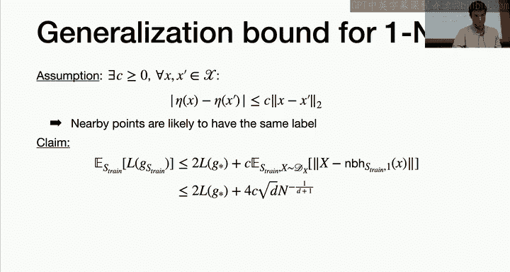

**问题**：为了以大于 1/2 的概率，使得至少有一个训练点落在以 **x0** 为中心、边长为 **r** 的小超立方体内，**r** 需要多大？
**推导**：
1.  一个随机点落在小立方体内的概率是 `r^D`。
2.  **n** 个点全部不落在小立方体内的概率是 `(1 - r^D)^n`。
3.  至少有一个点落在内的概率是 `1 - (1 - r^D)^n`。
4.  令此概率 > 1/2，可解得 `r > (1 - (0.5)^(1/n))^(1/D)`。

**分析**：
*   固定 **n=500**，**D=10**，计算可得 `r > 0.52`。
*   这意味着，即使有500个点，在10维空间中，为了有超过一半的机会找到一个“邻居”，你需要考察一个边长超过0.52的超立方体（占据了超过一半的坐标范围）。

结论：在高维空间中，所有点都显得非常遥远，最近邻的概念变得模糊且不可靠。数据点更多地分布在空间的边界附近，而不是内部。

---

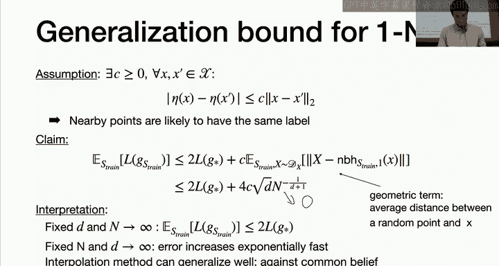

## 最近邻分类器的理论分析（k=1）🔬

现在，我们尝试从理论上分析**1-最近邻分类器**的泛化性能，并将其与最优分类器（贝叶斯分类器）进行比较。这将进一步印证我们对维度诅咒的直觉。

### 问题设置

*   数据 `(X, Y)` 服从分布 **D**，定义在 `X × Y` 上，其中 `X = [0, 1]^D`，`Y = {0, 1}`。
*   分类错误率（风险）定义为：`R(g) = P_{(X,Y)~D}[ g(X) ≠ Y ]`，其中 `g` 是我们的分类器。

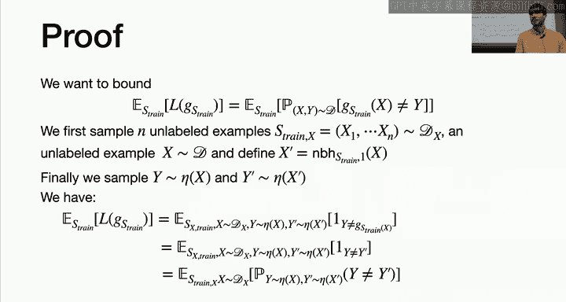

### 贝叶斯分类器：最优基准

*   定义条件概率 `η(x) = P(Y=1 | X=x)`。
*   如果我们知道真实分布 **D**（即知道 `η(x)`），那么最优分类器（贝叶斯分类器） `g*` 的预测规则为：
    `g*(x) = 1 如果 η(x) > 1/2，否则为 0`。
*   贝叶斯分类器的风险（最小可能错误率）为：
    `R* = E_X [ min( η(X), 1 - η(X) ) ]`。

### 最近邻分类器的误差上界

我们分析1-最近邻分类器 `g_nn` 的**期望风险**（对训练集取平均）。

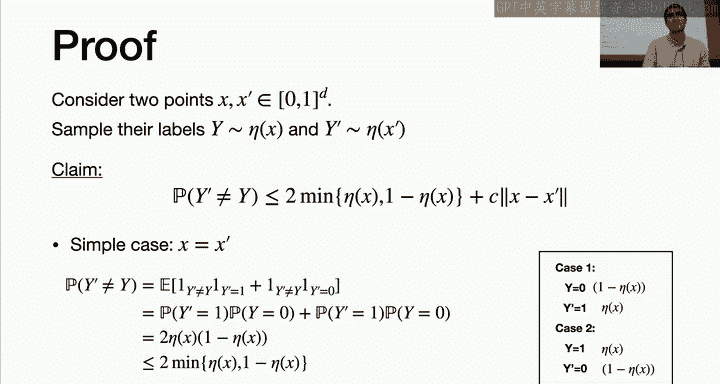

**核心假设（空间相关性）**：
我们假设条件概率函数 `η(x)` 是 **L-利普希茨连续**的。即存在常数 **C**，使得对于任意 `x, x’`，有：
`|η(x) - η(x’)| ≤ C * ||x - x’||`。
这个假设意味着：如果两个点距离很近，那么它们属于同一类别的概率也很接近。

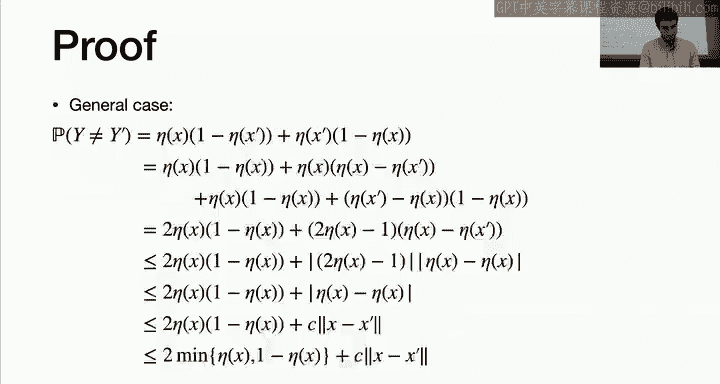

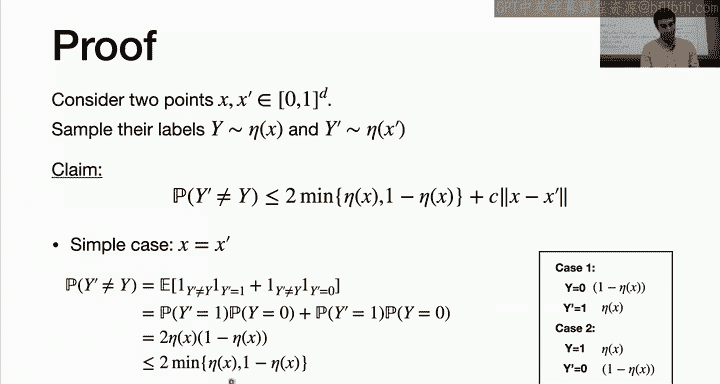

**定理**：
在以上假设下，1-最近邻分类器的期望风险满足以下上界：
`E_{S_train}[ R(g_nn) ] ≤ 2 * R* + C * E_{X, S_train}[ ||X - X_{(1)}|| ]`

其中：
*   `R*` 是贝叶斯风险（最优风险）。
*   第二项 `E[ ||X - X_{(1)}|| ]` 是一个**几何项**，表示一个随机点 **X** 到其训练集中最近邻点 `X_{(1)}` 的平均距离。

**解读**：
1.  最近邻分类器的误差最多是最优分类器的两倍，再加上一个附加项。
2.  附加项依赖于：
    *   **C**：空间相关性的强度。C 越小，相关性越强，该项越小。
    *   平均最近邻距离：如果数据密集，最近邻很近，该项就小。

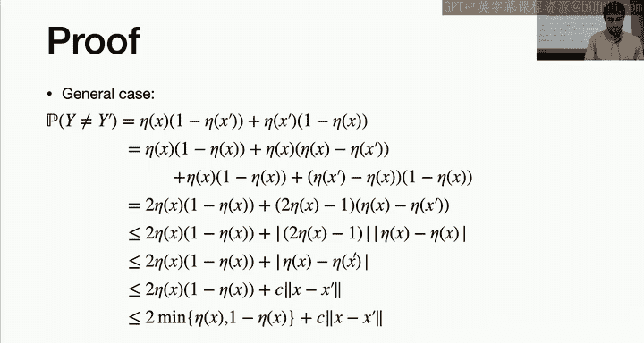

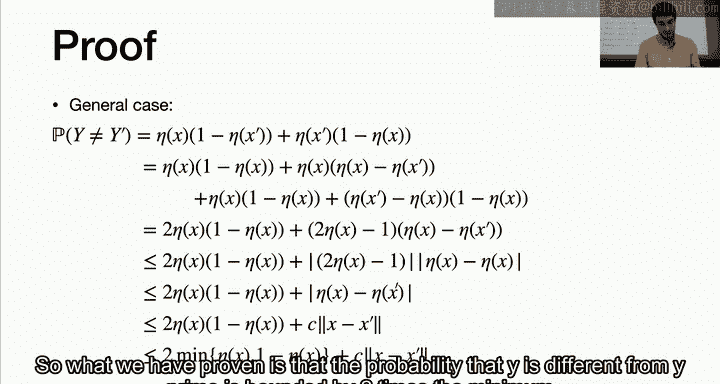

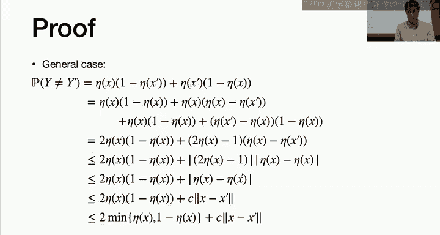

### 几何项与维度的关系

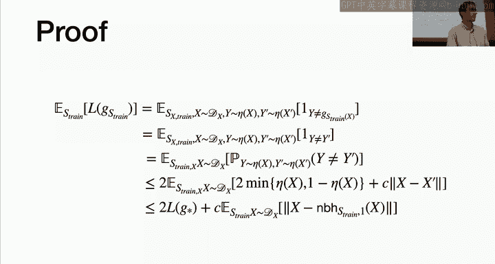

可以证明，在 **D** 维超立方体 `[0, 1]^D` 中，若数据均匀分布，则有：
`E[ ||X - X_{(1)}|| ] = O( sqrt(D) * n^{-1/(D+1)} )`

**分析**：
*   **固定维度 D，增加样本数 n**：该项以 `~ n^{-1/(D+1)}` 的速率趋于 0。因此，当数据很多时，1-最近邻分类器的风险接近 `2R*`，表现不错。
*   **固定样本数 n，增加维度 D**：由于指数项 `-1/(D+1)` 的绝对值随着 D 增大而减小，`n^{-1/(D+1)}` 会趋近于 1。再乘以 `sqrt(D)`，该项会变得非常大。这意味着，如果维度很高而数据量不足，误差上界会变得很松，性能可能急剧下降。

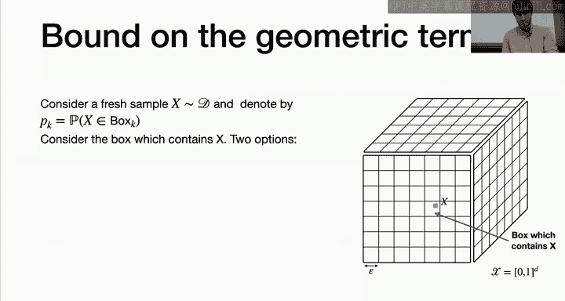

这从理论上解释了**维度诅咒**：为了在高维空间中获得好的性能，所需的数据量 **n** 需要随维度 **D** 指数级增长，这通常是不现实的。

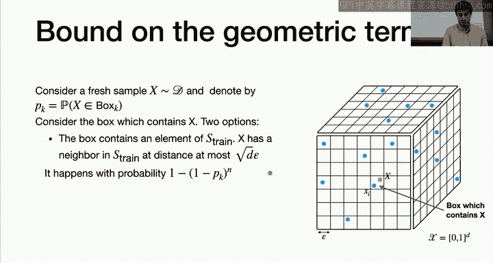

---

## 总结 📝

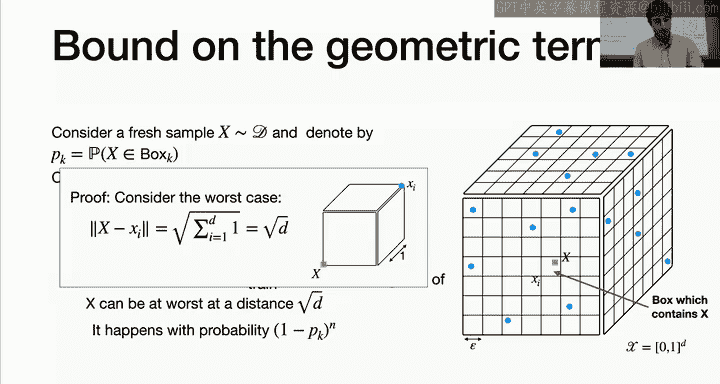

本节课我们一起学习了最近邻分类器。

1.  **定义与使用**：我们定义了最近邻函数，并说明了如何将其用于回归（取平均）和分类（多数投票）。选择奇数的 **k** 值可以避免平局。
2.  **偏差-方差权衡**：参数 **k** 控制模型复杂度。**k 小**则偏差低、方差高（过拟合）；**k 大**则偏差高、方差低（欠拟合）。需要选择合适的 **k** 以平衡两者。
3.  **维度诅咒**：在高维空间中，数据变得极其稀疏，点与点之间的距离趋于相似，“最近邻”的概念失效。为了进行有意义的局部估计，所需的数据量随维度指数增长，这在实际中往往无法满足。
4.  **理论分析**：在空间相关性（利普希茨条件）的假设下，我们分析了1-最近邻分类器的泛化误差上界。其上界包含最优误差的2倍和一个与平均最近邻距离成正比的项。该几何项的行为揭示了维度诅咒的根源：在固定数据量下，高维空间中的平均最近邻距离很大，导致性能下降。

最近邻方法是一种简单直观的非参数方法，在低维小规模问题中非常有效。但在处理高维数据时，必须警惕维度诅咒带来的挑战。