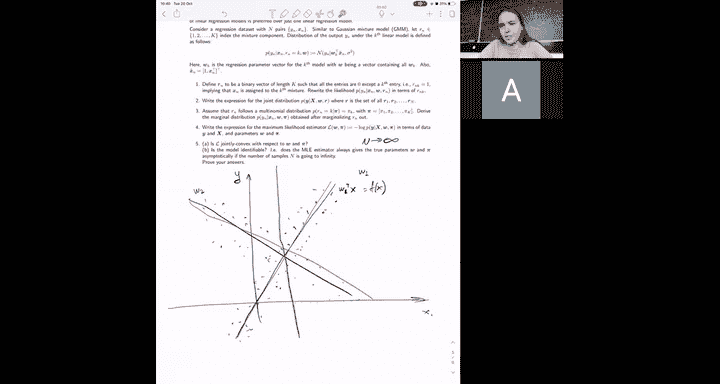

# 18：习题6入门指南 📚

在本节课中，我们将学习习题6的主要内容。本次习题包含三个核心问题，旨在帮助大家巩固凸函数性质、多类别分类以及混合线性回归模型的知识。由于下周有项目截止日期，本次习题仅包含三个问题，以便大家有更多时间在习题课上讨论项目相关问题。

---

## 凸函数与严格凸函数的性质 🔍

上一节我们介绍了习题的整体结构，本节中我们来看看第一个问题：凸函数与严格凸函数的性质证明。这些性质在机器学习中非常有用，例如，损失函数通常表现为多个独立损失项的和，了解其凸性有助于证明优化算法的收敛性。

以下是需要证明的几个关键性质：
*   凸函数与凸函数的和仍然是凸函数。
*   凸函数与一个单调递增函数的复合仍然是凸函数。
*   严格凸函数具有唯一的极小值点。

这些性质对于理解线性回归、逻辑回归等模型的损失函数形式至关重要。

---

## 多类别分类与Softmax函数 🎯

在之前的课程中，我们学习了二分类问题。本节我们将问题扩展到多类别分类。在多分类中，样本标签可以是K个类别中的任何一个。

与二分类仅有一组参数 **w** 不同，多分类为每个类别k都配备了一组参数 **w_k**。对于每个数据点 **x_n**，我们计算其与所有 **w_k** 的点积。然而，直接取最大值作为类别分配的函数并不可微，且不能给出类别的概率分布。

因此，我们引入 **Softmax** 函数。对于一个固定的数据点 **x_n**，它属于类别k的概率由以下公式给出：

**公式：** `P(y = k | x_n) = exp(w_k^T x_n) / (∑_j exp(w_j^T x_n))`

该函数确保了所有类别的概率之和为1，并且点积值较大的类别将获得较高的概率。与逻辑回归类似，我们假设样本独立同分布，可以写出联合概率分布。在本问题中，你需要推导对数似然函数、关于 **w_k** 的梯度，并证明该对数似然函数是凸函数。

---

## 混合线性回归模型 🧩

最后一个问题涉及混合线性回归模型。在标准线性回归中，我们使用一个线性模型拟合数据。但在某些情况下，数据可能来自多个不同的线性关系。

混合线性回归模型假设有K个混合成分，每个成分都有自己的参数 **w_k** 和权重 **π_k**。数据点围绕这些不同的“线”生成，如下图所示。如果只用一个线性模型拟合，效果会很差。

在本问题中，你需要：
*   推导该模型的最大似然估计量，以找到参数 **W** 和 **π**。
*   分析该似然函数的性质（例如，是否是联合凸的）。
*   讨论该模型是否是可识别的，即当数据量趋于无穷时，是否能唯一确定参数。

---

## 总结与建议 📝

本节课中，我们一起学习了习题6的三个核心部分：凸函数的性质证明、多类别分类的Softmax模型以及混合线性回归。这些内容涵盖了机器学习中的重要概念和模型。

请务必参加习题课，助教们将非常乐意解答大家关于习题和项目的任何疑问。

