# 19：支持向量机 (SVM) 🎯

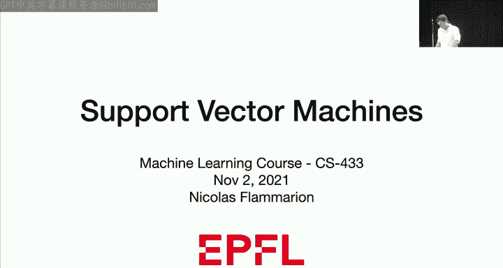

在本节课中，我们将学习支持向量机 (SVM)，这是一种非常重要且强大的线性分类器。我们将从最大间隔的概念出发，探讨如何找到最优的分类超平面，并学习如何处理线性不可分的数据。我们还将介绍凸优化的基本概念，并了解如何通过其对偶形式更高效地求解SVM问题。

---

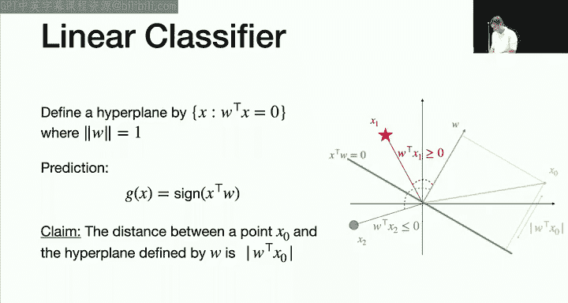

## 1. 线性分类器回顾 📐

上一节我们介绍了分类的基本概念，本节中我们来看看线性分类器的具体框架。

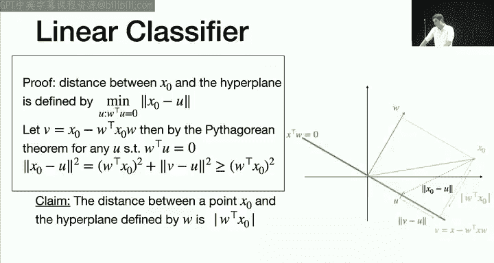

我们定义一个超平面。给定一个向量 **w**（假设其范数为1，即 `||w|| = 1`），由 **w** 定义的法平面 **H** 是所有满足 `x^T w = 0` 的点 **x** 的集合。这就是我们的超平面。

我们可以使用这个超平面进行分类。对于一个新数据点 **x**，我们预测其标签为 `sign(x^T w)`。例如，对于一个点 **x1**，如果内积 `x1^T w` 为正，则将其分类为+1；对于点 **x2**，如果内积 `x2^T w` 为负，则将其分类为-1。

一个非常重要的性质是，一个点 **x0** 到超平面的距离等于 `|x0^T w|` 的绝对值。这是因为我们假设了 `||w|| = 1`。

**距离公式证明**：
点 **x0** 到超平面 **H** 的距离定义为到 **H** 上任意点 **u** 的最小距离，即 `min_{u in H} ||x0 - u||`。可以证明，这个最小值在 **u** 等于 **x0** 在 **w** 方向上的投影时取得，该距离恰好等于 `|x0^T w|`。

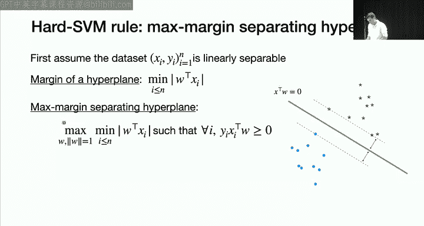

---

## 2. 硬间隔支持向量机 (Hard-Margin SVM) 🛡️

上一节我们回顾了线性分类器，本节中我们来看看如何定义最大间隔超平面。

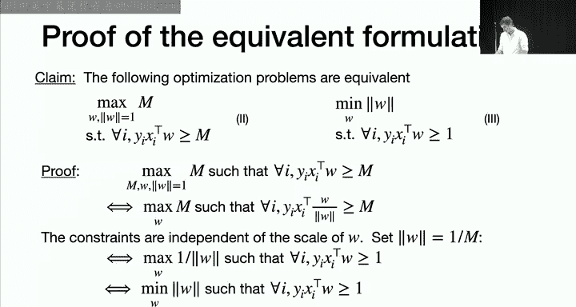

首先，我们假设数据集是**线性可分**的。这意味着存在一个超平面，能够将所有正类样本（红色点）和负类样本（蓝色点）完全分开。然而，这样的超平面通常有很多个。问题是：我们应该选择哪一个？

一个合理的想法是选择**间隔最大**的那个超平面，即离所有训练样本点都最远的那个。这样，即使数据有轻微扰动，这个超平面仍然很可能保持良好的泛化性能。

**如何定义最大间隔？**
一个超平面的**间隔**是其到所有训练样本点距离中的最小值。对于样本点 `(x_i, y_i)`，其到超平面 **w** 的距离是 `|x_i^T w|`。因此，超平面 **w** 的间隔 `M(w)` 为：
`M(w) = min_i |x_i^T w|`

**最大间隔超平面的数学定义**：
我们寻找一个方向 **w** (`||w||=1`)，在满足所有样本都被正确分类（即 `y_i (x_i^T w) > 0`）的条件下，最大化其间隔 `M(w)`。这等价于以下优化问题：
`max_{w: ||w||=1} min_i y_i (x_i^T w)`

可以证明，最大间隔超平面位于两个类别最近点的“正中间”。

**等价形式**：
上述问题可以重新表述为以下更易处理的形式：
`min_w ||w||^2`
约束条件为：`y_i (x_i^T w) >= 1`，对于所有 `i=1,...,n`。

在这个形式中，我们不再约束 `||w||=1`，而是最小化 `||w||^2`，同时要求所有样本点距离超平面的函数间隔至少为1。间隔的实际宽度为 `2 / ||w||`，因此最小化 `||w||` 等价于最大化间隔。

---

## 3. 软间隔支持向量机 (Soft-Margin SVM) 🧸

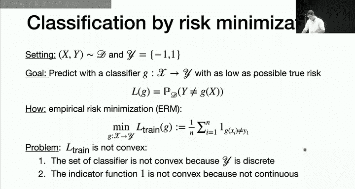

上一节我们讨论了线性可分的情况，但在现实中，数据往往是线性不可分的。本节中我们来看看如何处理这种情况。

我们不再要求所有数据点都必须被正确分类，而是允许一些点违反间隔约束。为此，我们引入**松弛变量** `ξ_i >= 0`。

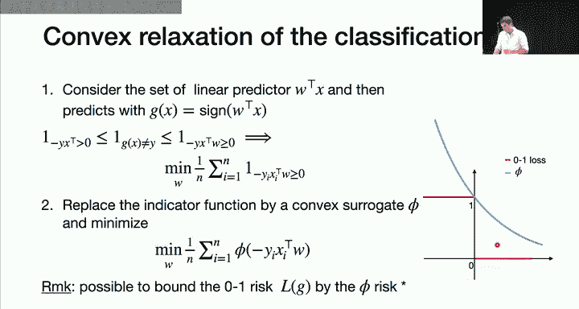

我们将原来的约束 `y_i (x_i^T w) >= 1` 放松为：
`y_i (x_i^T w) >= 1 - ξ_i`

`ξ_i` 衡量了第 `i` 个样本违反约束的程度。如果 `ξ_i = 0`，则该点被正确分类且在间隔之外；如果 `ξ_i > 0`，则该点可能位于间隔内或被错误分类。

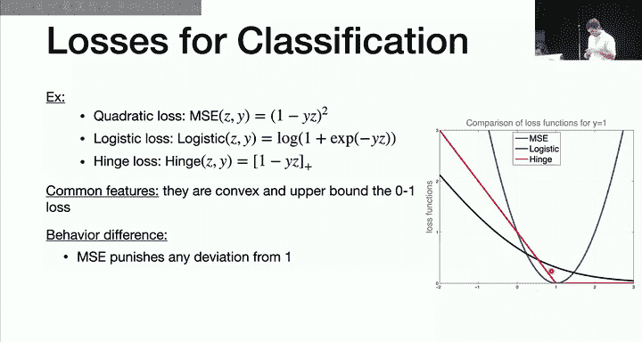

**软间隔SVM的优化问题**：
我们联合最小化两项：一项是最大化间隔（即最小化 `||w||^2`），另一项是惩罚约束违反（即最小化所有 `ξ_i` 之和）。这通过一个参数 `λ` 来权衡：
`min_{w, ξ} λ ||w||^2 + Σ_i ξ_i`
约束条件为：`y_i (x_i^T w) >= 1 - ξ_i` 且 `ξ_i >= 0`。

*   当 `λ` 很大时，我们非常看重大间隔，对分类错误容忍度低（趋向于硬间隔）。
*   当 `λ` 很小时，我们更看重正确分类，允许间隔变小。

**合页损失 (Hinge Loss) 形式**：
上述优化问题可以等价地写成一个无约束的**正则化经验风险最小化**问题：
`min_w λ ||w||^2 + Σ_i max(0, 1 - y_i (x_i^T w))`

其中，`max(0, 1 - z)` 被称为**合页损失 (Hinge Loss)**。这个形式清晰地表明，SVM是在最小化合页损失加上L2正则项。

---

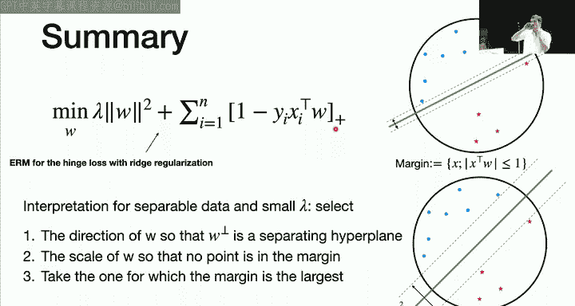

## 4. 从经验风险到凸替代损失 📉

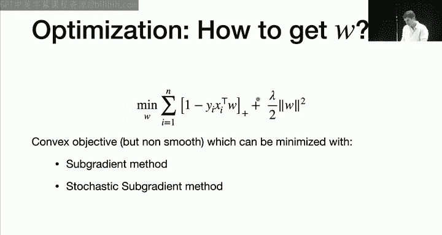

上一节我们引入了合页损失，本节中我们来看看它如何从更一般的分类框架中产生。

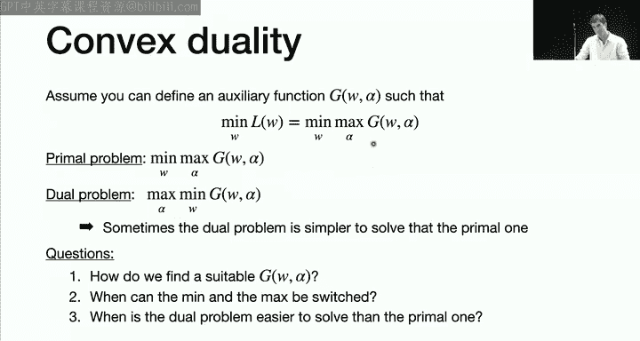

在二分类问题中（标签 `y ∈ {-1, +1}`），我们真正想最小化的是**0-1损失**对应的风险（即错误率）：
`R(g) = P(g(x) ≠ y)`
由于真实分布未知，我们使用经验风险 `R_n(g) = (1/n) Σ_i I{g(x_i) ≠ y_i}` 来近似。

然而，直接最小化0-1经验风险有两个问题：
1.  分类器集合 `g` 不连续，不是凸集。
2.  指示函数 `I{·}` 不连续且非凸，导致优化极其困难。

**解决方案：使用凸替代损失**
我们进行两步放松：
1.  **限制分类器形式**：只考虑线性分类器，即 `g(x) = sign(x^T w)`。
2.  **替代损失函数**：用凸函数 `φ(z)` 替代非凸的0-1损失 `I{z <= 0}`，其中 `z = -y (x^T w)`。我们最小化**φ-风险**：`(1/n) Σ_i φ(-y_i (x_i^T w))`。

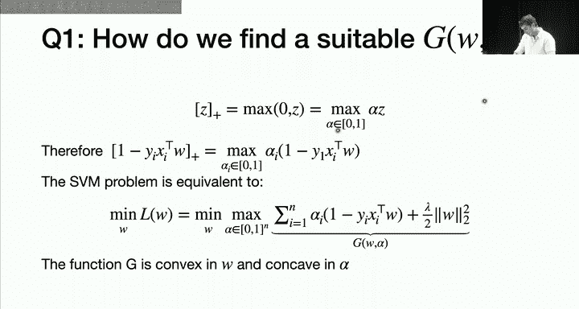

理论证明，在合适的条件下，最小化凸替代损失得到的解，在0-1损失下也有好的性能。

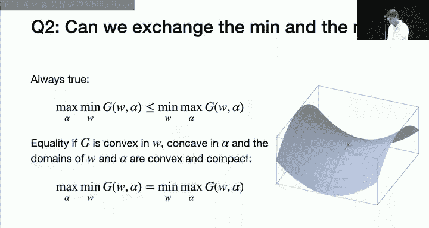

以下是几种常见的凸替代损失函数（针对 `y ∈ {-1,+1}` 格式调整后）：
*   **平方损失 (Square Loss)**: `φ(z) = (1 - z)^2`
*   **逻辑损失 (Logistic Loss)**: `φ(z) = log(1 + exp(-z))`
*   **合页损失 (Hinge Loss)**: `φ(z) = max(0, 1 - z)`

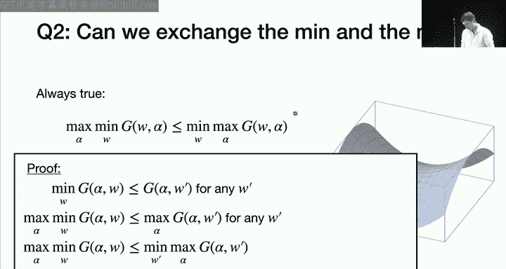

**损失函数对比**：
*   **平方损失**：对称惩罚，即使分类正确，如果置信度不高（`|z|` 不大）也会受到惩罚，这不理想。
*   **逻辑损失**：非对称，分类错误时惩罚更大，但即使分类完全正确，损失也不会降到零。
*   **合页损失**：是SVM使用的损失。其特点是：当分类足够正确（`z >= 1`）时，损失为0；只有当 `z < 1` 时，才会产生线性增长的惩罚。这直接鼓励模型产生一个“间隔”，并追求分类的置信度。

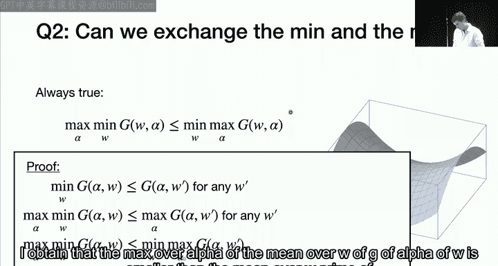

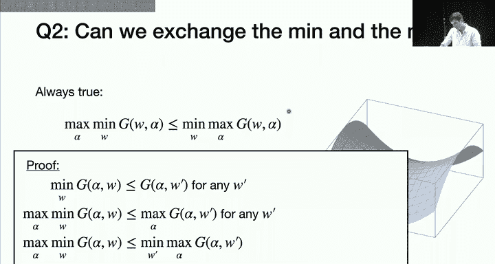

因此，SVM算法等价于：`min_w λ||w||^2 + Σ_i HingeLoss(y_i x_i^T w)`

---

## 5. 对偶问题与支持向量 🤝

上一节我们得到了SVM的优化问题，但直接优化（例如使用次梯度法）可能较慢。本节中我们来看看如何通过**凸对偶**得到另一个等价的、有时更易求解的问题。

**对偶思想**：
对于一个函数 `L(w)`，如果我们能将其表示为 `L(w) = max_{α∈A} G(w, α)`，那么原问题 `min_w L(w)` 就变成了 `min_w max_{α} G(w, α)`。我们称其为**原问题**。
我们可以考虑交换极小和极大的顺序，得到**对偶问题**：`max_{α} min_w G(w, α)`。
在满足一定条件（如 `G` 关于 `w` 凸、关于 `α` 凹，且定义域凸紧）时，强对偶成立，原问题和对偶问题的最优值相等。

**SVM的对偶形式**：
关键的一步是注意到合页损失可以写成一个极大化形式：
`max(0, 1 - y_i x_i^T w) = max_{α_i ∈ [0,1]} α_i (1 - y_i x_i^T w)`

将其代入SVM目标函数，并经过一系列推导（包括求内层 `min_w` 的闭式解），我们可以得到SVM的**对偶问题**：
`max_{α ∈ [0,1]^n} 1^T α - (1/(2λ)) α^T Y X X^T Y α`
其中 `Y` 是以 `y_i` 为对角元素的对角矩阵。

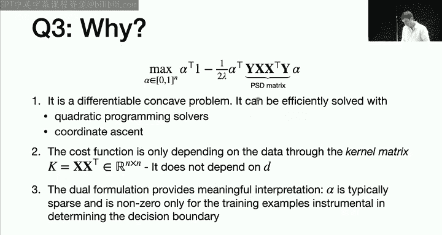

**对偶问题的优势**：
1.  **更易求解**：目标函数是光滑的二次函数，约束是简单的框约束，可以使用高效的二次规划或坐标上升法求解。
2.  **核技巧基础**：数据仅以内积形式 `X X^T`（即Gram矩阵）出现，这为使用核函数处理非线性问题奠定了基础。
3.  **解的稀疏性与可解释性**：对偶变量 `α` 具有稀疏性。

**支持向量的解释**：
最优解 `α*` 中的非零分量对应的训练样本称为**支持向量**。根据KKT条件，它们可以分为三类：
1.  `α_i = 0`：对应那些被正确分类且位于间隔之外的样本。这些点对最终的超平面没有贡献。
2.  `0 < α_i < 1`：对应那些恰好位于间隔边界上的样本。
3.  `α_i = 1`：对应那些位于间隔之内或被错误分类的样本。

最终的超平面 `w*` 可以表示为支持向量的线性组合：`w* = (1/λ) Σ_i α_i y_i x_i`。这意味着**决策边界仅由支持向量决定**，其他样本点可以被移除而不影响模型。这提供了很好的可解释性，并解释了“支持向量机”名称的由来。

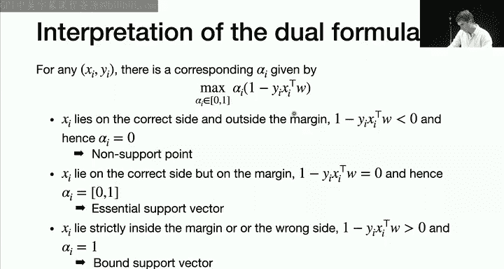

---

## 总结 📚

本节课中我们一起学习了支持向量机 (SVM) 的核心思想。
1.  **出发点**：在众多能分开数据的超平面中，选择**间隔最大**的那一个，以获得更好的泛化能力。
2.  **硬间隔SVM**：针对线性可分数据，通过最小化 `||w||^2` 来最大化间隔。
3.  **软间隔SVM**：针对线性不可分数据，引入松弛变量，在最大化间隔和减少分类错误之间进行权衡，其目标函数可表示为合页损失加L2正则化。
4.  **损失函数视角**：SVM是使用合页损失这一凸替代损失进行经验风险最小化的一个例子，合页损失鼓励产生分类间隔。
5.  **对偶问题**：通过凸对偶理论，可以将SVM的原问题转化为一个关于拉格朗日乘子 `α` 的二次规划问题。这个形式更易求解，并揭示了解的稀疏性。
6.  **支持向量**：最终模型仅由一部分训练样本——支持向量决定，这赋予了模型良好的可解释性。

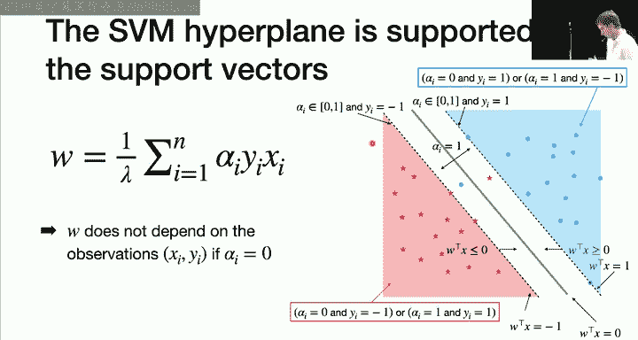

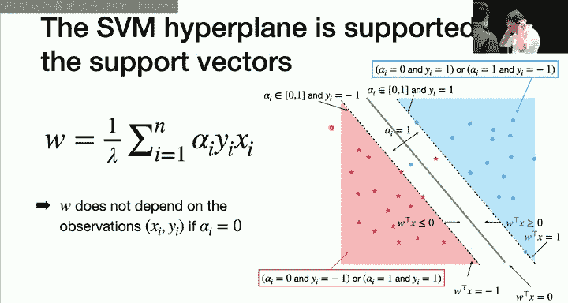

下一节课，我们将探讨核技巧，它将允许SVM在更高维的特征空间中寻找线性分界，从而处理非线性分类问题。