# 20：核岭回归与核技巧 🔥

在本节课中，我们将学习核岭回归和核技巧。我们将看到，许多机器学习问题都可以通过核矩阵来重新表述，从而允许我们在高维特征空间中高效地进行计算，而无需实际计算高维映射。

---

上一节我们介绍了支持向量机及其对偶形式。本节中，我们来看看核岭回归。

## 核岭回归与对偶形式

在介绍SVM的对偶形式时，我们看到数据以一种非常特殊的形式进入模型：它只依赖于核矩阵 **K**，即 **K = X X^T**。为了运行SVM软件，我们只需要知道这个核矩阵。

事实上，这种特性并非SVM独有。许多其他问题也可以被重新表述，以具有相同的特征，岭回归问题（最小二乘法）也是如此。我们将引入所谓的**核岭回归**。

在核岭回归的基础上，我们将能够定义所谓的**核技巧**。核技巧本质上是一种为模型添加大量额外维度（特征）而无需支付相应计算成本的方法。

之前，当我们添加额外特征时，问题会处于更高的维度，求解的复杂度也会增加。而通过核技巧，我们可以将数据映射到一个非常高维的空间，但仍然在低维空间中进行所有计算。这样，我们就能享受高维特征带来的好处，同时保持良好的样本复杂度和计算复杂度。

让我们从岭回归问题开始。岭回归试图最小化残差的平方范数，并对参数 **w** 施加正则化，防止其范数过大。

我们知道这个问题有闭式解：
**w* = (X^T X + λ I)^{-1} X^T y**

其中，矩阵 **X^T X + λ I** 属于 **R^{d×d}** 空间。计算这个 **w*** 的复杂度大约是 **O(d^3)**，因为我们需要计算一个 **d×d** 矩阵的逆，此外计算 **X^T X** 还需要 **O(n d^2)** 的复杂度。

然而，我们也可以用另一种等价形式写出 **w***：
**w* = X^T (X X^T + λ I)^{-1} y**

注意，这里的矩阵 **X X^T + λ I** 是 **n×n** 维的。这两种形式是等价的。我们可以通过一个通用的矩阵恒等式来证明：对于矩阵 **P (m×n)** 和 **Q (n×n)**，有 **P (Q P + I)^{-1} = (P Q + I)^{-1} P**。令 **P = X^T**，**Q = (1/λ) X**，即可得到上述等价关系。

## 两种形式的效用

这两种等价形式各有其效用，主要体现在计算复杂度上。

以下是两种方法的计算复杂度对比：
*   **原始形式**：复杂度为 **O(d^3 + n d^2)**。当 **d** 不大但 **n** 很大时，这个代价是线性的，可以接受。
*   **对偶形式**：复杂度为 **O(n^3 + d n^2)**。当 **d** 远大于 **n** 时，使用这种形式计算复杂度更低。

因此，根据输入维度 **d** 和样本数量 **n** 的相对大小，我们可以选择更高效的计算形式。

第二个重要的结构差异是，在对偶形式中，解 **w*** 具有特殊结构：**w* = X^T α***。这意味着 **w*** 是观测值 **x_i** 的线性组合，即 **w*** 属于观测值 **x_1, ..., x_n** 张成的空间。

这个性质不仅限于最小二乘问题，它可以推广到许多其他问题，这就是所谓的**表示定理**。

## 表示定理

表示定理是核方法文献中最著名的定理之一。它告诉我们，解属于观测值张成的空间这一性质，可以推广到平方损失之外的其他问题。

定理指出，考虑任何损失函数 **L**，并试图最小化经验风险（即损失之和）加上 **L2** 正则化项（**λ ||w||^2**）。这是一个非常通用的监督学习形式。

那么，总存在一个向量 **α* ∈ R^n**，使得该优化问题的解 **w*** 恰好等于 **X^T α***。这意味着，**w*** 总是位于观测值的张成空间中。

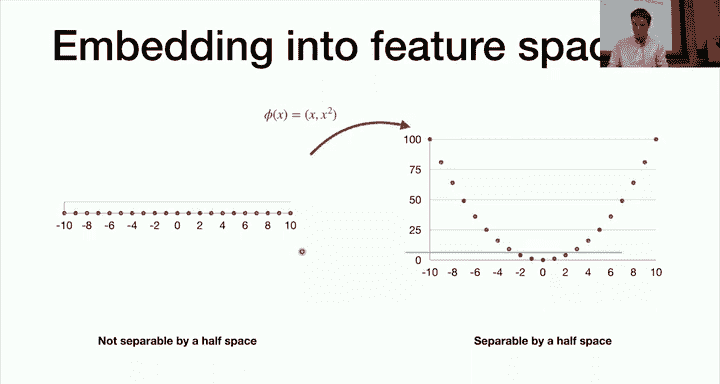

直观上，如果维度 **d** 非常大（远大于 **n**），那么观测值张成的空间维度最多为 **n**。这个定理告诉我们，如果维度太大，我们实际上并不关心观测值生成空间之外发生了什么，那个子空间才是对问题重要的。

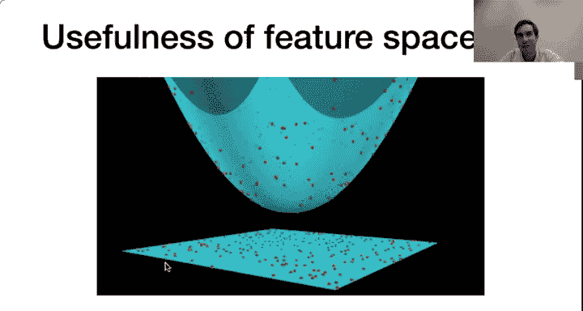

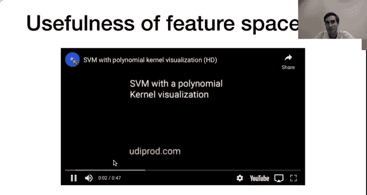

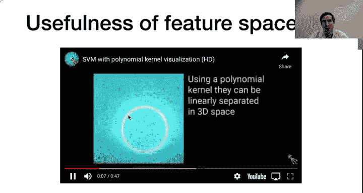

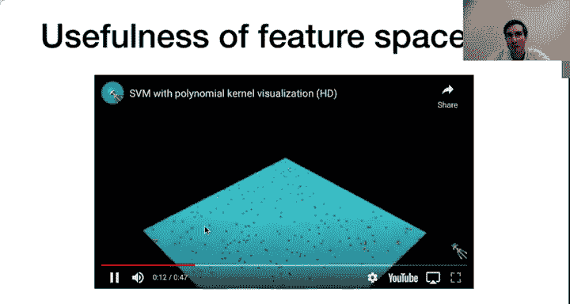

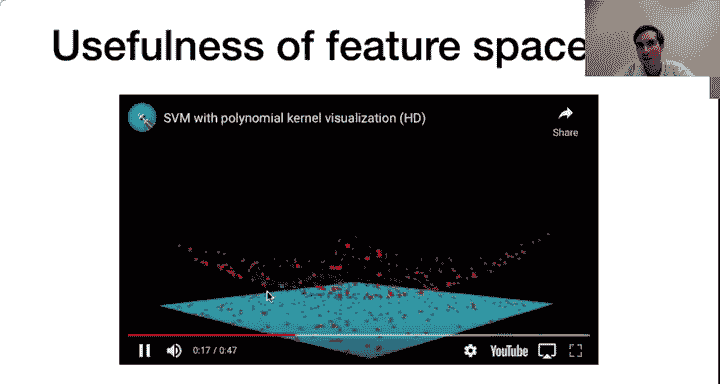

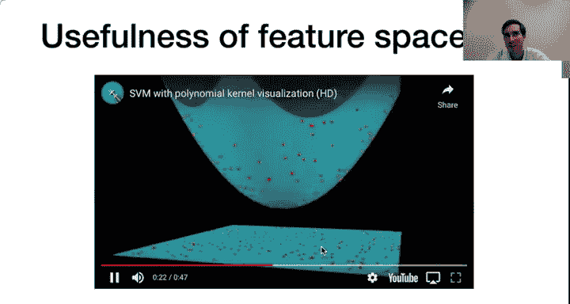

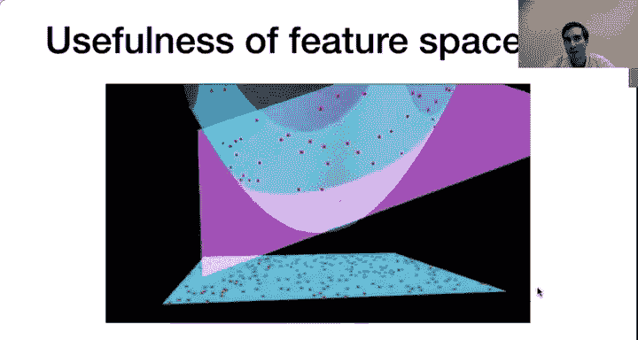

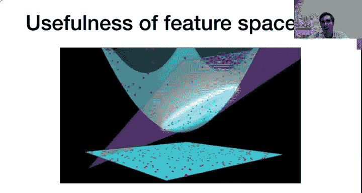

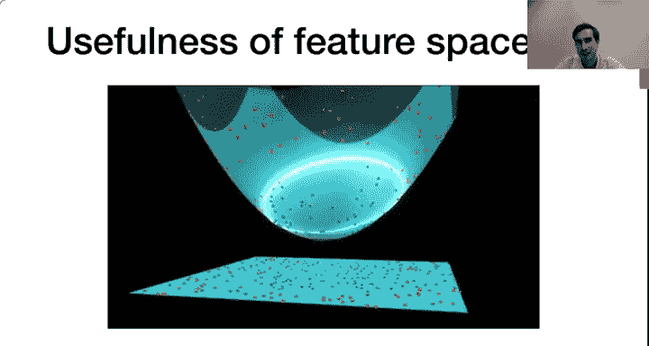

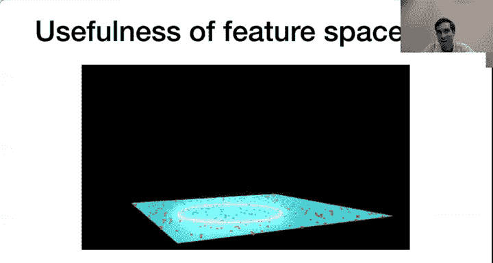

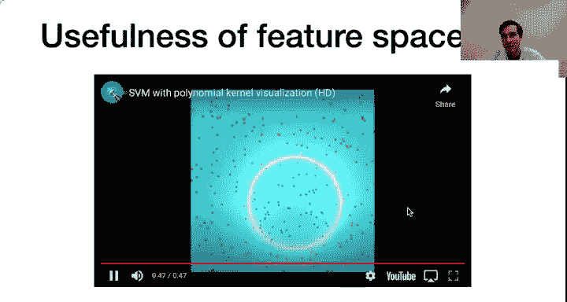

证明思路很简单：假设 **w*** 是解，我们总可以将其分解为 **w*** = **w** + **u**，其中 **w** 在观测值张成的空间中，而 **u** 与该空间正交。可以证明，对于相同的预测值，**w** 的正则化项更小，因此如果 **u** 不为零，**w** 就是一个目标函数值更小的点，这与 **w*** 是最小值矛盾。因此 **u** 必须为零，即 **w*** 在观测值的张成空间中。

这个定理是使用核技巧的基础，它允许我们将许多机器学习问题（如核SVM、核岭回归、核PCA等）的求解转化为在系数 **α** 空间中进行。

## 应用于岭回归

根据表示定理，对于岭回归问题，我们可以不直接求解 **w**，而是求解 **α**。

原始的岭回归问题是：
**min_w ||y - X w||^2 + λ ||w||^2**

其对偶形式是：
**min_α α^T (X X^T + λ I) α - 2 α^T y**

这是一个关于 **α** 的二次函数。令其梯度为零，我们得到：
**α* = (X X^T + λ I)^{-1} y**

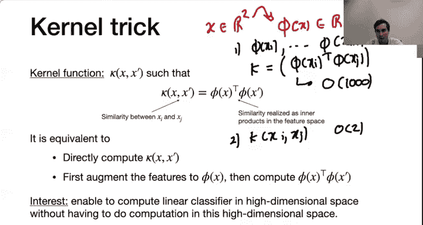

然后，我们可以通过 **w* = X^T α*** 恢复原始解。这两种形式完全等价。

这里的关键点是，为了计算 **α***，数据仅通过核矩阵 **K = X X^T** 进入模型。如果我们已知这个核矩阵，我们就可以直接计算 **α***，而无需进入 **d** 维空间。

## 特征映射与核技巧

在实际问题中，线性分类或回归的能力有限。我们通常希望将原始观测 **x** 映射到一个更高维的空间 **Φ(x)**，以便在这个新空间中数据可能是线性可分的。

例如，一个一维的“XOR”类型数据在原始空间不是线性可分的，但如果我们通过特征映射 **Φ(x) = (x, x^2)** 将其映射到二维空间，数据就变得线性可分了。在扩展空间中使用线性方法，当投影回原始空间时，我们就得到了一个非线性的分类器。

这种方法的问题是，如果特征空间维度 **D** 非常高，计算成本会很大。核技巧解决了这个问题。

核技巧的核心思想是：我们不需要显式计算高维映射 **Φ(x)** 以及在高维空间中的内积 **Φ(x)^T Φ(x‘)**。相反，我们寻找一个**核函数** **κ(x, x‘)**，它直接在原始低维空间中计算，但其结果等于在高维空间中的内积，即 **κ(x, x‘) = Φ(x)^T Φ(x‘)**。

这个核函数只有在它的计算复杂度与特征空间的维度 **D** 无关，而只与输入空间维度 **d** 相关时，才是有趣的。

通过核技巧，我们可以：
1.  在低维空间中计算核函数 **κ(x_i, x_j)**，得到核矩阵 **K**。
2.  使用这个核矩阵 **K** 来学习模型（如求解 **α***）。
3.  进行预测时，也只需要计算新点与训练点之间的核函数值，而无需计算高维的 **Φ(x)**。

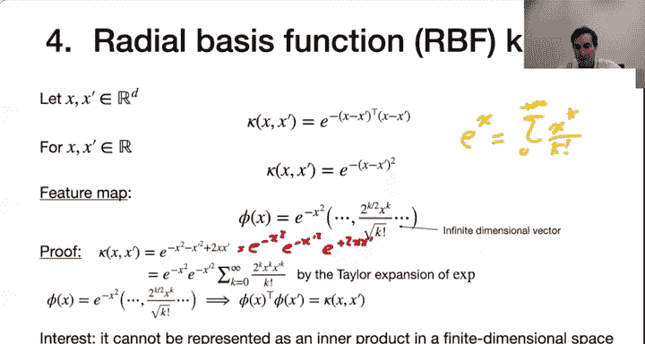

这样，我们就能在高维特征空间中享受线性分类器的优势，而所有计算都在低维输入空间中进行。

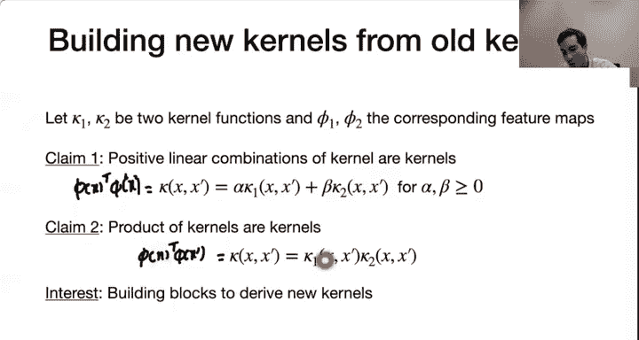

## 核函数示例

以下是一些常见的核函数示例：

*   **线性核**：**κ(x, x‘) = x^T x‘**。对应的特征映射就是恒等映射 **Φ(x) = x**。
*   **多项式核**：例如 **κ(x, x‘) = (x^T x‘)^2**。对于三维输入，它可以对应到一个六维的特征映射，包含了所有单项式和交叉项。
*   **高斯核（RBF核）**：**κ(x, x‘) = exp(-γ ||x - x‘||^2)**。这个核对应的特征空间是无限维的。它使我们能够在无限维空间中进行线性分类，而计算成本仅取决于原始维度。

## 构建新核

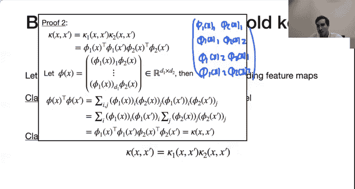

我们可以从已有的核函数构建新的核函数：

*   **正线性组合**：如果 **κ1** 和 **κ2** 是核函数，**α, β ≥ 0**，那么 **α κ1 + β κ2** 也是核函数。
*   **乘积**：如果 **κ1** 和 **κ2** 是核函数，那么 **κ1 · κ2** 也是核函数。

## 梅塞尔定理

一个自然的问题是：如何判断一个函数 **κ(x, x‘)** 是否是一个有效的核函数（即是否存在某个特征映射 **Φ** 使得内积等式成立）？

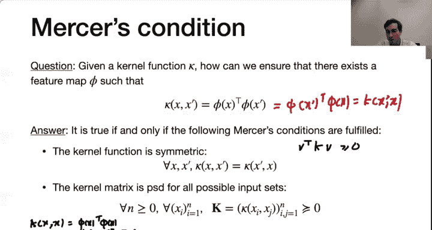

**梅塞尔定理**给出了充要条件：
1.  **对称性**：**κ(x, x‘) = κ(x‘, x)**。
2.  **正定性**：对于任何有限的点集 **{x_1, ..., x_n}**，对应的核矩阵 **K**（其中 **K_{ij} = κ(x_i, x_j)**）是半正定的。

如果一个函数满足这两个条件，那么它就存在一个对应的特征映射 **Φ**，是一个有效的核函数。

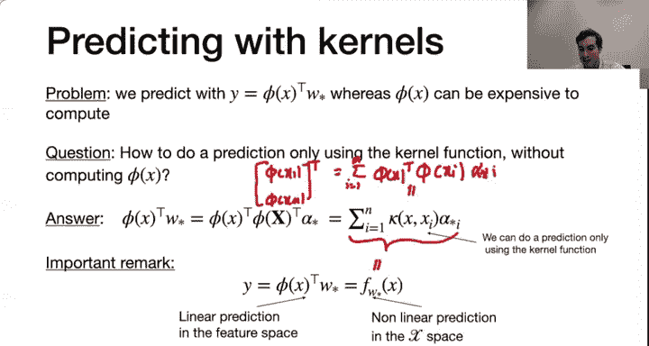

## 使用核函数进行预测

最后，我们如何利用核函数对新样本 **x** 进行预测？预测值通常是 **f(x) = w^T Φ(x)**。

根据表示定理，**w = Σ_{i=1}^n α_i Φ(x_i)**。因此：
**f(x) = Σ_{i=1}^n α_i Φ(x_i)^T Φ(x) = Σ_{i=1}^n α_i κ(x_i, x)**

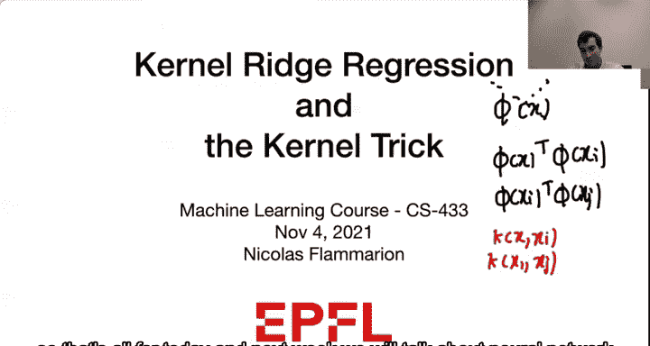

可以看到，进行预测也只需要计算新点 **x** 与所有训练点 **x_i** 之间的核函数值，完全不需要计算高维的 **Φ(x)** 或 **Φ(x_i)**。

虽然在高维特征空间中我们使用的是线性分类器（一个超平面），但当我们将这个线性函数通过核函数表示并投影回原始输入空间时，它对应的是一个**非线性**的决策函数。这正是核方法强大之处。

---

本节课中我们一起学习了核岭回归与核技巧。我们了解到，通过将数据映射到高维空间可以增强模型的表达能力，但直接计算高维映射成本高昂。核技巧允许我们通过核函数隐式地在高维空间中进行运算，而所有计算都在原始低维空间中进行，从而高效地实现了这一目标。核方法是机器学习中连接线性模型与非线性能力的重要桥梁。