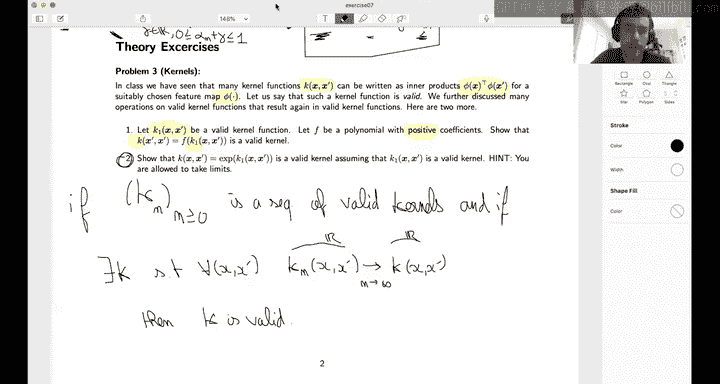

# 21：习题7入门指南 🚀

在本节课中，我们将聚焦于第七次习题集，主题是支持向量机。我们将从回顾SVM的基本优化问题开始，然后探讨两种优化方法：随机梯度下降和对偶问题的坐标上升法。最后，我们会学习一些关于核函数有效性的理论性质。

---

## 概述 📋

本周我们将专注于第七次习题集，处理支持向量机。在分类问题中，我们已经学习了线性回归和逻辑回归。现在，我们将关注一种新方法——支持向量机。

在课堂上，我们已经了解到，我们希望最小化的问题由公式（1）给出。可以注意到，除了我们考虑的损失函数是合页损失而非逻辑损失外，其形式与逻辑回归类似。

那么，优化这个问题的最佳方式是什么？在实验中，我们可以访问包含特征X和标签Y的训练集与测试集。需要注意的是，使用这种公式和合页损失时，标签Y必须是+1或-1，而不是0或1。

---

## 第一部分：原始问题与随机梯度下降

解决公式（1）所示原始问题的自然方法是使用随机梯度下降。当数据量N很大时，SGD通常比普通梯度下降更高效。

以下是需要实现的几个函数：
*   `calculate_accuracy`：对于给定参数W，计算在训练集和测试集上的准确率。
*   `calculate_primal_objective`：计算考虑正则化参数λ的原始目标函数值（即损失）。

需要指出的是，准确率计算函数不涉及参数λ。

对于问题2，需要实现两个SGD函数：
*   一个函数针对给定的单个数据点（小n）返回随机梯度。
*   另一个函数 `sgd_for_svm_demo` 执行完整的SGD过程并计算目标函数值。

---

## 第二部分：对偶问题与坐标上升法

然而，在原始问题上直接进行SGD并不总是最佳方法。我们还可以考虑对偶问题，如公式（2）所示。这是一个关于α的最大化问题，它是一个二次函数，并且是凹函数，因此易于最大化。该问题受约束，因为α的每个坐标必须在区间[0, 1]内。

解决此问题的一种方法是使用坐标上升法。第一个问题是理论性的：需要证明当只关注一个坐标时，存在闭式解。这意味着，如果我们随机选择一个坐标n，并希望找到函数F(α)在该方向上的最大值（一个带约束的一维优化问题），我们可以推导出该问题的解。然后，我们可以用这个解来更新α。

一旦回答了这个理论问题，实现就变得直接了。你需要：
*   计算坐标更新（即实现上述更新规则）。
*   计算对偶目标函数值（即实现公式2）。
*   展示坐标上升法的性能，并使用函数 `sgd_for_svm_demo` 进行比较。问题在于比较SGD和坐标上升法哪个更快，并比较两种情况下目标函数值的变化。

---

## 第三部分：核函数的理论性质

在课堂上，我们已经看到有些核函数可以表示为良好的内积形式。在实践中，对于一个给定的核函数K(x, x')，通常很难将其表示为某个特征映射φ的内积。实际上，特征映射可能是无限维的。

然而，在接下来的两个问题中，我们将展示一些能保持核函数有效性的操作。在课堂上，我们已经学过两个有效核函数的和仍然是有效核函数，一个有效核函数乘以一个正常数也仍然是有效核函数。

这里，我们将证明：
1.  如果K1是一个有效核函数，而F是一个具有正系数的多项式，那么复合函数F(K1)仍然是一个有效核函数。这很有用，因为如果我们知道K1有效，那么即使不计算相关的特征映射φ，我们也知道K1²是有效的。
2.  证明一个核函数的指数函数仍然是一个有效核函数。提示是允许取极限。这意味着，如果存在一个有效核函数的序列，并且该序列逐点收敛于某个极限核函数K，那么根据给定的定理，这个极限核函数K也是有效的。你可以使用这个定理来证明第二个问题。

---

## 总结 ✨

本节课我们一起学习了支持向量机习题集的核心内容。我们回顾了SVM的原始优化问题及其对偶形式，并实践了使用随机梯度下降和坐标上升法进行优化。最后，我们探讨了核函数有效性的重要理论性质，特别是通过多项式和指数运算构造新核函数的方法。希望这些知识能帮助你顺利完成习题。