# 22：神经网络基础与表达能力 🧠

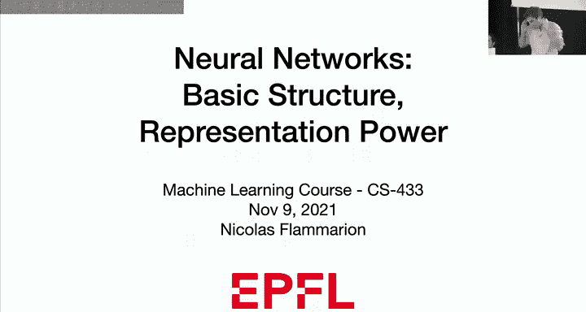

在本节课中，我们将要学习神经网络的基本结构，并探讨其强大的表达能力。我们将从动机出发，理解为什么神经网络能够自动学习数据特征，然后深入其数学定义和核心工作原理。

---

## 动机：从特征工程到自动学习

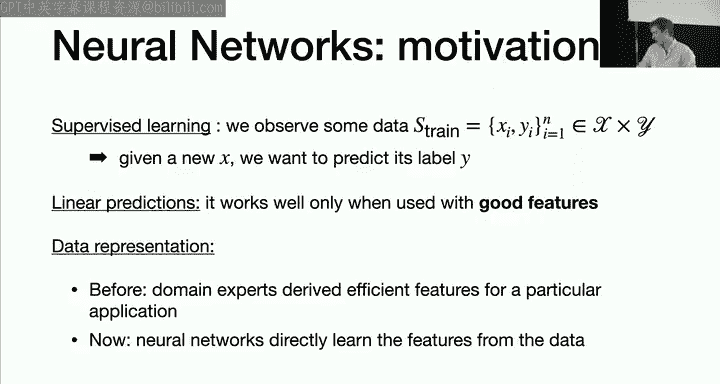

在之前的课程中，我们主要讨论了线性预测方法。线性预测（例如 `y = w^T x`）只有在数据具有良好的特征表示时才能表现良好。过去，这通常需要领域专家为每个特定应用（如计算机视觉）手动设计特征，然后将这些特征输入给线性模型。

这种方法存在明显问题：它非常耗时，且高度依赖于具体领域。我们更希望的是，机器学习模型能够**自动从数据中学习到好的特征表示**。

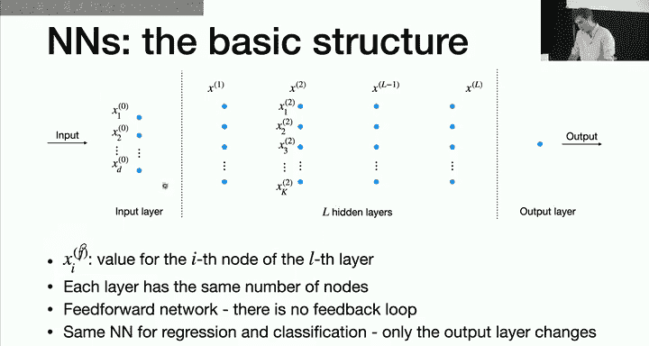

这正是神经网络的核心思想。神经网络将特征学习的过程整合到了学习问题本身中。它的第一部分（隐藏层）负责**自动学习数据的良好特征表示**，而第二部分（输出层）则在这些学习到的特征之上进行**线性分类或回归**。

---

## 神经网络的基本结构 🏗️

上一节我们介绍了神经网络的动机，本节中我们来看看它的具体结构。

一个基本的前馈神经网络包含以下部分：
*   **输入层**：维度为 `D`，对应输入数据的特征数。
*   **L 个隐藏层**：每个隐藏层有 `K` 个节点（神经元）。为简化讨论，我们假设所有隐藏层大小相同。
*   **输出层**：在本课中，我们考虑输出层大小为 1（例如，用于回归或二分类）。

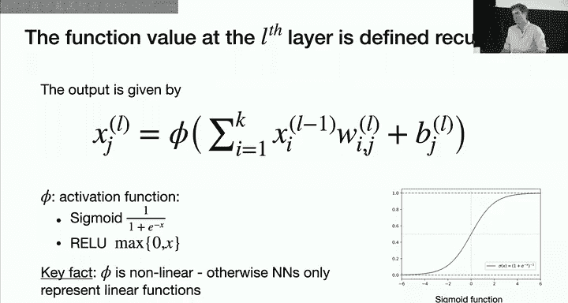

信息从输入层开始，单向地流经各个隐藏层，最终到达输出层，没有反馈回路，因此称为“前馈”网络。

网络的参数包括：
*   隐藏层的数量 `L` 和每层的大小 `K`。
*   连接各层节点之间的**权重** `W_{ij}^{(l)}`。
*   每个节点上的**偏置** `b_i^{(l)}`。

---

## 前向传播：值是如何计算的？ ➡️

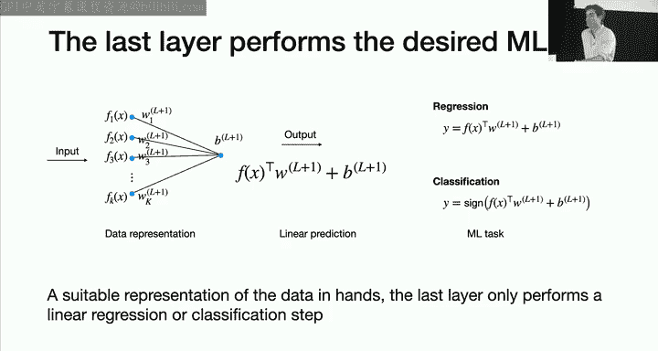

了解了结构后，我们需要知道每个节点的值是如何计算的。这个过程称为前向传播。

在一个**全连接**网络中，每一层的每个节点都连接到前一层的所有节点。第 `l` 层中第 `j` 个节点的值 `x_j^{(l)}` 递归地定义如下：

**公式：**
`x_j^{(l)} = φ( Σ_i ( W_{ij}^{(l)} * x_i^{(l-1)} ) + b_j^{(l)} )`

以下是计算过程的分解：
1.  **线性组合**：将前一层所有节点的值 `x_i^{(l-1)}` 与对应的权重 `W_{ij}^{(l)}` 相乘并求和，然后加上本节点的偏置 `b_j^{(l)}`。
2.  **激活函数**：将上述线性组合的结果输入一个非线性函数 `φ`，得到该节点的最终输出值。

**为什么 `φ` 必须是非线性的？**
如果 `φ` 是线性函数，那么整个网络就只是一系列线性变换的叠加，最终输出仍然是输入的一个线性函数。这样，网络的表达能力就退化成了简单的线性模型。引入非线性激活函数是神经网络能够学习复杂模式的关键。

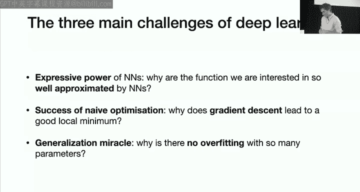

常见的激活函数包括：
*   **Sigmoid**：`φ(x) = 1 / (1 + exp(-x))`，将输入压缩到 (0, 1) 区间。
*   **ReLU**：`φ(x) = max(0, x)`，目前最流行的激活函数之一。

---

## 神经网络的两种视角 👓

现在，我们可以从两个角度来理解神经网络的功能。

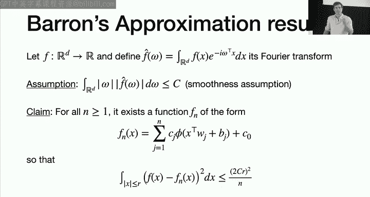

**视角一：自动特征学习器**
神经网络的前 `L` 层（输入层和隐藏层）共同作用，将原始输入 `x ∈ R^D` 映射到一个新的特征空间 `R^K`。这个映射函数 `f` 由网络的权重、偏置和激活函数共同定义。**网络正在自动学习对当前任务有用的特征**。

**视角二：特征之上的线性预测器**
学习到特征表示 `f(x)` 之后，输出层仅仅是在这些特征上执行一个线性操作（例如 `w^T f(x) + b`）。对于回归任务，直接输出该值；对于分类任务，则可能再通过一个符号函数或 softmax 函数。

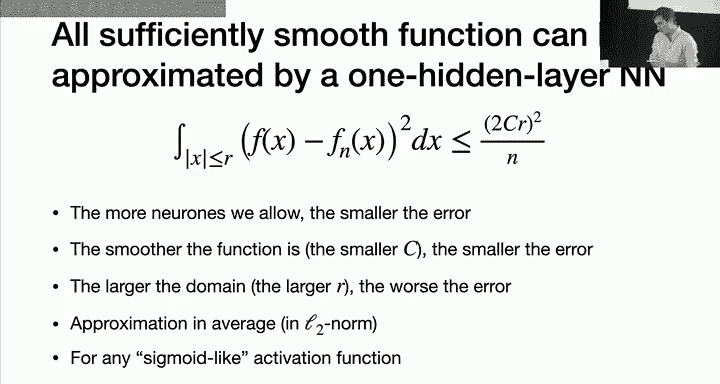

因此，神经网络的参数量级约为 `O(K^2 * L)`。现代深度学习模型通常使用非常深（`L` 很大）和/或非常宽（`K` 很大）的网络，即**过参数化**模型。

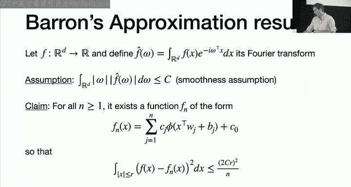

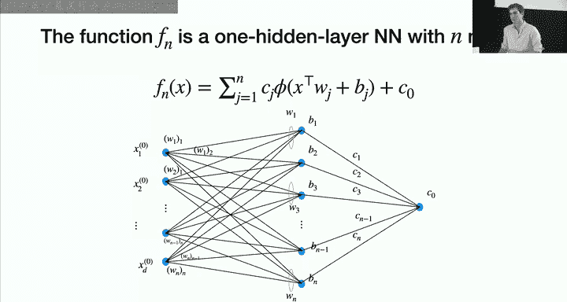

---

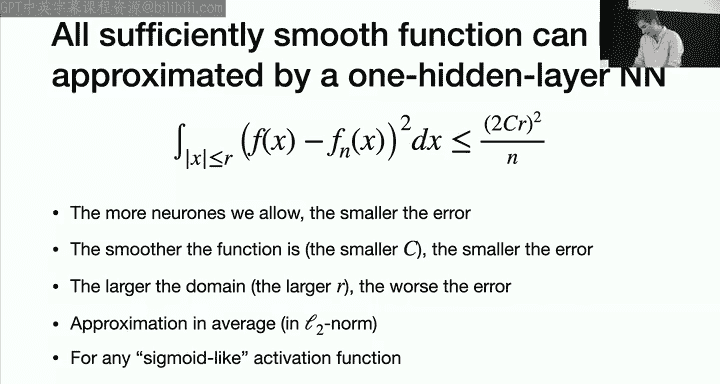

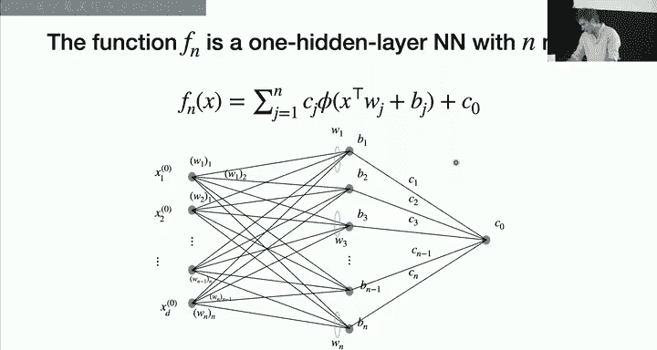

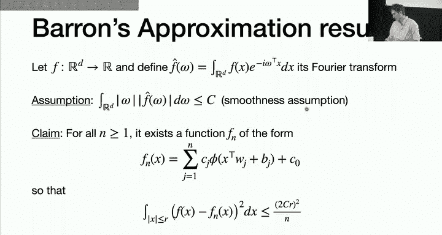

## 深度学习的三大谜题 ❓

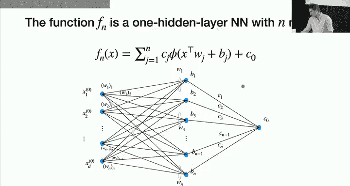

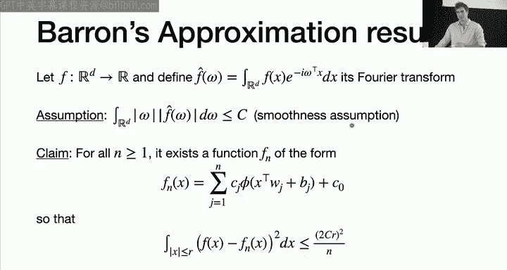

神经网络在实践中取得了巨大成功，但其背后仍有许多未解之谜，主要可归纳为三点：

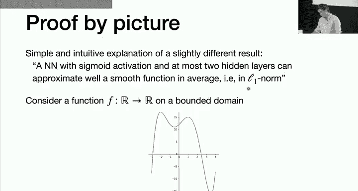

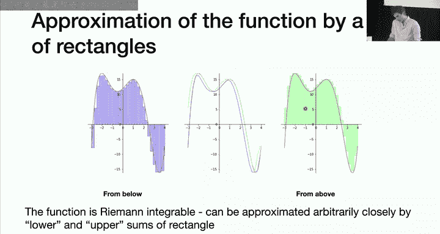

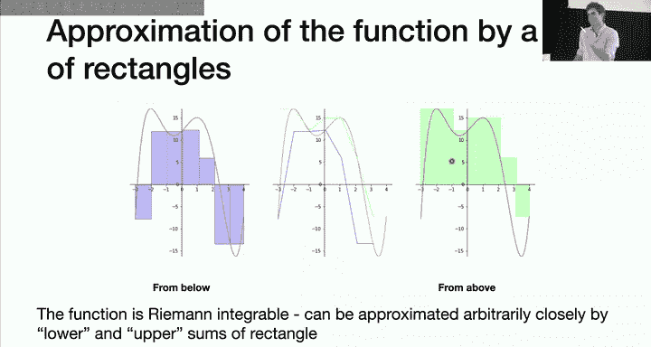

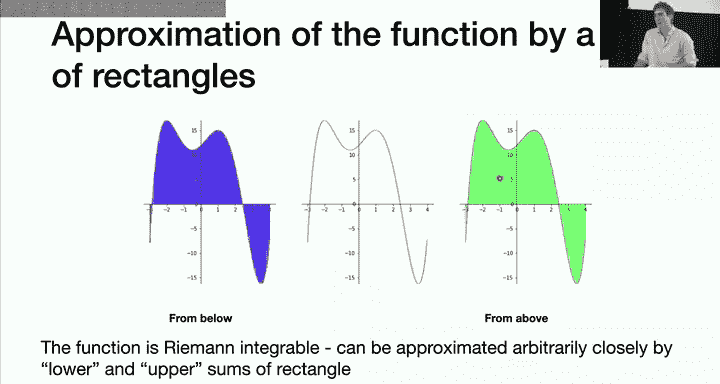

1.  **表达能力之谜（Approximation）**：给定一个复杂函数，是否存在一个神经网络能够以足够高的精度逼近它？这就是**近似理论**关心的问题。我们将在本节课重点讨论。
2.  **优化之谜（Optimization）**：神经网络的损失函数是关于参数的高度非凸函数，参数空间巨大。然而，使用梯度下降法等简单优化算法，我们通常能（看似神奇地）找到使训练误差很低的解。我们将在下节课探讨。
3.  **泛化之谜（Generalization）**：过参数化的神经网络可以完美拟合训练数据（训练误差为0），但为什么它同时能在未曾见过的测试数据上表现良好（泛化能力强）？这与传统统计学习理论相悖，是当前研究的热点。

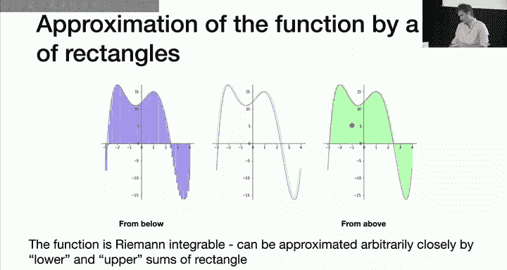

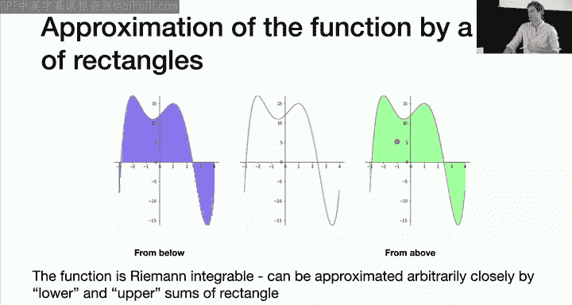

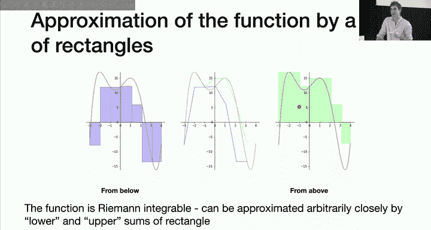

---

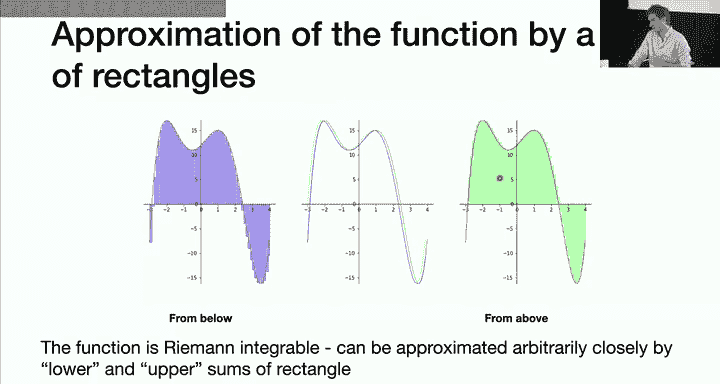

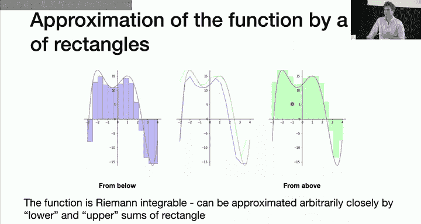

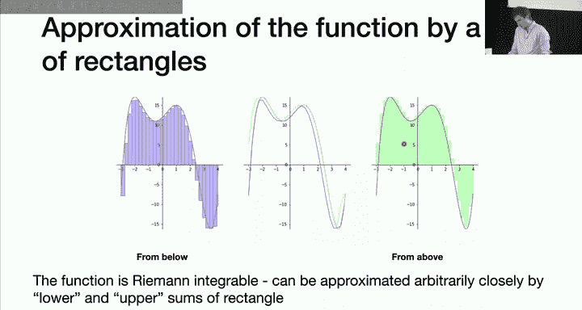

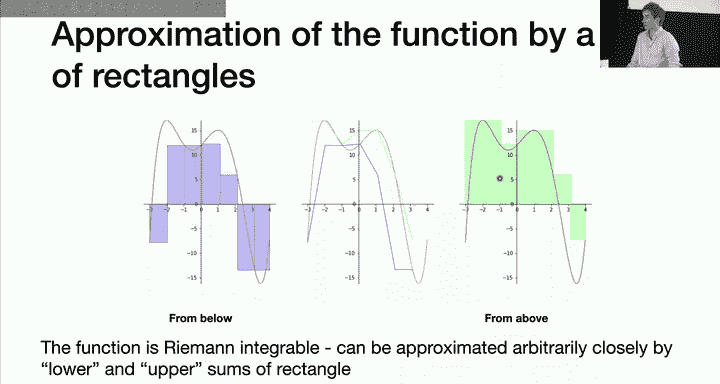

## 神经网络的表达能力：近似理论 📈

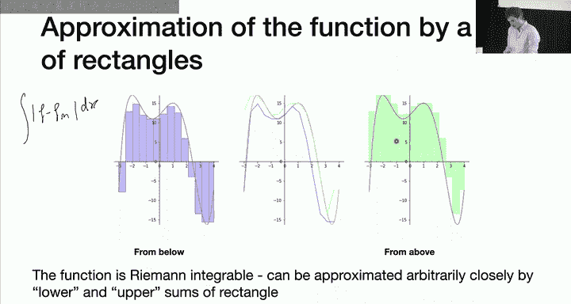

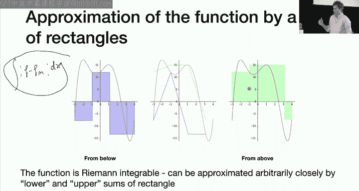

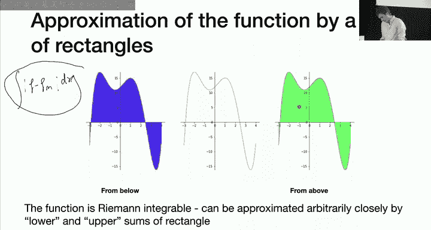

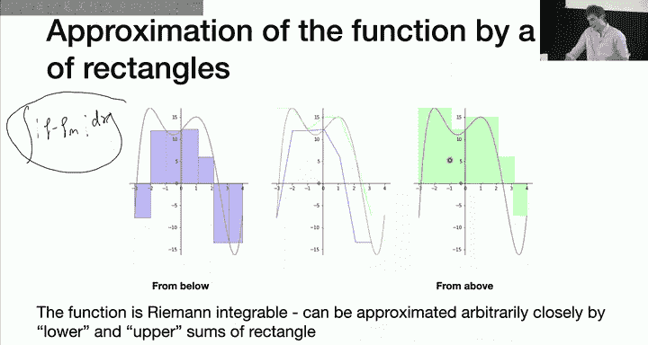

本节我们将聚焦于第一个谜题：神经网络的表达能力。核心问题是，神经网络能否近似任意复杂的函数？

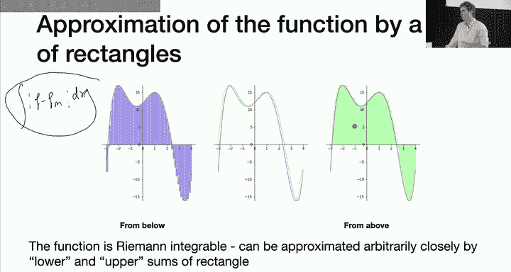

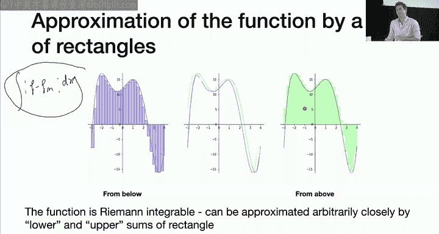

**Barron 定理（1993）提供了一个答案：**
考虑一个定义在 `R^D` 上的函数 `f`，其傅里叶变换满足一定的平滑性条件（即函数足够光滑）。那么，对于任意整数 `n`，**存在一个仅含单隐藏层**（使用类似 Sigmoid 的激活函数）的神经网络 `f_n`，使得在半径为 `R` 的球内，其 `L^2` 近似误差满足：

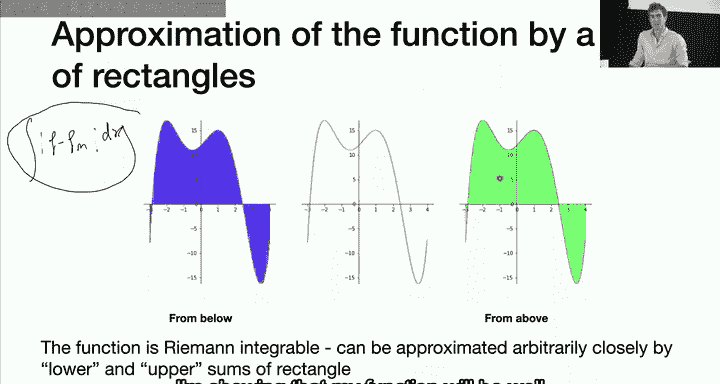

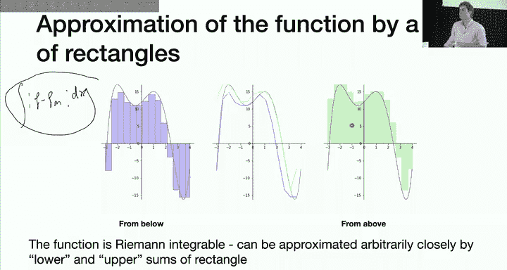

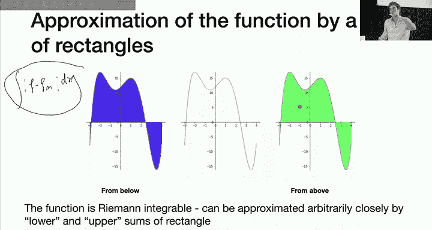

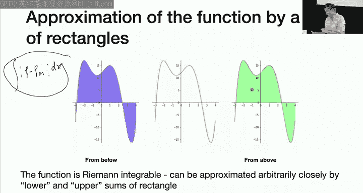

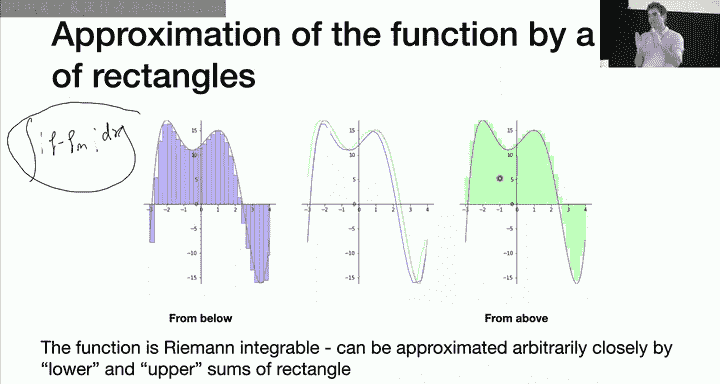

**公式：**
`∫_{||x||≤R} |f(x) - f_n(x)|^2 dx ≤ (2C * R^2) / n`

**对这个结果的解读：**
*   **误差上界**：近似误差以 `O(1/n)` 的速率下降，其中 `n` 是隐藏层神经元的数量。神经元越多，近似越精确。
*   **平滑性**：常数 `C` 度量了函数的平滑程度。函数越平滑（`C` 越小），越容易近似。
*   **定义域**：近似保证只在有界区域（半径 `R` 内）成立。区域越大，要达到相同精度所需的神经元可能越多。
*   **普遍性**：该定理表明，**单隐藏层神经网络**在理论上就是以近似一大类光滑函数。

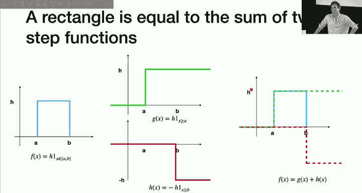

这个定理是存在性定理，它告诉我们这样的网络参数是存在的，但并未说明如何通过训练找到它们。

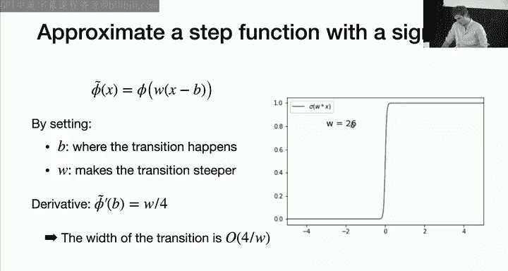

---

## 直观理解：用神经网络“画”出函数 🎨

为了更直观地理解神经网络的表达能力，我们可以通过一个非严格的“图示化”证明来感受一下。

**目标**：证明使用 Sigmoid 激活函数、最多两个隐藏层的神经网络，可以在 `L^1` 范数下很好地近似一个光滑的一维函数。

**证明思路（三步走）：**
1.  **用矩形逼近函数**：任何在有限区间上黎曼可积的光滑函数，都可以用一系列矩形函数的和来任意精度地逼近（这本质上是黎曼积分的定义）。
2.  **用神经网络逼近矩形**：一个矩形函数可以看作两个阶跃函数之差。而一个阶跃函数可以通过一个权重很大的 Sigmoid 函数来近似（调整偏置决定阶跃位置，调整权重决定阶跃陡峭度）。因此，一个矩形函数可以用两个 Sigmoid 函数的线性组合来近似。
    *   **对应神经网络**：一个具有两个隐藏神经元（使用 Sigmoid）和线性输出层的网络可以实现这个近似。
3.  **组合起来**：既然原函数近似于许多矩形之和，而每个矩形又近似于一个小神经网络，那么所有这些小神经网络的叠加（即一个更大的神经网络）就可以近似原函数。由于需要对 Sigmoid 的输出进行求和，最终形成的网络会是一个**两隐藏层**的网络。

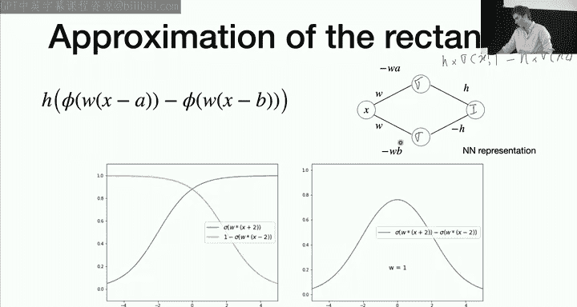

**扩展到高维**：对于二维或更高维的函数，思路类似。我们可以用高维的“矩形柱”来逼近函数，而每个“矩形柱”可以通过组合多个 Sigmoid 函数（并在最后添加一个阈值激活函数来裁剪不需要的部分）来近似。这同样可以通过具有两个隐藏层的网络实现。

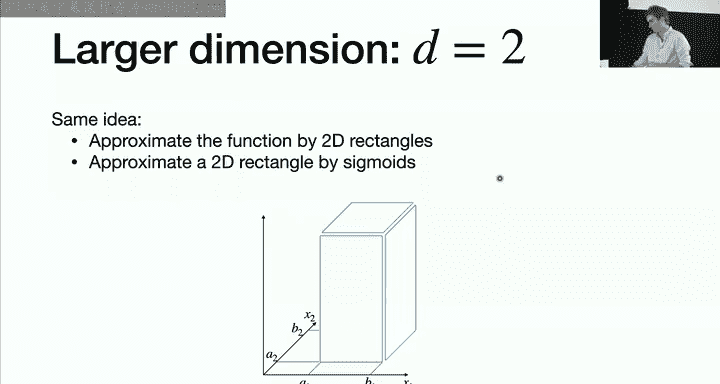

---

## 点态近似与 ReLU 网络 ✨

Barron 定理给出了平均意义下的近似保证。我们能否得到更强的、对每个输入点都成立的**点态近似**保证呢？

对于定义在紧集上的连续函数，著名的**Stone-Weierstrass 定理**指出，可以用多项式函数以任意精度一致逼近。但多项式本身不易由神经网络直接实现。

一个更相关的结果是**Cybenko（1989）等人的通用近似定理**，它指出，使用 Sigmoid 等激活函数的单隐藏层神经网络，可以在紧集上一致逼近任意连续函数。

此外，对于使用 **ReLU** 激活函数的网络，我们有一个非常直观的理解：

**任何连续的分段线性函数**都可以表示为一组 ReLU 函数的线性组合：
`f(x) = β + α*x + Σ_i a_i * ReLU(x - b_i)`

**为什么？**
*   每个 `ReLU(x - b_i)` 在 `x = b_i` 处产生一个“拐点”。
*   系数 `a_i` 决定了在拐点处斜率的变化量。
*   通过选择和组合多个这样的 ReLU 函数，我们可以构造出具有任意多个拐点和斜率的复杂分段线性函数。

由于连续函数可以用分段线性函数很好地近似，而分段线性函数又可以用 ReLU 网络精确表示，这就在直觉上说明了 **ReLU 网络同样具有强大的近似能力**。一个单隐藏层的 ReLU 网络就可以实现上述表示。

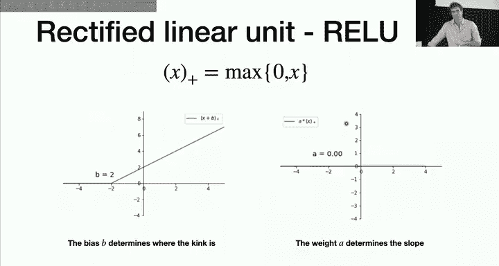

---

## 总结 🎯

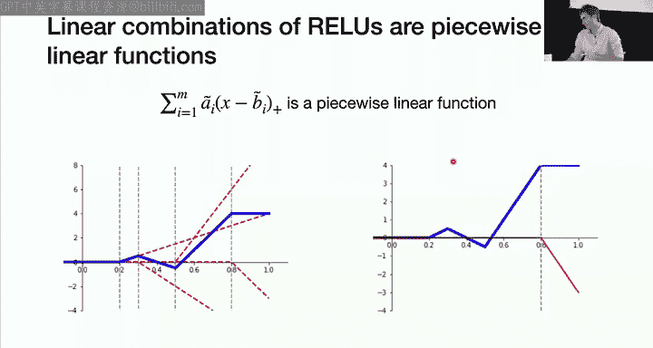

本节课中我们一起学习了：
1.  **神经网络的动机**：其核心优势在于能够**自动学习数据特征**，省去了繁琐的手动特征工程。
2.  **基本结构**：包括输入层、隐藏层和输出层，通过权重、偏置和非线性激活函数进行前向传播计算。
3.  **两种视角**：神经网络既是**自动特征学习器**，也是**特征之上的线性预测器**。
4.  **三大谜题**：我们概述了围绕深度学习的表达能力、优化和泛化三大未解之谜。
5.  **表达能力**：我们重点探讨了神经网络的近似能力。通过 **Barron 定理** 和直观的图示证明，我们了解到即使是很浅的网络（如单隐藏层），只要足够宽，就足以在理论上近似一大类函数。我们也简要提到了 **ReLU 网络**如何通过组合来实现分段线性近似。

理解神经网络的表达能力是理解其为何成功的第一步。在下节课中，我们将面对第二个谜题：如何通过优化算法（如梯度下降）来训练这个拥有海量参数的复杂非凸模型。