# 23：神经网络训练与反向传播算法 🧠

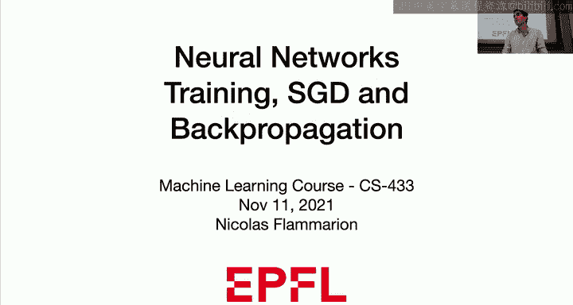

## 概述

在本节课中，我们将学习如何训练神经网络。我们将重点介绍反向传播算法，这是一种高效计算神经网络中所有参数梯度的核心方法。我们将从回顾神经网络的基本结构开始，然后深入探讨训练过程、损失函数以及如何通过链式法则计算梯度。

---

## 神经网络回顾

上一节我们介绍了神经网络的基本结构。本节中，我们来看看神经网络的本质及其在监督学习中的作用。

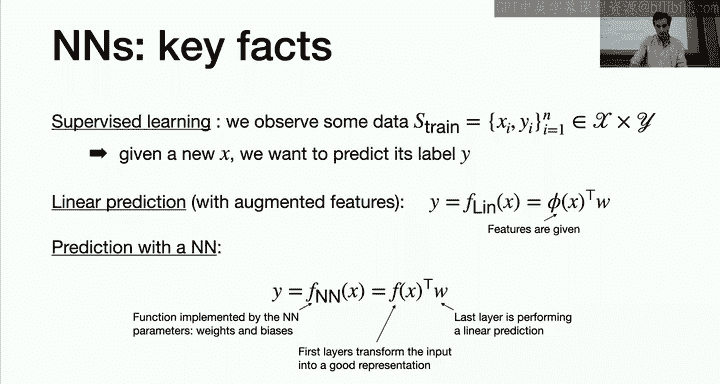

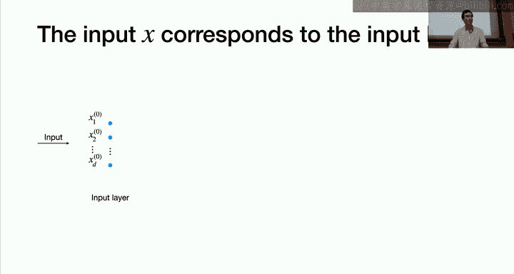

### 神经网络的本质

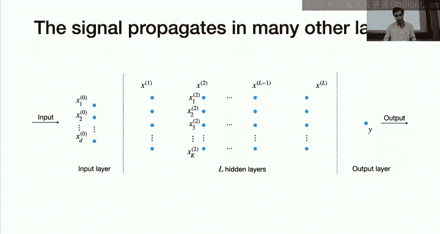

神经网络本质上是一个函数。在监督学习中，我们使用它来进行预测。给定一个输入观测值 **x**，神经网络实现一个函数 **F**，并利用该函数进行预测。

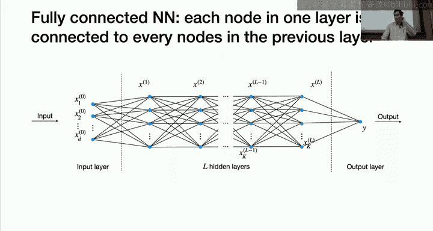

**核心公式：**
预测值 = **F(x)**

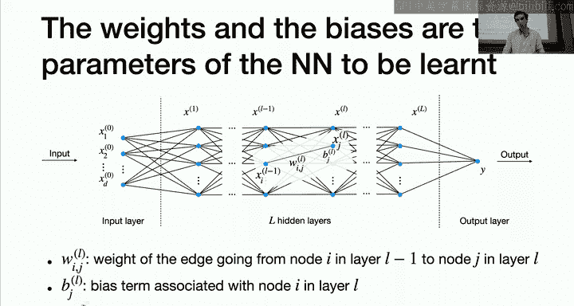

在课程中，我们主要将神经网络用于监督学习。我们观察训练数据，包括输入 **x** 和输出 **y**，目标是学习 **x** 与 **y** 之间的关系，以便对新输入 **x** 预测其对应的标签 **y**。

### 线性预测与特征学习

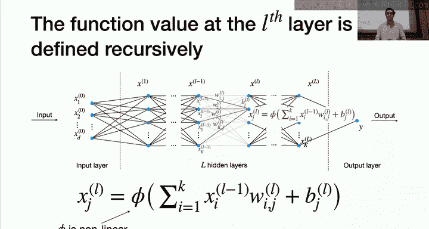

我们之前看到，线性预测的形式是 **φ(x)^T w**，其中 **φ** 是特征映射。线性预测的效果取决于特征 **φ** 的好坏，而这些特征通常由领域专家手动设计。

当使用神经网络进行预测时，预测值就是 **F(x)**，其中 **F** 是由神经网络实现的函数。神经网络的参数是所有权重 **W** 和偏置 **b**。因此，神经网络的目标是学习一个最佳函数，以找到 **x** 和 **y** 之间的最佳关系。

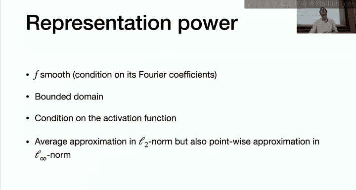

神经网络实际上是一种学习高维函数的方式。最终，它只是一个函数。

### 网络结构：表示学习与线性预测

神经网络可以大致分为两部分：
1.  **第一部分（输入层和所有隐藏层）**：将输入 **x** 转换为一种良好的表示或特征。这部分自动为数据学习好的特征。
2.  **第二部分（最后一层，输出层）**：在这个学习到的良好表示之上，进行线性预测（例如线性回归或逻辑回归）。

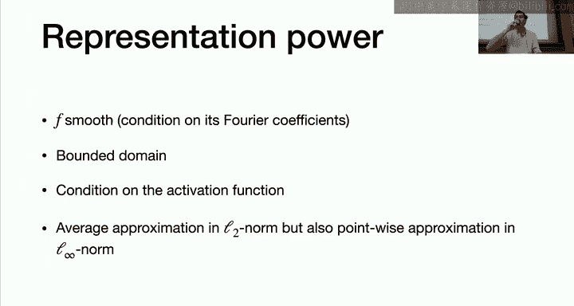

因此，神经网络的核心是自动为数据学习一个好的表示（特征），而之前这需要手动完成。

---

## 神经网络结构详解

让我们再次回顾一下神经网络的基本结构。

### 网络层与节点

*   **输入层**：有 **D** 个节点，每个节点对应输入 **x** 的一个分量。
*   **隐藏层**：有 **L** 层，每层有 **K** 个节点（为简化，假设每层节点数相同）。
*   **输出层**：有 1 个节点（以回归为例）。

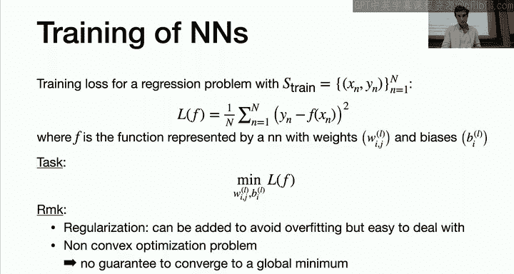

信号在网络中沿着节点传播。我们用 **x_i^l** 表示第 **l** 层第 **i** 个节点的值。

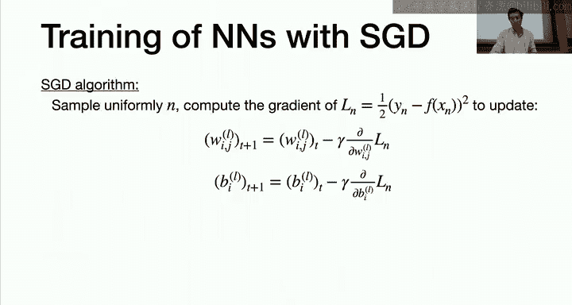

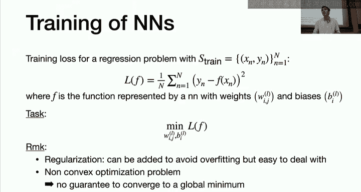

### 全连接与参数

我们考虑的是**全连接**神经网络。这意味着每一层的每个节点都与前一层的所有节点相连。

网络的参数包括：
*   **权重**：每条连接边（例如，连接第 **l-1** 层节点 **i** 和第 **l** 层节点 **j**）都有一个权重 **w_{ij}^l**。
*   **偏置**：每个节点都有一个偏置 **b_j^l**。

这些权重和偏置就是我们需要学习的参数，类似于线性回归中的 **w**。

### 前向传播与激活函数

节点值的更新是递归定义的。第 **l** 层第 **j** 个节点的值 **x_j^l** 计算如下：

**核心公式：**
**z_j^l = Σ_i (w_{ij}^l * x_i^{l-1}) + b_j^l**
**x_j^l = φ(z_j^l)**

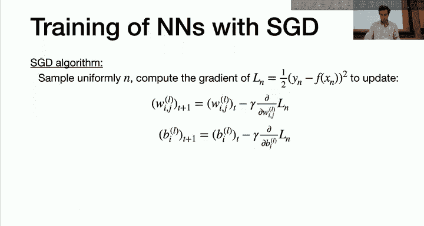

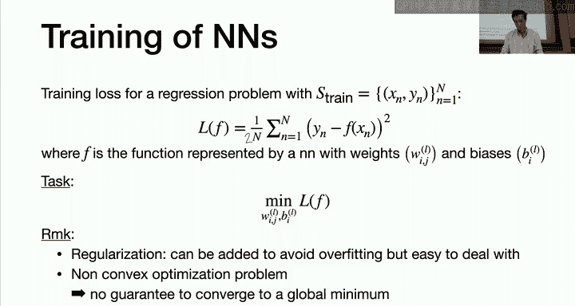

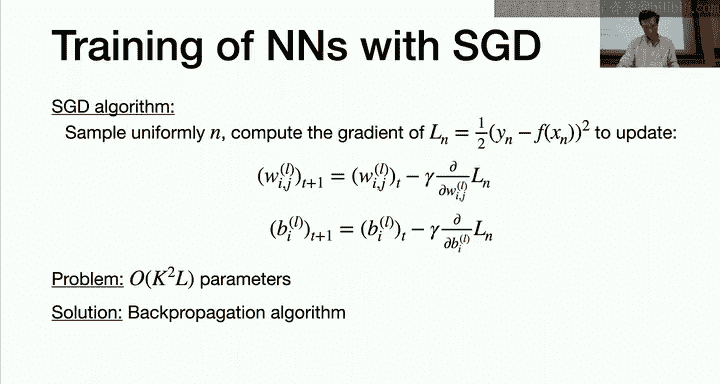

其中：
*   **z_j^l** 是应用激活函数前的值。
*   **φ** 是**非线性激活函数**。

**激活函数的非线性至关重要**。如果激活函数是线性的，那么整个神经网络实现的函数也将是线性的，多层结构就失去了意义。非线性激活函数使得神经网络能够表达非常丰富复杂的函数。

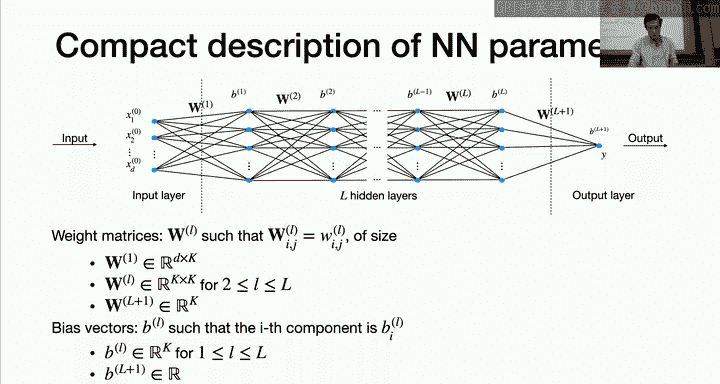

---

## 神经网络的函数逼近能力

上一节我们探讨了神经网络可以逼近何种函数。本节中，我们简要回顾相关结论。

我们研究了神经网络（特别是具有 sigmoid 或 ReLU 激活函数的网络）对平滑函数的逼近能力。主要结论有两类：
1.  **L2 距离（平均意义）**：神经网络实现的函数与目标函数 **f** 之间的 L2 距离可以很小。
2.  **L∞ 距离（逐点意义）**：对于 ReLU 激活函数，我们还可以得到逐点逼近的结果。

这些理论结果保证了足够大的神经网络能够近似广泛的函数，这是其强大表达能力的基础。

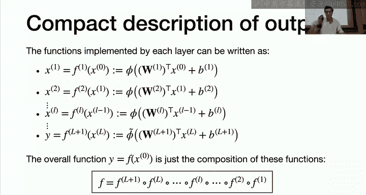

---

## 训练神经网络：问题定义

现在，我们转向本节课的核心问题：如何训练一个神经网络？

### 目标：最小化损失函数

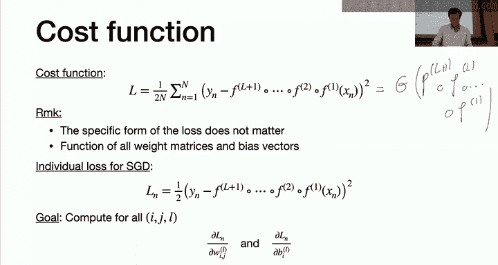

假设我们处理一个回归问题，训练集为 **{ (x_n, y_n) }**，共有 **N** 个样本。我们使用均方误差作为损失函数：

**核心公式：**
**L(W, b) = (1/N) * Σ_n (y_n - F(x_n))^2**

其中 **F(x_n)** 是由权重 **W** 和偏置 **b** 定义的神经网络函数。

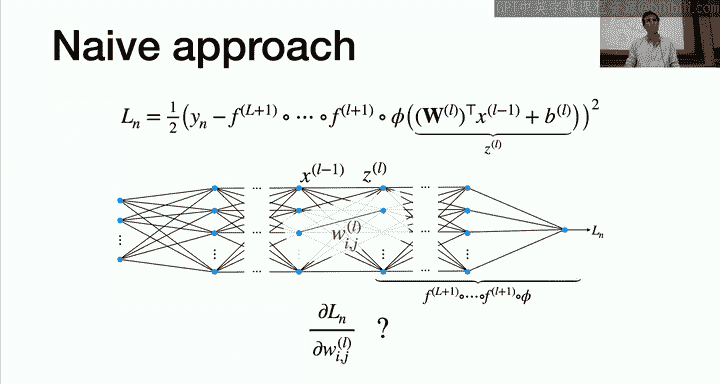

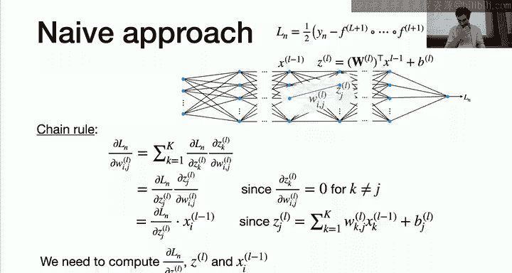

我们的目标是找到一组参数 **(W, b)**，使得损失函数 **L** 最小化。在实践中，我们可能还会添加正则化项（如权重衰减）来防止过拟合，但这不会改变训练算法的本质。

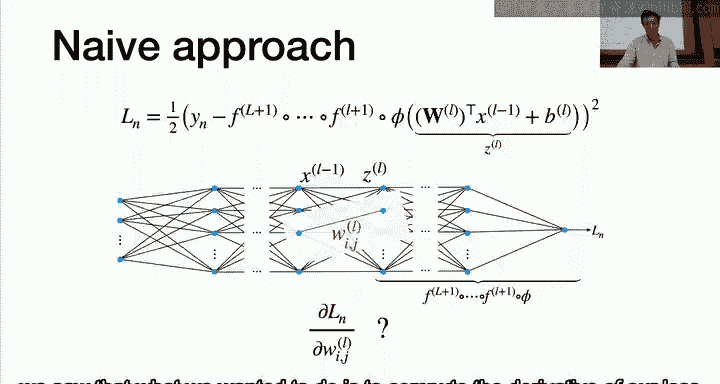

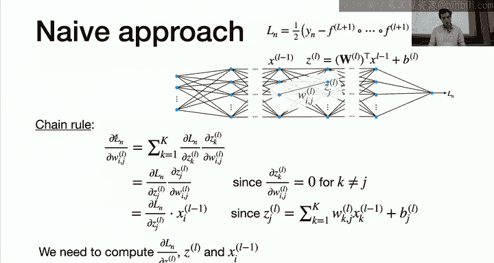

### 训练面临的挑战

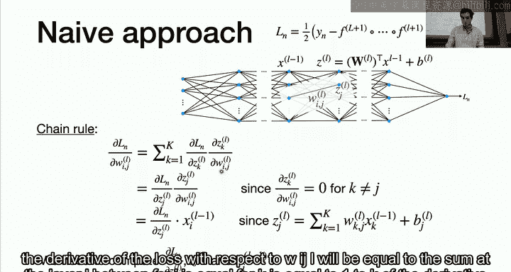

与线性回归、逻辑回归等模型不同，训练神经网络面临两个主要挑战：
1.  **非凸优化问题**：损失函数 **L** 关于参数 **(W, b)** 是**非凸**的。这意味着优化算法不能保证收敛到全局最小值，而可能陷入局部极小值或鞍点。
2.  **参数量巨大**：神经网络通常有大量参数（例如 **~K^2 * L**）。这意味着存在许多能完美拟合训练数据的函数，其中一些会泛化得很好，而另一些则会过拟合。仅仅最小化训练损失并不能保证获得泛化能力强的模型。

---

## 优化算法：随机梯度下降

我们如何最小化这个非凸的损失函数呢？

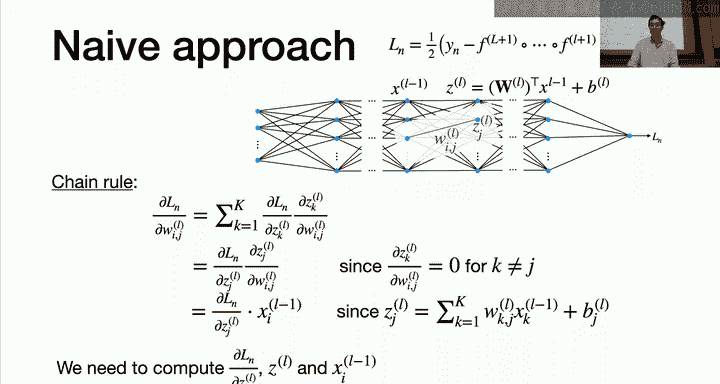

我们将使用**随机梯度下降** 算法。因为在实际中，训练集规模 **N** 通常很大，计算完整损失函数的梯度（批量梯度下降）成本太高。

在 SGD 的每一步，我们均匀地采样一个样本 **n**（或一个小批量 mini-batch），然后计算该样本的个体损失函数的梯度：

**个体损失：** **l_n = (y_n - F(x_n))^2**

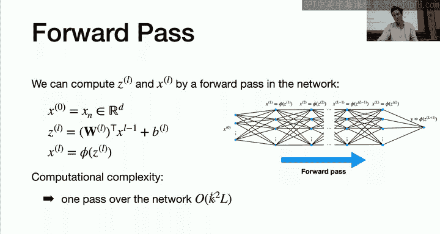

然后，我们沿着该梯度负方向更新所有参数：

**参数更新（对于权重 w_{ij}^l）：** **w_{ij}^l := w_{ij}^l - η * (∂l_n / ∂w_{ij}^l)**
（偏置 **b** 的更新类似）

其中 **η** 是学习率。

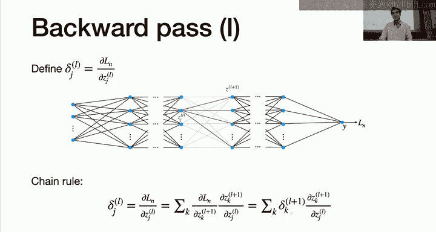

因此，实现 SGD 算法的关键在于：**如何高效地计算损失函数关于每个参数的梯度 (∂l_n / ∂w_{ij}^l) 和 (∂l_n / ∂b_j^l)**。这正是本节课要解决的核心问题。

**SGD 的优势**：尽管问题是非凸的，但 SGD 在实践中表现非常好，通常能找到训练损失较小的解，并且这些解往往具有良好的泛化能力。

---

## 反向传播算法：高效计算梯度

神经网络函数是许多层的复合函数。计算梯度需要应用链式法则。直接计算所有参数的梯度看似计算量巨大（可能有 **O(K^2 * L)** 个参数，每个梯度计算又涉及多层链式求导）。

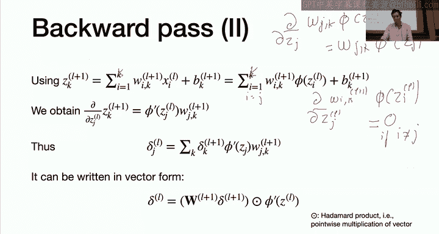

然而，**反向传播算法** 提供了一种非常高效的方法，能够以大约 **O(K^2 * L)** 的复杂度（即与参数量同阶）计算出所有梯度。

### 第一步：前向传播

在计算梯度之前，我们需要先进行一次**前向传播**来计算网络中所有节点的值。

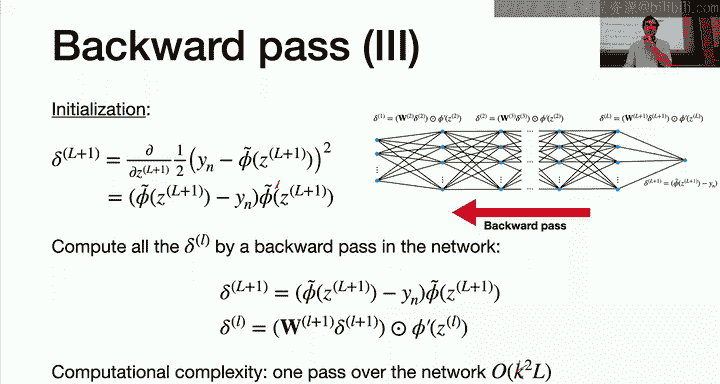

**算法过程：**
1.  从输入 **x^0 = x** 开始。
2.  对于每一层 **l = 1 to L+1**：
    *   计算 **z^l = W^l * x^{l-1} + b^l** （应用权重和偏置）
    *   计算 **x^l = φ(z^l)** （应用激活函数）

前向传播结束后，我们得到了所有层的 **z^l** 和 **x^l**。这个过程的复杂度是 **O(K^2 * L)**，与网络参数数量成正比。

### 第二步：反向传播与梯度计算

现在，我们需要计算损失函数关于每个 **z_j^l** 的梯度，我们将其记为 **δ_j^l**：

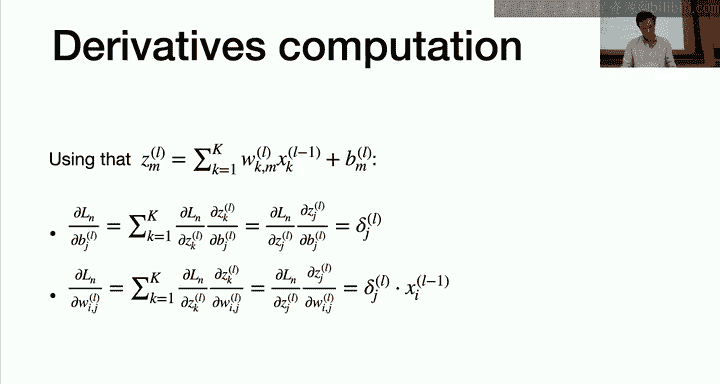

**定义：** **δ_j^l = ∂l_n / ∂z_j^l**

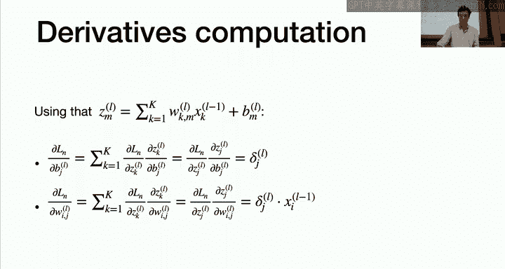

**关键思想**：我们可以从输出层开始，反向逐层计算这些 **δ**。

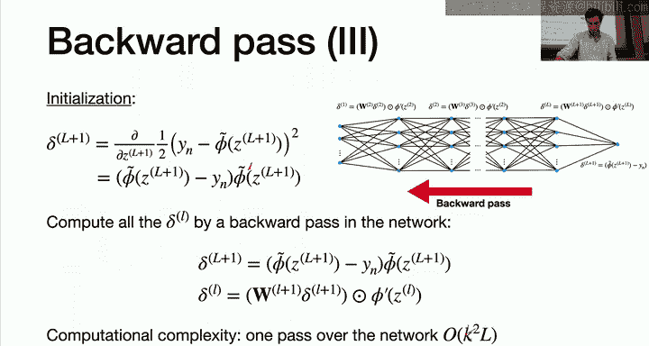

1.  **初始化输出层梯度 (δ^{L+1})**：
    对于回归问题（均方误差损失，输出层激活函数为恒等函数）：
    **δ^{L+1} = ∂l_n / ∂z^{L+1} = 2 * (F(x_n) - y_n) * φ̃'(z^{L+1})**
    由于 φ̃ 是恒等函数，其导数为1，所以简化为：
    **δ^{L+1} = 2 * (F(x_n) - y_n)**
    （如果使用其他损失函数或输出激活函数，此处公式会变化，但算法框架不变。）

2.  **反向递归计算 (δ^l)**：
    利用链式法则，可以推导出相邻层梯度之间的关系：
    **δ^l = ( (W^{l+1})^T * δ^{l+1} ) ⊙ φ'(z^l)**
    其中：
    *   **⊙** 表示逐元素相乘（Hadamard积）。
    *   **φ'(z^l)** 是激活函数在 **z^l** 处的导数向量。
    这个公式告诉我们，第 **l** 层的梯度可以通过第 **l+1** 层的梯度和第 **l** 层的权重矩阵转置相乘，再与第 **l** 层激活函数的导数逐元素相乘得到。

    我们从 **δ^{L+1}** 开始，利用上述公式反向计算 **δ^L, δ^{L-1}, ..., δ^1**。这个反向过程的复杂度也是 **O(K^2 * L)**。

3.  **计算参数梯度**：
    一旦我们有了所有的 **δ^l** 和前向传播中存储的 **x^{l-1}**，计算权重和偏置的梯度就非常简单了：
    *   **权重梯度：** **∂l_n / ∂w_{ij}^l = δ_j^l * x_i^{l-1}**
    *   **偏置梯度：** **∂l_n / ∂b_j^l = δ_j^l**

    直观理解：权重的梯度等于“该连接下游节点的误差信号 **δ_j^l**”乘以“该连接上游节点的激活值 **x_i^{l-1}**”。偏置的梯度直接等于其所在节点的误差信号。

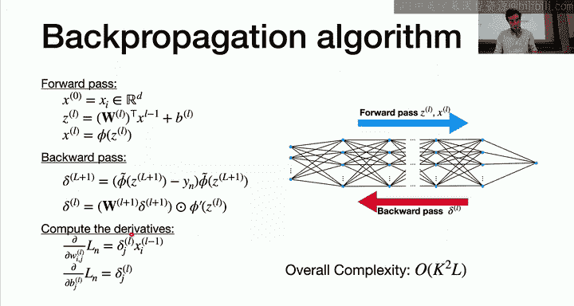

### 算法总结

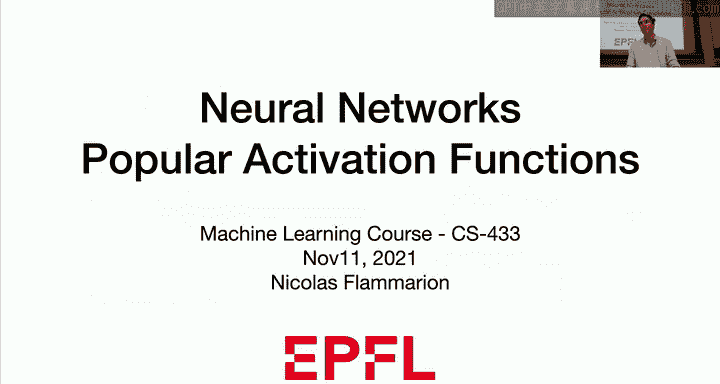

以下是反向传播算法的完整步骤：

1.  **前向传播**：输入 **x**，计算并存储每一层的 **z^l** 和 **x^l**。
2.  **计算输出误差**：根据损失函数计算 **δ^{L+1}**。
3.  **反向传播**：利用公式 **δ^l = ( (W^{l+1})^T * δ^{l+1} ) ⊙ φ'(z^l)** 从后向前计算所有 **δ^l**。
4.  **计算参数梯度**：利用公式 **∂l_n / ∂w_{ij}^l = δ_j^l * x_i^{l-1}** 和 **∂l_n / ∂b_j^l = δ_j^l** 计算所有权重和偏置的梯度。

通过一次前向传播和一次反向传播，我们就能高效地得到损失函数关于所有参数的梯度，然后就可以用 SGD 更新参数了。

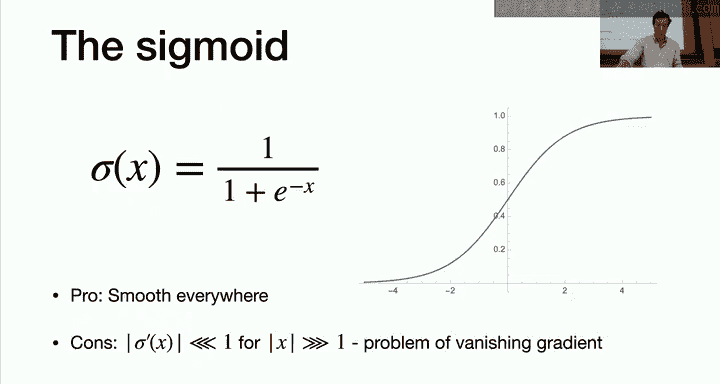

---

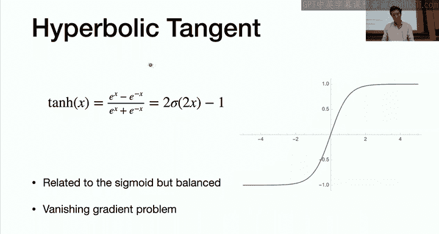

## 常用激活函数

在结束前，我们简要回顾几种常用的激活函数及其特点：

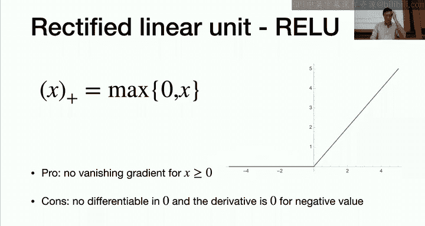

1.  **Sigmoid**：**σ(x) = 1 / (1 + e^{-x})**
    *   **优点**：平滑，易于求导。
    *   **缺点**：当输入绝对值很大时，梯度会趋近于0（梯度消失问题），这使得训练深层网络非常困难。

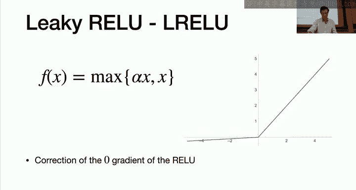

2.  **Tanh**：**tanh(x)**
    *   **优点**：输出以0为中心，收敛可能比Sigmoid快。
    *   **缺点**：同样存在梯度消失问题。

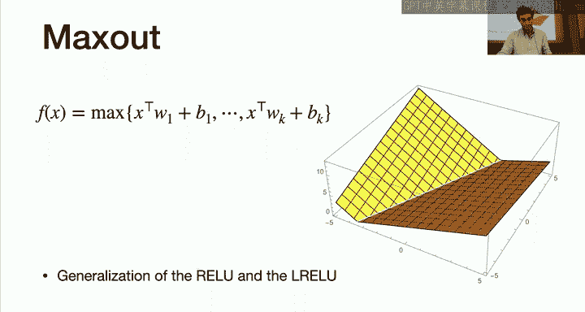

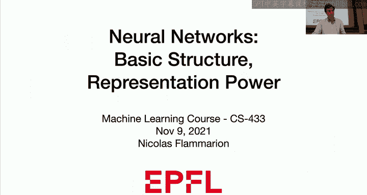

3.  **ReLU (整流线性单元)**：**ReLU(x) = max(0, x)**
    *   **优点**：对于正输入，梯度恒为1，有效缓解了梯度消失问题，使得训练深层网络成为可能。计算简单高效。
    *   **缺点**：在 **x=0** 处不可导（实践中通常指定一个导数）。对于负输入，梯度为0，可能导致某些神经元“死亡”（不再被激活）。

4.  **Leaky ReLU**：**LeakyReLU(x) = max(αx, x)**，其中 **α** 是一个小的正数（如0.01）。
    *   **优点**：解决了 ReLU 在负区间梯度为0的问题，可能缓解“神经元死亡”问题。

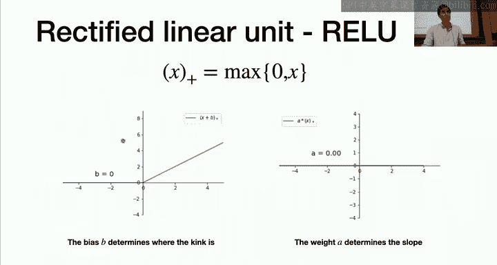

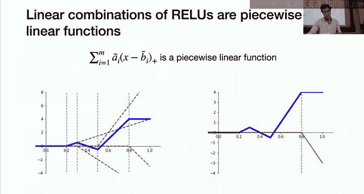

5.  **Maxout**：**max(w_1^T x + b_1, w_2^T x + b_2, ...)**
    *   **优点**：是 ReLU 和 Leaky ReLU 的泛化，可以学习更复杂的激活函数。
    *   **缺点**：参数数量增加。

**在实践中，ReLU 及其变体（如 Leaky ReLU）是最常用的隐藏层激活函数。**

---

## 总结

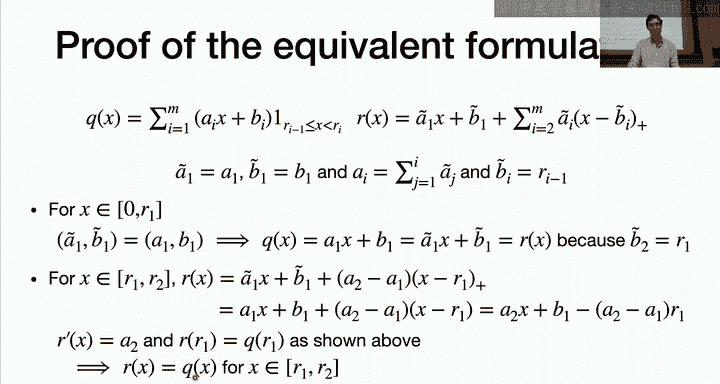

本节课中我们一起学习了：
1.  **神经网络的训练目标**：最小化损失函数（如均方误差），这是一个非凸优化问题。
2.  **核心优化算法**：使用**随机梯度下降** 来更新网络参数。
3.  **反向传播算法**：这是训练神经网络的核心。它通过一次**前向传播**计算网络中间值，再通过一次**反向传播**高效地计算损失函数关于所有参数的梯度。其关键在于利用链式法则和递归关系从输出层向输入层传播误差信号。
4.  **激活函数的选择**：我们比较了几种常见激活函数（Sigmoid, Tanh, ReLU, Leaky ReLU），并指出 **ReLU** 族函数因其能有效缓解梯度消失问题而成为训练深层网络的主流选择。

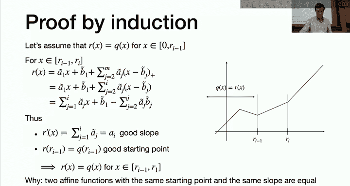

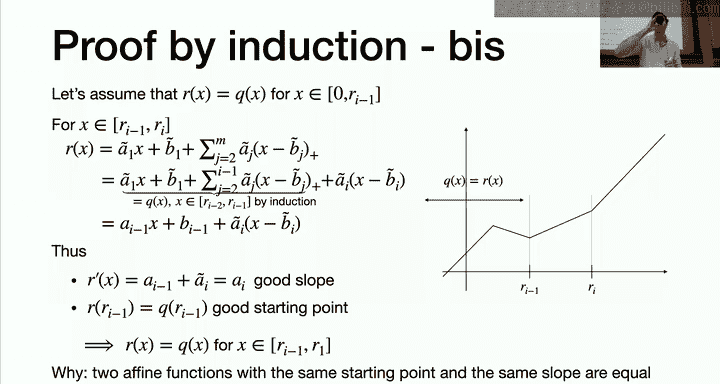

通过结合 SGD 和反向传播，我们能够有效地训练复杂的神经网络，使其在众多任务上取得卓越的性能。