# 25：卷积神经网络与深度学习技巧 🧠

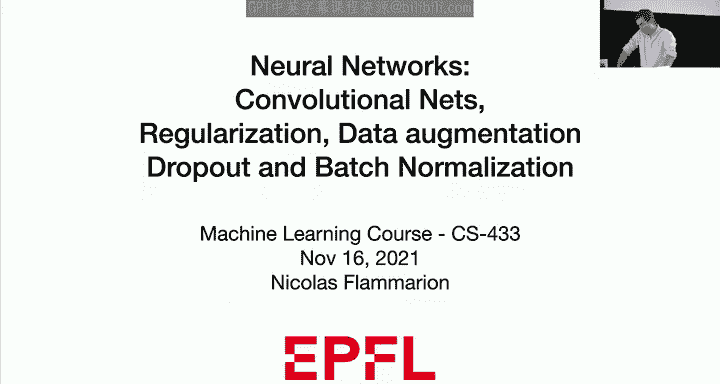


在本节课中，我们将学习深度学习中的多个核心主题，包括卷积神经网络、正则化、数据增强、Dropout和批归一化。这些技术是现代深度学习，特别是计算机视觉领域取得成功的关键。

---

## 从全连接网络到卷积网络 🔄

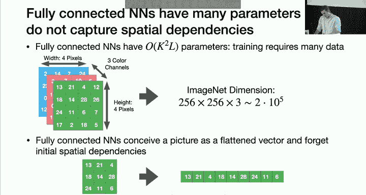

上一节我们介绍了全连接神经网络。在全连接网络中，每一层的每个神经元都与前一层的所有神经元相连。对于一个有L层、每层K个神经元的网络，其参数量级为 **O(K²L)**。参数量巨大，导致训练非常复杂，并且需要海量数据。

此外，当处理计算机视觉任务（如图像识别）时，输入维度极高（例如，256x256x3 ≈ 20万维）。全连接网络会将图像展平为向量，从而完全丢失了像素间的空间依赖关系（例如，相邻像素在展平后可能相距甚远）。这意味着我们失去了图像中至关重要的局部结构信息。

因此，我们需要一种既能处理高维数据，又能保留空间结构的网络架构。卷积神经网络应运而生。

---

## 卷积层：定义与核心思想 🧩

卷积层的核心思想是进行**局部加权平均**。它模仿了信号处理中的卷积操作，仅对输入数据的局部区域进行处理，从而提取特征。

### 卷积运算公式

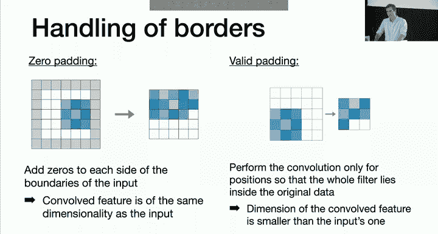

给定一个输入矩阵 **X⁰** 和一个滤波器（或卷积核）**F**，输出矩阵 **X¹** 中的每个元素计算如下：

```
X¹[n, m] = Σ_k Σ_l F[k, l] * X⁰[n + k, m + l]
```

其中，滤波器 **F** 是**局部**的，即当 k 和 l 较大时，F[k, l] = 0。这意味着输出 **X¹[n, m]** 的值仅依赖于输入 **X⁰** 在位置 (n, m) 附近的一小片区域。

### 卷积的关键特性

1.  **稀疏连接**：输出层的每个神经元只与输入层的一小部分神经元相连，这使得权重矩阵非常稀疏。
2.  **参数共享**：同一个滤波器 **F** 会滑动遍历整个输入图像。这意味着网络中许多不同的连接共享相同的权重值。

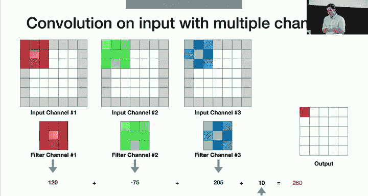

这两种特性极大地减少了模型的参数量，使其更易于训练，并能更好地捕捉图像的局部特征。

---

## 边界处理与填充策略 🛡️

在卷积过程中，滤波器移动到图像边界时，部分区域会超出图像范围。我们有两种主要的处理策略：

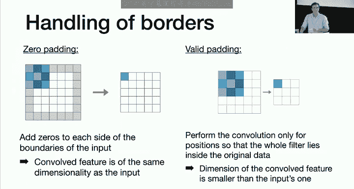

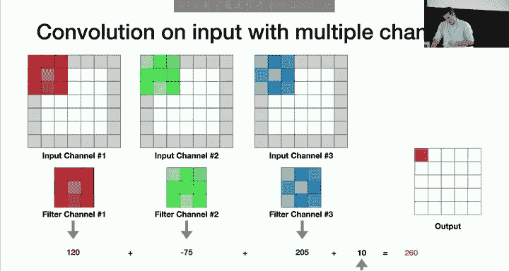

以下是两种主要的填充方式：
*   **零填充**：在输入图像的边界外围填充零值，使得卷积操作可以对原始图像的每一个位置进行计算。输出特征图尺寸与输入相同。
*   **有效填充**：只对输入图像中能够完整应用滤波器的位置进行计算。输出特征图尺寸会小于输入图像。

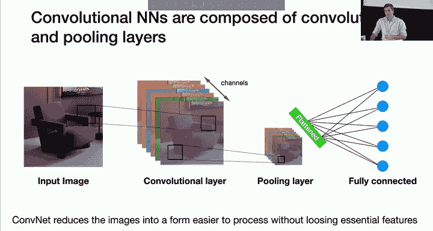

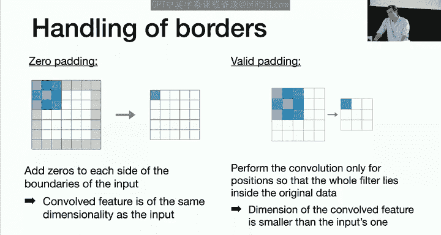

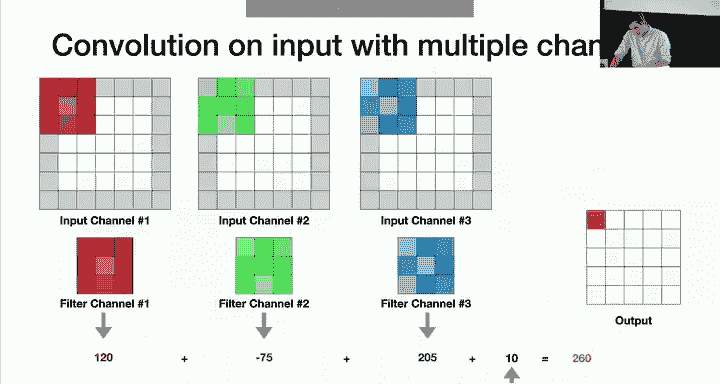

在实际构建网络时，可以根据架构设计选择使用零填充或有效填充。

---

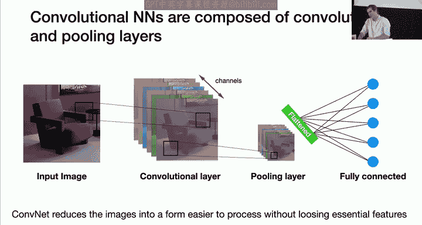

## 多通道卷积与池化层 📊

### 多通道卷积

在实践中，我们通常会对输入应用**多个不同的滤波器**。每个滤波器会产生一个独立的输出矩阵，这些矩阵被称为“通道”。因此，卷积层的输出是一个三维张量（高度 x 宽度 x 通道数）。

当输入本身具有多个通道（例如RGB图像的3个通道）时，卷积核的深度必须与输入通道数相同。计算时，对每个输入通道应用对应的滤波器，然后将所有通道的结果求和，并加上偏置项，得到单个输出值。

### 池化层

池化层通常接在卷积层之后，用于**降低特征图的空间尺寸**，从而减少计算量并提取更鲁棒的特征。池化操作是逐通道独立进行的。

以下是两种常见的池化方式：
*   **最大池化**：取滤波器覆盖区域内的最大值。`输出 = max(区域值)`
*   **平均池化**：取滤波器覆盖区域内的平均值。`输出 = mean(区域值)`

池化操作通常以**非重叠**的方式滑动窗口。在实践中，最大池化因其更好的性能而更常被使用。

---

## 卷积神经网络的整体架构 🏗️

一个典型的卷积神经网络由卷积层和池化层交替堆叠而成。

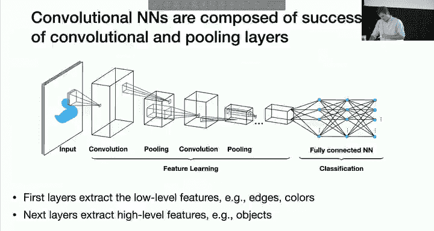

初始的卷积层倾向于提取低级特征（如边缘、颜色），随着网络加深，后续层能够提取更高级的特征（如物体部件）。


在通过一系列卷积和池化层提取特征后，我们会将最终的三维特征图**展平**成一个一维向量。然后，在这个向量后面连接一个或多个**全连接层**，用于完成最终的分类或回归任务。

整个网络的参数（权重和偏置）通过反向传播算法进行学习。

---

## 卷积网络的反向传播 ⚙️

卷积神经网络的反向传播需要考虑其两个特殊结构：

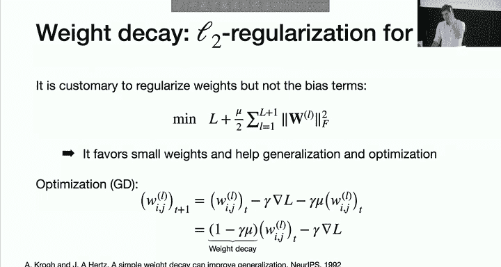

1.  **稀疏权重矩阵**：由于连接稀疏，许多权重恒为0，在反向传播中无需更新，这不会带来问题。
2.  **权重共享**：多个连接共享同一权重。处理方法是：
    *   首先，忽略权重共享，进行标准的反向传播，计算每个连接的梯度。
    *   然后，将所有共享同一权重的连接的梯度**求和**。
    *   最后，用这个求和后的梯度来更新那个共享的权重。

这本质上是链式法则在约束优化中的应用。


---

## 神经网络的泛化：正则化与数据增强 🛡️

### 权重衰减

与线性模型类似，对神经网络进行正则化有助于防止过拟合。通常我们只对**权重**进行L2正则化，而不对**偏置**项进行正则化。

**L2正则化**的目标函数为：`损失函数 + λ * Σ ||W||²`
这等价于在随机梯度下降更新时，加入**权重衰减**项：`W := (1 - γλ)W - γ * 梯度`

偏置项控制着激活函数的阈值，我们通常希望它能自由调整以适应数据，因此不加以正则化。

### 数据增强

数据增强是一种通过人工扩展训练集来提升模型泛化能力和鲁棒性的强大技术。其核心思想是应用一系列**保持标签不变**的变换 **τ** 到原始数据上。

例如，对于图像分类任务，有效的增强包括：
*   平移、旋转、缩放
*   水平翻转
*   裁剪、颜色抖动
*   添加噪声、模拟天气效果（雨、雪、雾）

通过数据增强，我们不仅获得了更多训练样本，还隐式地教会了模型对这些变换具有**不变性**，从而显著提升模型在真实复杂场景下的性能。


---

## Dropout：随机失活 🎲

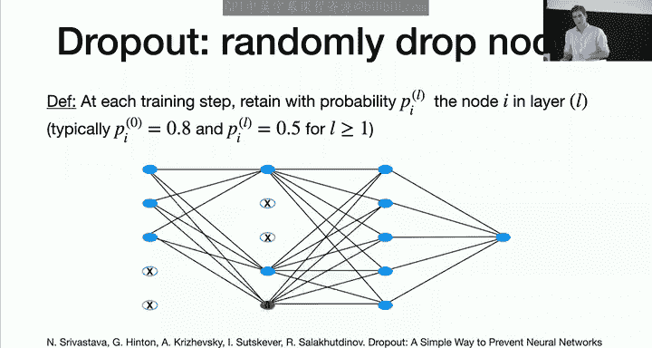

Dropout是一种在训练阶段随机“关闭”网络中一部分神经元的技术，它有两种重要作用：防止过拟合和实现模型集成。

### 训练阶段

对于网络中的每个神经元，以概率 **p**（保留概率）将其激活，以概率 **1-p** 将其输出置零（即“丢弃”）。每次前向传播时，都随机生成一个不同的“子网络”进行训练。

### 测试阶段

使用完整的网络进行预测。为了补偿训练时因丢弃神经元而导致的期望输出变化，需要对权重进行缩放：
*   **推理时缩放**：将训练好的所有权重乘以保留概率 **p**。
*   **训练时缩放（更常用）**：在训练时，对每个被保留的神经元的激活值除以 **p**。

### Dropout的作用

1.  **减少协同适应**：防止神经元过度依赖其他特定的神经元，迫使每个神经元都能独立地提供有用的特征。
2.  **近似模型集成**：训练过程相当于同时训练了大量不同的子网络。测试时对这些子网络的预测进行了平均，这类似于集成学习，但计算效率高得多。

---

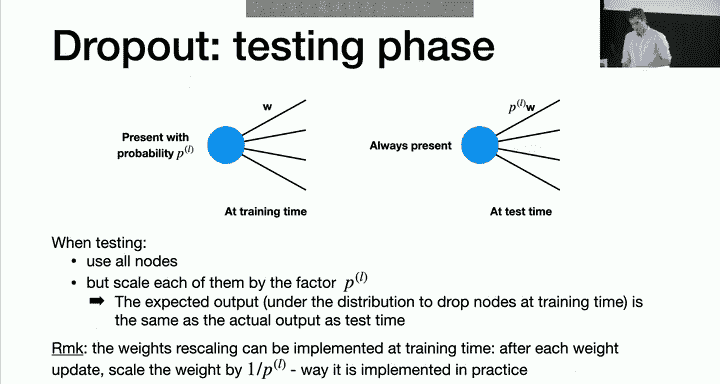

## 批归一化：稳定训练加速收敛 ⚡


批归一化是一种通过标准化每一层输入来稳定和加速深度网络训练的技术。

### 操作步骤

对于一个小批量数据中的某一层激活：
1.  计算该批数据的均值和方差：
    `μ = mean(批量数据)`, `σ² = variance(批量数据)`
2.  对数据进行归一化：
    `X_hat = (X - μ) / sqrt(σ² + ε)` （ε 是为数值稳定性添加的小常数）
3.  引入可学习的缩放和平移参数：
    `Y = γ * X_hat + β`
    参数 **γ** 和 **β** 通过网络学习得到，它们使网络可以恢复原始的表示能力。

### 主要优点

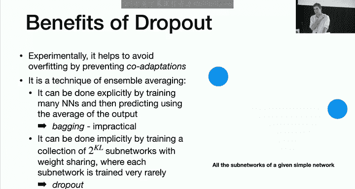

*   **允许使用更大的学习率**：减轻了内部协变量偏移问题，使优化地形更平滑。
*   **对初始化不那么敏感**。
*   **有一定的正则化效果**：因为每个样本的激活都受到批次内其他样本的影响。

在测试时，使用训练阶段计算得到的移动平均均值和方差进行归一化。

---

## 总结 📝


本节课我们一起学习了深度学习中几项至关重要的技术：

*   **卷积神经网络**：通过局部连接和权重共享，高效处理图像等网格化数据，保留空间信息。
*   **正则化**：通过权重衰减约束模型复杂度，防止过拟合。
*   **数据增强**：人工扩展数据集，提升模型泛化能力和对不变性变换的鲁棒性。
*   **Dropout**：在训练中随机丢弃神经元，防止过拟合并实现高效的模型集成。
*   **批归一化**：标准化层输入，稳定训练过程，允许使用更大的学习率，加速收敛。

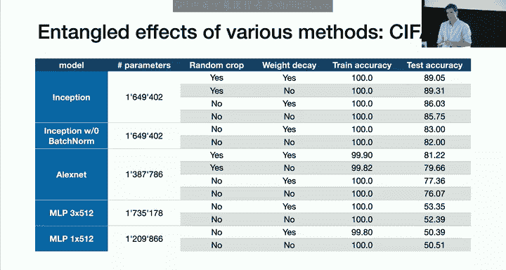

这些技术共同构成了现代深度学习，特别是计算机视觉领域取得突破性进展的基石。理解并合理运用它们，是构建高效、鲁棒神经网络模型的关键。