# 26：对抗性机器学习 🛡️

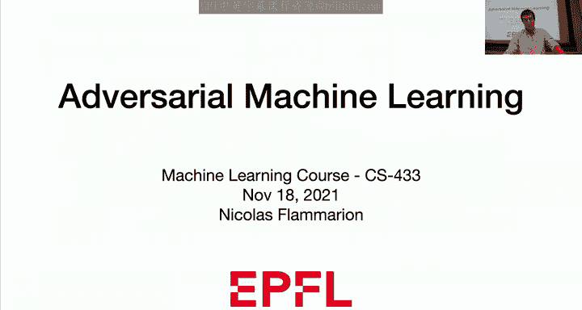

在本节课中，我们将学习一个机器学习领域的新兴且令人兴奋的主题——对抗性机器学习。这是一个在过去几年非常活跃的研究领域，但仍有许多工作要做，并且具有非常重要的实际应用价值。

## 什么是对抗性机器学习？🤔

当我们谈论对抗性机器学习时，我们具体在讨论什么？观察人类视觉，你会发现一些对人类来说困难的任务。例如，区分一张图片是狗还是拖把，对人类来说并不总是容易的。你可能会认为，神经网络在处理这类任务时也会遇到同样的问题。

然而，事实并非如此。对于神经网络来说，这类任务实际上非常容易。在许多模式识别、语音处理等任务中，今天的神经网络甚至能取得比人类更好的性能。但事实上，神经网络在做出预测和决策的方式上存在许多问题，它们并不具备鲁棒性。当我们希望使用神经网络来理解世界并做出决策时，这一点变得尤为重要。你真正需要的是一个可以信赖的、鲁棒的检测器。

今天我们将看到，神经网络很容易被欺骗，这是一个主要问题。

## 对抗样本 🎯

那么，我们所说的“被欺骗”是什么意思呢？这就是所谓的**对抗样本**。对抗样本是指你可以添加到图片中的一些微小扰动，这些扰动会使你的神经网络完全迷失方向。

例如，有一张猪的图片，所有人都能认出这是一头猪。但我们可以手动添加一些微小的噪声（注意，这种扰动是精心设计的，并且非常小）。当我们观察结果图片（即原始猪的图片加上这个小扰动）时，教室里的所有人仍然会看到一头猪，并且非常确信这是一头猪。

然而，如果你要求你的神经网络对这张图片进行分类，它会告诉你这是一架飞机。但如果你要求神经网络对原始图片进行分类，它会告诉你这是一头猪。对人类来说，这完全是同一张图片，但对神经网络来说，一张是猪，另一张是飞机。

这种现象并非这张图片所特有。我们今天将看到，对于任何图片，都有可能找到这样的扰动，从而使你的神经网络被欺骗。这就是所谓的对抗样本。

你可以看到，你的神经网络在处理这类样本时确实存在困难。不难想象，这在安全方面将是一个巨大的问题。因为如果欺骗你的网络如此容易，你如何能依赖你的数据来做出真正重要的决策？这不仅仅是针对自动驾驶摄像头，你可以想象在许多应用中，如果决策如此不可靠，你还能依赖它们吗？

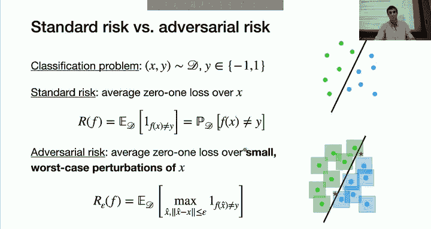

这是第一个问题。第二个问题是，即使不考虑安全问题，我们也发现我们根本不理解这些架构是如何泛化的。或者，是否可能当我仅轻微改变输入图片时，它的预测就发生了改变？这就是我们今天要讨论的问题。

## 形式化定义 📐

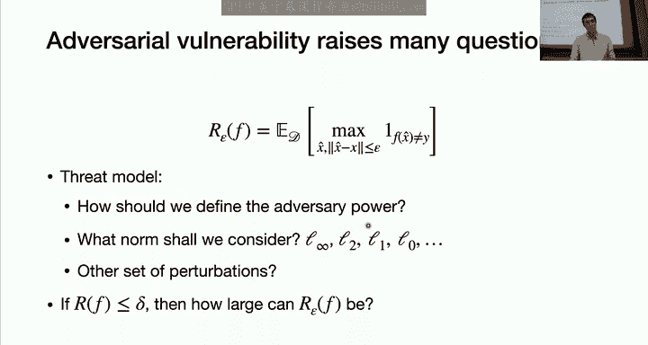

让我们尝试更形式化地定义这个问题。我们将考虑一个分类问题，具体来说是一个二分类问题。和往常一样，`(X, Y)` 遵循某个未知的分布 `D`，`Y` 属于两个类别：`-1` 和 `1`。

今天我们将主要讨论神经网络，因此我的函数 `F` 将是通过神经网络学习到的预测分类器。但鲁棒性问题实际上超越了神经网络，如果你考虑线性分类器，也会遇到同样的问题。这是一个非常普遍的问题。

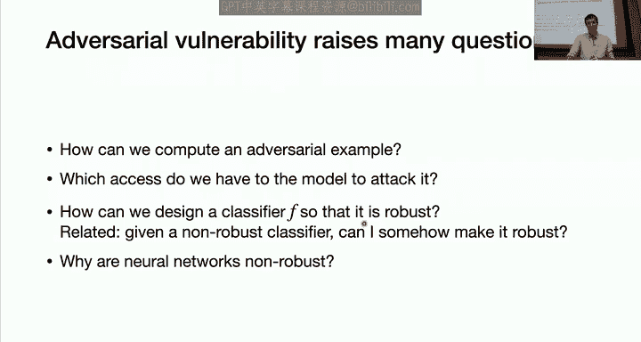

我们有一些来自 `D` 的样本，并学习了一个分类器 `F`。在课程的第一部分，我们了解到，为了判断你的分类器是否是一个好的分类器，你希望分类器具有较小的风险。我们关注的是分类损失，即 `F(x) ≠ y` 的指示函数。如果你分类正确，则没有损失；如果分类错误，则付出代价 `1`。我们对所有可能的 `(x, y)` 分布取损失的期望值。

这个期望值恰好等于犯错的概率。因此，在经典的监督学习中，我们希望最小化犯错的概率。但这是平均意义上的风险。

那么，如果你希望做出鲁棒的预测，这个风险定义的问题是什么？问题在于它是一个期望值，是平均意义上的风险。你希望平均意义上表现不太差，但它没有考虑到最坏情况。

因此，我们今天将引入所谓的**对抗风险**。对抗风险 `R_epsilon(f)` 在级别 `epsilon` 上仍然是期望值，但不再是对数据 `X` 取 `F(x) ≠ y` 指示函数的期望，而是对最坏情况指示函数取期望。我们取所有在 `X` 的球 `B_epsilon(x)` 内的 `x'` 中，指示函数的最大值。

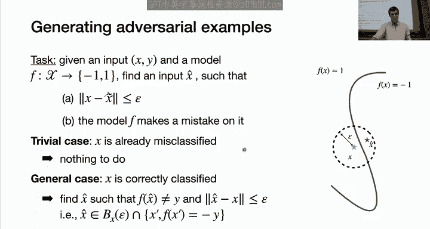

我们在这里做的是：假设我们有一个对手，他被允许轻微地操纵你的输入。对手不会让你在 `x` 上评估，而是让你在 `x'` 上评估，但你仍然希望表现良好。因此，你不仅希望在 `x` 上表现良好，还希望在 `x` 周围的所有球内都表现良好。

当然，你必须施加一些约束，因为如果没有任何约束，对手非常强大，可以将 `x'` 设置得离 `x` 非常远，那么问题将变得非常困难。这就是为什么我们要施加约束，要求 `x'` 不能离 `x` 太远。

我们需要定义这个距离是什么，以及 `epsilon` 是什么。本质上，对于每个 `x`，都有一个对手可以找到最坏的扰动，而你不希望被欺骗。

我们可以通过图片来理解这一点。经典风险是：我们有一些点，例如 `-1` 和 `+1`，我们希望找到一个分类器能很好地对我们的数据进行分类。我们只是希望所有绿点在一侧，所有蓝点在另一侧，这是标准的经典风险。

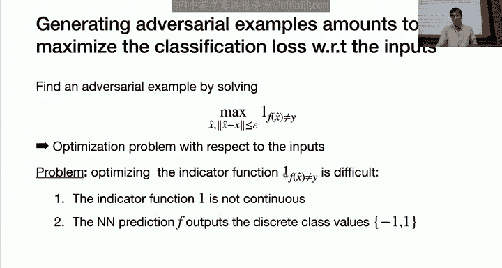

当我们考虑对抗风险时，我们观察每个点 `x` 周围的某个球，并希望你在该球内预测相同的标签。现在，如果我观察这个之前获得很小标准风险的线性预测器，你会发现这个预测器的对抗风险会变差，因为例如对于那个在标准风险下分类正确的点，我现在可以找到一个最坏情况的实例，而它没有被正确分类。

因此，你不仅希望风险对所有输入 `X` 都很小，还希望显然能在 `X` 周围的所有球内进行正确预测。这就是对抗风险的定义。

需要牢记的重要一点是，对于某些预测器，有可能具有非常低的标准风险，但却具有很大的对抗风险。仅仅因为你强制要求在这个定义下表现良好，并不意味着它就是鲁棒的。

这就是为什么当我们考虑鲁棒性时，你不仅希望平均意义上表现良好，还希望在最坏情况下表现良好。你真正希望的是不存在能欺骗你的对抗样本。因此，如果你能最小化这个对抗风险，那么你将得到一个鲁棒的分类器。

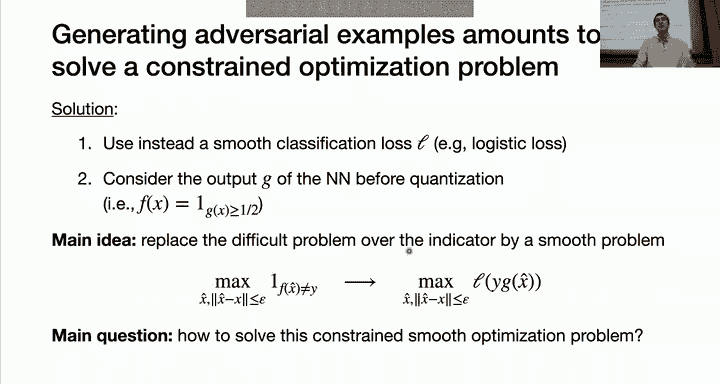

## 对抗风险引发的问题 ❓

对抗性漏洞引发了许多不同的问题。

1.  **如何定义威胁模型？** 如何定义对手的游戏规则？你需要考虑使用哪种范数：`L∞` 范数、`L2` 范数、`L1` 范数，还是 `L0` 范数（这不是一个真正的范数）？你如何描述你的几何形状？或者你想定义一组扰动？这里我们只考虑一些球，但它可以是任何你可以描述的集合。这就像是第一个问题：我应如何定义我的威胁模型？这个威胁模型定义了对抗性程序。

2.  **标准风险小的预测器，其对抗风险能有多差？** 如果你有一个标准风险很小的神经网络 `F`，当你观察对抗风险时，情况能有多糟糕？对抗风险能有多大？这是我们将尝试解决的第二个问题。

3.  **如何计算对抗样本？** 我们是否有算法，对于每个输入图片，都能给出一个对抗样本？对于这样的算法，它需要何种程度的神经网络访问权限？这也是我们今天要讨论的。

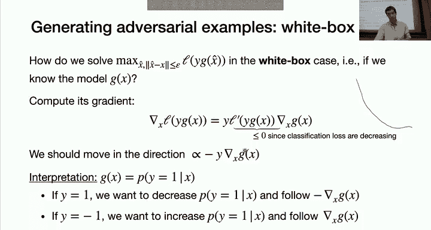

4.  **是否可能设计一个鲁棒的分类器？** 是否可能解决这个问题？是否可能使用神经网络设计一个鲁棒的分类器？我们该如何做？

5.  **是否可能将一个非鲁棒的分类器转化为鲁棒的？** 如果我们给你一个不鲁棒的分类器 `F`，是否可能通过某种理论变换将其转化为鲁棒的分类器？这也是可能的，你可以在课程资料中查看。

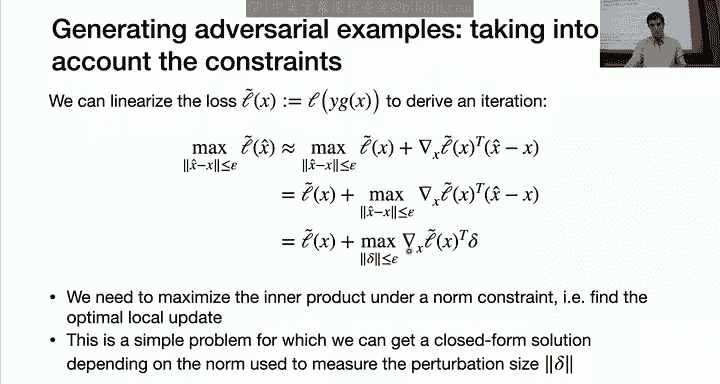

6.  **为什么神经网络如此不鲁棒？** 如果时间允许，我们将尝试稍微探讨一下。

你可以看到，所有这些对抗性机器学习问题都非常重要，我们将尝试回答其中的一些问题。

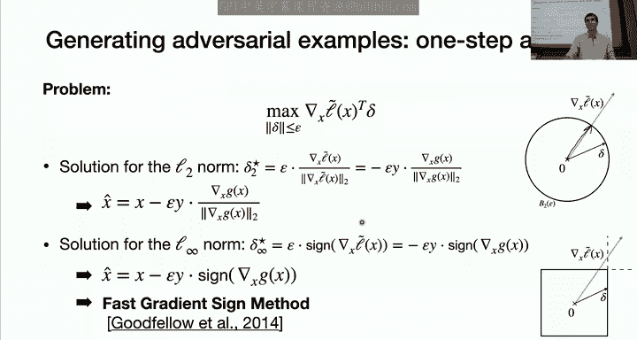

## 生成对抗样本 ⚔️

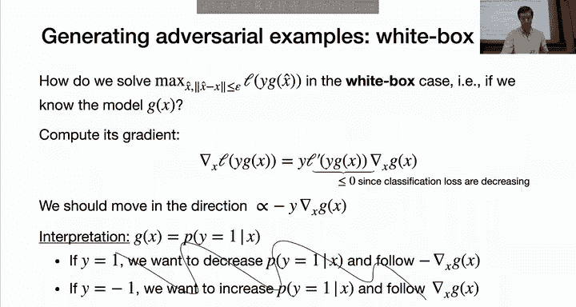

首先，让我们看看如何生成对抗样本。我们如何获得能欺骗神经网络的、对猪图片的扰动？

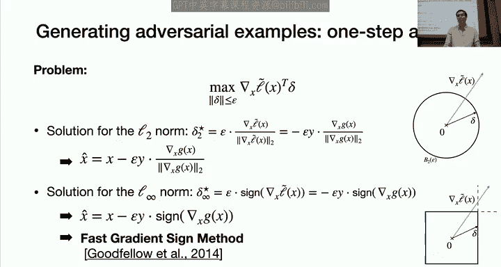

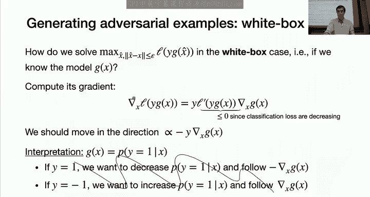

我们想要做什么？我给你一个输入 `(x, y)`，即一张图片和一个标签（例如一张猪的图片，我告诉你这是一头猪）。我还给你一个神经网络 `F`。你的神经网络实际上是一个从图片空间到 `{-1, 1}` 的函数（在之前的例子中是多分类问题，有猪、飞机等不同类别；这里我们只考虑二分类 `-1` 和 `1`，但问题是完全相同的）。

我给你一个输入，我给你一个模型。你的任务是什么？你想找到一个输入 `x'`，使得：
1.  `x'` 接近 `x`。你希望你的对抗样本不要离初始图片太远，有一个指定的距离，你希望这个距离小于 `epsilon`。
2.  你的模型 `F` 在 `x'` 上犯错误。你希望找到一张接近猪的图片，但当你问神经网络这是否是一头猪时，神经网络说不是。

施加这个约束非常重要，否则会非常容易：如果给出另一张图片，它当然不是猪。所以，你想找到接近 `x` 的 `x'`，使得神经网络在这个 `x'` 上犯错误。

有两种可能的情况：
*   **简单情况**：`x` 已经被网络错误分类。那么你什么都不用做，因为你已经找到了一个非常接近 `x` 的点（就是 `x` 本身），并且你的神经网络在预测这张图片时犯了错误。
*   **我们假设的情况**：`x` 被你的神经网络正确分类。我们假设 `F(x) = y` 是正确的标签。我们想找到一个点 `x'`，使得 `F(x') ≠ y`，并且 `||x' - x|| ≤ epsilon`。

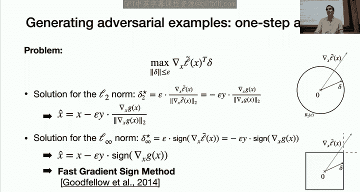

观察图片，我们想要什么？我们想找到一个点 `x'`，它在以 `x` 为中心、半径为 `epsilon` 的球内，并且在你决策边界的另一侧。这里 `x` 在 `+1` 的一侧，所以你希望找到一个点，使得 `F(x') = -1`。

因此，问题完全等同于在这个集合中找到一个点：你的球与神经网络预测标签为 `-y` 的所有点的交集。

为了找到这样的 `x'`，你能做什么？想象我给你无限的计算能力，你可以直接在这个集合中搜索并尝试找到一个点。但这在计算上不可行。我们还能尝试做什么？我们可以尝试限制搜索空间，这是一个选择。但我们还能做更简单的事吗？每当我们想做某事时，我们通常会做什么？我们会尝试找到一个优化目标，这样如果你解决了这个目标，你就会找到一个对抗样本。这个目标将不是凸的，但我们已经不害怕非凸性了。

## 转化为优化问题 🔄

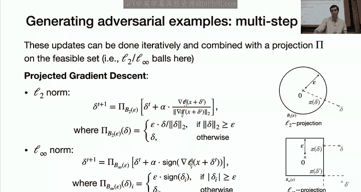

实际上，尝试找到一个对抗样本完全等价于最大化以下函数：
`max_{x' : ||x' - x|| ≤ epsilon} 1_{F(x') ≠ y}`

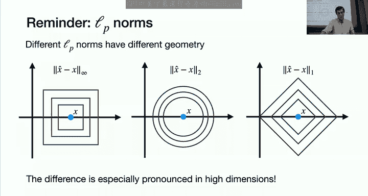

为什么等价？根据定义，一个对抗样本是一个满足约束的点 `x'`，使得 `F(x') ≠ y`。所以，如果你有一个对抗样本，这个值将等于 `1`。由于这个函数只取 `0` 或 `1`，最大化它就相当于找到一个 `x'` 使这个函数等于 `1`，也就相当于找到一个对抗样本。

所以，如果你能解决这个最大化问题，你就完成了，找到了你的 `x'`。

这个问题与之前课程中看到的问题的主要区别是什么？
1.  之前，当我们考虑分类损失时，我们想对函数 `F` 进行优化，想找到一个实现低分类损失的预测器。现在，我的优化问题不再针对函数 `F`，而是针对我的输入 `x'`。我在寻找一个输入 `x'`，使分类损失很大。
2.  第二个区别是，我们现在是在做最大化，而不是最小化。

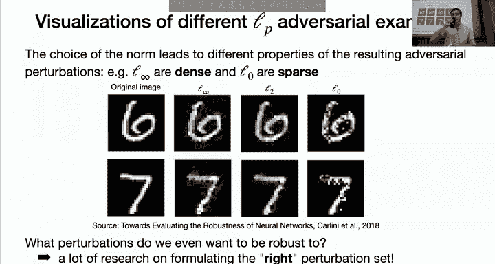

另外，如果你还记得，当我们讨论支持向量机时，我们遇到了完全相同的问题：为什么这个优化问题很困难？除了非凸/非凹之外，首先是因为指示函数是一个非连续函数。它从 `1` 跳到 `0` 的方式是不连续的。所以这个函数不可微，难以最小化或最大化。非连续优化比连续优化更困难。

第二个问题是，我们考虑的是神经网络。我们考虑神经网络直接输出类别。所以神经网络是一个分类器，其输出值在 `{-1, 1}` 之间。所以它是一个从 `x` 到 `{-1, 1}` 的函数，输出空间是离散的，因此也很难微分。

我们已经在考虑分类损失时遇到过这两个问题。你还记得我们如何解决这两个问题吗？

对于第一个问题（非连续性），我们可以通过另一个平滑函数来松弛这种不连续性。对于第二个问题（神经网络输出离散值），我们可以考虑神经网络在量化之前的输出。我们假设神经网络在做出决策之前输出一个连续值 `G(x)`，它可以被解释为估计 `y=1` 给定 `x` 的概率。然后，神经网络根据这个概率进行预测：如果 `G(x) > 0.5`，则预测标签为 `1`，否则为 `0`（或者用符号函数：如果 `G(x)` 为正，则预测 `+1`；为负则预测 `-1`，这完全一样）。

因此，为了解决第二个问题，我们考虑神经网络在量化之前的输出，即一个连续值。

主要思想是，我们将这个困难的问题（最大化一个不连续函数）替换为这个更简单的问题：最大化一个平滑函数。现在我想在一个约束集上最大化一个平滑函数。

但你仍然可以看到，这仍然不容易，因为你的神经网络 `G` 是一个非凸函数。所以你仍然有一个非凸问题：在一个集合上最大化这个非凸函数，这仍然是一个难以保证收敛的问题。但在实践中，它通常工作得非常好。

另一个主要问题是我们将如何解决这个平滑且有约束的问题？正如你所说，我们将尝试使用基于梯度的优化。但与之前的主要区别是什么？
1.  我不再是对网络的权重参数进行优化，而是在对输入进行最大化。
2.  我是在最大化函数，而不是最小化。
3.  我的集合上有约束。

## 白盒攻击：已知模型 🕵️

首先，让我们看看如何在所谓的**白盒**情况下最大化这个问题。白盒情况是指你完全了解你的模型 `G(x)`。你可以访问 `G(x)`，可以微分 `G(x)`，你知道一切。

如果你知道一切，并且你想最大化这个函数，首先假设我们忘记约束，我们应该做什么？我们已经将不可微的程序松弛为一个可微的程序，所以我们想计算这个函数关于输入的梯度。这并不难，损失函数关于输入的梯度恰好等于：损失函数的导数在 `(y, G(x))` 处的值，乘以 `y`，再乘以神经网络关于 `x` 的梯度。

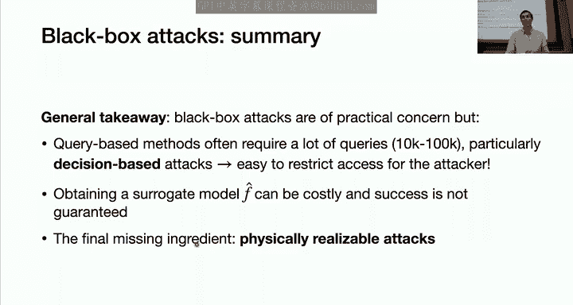

现在我们将使用分类损失是递减的这一事实，即 `l'` 是负的。所以，如果我想沿着最大化这个函数的方向前进，我应该遵循正梯度方向。我不再是做最小化，所以我不遵循负梯度方向，而是遵循正梯度方向。因此，我想沿着 `-y * ∇_x G` 的方向前进。

这里的解释是：如果我告诉你 `G(x)` 是 `y=1` 的概率，那么如果 `y=1`，你想降低这个概率，因为你想要犯错误。所以你想沿着负梯度方向走。如果 `y=-1`，那么为了犯错误，你想增加 `y=1` 的概率，所以你想沿着 `G(x)` 的梯度方向走。所以在两种情况下，你都想沿着 `-y * ∇G(x)` 的方向前进。

这样就结束了吗？我们只需要做梯度上升，乘以某个步长，也许做多步？它会给出解吗？问题是什么？首先，即使在这之前，我们必须考虑约束。如果我只是遵循正梯度步长，我可能会发散到无穷大。所以我们必须考虑我希望 `x'` 接近 `x` 这一事实。

## 处理约束：投影梯度上升 📏

由于 `epsilon` 被认为很小，我们想要带有小噪声的对抗样本，否则就不那么有趣了。我可以做的是，仍然考虑我函数的一阶近似（线性化）。用 `L_tilde(x)` 表示我的函数 `L(y, G(x))`，以简化符号。

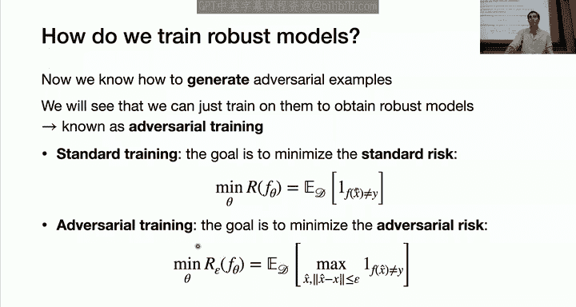

我想要的正是最大化 `L_tilde`，对于接近 `x` 的 `x'`，满足 `||x' - x|| ≤ epsilon`。由于 `epsilon` 很小，我说这个函数的最大化非常接近其线性近似的最大化。线性近似恰好等于 `L_tilde(x) + ∇L_tilde(x)^T (x' - x)`。

我想在 `x'` 上取这个的最大值。第一项完全独立于 `x'`，所以我可以取内部的最大值，得到 `L_tilde(x)` 加上后面项的最大值。然后我可以做变量替换 `x' - x = δ`。所以我想做的是：最大化我的梯度和 `δ` 的标量积，其中 `δ` 的范数不大于 `epsilon`。

这就是我们试图寻找的：最优局部更新。在局部，如果你接近 `x` 并且想最大化损失函数，它将由这个问题的解给出。好处是，对于许多范数，有可能得到闭式解。

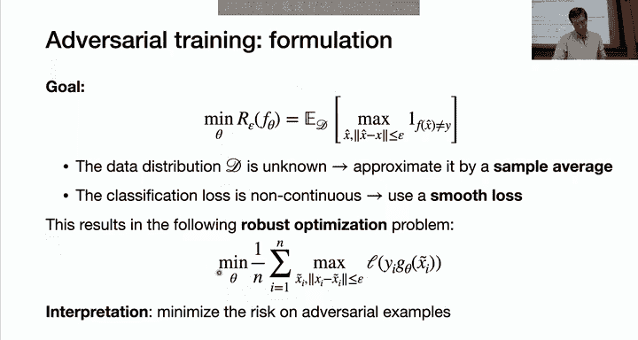

你想取能使你的内积尽可能大的 `δ`，从而使你的损失函数尽可能大。这就是所谓的**最速上升**，你想找到能最快增加函数值的方向。

## 具体攻击方法：FGSM 和 PGD 🎯

我们将看到，对于许多范数，可以以闭式解决它。这就是所谓的**单步攻击**，我们只做一步梯度上升。我们想最大化这个线性函数，它是有约束的。

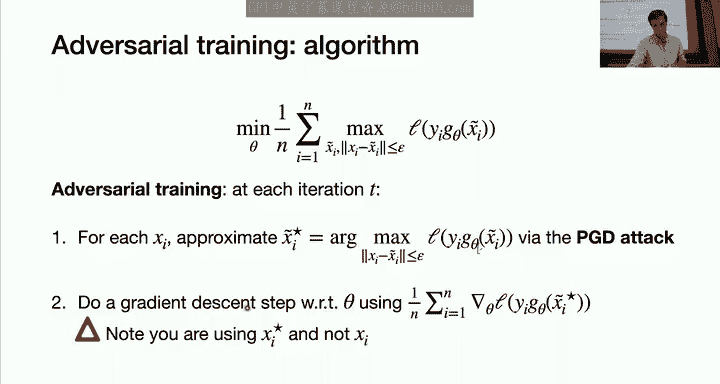

考虑 `L2` 范数的情况。我的球由这个圆（球）给出。我有我的梯度向量，我想找到在我的球面上的向量 `δ`，使得它与我的梯度向量的标量积最大。很自然地，取 `δ` 恰好沿着梯度方向，并按比例缩放，使得 `δ` 的范数等于 `epsilon`。所以 `δ` 恰好等于 `epsilon` 乘以你的梯度 `∇L_tilde` 的归一化向量。

因此，最大化这个内积的 `δ` 恰好是与你的梯度对齐的向量，然后你固定 `δ` 的尺度为 `epsilon`。所以这个向量与我的梯度对齐，其尺度为 `epsilon`：我先归一化我的梯度，然后乘以 `epsilon`，这样 `δ` 的范数恰好是 `epsilon`。

然后为了计算 `x'`，你只需更新你的起点 `x`，并加上你的 `δ`。所以这是我们的算法：你有一个点 `x`，然后你给这个点 `x` 加上这个梯度。你可以看到，你的 `x'` 恰好在你集合的边界上。如果你看约束，它恰好满足：`||x' - x||` 恰好等于 `epsilon`。

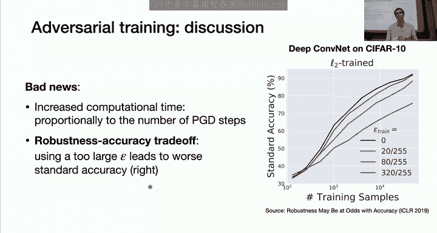

现在你计算出了 `x'`，你想用它做什么？这是你的目标：你想找到一个 `x'` 使你的模型出错。你已经计算出了 `x'`，它在局部最大化了你的损失。现在你想检查这是否是一个对抗样本，所以你想计算 `