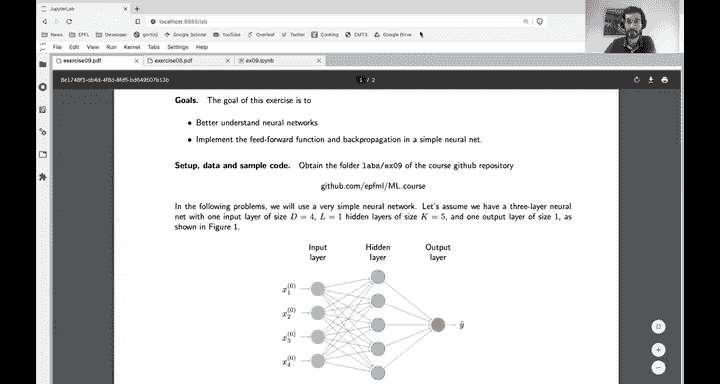

# 27：练习9 - 入门视频 🧠

在本节课中，我们将学习更多关于神经网络的知识。我们将深入探讨反向传播的工作原理，并分析神经网络权重空间的一些内部机制。

在此之前，我们曾学习如何使用 PyTorch 实现具有多层、复杂损失函数和不同激活函数的神经网络。PyTorch 是一个对研究者和工程师都非常有用的工具，它抽象了计算神经网络梯度所需的大部分复杂工作。

然而，在今天的练习中，我们将尝试完成这些复杂工作。这很重要，因为如果我们能在实践中至少实现一次反向传播，将有助于我们更好地理解神经网络的工作原理。

本周的练习包含两个部分。第一部分更偏实践，我们将计算并实现一个简单的单隐藏层神经网络的前向传播和反向传播。第二部分，我们将对这个网络进行一些分析。

## 第一部分：实现前向与反向传播 🔄

上一节我们介绍了本次练习的目标，本节中我们来看看具体的实践部分。

我们将使用一个非常简单的模型。该模型是一个简单的神经网络，包含一个具有5个神经元的隐藏层，以及一个4维的输入层。这个神经网络将实现一个前向传播，输出一个标量 `y_hat`。

### 练习1：实现前向传播

在第一个练习中，要求你根据网络结构进行计算以得到 `y_hat`。这个练习需要使用 NumPy（而非 PyTorch）来实现这个神经网络的前向传播路径，本质上就是将这些方程用 NumPy 重写一遍。

以下是具体步骤：

*   首先，你需要从逻辑回归课程的代码中复制 `sigmoid` 函数及其梯度的代码。
*   然后，实现一个前向传播函数。
*   我们提供了一些简单的测试，用于验证你的实现是否正确。我们会给出一些示例权重值和输入向量。如果你的函数实现正确，对于这个特定的权重和输入，你得到的标量输出值应该接近预期的结果。

### 练习2：实现反向传播

在练习的第二部分，我们将计算网络权重相对于损失的梯度，这是训练神经网络所必需的。具体来说，我们将针对特定的损失函数进行计算。

这个练习要求你重现课程中计算反向传播的步骤，本质上就是在网络权重上应用链式法则计算损失函数的梯度。

以下是计算梯度的步骤：

*   首先，你需要推导出隐藏层权重的梯度表达式，然后是输入层到隐藏层权重的梯度表达式。
*   为此，你只需要应用链式法则。首先计算损失函数对 `y_hat` 的偏导数，然后计算 `y_hat` 对权重的偏导数，依此类推。
*   正如课堂上所讲，简化计算的一个好方法是引入中间变量 `Z1`。请仔细进行这些计算。

一旦推导出这些表达式，你需要再次使用 NumPy 编写这些表达式，并计算网络的反向传播。和之前一样，我们会提供一些示例权重值。

如果你的函数实现正确，梯度计算测试将会通过，这表明你的实现是正确的。

## 第二部分：权重空间的理论分析 📊

上一节我们完成了神经网络前向和反向传播的实践，本节中我们将转向更理论化的分析。

尽管神经网络非常难以分析，但有时我们可以利用课程中学到的一些工具来获得一些直观理解。在这个练习中，我们将讨论一个抽象的神经网络，我们甚至不知道其具体架构，但至少知道我们可以将其所有权重写成一个向量 **W**。

我们将研究神经网络在权重空间（即所有权重可能取值的空间）中的一些性质。为此，我们将对损失函数的结构做一些假设。

众所周知，神经网络的损失函数曲面或优化过程非常复杂，难以分析。但研究者有时为了理解其工作原理，会假设在某个特定点附近，损失函数是凸的。具体来说，我们将假设损失函数在最优权重点 **W*** 附近可以近似为一个二次函数。

这实际上就是在最优权重集附近对损失函数进行二阶泰勒展开。在这个展开式中，没有梯度项，因为我们在最优点附近，而最优点的梯度为零。因此，这个泰勒展开只包含一个由海森矩阵（Hessian）决定的二次项。海森矩阵是损失函数对权重的二阶导数矩阵。

练习要求你思考：如果现在我们给这个损失函数加上一个类似于岭回归的正则化项，会发生什么？问题在于，添加这个正则化项后，最优解 **W*** 将如何变化？

这个假设的好处在于，它将所有非凸性抽象掉了，至少在 **W*** 附近，我们得到了一个凸损失函数。这样，我们就可以使用已学过的凸优化工具，推导出这个二次函数的精确最小值。

你会发现，通过令梯度为零来推导这个最小值，正则化问题的解将具有以下形式：

**W_reg** = (**H** + μ**I**)^(-1) **H** **W***

其中，**H** 是海森矩阵，μ 是正则化系数，**I** 是单位矩阵。

这个解可以理解为：没有正则化时的最优解 **W***，乘以一个依赖于 μ 和海森矩阵特征分解的矩阵。

### 深入理解正则化效应

推导出这个表达式后，练习的下一部分旨在理解这个项背后的直观含义。

首先，我们需要分析矩阵 (**H** + μ**I**)^(-1) **H** 的特征值。你会发现，这实际上是一个对角矩阵，其特征值由因子 μ 重新缩放。

具体来说，对于海森矩阵 **H** 的每个特征值 λ_i，新矩阵对应的特征值为 λ_i / (λ_i + μ)。

最后的练习试图理解这在实际情况中意味着什么。我们假设海森矩阵有不同的特征值。问题是，根据特征值的大小，正则化项的效果会有什么不同？

我们要求你证明：对于较大的特征值，正则化的影响微乎其微，在该特征向量方向上的分量基本保持不变；而正则化效果主要作用于那些特征值非常小的方向。

这个练习旨在让你更正式地展示这一点，并围绕这个概念建立直观理解。

## 总结 📝

本节课中我们一起学习了神经网络的核心机制。我们首先动手实现了一个简单神经网络的前向传播和反向传播，以深入理解梯度计算过程。接着，我们通过理论分析，探讨了在最优解附近用二次函数近似损失函数时，权重正则化如何影响最终解，并理解了其效果在不同特征值方向上的差异性。

如果你有任何问题，欢迎在聊天区提出。非常感谢。

