# 28：机器学习中的伦理与公平 👨‍⚖️

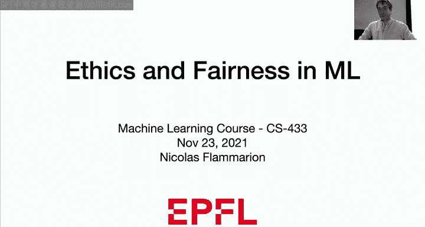

在本节课中，我们将要学习机器学习中的伦理与公平问题。我们将探讨算法决策中可能存在的歧视，理解公平性为何不是机器学习模型的默认属性，并介绍几种衡量公平性的统计学标准。

---

## 概述：算法决策的现实影响 🤖

如今，机器学习被广泛应用于教育、就业、医疗等多个领域，用于做出关于人类的决策。理解这一点至关重要：机器学习并非天生公平。仅仅因为决策由算法或计算机做出，没有人为干预，并不意味着最终的应用或算法决策就是公平的。

我们生活在一个机器学习模型越来越强大、越来越容易实现的世界。作为未来的软件工程师或数据科学家，我们必须谨慎思考模型在现实生活中的影响。机器学习与人工智能赋予了我们巨大的力量，同时也伴随着重大的责任。

---

## 案例研究：揭示问题 📊

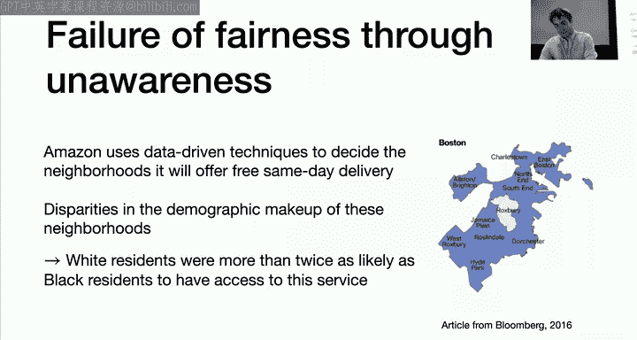

为了奠定讨论的基础，我们首先来看两个简单的例子。

### 案例一：约会应用中的推荐算法 💑

假设你想构建一个类似Tinder的约会应用，目标是向用户推荐个人资料。这是一个典型的机器学习问题，类似于Netflix的电影推荐，被称为协同过滤。

公司有明确的目标：提高匹配率和用户参与度。我们拥有大量历史约会数据和用户资料，从机器学习角度看，这似乎是一个定义明确、数据丰富的简单问题。

然而，这类涉及人的机器学习应用会引发深刻的伦理问题。例如，如果仅为了提高匹配率，算法可能会考虑将肤色作为特征，因为向用户展示相同肤色的人可能更容易获得“喜欢”。但作为一个社会，我们认为这不是一个好主意，因为考虑此类特征会损害少数群体的利益，并可能助长歧视。

你可能会认为这个问题很简单：只需不使用这些特征，不提取肤色信息，算法就会公平。但现实情况要复杂得多。

### 案例二：“公平无意识”的失败 🚚

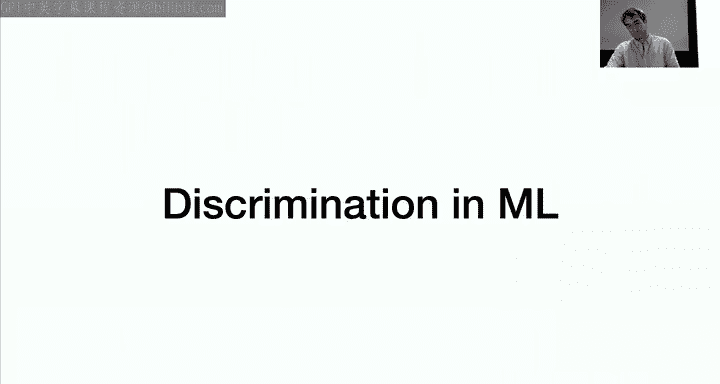

第二个例子来自2016年彭博社关于亚马逊的一篇文章。亚马逊使用数据驱动技术来决定在美国哪些城市社区提供免费次日送达服务。

结果发现，在波士顿，唯一未被该服务覆盖的社区是罗克斯伯里，这是一个以非裔美国人为主的社区。最终，该市白人居民获得此项服务的可能性是黑人居民的两倍以上。

亚马逊很可能并未将客户种族作为特征。他们只是试图预测各社区的购买数量。购买数量与财富高度相关，而在美国，财富又与种族高度相关。因此，即使最初没有考虑敏感属性，最终模型的结果仍然歧视了某些群体。

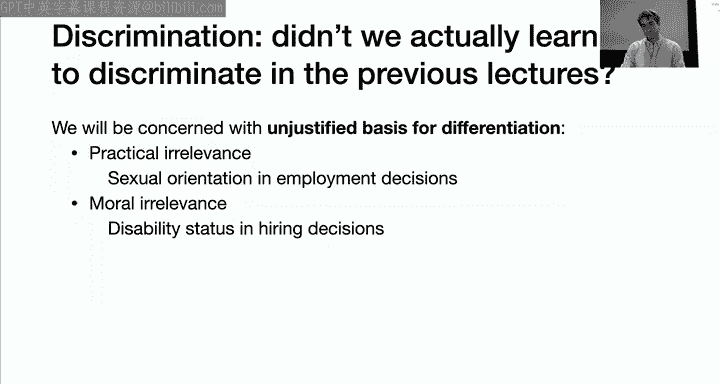

这展示了所谓的“公平无意识”的失败：仅仅移除或不包含敏感属性，并希望借此消除歧视问题，是行不通的。如果只是移除所有看似敏感的属性，然后让算法自由运行，仍可能导致糟糕的结果。

---

## 什么是歧视？⚖️

在分类课程中，我们学习的是寻找决策边界，将数据点分为正类和负类。这本身就是一种“区分”。

我们今天讨论的歧视，特指**不公正的区分依据**。这种不公正可能体现在两个方面：
1.  **实际无关性**：例如，性取向不应影响雇佣决策。
2.  **道德相关性**：例如，尽管雇佣残障人士可能为公司带来额外成本，但社会普遍认为承担此成本具有道德意义。

因此，我们关注的是基于种族、性别、残障状况、性取向等社会类别的、在过去曾遭受不公正系统性不利待遇的区分。这些区分会影响人们生活中重要的机会，如雇佣、大学录取、贷款、司法和医疗等领域。

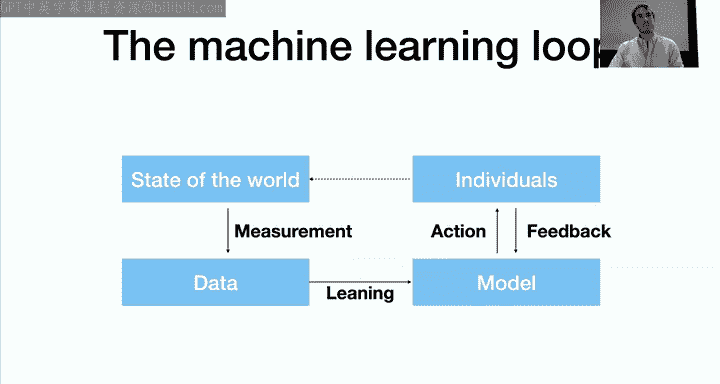

---

## 机器学习流程中的偏见传播 🔄

为了理解人口统计差异如何通过机器学习流程传播，我们考虑一个典型的机器学习系统阶段：个体、世界状态、数据和模型之间的交互。

1.  **测量阶段**：将世界状态转化为数据集中的数字。这个过程远非客观科学，涉及大量人为决策，可能引入测量偏差。
2.  **学习阶段**：将数据转化为模型。这是我们课程迄今的重点，希望模型能学习数据模式并泛化到新观测。
3.  **行动阶段**：使用模型进行预测并采取行动。行动的意义各不相同，但最终都会影响世界状态，有时模型还会从个体获得反馈。

接下来，我们看看人口统计差异如何在这个流程中传播。

---

## 数据与社会偏见 📉

首先，许多机器学习应用最终都是关于人的决策。其次，用于训练模型的数据通常已经包含了现存的人口统计差异。

人类社会充满了人口统计差异，训练数据很可能反映这些差异。如果盲目地将算法应用于这些数据，就会固化这些刻板印象。例如，一个自动给论文评分的算法，其训练数据来自人类评分，可能反映了评分者的刻板印象，导致算法也延续这些偏见。

即使是不直接关于人的应用，最终也可能影响人的生活。例如，波士顿的“Street Bump”应用，通过智能手机数据自动检测坑洼。结果发现，投诉多来自富裕社区，导致有限的市政资源被导向富裕社区，影响了不同社区人们的生活质量。

---

## 测量阶段的挑战 🎯

测量阶段涉及定义感兴趣的变量、与世界互动并将观察转化为数据。即使定义变量本身也具有挑战性，并且会存在测量偏差。

例如，数码相机的设计涉及许多参数选择。历史上，测试这些参数的人多为浅肤色人群，导致相机的默认设置（如色彩平衡）为浅肤色优化，难以在同一张照片中同时捕捉亮部和暗部细节。这表明，即使是看似客观的测量，也涉及可能引入偏见的人为选择。

定义目标变量同样困难。例如，在雇佣决策中，如何定义“好员工”？使用年度评审作为数据可能会延续评审者的偏见。在司法决策中，预测“谁将犯罪”时，使用逮捕数据作为代理变量也存在严重偏差，因为许多犯罪并未导致逮捕。

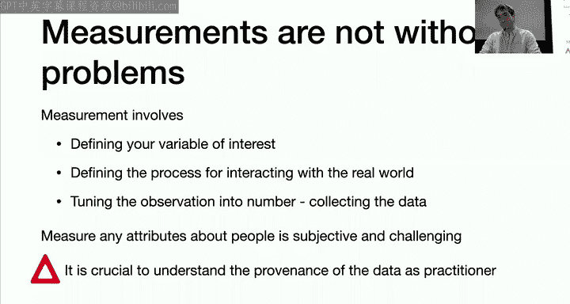

因此，从业者必须努力理解数据的来源，以试图解决这些偏差。

---

## 从数据到模型：固化与放大 🔍

我们拥有数据集并训练模型。问题是：模型是会反映、放大还是减少训练数据中存在的社会差异？

训练数据中包含两种模式：
*   **知识**：我们想要学习的模式（如吸烟与癌症相关）。
*   **刻板印象**：我们不想学习的模式（如女孩喜欢粉色，男孩喜欢蓝色）。

机器学习算法无法区分这两者。如果不进行特定干预，算法会同时提取知识和刻板印象。

一个典型的例子是机器翻译中的性别偏见。几年前，将“She is a doctor and he is a nurse”翻译成土耳其语（一种无性别代词的语言）再译回英语，结果变成了“He is a doctor and she is a nurse”。这是因为训练数据中医生更可能是男性，护士更可能是女性，算法在回译时选择了最匹配训练数据统计规律的句子。

你可能会想：为什么不直接移除性别等敏感属性？首先，性别信息可能编码在其他特征中（如“开始编程的年龄”可能与性别相关）。其次，这些特征可能对预测有帮助（如“开始编程的年龄”对评估软件工程师很重要），不能随意移除。

因此，从数据到模型，差异可能被**固化**。即使训练数据本身没有问题，学习阶段也可能引入人口统计差异。

---

## 学习阶段引入的差异 📊

即使你精心收集了考虑公平性的训练数据，在学习阶段如果不加干预，仍可能引入差异。这主要是由于**样本量差异**。

通过任何形式的抽样，少数群体数据通常更少。如果少数群体在总体中本就代表性不足（如科技行业的某些群体），训练数据中他们的代表性会更差。

机器学习在数据量大时效果最好。因此，模型对多数群体的决策可能更好，而对少数群体的效果可能较差。在开发应用时，我们通常使用在整个群体上的平均错误率作为评估标准。一个低的总体错误率（如5%）可能掩盖了在少数群体上很高的错误率。

这种情况在异常检测中可能更严重。例如，谷歌和Facebook曾尝试屏蔽使用不常见姓名的用户，认为这可能是假名。但在某些文化中，名字本就多样。结果导致许多来自少数文化背景的用户被错误屏蔽。这表明，机器学习算法会基于主流文化进行泛化，可能导致对少数群体的高错误率。

大多数机器学习目标函数会创建对多数群体准确的模型，但可能以牺牲受保护群体为代价。即使训练数据良好，如果不加干预，也会如此。

---

## 一个雇佣决策的例子 👔

假设我们是一个招聘委员会，基于两个特征决定是否雇佣申请人：大学GPA和面试分数。我们拥有过去申请人的数据，希望预测其未来工作表现（质量）。

训练数据中有两个群体：A组（方形）和B组（三角形）。我们训练一个不考虑群体归属的模型（如线性回归预测平均工作表现），然后根据想雇佣的人数设定一个阈值，选择分数最高的候选人。

观察发现，三角形候选人比方形候选人更可能被选中。这是因为在训练数据中，B组（方形）预测的真实工作表现系统性地低于A组（三角形）。原因可能是公司内部存在偏见，或者B组在教育机会等方面处于劣势。

这导致了雇佣概率的群体差异。如何减少这种差异？有几种非正式方法：
1.  **省略相关特征**：例如，省略与人口属性相关的GPA，仅使用面试分数。但这会降低模型准确性。
2.  **使用不同阈值**：对不同群体使用不同的录取分数线，以实现相同的成功率。但这可能导致具有相同特征的候选人因群体不同而得到不同决策。
3.  **鼓励多样性**：修改模型，降低GPA特征的权重，或增加多样性正则化，以增加入选候选人的多样性。

---

## 形式化公平性标准 📐

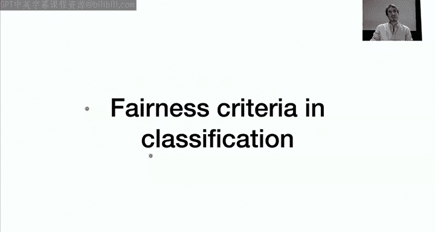

在课程的最后部分，我们将讨论统计学家和机器学习研究者如何尝试解决这些公平性问题，即如何衡量机器学习应用中的歧视。我们将专注于分类问题。

### 形式化设置

在分类中，数据由协变量 **X** 描述，结果变量（标签）**Y** 取值为0或1。目标是给定新的 **X**，预测其标签 **Y**。

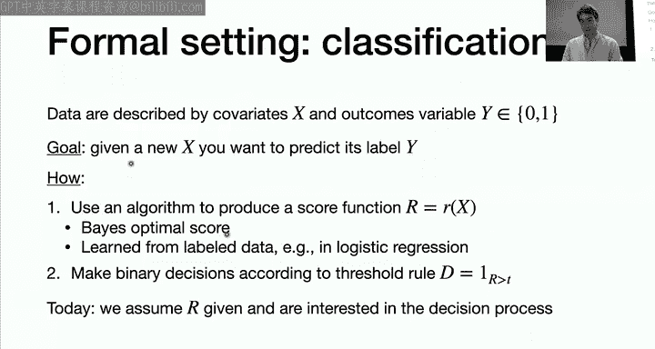

我们将使用一种特定的公式：首先学习一个评分函数 **R(x)**（一个实数，例如在0和1之间），然后根据阈值 **t** 做出二元决策：如果 **R > t**，则预测为1；否则预测为0。

我们假设已经获得了一个评分 **R**，并关注如何使用这个评分进行预测和决策。此外，我们在总体层面讨论问题，不涉及泛化。

### 分类标准回顾

在课程中，我们主要关注分类错误率（误判概率）。但这可能遗漏许多重要方面。其他形式分类标准可以突出分类器的不同方面。

考虑混淆矩阵：
*   **真阴性 (TN)**：Y=0，预测为0。
*   **假阳性 (FP)**：Y=0，预测为1。
*   **假阴性 (FN)**：Y=1，预测为0。
*   **真阳性 (TP)**：Y=1，预测为1。

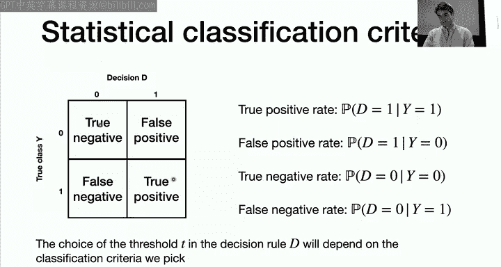

由此可以定义：
*   **真阳性率 (TPR)**：P(D=1 | Y=1)
*   **假阳性率 (FPR)**：P(D=1 | Y=0)
*   **真阴性率 (TNR)**：P(D=0 | Y=0)
*   **假阴性率 (FNR)**：P(D=0 | Y=1)

在机器学习中，我们通常只考虑两种错误的成本，但并未区分假阳性和假阴性。阈值 **t** 的选择深刻影响这些分类标准。例如，如果假阳性的成本很高，则应选择较高的阈值；如果假阴性的成本很高，则应选择较低的阈值。

### 纳入敏感属性

在许多任务中，特征 **X** 可能编码了个体的敏感属性（如性别、种族、残障状况）。我们假设有一个额外的变量 **A** 来编码受保护群体的成员身份。

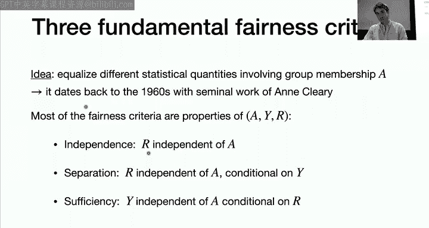

重申：仅仅从 **X** 中移除敏感属性并不能解决问题，因为许多特征与敏感属性相关，可用于恢复该属性。例如，在美国，访问Pinterest网站的可能性与性别相关。因此，仅靠“无意识”无法实现公平。

---

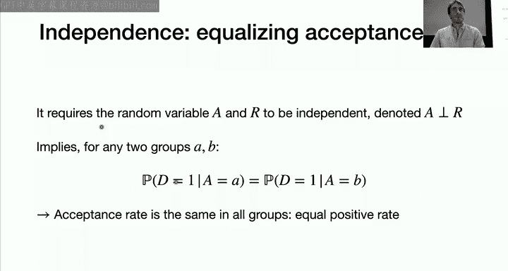

## 三大公平性标准 ⚖️

我们将定义三个基本的公平性标准，它们都基于均衡涉及群体成员身份的统计量的思想。

### 1. 独立性 (Independence)

**定义**：要求敏感属性 **A** 与评分 **R** 独立，即 **A ⟂ R**。

**含义**：这意味着所有群体具有相同的“接受率”。例如，如果一个群体有80%的接受机会，其他群体也应有相同的接受率。

**局限性**：满足独立性标准仍可能包含不公平的做法。例如，公司可以在A群体中精心招聘，在B群体中随机招聘，同时满足相同的总体接受率。这将导致B群体中不合格的申请人更可能被选中，长期来看会加剧不平等。独立性未能区分假阳性和真阳性。

实现独立性的方法包括预处理（调整分类器使其与 **A** 不相关）、处理中（在优化中添加约束）和后处理（调整特征使其与 **A** 不相关）。

### 2. 分离性 (Separation)

**定义**：要求敏感属性 **A** 与评分 **R** 在给定真实标签 **Y** 的条件下独立，即 **A ⟂ R | Y**。

**含义**：这意味着所有群体具有相同的假阳性率和假阴性率。它均衡了错误率，使得无法用假阳性交换真阳性，看起来更公平。

**挑战**：在决策时，我们并不知道真实标签 **Y**（例如，未被雇佣者的表现）。这是一个事后标准，但可以在拥有结果数据后进行评估。也可以通过后处理将现有评分转换为满足分离性的评分。

### 3. 充分性 (Sufficiency)

**定义**：要求敏感属性 **A** 与真实标签 **Y** 在给定评分 **R** 的条件下独立，即 **A ⟂ Y | R**。

**含义**：这意味着在已知评分 **R** 的情况下，不需要知道敏感属性 **A** 来预测 **Y**。对于任何群体，给定评分 **R** 后，正结果的概率相同。

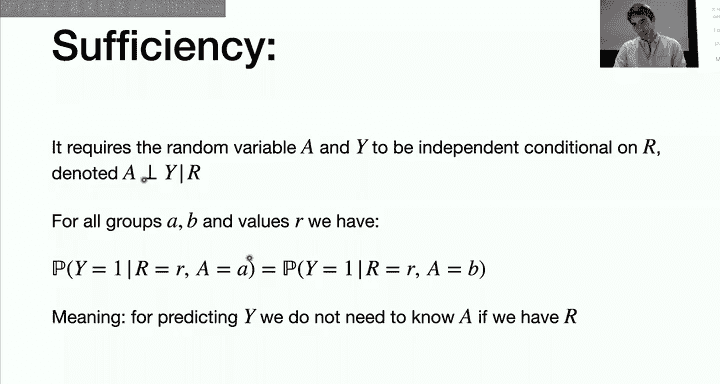

**与校准的关系**：充分性与“按组校准”密切相关。校准意味着 **P(Y=1 | R=r) = r**。按组校准要求每个群体内部都满足校准，这直接意味着充分性。校准提供了概率解释的保证（但这是群体层面的平均保证，而非个体层面）。

**重要发现**：群体校准（充分性）通常是机器学习默认满足的性质。研究表明，机器学习做得越好（越接近贝叶斯最优分类器），就越满足群体校准。这意味着，标准的机器学习无需特别干预就能达到充分性。

**局限性**：即使满足充分性，决策在道德上仍可能有问题。例如，预测员工未来工作年限的最优模型，可能会给可能怀孕或有残障的人较低的分数，尽管这在道德上值得商榷。

---

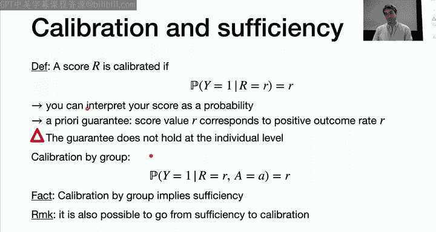

## 标准间的互斥性与结论 🤔

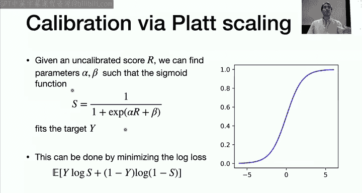

我们介绍了三种公平性标准：独立性（均衡接受率）、分离性（均衡错误率）和充分性（群体校准）。它们各有局限性。

一个关键问题是：能否同时满足这些标准？除了某些退化情况，**这些标准在一般情况下是互斥的**。例如，不可能同时满足独立性和分离性，也不可能同时满足充分性和独立性。

因此，公平性标准本身存在根本性限制。它们不能排除所有不公平的做法，满足某个标准并不意味着操作就是公平的。要真正实现公平，可能需要超越 **X, Y, R, A** 的联合分布信息，进行因果推理。

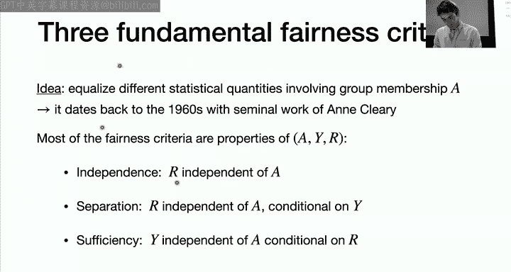

---

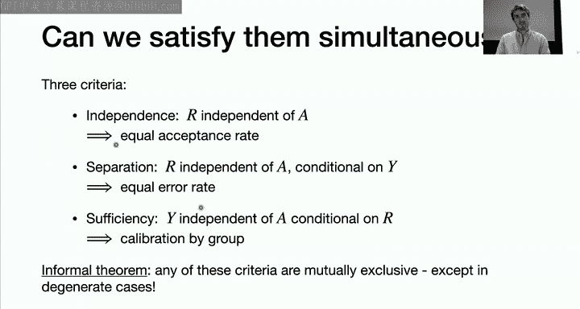

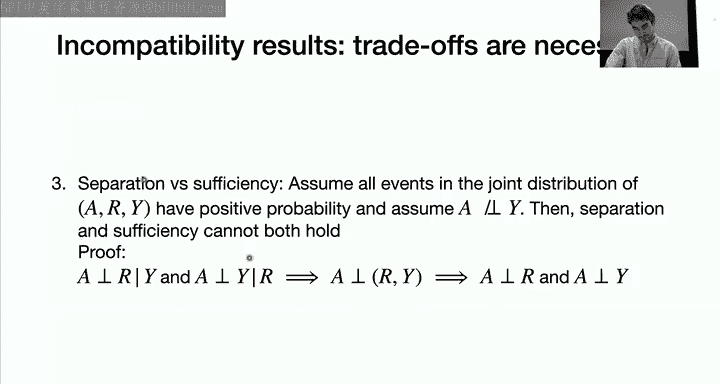

## 总结与核心要点 🎯

本节课我们一起学习了机器学习中的伦理与公平。核心要点如下：

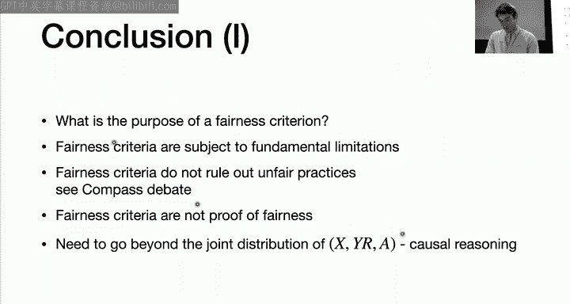

1.  **机器学习非天生公平**：算法决策可能延续或放大社会中的现有偏见与不公。
2.  **偏见贯穿全流程**：从数据测量、模型学习到决策行动，每个环节都可能引入或传播人口统计差异。
3.  **“公平无意识”无效**：简单地移除敏感属性无法保证公平，因为偏见可能编码在其他特征中。
4.  **形式化公平标准**：我们学习了独立性、分离性和充分性三大标准，它们分别对应不同的统计均衡目标，但各有局限且通常互斥。
5.  **没有银弹**：不存在一个普适、完美的数学标准能定义和保证所有场景下的公平。公平性是领域特定、情境依赖的。
6.  **责任在于实践者**：作为机器学习从业者，我们必须意识到黑箱模型没有与社会价值观保持一致的保证。在设计和使用模型时，必须积极思考其伦理影响，努力将人类价值融入技术实践。

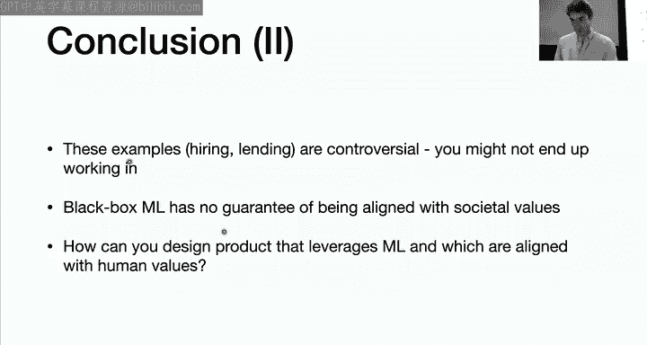

机器学习赋予我们强大的工具，但用之有道，方能为社会创造真正的价值。