# 29：无监督学习与聚类 🧠

## 概述

在本节课中，我们将要学习无监督学习的基本概念、主要方法及其应用。与之前学习的监督学习不同，无监督学习不依赖于人工标注的标签，而是直接从数据本身的结构中学习。我们将重点探讨表示学习和生成模型，并详细介绍一个经典的无监督学习算法——K均值聚类。

---

## 无监督学习简介

上一节我们介绍了监督学习，其核心是系统在每次预测后都能获得一个真实的答案（标签）。然而，这并非人类学习的主要方式。人类的大部分学习是通过观察世界，而非总是被告知正确答案。例如，观看视频时，没有人会为每一帧标注“这是鸟”或“这是桌子”，我们必须自己理解内容。

那么，机器学习是否也能在没有标签的情况下进行学习呢？这就是无监督学习。它通常更为困难，方法也多种多样，但其潜力巨大，因为它允许我们利用比人工标注多得多的数据。

**核心定义**：在无监督学习中，我们只有观测数据 `X`，而没有对应的输出标签 `y`。

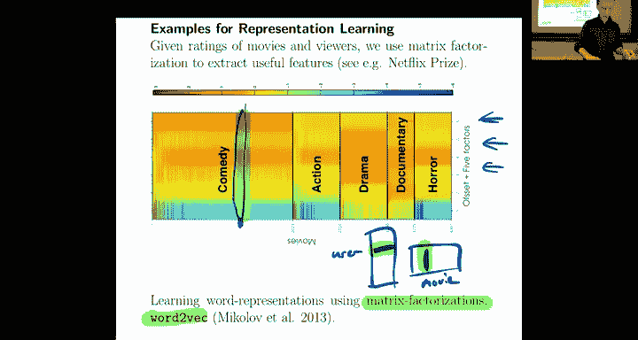

无监督学习主要有两个重要目标：

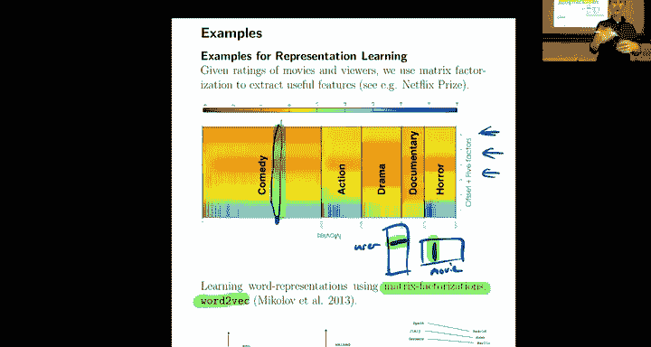

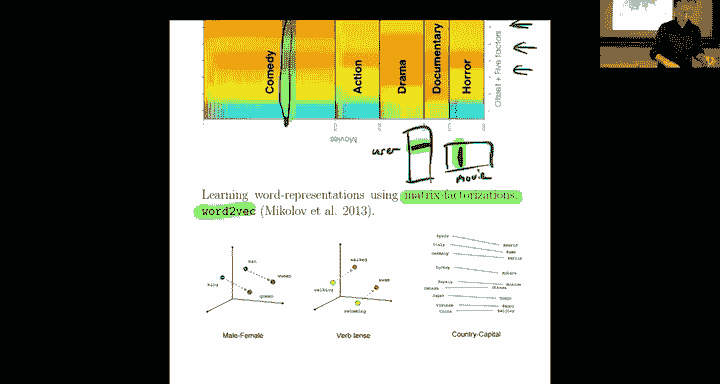

1.  **学习表示**：学习数据中有意义的特征。这些特征可能比原始数据（如图像的原始像素）更能捕捉数据的本质和逻辑，对未来可能进行的监督学习或其他任务更有用。
2.  **生成数据**：训练一个系统，使其能够从一些随机噪声中生成看起来像真实数据的新数据点。这被称为生成模型。一个相关的任务是**密度估计**，即理解真实数据在概率空间中的分布形态。

---

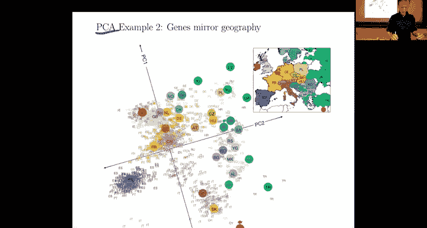

## 表示学习示例

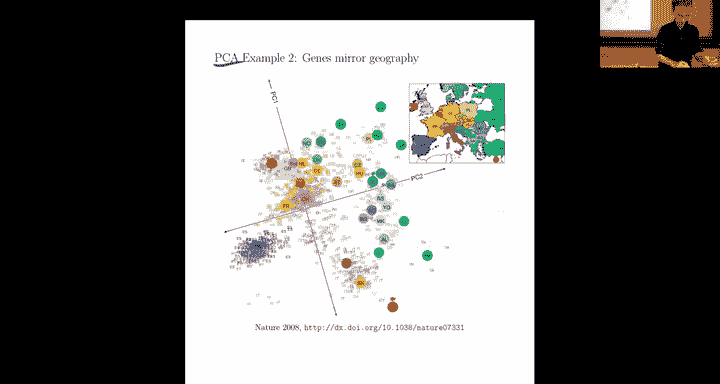

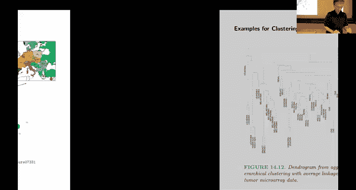

以下是几种表示学习的应用场景：

### 推荐系统与词向量

推荐系统的目标是在用户和物品（如电影）之间建立联系。我们可以学习一个用户矩阵和一个物品矩阵，使得用户特征向量与物品特征向量的内积能够预测用户对该物品的评分（如星级）。

**数学形式**：`预测评分 ≈ 用户特征向量 · 物品特征向量`

有趣的是，完全相同的数学模型可以用于学习文本中单词的表示（即词向量，如Word2Vec）。我们学习每个单词的特征向量，使得两个单词向量的内积能够解释它们在文本中共同出现的频率。这个过程完全是无监督的，因为我们只是利用了文本中自然存在的共现信息，无需任何人工标注。

### 主成分分析

主成分分析是一种降维技术，用于将高维数据投影到低维空间，同时保留数据中最重要的变化方向。

**应用示例**：
*   **瑞士投票模式**：将每个城镇的数百次投票结果（一个高维向量）通过PCA降维到两个主要特征，可以在无需理解每次投票内容的情况下，清晰地观察到德语区、法语区和意大利语区之间的系统性差异。
*   **基因组数据**：对大量个体的基因组序列进行PCA分析，可以在不使用任何地理信息的情况下，发现数据中与地理起源相关的模式。

这些例子表明，PCA能够帮助我们在没有标签的情况下，从高维数据中发现并可视化其内在结构。

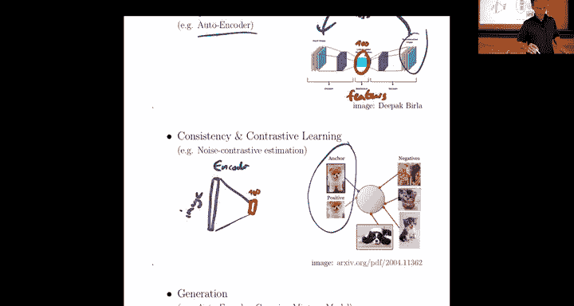

---

## 深度表示学习技术

随着深度学习的发展，出现了一些更强大的无监督表示学习方法。

### 自编码器

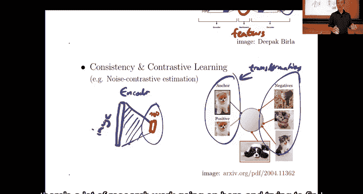

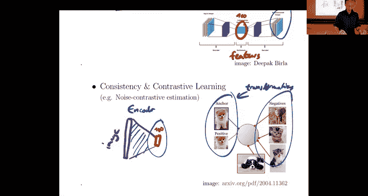

自编码器的目标是学习数据的压缩表示（编码），并能从该表示中重建原始数据（解码）。

**网络结构**：
```
输入图像 -> [编码器网络] -> 低维特征向量 -> [解码器网络] -> 重建图像
```

**训练信号（损失函数）**：最小化原始输入图像与重建图像之间的差异（如均方误差）。虽然看似只是在学习重建数据，但关键在于中间的“瓶颈”层迫使网络学习数据中最关键的特征，因为这些特征是重建所必需的。

### 对比学习

对比学习只使用编码器网络来学习特征表示，而不进行数据重建。

**核心思想**：在特征空间中，让相似的样本彼此靠近，不相似的样本彼此远离。

**如何定义“相似”**：
*   **正样本**：通过已知的数据变换（如对图像进行裁剪、旋转）生成，这些变换后的图像应与原图语义相似。
*   **负样本**：随机选择的其他数据点，它们几乎肯定与原图语义不同。

**训练目标**：最小化正样本对在特征空间中的距离，同时最大化负样本对的距离。

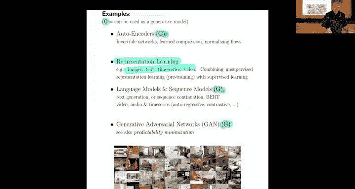

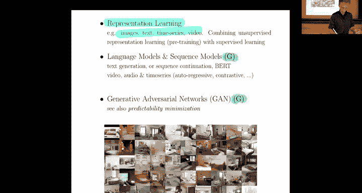

这种方法的好处在于，一旦通过无监督方式学习到好的特征，我们只需要很少的标注数据，在这些特征之上训练一个简单的分类器（如线性分类器），就能达到接近最先进的性能。

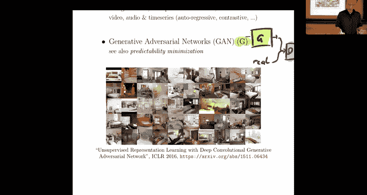

---

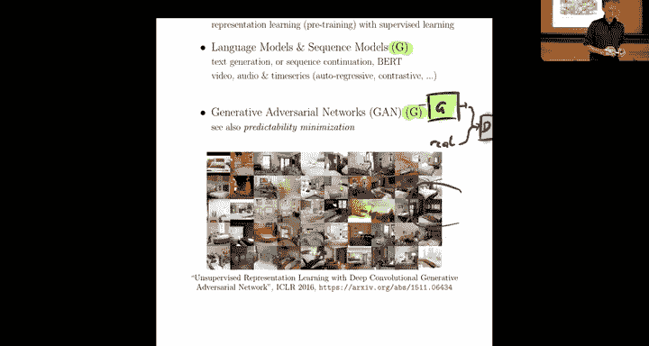

## 生成模型

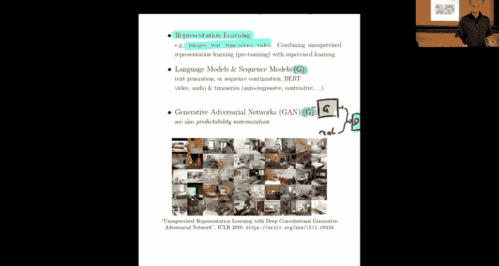

生成模型的目标是学习生成与真实数据相似的新数据。

### 生成对抗网络

GAN是一个巧妙的想法，它通过两个神经网络相互博弈的方式进行训练：

1.  **生成器**：接收随机噪声，尝试生成逼真的假数据。
2.  **判别器**：接收真实数据和生成器产生的假数据，尝试区分它们是真还是假。

**训练过程**：这是一个对抗游戏。生成器努力生成以假乱真的数据来“欺骗”判别器；判别器则努力提高其鉴别能力。两者通过梯度下降同时进行优化。最终，生成器能够生成非常逼真的图像、文本等。

---

## K均值聚类算法 🎯

现在，让我们转向一个更具体、更具数学性的无监督学习任务——聚类。聚类旨在将数据点分组，使得同一组内的点彼此相似，不同组间的点彼此不同。我们将重点介绍最常用的聚类算法之一：K均值聚类。

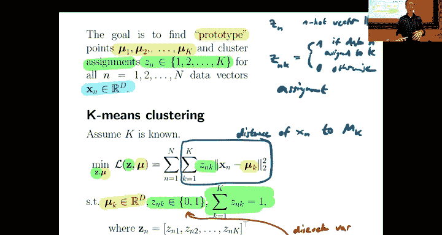

### 问题定义

假设我们有 `N` 个数据点，希望将它们分成 `K` 个组。K均值聚类的目标是：
*   为每个簇 `k` 找到一个代表点，称为**质心** `μ_k`。
*   为每个数据点 `n` 分配一个簇标签 `z_n`。

我们使用**独热编码**来表示分配：`z_n` 是一个 `K` 维向量，在其所属簇的位置上为1，其余为0。

### 目标函数

K均值通过优化以下目标函数来寻找好的聚类：

**最小化**：`L(μ, Z) = Σ_n Σ_k z_nk * ||x_n - μ_k||²`

**约束条件**：对于每个数据点 `n`，`Σ_k z_nk = 1` 且 `z_nk ∈ {0, 1}`。

这个目标函数的直观解释是：最小化每个数据点到其所属簇质心的距离平方和。

### K均值算法

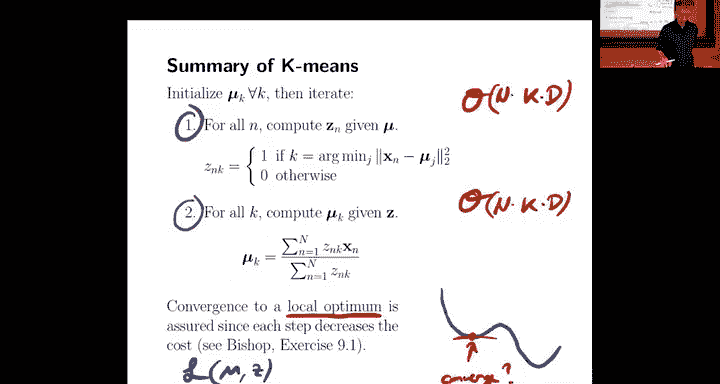

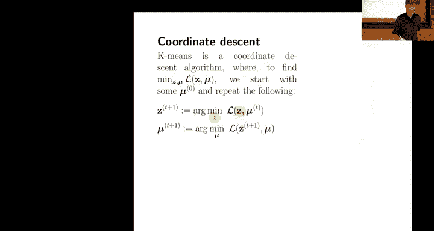

虽然上述优化问题是NP难的，但我们可以使用一个简单而有效的迭代算法来找到不错的解：

1.  **初始化**：随机选择 `K` 个点作为初始质心 `μ_k`。
2.  **迭代直至收敛**：
    *   **分配步骤**：将每个数据点 `x_n` 分配给距离它最近的质心所属的簇。
        *   `z_nk = 1` 如果 `k = argmin_j ||x_n - μ_j||²`，否则为0。
    *   **更新步骤**：重新计算每个簇的质心，将其更新为该簇所有数据点的平均值。
        *   `μ_k = (Σ_n z_nk * x_n) / (Σ_n z_nk)`

**算法特性**：
*   每次迭代都会降低目标函数 `L` 的值。
*   当分配不再发生变化时，算法收敛。
*   该算法可以看作是在变量 `Z`（离散）和 `μ`（连续）上的坐标下降法。

### 如何选择K值？

选择簇的数量 `K` 是一个挑战。目标函数值 `L` 随着 `K` 增大而单调递减（当 `K = N` 时，`L` 可降至0），但这并不意味着更大的 `K` 更好（每个点自成一类没有意义）。

一种常用的启发式方法是寻找“拐点”：绘制 `L` 随 `K` 变化的曲线，选择曲线斜率发生显著变化（变平缓）的点作为 `K`。最终，`K` 的选择通常需要结合具体应用场景。

### 应用示例：图像压缩（颜色量化）

K均值可以用于图像压缩。我们将图像中的每个像素视为一个三维数据点（RGB值）。对这些像素点进行K均值聚类，用 `K` 个颜色（簇质心）来代表整张图像的所有像素。每个像素只需存储其所属簇的索引，而不是完整的RGB值，从而实现了压缩。

---

## K均值的概率解释

为什么使用距离平方和作为目标函数？这可以从概率角度得到解释。

假设数据由以下生成过程产生：
1.  每个簇 `k` 对应一个球形高斯分布，其均值为 `μ_k`，方差固定。
2.  每个数据点 `x_n` 根据其分配 `z_n`，从对应的高斯分布中采样。

那么，给定参数 `μ` 和 `Z`，观察到整个数据集的**似然函数**为各数据点概率的乘积。对该似然函数取负对数，并忽略常数项后，得到的目标函数恰好就是K均值的目标函数。

因此，**最大化数据似然等价于最小化K均值目标函数**。这为K均值算法提供了一个坚实的概率论基础。

---

## 总结

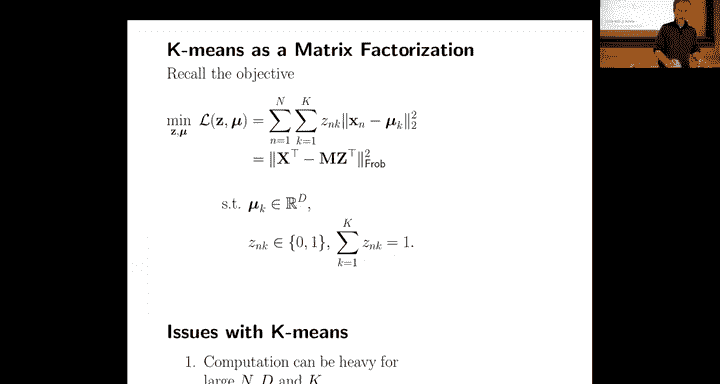

本节课中我们一起学习了无监督学习的核心思想与方法。我们了解到，无监督学习不依赖标签，旨在从数据本身发现结构，主要分为表示学习和生成模型两大类。我们探讨了PCA、自编码器、对比学习等表示学习技术，以及GAN等生成模型。最后，我们深入研究了K均值聚类算法，包括其目标函数、迭代优化过程、应用场景以及背后的概率解释。无监督学习使我们能够利用海量未标注数据，是机器学习领域一个非常重要且活跃的方向。