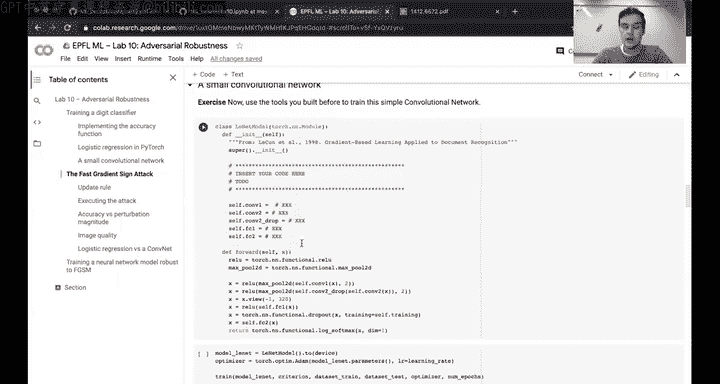
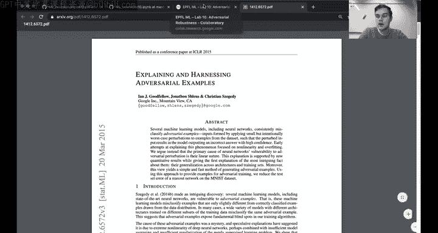
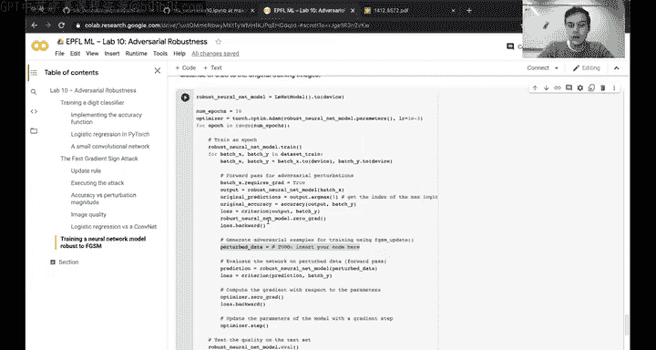

# 30：对抗性训练入门教程 🛡️


在本节课中，我们将学习对抗性训练的基本概念，并完成两个实践任务：在MNIST数据集上实现对抗性训练，以及探讨线性模型的对抗性训练理论。

## 概述

本周的练习主要围绕对抗性训练及其鲁棒性展开。练习分为两个部分：第一部分是实践任务，需要在MNIST数据集上实现逻辑回归和卷积神经网络的对抗性训练；第二部分是理论任务，探讨线性模型的对抗性训练闭式解。

练习材料可在课程代码库中找到。对于实践部分，由于MNIST数据集相对较大，建议使用Google Colab的免费GPU服务。

## 实践部分：MNIST对抗性训练

上一节我们介绍了课程的整体安排，本节中我们来看看实践部分的具体内容。

### 任务一：实现逻辑回归模型

首先，你需要实现一个简单的逻辑回归模型。大部分代码已经提供，你只需在指定位置填写几行代码。由于我们完全依赖PyTorch，无需手动实现反向传播或梯度计算，可以利用其自动求导功能。

以下是训练脚本中需要填写的关键部分：

```python
# 定义逻辑回归模型
class LogisticRegression(nn.Module):
    def __init__(self, input_dim, output_dim):
        super(LogisticRegression, self).__init__()
        self.linear = nn.Linear(input_dim, output_dim)

    def forward(self, x):
        return self.linear(x)
```

### 任务二：实现卷积神经网络

接下来，你需要实现一个简单的卷积神经网络。同样，大部分代码已经提供，你只需定义网络架构。

以下是卷积神经网络架构的定义示例：

```python
# 定义卷积神经网络
class CNN(nn.Module):
    def __init__(self):
        super(CNN, self).__init__()
        self.conv1 = nn.Conv2d(1, 32, kernel_size=3, stride=1, padding=1)
        self.conv2 = nn.Conv2d(32, 64, kernel_size=3, stride=1, padding=1)
        self.fc1 = nn.Linear(64 * 7 * 7, 128)
        self.fc2 = nn.Linear(128, 10)

    def forward(self, x):
        x = F.relu(self.conv1(x))
        x = F.max_pool2d(x, 2)
        x = F.relu(self.conv2(x))
        x = F.max_pool2d(x, 2)
        x = x.view(x.size(0), -1)
        x = F.relu(self.fc1(x))
        x = self.fc2(x)
        return x
```



### 任务三：实现快速梯度符号攻击

在实现模型后，我们将学习如何生成对抗样本。这里使用快速梯度符号攻击方法，其核心公式如下：

**公式**：  
`x_adv = x + ε * sign(∇_x L(θ, x, y))`



其中，`x`是原始输入，`ε`是扰动预算，`L`是损失函数，`∇_x`表示对输入的梯度。

以下是FGSM攻击的实现步骤：

1. 计算输入`x`的梯度。
2. 根据梯度符号生成扰动。
3. 将扰动添加到原始输入中，生成对抗样本。

### 任务四：可视化对抗样本

生成对抗样本后，你需要可视化这些样本，并观察扰动是否对人类视觉产生影响。同时，绘制模型在不同扰动预算下的鲁棒性曲线。

以下是需要完成的可视化任务：

- 绘制逻辑回归和卷积神经网络在不同扰动预算下的鲁棒性曲线。
- 展示生成的对抗样本，并分析其视觉变化。

### 任务五：对抗性训练

最后，我们将实现对抗性训练，使模型对FGSM攻击具有鲁棒性。对抗性训练的核心思想是在训练过程中生成对抗样本，并将其加入训练集。

以下是对抗性训练的关键步骤：

1. 在每次训练迭代中，使用FGSM生成对抗样本。
2. 将对抗样本和原始样本一起用于模型训练。
3. 重复上述过程，直到模型收敛。

## 理论部分：线性模型的对抗性训练

上一节我们完成了实践任务，本节中我们来看看理论部分的内容。

### 任务一：闭式解推导

对于线性模型，我们需要推导对抗性训练中内部最大化问题的闭式解。假设损失函数`L`是基于间隔的单调递减函数，例如逻辑损失或合页损失。

以下是闭式解的推导步骤：

1. 定义线性模型的损失函数。
2. 求解内部最大化问题，得到对抗样本的闭式表达式。
3. 分析解的形式及其与模型参数的关系。



### 任务二：与软间隔SVM的比较

接下来，我们将探讨对抗性训练与软间隔SVM之间的异同。以下是需要分析的关键点：

- 目标函数的差异。
- 对异常值的处理方式。
- 鲁棒性与泛化能力的权衡。

### 任务三：L2与L∞对抗性训练的关系

最后，我们将分析L2和L∞对抗性训练之间的关系。特别是，L∞对抗性训练的内部优化问题如何与快速梯度符号方法相似。

以下是需要讨论的内容：

- L∞对抗性训练的内部优化问题形式。
- 与FGSM方法的相似之处。
- 两种方法在实践中的应用场景。

## 总结

在本节课中，我们一起学习了对抗性训练的基本概念和实践方法。通过实现逻辑回归和卷积神经网络的对抗性训练，我们深入理解了FGSM攻击的原理及其防御方法。在理论部分，我们探讨了线性模型对抗性训练的闭式解，并比较了其与软间隔SVM的异同。

希望这些内容能帮助你更好地理解对抗性训练及其在机器学习中的应用。如果有任何问题，欢迎在课程论坛或Discord上提问。