# 31：高斯混合模型 (GMM) 与期望最大化 (EM) 算法概述 🧮

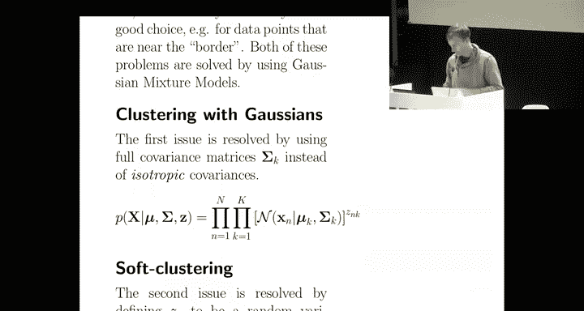

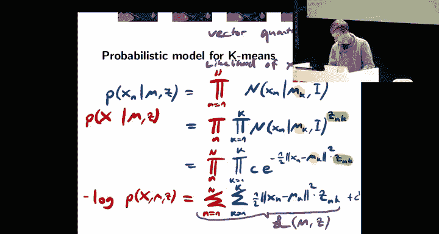

在本节课中，我们将学习高斯混合模型。这是一种更通用的聚类方法，允许簇的形状是椭圆或其他形态，而不仅仅是球形。我们将从概率模型的角度理解它，并学习如何通过期望最大化算法来估计其参数。

## 从 K-Means 到高斯混合模型

上一节我们介绍了 K-Means 聚类，它假设每个簇是球形的。本节中，我们将看看如何推广这个模型。

在 K-Means 中，每个簇的分布是一个协方差矩阵为单位矩阵 **I** 的正态分布，即球形高斯分布。现在，我们将其推广为具有更通用协方差矩阵 **Σ** 的正态分布，从而允许簇呈现椭圆形。

数学上，这意味着数据点 **x** 的生成过程变为一个混合了 K 个高斯分布的模型，每个分布有其自己的均值 **μ_k** 和协方差 **Σ_k**。

## 概率模型与隐变量

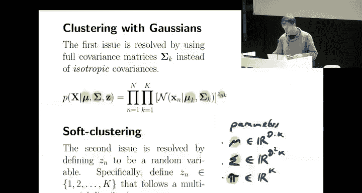

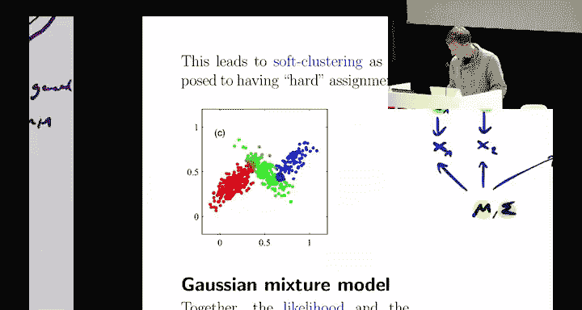

与 K-Means 的“硬分配”（每个点确定性地属于一个簇）不同，高斯混合模型引入了“软分配”。每个数据点 **x_n** 都有一个对应的隐变量 **z_n**，它是一个随机变量，表示该点属于各个簇的概率。

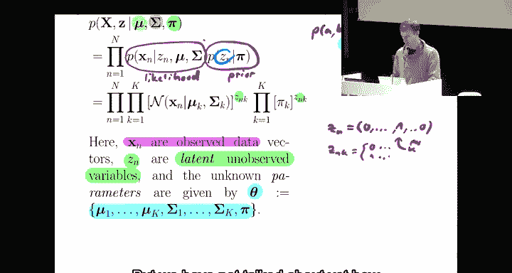

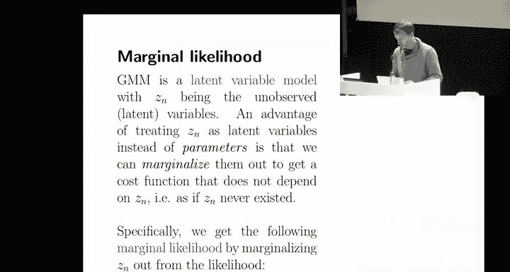

以下是该模型的核心组成部分：

*   **混合权重 π_k**：表示一个数据点先验地属于第 k 个簇的概率，满足 **∑_{k=1}^K π_k = 1**。
*   **簇参数**：每个簇 k 有其均值 **μ_k** 和协方差 **Σ_k**。
*   **数据生成过程**：
    1.  首先，根据混合权重 **π** 随机选择簇标签 **z_n**。
    2.  然后，根据所选簇的高斯分布生成数据点 **x_n**：**x_n | z_n=k ~ N(μ_k, Σ_k)**。

因此，模型的参数总共有三类：**μ** (K×D个), **Σ** (K×D²个), 和 **π** (K个)。这些参数的数量不依赖于数据点数量 N，这使得模型更易于处理。

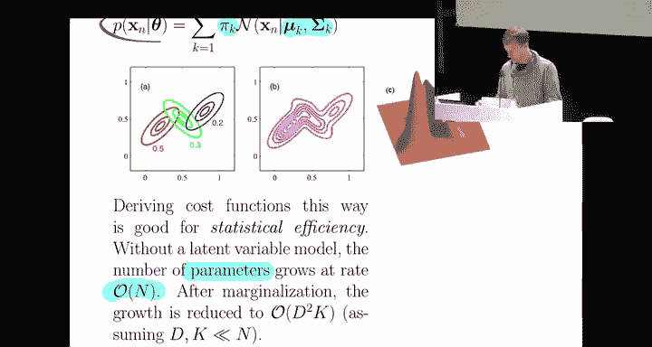

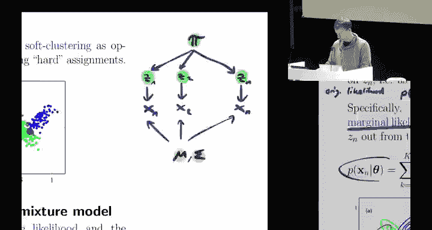

## 边际似然函数

我们的目标是找到能最好解释观测数据 **X** 的参数 **θ = {π, μ, Σ}**。然而，隐变量 **z** 是未被观测到的。为了处理这个问题，我们通过对 **z** 的所有可能取值求和（即“边际化”）来消除它，从而得到仅关于观测数据 **X** 的**边际似然函数**。

对于单个数据点 **x_n**，其概率是各高斯成分的加权和：
**p(x_n | θ) = ∑_{k=1}^K π_k * N(x_n | μ_k, Σ_k)**

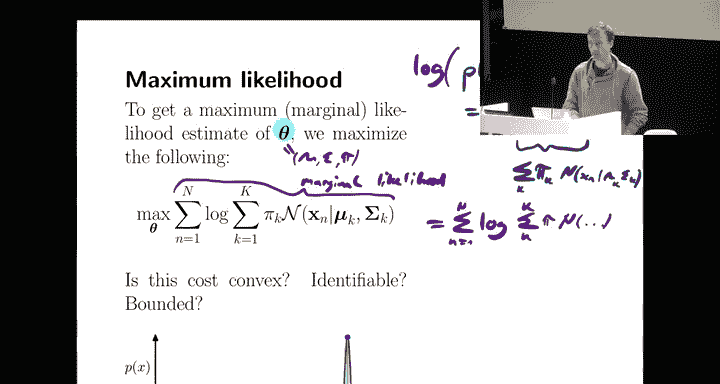

对于整个数据集 **X**（假设数据点独立同分布），其对数边际似然函数为：
**L(θ) = log p(X | θ) = ∑_{n=1}^N log [ ∑_{k=1}^K π_k * N(x_n | μ_k, Σ_k) ]**

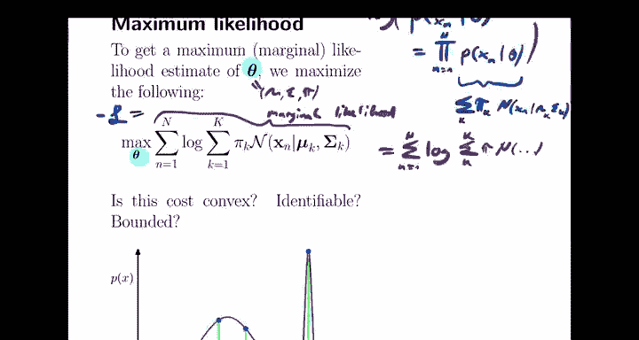

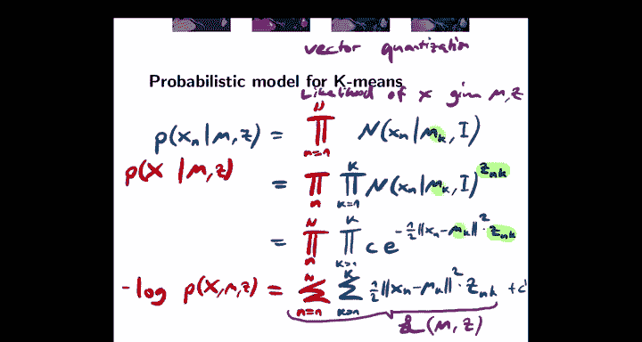

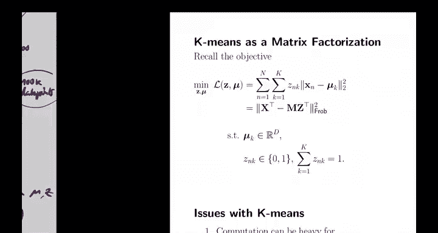

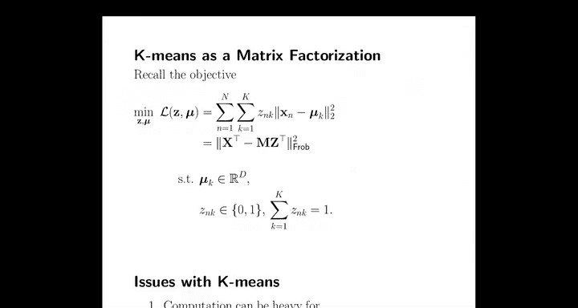

我们的优化目标是最大化这个对数边际似然函数 **L(θ)**。

## 优化面临的挑战

直接最大化 **L(θ)** 非常困难，主要原因有三点：

1.  **非凸问题**：目标函数 **L(θ)** 是非凸的，存在许多局部最优解。
2.  **不可识别性**：如果交换两个簇的标签（即同时交换 **π_k**, **μ_k**, **Σ_k**），似然函数值不变。因此存在至少 K! 个等价的全局最优解。
3.  **无界性**：理论上，似然值可以趋于无穷大。当一个簇的协方差矩阵 **Σ_k** 收缩到只包含一个数据点时，该点对应的概率密度会变得极高，导致对数似然值爆炸。这在实际中意味着需要正则化或小心初始化。

## 期望最大化 (EM) 算法框架

为了解决这个复杂的优化问题，我们引入期望最大化算法。其核心思想是迭代地构建并优化一个目标函数的**替代函数（下界）**。

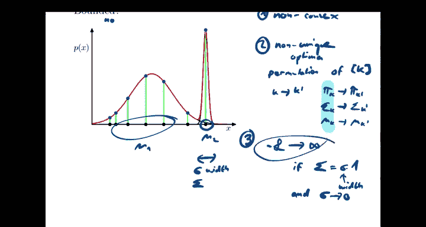

具体步骤如下：

1.  **初始化**：从参数的一个初始猜测 **θ^{0}** 开始。
2.  **迭代直至收敛**：
    *   **E步 (期望步)**：在给定当前参数 **θ^{t}** 和观测数据 **X** 的条件下，计算隐变量 **z** 的后验分布 **p(z | X, θ^{t})**。这相当于为每个数据点计算它属于各个簇的“责任”（一个概率值）。
    *   **M步 (最大化步)**：将 E 步计算出的“责任”视为固定权重，最大化一个完整的对数似然函数（此时隐变量已知），从而更新参数得到 **θ^{t+1}**。这个完整的对数似然函数就是原边际似然的一个替代下界。

从几何角度看，在每次迭代的当前点 **θ^{t}**，我们构造一个替代函数 **Q(θ | θ^{t})**，它满足两个条件：
*   它是原目标函数 **L(θ)** 的一个下界：**L(θ) ≥ Q(θ | θ^{t})**。
*   它们在当前点相等：**L(θ^{t}) = Q(θ^{t} | θ^{t})**。

然后，我们通过最大化这个更简单的替代函数 **Q(θ | θ^{t})** 来得到下一个参数估计 **θ^{t+1}**。由于下界性质，这保证了原目标函数 **L(θ)** 不会下降（通常会上升）。

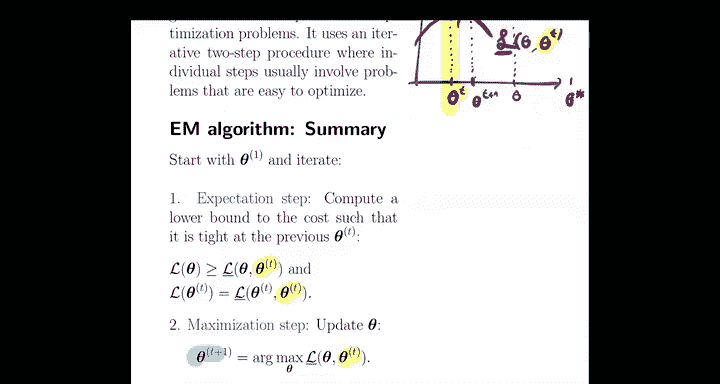

## 总结

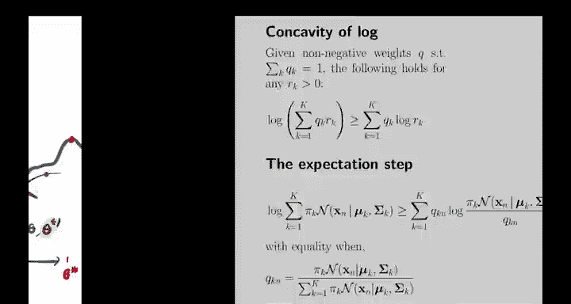

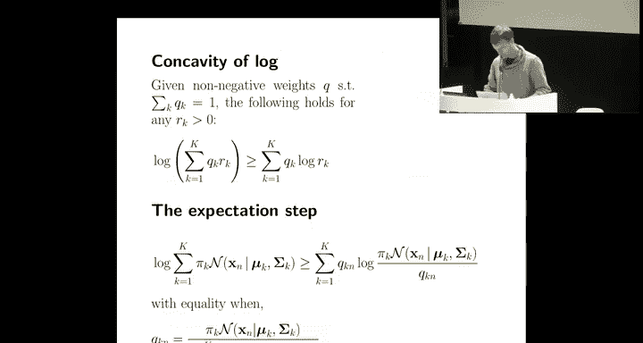

本节课中，我们一起学习了高斯混合模型的基本原理。我们从 K-Means 出发，引入了更灵活的簇形状和软分配概念，建立了完整的概率生成模型。我们认识到直接优化其边际似然函数非常困难，并因此引入了期望最大化算法的基本框架。EM 算法通过交替执行 E 步和 M 步，迭代地优化一个替代下界，为我们提供了一种强大的工具来拟合高斯混合模型等含有隐变量的复杂概率模型。在接下来的课程中，我们将深入 EM 算法的具体推导和细节。