# 32：期望最大化算法详解 🧠

在本节课中，我们将深入学习期望最大化算法。上周我们讨论了高斯混合模型，在此之前还介绍了K均值聚类，它是高斯混合模型的一个简化版本。我们引入高斯混合模型是为了建立一个更强大的概率模型，它能提供软分配，并且能匹配更复杂的数据形状。这些都是重要的无监督学习方法。本节课，我们将深入探讨用于解决这类模型拟合问题的核心算法——期望最大化算法。

## 概述 📋

期望最大化算法是一种迭代优化算法，用于在概率模型含有无法观测的隐变量时，寻找模型参数的最大似然估计。我们将从构建一个易于优化的替代函数开始，然后逐步最大化它，从而逼近最优解。

## 构建替代函数（E步）

上一节我们介绍了高斯混合模型的参数优化问题，本节中我们来看看如何构建一个易于处理的替代函数。

我们的目标是最大化数据的对数似然函数 \( L(\theta) \)，但由于模型复杂，直接优化很困难。因此，我们采用迭代方法，从一个初始参数 \(\theta^{(t)}\) 开始，构建一个在该点处与原函数相等且始终是原函数下界的替代函数 \( \bar{L}(\theta; \theta^{(t)}) \)。

### 利用凸性构建下界

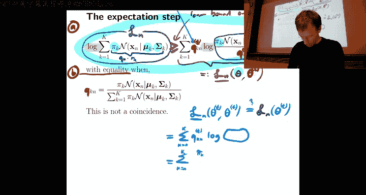

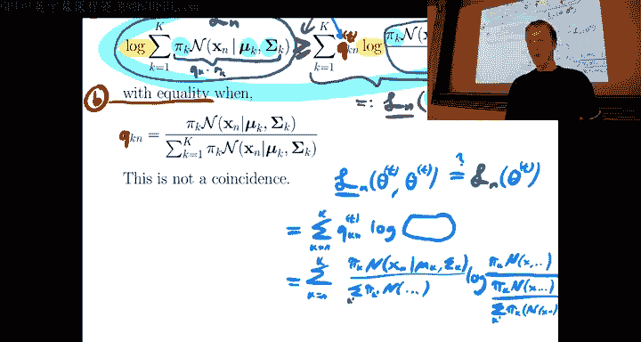

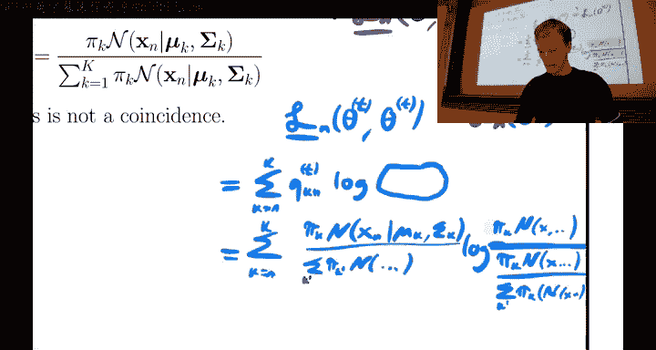

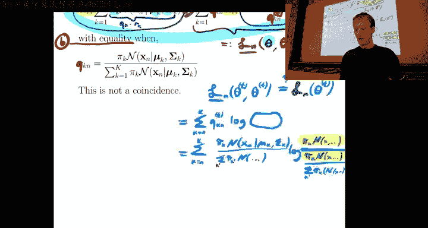

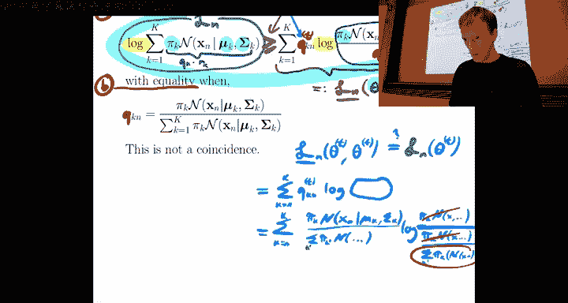

核心技巧是利用对数函数的凹性（或负对数函数的凸性）。对于任意凸函数 \(f\) 和一组权重 \(q_k\)（满足 \(\sum_k q_k = 1\)），詹森不等式成立：
\[
f\left( \sum_k q_k r_k \right) \le \sum_k q_k f(r_k)
\]
对于凹函数（如对数函数），不等式方向相反。我们利用这个性质来构造下界。

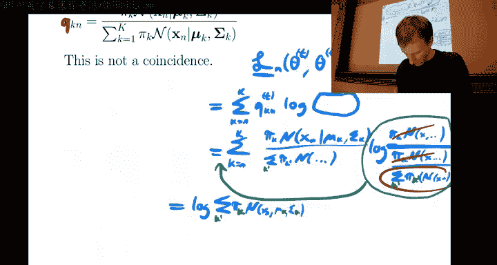

具体到我们的模型，对于单个数据点 \(x_n\)，其对数似然为：
\[
L_n(\theta) = \log \left( \sum_{k=1}^{K} \pi_k \mathcal{N}(x_n | \mu_k, \Sigma_k) \right)
\]
我们引入辅助变量 \(q_{kn}\)，并构造替代函数：
\[
\bar{L}_n(\theta; \theta^{(t)}) = \sum_{k=1}^{K} q_{kn}^{(t)} \log \left( \frac{\pi_k \mathcal{N}(x_n | \mu_k, \Sigma_k)}{q_{kn}^{(t)}} \right)
\]
其中，权重 \(q_{kn}^{(t)}\) 定义为在当前参数 \(\theta^{(t)}\) 下，数据点 \(n\) 属于聚类 \(k\) 的后验概率：
\[
q_{kn}^{(t)} = p(z_n = k | x_n, \theta^{(t)}) = \frac{\pi_k^{(t)} \mathcal{N}(x_n | \mu_k^{(t)}, \Sigma_k^{(t)})}{\sum_{j=1}^{K} \pi_j^{(t)} \mathcal{N}(x_n | \mu_j^{(t)}, \Sigma_j^{(t)})}
\]

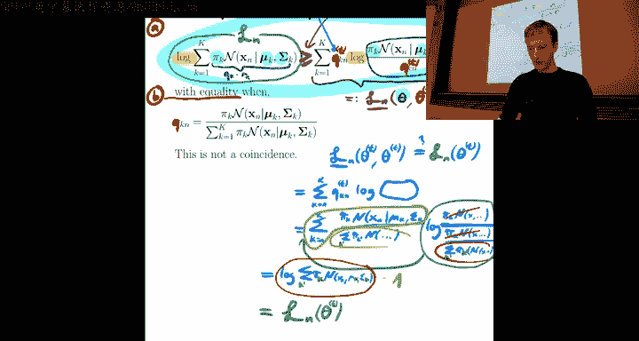

这个选择保证了两个关键性质：
1.  **下界性质**：对于所有 \(\theta\)，有 \(\bar{L}_n(\theta; \theta^{(t)}) \le L_n(\theta)\)。
2.  **相等性质**：在当前点 \(\theta = \theta^{(t)}\) 处，有 \(\bar{L}_n(\theta^{(t)}; \theta^{(t)}) = L_n(\theta^{(t)})\)。

因此，\(\bar{L}_n\) 是一个在 \(\theta^{(t)}\) 处与原函数相切的下界，是理想的替代函数。

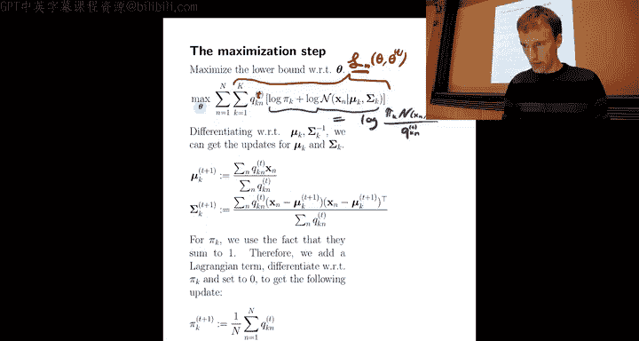

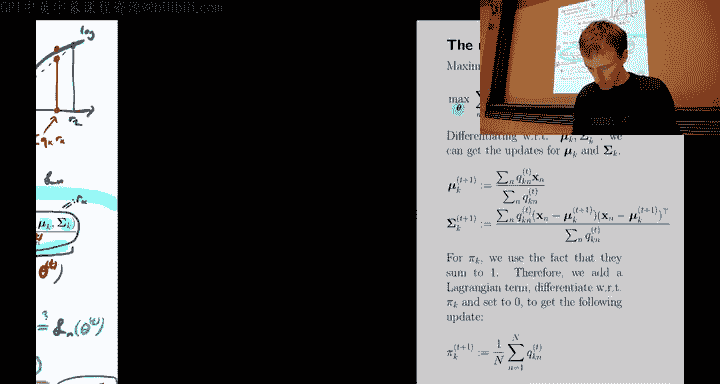

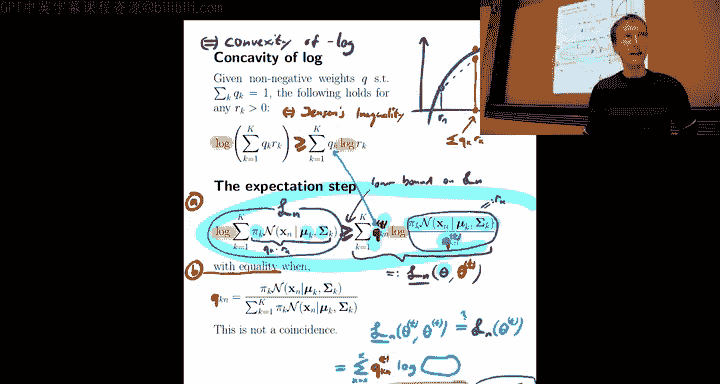

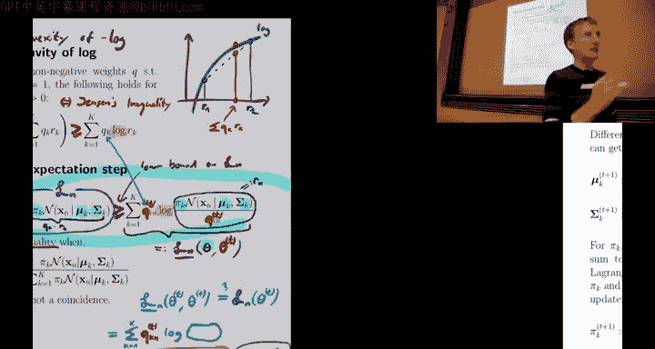

## 最大化替代函数（M步）

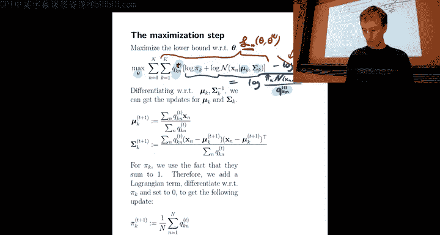

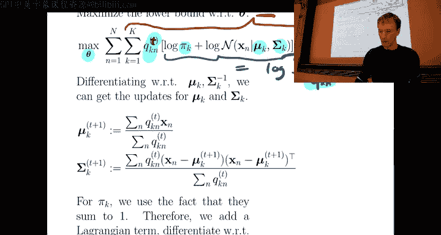

构建好替代函数后，下一步就是最大化它以得到新的参数估计 \(\theta^{(t+1)}\)。我们需要优化所有参数：混合权重 \(\pi_k\)、均值 \(\mu_k\) 和协方差矩阵 \(\Sigma_k\)。

总体的替代函数是所有数据点替代函数的和：
\[
\bar{L}(\theta; \theta^{(t)}) = \sum_{n=1}^{N} \bar{L}_n(\theta; \theta^{(t)})
\]
最大化这个函数比直接最大化原始似然函数要简单得多，因为对数内部的求和被“线性化”了。

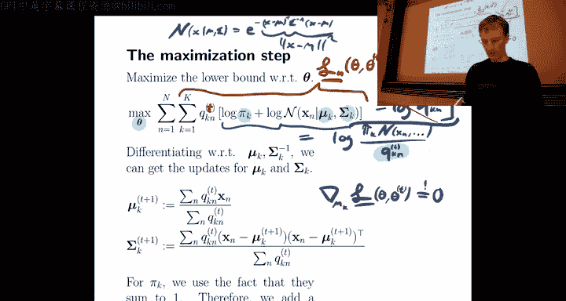

以下是最大化步骤：

### 1. 更新均值 \(\mu_k\)

对 \(\bar{L}\) 关于 \(\mu_k\) 求导并令其为零，得到更新公式：
\[
\mu_k^{(t+1)} = \frac{\sum_{n=1}^{N} q_{kn}^{(t)} x_n}{\sum_{n=1}^{N} q_{kn}^{(t)}}
\]
新的均值是数据点的加权平均，权重正是E步计算出的后验概率 \(q_{kn}^{(t)}\)。

### 2. 更新协方差 \(\Sigma_k\)

对 \(\bar{L}\) 关于 \(\Sigma_k^{-1}\) 求导并令其为零，得到更新公式：
\[
\Sigma_k^{(t+1)} = \frac{\sum_{n=1}^{N} q_{kn}^{(t)} (x_n - \mu_k^{(t+1)})(x_n - \mu_k^{(t+1)})^T}{\sum_{n=1}^{N} q_{kn}^{(t)}}
\]
新的协方差矩阵是加权的外积矩阵，权重同样是 \(q_{kn}^{(t)}\)。

### 3. 更新混合权重 \(\pi_k\)

在约束条件 \(\sum_{k=1}^K \pi_k = 1\) 下最大化 \(\bar{L}\)。使用拉格朗日乘子法，得到更新公式：
\[
\pi_k^{(t+1)} = \frac{1}{N} \sum_{n=1}^{N} q_{kn}^{(t)}
\]
新的混合权重是数据点属于聚类 \(k\) 的平均后验概率。

## EM算法与K均值的关系 🔗

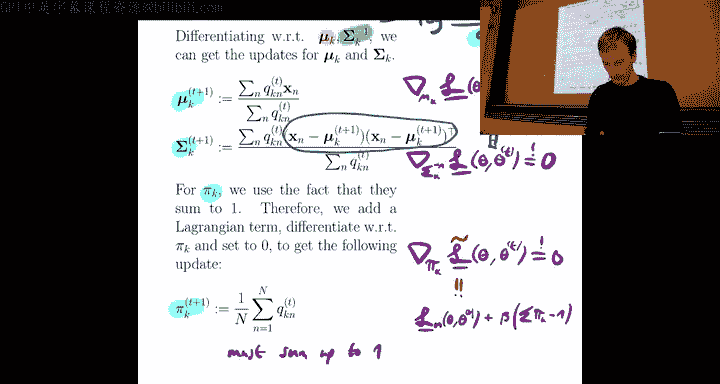

现在我们已经理解了EM算法的两个步骤，让我们看看它如何与之前学过的K均值算法联系起来。

当高斯混合模型满足以下两个条件时，EM算法退化为K均值算法：
1.  所有聚类的协方差矩阵都是球形的，即 \(\Sigma_k = \sigma^2 I\)，其中 \(\sigma^2\) 是一个标量。
2.  方差 \(\sigma^2\) 趋近于零 (\(\sigma^2 \to 0\))。

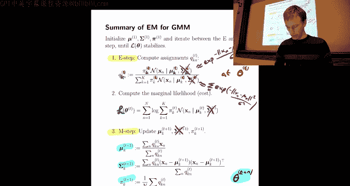

在这种情况下：
*   **E步**：后验概率 \(q_{kn}\) 会变得非常“硬”。对于每个数据点 \(x_n\)，只有距离最近的聚类中心 \(k\) 对应的 \(q_{kn}\) 趋近于1，其余趋近于0。这等价于K均值中的硬分配 \(z_{kn}\)。
*   **M步**：均值 \(\mu_k\) 的更新公式变为仅对分配给该聚类的点求平均，这正是K均值的中心更新步骤。混合权重 \(\pi_k\) 则变为分配给各聚类的数据点比例。

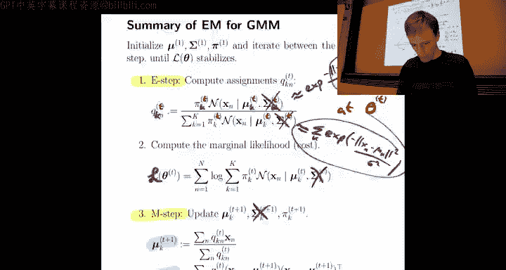

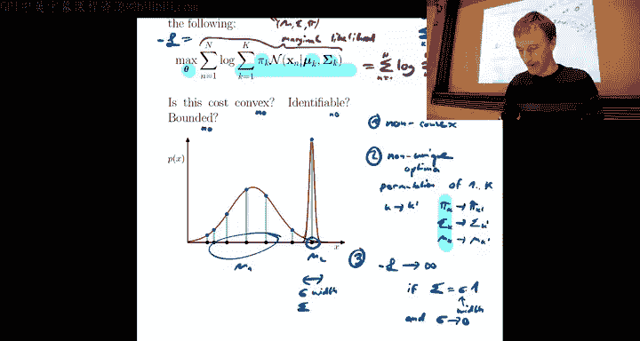

因此，K均值可以看作是EM算法在高斯混合模型方差无限小且各向同性这一特例下的极限形式。

## EM算法的直观演示与泛化 🎯

### 算法演示

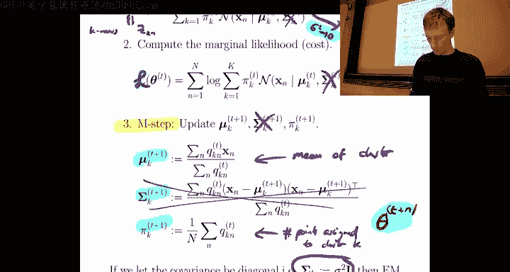

EM算法的迭代过程可以直观展示：
1.  **E步（期望步）**：基于当前参数计算每个数据点属于各个聚类的“软”概率 \(q_{kn}\)。在图中，这表现为数据点的颜色是聚类颜色的混合（例如，紫色点表示对两个聚类的归属概率相近）。
2.  **M步（最大化步）**：根据计算出的 \(q_{kn}\) 更新模型参数（均值、协方差、权重）。在图中，这表现为聚类椭圆（形状由协方差决定）的位置和形状发生改变。
3.  重复上述步骤直至收敛。最终，算法能够找到拟合数据形状的椭圆聚类。

### 算法的泛化观点

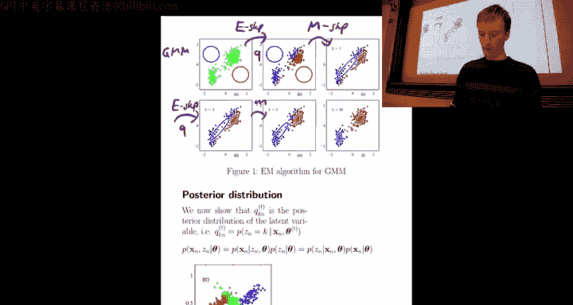

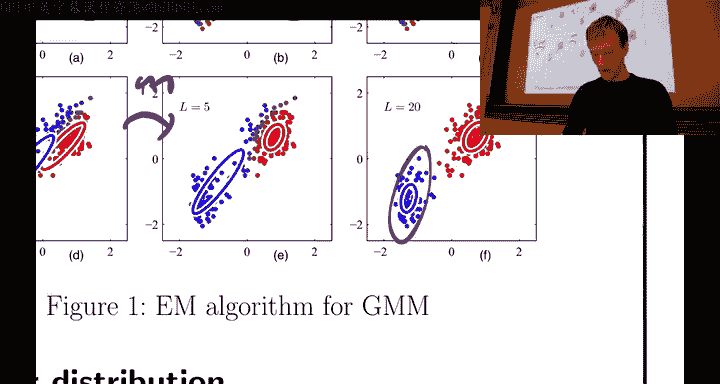

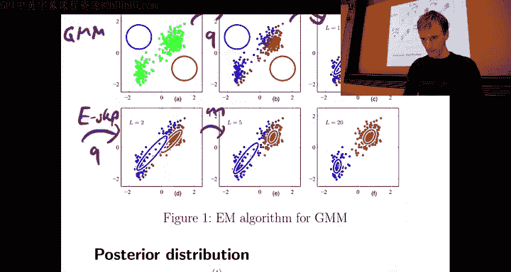

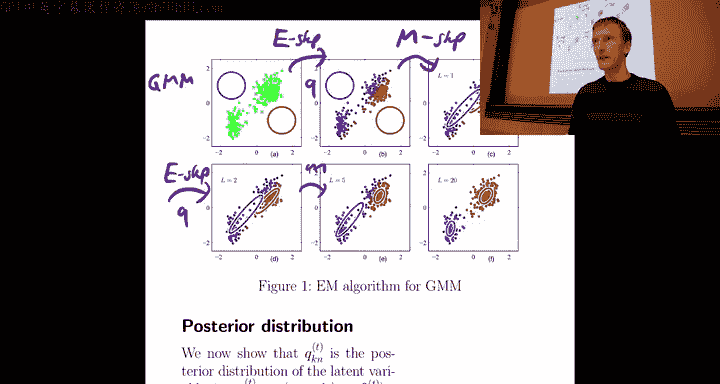

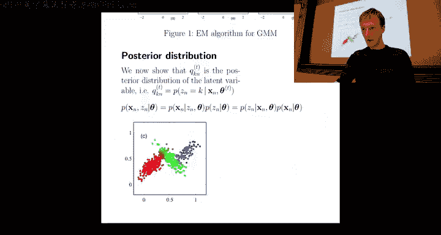

EM算法不仅适用于高斯混合模型，它是一个处理含有隐变量 \(z\) 的概率模型的通用框架。
给定观测数据 \(x\) 和模型参数 \(\theta\)，我们希望最大化边际似然 \(p(x | \theta)\)，但其中涉及对隐变量 \(z\) 的求和或积分，导致计算困难。

EM算法的通用形式如下：
*   **E步**：计算在给定当前参数 \(\theta^{(t)}\) 和观测数据 \(x\) 下，隐变量 \(z\) 的后验分布 \(p(z | x, \theta^{(t)})\)。然后，构建替代函数（Q函数）：
    \[
    Q(\theta; \theta^{(t)}) = \mathbb{E}_{z \sim p(z | x, \theta^{(t)})} \left[ \log p(x, z | \theta) \right]
    \]
    这可以理解为：由于我们不知道确切的 \(z\)，就用它的后验期望来代替。
*   **M步**：最大化这个Q函数，得到新的参数估计：
    \[
    \theta^{(t+1)} = \arg\max_{\theta} Q(\theta; \theta^{(t)})
    \]

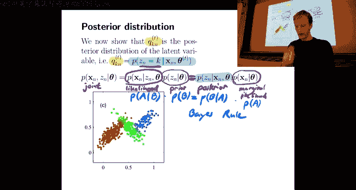

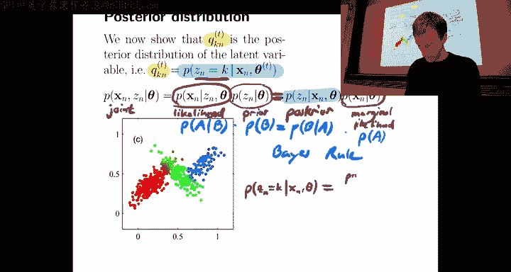

在高斯混合模型中，隐变量 \(z\) 就是数据点的聚类标签，E步计算的后验概率 \(q_{kn}\) 正是 \(p(z_n=k | x_n, \theta^{(t)})\)。因此，我们之前推导的具体步骤是这一通用框架的一个完美实例。

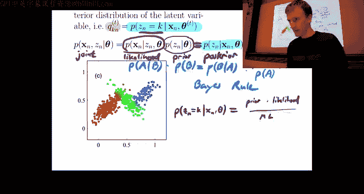

## 总结 📝

本节课中我们一起学习了期望最大化算法的核心思想与具体步骤。
*   **动机**：为了解决含有隐变量的复杂概率模型（如高斯混合模型）的参数估计问题。
*   **核心思想**：通过迭代构建并最大化一个替代函数（下界）来逼近原目标函数的最优解。
*   **两个步骤**：
    1.  **E步（期望步）**：基于当前参数，计算隐变量的后验分布（对于GMM，是计算软分配概率 \(q_{kn}\))，并构建替代函数 \(Q\)。
    2.  **M步（最大化步）**：最大化 \(Q\) 函数，更新模型参数（对于GMM，更新 \(\mu_k, \Sigma_k, \pi_k\)）。
*   **与K均值的关系**：K均值是EM算法应用于球形协方差且方差趋于零的高斯混合模型时的特例，此时软分配退化为硬分配。
*   **泛化性**：EM算法是一个强大的通用框架，适用于任何具有隐变量和可分解联合分布的概率模型。

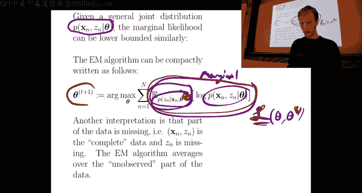

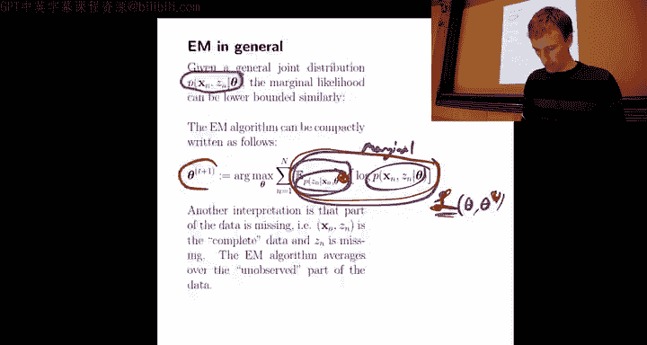

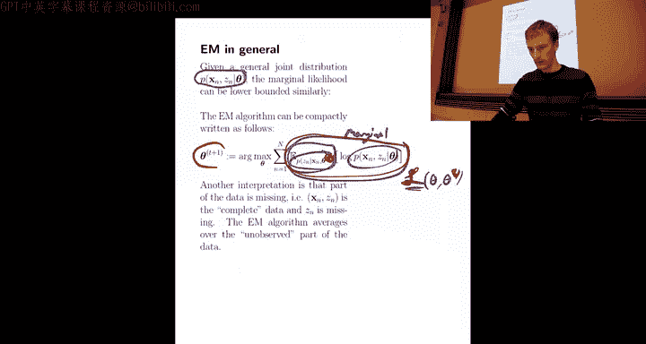

通过EM算法，我们能够以概率化的方式对数据进行软聚类，并捕捉更复杂的数据结构（如椭圆形状的聚类），这比K均值等硬聚类方法更为灵活和强大。