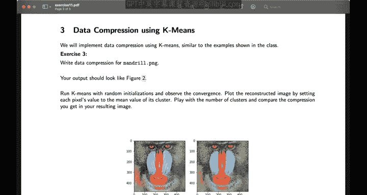

# 33：习题集11入门指南 🚀

在本教程中，我们将学习如何完成 EPFL 机器学习课程（CS-433）的习题集11。我们将涵盖梯度与海森矩阵的计算、概率模型的参数估计，以及 K-Means 算法的实现与应用。


---

## 1. 计算梯度与海森矩阵 📈

在第一个问题中，你需要确定函数 **F** 关于变量 **X** 的梯度和海森矩阵。

建议将 **F** 写成 **X** 中每个元素的函数，并以此方式推导出答案。

---

## 2. 概率模型与参数估计 🔍

上一节我们介绍了函数梯度的计算，本节中我们来看看如何对数据建立概率模型并估计其参数。

### 2.1 联合概率分布

在第二题的第一部分，你需要写出数据的联合概率分布。

由于数据是独立同分布的，你可以将联合分布写成每个概率分布的乘积，从而得到一个更简洁的答案形式。

**公式**：
`P(X₁, X₂, ..., Xₙ) = ∏ P(Xᵢ)`

### 2.2 最大似然估计

在第二部分，你需要找出使数据似然度最大化的超参数 **μ** 和 **σ**。

由于对数函数是单调递增的，你也可以最大化数据的对数似然度。

### 2.3 估计量评估

在第三和第四部分，你需要将经验估计值与真实参数值进行比较，以判断你的估计量是否有偏。

请记住，你的经验估计依赖于所有随机变量。

---

## 3. K-Means 算法实现 💻

在习题的实现部分，你首先需要实现 K-Means 算法，然后将其应用于二维相位数据和三维图像的 RGB 值。

以下是实现 K-Means 算法的核心步骤：

**代码**：
```python
# 伪代码示例
1. 初始化聚类中心（可从数据中采样或随机生成）。
2. 将每个数据点分配到最近的聚类中心。
3. 重新计算每个聚类的中心点。
4. 重复步骤2和3，直到收敛。
```

首先，通过从数据中采样一些点或根据数据范围生成随机点来初始化你的聚类中心。

然后，尝试不同的 **k** 值，看看哪个能给出更好的成本函数值。

但请记住，**k** 值最大并不代表对数据的拟合最好。你可以查阅贝叶斯信息准则来了解更多关于为数据选择模型复杂度的信息。

---

## 4. 图像压缩应用 🖼️

在习题的最后一部分，你需要使用刚刚开发的 K-Means 算法来压缩图像。

首先，将你的图像转换为三维 RGB 值的向量，然后应用 K-Means 算法。

请记住，如果你的成本函数不再改善，可以提前终止算法。

---

## 总结 📝

本节课中我们一起学习了：
1.  如何计算函数的梯度与海森矩阵。
2.  如何为独立同分布数据建立联合概率模型，并使用最大似然法估计其参数。
3.  如何实现 K-Means 聚类算法，并将其应用于二维数据和三维图像 RGB 值。
4.  如何利用 K-Means 算法进行图像压缩，并理解提前终止的条件。



希望你能享受这次习题练习。