# 34：生成对抗网络 (GANs) 入门 🎭

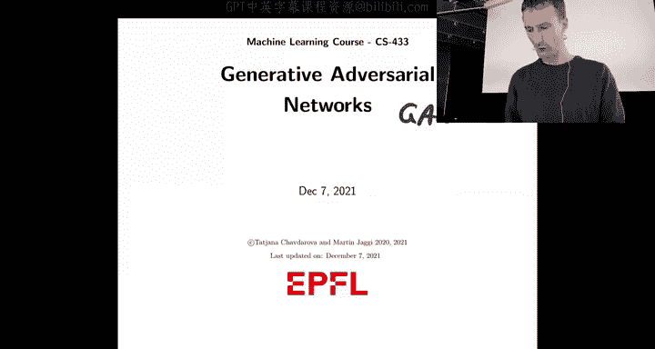

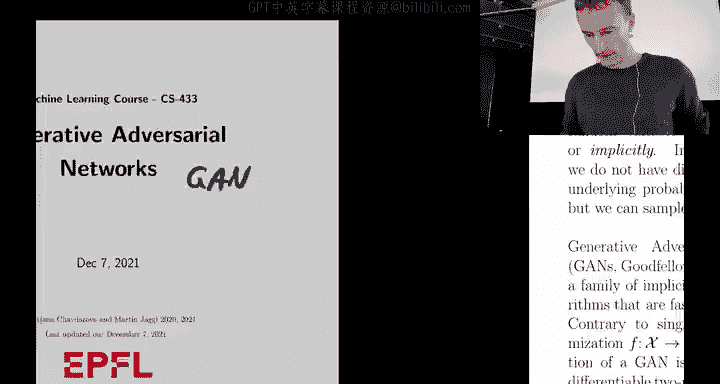

在本节课中，我们将要学习生成对抗网络。这是一种通过让两个神经网络相互对抗来学习生成数据的方法。

---

## 概述

上一节我们介绍了期望最大化算法。本节中，我们来看看生成对抗网络。这是一种学习生成模型或生成数据的方法。

生成模型与我们熟悉的标准监督模型有很大不同。在监督学习中，我们有带标签的数据来解决分类问题。但生成模型不同，我们没有标签，只有一堆给定的数据点 `X`。我们的目标是学习一个“黑盒”，它能生成与这些真实数据点相似的数据。换句话说，我们想学习一个模型，它能生成尽可能多的、看起来像真实数据的“假”数据。

我们之前在讨论高斯混合模型时已经接触过生成模型的思想。今天，我们将更进一步。这里的核心思想是，它不仅仅学习一个模型，而是同时学习两个模型。这两个模型相互作用，目标相互竞争，就像一场游戏。

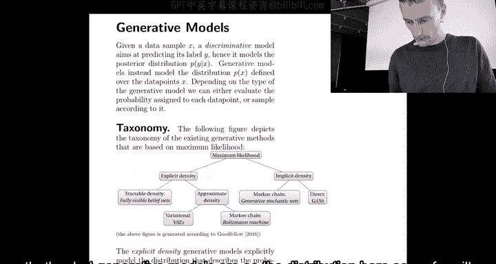

---

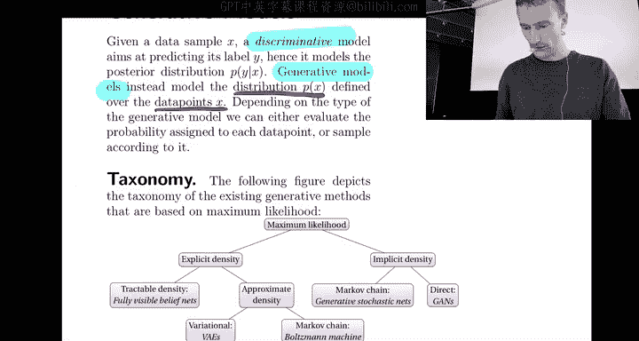

## 生成对抗网络 (GANs) 的设定

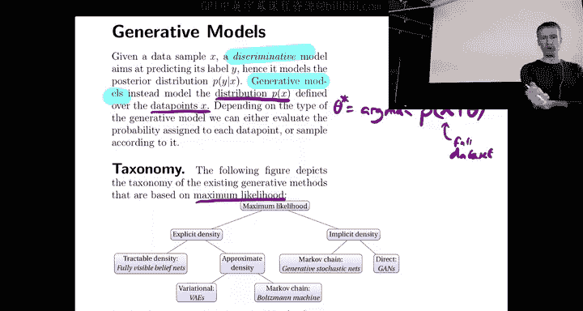

我们将这种学习形式化为一个双人游戏。游戏的两位参与者是：
*   **生成器**：一个具有参数 `θ` 的神经网络。它的任务是生成假数据（例如图像，但可以是任何数据模态）。
*   **判别器**：一个具有参数 `φ` 的神经网络。它以图像作为输入，输出一个决策（是/否），判断输入是真实图像还是生成器生成的假图像。

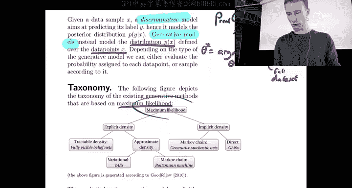

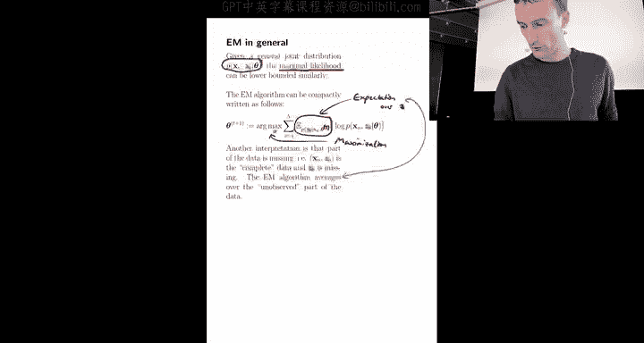

接下来，我们需要定义如何学习这些参数，即优化问题是什么。

---

## 优化问题：极小极大博弈

对于判别器，我们最小化判别器损失函数 `L`。关键在于，这个损失函数依赖于双方。它取决于生成器参数 `θ` 和判别器参数 `φ`。这个损失值就像游戏中的收益：如果为负，对一方有利；如果为正，对另一方有利。

判别器作为最小化玩家，希望最小化 `L`。生成器可能有不同的目标，例如最大化 `L`。在最简单的设定中，一个玩家的损失函数是另一个玩家损失函数的负值，这被称为**零和博弈**：一方的收益是另一方的损失。

因此，如果损失函数对双方相同（或符号相反），我们就有一个零和博弈。那么，生成器（黄色玩家）希望最小化 `L`，而判别器（红色玩家）希望最大化 `L`（即最小化 `-L`）。这就形成了一个**极小极大问题**。

其数学形式为：
```
min_θ max_φ L(θ, φ)
```
其中，`θ` 是生成器参数（最小化玩家），`φ` 是判别器参数（最大化玩家）。

这种零和博弈的公式化是处理游戏的一种通用方式。使用神经网络的好处在于它们是可微分的。如果生成器和判别器都是神经网络，并且损失函数定义在它们之上，那么这个损失函数很可能也是可微的。我们称之为**可微分博弈**。这使得我们更有可能优化这类游戏，即找到让双方都满意的解（一种均衡状态）。

---

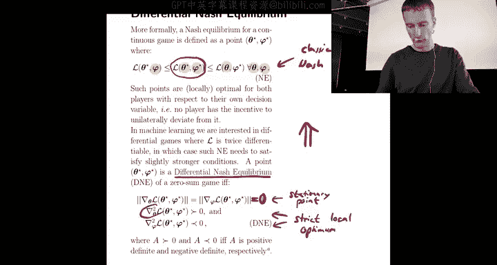

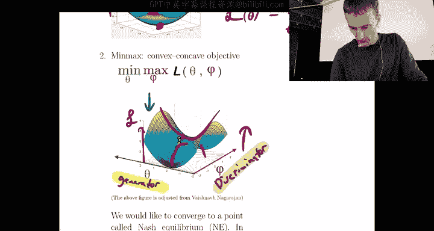

## 生成模型与极大似然估计

生成模型的目标是生成数据点，使得人工数据的分布与真实数据的分布相似。我们用 `P_data(x)` 表示真实数据的分布（我们不知道它），用 `P_model(x; θ)` 表示模型生成的分布。我们希望找到一个参数 `θ*`，使得 `P_model` 尽可能接近 `P_data`。

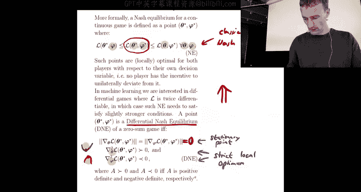

通常，我们通过**极大似然估计**来训练生成模型。即，最大化给定模型参数下数据的似然：
```
θ* = argmax_θ P_model(X; θ)
```
其中 `X` 是整个数据集。这是学习此类密度的一个通用原则。

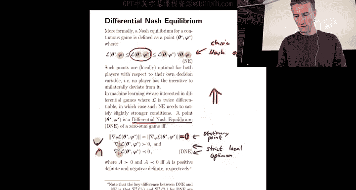

生成模型的一个关键区别在于，有些模型假设我们知道真实的密度函数形式（显式密度模型），而有些则不需要（隐式密度模型）。GANs 属于后者，它只需要能够从模型和真实数据中采样数据点即可进行训练。

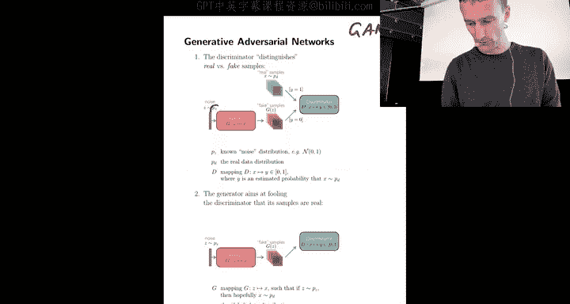

---

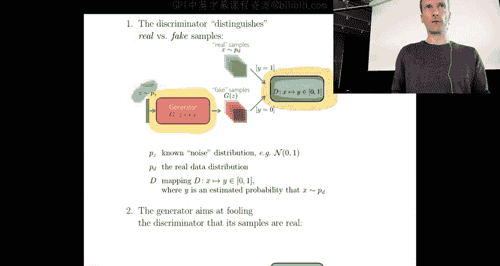

## 可微分博弈与纳什均衡

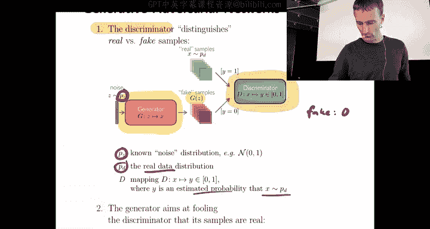

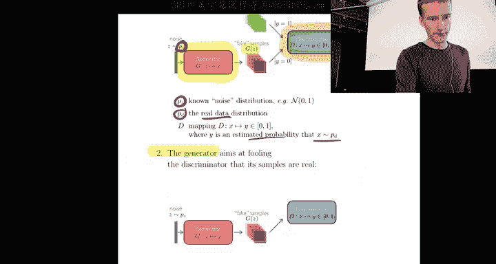

到目前为止，我们学习的都是单玩家优化问题，即最小化一个关于单一参数 `θ` 的损失函数。其优化“地形”可能是一个复杂的曲面，我们寻找最小值点。

在双玩家博弈中，情况有所不同。现在有两个具有对立目标的玩家。判别器（红色坐标）试图最大化损失值，生成器（绿色坐标）试图最小化损失值。优化地形可能看起来像一个鞍点：一个玩家想尽可能走高，另一个想尽可能走低。我们希望找到一个点，双方都无法再改进，这被称为**纳什均衡**。

对于可微分博弈，我们可以给出一个更便利的最优条件。如果满足以下条件，则点 `(θ*, φ*)` 是一个**微分纳什均衡**：
1.  **梯度为零**：`∇_θ L(θ*, φ*) = 0` 且 `∇_φ L(θ*, φ*) = 0`。这是一个驻点。
2.  **局部最优性**：对于最小化玩家（生成器），关于 `θ` 的 Hessian 矩阵是正定的（曲面向上弯曲）。对于最大化玩家（判别器），关于 `φ` 的 Hessian 矩阵是负定的（曲面向下弯曲）。

这意味着在该点附近，任何微小的偏离都会使各自的损失变差。虽然对于大型神经网络计算 Hessian 矩阵不现实，但这个条件在数学上清晰地定义了均衡点。

为了优化此类博弈，我们将使用标准算法——梯度下降。生成器将对 `θ` 执行梯度步以最小化损失，判别器将对 `φ` 执行梯度步以最大化损失。两者交替进行。

---

## GANs 的目标函数

现在，我们为生成数据的具体任务定义损失函数。以下是基本设定：

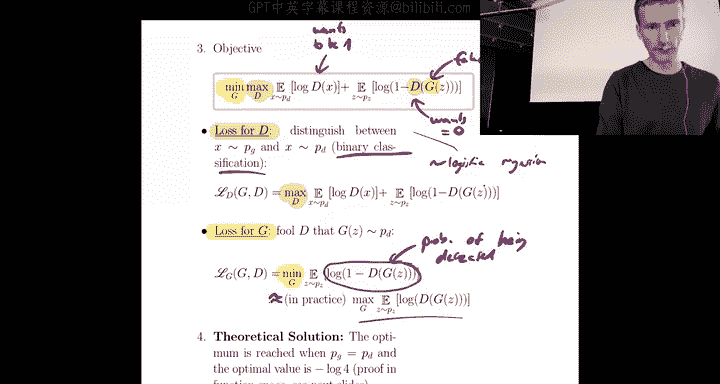

*   **生成器 G**：接收一个随机噪声向量 `z`（例如，从均匀分布或高斯分布 `P_z(z)` 中采样），并输出一个数据点 `G(z)`（例如一张图像）。其目标是生成看起来真实的数据。
*   **判别器 D**：接收一个数据点 `x`（可以是真实的 `x ~ P_data(x)`，也可以是生成的 `G(z)`），并输出一个标量 `D(x)`，表示 `x` 是真实数据的概率（理想情况下，真实数据输出 1，生成数据输出 0）。

判别器的任务类似于一个标准的二分类器（监督学习）。生成器的任务是“欺骗”判别器。

### 目标函数公式

一个经典且简单的 GAN 目标函数如下，它类似于逻辑回归的损失：

对于**判别器 D**，它试图最大化：
```
max_φ [ E_(x~P_data) [log D(x)] + E_(z~P_z) [log(1 - D(G(z)))] ]
```
*   第一项鼓励判别器对真实数据 `x` 给出高概率（接近 1）。
*   第二项鼓励判别器对生成数据 `G(z)` 给出低概率（接近 0）。

对于**生成器 G**，它试图最小化判别器将其数据识别为假的能力，即最小化 `log(1 - D(G(z)))`。一个常用的近似是转而最大化 `log(D(G(z)))`，这能提供更强的早期梯度。因此，生成器的目标可写为：
```
min_θ [ E_(z~P_z) [log(1 - D(G(z)))] ]  或近似为   max_θ [ E_(z~P_z) [log(D(G(z)))] ]
```

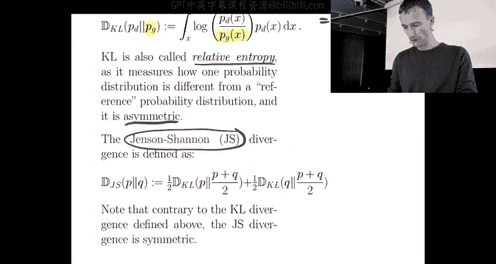

综合起来，GAN 的优化问题是一个极小极大博弈：
```
min_θ max_φ V(D, G) = E_(x~P_data) [log D(x)] + E_(z~P_z) [log(1 - D(G(z)))]
```
其中，`D` 的参数是 `φ`，`G` 的参数是 `θ`。

---

## 理论分析：最优解与分布匹配

为什么选择这个特定的损失函数？原因在于，在这个极小极大博弈的均衡点，有一个非常好的性质：**生成器学到的分布 `P_G` 将等于真实数据分布 `P_data`**。

为了分析这一点，我们需要一个衡量两个概率分布相似度的工具。

*   **KL 散度**：衡量一个分布 `P` 相对于参考分布 `Q` 的差异，不对称。
    ```
    KL(P || Q) = ∫ P(x) log(P(x) / Q(x)) dx = E_(x~P) [log(P(x) / Q(x))]
    ```
*   **JS 散度**：基于 KL 散度的对称版本。
    ```
    JS(P || Q) = (1/2) KL(P || M) + (1/2) KL(Q || M)，其中 M = (P+Q)/2
    ```

### 证明概要

1.  **给定生成器 G，最优判别器 D***：
    对于固定的生成器 `G`（即固定的分布 `P_G`），我们可以推导出最优判别器 `D*` 为：
    ```
    D*(x) = P_data(x) / [P_data(x) + P_G(x)]
    ```
    直观上，判别器对样本 `x` 给出的最优概率，是 `x` 来自真实分布的概率与来自总分布（真实+生成）的概率之比。

2.  **将 D* 代入目标函数**：
    将最优判别器 `D*` 代回极小极大目标函数 `V(D, G)` 中，经过推导，生成器的优化问题转化为：
    ```
    min_θ [ 2 * JS(P_data || P_G) - log(4) ]
    ```
    由于 `log(4)` 是常数，这等价于最小化 `P_data` 和 `P_G` 之间的 JS 散度。

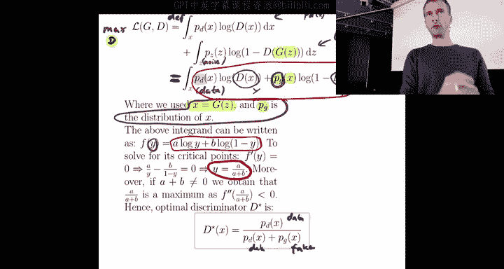

3.  **均衡状态**：
    当 `P_G = P_data` 时，JS 散度达到最小值 0，此时 `D*(x) = 1/2`（判别器完全无法区分）。这正是我们期望的均衡状态：生成器完美复制了真实数据分布，判别器则只能随机猜测。

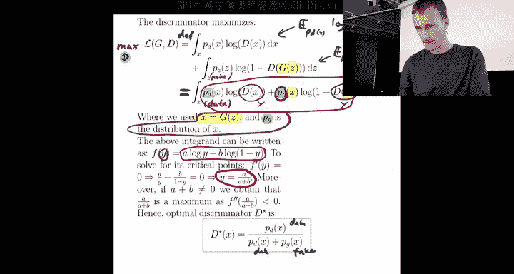

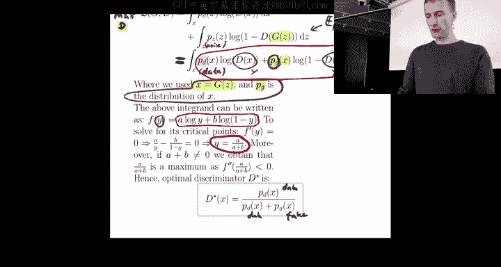

这个理论结果表明，在这个特定博弈的均衡点，生成器确实学会了匹配真实数据分布。

---

## GANs 的挑战与改进

虽然经典 GAN 在理论上有很好的性质，但其使用的 JS 散度在实践中存在一个问题：**当两个分布没有重叠或支撑集不相交时，JS 散度是常数（log2），导致梯度消失**。例如，如果真实数据和生成数据是离散的且没有重叠，JS 散度无法提供有意义的梯度来指导生成器改进。

因此，研究人员提出了使用其他分布距离的 GAN 变体。

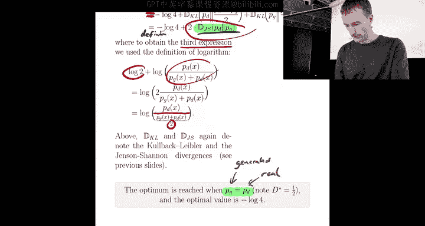

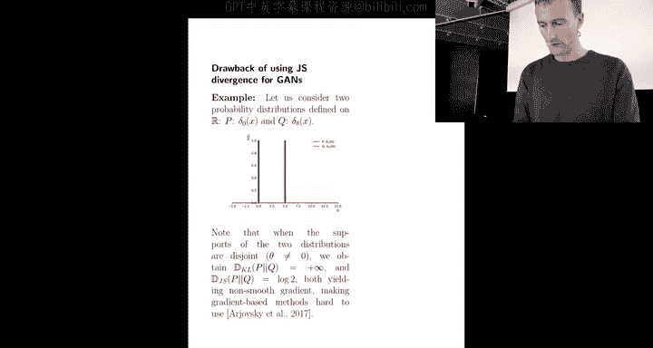

*   **Wasserstein 距离（推土机距离）**：直观上，它衡量将一个分布 `P` 的“土堆”搬动成另一个分布 `Q` 的“土堆”所需的最小“工作量”。即使两个分布没有重叠，该距离也是定义良好且可微的（在适当条件下）。
*   **Wasserstein GAN**：使用 Wasserstein 距离作为损失函数的 GAN 变体，通常能提供更稳定的训练和更有意义的梯度信号。

---

## 训练算法与实践

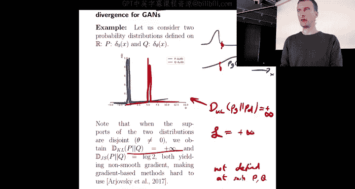

训练 GAN 的算法非常直观，就是交替进行梯度下降：

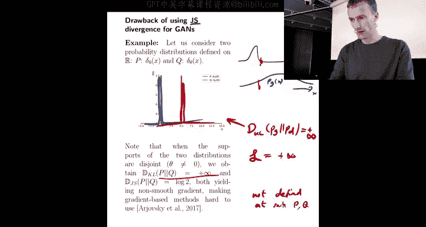

以下是训练步骤：
1.  从真实数据分布 `P_data` 中采样一个小批量真实数据 `{x}`。
2.  从先验噪声分布 `P_z`（如高斯分布）中采样一个小批量噪声 `{z}`。
3.  使用噪声 `{z}` 通过当前生成器 `G` 生成假数据 `{G(z)}`。
4.  **更新判别器 D**：计算判别器损失关于其参数 `φ` 的梯度，并执行一步梯度**上升**（因为判别器要最大化目标）。
    ```
    φ <- φ + η * ∇_φ [ (1/m) Σ log D(x) + (1/m) Σ log(1 - D(G(z))) ]
    ```
5.  **更新生成器 G**：计算生成器损失（如 `-log(D(G(z)))`）关于其参数 `θ` 的梯度，并执行一步梯度**下降**（因为生成器要最小化目标）。
    ```
    θ <- θ - η * ∇_θ [ (1/m) Σ log(D(G(z))) ]
    ```
6.  重复步骤 1-5。

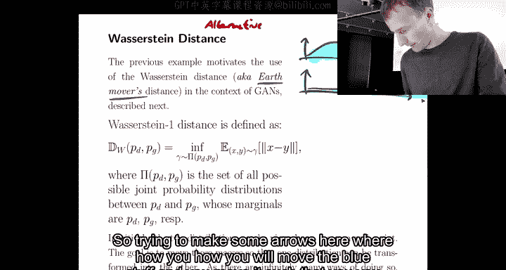

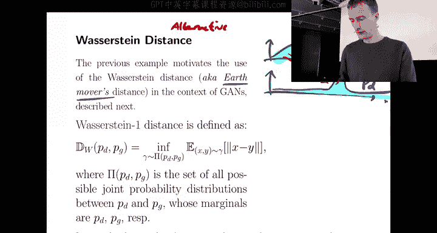

在实践中，通常使用卷积神经网络作为生成器和判别器的架构。生成器将低维噪声 `z` 上采样为完整图像，判别器将图像下采样为一个标量概率值。

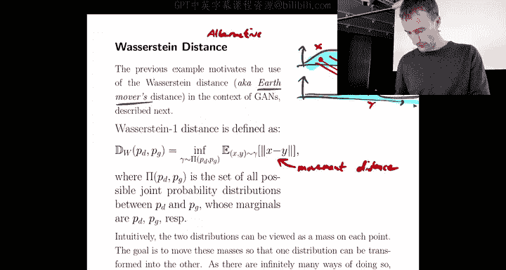

此外，还有**条件 GAN**，它可以生成符合特定条件（如类别标签、文本描述）的数据，方法是将条件信息同时输入给生成器和判别器。

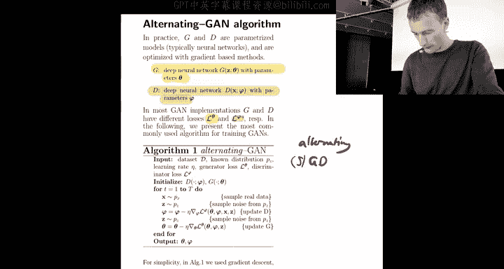

---

## 总结

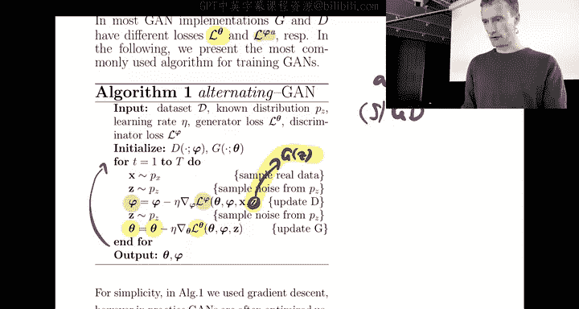

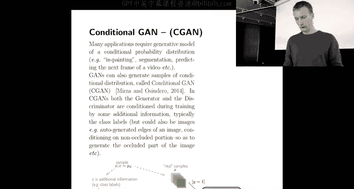

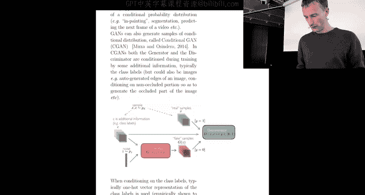

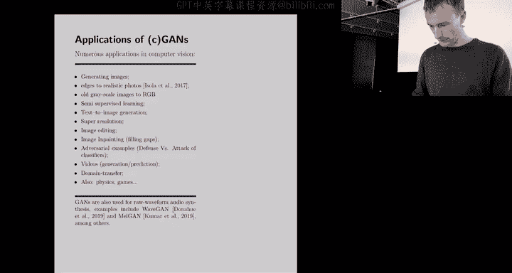

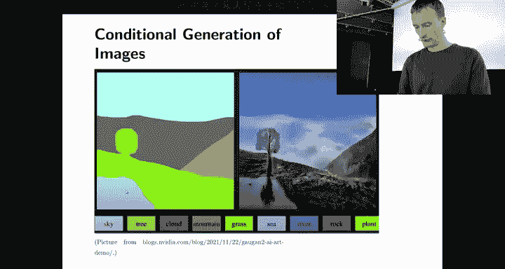

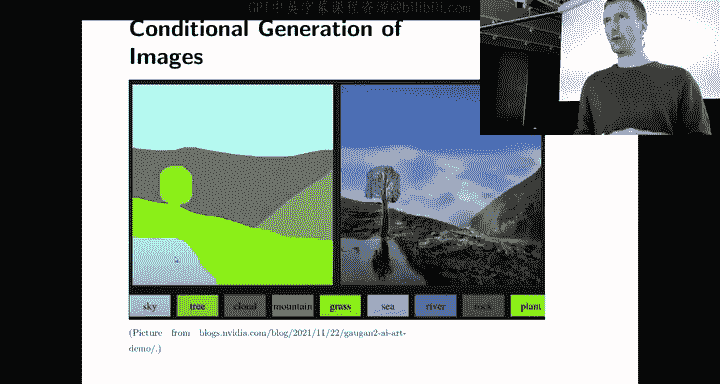

本节课中，我们一起学习了生成对抗网络的核心思想。我们了解到：

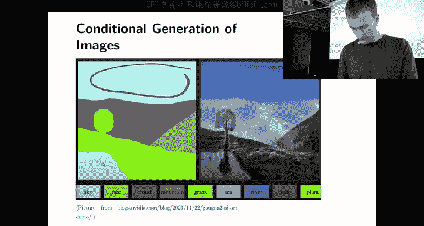

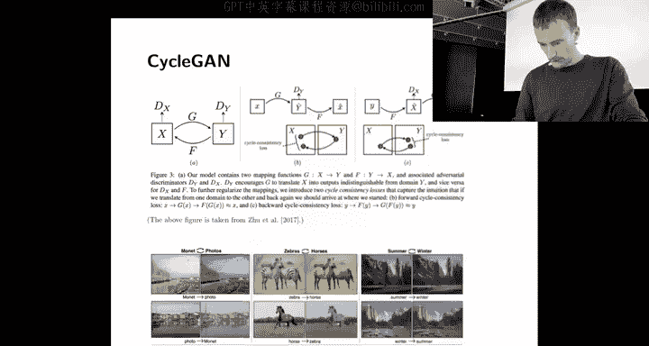

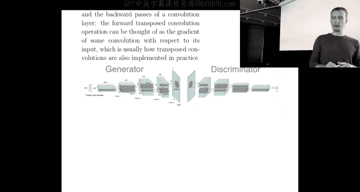

1.  GAN 通过一个**生成器**和一个**判别器**之间的**极小极大博弈**来学习数据分布。
2.  其优化目标可以形式化为 `min_θ max_φ V(D, G)`。
3.  在理论均衡点，生成器学到的分布能完美匹配真实数据分布，这通过最小化 JS 散度等分布距离来实现。
4.  经典 GAN 可能面临梯度消失问题，而改进版本如 **Wasserstein GAN** 能提供更稳定的训练。
5.  训练过程是**交替梯度下降**，交替更新判别器和生成器的参数。
6.  GAN 是一种强大的生成模型，可用于图像、音频等多种数据的生成和增强。

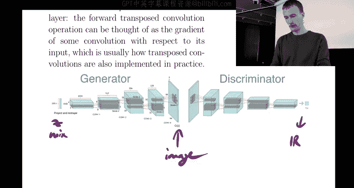

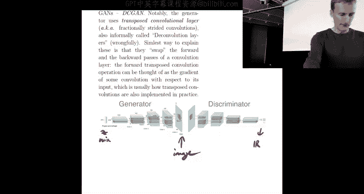

通过将博弈论思想与神经网络的可微分优化相结合，GANs 为生成式人工智能开辟了一条独特的道路。