# 35：主成分分析（PCA）基础与应用 🧠

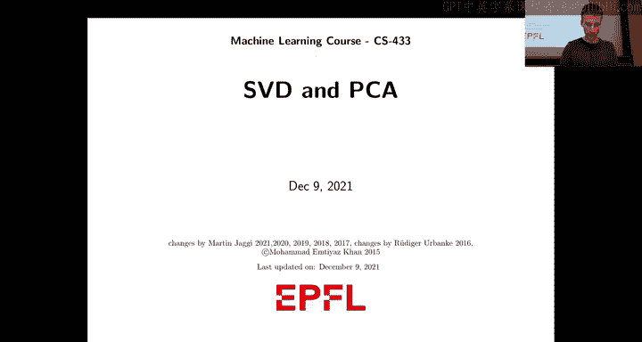

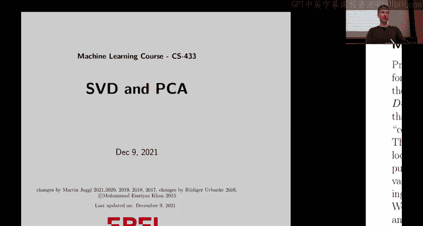

在本节课中，我们将要学习主成分分析（PCA）的基本原理及其在无监督学习中的应用。我们将从线性代数的角度理解PCA，并探讨它如何用于数据降维、特征提取以及数据可视化。

---

### 概述：为什么需要PCA？

PCA是无监督学习章节的一部分。它的价值不仅在于其线性代数的技术层面，更在于它提供了一种无监督的方式来总结数据或将数据投影到更易于管理的空间中。这对于处理大型数据集和进行探索性数据分析非常有帮助，这也是PCA至今仍被广泛使用的原因。

---

### 动机：降维与信息保留

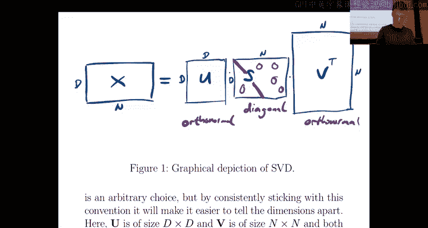

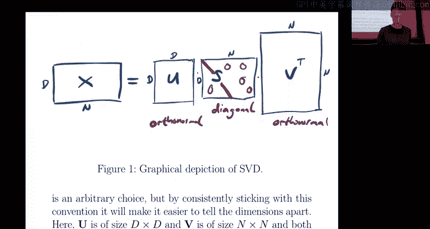

一方面，PCA的动机是用于降维。当我们拥有大量特征时，原始特征空间可能维度非常高。每个数据点有D个特征，我们希望将这些点映射到一个维度更小的空间（K维），并且希望K通常远小于原始维度D。

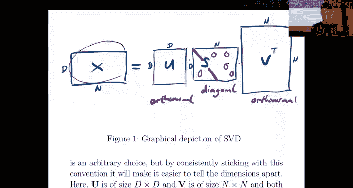

当然，你可以随意进行降维。但关键在于，能否以一种有意义的方式进行？能否在降维的同时保留原始特征中的大部分信息？这就是问题的核心。否则，你可以简单地将所有点映射到同一个点上，但这并不是降维的目的。我们的目标是，在保留每个数据点大部分信息的同时进行降维。我们将在后续更精确地定义“大部分信息”的含义。

---

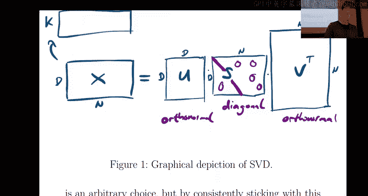

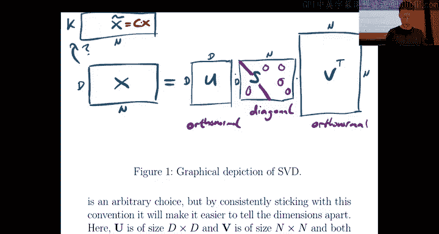

### 数据矩阵与低秩近似

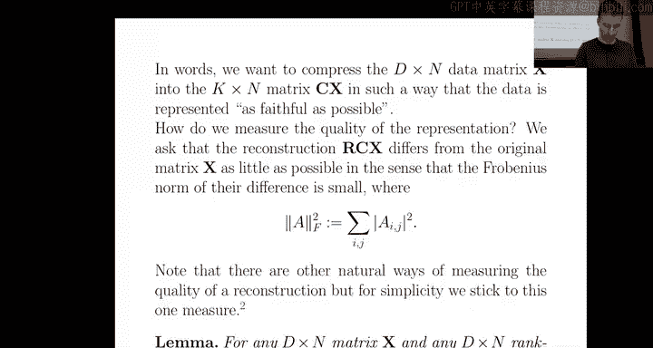

我们通常将数据组织成矩阵形式。数据矩阵通常是D行N列，其中每一列代表一个数据点 \( x_i \)。

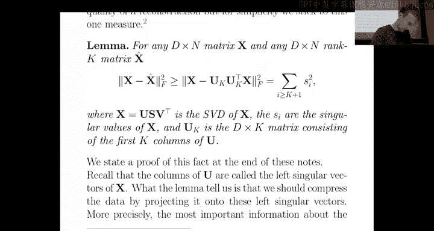

我们的目标是近似这个矩阵。更具体地说，我们希望将其分解为一个低秩矩阵。你可以将其视为一种矩阵分解，将原始矩阵分解为两个维度更小的矩阵的乘积。

直观上，我们希望将原始数据矩阵 \( X \)（D x N）变换为 \( \hat{X} \)（D x N），其中 \( \hat{X} \) 的秩为K（K远小于D和N）。这可以通过因子分解 \( X \approx RC \) 来实现，其中 \( R \) 是D x K矩阵，\( C \) 是K x N矩阵。这样，每个原始数据点（D维）现在只用K个特征来表示。

---

### 奇异值分解（SVD）回顾

我们通过奇异值分解（SVD）来实现上述目标。任何矩形矩阵 \( X \)（D x N）都可以精确地分解为以下形式：
\[
X = U S V^T
\]
其中：
*   \( U \) 是D x D的正交矩阵（左奇异向量）。
*   \( S \) 是D x N的矩阵，只有主对角线上的元素（奇异值）非零，且通常按从大到小排序：\( s_1 \ge s_2 \ge ... \ge s_{\min(D,N)} \ge 0 \)。
*   \( V^T \) 是N x N的正交矩阵（右奇异向量的转置）。

正交矩阵意味着其列向量是单位正交的（内积为0或1）。对于实数矩阵，正交性等同于 \( U^T U = I \) 和 \( V^T V = I \)。正交变换（如旋转）的一个重要性质是它保持向量的长度（范数）不变。

---

### 从SVD到最佳低秩近似

现在，我们来看看SVD如何与降维联系起来。我们的目标是找到一个线性映射（压缩矩阵 \( C \)）将数据 \( X \) 投影到低维空间，以及一个重建矩阵 \( R \) 将其映射回来，使得重建误差最小。

具体来说，我们希望找到矩阵 \( C \)（K x D）和 \( R \)（D x K），使得在只保留K个中间特征的情况下，重建后的矩阵 \( R(CX) \) 尽可能接近原始矩阵 \( X \)。我们使用Frobenius范数（矩阵所有元素平方和的平方根）来衡量误差：
\[
\| X - R(CX) \|_F^2
\]

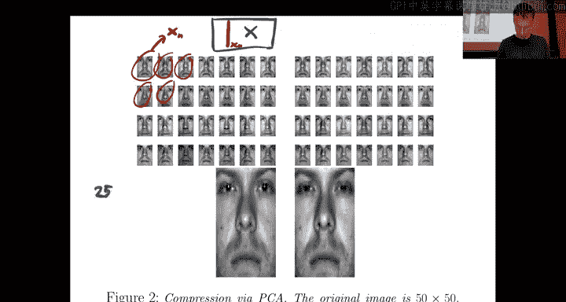

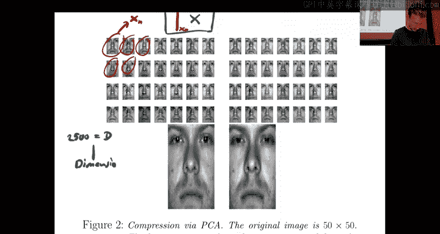

关键结论（Eckart-Young定理）指出：**对于给定的秩K，通过截断SVD得到的最佳K秩近似矩阵 \( \hat{X}_K \) 是所有秩为K的矩阵中，对 \( X \) 近似误差最小的**。

这个最佳近似可以通过以下方式获得：
1.  取SVD分解 \( X = U S V^T \)。
2.  只保留前K个最大的奇异值，将其他奇异值置零，得到矩阵 \( S_K \)。
3.  最佳K秩近似为：\( \hat{X}_K = U_K S_K V_K^T \)，其中 \( U_K \) 是 \( U \) 的前K列，\( V_K^T \) 是 \( V^T \) 的前K行。

在这种情况下，压缩矩阵 \( C \) 就是 \( U_K^T \)，重建矩阵 \( R \) 就是 \( U_K \)。压缩后的数据点为 \( z = U_K^T x \)（K维），重建后的数据点为 \( \hat{x} = U_K z \)（D维）。

重建误差恰好等于被丢弃的奇异值的平方和：
\[
\| X - \hat{X}_K \|_F^2 = \sum_{i=K+1}^{\min(D,N)} s_i^2
\]
由于奇异值按降序排列，这意味着我们保留了数据中“能量”或“信息”最大的部分。K越大，重建误差越小；当K等于矩阵的秩时，重建是完美的。

---

### PCA在真实数据上的应用：人脸图像示例

为了理解PCA的实际效果，我们来看一个人脸图像数据集。每张图像是50x50像素，因此原始特征维度D=2500。这是一个很高的维度。

我们应用PCA，选择K=10进行降维。这意味着：
*   **压缩**：每张原始图像（2500维向量）被投影到由前10个主成分（\( U_K \) 的列）张成的空间，得到一个仅包含10个特征的压缩向量 \( z \)。
*   **重建**：通过 \( \hat{x} = U_K z \)，我们可以将压缩后的10维向量重建回2500维的图像空间。

结果显示，重建后的图像虽然不完美，但人物的基本轮廓和特征仍然可辨。这非常令人惊讶，因为我们仅用10个数字就捕捉到了一张复杂图像的大部分关键信息。这10个方向（主成分）是通过分析整个数据集找到的“最佳”线性投影方向，能够最大程度地保留数据中的信息。

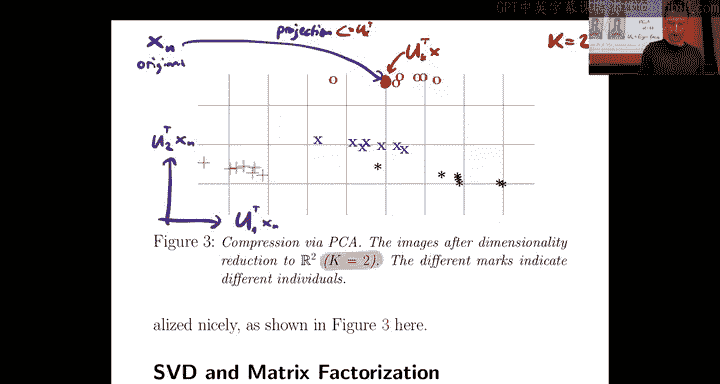

这些主成分方向（\( U_K \) 的列）本身也是2500维的向量，可以可视化为图像，被称为“特征脸”。它们代表了数据集中变化最大的方向。

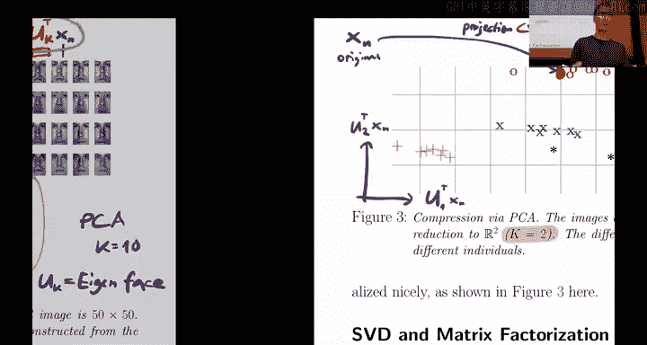

---

### PCA用于数据探索与可视化

PCA不仅可用于压缩单个数据点，更强大的功能在于探索整个数据集的结构。我们可以将**所有**数据点投影到前两个主成分上（即K=2），从而在二维平面上可视化高维数据。

在这个二维散点图中，每个点代表一个原始图像。我们可能会观察到数据点形成了一些簇。例如，在特定的人脸数据集中，属于同一个人的不同照片（不同角度或光照）在PCA投影后倾向于聚集在一起。尽管PCA本身并不知道这些标签（无监督），但它揭示了数据中内在的聚类结构。

这有助于我们：
*   **发现模式**：识别相似的数据组。
*   **检测异常值**：寻找远离群体的点。
*   **理解数据分布**：获得对高维数据集的直观认识。

选择K=2或3是为了可视化和解释的便利。对于不同的目标（如压缩），可以选择不同的K。

---

### 矩阵分解视角与去相关

从矩阵分解的角度看，PCA的截断SVD \( \hat{X}_K = U_K S_K V_K^T \) 可以重写为两个矩阵的乘积：\( \hat{X}_K = W Z \)，其中 \( W = U_K \)（D x K），\( Z = S_K V_K^T \)（K x N）。这是一种高效的、参数化的数据表示方式，因为只需要存储K*(D+N)个参数，而不是原始的D*N个参数。这类似于神经网络中的瓶颈层。

PCA还有一个重要的统计解释：**它能够对特征进行去相关**。

首先，计算数据矩阵 \( X \)（假设每个特征已中心化，即均值为0）的协方差矩阵：
\[
\Sigma_X = \frac{1}{N} X X^T
\]
将 \( X = U S V^T \) 代入，利用 \( U \) 的正交性，可得：
\[
\Sigma_X = \frac{1}{N} U S^2 U^T
\]
这表明原始特征的协方差矩阵通常不是对角的，意味着特征之间存在相关性。

现在，考虑压缩后的数据 \( Z = U_K^T X \)（K x N）。其协方差矩阵为：
\[
\Sigma_Z = \frac{1}{N} Z Z^T = \frac{1}{N} (U_K^T X)(X^T U_K) = U_K^T \Sigma_X U_K = \frac{1}{N} S_K^2
\]
这是一个**对角矩阵**！这意味着，经过PCA变换后得到的新特征（主成分）彼此之间是**不相关的**。

此外，对角线上的元素就是前K个奇异值的平方（除以N），并且是降序排列。这意味着：
*   **第一主成分**具有最大的方差，解释了数据中最大比例的变化。
*   后续主成分的方差依次递减。
*   拥有不相关的特征对于许多机器学习模型是有利的，可以避免多重共线性等问题，并提高模型的可解释性。

---

### 计算技巧

在实际计算PCA/SVD时，有一个高效的技巧。我们需要计算的是数据矩阵 \( X \)（D x N）的奇异向量 \( U \)。直接对 \( X \) 进行SVD可能计算量较大。

注意到协方差矩阵 \( \Sigma_X = \frac{1}{N} X X^T \) 的特征值分解与 \( X \) 的SVD有直接关系：\( \Sigma_X \) 的特征向量就是 \( X \) 的左奇异向量 \( U \)，而 \( \Sigma_X \) 的特征值是 \( X \) 的奇异值的平方除以N。

因此，我们可以：
1.  计算较小的那个方阵：如果 D < N，计算 D x D 的矩阵 \( X X^T \) 的特征值和特征向量。如果 N < D，则计算 N x N 的矩阵 \( X^T X \) 的特征值和特征向量（其特征向量是 \( V \)）。
2.  通过特征值分解得到奇异向量和奇异值。

这通常比直接计算大型矩形矩阵的完整SVD更高效。

---

### 总结

本节课中我们一起学习了主成分分析（PCA）的核心内容：

1.  **动机与目标**：PCA是一种无监督的降维技术，旨在将高维数据投影到低维空间，同时尽可能保留原始数据的信息（方差）。
2.  **数学基础**：通过奇异值分解（SVD）实现。数据矩阵 \( X \) 被分解为 \( U S V^T \)。
3.  **最佳近似**：截断SVD（保留前K个最大的奇异值及对应的奇异向量）提供了原始矩阵在秩K约束下的最佳近似。重建误差等于被丢弃的奇异值的平方和。
4.  **操作步骤**：压缩通过 \( z = U_K^T x \) 实现，重建通过 \( \hat{x} = U_K z \) 实现。
5.  **实际应用**：PCA能有效压缩数据（如人脸图像），并可通过将数据投影到前两个主成分上进行可视化，帮助发现数据中的聚类结构和模式。
6.  **统计特性**：PCA变换后的新特征（主成分）是彼此不相关的，且第一个主成分具有最大的方差。
7.  **计算**：可通过计算协方差矩阵 \( X X^T \) 或 \( X^T X \) 的特征值分解来高效求解PCA。

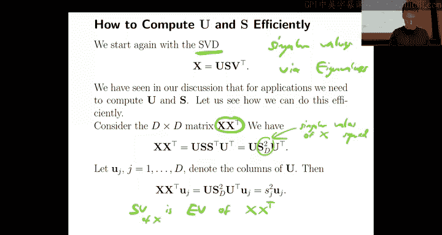

PCA因其概念清晰、实现简单且效果显著，仍然是探索性数据分析和预处理中不可或缺的工具。