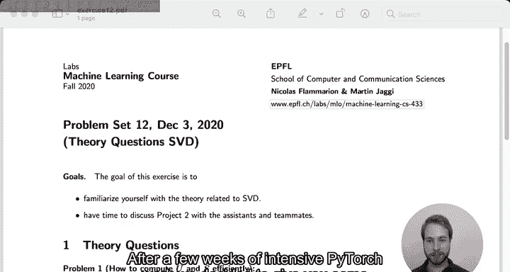
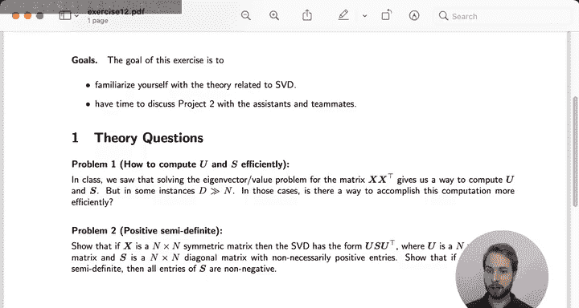
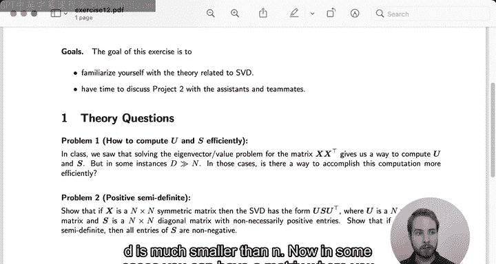
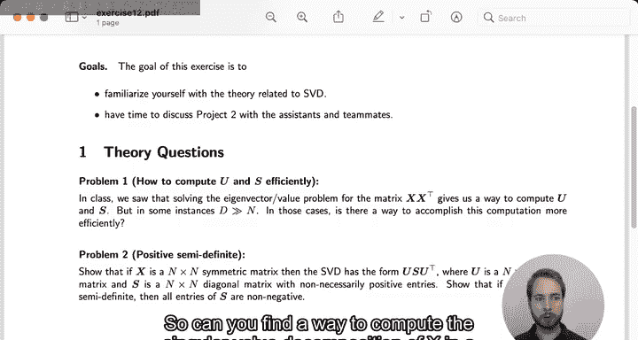
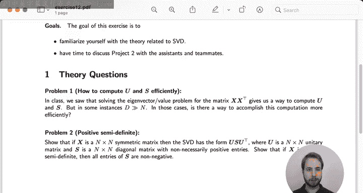

# 36：奇异值分解入门 🚀

在本节课中，我们将学习如何高效计算奇异值分解，并探讨对称矩阵情况下的特殊性质。课程包含两个理论练习，内容较为轻松，旨在为项目工作留出时间。

## 概述 📋

本周我们有两个理论练习。第一个练习讨论如何高效计算奇异值分解，特别是当特征维度远大于数据点数量时。第二个练习探讨对称矩阵的奇异值分解特性。

## 练习一：高效计算奇异值分解 ⚙️

上一节我们介绍了课程安排，本节中我们来看看第一个练习的具体内容。

当数据矩阵 **X** 的维度为 **D × N**（**D** 为特征维度，**N** 为数据点数量），且 **D** 远小于 **N** 时，我们可以通过计算 **X Xᵀ** 的特征值分解来高效获得奇异值分解，因为 **X Xᵀ** 的维度仅为 **D × D**。

然而，在某些情况下，特征数量可能远多于数据点数量（即 **D** 远大于 **N**）。第一个练习要求你找到一种解决方案，使得计算奇异值分解时不需要处理 **D × D** 的大矩阵，而是使用一个更小的矩阵。

以下是解决思路的关键点：
*   核心在于利用矩阵 **Xᵀ X**，其维度为 **N × N**。
*   当 **N** 远小于 **D** 时，计算 **Xᵀ X** 的特征值分解比直接计算 **X Xᵀ** 更高效。
*   通过 **Xᵀ X** 的特征向量可以构造出原始奇异值分解中的右奇异矩阵 **V**，并间接得到左奇异矩阵 **U**。

## 练习二：对称矩阵的奇异值分解 🔄

在了解了高效计算的一般方法后，本节我们来看看一种特殊矩阵——对称矩阵的奇异值分解有何独特之处。

任何矩阵 **X** 都有奇异值分解 **X = U S Vᵀ**，其中 **U** 和 **V** 通常是不同的矩阵。本练习要求证明：如果矩阵 **X** 是对称矩阵（因此也是方阵），那么 **U** 和 **V** 是相同的。

此外，练习的第二部分要求证明：如果 **X** 同时也是半正定矩阵，那么奇异值矩阵 **S** 对角线上的所有元素都是正数。

以下是一个解题提示：
*   可以从对称矩阵的性质入手，即满足 **X = Xᵀ**。
*   将这一性质代入奇异值分解的标准形式 **X = U S Vᵀ** 中，并与 **Xᵀ = V S Uᵀ** 进行比较。
*   结合正交矩阵的性质进行分析。

## 总结 🎯

本节课中我们一起学习了奇异值分解的两个重要理论练习。我们探讨了在特征维度与样本数量关系不同时，如何选择高效的计算路径。我们也分析了对称矩阵在奇异值分解中表现出的特殊性质，即其左右奇异矩阵相同。理解这些概念有助于在实际应用中更灵活、更高效地使用奇异值分解这一强大工具。

祝你好运，我们将在下周讨论练习的解答。