# 37：矩阵分解与推荐系统 🎬

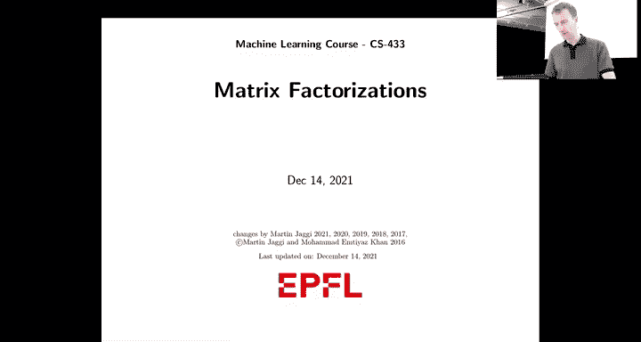

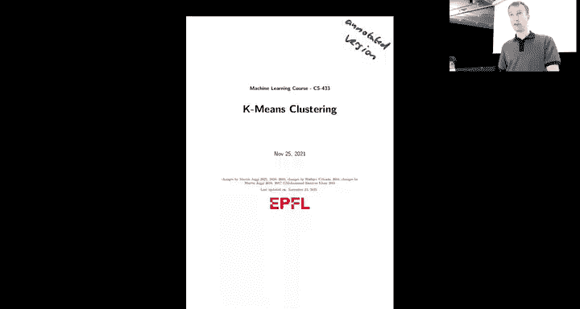

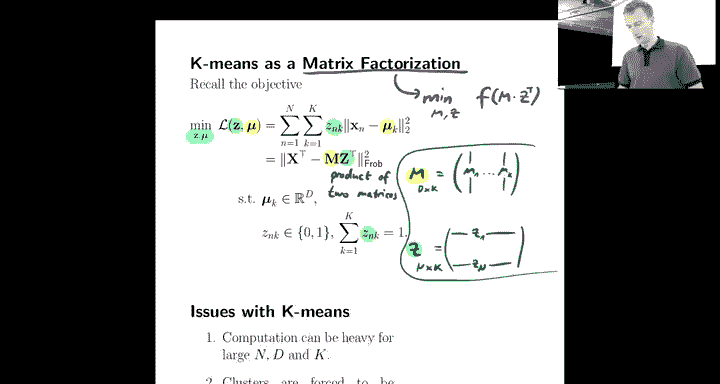

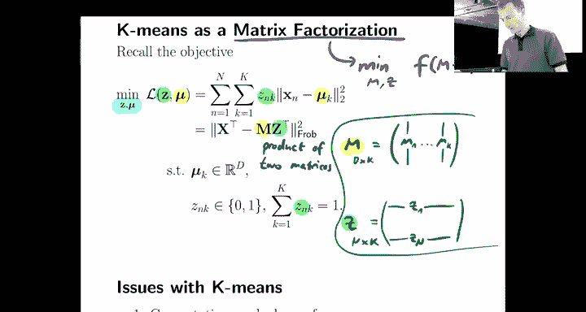

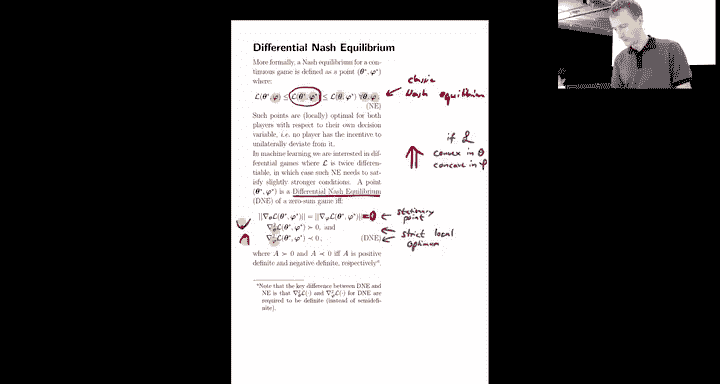

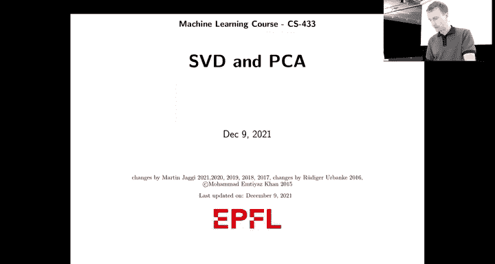

在本节课中，我们将要学习矩阵分解（Matrix Factorization）这一核心概念，并探讨其在推荐系统（Recommender Systems）中的具体应用。我们将从矩阵分解的一般形式出发，理解其如何将复杂问题转化为寻找两个较小矩阵的优化问题，并学习如何通过梯度下降等方法高效地求解。

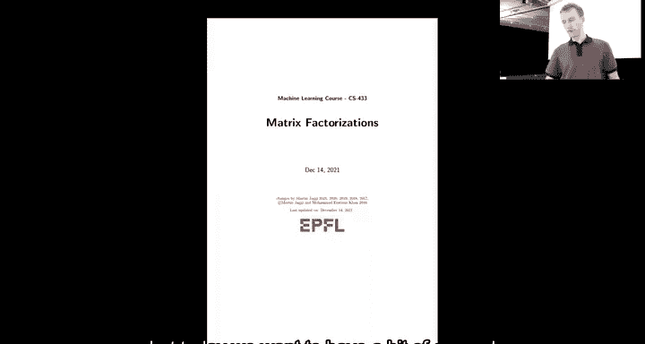

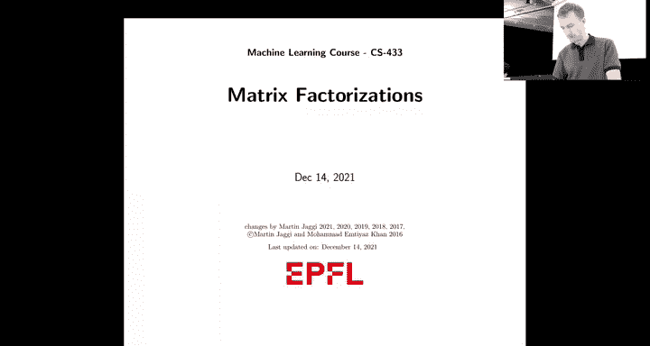

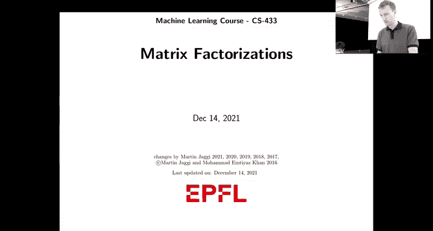

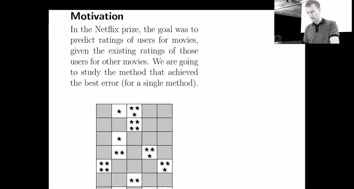

---

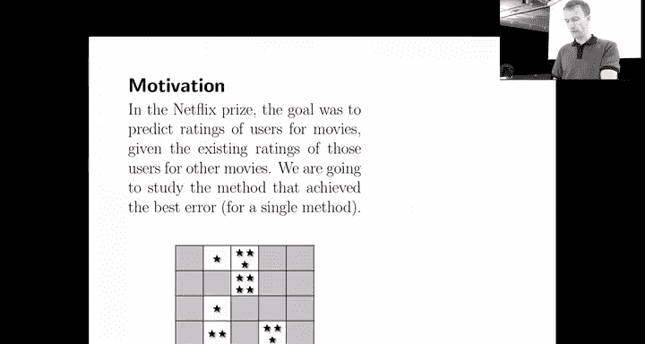

## 矩阵分解概述

在之前的课程中，我们已经见过几个矩阵分解的例子。

例如，K-Means 聚类算法可以看作是矩阵分解的一个特例。我们曾看到，K-Means 的目标可以被表述为寻找两个矩阵，使得它们最小化某个函数。这是一个典型的优化问题，属于矩阵分解的范畴。

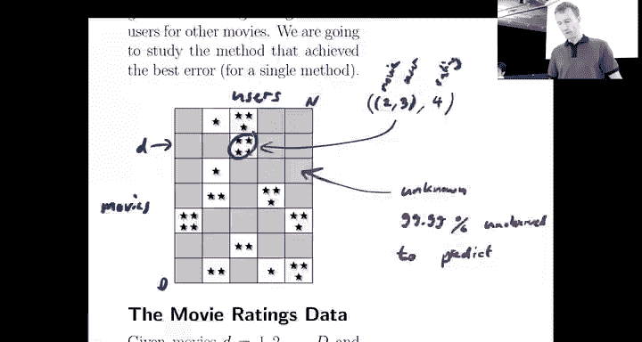

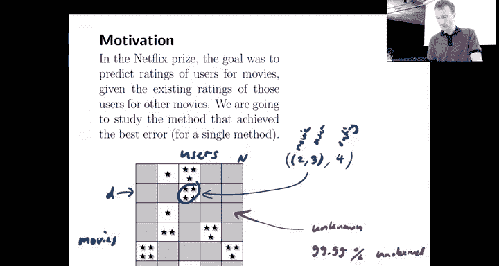

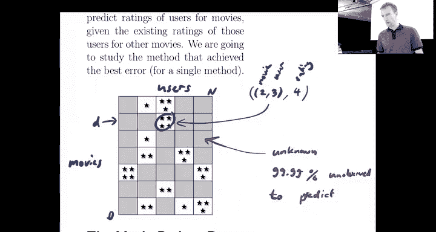

同样，主成分分析（PCA）也是矩阵分解的另一个例子。在上周课程的最后，我们了解到 PCA 也可以被视作一种矩阵分解。

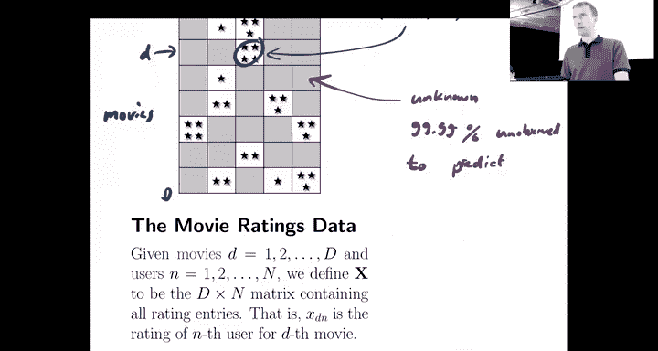

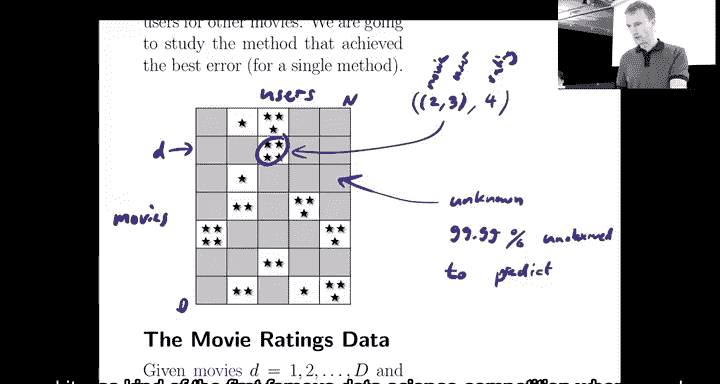

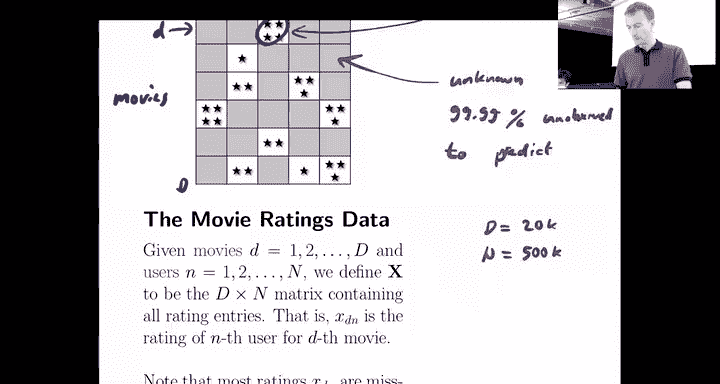

今天，我们希望从更一般的视角来看待矩阵分解，并讨论其在推荐系统中的应用，这可能是矩阵分解最著名的案例。本周四的课程将讨论文本表示学习，即如何为文本学习嵌入向量。

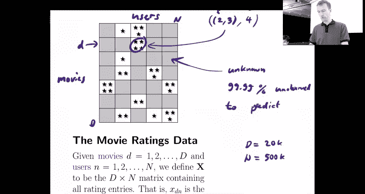

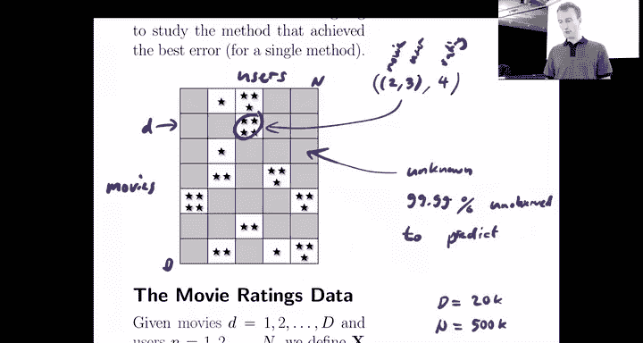

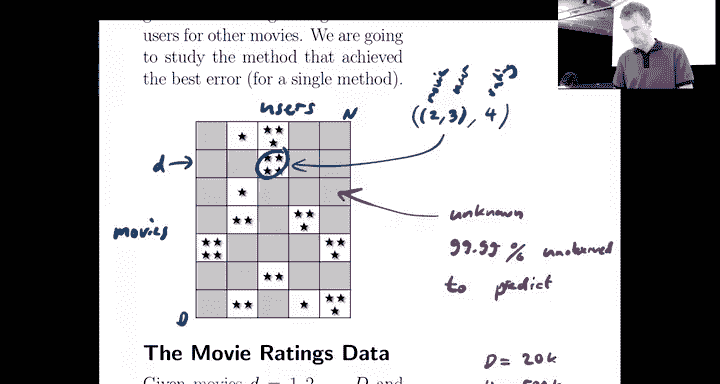

---

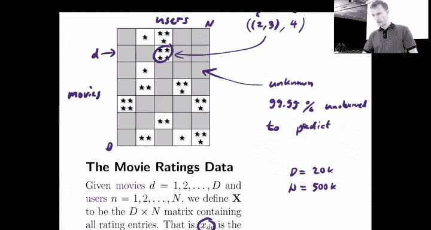

## 推荐系统动机 🎯

今天的动机来自于推荐系统。你可能已经听说过它，这是一个非常自然的场景。

例如，假设我们有 D 部电影和 N 个用户。我们希望研究用户的偏好，了解他们是否喜欢某些电影（也可以是商品或其他物品）。我们试图利用的数据是用户已经给出的一些偏好数据。

矩阵中的一个条目 `X_dn` 表示第 `n` 个用户给第 `d` 部电影打了 `4` 星。例如，在位置 `(2, 3)` 的评分是 `4`。这构成了一个用户-电影-评分的三元组。

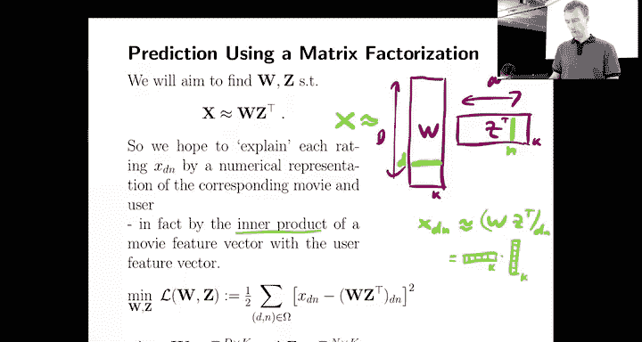

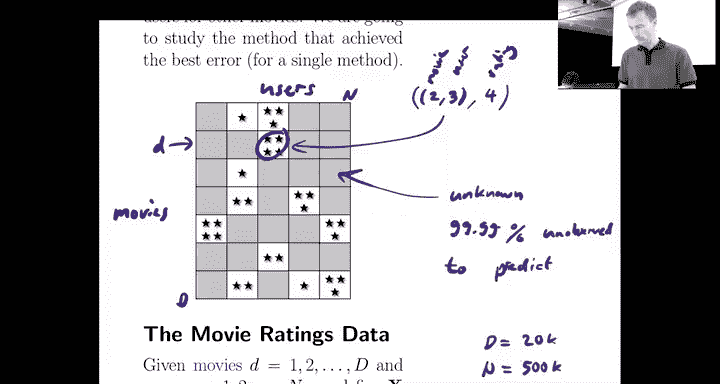

有趣的是，大部分数据实际上是缺失的（未观测到的）。图中所有灰色区域都是未知的。在我们的问题中，有大量的未知数据。任务正是预测这些未知数据。这就是我们今天要做的事情。

我们将看到，最自然的方法之一就是通过矩阵分解来实现。

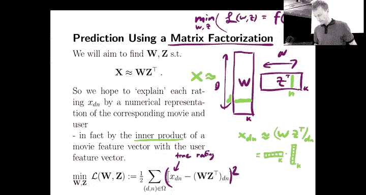

希望这个设定是清晰的。再次强调，大部分灰色条目是真正未知的，我们想要预测它们。也许 99% 以上的条目都是未观测到的。我们的目标是训练一个模型来填补这些缺失值，进行预测。

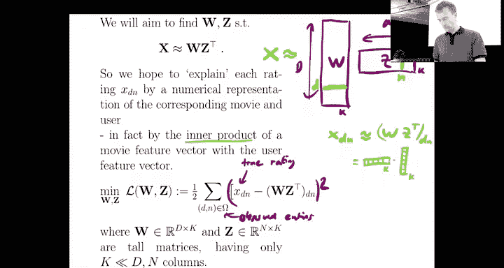

有很多方法可以做到这一点。例如，最简单的基线方法是取用户对该电影的平均评分，然后填充那些条目。当然，还有许多其他基线方法。

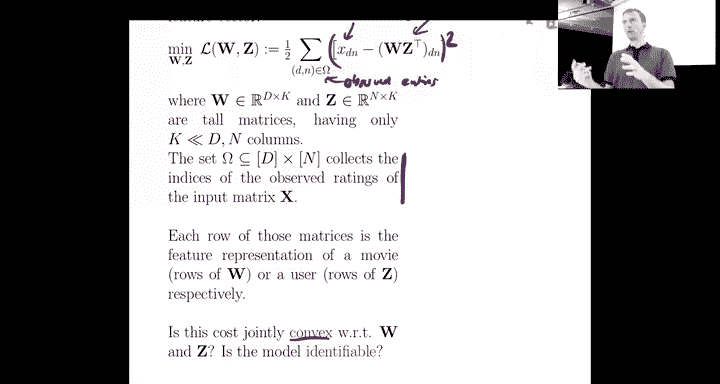

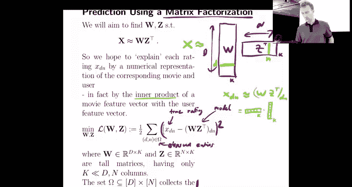

需要明确的是，这些缺失值不是零，而是我们对其值一无所知。

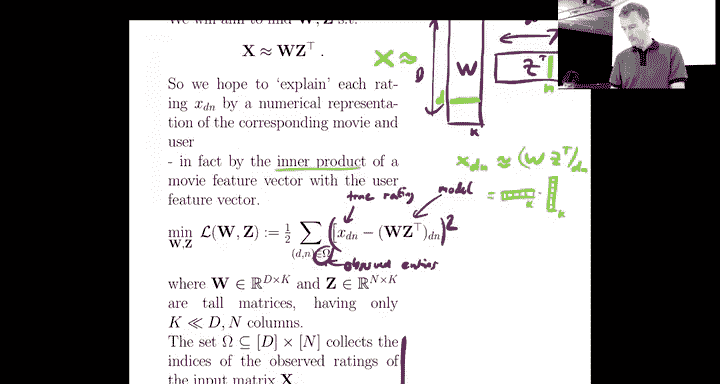

实际上，有一些不错的数据集，例如项目二中使用的数据集，它与 Netflix Prize 数据集相关。大约十年前，这是一个非常流行的竞赛，数千名参与者尝试了各种技巧来尽可能准确地填充这些数据，并尝试了所有可能的工程方法。这是第一个著名的数据科学竞赛。

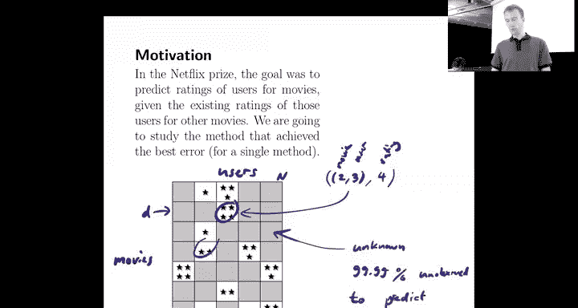

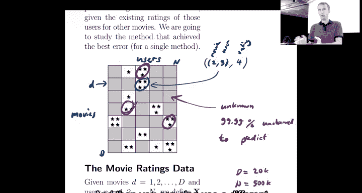

在那个案例中，大约有 20,000 部电影和 50 万用户。这个矩阵的绝大部分是未观测到的。此外，这个矩阵作为稠密矩阵存储会非常大，因此我们希望将其作为稀疏矩阵存储，只存储已知的条目，而对未知条目不做任何处理。

---

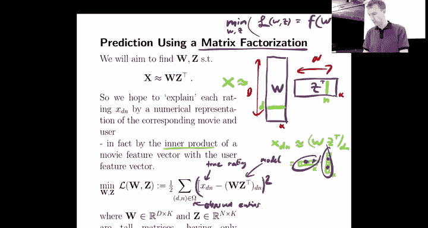

## 模型与损失函数

我们已经解释了所拥有的数据。条目 `X_dn` 表示用户 `n` 对电影 `d` 的评分，可能是 1 到 5 星。

我们能对此做什么呢？让我们尝试构建一个损失函数，以便训练一个模型，同时也构建模型本身。

我们将尝试使用两个小矩阵，并利用它们的乘积作为我们的模型。即尝试找到矩阵 **W** 和 **Z**，它们比较“小”（指列数较少）。例如，可能只有 `k` 列（一个很小的数字，比如 20 或 30）。这里 **W** 的维度是 `D x k`，**Z** 的维度是 `N x k`（`N` 是 50 万，`D` 是 2 万，都是非常大的维度，但内部维度 `k` 非常小）。

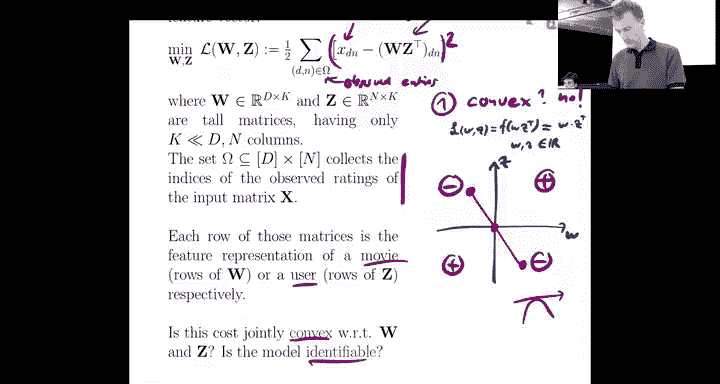

当我们相乘两个矩阵时，为了得到条目 `X_dn` 的近似值，我们取 **W** 的第 `d` 行与 **Z^T** 的第 `n` 列（即 **Z** 的第 `n` 行）的内积。我们希望这个内积能大致近似用户的评分。

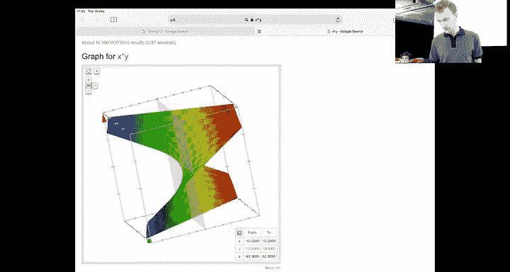

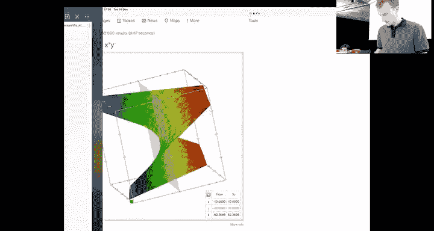

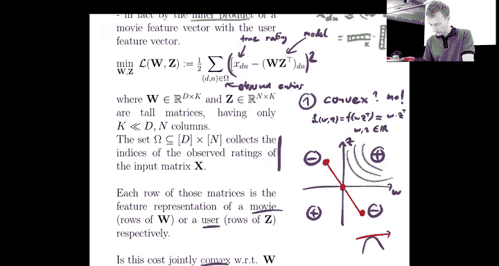

因此，我们的模型是：预测值 = **W** 的第 `d` 行 与 **Z** 的第 `n` 行 的内积。这很容易评估，因为它们只是 `k` 维向量，非常小，做预测非常高效。

如果我们有一个未知的电影-用户对（即我们从未见过这两个组合在一起），这就是我们进行预测的方式：只需将这两个向量的对应行相乘。

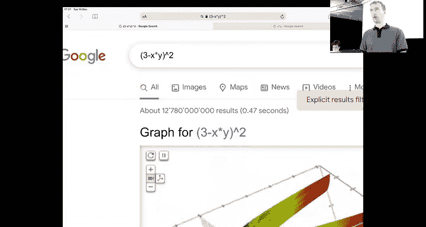

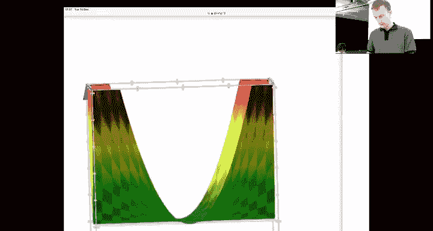

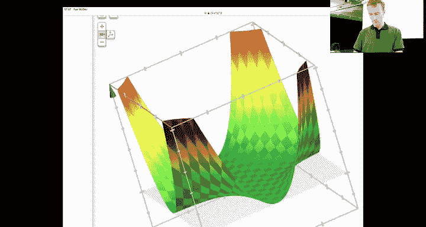

我们有了模型，接下来还需要一个损失函数。这由你选择。我们将为整个矩阵的每个条目定义一个损失，然后对所有条目求和。但训练损失只针对观测到的条目。

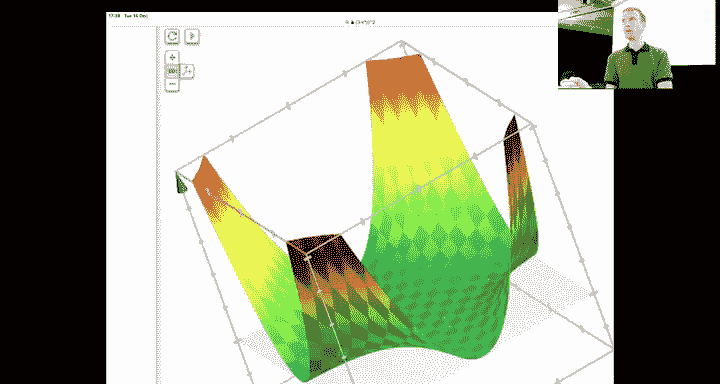

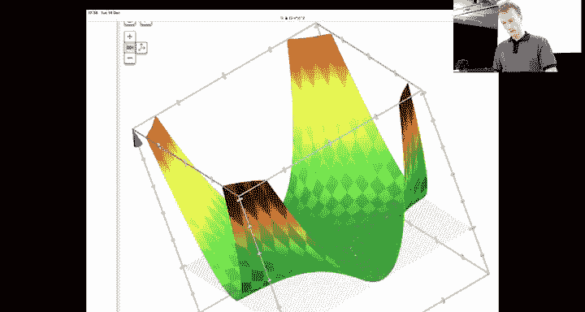

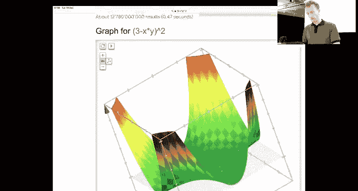

损失函数将我们的模型预测值与真实值（标签或 1 到 5 星的评分）进行比较。最简单的做法是使用平方损失，但你也可以使用绝对损失等。最近的一些工作尝试使用绝对损失，因为它更鲁棒。

这里要记住的一般原则是：当我们说矩阵分解时，正如我们所说，指的是我们最小化某个函数。损失函数依赖于两个矩阵，但这里的性质是，我们的损失函数实际上只依赖于这两个矩阵的乘积 **W Z^T**。

任何形式为 `F(W Z^T)` 的函数，当我们通过最小化 **W** 和 **Z** 来训练时，我们称之为矩阵分解。在这里，`F` 的作用是：它接受这些预测条目，并将它们与真实评分进行比较，并且只对观测到的 `(n, d)` 对求和。

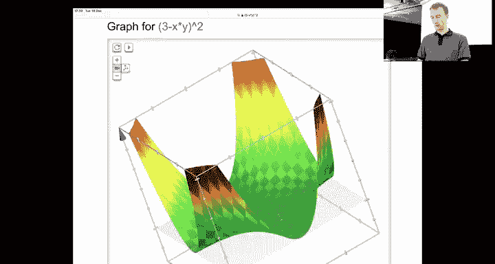

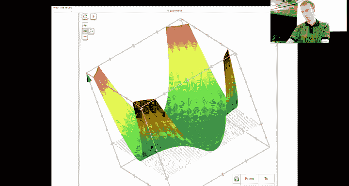

现在我们有了损失函数和模型。接下来只需运行梯度下降，这基本上就是全部内容。我们将更详细地讨论如何高效地实现。

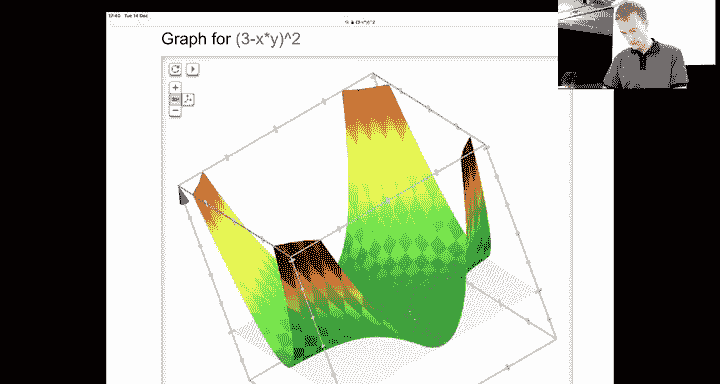

请确保你理解了模型和损失函数的结构：
*   模型就是 **W Z^T**。
*   Ω 是观测到的条目集合。

损失函数看起来相当简单，只是平方损失，乘积也很简单。看起来不错。

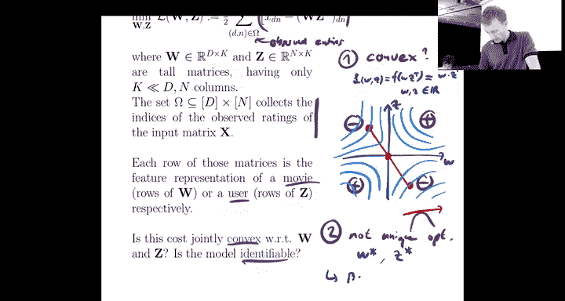

现在，你可能会问，这是一个容易解决的问题吗？它复杂吗？也许你们中有些人已经有预感了。

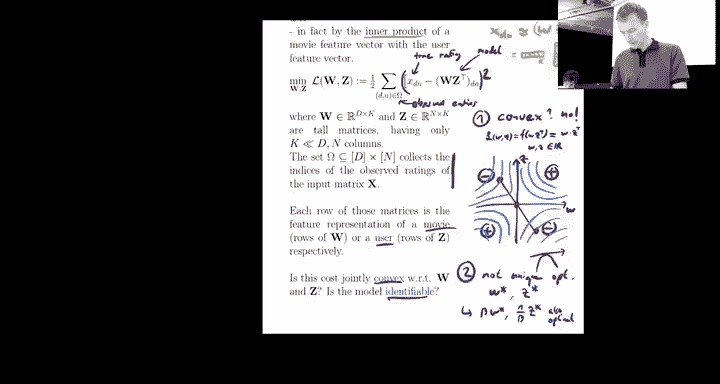

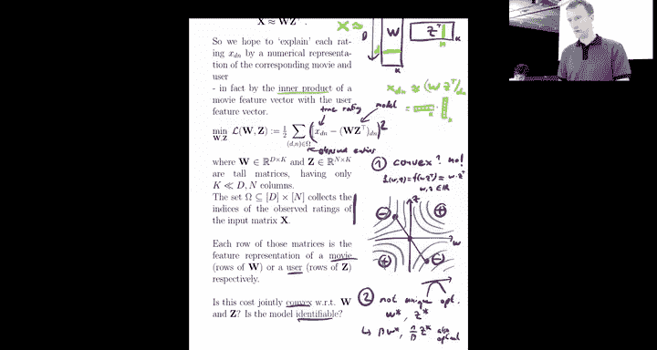

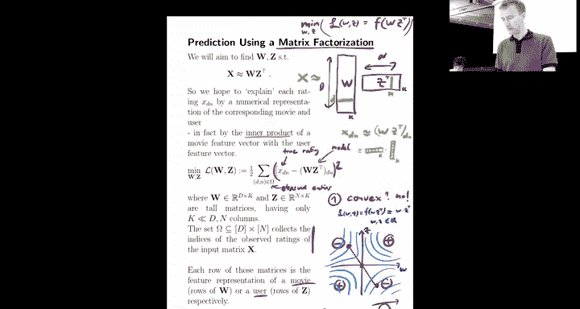

---

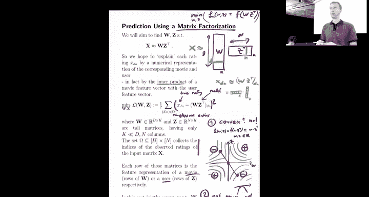

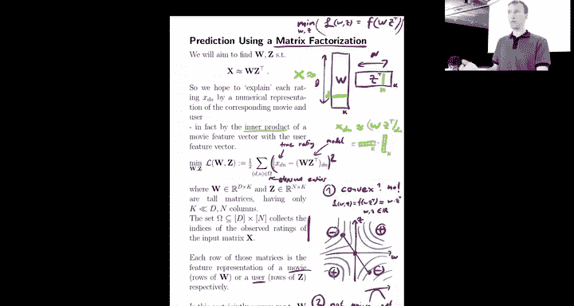


## 模型特性与挑战


### 问题一：非凸性


第一个问题是，这个优化问题**不是凸的**。我们已经多次见过类似的非凸函数。


一个简单的例子是，如果矩阵小到只是一个数字（1x1 矩阵），那么函数 `F(W, Z) = W * Z`（我们损失函数的简化版）的图像是怎样的？函数 `W * Z` 的图像是一个鞍形曲面，这证明它是一个非凸函数。


当然，我们实际的损失函数是 `(真实评分 - W*Z)^2`。即使加上平方，它仍然是非凸的。例如，函数 `(3 - x*y)^2` 的图像虽然看起来顶部弯曲，似乎有点像凸函数，但如果你取两个点并画一条线，会发现函数值在线段中间可能高于端点，这违反了凸函数的定义。


因此，这仍然是一个非凸函数。但它是一个不错的函数，类似于凸函数。最近的一些研究甚至表明，像这样的矩阵分解问题没有严格的局部最小值。例如，这个函数是星形凸的，意味着从最优点到任何其他点的连线上，函数表现良好。


从任何局部最小值都可以连接到全局最小值（可能有很多全局最小值，但它们都是连通的）。如果你找到了其中一个，那就没问题了。


这是一个非常有趣的问题类别。对于如此简单的函数，它具有相当丰富的结构，目前仍然是开放的研究课题。


不过，非凸性并不会太吓到我们，因为我们无论如何都会应用基于梯度的方法来交替优化 **W** 和 **Z**。


### 问题二：可识别性


第二个方面是**可识别性**。解不是唯一的，意味着存在多个最优解。


为什么？如果我给你一个最优解 **W** 和 **Z**，你能给出另一个不同的矩阵对仍然是最优的吗？当然可以。例如，你可以将 **W** 乘以一个标量 `β`，同时将 **Z** 乘以 `1/β`，乘积不变，所以这也是最优解。或者，如果维度相同，可以交换它们的位置。甚至同时改变两者的符号。


因此，存在许多最优解。这很有趣，但不一定是个大问题，但意识到这一点是好的。


---


## 矩阵分解的一般概念

我们在这里所做的相当重要，因为它不仅适用于推荐系统，而且更通用。我们将其应用于任何形式为 `F(W Z^T)` 的结构。任何关于矩阵乘积的函数都可以。

因此，我们在这里讨论的内容也可以用于 K-Means、PCA 或周四将要学习的词嵌入等应用。有很多应用场景。


但对于推荐系统，问题又来了：如何选择 `k`？同样，不幸的是，我没有完美的答案。这很棘手，取决于具体情况。


这又是一个权衡。如果你将 `k` 设置得非常大，那么很容易过拟合。如果 `k` 大于 `N` 和 `D`，那么你可以简单地将 **W** 设为单位矩阵，将 **Z** 设为 **X**，这样乘积完全等于 **X**，训练误差为零。但这可能没有意义，因为你很容易得到零训练误差，意味着对所有观测条目都有完美预测，但这并不总是有用的。


关键不仅在于拟合观测到的条目，还在于拥有一个能够预测未知条目的模型。为此，你可能需要一个单独的测试集来检查泛化能力。

因此，我们通常面临这种权衡：训练误差和泛化能力。我们是否在测试集上表现良好？我们是否在训练集上过拟合？


如果 `k` 太大，我们会过拟合。如果 `k` 太小，我们会欠拟合。

这里有一个 `k=2` 的例子。这展示了电影矩阵 **W**。每一行是一个电影向量（因为 `k=2`，所以是二维的）。图中显示了这些电影向量的位置。在训练之后，你可以看到所有电影的位置。这会是一个有趣的电影嵌入吗？

实际上，它效果很好。相似的电影被分组在一起。它们具有相似的特征。同样，这些特征不是手工制作的，而是学习得到的特征。这很好。

右边的图显示了稍微不同的分解（可能使用了 PCA）。他们学习了具有平方损失的分解，然后获得了这些电影的嵌入。你可以看到，许多有点相似的电影确实被分组在一起。

有趣的是，这个方法对电影一无所知。它只知道你给了多少颗星。这里没有使用任何附加信息。没有关于用户的附加信息，也没有关于电影的附加信息。系统仅直接从给出的星级中学习。

那么，如何选择 `k`？有点像在 K-Means 中。我们需要做出折衷。实际上，这里更简单：我们可以说最好的 `k` 是能给你最佳测试误差的那个。如果你有一个单独的测试集，那么你可以用它来选择 `k`，或者甚至用一个单独的验证集来寻找 `k`。一旦你获得了最佳的预测质量，就使用那个 `k`。

---

## 正则化与优化

我们讨论了一点欠拟合和过拟合。小的 `k` 会导致欠拟合。另一个情况很清楚，如果过拟合，你可以减小 `k`。或者，如果你不想减小 `k`，那么你可以做另一件事：使用正则化。

如果我们再次看这个损失函数，我们添加了正则化项。通常是 Frobenius 范数（即各元素平方和）。我们希望这些矩阵的范数不要太大。然后，我们还需要讨论这个权衡参数，需要选择它对我们有多重要。如果你正则化，这是另一个限制模型复杂度、防止过拟合的机会。

你只需将损失函数修改为原始损失加上正则化项的和。


---


## 优化方法：随机梯度下降


接下来我们应该讨论一下如何优化它。像往常一样，将是随机梯度下降。这很标准，没什么大惊喜。但也许很有趣的是它的计算成本，因为这些矩阵非常巨大（可能是百万乘以百万）。因此，算法的每一步最好比处理整个矩阵更便宜。这是我们希望实现的目标。


让我们看看在使用 SGD 时是否如此。为了运行 SGD，我们总是需要某种结构化的目标函数。是的，我们有。


你甚至可以除以观测条目数来归一化，以表明你的目标函数是平均值，但这只是形式上的。在训练中，你可以选择是否归一化，因为解是相同的。

为了运行随机梯度下降，我们均匀地采样一个观测到的条目（随机采样）。然后我们有一个用户 `n` 和电影 `d`。现在我们需要计算那个小部分的梯度。我们需要计算关于整个参数 **W** 和 **Z** 的梯度。

**W** 的梯度是一个大小为 `D x k` 的矩阵，**Z** 的梯度是 `N x k`。让我们看看是否能计算它们。这并不难，你需要使用链式法则等。我们将计算这个内积的梯度。


这听起来有点吓人，因为我们说过希望有非常廉价、不依赖于整个矩阵的操作。休息之后，我们将看到计算这一个条目的梯度需要什么信息，计算复杂度如何。我们会看到情况并不坏，然后我将展示公式。


---


## 梯度计算详解


回到我们学习这两个矩阵的方法。我们将其表述为一个优化问题：我们想最小化某个损失，找到最好的电影矩阵 **W** 和用户矩阵 **Z**。我们想找到最好的特征，并完全从头开始学习它们，不使用任何附加信息。这是优化方法。


但还有另一种方法：在左图中，这些特征是硬编码的。例如，如果主角是男性或女性，你就放入 1 或 -1。这是一种你也可以使用的方法，利用关于用户或电影的专家信息。但真正酷的是学习它们，这就是我们在这里所做的。我们还看到，学习方法具有更好的泛化能力，因为如果你只是手工制作一些东西，你总会忘记一些不直接、不完全明显的维度或方面。


因此，左边的方法不是机器学习，右边的方法是机器学习方法。当我们将其定义为优化问题并使用基于梯度的工具求解时，这就是我们的下一个任务：讨论有哪些算法可用来找到最好的 **W** 和 **Z**。

这相当直接。唯一不平凡的事情是实际计算这个梯度，计算和函数中某一部分关于用户矩阵或电影矩阵的梯度。


首先，我想计算关于电影矩阵 **W** 的梯度，然后再展示关于用户矩阵 **Z** 的梯度。


对于 **W**，我们只有一个函数（我们观测到了一个评分）。对于这个函数，我们想计算 `F_dn` 的梯度。现在 `d` 和 `n` 是固定的（一个特定的用户-电影对）。但你要问的是整个 **W** 的梯度。即使 `F_dn` 只是一个条目，关于 **W** 的整个梯度仍然是一个矩阵。

所以我们需要询问 **W** 的所有条目。我需要给它们起一些名字。**W** 是一个 `D x k` 矩阵。我可以询问第 `d'` 行第 `k` 列的条目（`d` 已经被使用了，所以我引入 `d'` 来命名 **W** 的条目）。

对于一个参数 `W_{d'k}`，我的损失函数在这个参数上变化有多快？这就是我们要计算的。


损失函数是一个数字。梯度是关于 `d'` 和 `k` 的。对于这一个样本观测的绿色损失函数。

需要小心：绿色的 `d` 是固定的，黄色的 `d'` 是变量，我们询问所有可能的值。

结果已经在这里了。现在我们需要看看。我们询问 **W** 的第 `d'` 行第 `k` 列的条目，你可以想象它在矩阵中的某个位置。行是 `d'`。我们问，这一行如何影响这个损失？答案是，它根本不影响，除非你碰巧问到的行正是我们选择的 `d`。


任何其他 **W** 的行对 `(d, n)` 的预测都没有影响。只有电影 `d` 的那一行有影响。如果 `d'` 等于 `d`，那么就有梯度。然后很容易看出梯度是什么：这一行与 **Z** 的某一行相乘，然后取平方。计算它的梯度并不难。

对于我们的目的，**Z** 是固定的。发生的情况只是 **W** 的这一行与 **Z** 的那一行相乘。这个的梯度实际上是 **Z** 的第 `n` 行第 `k` 列的条目（`Z_{nk}`）。然后，因为外面有平方，平方的导数会消去 1/2，剩下预测误差（真实值减去预测值）。所以梯度是 `(真实值 - 预测值) * Z_{nk}`。


这计算起来非常廉价。例如，`X` 是星数（离散值 1, 2, 3, 4, 5）。模型预测是电影行与用户行的内积，这计算成本很低，因为只涉及特定的 `d` 和 `n`。我只需取用户行乘以电影行，这花费 `k` 次操作。然后我乘以这个数字。这看起来是一个非常廉价的操作。


这只是矩阵的一个条目。其他所有条目都是零（如果你问的是错误的行）。如果我们对所有条目都这样做，我们基本上就完成了计算。这个梯度实际上只有一行是非零的（第 `d` 行）。这个梯度矩阵非常稀疏，我们甚至不需要存储整个东西，只需要存储那一行。


计算它的成本是：我需要计算预测，这需要 `k` 次操作（两个 `k` 维向量的内积）。然后对于每个 `k`，用户向量有一个不同的条目，需要与 `(真实值 - 预测值)` 相乘。所以成本大约是 `k` 次乘法和 `k` 次加法，非常廉价，是 `O(k)` 的复杂度。


`D` 和 `N` 可能非常巨大（百万级），但 `k` 很小（在 Netflix Prize 中，最佳结果大约是 `k=30`）。与 50 万用户相比，这是一个非常小的数字。因此，你可以以非常低的成本计算一个随机梯度。有了梯度，我们就可以执行一步更新。

对于用户矩阵 **Z** 的梯度，故事完全相同。同样，它只对应用户 `n` 的那一行是非零的。其他所有用户对 `n` 的预测没有贡献，因此它们不会出现在梯度中，我们也不需要存储。

用户矩阵 **W** 是电影矩阵或项目矩阵。当然，这不仅限于电影。推荐系统可用于任何应用，例如广告投放。你也可以使用这种方法为每个用户学习一个特征向量，为每个广告学习一个特征向量。有时也会与附加信息结合，但这里没有使用关于用户或电影的信息，只是学习了分解。


如果你想使用附加信息，那也很有趣。你可以将已有的关于用户的硬编码信息连接起来。然后，你可以学习与这些硬编码信息一起工作的附加部分。同样，你也可以添加关于电影的硬编码信息。这是一种结合现有关于用户或电影的附加信息与学习特征的好方法。


我们很高兴可以使用随机梯度下降，每一步的成本非常低。我们必须运行很多步。你只需遍历你的数据集。在实践中，人们通常取整个观测训练集的一个随机排列，然后遍历它，就像在分类器或回归中使用 SGD 一样。遍历所有训练样本一次称为一个周期。然后你可以继续，直到你对测试准确率满意为止。

关于这个算法的妙处在于它如此廉价，而且我们执行的每一步都比任何矩阵操作便宜得多，因为这是一个矩阵问题，但执行一步我们只需要向量操作，极其廉价。


这在其他方法中并不常见。即使在 K-Means 中，一次迭代也需要处理所有数据。但在这里，我们执行