# 38：文本表示学习与词向量 🧠

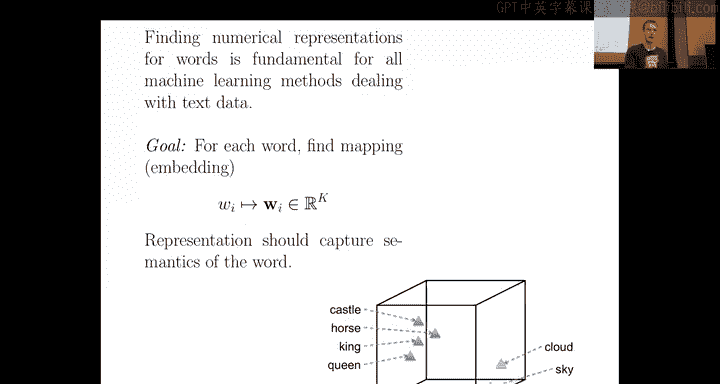

在本节课中，我们将要学习如何将文本数据（特别是单词）转换为数值特征，以便机器学习模型能够处理。我们将从最简单的方法开始，逐步深入到更先进、更智能的表示学习方法，例如矩阵分解和对比学习。

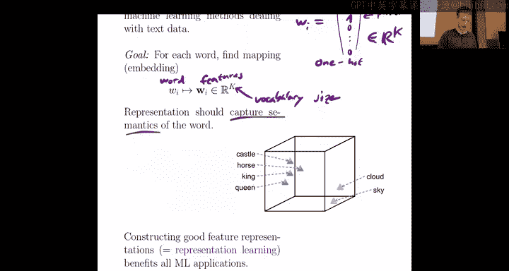

---

### 从单词到特征：目标与挑战

我们的目标是将单词转换为数值特征。例如，英语中可能有数百万个单词，但常用的可能只有一两万个。我们希望为每个单词找到一个实数表示，通常包含 K 个特征。

以下是实现此目标的几种方法。

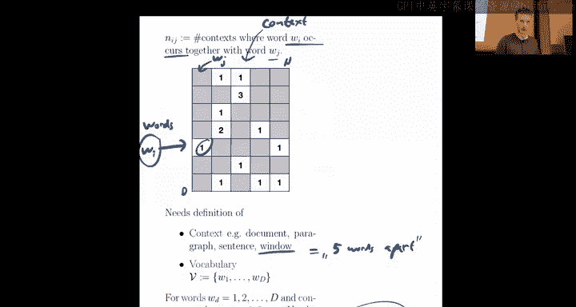

#### 独热编码与词袋模型

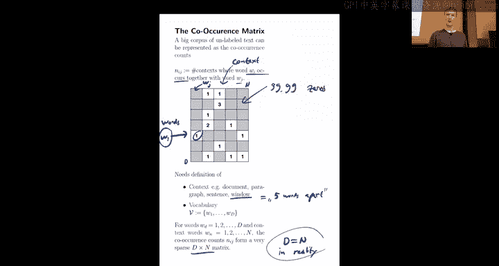

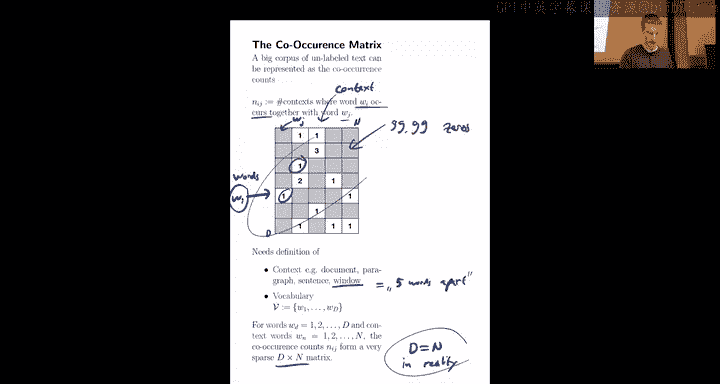

最简单的方法是使用**独热编码**。这意味着将第 i 个单词 `w_i` 映射为一个向量，该向量仅在单词出现的位置为 1，其他位置为 0。

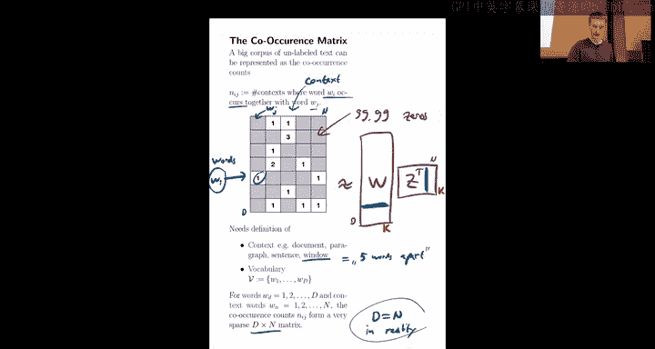

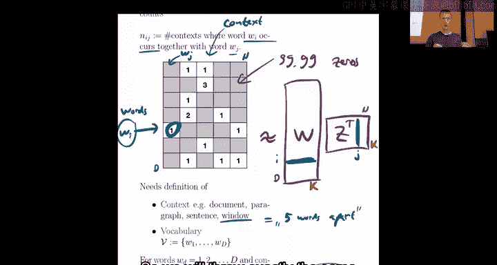

**公式**：
`w_i = [0, ..., 1, ..., 0]`，其中 1 位于第 i 位。

如果词汇表大小为 V，那么这个向量就是 V 维的。这种方法也被称为**词袋模型**表示。当处理包含多个单词的句子时，只需将所有出现单词对应的位置设为 1，忽略单词的顺序。

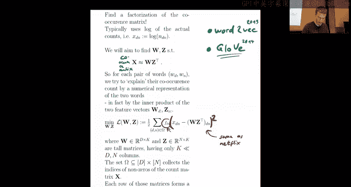

然而，这种方法有明显的缺点：
1.  **特征维度极高**：如果词汇表很大，向量维度会非常高，导致计算和存储成本巨大。
2.  **缺乏语义信息**：每个单词的向量都是完全独立的。例如，一个单词的单数和复数形式会被视为两个完全不同的向量，模型无法捕捉它们之间的任何关联。

因此，我们期望找到更好的特征表示，使得**语义相似的单词具有相似的特征向量**。这就是表示学习的目标。

---

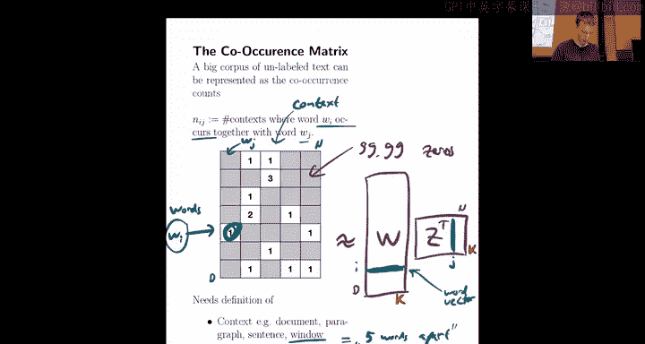

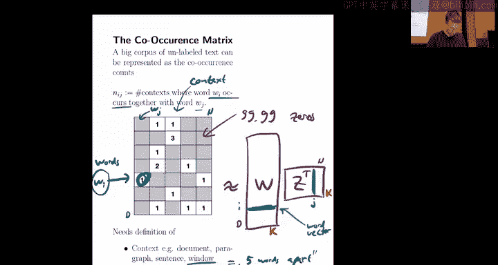

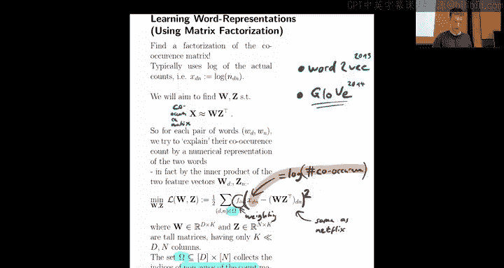

### 更好的特征：矩阵分解方法

上一节我们介绍了基础的词袋模型，本节中我们来看看如何通过矩阵分解来学习更优的词向量。

我们可以利用一个非常简单的无监督数据源：**共现矩阵**。这个矩阵 `X` 的每个元素 `X_ij` 记录了单词 `i` 和单词 `j` 在文本中（例如，在一个固定大小的窗口内）一起出现的次数。

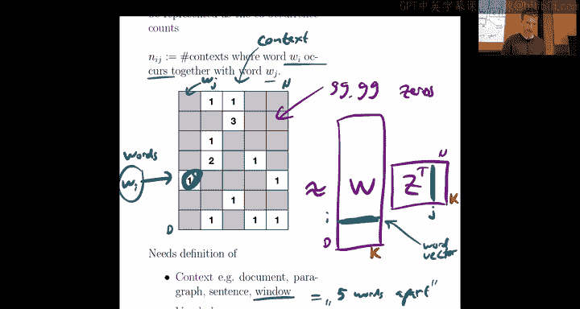

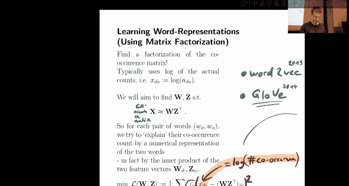

**核心思想**：这个共现矩阵的结构，与我们之前在推荐系统中遇到的用户-物品评分矩阵非常相似。

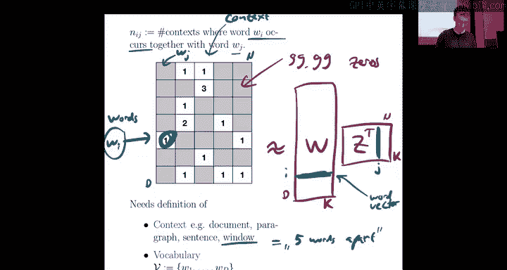

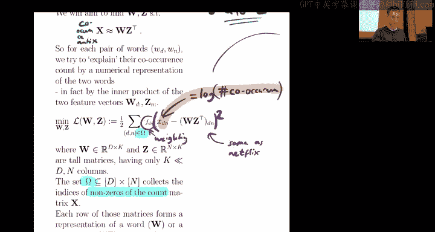

因此，我们可以采用类似的**矩阵分解**方法。我们将庞大的共现矩阵 `X`（大小为 `V x V`）分解为两个小得多的矩阵的乘积：

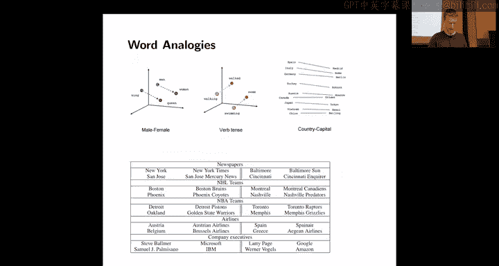

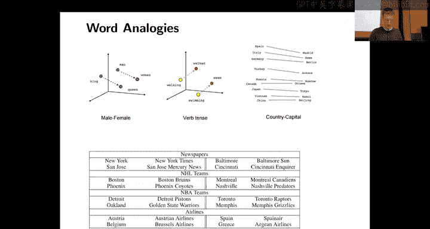

**公式**：
`X ≈ W * Z^T`

其中：
*   `W` 是 `V x K` 的矩阵，它的每一行就是对应单词的 **K 维词向量**。
*   `Z` 是 `V x K` 的矩阵，可以理解为“上下文词”的向量表示。
*   `K` 是我们选择的特征数量（例如 50 或 100），远小于词汇表大小 `V`。

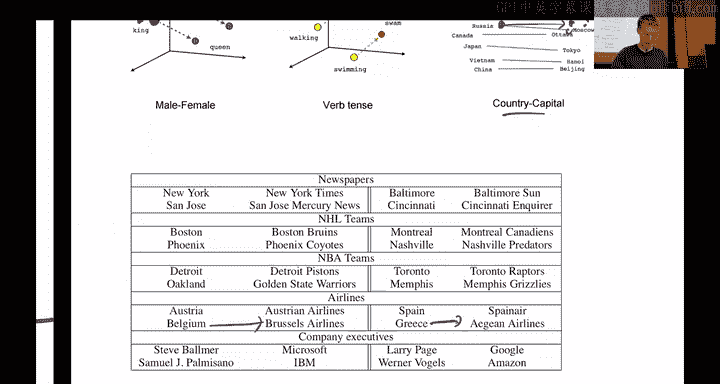

我们的优化目标是让 `W` 的第 i 行和 `Z` 的第 j 行的内积，尽可能接近共现矩阵中的值 `X_ij`。通过优化这个目标（例如使用平方损失函数），我们就能学习到有意义的词向量 `W`。

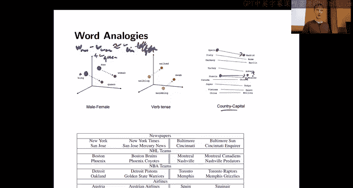

这种方法就是 **GloVe** 模型的核心。与推荐系统一样，我们可以使用随机梯度下降来高效地训练这个模型。

**GloVe 的细节调整**：
*   **输入数据**：通常使用共现次数的对数 `log(X_ij + 1)`，而不是原始计数，以平滑极端值的影响。
*   **加权函数**：损失函数中引入了一个加权项 `f(X_ij)`，用于平衡常见共现和罕见共现的重要性，避免模型被高频词对主导。

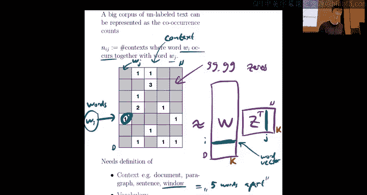

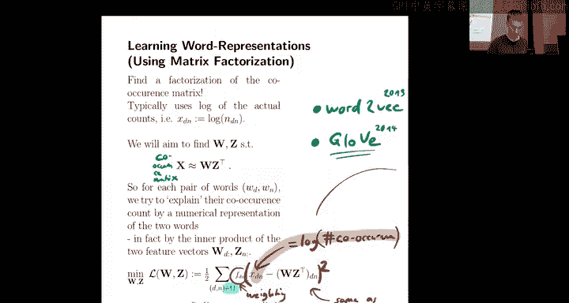

通过这种方式学习到的词向量，能够将语义信息编码到低维空间中。

---

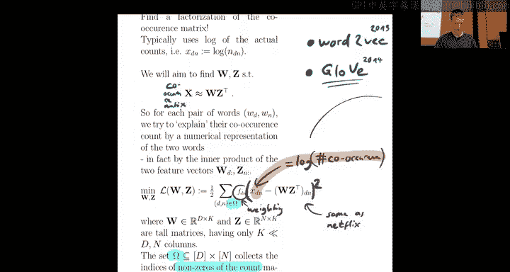

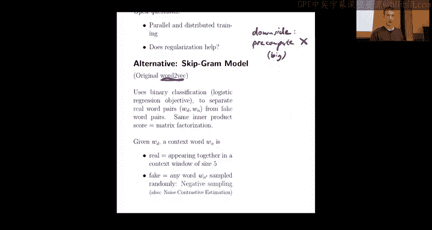

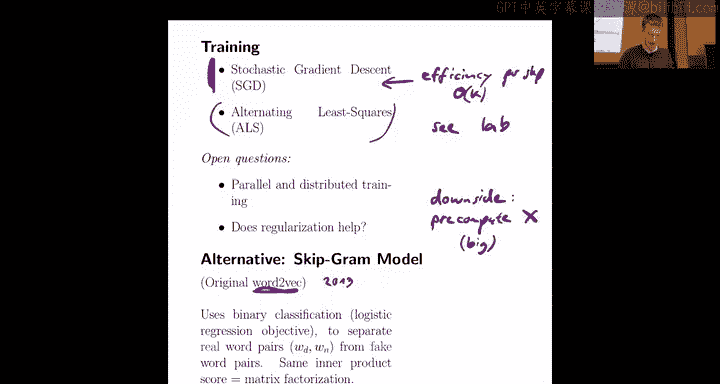

### 词向量的神奇之处：语义与类比

学习到的词向量有什么用？为什么它们比词袋模型更好？

词向量在低维空间中编码了丰富的语义关系：
1.  **相似性**：语义相近的单词（如“猫”和“狗”）在向量空间中位置接近。
2.  **类比关系**：词向量空间中的方向可以对应某种语义关系。经典的例子是：
    **公式**：`vec(“king”) - vec(“man”) + vec(“woman”) ≈ vec(“queen”)`
    这意味着“国王”与“男人”的向量差（可能代表“王室”属性），加上“女人”的向量，结果会非常接近“女王”的向量。类似地，`vec(“Paris”) - vec(“France”) + vec(“Germany”) ≈ vec(“Berlin”)`。

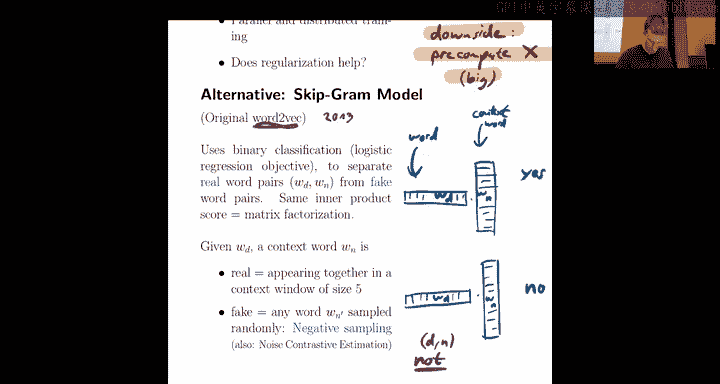

这些特性使得词向量可以用于信息检索（寻找相似词）或作为更复杂自然语言处理任务的优质特征输入。

---

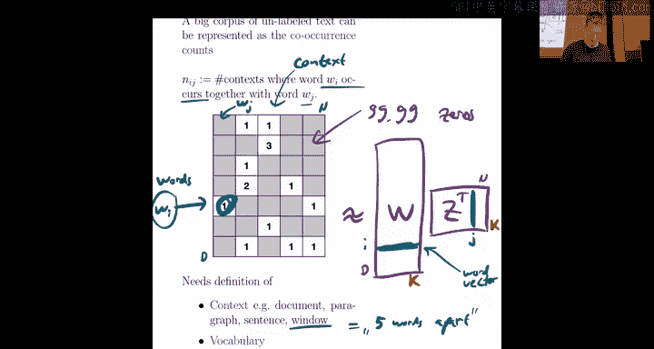

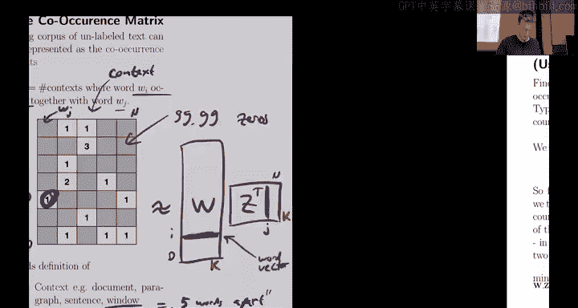

### 更高效的算法：Word2Vec 与对比学习

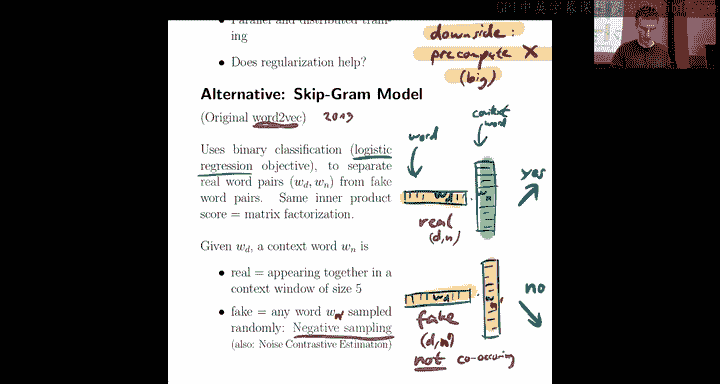

虽然 GloVe 很有效，但它需要预先计算并存储庞大的共现矩阵。本节中我们来看看 **Word2Vec** 模型，它通过流式处理文本避免了这个问题。

Word2Vec 的核心思想是**对比学习**。它不再预测共现次数，而是训练一个二分类器来区分“真实”的单词对和“虚假”的单词对。
*   **正样本**：从真实文本中连续出现的单词对（如“人工智能”）。
*   **负样本**：将一个正样本中的上下文词替换为随机选择的单词（如“人工智能”和“香蕉”），构成虚假的单词对。

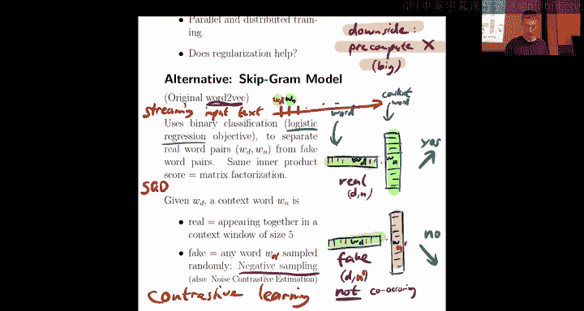

模型为每个单词学习两个向量：一个作为中心词向量，一个作为上下文词向量。训练目标是让正样本的内积得分高，负样本的内积得分低（例如使用逻辑损失函数）。

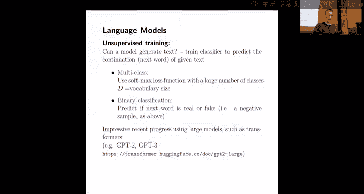

**关键优势**：Word2Vec 可以**流式训练**。它不需要预先计算任何矩阵，只需顺序读取文本，为每个出现的单词对及其随机负样本执行一次 SGD 更新，极其高效。

这种“利用共同出现作为学习信号”的思想非常强大，可以推广到其他领域，如图像或推荐系统，形成了**对比学习**范式。

---

### 超越单词：句子与文档表示

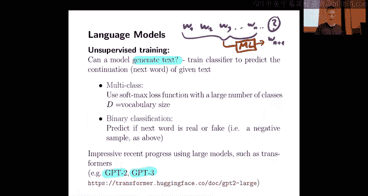

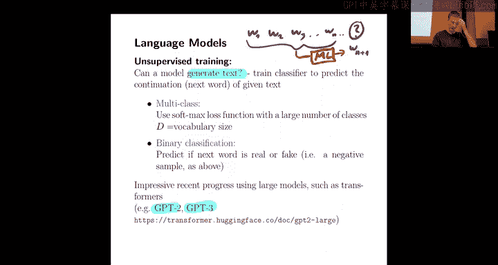

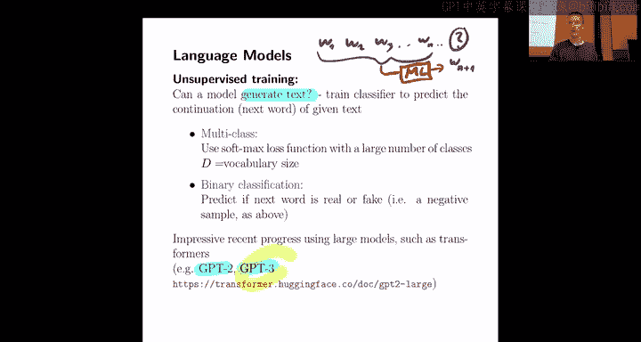

到目前为止，我们主要关注单词的表示。但在实际应用中，我们常常需要处理整个句子或段落。本节中我们来看看如何获得更长文本的表示。

**简单方法**：平均词向量。将一个句子中所有单词的向量取平均，作为句子的表示。这种方法简单有效，但信息有损失。

**语言模型方法**：训练一个模型来预测文本序列中的下一个词（或遮盖的词）。这类模型（如 GPT、BERT）在大量文本上训练后，其内部激活（尤其是最后几层的输出）可以作为整个输入序列的**高质量上下文感知特征**。同时，这些模型也具备了强大的文本生成能力。

**卷积神经网络方法**：对于句子分类等任务，可以将句子中每个单词的词向量拼接成一个矩阵，然后使用一维卷积核在“词维度”上进行滑动，提取局部特征，再通过池化层得到固定长度的句子表示。

**FastText 方法**：这是一个简单高效的句子分类模型。它将句子表示为词袋模型，然后学习一个**词嵌入矩阵**和一个**线性分类器**。
1.  句子通过词袋向量表示。
2.  词袋向量与词嵌入矩阵相乘，得到句子中所有单词向量的**平均**（即句子向量）。
3.  句子向量再通过线性分类器得到预测结果。

**公式**：`y_pred = W * (1/N * ∑ Z_i)`，其中 `Z_i` 是句子中第 i 个单词的嵌入向量。

其巧妙之处在于，词嵌入矩阵 `Z` 和分类器 `W` 是**联合学习**的。这使得词向量被训练成“适合相加”的形式，从而得到的句子表示比简单地平均预训练词向量更优。训练同样可以通过 SGD 高效完成。

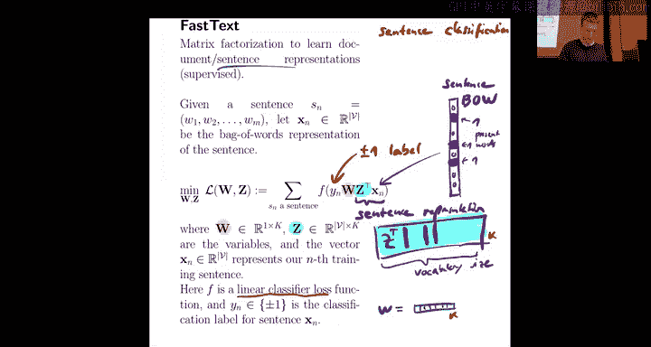

---

### 总结与回顾

本节课中我们一起学习了文本表示学习的核心思想与方法：
1.  **起点**是简单的**独热编码**和**词袋模型**，它们维度高且缺乏语义。
2.  **GloVe** 模型通过**矩阵分解**共现矩阵，无监督地学习到低维、富含语义的**词向量**。
3.  **Word2Vec** 采用**对比学习**框架，通过区分真实/虚假词对来学习词向量，支持流式训练，更加高效。
4.  学习到的词向量空间展现了有趣的**语义相似性**和**类比关系**。
5.  为了处理句子和文档，我们可以使用**平均词向量**、基于**语言模型**的深度特征、**CNN** 或 **FastText** 等方法来获得固定长度的文本表示。

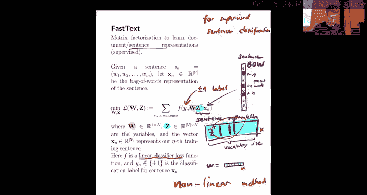

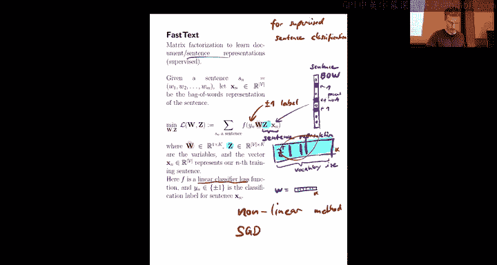

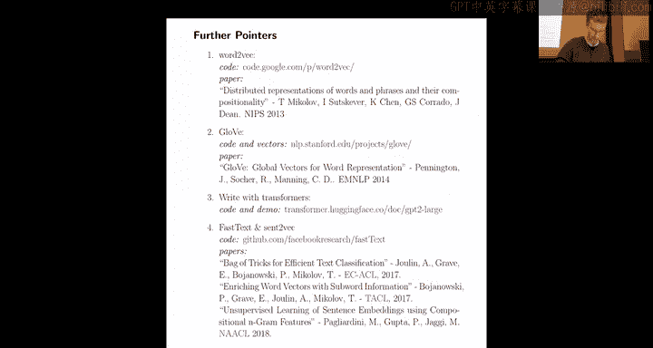

这些技术是将文本数据引入机器学习模型的基础，也是现代自然语言处理取得突破的关键。