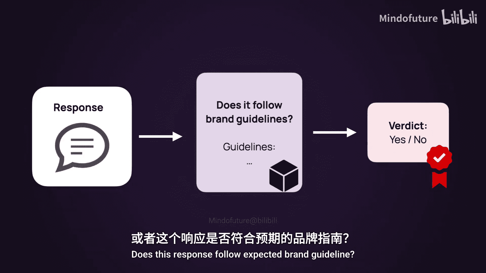
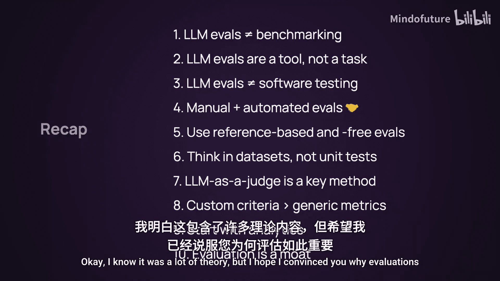

# 001：大语言模型评估十大核心概念介绍 🧠

欢迎来到LLM评估课程。在本节课中，我们将介绍什么是LLM评估，以及何时需要它，并阐述十个核心概念。这是本课程中唯一的理论部分，后续内容将全部是动手实践。

LLM评估是评估你的AI系统是否运行良好的过程。

这引出了第一个要点。

## 评估LLM系统与评估LLM模型不同

评估LLM系统与评估单独的LLM模型不同。后者通常通过基准测试完成。这些公开基准测试可以帮助你判断哪个模型在编码或数学方面表现更好。但它们就像学校的考试，测试的是通用技能。

如果你正在构建一个特定的应用程序，比如聊天机器人，甚至是一个简单的提示链，你需要在它旨在解决的任务上对其进行测试。这个系统不仅包括模型本身，还包括提示词、应用逻辑以及你添加的所有其他组件。

因此，如果你正在构建一个特定系统，不要寻找通用的基准测试，而是构建你自己的测试集。这就是我们将在本课程中讨论的内容。

## 评估是辅助决策的工具

需要明确的是，评估不是像做实验那样的独立活动。它是一种工具，帮助你回答关于产品的问题并做出决策。根据你在产品生命周期中所处的阶段，它可以融入不同的工作流程。

*   **产品构建阶段**：通常是关于实验。你可能在比较不同的模型或不同的提示词，或者试图修复你观察到的特定错误模式。评估帮助你客观地决定，例如，提示词A和提示词B哪个更好。
*   **压力测试或红队测试**：你可以向系统发送棘手或对抗性的输入，以观察是否能诱使其做出不安全的行为。例如，如果你要求聊天机器人做不恰当的事情，它会照做吗？
*   **系统上线后**：重点是监控。你需要确保用户获得良好体验，例如他们是否遇到困难、是否出现幻觉，或者聊天机器人是否拒绝了本不应回答的问题。这需要持续的在线评估。
*   **回归测试**：如果你进行了更改，比如修复了提示词或试图修复一个错误，在推出这些更改之前，你需要确保它们不会破坏其他功能。因此你需要回归测试。

在每种情况下，评估看起来都会略有不同，并且会随着你的产品一起演进，就像产品本身一样。

## LLM评估带来新的挑战

如果你有软件背景，其中一些概念听起来可能很熟悉，比如回归测试。然而，处理LLM带来了一系列全新的问题。是的，你仍然需要测试你的软件，但现在你还需要评估系统交互的内容，即输入和输出，这有很大不同。

*   **非确定性**：LLM本质上是非确定性的。这意味着即使对于完全相同的输入，你也可能得到不同的输出。这是一个关键特性。
*   **提示词的脆弱性**：提示词非常脆弱。有时，改变一个很小的细节，比如标点符号，都可能改变系统的行为。
*   **开放式任务**：你通常要解决非常开放式的任务，例如生成电子邮件。如何定义一封好的电子邮件？对此有很多答案。
*   **新风险**：由于你处理的是生成语言的概率系统，你现在还面临新的风险，如幻觉（模型编造信息）、越狱（用户试图绕过安全措施）或数据泄露（LLM可能暴露敏感数据）。

因此，对于LLM，仅仅测试功能是不够的，你还需要一种方法来评估响应的安全性和质量。

## 从人工评估开始

应对这种复杂性的第一个显而易见的解决方案是人工评估。坦率地说，你应该从这里开始。你应该阅读你得到的输出，这将帮助你建立直觉、发现模式，并理解在你的用例中“好”意味着什么。如果你能让领域专家标记一些数据，这在早期尤其宝贵。

然而，这种方法无法扩展，你不能永远手动标记所有内容。所以你需要自动化。

## 自动化评估是扩展判断，而非替代判断

这里有一个重要观点：自动化评估是为了扩展你的判断，而不是取代它。如果你还不知道要评估什么，手动评估都无从谈起，那就没什么可以自动化的。你需要先弄清楚。但一旦你弄清楚了，你就可以为实验和生产监控构建非常有用的代理指标和信号。

你仍然应该继续查看日志。人工评估和自动化评估是相辅相成的，一个会为另一个提供信息。

## 评估的两种主要类型

现在我们来谈谈评估的“方法”。主要有两种类型。

从高层次看，单个评估的构成很简单：你获得输入，运行你的应用程序，捕获输出，然后评估它。但这里有一个区别：你还可以在流程中加入一个参考答案。

*   **基于参考的评估**：如果你有这个参考答案（或称“真实答案”），你可以运行基于参考的评估。其目标是将你得到的答案与一些预期答案进行比较。例如，如果你有一个聊天机器人，你可以设计一组测试问题和这些问题的预期答案，然后评估你的系统是否确实能正确回答它们。这对于回归测试和实验很有用。
*   **开放式或无参考评估**：这是指你没有预先设定的正确答案。例如，这适用于生产环境中的监控，或非常复杂的开放式或对话式场景，在这些场景中很难提出理想的响应。在这种情况下，你可能会衡量所获输出的特定质量，例如安全性、礼貌性、正确性、长度等。

## 你需要一个测试数据集

在这两种情况下，我们都在讨论数据集。这是另一个关于LLM评估的重要观点：你不能只测试2+2=4就完事了。你实际上需要在一系列可能的输出上运行评估，这也意味着你需要准备它们。

因此，你需要设计一个代表你用例的测试数据集。实际上，你可以拥有多个数据集。例如，一个可能包含所谓的“快乐路径”查询（一些预期的正常输入），另一个可能包含一些对你很重要的边界情况，你需要确保能正确处理它们。你还可以拥有某种对抗性数据集，用于测试系统的潜在弱点。

你可以手动设计这些测试用例，或从真实日志、历史记录中获取，甚至可以通过合成方式生成。但你需要投入精力来实际设计它们。

## 评估方法：LLM即法官

在评估方法方面，有很多选择，从确定性的方法（如验证LLM生成的代码是否可以实际运行）到基于机器学习的评估。但我想强调的最流行的方法之一叫做“LLM即法官”。

其理念非常简单。你获取系统生成的输出，并将其传递给另一个LLM（或同一个LLM），但这次附带一个评估提示。在这个提示中，你要求LLM评估响应的特定质量并进行自动评分。例如，“这个回答是否基于提供的上下文？”或“这个回答是否符合预期的品牌指南？”等等。

实际上，你是在使用LLM来替代特定、狭窄、受约束任务中的人类标注员，而且效果出奇地好。请记住，你的“LLM法官”本身就像一个小型机器学习项目，也需要一些调整和验证。我们将有一个单独的课程来讨论这个。

## 定义你自己的评估标准

“LLM即法官”如此受欢迎的原因之一是它允许你实现自定义标准。这是LLM评估的一个关键点：你实际上需要弄清楚这个标准，而不仅仅是随机挑选一些指标。

当然，并非所有指标都不好。如果你评估的是客观事物，如分类质量或排名质量，有既定的指标，如精确率、召回率和DCG等。但这里我指的是主观质量。你不能窃取别人的标准并期望将其应用到你的产品中。

当然，你可以借用实现。例如，如果检测输出中的个人数据对你很重要，你可以重用PII检测器。但你不能将其他项目的标准应用到你的项目上。你需要弄清楚在你的用例中什么才是重要的。

例如，以“连贯性”这个标准为例。大多数现代LLM已经可以生成非常流畅和连贯的输出。测量它没有意义，你只会总是通过。然而，如果你正在使用较小的LLM或自托管的小型开源模型，你可能确实需要测试它，如果这是你在输出中观察到的问题。

再举一个例子。OpenAI最近发布了他们的一张模型卡片，其中分享了他们用于确保模型遵循否定指令的特定测试，例如“不要联系客服支持”。显然，这个测试的需求源于他们观察到的特定故障模式，因此他们实现了一种评估方法。这适用于你的产品吗？也许适用，也许不适用。但这是一个很好的例子，说明如何实施由观察生产环境中特定错误所驱动的评估。

## LLM评估是产品分析

到目前为止，你可能已经意识到，LLM评估不仅仅是工程问题。你从定性分析开始，然后将其转化为定量分析。事实上，它可能更接近产品分析，而不是软件可观测性。

在软件中，你通常有一套初始的指标，如延迟、内存使用情况等，你不需要过多思考这些。但对于LLM评估，你首先需要弄清楚你实际在测量什么。因此，你需要查看数据，理解你想要检测什么类型的行为，看到什么类型的错误，然后弄清楚如何围绕这些设计实验。

为了实现这一点，你还需要日志记录。这非常重要。你需要捕获获得的所有输入和输出。你可能首先从合成数据开始，但一旦有了真实用户，你需要捕获一切，以便在你的评估和产品改进中利用这些数据。

## 良好的评估系统是竞争优势

如果构建一个坚实的评估系统听起来很耗时，那是因为它确实如此。但这是值得投入的时间。一个好的评估系统实际上是一种竞争优势。

它就像一个活的产品规范，用代码和数据集实现了对你的用例而言“好”的标准。这让你可以做很多很棒的事情。

*   **首先，你可以更快地行动**：你可以运行实验，比较不同的提示词，在新模型发布时几小时内（而不是几天）测试它们。
*   **其次，你可以自信地发布**：你知道在你做出更改后，是否有东西会出问题。
*   **最后，它帮助你与用户建立信任**：尤其是在高风险领域运营时。

😊，这也创造了一个持续改进的循环，从早期实验到实时监控的每个阶段都帮助你变得更好。例如，当你从真实用户那里学习时，你可以用新的边界案例扩展你的测试。

随着时间的推移，这可以成为一种护城河。每个人都有权使用相同的模型，但你可以拥有良好的标注数据、敏锐的测试（真正帮助你区分好与坏）以及并非每个人都有的产品洞察力。

好的，我知道这有很多理论，但我希望我已经说服了你为什么评估很重要。没有评估，你的产品就只是一个原型。如果你想深入了解这些概念中的任何一个，我们有一个单独的YouTube播放列表，介绍评估的基础知识。

在接下来的视频中，我们将开始动手实践，首先在玩具数据集上实现不同的LLM评估方法，看看它是如何工作的。下个视频见。

---

**本节课总结**

在本节课中，我们一起学习了LLM评估的十大核心概念：
1.  **评估系统而非模型**：针对具体应用构建自己的测试集。
2.  **评估是决策工具**：服务于产品生命周期的不同阶段（实验、压力测试、监控、回归测试）。
3.  **面临新挑战**：非确定性、提示词脆弱性、开放式任务、新风险（幻觉、越狱、数据泄露）。
4.  **从人工评估开始**：建立直觉，理解“好”的标准。
5.  **自动化评估是扩展**：而非替代人工判断。
6.  **两种评估类型**：基于参考的评估和无参考评估。
7.  **需要测试数据集**：设计代表用例的数据集，包括正常、边界和对抗性案例。
8.  **流行方法：LLM即法官**：使用LLM自动评估输出的特定质量。
9.  **定义自定义标准**：评估标准需与你的产品目标和观察到的错误模式紧密相关。
10. **评估是竞争优势**：良好的评估系统能加速迭代、增强发布信心、建立用户信任并形成持续改进的循环。