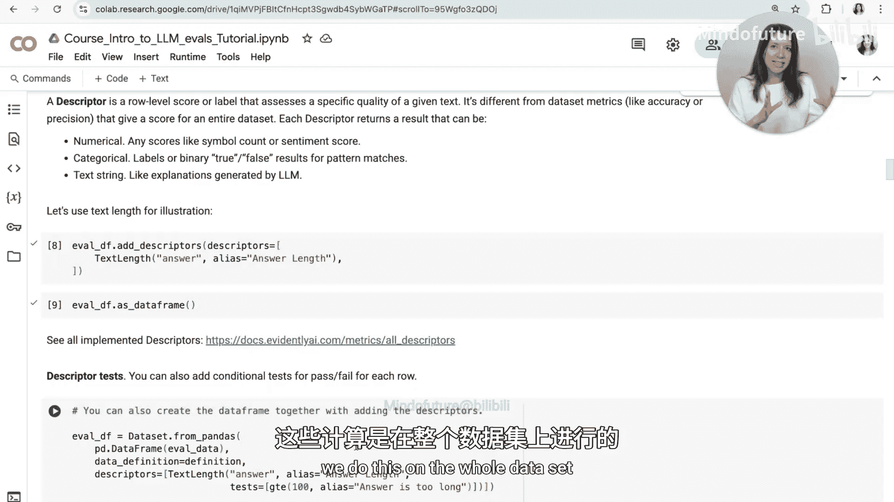
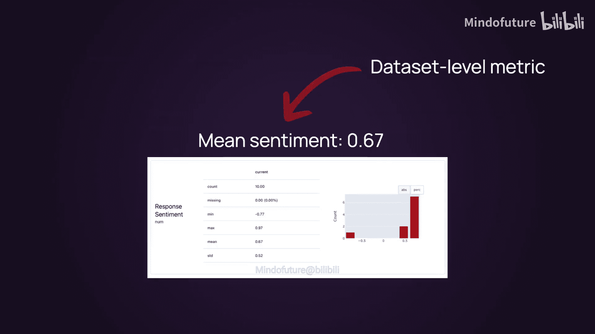
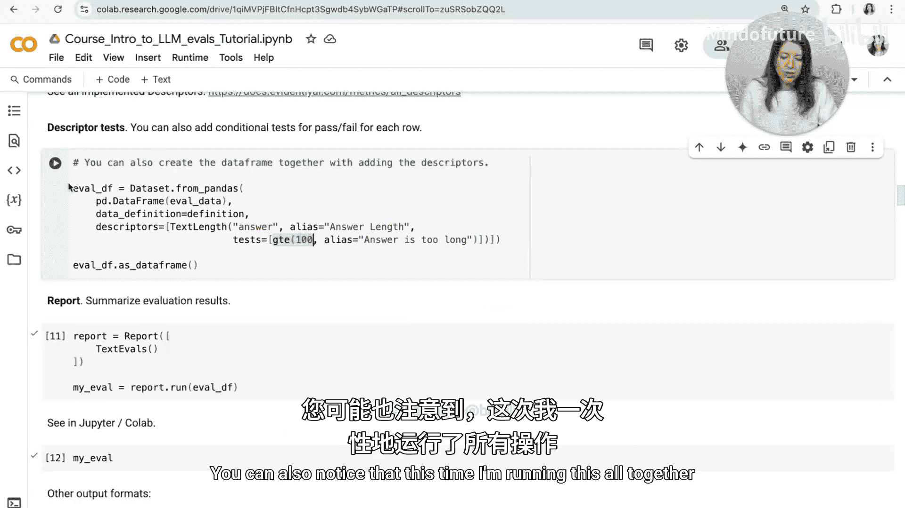
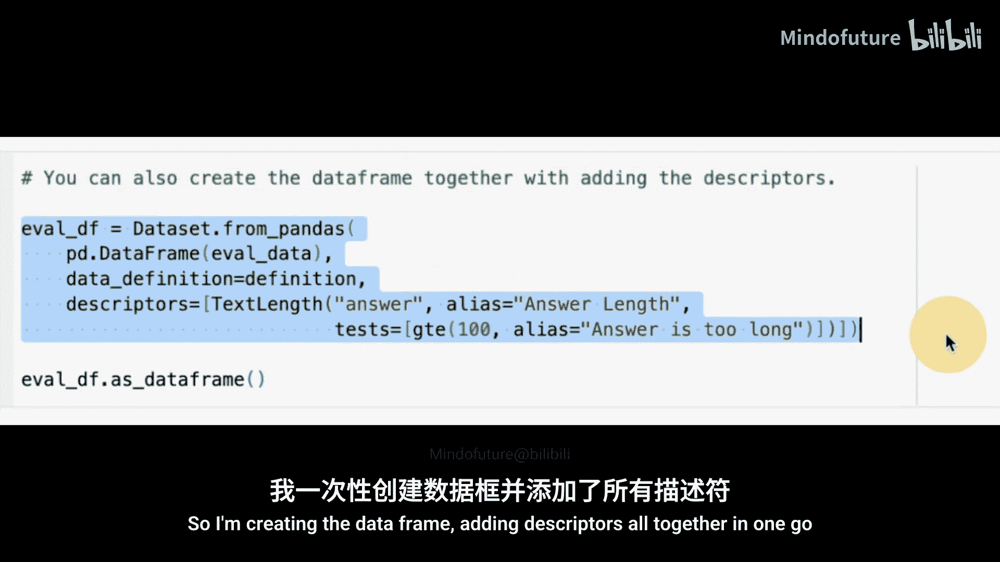
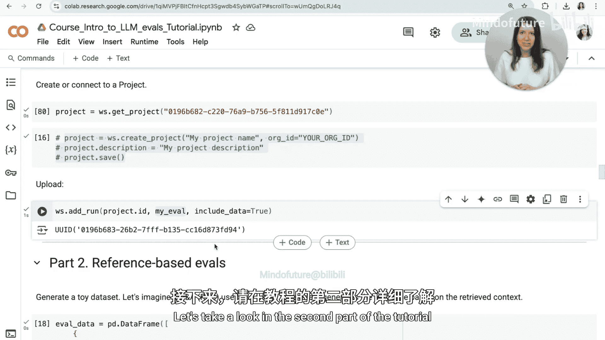

# 002：概览与基础API 🧠

欢迎来到LLM评估课程的第一个实践教程。本节课的目标是向你展示不同的LLM评估方法，以及如何使用一个简单的示例来实现它们。本教程将分为三个部分。首先，我们将展示一个完整的端到端评估流程，以便你理解我们将要反复使用的基础API。然后，我们将探讨基于参考的评估方法，即通过将得到的答案与标准答案进行比较来进行评估，并展示不同的实现方式。最后，我们将研究无参考评估方法，即直接对生成的回答进行评判，并展示如何使用从LLM评判到基于机器学习的评分，再到正则表达式等多种方式来实现。我们将实现一系列不同的评估标准来演示如何操作。

让我们开始吧。我将在Google Colab中运行本教程，但你也可以在任意的Python环境或Jupyter笔记本中运行。

第一步是安装Evidently，这是一个开源的Python库。通常你可以通过运行 `pip install evidently` 来安装。但在本例中，我同时安装了LLM扩展，因为我们将使用许多不同的LLM评估方法，需要一些额外的依赖项。

以下是本教程的结构，内容会相当长。现在，让我们从第一部分开始，即单个评估的剖析。我们还需要运行一系列导入操作。在本例中，我们需要导入本教程后续将用到的所有组件，因此你将看到我们如何使用每一个组件。

为了运行基础评估，我们首先需要准备数据。在本例中，我们直接在此生成数据，其中包含了一些问题和答案。让我们看一下这个数据集。

这就是数据集。我们可以想出一些可以评估的内容，但为了演示，我们可以看一个非常简单的例子，比如文本长度。

为了能够在这个数据集上运行评估，我们首先需要准备一个Evidently数据集对象。这基本上是将数据转换为我们可以进一步处理的形式。

创建这个数据集时，我们还需要传入一个称为“数据定义”的东西。在本例中，数据定义让你可以指向数据中的特定列，并解释它们的作用和类型。目前，我们只指定数据集中有文本列，即“question”和“answer”。这很有用，因为有时你可能还有数值型或分类型的元数据，或者列中可能有特定的角色，如“prediction”和“target”，但现在我们只使用这个简单的定义。

下一步是创建这个Evidently数据集对象，我们通过传入刚刚生成的数据框和这个数据定义来完成。

现在，这里有一个重要的部分：为了在Evidently库中运行评估，我们需要创建一个叫做“描述器”的东西。描述器是一种行级评估，它为数据集中的每一行添加一个额外的分数或标签。在本例中，它可以引用输入或输出，并分配一个特定的质量评分，从简单的文本长度到可能由LLM评判提供的分类判断。这是一个我们将重用于实现各种评估的通用接口。

我们将此与“指标”区分开来，指标是数据集级别的评估。例如，我们可以计算整个数据集上的分类准确率、精确率或召回率。而当我们计算描述器时，我们实际上是在行级别进行的，我们仍然可以聚合整体结果，稍后你会看到如何操作。

作为一个简单的评估，我们将运行文本长度计算。在本例中，我们将使用 `add_descriptors` 方法，然后传入我们想要实现的描述器列表。

Evidently已经实现了一系列描述器，如果你查看文档，会发现数量相当多。这些描述器涵盖了从确定性评估到LLM评判的所有内容，它们都使用相同的接口。目前，我们只选择一个非常简单的，叫做“text_length”。

当你包含描述器时，还需要指定要应用到哪一列。在本例中，我们想要计算答案的长度，并给它一个名称，比如“answer_length”。

就是这样。你可以看到我们几乎可以立即预览结果。我们得到了一个添加到数据集中的额外列，名为“answer_length”。

还有一件事我想向你展示。在许多情况下，你不仅想评估数字，还想基于这个数字得到某种通过/失败的判断。例如，可能有些回答太长，你想检测是否存在这样的回答。为此，你需要在计算的描述器上添加额外的测试。

在本例中，我们指定条件是：如果文本长度大于或等于100，我们认为它太长。因此，对于满足此条件的行，我们的测试条件将返回True，我们将看到所有满足此条件的回答。

我们将称之为“answer_is_long”描述器。你还可以注意到，这次我一次性运行了所有操作：创建数据框、添加描述器。

现在，我们可以看到我们添加了两列：一列是原始的文本长度描述器，另一列是测试结果，它根据我们指定的条件告诉我们每行是通过还是失败。

在运行评估之后，我们可能想要总结结果。目前，我们只是查看了数据框，如果只有少量输入，这没问题。但如果是一个非常大的数据框，仅凭肉眼查看可能不太方便。因此，Evidently有一个叫做“报告”的功能，可以让你在完整的数据框上总结或计算额外的指标。在本例中，我们将创建一个报告，并传入一个叫做“TextOverview”的预设，它可以让我们总结刚刚计算的这些列上的所有分布情况。

然后，我们需要在我们已有的数据框上运行这个报告，这个数据框包含了我们已计算的所有描述器。

让我们运行它并预览结果。有趣的是，你可以直接在Jupyter笔记本或Colab环境中查看它。在本例中，你可以看到它生成了可视化图表，展示了我们计算的分数（本例中是文本长度）的分布，并且我们还看到了基于此的通过/失败结果的分布。

你还可以看到一些可能有用的额外指标，如最小值、最大值、平均值等。现在，如果你正在运行自动化检查，可能还想使用其他输出器，例如生成JSON或Python字典，以便在其他管道中轻松使用结果。

此外，你还可以将评估结果存储为HTML文件。这样，你就可以将其存储在某个地方，然后在浏览器中打开。

我刚刚下载了这个HTML文件，你可以打开并查看它。

还有一件事我们可以做：如果你运行了大量的评估，并希望存储结果、随时间进行比较或监控是否在改进，你也可以将它们发送到Evidently Cloud并在那里进行跟踪。为此，你首先需要创建一个Evidently Cloud账户，注册是免费的。

拥有账户后，你可以前往Evidently Cloud并获取一个令牌，以便从你的Python环境与Evidently Cloud交互。我已经全部设置好了，所以可以直接从这里连接。

下一步是创建一个项目。你实际上可以直接在UI中完成。所以，如果你来到这里，可以创建一个新项目，给它起个名字，然后立即拥有一个新项目。

我们刚刚创建了这个项目。如果你打开这个项目，还可以复制其ID，然后使用它从Python环境连接。但正如我所说，或者，你也可以从Python创建项目。

我们已经连接好了，所以现在我们可以将结果发送到Evidently Cloud。在本例中，我们发送的是刚刚生成并查看的同一个报告对象，但我们将它绘制到Evidently Cloud上。

所以，如果我们前往Evidently Cloud，你可以在这里打开报告部分，你将能够看到我们刚刚生成的报告。你可以看到我们刚刚查看的相同可视化图表，在下方，你还可以看到数据集，并且可以探索、排序结果或以某种方式与之交互。

你可能还想做的一件事是添加仪表板。在本例中，如果你直接进入主仪表板，可以进入编辑模式，然后添加小部件并选择列小部件。这些小部件基本上总结了我们在数据集中拥有的所有描述器或列摘要。目前我们只有一个评估，所以每个小部件只有一个数据点。但如果你反复运行这些评估，你将看到随时间推移的进展。如果你来到这里，你总是可以向下滚动并打开原始报告进行探索。

最后，如果你运行了一系列模拟，你可能会得到类似这样的视图，能够跟踪不同指标随时间的变化，以查看是否在改进，并分析你在各个质量维度上的总体表现。

以上就是我想展示的基础评估工作流程的全部内容。你可以重用相同的描述器接口来运行各种评估，不仅仅是文本长度，还包括像LLM评判这样非常复杂的内容。让我们在教程的第二部分中继续探讨。

