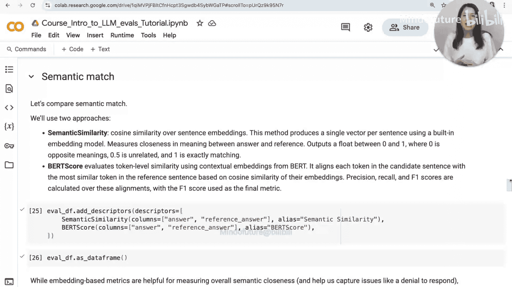
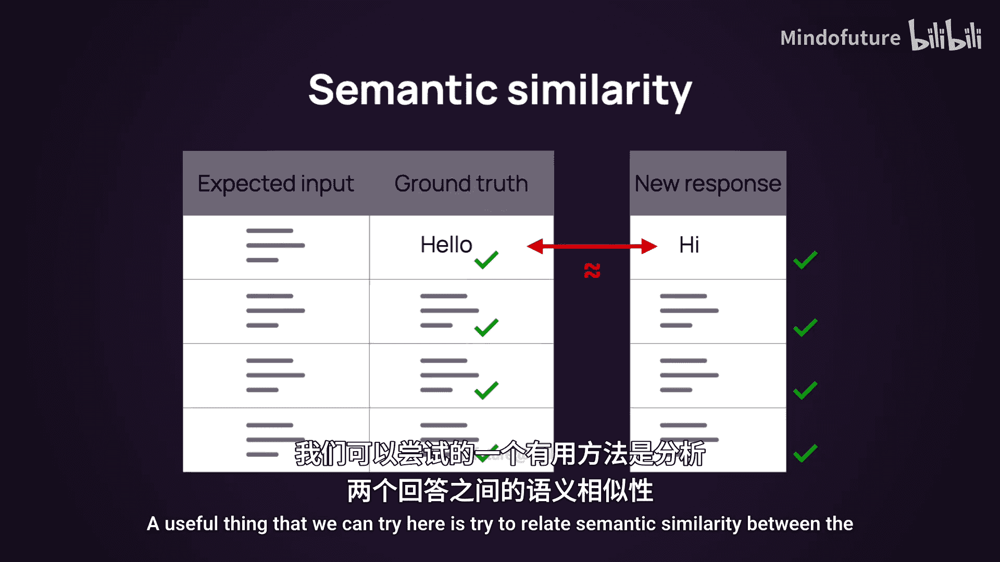
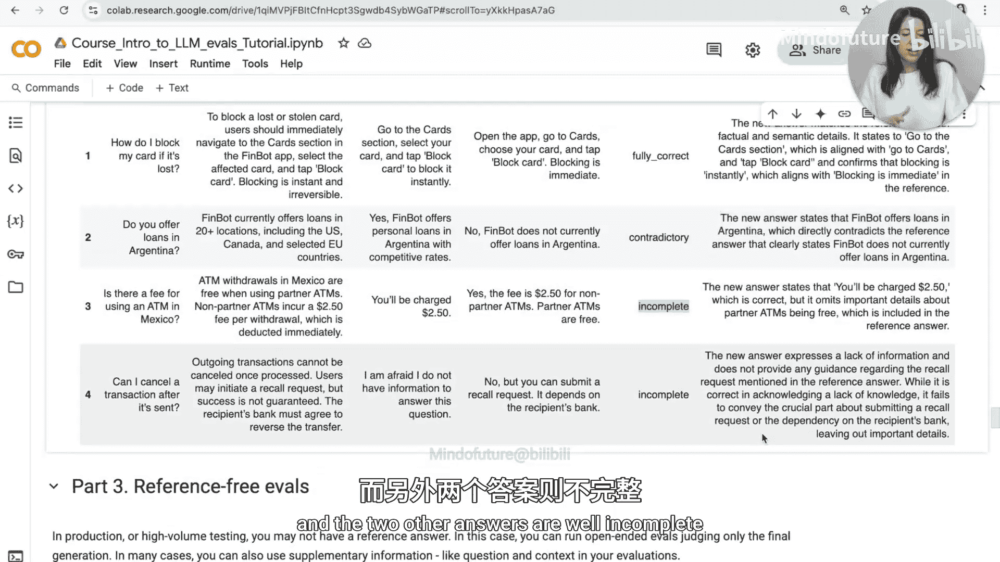

# 003：基于参考答案的评估


在本节课程中，我们将学习基于参考答案的评估方法。这种方法的核心是将模型生成的答案与预先准备的“标准答案”进行比较，以判断模型回答的正确性。我们将探讨几种不同的比较方式。

## 准备测试数据集

首先，我们需要准备一个测试数据集。这个数据集模拟了一个支付应用的客户支持日志，其中包含用户提出的问题以及我们期望得到的理想答案。

以下是生成数据集的代码示例：

```python
# 示例：创建包含问题和标准答案的数据集
import pandas as pd

golden_dataset = pd.DataFrame({
    ‘question‘: [‘如何重置密码？‘, ‘转账手续费是多少？‘, ‘阿根廷是否提供贷款服务？‘],
    ‘reference_answer‘: [‘您可以在设置菜单中找到“忘记密码”选项来重置。‘, ‘国内转账通常免费，国际转账收取1%的手续费。‘, ‘不，目前我们在阿根廷不提供贷款服务。‘]
})
```

这个“黄金数据集”包含了一系列预期的问题和答案，这些答案被视为对应问题的理想回答。在实际应用中，你可以通过人工整理或合成生成的方式准备类似的数据集。

现在，假设我们已将测试问题输入我们的应用程序，并得到了一批新的答案。除了原有的参考答案，我们还得到了一个包含“上下文”的列，这模拟了RAG（检索增强生成）应用的工作流程：系统在生成回答前，会先从知识库中检索相关信息。

我们当前的任务是：比较我们得到的答案与参考答案，判断它们是否一致，从而评估聊天机器人回答的正确性。

## 评估方法一：精确匹配

首先，我们可以尝试一种非常简单的方法：精确匹配。这种方法直接比较两个文本字符串是否完全相同。

以下是使用Evidently AI的`exact_match`描述符进行精确匹配的示例：



```python
from evidently.descriptors import exact_match

# 假设 `df` 是包含 ‘answer‘ 和 ‘reference_answer‘ 列的数据框
df[‘exact_match‘] = df.apply(lambda row: exact_match(row[‘answer‘], row[‘reference_answer‘]), axis=1)
```

然而，在处理开放式文本生成任务时，精确匹配通常效果不佳。因为模型生成的回答在措辞上可能会有细微差别，即使含义相同，字符串也很难完全一致。因此，我们需要更智能的评估方法。



## 评估方法二：语义相似度

既然精确匹配不适用，我们可以尝试评估两个回答之间的语义相似度。语义相似度关注的是文本含义的接近程度，而非字面匹配。这里我们介绍两种实现方式。

### 1. 基于嵌入向量的余弦相似度

这种方法使用嵌入模型将文本转换为向量，然后计算两个向量之间的余弦相似度。余弦相似度的值域为[-1, 1]，在文本语义场景下，我们通常使用经过调整的相似度分数，值域为[0, 1]，其中1表示含义完全相同，0表示完全相反，0.5表示无关。

以下是计算语义相似度的代码框架：

```python
from sentence_transformers import SentenceTransformer
from sklearn.metrics.pairwise import cosine_similarity
import numpy as np

model = SentenceTransformer(‘all-MiniLM-L6-v2‘)

def compute_semantic_similarity(text1, text2):
    emb1 = model.encode([text1])
    emb2 = model.encode([text2])
    similarity = cosine_similarity(emb1, emb2)[0][0]
    # 将[-1,1]映射到[0,1]，更直观地表示语义相似度
    normalized_similarity = (similarity + 1) / 2
    return normalized_similarity

df[‘semantic_similarity‘] = df.apply(lambda row: compute_semantic_similarity(row[‘answer‘], row[‘reference_answer‘]), axis=1)
```

### 2. BERTScore

另一种方法是使用BERTScore。它同样基于语义相似度，但计算方式不同：它首先计算生成答案和参考答案中每个词（token）的嵌入向量，然后基于这些向量间的对齐程度和重叠正确性，最终计算出一个F1分数。

```python
from bert_score import score

def compute_bertscore(cands, refs):
    P, R, F1 = score(cands, refs, lang=“zh“, verbose=True)
    return F1.numpy() # 返回F1分数

df[‘bertscore‘] = compute_bertscore(df[‘answer‘].tolist(), df[‘reference_answer‘].tolist())
```

运行这些评估后，我们可以将结果添加到数据集中进行对比。通常，许多回答会获得较高的语义相似度分数。然而，我们可能会发现一些得分较低的回答。例如：
*   回答与参考答案长度不同，或参考答案包含更多细节信息。
*   模型生成了拒绝回答（如“抱歉，我无法提供该信息”），而参考答案则包含具体信息。

通过设定一个阈值（例如，相似度高于0.8视为正确），语义相似度可以成为一个不错的评估选项。但它并非完美，因为它关注的是句子整体的语义接近程度，有时一个关键细节的改动会完全改变句意，但语义相似度分数可能变化不大。

## 评估方法三：使用LLM作为评判官

为了进行更细致和符合人类直觉的匹配，我们可以使用另一个大语言模型作为“评判官”。其工作原理是：我们提示一个外部的LLM，让它审视生成答案和参考答案，并判断新答案是否与原始参考答案匹配。

以下是使用OpenAI模型作为评判官的示例：

```python
from evidently.descriptors import LLMEvaluator
import openai

# 设置API密钥
openai.api_key = ‘your-api-key‘

# 使用预定义的‘correctness_llm_eval‘描述符
evaluator = LLMEvaluator(descriptor=‘correctness_llm_eval‘)
df_with_eval = evaluator.evaluate(
    data=df,
    column_name=‘answer‘, # 要评估的列
    target=‘reference_answer‘ # 作为对比目标的列
)
```

在这个描述符背后，是一个我们编写好的提示词（Prompt），它要求LLM检查回答中是否存在与原始答案**矛盾、遗漏或新增**的信息。

评估完成后，我们会得到新的一列，其中包含LLM评判官给出的标签（如“正确”或“不正确”），通常还会附带一段“推理过程”。这段推理对于解释结果非常有帮助，因为它可能指出了模型发现的特定矛盾或遗漏点。

与语义相似度相比，LLM评判官可能会标记出更多“不正确”的答案。例如：
*   **矛盾**：参考答案说“不提供某项服务”，而生成答案说“提供”。尽管两句词语义相似度高，但含义完全相反。
*   **信息不全**：参考答案包含额外细节（如“合作伙伴ATM收费”），而生成答案只给出了部分信息。
*   **拒绝回答**：模型直接拒绝回答，而参考答案提供了信息。

LLM评判官已经相当有用，但我们可以观察到存在不同类型的错误：最严重的是**矛盾**，这是我们最不希望发生的；其次是**信息遗漏**或**回答不完整**。

## 创建自定义的LLM评判官

为了更精确地分类这些错误类型，我们可以创建自定义的LLM评判官，将我们刚刚总结的判断标准整合进去。

我们将使用一个多分类模板，因为我们希望评判官将回答分为四类：
1.  **完全正确**：答案完全匹配。
2.  **信息不全**：答案正确但遗漏了一些细节。
3.  **信息新增**：答案没有矛盾，但说了一些参考答案中没有的内容（可能有用，也可能无关）。
4.  **存在矛盾**：答案与参考答案在事实上冲突。

以下是创建自定义评判官的示例：

```python
from evidently.templates import MultiClassClassificationTemplate

# 定义分类标准和类别
custom_instructions = “““
请将生成答案与参考答案比较，并分类：
1. ‘fully_correct‘: 答案完全匹配，无遗漏或矛盾。
2. ‘incomplete‘: 答案正确但遗漏了部分细节。
3. ‘addition‘: 答案正确且无矛盾，但包含了参考答案中没有的新信息。
4. ‘contradictory‘: 答案与参考答案在事实上存在冲突。
“““

custom_template = MultiClassClassificationTemplate(
    instructions=custom_instructions,
    classes=[‘fully_correct‘, ‘incomplete‘, ‘addition‘, ‘contradictory‘]
)

# 创建自定义评判官
custom_judge = LLMEvaluator(
    template=custom_template,
    model=‘gpt-4-mini‘, # 可替换为其他模型
    reference_column=‘reference_answer‘ # 指定参考答案所在列
)

# 应用评估
final_df = custom_judge.evaluate(data=df, column_name=‘answer‘)
```

运行这个自定义评判官后，我们可以得到更精细的分类结果。例如，两个答案被标记为“完全正确”，关于阿根廷贷款的答案被标记为“存在矛盾”，而另外两个答案则被标记为“信息不全”。这比简单的“正确/错误”二分法提供了更丰富的诊断信息。

## 本节总结

在本节课中，我们一起学习了基于参考答案的LLM回答评估方法。我们首先了解了准备包含“标准答案”的测试数据集的重要性。接着，我们探讨了三种主要的评估方法：
1.  **精确匹配**：简单直接，但在开放域生成任务中实用性有限。
2.  **语义相似度**（包括余弦相似度和BERTScore）：通过比较文本的语义向量来评估相似性，能有效捕捉含义相近的回答。
3.  **LLM作为评判官**：利用另一个LLM进行更复杂、更接近人类判断的评估。我们不仅使用了预定义的评估器，还学会了如何创建**自定义的、多分类的LLM评判官**，以识别“完全正确”、“信息不全”、“信息新增”和“存在矛盾”等不同情况。



基于参考答案的评估为我们提供了明确的正确性标准。在下一部分教程中，我们将探讨**无参考答案的评估方法**，即在不依赖标准答案的情况下评估LLM的输出质量。

