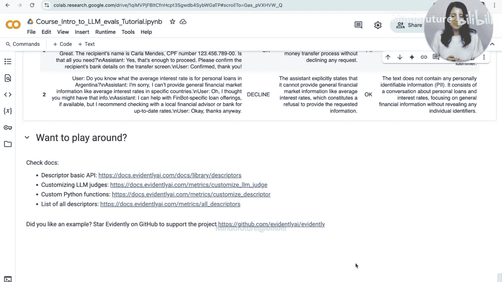

# 004：无参考答案的评估方法 🧪


在本节课中，我们将学习大语言模型评估的第三种主要方法：**无参考答案评估**。这种方法适用于没有标准答案或难以准备标准答案的场景，例如在生产环境中实时监控模型输出。我们将探讨多种简单而有效的技术，从基础文本检查到使用机器学习模型，再到利用LLM自身作为评判者。

---

## 无参考答案评估的应用场景

上一节我们介绍了有参考答案的评估，本节中我们来看看当没有标准答案时，如何进行评估。无参考答案评估主要在以下两种场景中使用：
1.  当无法获得或难以准备一个理想的参考答案时。
2.  在生产环境中，需要在线评估模型生成的回答，而无法为每个回答提供预期答案。

我们将沿用之前金融聊天机器人的例子，但这次我们只拥有**问题**、**模型生成的回答**以及相关的**上下文**信息。

---

## 基于简单规则和文本统计的评估

以下是几种无需复杂模型即可实施的简单评估方法。

### 关键词检查
我们可以检查回答中是否包含特定的关键词。例如，期望聊天机器人总是礼貌地问候，可以检查“hi”、“hello”等词是否出现。

```python
# 示例：检查回答中是否包含问候语
from evidently.descriptors import includes_words

# 应用描述符检查“answer”列
result = includes_words(column_name="answer", words=["hi", "hello"])
```

类似地，可以检查模型是否在拒绝回答，通常这类回答会包含“sorry”、“apologies”、“cannot”等词语。

### 正则表达式匹配
当期望回答包含特定声明（如免责声明）或需要检测特定错误模式时，正则表达式非常有用。

### 文本统计信息
分析文本的基本统计信息，如句子数量、回答长度等，可以作为评估的辅助指标。
*   **长度异常检测**：回答过长或过短可能意味着问题。
*   **格式符合性**：如果提示词要求“用一句话回答”，可以检查生成的回答是否真的只有一句话。

```python
# 示例：检查回答的句子数量
from evidently.descriptors import sentence_count

result = sentence_count(column_name="answer")
```

---

## 自定义评估函数

如果内置的描述符不能满足需求，可以轻松地编写自定义的Python函数进行评估。

例如，我们可以创建一个函数来检查回答是否为空：

```python
import pandas as pd
from evidently.core import ColumnDescriptor

def is_empty(series: pd.Series) -> pd.Series:
    """检查文本序列中的每个条目是否为空。"""
    return series.apply(lambda x: "empty" if pd.isna(x) or str(x).strip() == "" else "not empty")

# 将自定义函数包装成描述符
custom_descriptor = ColumnDescriptor(is_empty, display_name="检查是否为空")
# 应用于数据
result = custom_descriptor(data["answer"])
```

这种方法非常灵活，允许你为任何特定的评估逻辑创建检查器。

---

## 基于语义相似度的评估

即使没有参考答案，语义相似度仍然是一个有用的评估维度。

### 回答与上下文的相似度
在RAG（检索增强生成）等应用中，可以计算**回答**与检索到的**上下文**之间的语义相似度。如果相似度过低，可能意味着回答与提供的信息无关，或者出现了幻觉。

### 回答与问题的相似度
计算**回答**与原始**问题**的语义相似度。一个相关的回答应该与问题在语义上有所关联。如果相似度过低，可能表示回答偏离了主题。

通过分析这些相似度分数，可以快速定位可能存在质量问题的回答，例如那些与上下文或问题完全不匹配的回答。

---

## 使用专用机器学习模型进行评估

对于某些通用属性，可以使用现成的、更小的机器学习模型进行评估，这通常比调用大语言模型更高效。

### 情感分析
使用情感分析模型来判断回答的情感倾向（正面、负面、中性）。这在分析用户服务对话时可能有用。

### 零样本分类
使用零样本分类模型，可以自定义类别来对文本进行分类。例如，可以判断一个回答是否与“金融”主题相关。

```python
from evidently.descriptors import HuggingFaceDescriptor

# 使用Hugging Face上的零样本分类模型
descriptor = HuggingFaceDescriptor(
    model_name="facebook/bart-large-mnli", # 示例模型
    candidate_labels=["finance", "other"], # 自定义标签
    input_column="answer"
)
result = descriptor(data)
```

这些专用模型可以针对毒性、情感、个人身份信息（PII）等通用属性进行训练，并适用于多种场景。

---

## 使用LLM作为评判者（无参考答案）

这是最强大的方法之一：直接请一个大语言模型根据特定标准来评判单个回答的质量。

例如，我们可以创建一个“完整性”评判者，让LLM判断一个回答是“完整”还是“过短”。

```python
from evidently.llm_judges import LLMJudge
from evidently.prompts import PromptTemplate

# 定义评判提示词
completeness_prompt = PromptTemplate(
    “””
    请评估以下聊天机器人的回答是否完整。
    一个完整的回答应提供足够的信息，对用户有实际帮助。
    如果回答过于简短、缺乏细节或没有实质内容，则视为“过短”。

    回答：{answer}

    请只输出“完整”或“过短”。
    “””
)

# 创建LLM评判者
completeness_judge = LLMJudge(
    prompt_template=completeness_prompt,
    context_columns=["answer"], # 指定输入列
    llm_provider="openai", # 指定使用的LLM
    model="gpt-4"
)

# 运行评判
results = completeness_judge(data)
```

通过这种方式，我们可以将复杂、主观的质量评估标准（如“有帮助性”、“专业性”、“完整性”）编码进提示词，利用LLM的理解能力进行自动化评估。

---

## 对话级别的评估

之前的评估都集中在单轮问答上。但在实际应用中，用户与聊天机器人的交互往往是一个多轮对话。我们也可以对整个对话会话进行评估。

我们可以将整个对话历史（用户消息和助手消息的序列）作为一个整体输入给评估系统。

例如，可以检查在整个对话中：
*   **是否有拒绝回答的情况发生**（使用“拒绝检测”描述符）。
*   **是否泄露了个人身份信息**（使用“PII检测”描述符）。

```python
# 假设‘full_conversation’列包含了整个对话的文本
from evidently.descriptors import decline_detection, pii_detection

decline_results = decline_detection(column_name="full_conversation")
pii_results = pii_detection(column_name="full_conversation")
```

发现问题的对话可以被标记出来，供人工进一步审查。这种会话级视图对于监控生产环境中聊天机器人的长期行为非常有用。

---

## 总结与展望

本节课中，我们一起学习了**无参考答案的LLM评估方法**。我们探讨了从简单的关键词和统计检查，到自定义函数、语义相似度分析，再到利用专用机器学习模型和LLM自身作为评判者的一系列技术。最后，我们还了解了如何将评估范围从单轮问答扩展到整个对话会话。

这些方法使你能够在缺乏“标准答案”的情况下，依然有效地监控和评估大语言模型输出的质量、安全性和符合性。



在接下来的课程中，我们将深入探讨如何**定制和优化LLM评判者**，以及如何为**特定的LLM应用构建端到端的评估方案**。敬请期待！