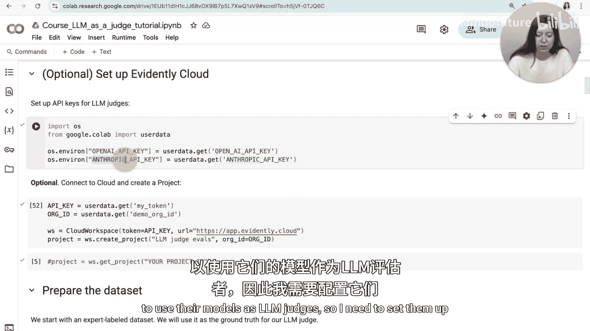
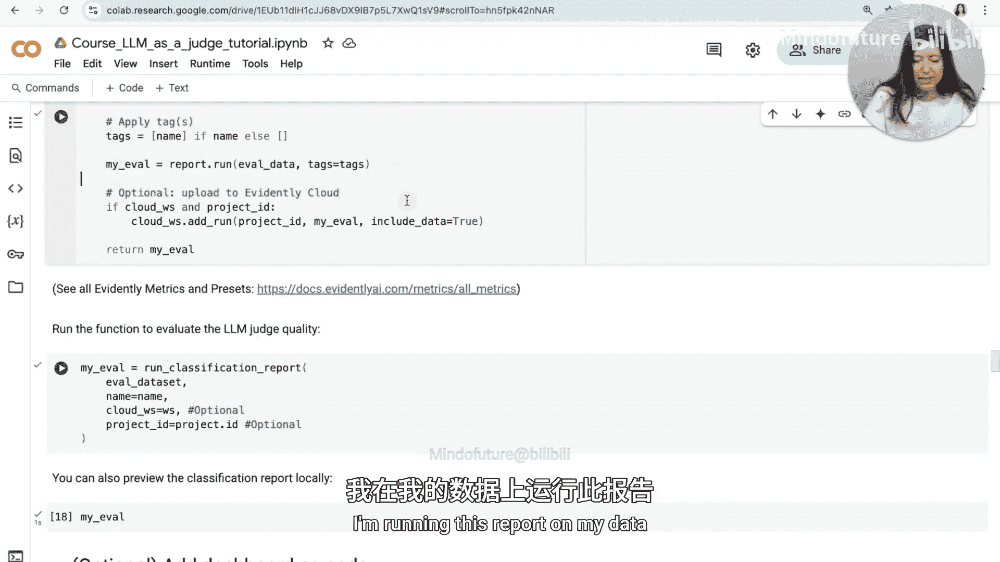
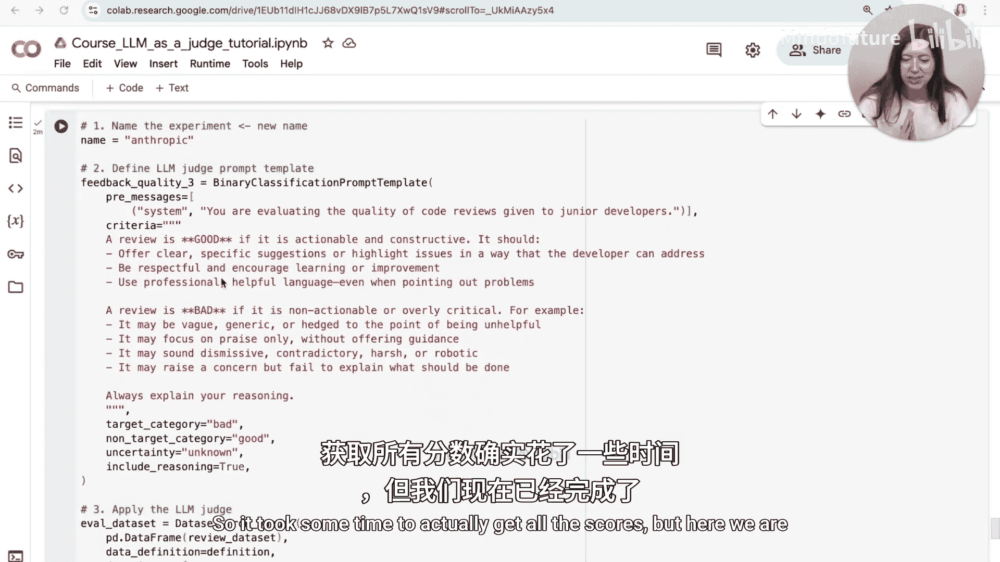
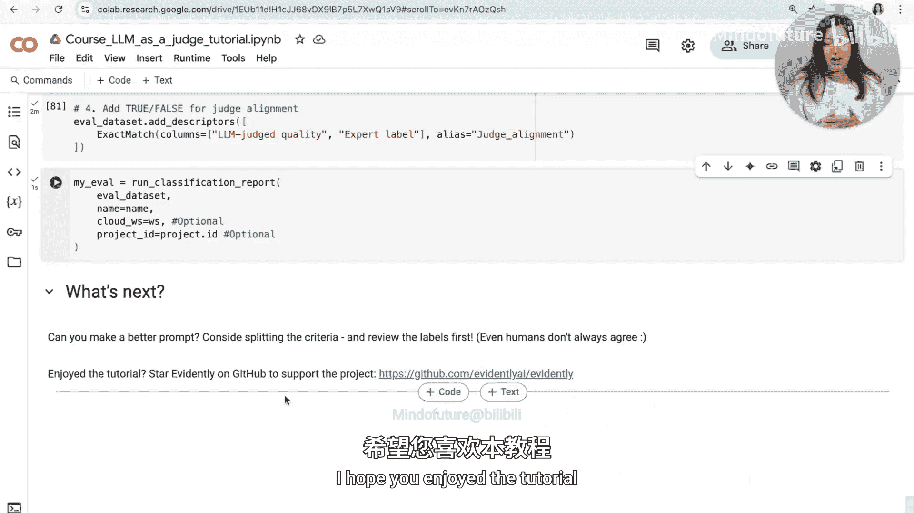

# 005：如何创建大语言模型裁判器并与人工标注对齐 🧑‍⚖️

在本教程中，我们将学习如何创建一个LLM裁判器，并将其与您的人工偏好对齐。我们将首先解释整个过程，然后将其应用于真实数据和提示，创建一个用于评估代码审查质量的LLM裁判器。在此过程中，我们还将比较不同模型的表现。

## 概述

创建LLM裁判器的第一步是确定您要评估什么。有时您已经知道这一点，例如，您观察到了特定的失败模式，现在希望能够检测到它。如果您还不知道，最好的方法是开始标注您的数据，以便找出一些模式并提出可泛化的标准。

需要记住的一点是，您不需要为您的产品创建一个整体的裁判器。实际上，您可以创建多个小型裁判器，每个裁判器评估一个特定方面。

您可能希望捕获特定的失败模式，例如拒绝或重复。或者，您可以反过来尝试提出质量指标，这些指标将作为您希望观察的实际行为的代理。当然，您能提出的要求是有限制的。您不能期望得到一个可靠的答案来回答“这个答案在医学上正确吗？”这样的问题，但您可以问“这个答案是基于上下文的吗？”或“这个答案的表述是否易于理解？”等等。

您也可以设计更针对特定测试的裁判器。例如，如果您正在处理一个特定场景，您可以为该场景附加一个裁判器。假设您发送的提示旨在探测您的LLM谈论竞争对手的情况，那么您可以有一个裁判器来评估响应是否对您的品牌安全。您还可以有更具分析性的裁判器，例如，按意图或主题对响应进行分类，以了解产品中发生的情况。

我知道有些人对LLM裁判器持怀疑态度，但这通常是因为他们认为我们正在创建一个盲目区分所有好坏的裁判器。但这不是我们在这里要做的。我们实际上是在给它们非常具体、定义明确的小任务，而LLM在这方面相当擅长。

## 第一步：创建数据集

在创建裁判器之前，您必须自己充当裁判。有两种方法可以做到这一点：首先，您可以手动标注一些您选择的响应；其次，您可以先创建一个尽可能简单的裁判器，然后审查并纠正它的响应。无论哪种方式，您都希望得到一个包含真实判断的数据集。

开始标注响应时，您会很快注意到，坚持使用二元或少数几个类别比使用像1到10这样的等级要容易得多。起初听起来可能很有吸引力，但实际上很难保持一致。您的目标是达到另一个人类可以遵循您的标准并类似地标注响应的程度。如果您在标注过程中想要调整标准，这很好，您需要学习并提出非常好的评分标准。

一旦您有了这个标注数据集，您就有了可以用来校准您的裁判器的真实依据。

## 第二步：创建裁判器

下一步是创建裁判器，这基本上意味着编写提示。实际上，我们是在对一个分类器进行提示工程。是的，您应该自己编写这些提示。即使是一点领域知识也能极大地改善结果。如果您使用带有内置提示的工具，您应该始终根据您自己的标签来测试它们。

此外，不要假设某些更复杂的方法（因为它在某些研究论文中被介绍过）就一定更好。始终针对更简单的基线模型和提示技术进行测试。模型和提示技术发展迅速，一切都会取决于您使用的模型。例如，简单的模型可能需要更多的提示工程、更多的示例，而更复杂的模型可能开箱即用效果更好。

一般来说，所有常用的提示技术都适用。您应该像给没有您所有背景知识的实习生下达指令一样来编写这些裁判器提示。因此，您必须解释清楚，所有常用的技巧，如思维链、更多示例、清晰度等，显然都适用。

## 第三步：评估您的提示

编写了第一个提示版本后，您可以将其在您的数据集上运行，然后将裁判器的响应与人工标签进行比较。

您可以使用不同的指标。您可以使用相关性指标，如Cohen‘s Kappa，它通常用于评估人工标注者之间的一致性。或者您可以使用分类指标，如准确率、精确率、召回率。我个人更喜欢这些指标，因为它们直观，并且您也可以专注于对您重要的方面。例如，有时精确率更重要，有时召回率更重要，因为您希望捕获更多坏例子，即使有时您判断错误，等等。

当然，一旦创建了裁判器，您可能需要根据这些指标对其进行一些微调。这可以是一个持续的过程，您改变裁判器，然后重新评估，再尝试使其变得更好。

## 第四步：应用您的裁判器

最后一步当然是现在您可以应用您的裁判器。例如，假设您创建了一个可以可靠检测某种失败模式的裁判器，现在您可以回到您的主要产品开发中，尝试不同的提示或模型，并使用此裁判器来评估结果，了解您是变得更好还是更差。

## 实战演练：创建代码审查质量裁判器

现在，让我们尝试将刚刚介绍的所有内容应用到一个真实示例中，创建一个帮助我们评估代码审查质量的裁判器。

让我们从教程的代码部分开始。

我们现在要做的是查看我准备的数据集，其中包含我们假想的LLM产品生成的审查，以及人类专家给出的关于这些审查是好是坏的判断。然后，我们将以此为基础创建一个LLM裁判器，以基本复制这些标签，这样我们的LLM也可以生成我们的审查。

现在，让我们开始。

第一步是安装Evidently，我已经在我的环境中安装了它，并运行我们将在整个示例中使用的所有导入。

现在我们也需要传递一些API密钥。在这种情况下，我将使用两个模型提供商，OpenAI和Anthropic，将它们的模型用作LLM裁判器，所以我需要设置它们。

现在我还将连接到Evidently Cloud并创建一个项目。这是可选的，但如果我们想要跟踪评估结果并随时间进行比较，这很有用。

这次我通过Python API进行操作，并在这里传递项目名称：`LLM_Judges`。

现在让我们看一下数据集。实际上我已经为我们准备好了这些数据，所以它可以在GitHub上获取，我们可以下载CSV文件并在我们的环境中创建一个pandas DataFrame。

让我们看看它包含什么。这里我只预览前10行。

基本上，它包含一个生成的审查。在这种情况下，生成的审查是我们假设我们的LLM产品给出的，这个审查与代码相关。我们想象用例是，我们有一个工具，允许对开发人员提交到某个存储库的拉取请求进行评论。在这种情况下，我们不关注代码部分本身，而是关注口头审查的语气和质量。

您可以看到有专家标签，这些标签基本上给出了这些判断，即生成的审查是坏的还是好的。

还有一个专家评论，它提供了一些关于为什么好或坏的见解，这实际上是关键部分，因为单凭“好”或“坏”的模式并不能告诉我们什么，但这些评论实际上包含了给出此判断时使用的标准。如果您注意观察，您会注意到模式是，大多数评论都与审查是否具有可操作性有关，例如，它是否给用户提供了任何实际的指导，或者审查的语气如何。有时语气有点居高临下或过于严厉，等等。所以基本上，您可以注意到评论实际上涉及审查的实质内容以及给出的审查的语气。

接下来，我将创建一个Evidently数据集。在这种情况下，我传递数据定义，其中也包含分类列（在本例中是我们的专家判断），并创建数据集对象。

我们还可以快速生成报告，以显示类别的预览。在这种情况下，我使用的指标称为`value_stats`，并传递我想要汇总的列名。

您可以看到这是类别的分布。实际上它相当均匀，27个是坏例子，23个好例子。这很好，因为这样当我们使用这个数据集进行LLM评估时，我们可以预期它是平衡的，因此我们将涵盖检测好例子和坏例子的能力。

现在是一个可选步骤，我也要将这个上传到Evidently Cloud。我这样做是因为我想存储我的数据集，以便能够更多地评论它，或者在我希望时更改某些内容。您可以看到我在这里使用`upload_dataset`，传递我刚创建的数据集对象，并给它一个名称和描述。

现在如果我们去Evidently Cloud，我们将能够看到我们创建的新项目`LLM_Judges`。

如果我进入数据集，我们可以看到我们刚刚上传了数据。

您可以看到，如果我们想更改某些内容，例如，我们可能想向评论添加其他内容或更改标签，我们实际上可以在这里进行。但我现在不打算这样做，因为我们期望我们的标签已经相当不错了。

现在让我们回顾一下我们的目标。我们知道我们有一个任务，即能够识别审查是好是坏。

我们可以尝试找出我们的标准是什么。如果我们通读所有评论，我们可以注意到一些模式，例如“可操作”、“不可操作”等等。

我们可以尝试将其拆分为几个不同的标准，或者尝试将其概括为一个标准。

我将选择简单的方法，尝试将其概括为一个单一标准。在这种情况下，基本上与原始标注者所做的相同，好或坏，但我会尝试向LLM裁判器解释我们想要实现的目标。所以在本教程中，我将重复几次，以便我们了解如何具体创建这个过程。

## 第一次尝试：创建简单裁判器

让我们第一次尝试创建我们的裁判器。

我将给这个实验起个名字，因为我将用它作为我报告的标签。

然后我将定义LLM裁判器提示。在这种情况下，我从一个非常简单的提示开始。它基本上是说：当审查具有可操作性和建设性时，它是好的；当审查不可操作或过于挑剔时，它是坏的。我要求LLM将响应分类为坏或好。

它不是很复杂，但它已经给了我一些实质内容。我还有一个系统消息，解释我们正在评估代码审查。

下一步，我可以去应用这个LLM裁判器。我使用`TextDescriptor`接口，传递我们的DataFrame，传递数据定义，并运行`evaluate_llm_judge`。在这种情况下，使用我们有的`feedback_quality_prompt`，使用OpenAI的`gpt-4o-mini`模型，并将此列命名为`llm_judge_quality`。

现在我要在这里再做一件事，就是在运行原始LLM裁判器之后添加一个额外的描述符。在这种情况下，我添加一个描述符，称为`exact_match`。这将让我了解LLM判断和人工判断之间是否存在匹配，基本上是通过添加一个额外的列`True`或`False`。我将称此列为`judge_alignment`。

现在，让我们运行看看我们得到了什么。

现在，我们正在对我们示例中的所有响应进行评分，我们有50个响应，所以可能需要一些时间。

让我们预览结果。在这种情况下，我实际上打开了整个DataFrame，正如您所注意到的，以这种方式分析它实际上不太方便。是的，我们可以查看`judge_alignment`，我们可以看到其中一些说`True`，一些说`False`，但要理解我们的裁判器做得好不好并不太方便。

因此，相反，我们要做的是生成一份报告。

这是我们看到的。首先，由我们的裁判器给出的标签分布看起来已经大不相同了。我们可以看到，与人类所说的相比，坏标签少得多。我们还有几个未知标签，让我们看看是什么。

这里是裁判器对齐情况。本质上，它告诉我们获得了64%的准确率，这意味着LLM裁判器给出的标签中有32个与人类给出的标签匹配。

然而，这基本上只告诉了我们准确率。在这种情况下，我想查看一些其他指标。如果我们将其视为分类问题，还有其他指标，如精确率或召回率。

所以我们可以做的是，使用我们已有的这些数据集创建一个分类质量报告。

现在我将创建一个函数，基本上生成这份报告，因为我将在其他示例中重复使用它。

这个函数的作用是：首先，它获取我们拥有的包含人工标签和LLM裁判器标签的DataFrame。

它还会在这里过滤掉未知标签。在这种情况下，我这样做是因为我有一个二元分类问题，而这些未知标签实际上不合适。

我将设置一个适合分类问题的数据定义。请记住，到目前为止我们只将其用于映射文本列，但实际上，如果我们处理像分类这样的问题，我们可以使用二元分类映射，其中我们指定包含目标值的列（在本例中，目标是专家标签，即我们拥有的人工标签），然后我们有预测标签（在本例中，这是我们的`llm_judge_quality`）。我们将比较我们的预测与目标的匹配程度。

我们这里还有一个名为`positive_label`的参数，我们基本上想指定两个类中的哪一个是我们考虑的目标类，并将专门针对这个类评估精确率和召回率。

然后我们创建Evidently数据集对象，并运行报告。在这种情况下，我们不仅包括我们已经熟悉的文本评估，还包括分类预设中的一些内容。这已经包含了许多数据集级别的指标，帮助我们评估分类质量。我还添加了一些其他指标，只是为了总结LLM裁判器质量和专家标签的分布，以便于探索。

现在我也给这份报告添加了标签，这将让我区分不同的LLM裁判器版本，并在我的数据上运行这份报告。

可选地，如果我们设置了Evidently Cloud，我也会将这些报告上传到Evidently Cloud。

现在让我们在我们的数据上运行它。

如果您愿意，可以本地预览结果。您在这里看到的是，我们生成了一份新报告，其中实际上包含了分类质量摘要，但您也可以去Evidently Cloud并在那里探索它。

现在让我们理解这告诉我们什么。在这种情况下，我们正在查看分类质量指标。

我们丢弃了两个未知标签，所以准确率略有不同，但重要的是，我们有100%的精确率。在这种情况下，精确率告诉我们，每当LLM给出“坏”标签时，它都是正确的。

然而，召回率只有36%，这意味着我们只找到了36%的坏审查。

F1分数是这两者的平衡度量。如果您感兴趣，可以通读所有其他指标，了解报告的外观。

好吧，我对这个结果不太满意，所以我们可能可以尝试做得更好。

## 第二次尝试：改进裁判器提示

所以让我们去尝试写一个更好的裁判器。

在我们这样做之前，我还想添加一件事，就是创建一个仪表板，它将允许我们随时间跟踪不同评估的结果。

您已经看到我们可以直接在Evidently UI中完成，但这次我将使用Python API创建它，这让我基本上可以直接从Python向仪表板添加面板。

所以现在如果我们回到我们的项目，我们将能够看到我们刚刚编辑了新面板，这个面板显示了我们关心的这三个指标：准确率、精确率和召回率。在这种情况下，我们只有一个运行，但在我们尝试其他方法之后，我们将能够看到我们是否在改进。

现在让我们尝试另一个提示。也许我们将能够提高LLM裁判器的准确率和召回率。

我将称这个提示为`detailed_prompt`。确实，我添加了相当多的细节。

所以这次，我更具体地说明了“好”的含义。我指定它必须提供清晰的建议，尊重他人，专业等等。

我也更清楚地说明了什么是“坏”。我说如果它只关注表扬，那就是坏的。如果它是轻蔑的，那就是坏的，等等。

要能制定这样的提示，您实际上需要去通读评论，或者您可以稍微“作弊”，将所有评论发送给LLM，并要求它提出一个更好的提示。在这种情况下，您可能仍然需要审查它，但这是快速启动想法的一种方式。

重要的是不要在这个提示中过度拟合。我所说的过度拟合是指机器学习中众所周知的概念，即模型可以记住训练数据，而不是辨别模式。就提示编写而言，这意味着如果我们只是将特定示例放入提示中，LLM很可能会正确地对它们评分，但不会在这些示例之外进行泛化。因此，与其放入我们需要的具体判断，不如尝试更一般性地解释它。老实说，我相信如果您通读这个提示，您将能够自己做出判断，所以在我看来，这已经足够好了。

现在我们将重复之前所做的完全相同的事情，只是传递新的提示版本并尝试一下。

第二步是评估裁判器质量。

现在我将再次前往Evidently Cloud，在这里我们看到生成的第二份报告，其中包含详细提示。

哇，看起来已经好多了。基本上，我们现在有95%的准确率和92%的召回率，基本上它捕获了很多东西。

这里是混淆矩阵，我们基本上看到总共只有两个错误。

如果您想探索错误，我们实际上可以直接转到数据，并使用我们的`judge_alignment`标签来找到我们有的两个错误。

所以这些是我们得到的两个错误。我们有一个标签，人说它不好，因为它不是很具体。同时，LLM裁判器认为重构已经是一个建议。

我们还有另一个与语气相关的例子，人说语气太严厉，但LLM同意它足够好。

现在，只有两个错误，我认为这是完全可以接受的，所以也许我们甚至可以在这里停止，继续我们的主要产品。我们也可以在这里的监控面板上看到我们实际上改进了，所有指标都上升了。

## 第三次尝试：添加推理要求

然而，我想看看我们是否能做得更好，让我们看看。

您可以尝试一些技巧，这些技巧甚至不改变提示的实质内容。有时它们有效，有时无效，因为这只是LLM的行为。所以我在这里做的是，保持完全相同的提示，但添加一行，写着“始终解释你的推理”。实际上我们已经要求推理了，但要求两次也无妨，所以让我们看看它会引导我们走向何方。

现在，我们得到了最终报告。让我去看看我们得到了什么。

实际上，我们甚至稍微改进了一点，不多，但我们得到了98%的准确率。如果我们看一下，这意味着我们现在只有一个错误。所以无论我们做了什么，可能让裁判器的行为稍微好了一点。

所以现在如果我们按对齐情况排序。让我们找到那个`False`的。所以它修复了那个不可操作的，但它仍然同意这个评论是建设性的。

老实说，如果我作为一个人来看，我甚至可能同意LLM。所以这就是现实，当我们谈论主观质量时，即使是人类也不会在细节上完全一致。因此，只要对我们的主要目标有用，我们不应该期望100%的对齐。

## 比较不同模型

好的，现在我认为我有一个非常好的提示了。然而，我们使用的是`gpt-4o-mini`模型，它不是最贵的，但比例如`gpt-3.5-turbo`要贵一些。让我们看看相同的提示是否能在更小的模型上同样有效。

所以这次我创建一个名为`gpt-3.5`的实验，并传递OpenAI的相应模型。

让我们运行它，并运行分类报告。

现在我们将回到Cloud，查看我们刚刚得到的新报告。

好的，这要差得多。所以我们只得到了48%的召回率，72%的准确率，还有很多错误。我甚至不需要看它们，所以它更接近我们最初用`gpt-4o-mini`和坏提示得到的结果。

这告诉我们，不仅仅是提示的问题，而是提示和模型的组合。无论您做什么，如果您使用例如开源模型作为裁判器，如果您使用推理模型作为裁判器，您实际上最终会得到略有不同的提示。不变的是过程，所以我们总是可以针对我们的标签重新评估我们得到的结果，并知道我们在哪里。如果它有效，它就有效。

## 尝试不同提供商

现在只是为了好玩，我也想尝试一个不同的提供商。我之前使用了OpenAI，所以现在我要尝试使用Anthropic。我还需要在这里导入anthropic选项，因为我知道我需要用我使用的密钥指定速率限制。

我还创建了一个名为`anthropic`的新实验，使用完全相同的提示，即我们满意的版本三。

我选择Anthropic的这个模型，所以它是`claude-3-5-sonnet`。

现在让我们运行它。

所以它花了一些时间来获得所有这些分数，但我们完成了，现在也可以创建分类质量报告。

让我们去Evidently Cloud看看我们做得怎么样。所以这次我们有第五份报告，是`anthropic`的。

实际上，它非常接近我们使用`gpt-4o-mini`和最佳提示得到的结果。

如果我们愿意，我们实际上可以去比较实际的数据集，以了解它们是否犯了相同的错误。

所以在这种情况下，它们是。Anthropic犯了两个错误。实际上其中一个是一样的，所以这可能是一个迹象，表明我们可能需要重新评估我们的标签。

另一个被认为是好的，因为它有一些实质内容，而对人类裁判来说还不够。再一次，当您查看这些结果时，您可能会说这没关系，有一条非常细的线，所以最终这些具体例子可能会偏向任何一方。同时，总体结果相当不错，所以任何一个裁判器都可以工作。我们也可以查看成本或计算速度，在这种情况下，OpenAI实际上要快得多。

## 总结

本教程到此结束。如果您能想出如何编写更好的提示，请告诉我。如果我要走这条路，我实际上会尝试拆分标准，我认为可操作性和语气可以是两个不同的方面，但这取决于您。希望您喜欢本教程，并告诉我它在您的工作流程中效果如何。

在本节课中，我们一起学习了创建LLM裁判器的完整流程：从确定评估目标、创建和标注数据集，到编写和迭代提示，最后评估并与人工标注对齐。我们通过一个评估代码审查质量的实战案例，演示了如何应用这一流程，并比较了不同模型和提示策略的效果。记住，关键在于定义明确、范围具体的任务，并通过持续测试和迭代来优化您的裁判器。