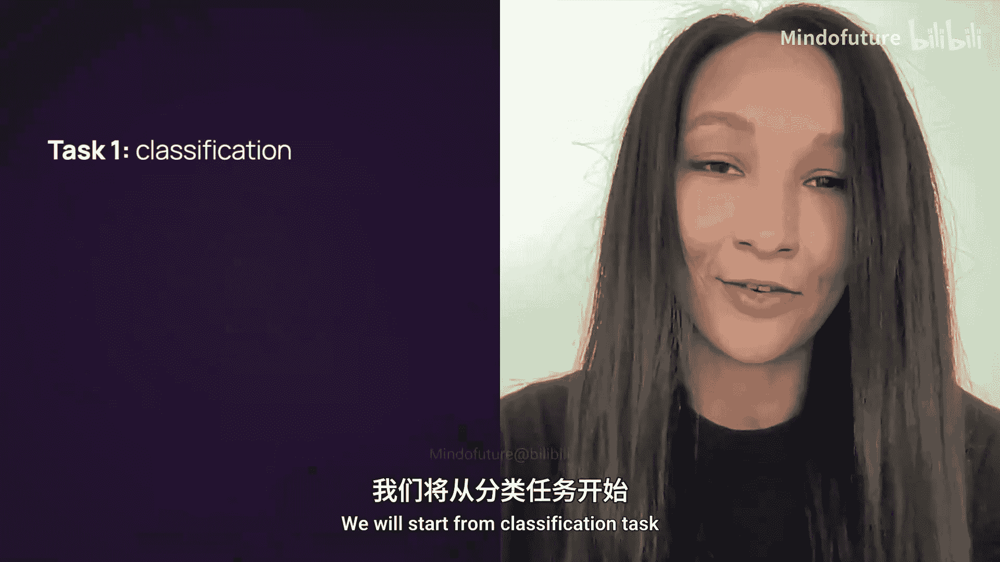
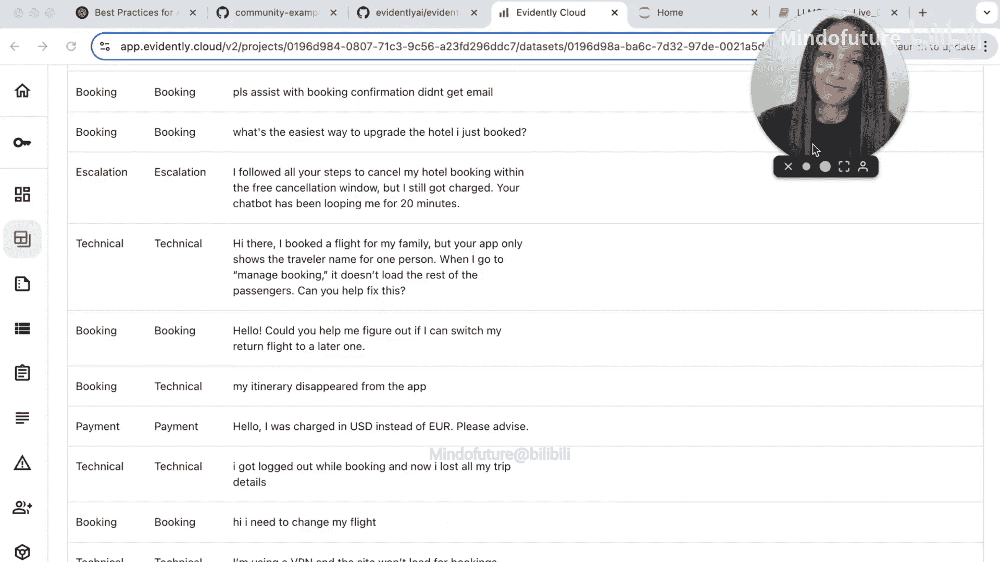

# 006：评估大语言模型在分类任务上的表现 🧪




在本节课中，我们将学习如何为大语言模型（LLM）构建和评估一个分类任务应用。我们将从一个具体的场景出发：为一家旅游公司构建一个聊天机器人，用于对用户关于预订和取消的各类消息进行分类。我们将首先使用传统的机器学习模型（逻辑回归）建立一个性能基线，然后应用大语言模型进行零样本分类，并使用Evidently工具来评估和比较两者的表现。

## 准备工作 💻

首先，我们需要在本地Jupyter Notebook环境中进行设置。本教程将使用OpenAI的API和Evidently评估工具，因此你需要准备好相应的API密钥并设置为环境变量。

以下是初始的导入和数据集加载步骤。

```python
import pandas as pd
from sklearn.model_selection import train_test_split
from sklearn.feature_extraction.text import CountVectorizer
from sklearn.linear_model import LogisticRegression
from sklearn.metrics import accuracy_score

# 加载数据集
df = pd.read_csv('your_dataset_url_here')
print(df.head())
```

我们的数据集包含两列：`text`（用户查询）和`label`（分类标签）。这是一个多分类问题，共有5个类别。数据集共有200行。

## 建立基线模型：逻辑回归 📈

上一节我们介绍了任务背景和数据集，本节中我们来看看如何建立一个传统的机器学习基线模型。

我们将数据集分割为训练集和测试集，使用词袋模型（CountVectorizer）将文本转换为特征向量，并训练一个逻辑回归模型。

```python
# 分割数据
X = df['text']
y = df['label']
X_train, X_test, y_train, y_test = train_test_split(X, y, test_size=0.1, random_state=42)

# 文本向量化
vectorizer = CountVectorizer()
X_train_vec = vectorizer.fit_transform(X_train)
X_test_vec = vectorizer.transform(X_test)

# 训练逻辑回归模型
model = LogisticRegression(random_state=42, max_iter=200)
model.fit(X_train_vec, y_train)

# 生成预测
y_train_pred = model.predict(X_train_vec)
y_test_pred = model.predict(X_test_vec)

# 计算准确率
train_accuracy = accuracy_score(y_train, y_train_pred)
test_accuracy = accuracy_score(y_test, y_test_pred)
print(f"训练集准确率: {train_accuracy}")
print(f"测试集准确率: {test_accuracy}")
```

模型在测试集上达到了约80%的准确率。为了更全面地评估模型性能，我们需要查看更详细的分类指标。

## 使用Evidently生成详细评估报告 📊

仅仅有准确率是不够的。为了深入理解模型在各类别上的表现（如精确率、召回率、F1分数）并分析错误，我们将使用Evidently生成一个完整的分类评估报告。

以下是构建和查看报告的步骤。

```python
from evidently import ColumnMapping
from evidently.report import Report
from evidently.metrics import ClassificationPreset

# 准备数据框用于Evidently
evidently_df = pd.DataFrame({
    'query': X_test.values,
    'prediction': y_test_pred,
    'target': y_test.values
})

# 定义列映射
column_mapping = ColumnMapping()
column_mapping.target = 'target'
column_mapping.prediction = 'prediction'
column_mapping.text_features = ['query']

# 创建并运行报告
report = Report(metrics=[ClassificationPreset()])
report.run(current_data=evidently_df, column_mapping=column_mapping)
report.show(mode='inline') # 在Notebook中内联显示报告
```

报告将展示包括混淆矩阵在内的多种指标，帮助我们清晰地看到模型在哪些类别上容易混淆。

## 将基线结果上传至Evidently Cloud ☁️

为了后续与LLM模型的结果进行比较，我们将这份基线报告上传到Evidently Cloud进行保存。

以下是上传代码。

```python
from evidently.cloud import CloudWorkspace, CloudClient

# 初始化客户端（API密钥已通过环境变量设置）
client = CloudClient()

# 创建或获取项目
project = client.create_project(project_name="classification-task-llm-course", organization_id="your_org_id")

# 上传报告和数据集
client.upload_report(project.id, report, include_data=True)
```

现在，你可以在Evidently Cloud的界面中查看这份基线报告和对应的数据集。

## 应用大语言模型进行零样本分类 🤖

接下来，我们尝试使用OpenAI的大语言模型来解决同样的分类问题。我们将编写一个提示词（Prompt），让模型根据描述对用户查询进行分类。

首先，我们设置OpenAI客户端并定义一个分类函数。

```python
from openai import OpenAI
import time

client_openai = OpenAI() # API密钥通过环境变量设置

def classify_with_llm(client, model_name, input_text):
    """
    使用指定的OpenAI模型对输入文本进行分类。
    """
    system_prompt = """
    你是一个客户支持助手，专门对与预订相关的支持消息进行分类。
    请将消息分类到以下类别之一：
    1. booking: 与创建、修改或确认预订相关的问题。
    2. payment: 与支付、退款、发票相关的问题。
    3. policy: 与取消政策、条款与条件相关的问题。
    4. technical: 与网站、应用程序技术问题相关的问题。
    5. escalation: 需要人工客服介入的复杂或投诉问题。
    请只返回类别名称，不要返回其他任何内容。
    """
    try:
        response = client.chat.completions.create(
            model=model_name,
            messages=[
                {"role": "system", "content": system_prompt},
                {"role": "user", "content": input_text}
            ],
            temperature=0.0
        )
        return response.choices[0].message.content.strip()
    except Exception as e:
        print(f"处理查询时出错: '{input_text}'. 错误: {e}")
        return "error"

# 在单个样本上测试
test_query = X_test.values[0]
prediction = classify_with_llm(client_openai, "gpt-4o-mini", test_query)
print(f"查询: '{test_query}'")
print(f"预测类别: {prediction}")
print(f"真实类别: {y_test.values[0]}")
```

测试成功后，我们将此函数应用于整个测试集。

```python
# 为测试集所有样本生成LLM预测（这可能需要一些时间）
llm_predictions_gpt4o_mini = []
for query in X_test.values:
    pred = classify_with_llm(client_openai, "gpt-4o-mini", query)
    llm_predictions_gpt4o_mini.append(pred)
    time.sleep(0.1) # 避免触发速率限制

# 计算准确率
llm_accuracy_gpt4o_mini = accuracy_score(y_test.values, llm_predictions_gpt4o_mini)
print(f"GPT-4o-mini 零样本分类准确率: {llm_accuracy_gpt4o_mini}")
```

我们还可以尝试其他模型，例如`gpt-4.1`，以比较性能。

```python
llm_predictions_gpt41 = []
for query in X_test.values:
    pred = classify_with_llm(client_openai, "gpt-4.1", query)
    llm_predictions_gpt41.append(pred)
    time.sleep(0.1)

llm_accuracy_gpt41 = accuracy_score(y_test.values, llm_predictions_gpt41)
print(f"GPT-4.1 零样本分类准确率: {llm_accuracy_gpt41}")
```

## 比较所有模型并做出决策 ⚖️

现在，我们有了三个模型的预测结果：逻辑回归基线、GPT-4o-mini和GPT-4.1。我们将为两个LLM模型的结果创建Evidently报告，并上传到云端。

以下是创建和上传LLM模型报告的代码。

```python
# 为 GPT-4o-mini 结果创建报告
df_llm_mini = pd.DataFrame({
    'query': X_test.values,
    'prediction': llm_predictions_gpt4o_mini,
    'target': y_test.values
})
report_llm_mini = Report(metrics=[ClassificationPreset()])
report_llm_mini.run(current_data=df_llm_mini, column_mapping=column_mapping)

# 为 GPT-4.1 结果创建报告
df_llm_41 = pd.DataFrame({
    'query': X_test.values,
    'prediction': llm_predictions_gpt41,
    'target': y_test.values
})
report_llm_41 = Report(metrics=[ClassificationPreset()])
report_llm_41.run(current_data=df_llm_41, column_mapping=column_mapping)

# 上传到Evidently Cloud
client.upload_report(project.id, report_llm_mini, include_data=True, tags=["GPT-4o-mini"])
client.upload_report(project.id, report_llm_41, include_data=True, tags=["GPT-4.1"])
```

所有报告上传后，我们可以在Evidently Cloud的“比较”界面中并排查看它们。

在比较界面中，你可以：
*   并排查看所有模型的关键指标（准确率、精确率、召回率、F1分数）。
*   快速识别哪个模型在整体或特定类别上表现最佳。
*   点击进入单个报告，查看详细的混淆矩阵和错误分类的样本。
*   在数据集视图中检查具体的错误案例，为后续的提示词优化或模型选择提供依据。

通过对比，你可能会发现，虽然GPT-4.1可能更强大，但在这个特定任务上，GPT-4o-mini已经提供了与基线模型相当甚至更好的性能，同时成本更低。这有助于你根据质量、成本和延迟来权衡，为实际应用选择最合适的方案。

## 总结 🎯

本节课中我们一起学习了如何为文本分类任务构建并系统化地评估不同解决方案。
1.  **建立基线**：我们使用传统的逻辑回归模型和词袋特征建立了一个性能基线，并通过Evidently获得了详细的评估报告。
2.  **应用LLM**：我们编写提示词，利用OpenAI的GPT模型进行了零样本分类，并评估了其性能。
3.  **系统化比较**：我们将所有模型（逻辑回归、GPT-4o-mini、GPT-4.1）的结果上传至Evidently Cloud，利用其比较功能，从多个维度客观地评估了哪种方法更适合我们的业务场景。



这种方法不仅适用于分类任务，也可以扩展到其他LLM应用场景，帮助你数据驱动地做出技术决策。