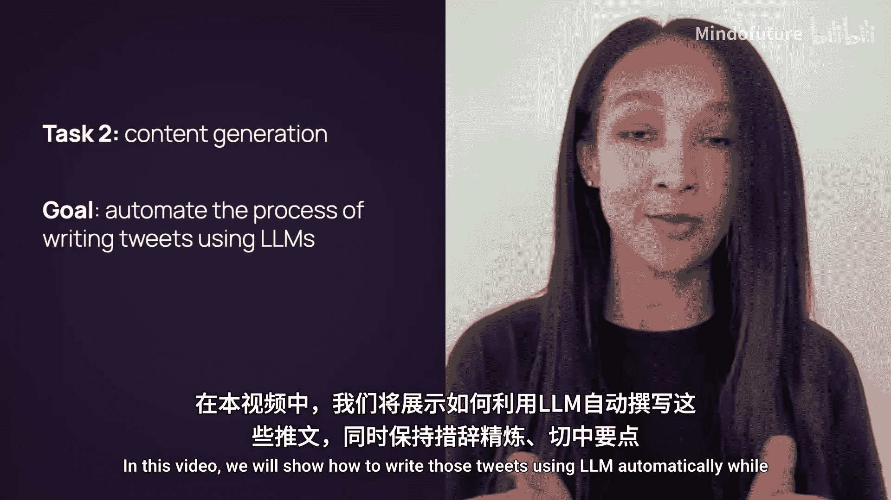
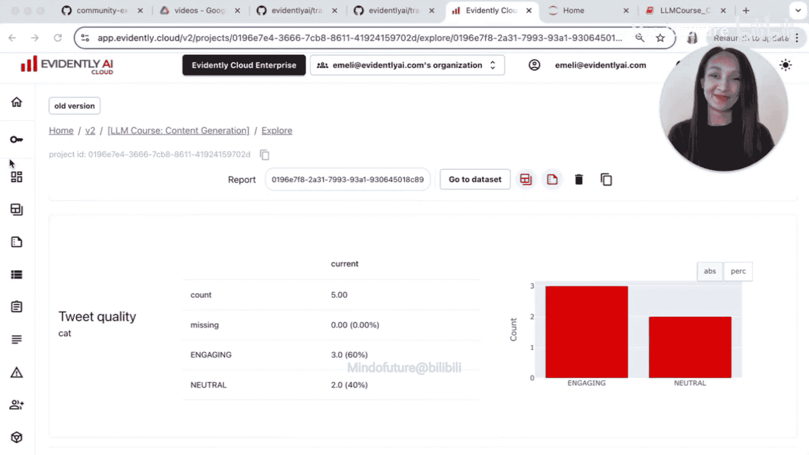

# 007：追踪与实验设计 🧪




在本节课中，我们将学习如何利用大语言模型自动生成产品更新推文，并通过追踪和实验设计来评估和优化生成内容的质量，确保其清晰、有趣且值得阅读。

---

## 概述

想象一下，你在一个产品团队工作，职责之一是撰写推文来分享更新和解释功能。你希望这些推文清晰、有趣且值得一读。本教程将展示如何利用LLM自动生成此类推文，同时保持其风格鲜明、切中要点。我们还将演示如何根据目标评估输出结果，以便通过迭代获得所需内容。

---

## 环境准备与基础生成

首先，我们需要设置环境并进行基础的文本生成。我们将使用Jupyter Notebook或Google Colab来运行本教程。

### 导入库与设置

我们首先导入必要的库，并设置OpenAI API密钥。

```python
import openai
import pandas as pd

# 设置OpenAI API密钥（建议设置为环境变量）
openai.api_key = os.getenv('OPENAI_API_KEY')
```

### 定义主题与基础生成函数

作为内容创作者，我倾向于先确定想要讨论的主题，然后让LLM为我撰写完整的推文。我选择了五个与软件工程、测试和评估相关的技术主题。

以下是主题列表：
*   测试在AI工程中和在开发中一样重要。
*   CI/CD同样适用于AI领域。
*   监控AI模型与监控传统软件不同。
*   数据漂移是生产环境中模型性能下降的主要原因。
*   Evidently是一个用于进行LLM测试的强大工具。

现在，让我们创建一个基础函数来生成推文。

```python
def basic_generation(topic, model="gpt-3.5-turbo"):
    """
    基础生成函数：根据主题生成一段文字。
    """
    response = openai.ChatCompletion.create(
        model=model,
        messages=[
            {"role": "user", "content": f"写一段关于 {topic} 的文字。"}
        ]
    )
    return response.choices[0].message.content

# 测试生成函数
sample_topic = topics[-1]  # 使用最后一个主题
tweet = basic_generation(sample_topic)
print(tweet)
```

运行后，我们得到了关于“Evidently”主题的一段文字。输出内容合理，表明这个基础提示词可以应用于所有主题，以生成初步的推文草稿。

---

## 引入追踪与实验设计

上一节我们介绍了基础的文本生成。本节中，我们将引入“追踪”概念，并设计实验来系统性地评估和优化生成的推文。

### 什么是追踪？

追踪是一个非常有用工具，它可以记录函数或代码模块中发生的所有事情，以便后续通过查看追踪记录来理解记录到系统中的每一个细节。我们将使用Evidently AI推出的`Traly`库来实现追踪。

### 安装与导入

首先，需要安装`traly`库。然后导入必要的模块。

```python
# 安装命令：pip install traly
from traly import Tracing, trace_event
from evidently.cloud import CloudWorkspace
from evidently import ColumnMapping
from evidently.report import Report
from evidently.metrics import *
from evidently.descriptors import *
```

### 初始化云工作空间与追踪

我们需要连接到Evidently Cloud，创建一个项目，并初始化追踪。

```python
# 初始化Evidently Cloud客户端
workspace = CloudWorkspace()
project = workspace.create_project("content_generation")

# 初始化追踪
tracing = Tracing(
    project_id=project.id,
    experiment_name="basic_generation_experiment",
    api_key=os.getenv('EVIDENTLY_API_KEY')
)
```

初始化后，你可以在Evidently Cloud的对应项目中看到新创建的追踪数据集（目前为空）。

### 包装生成函数以启用追踪

现在，我们使用`@trace_event`装饰器来包装之前的基础生成函数，以便自动记录所有输入参数和输出结果。

```python
@trace_event
def basic_generation_traced(topic, model="gpt-3.5-turbo", instructions=""):
    """
    启用追踪的生成函数。
    """
    response = openai.ChatCompletion.create(
        model=model,
        messages=[
            {"role": "user", "content": f"写一段关于 {topic} 的文字。"}
        ]
    )
    return response.choices[0].message.content

# 为所有主题生成推文（第一轮实验）
all_tweets_v1 = []
for topic in topics:
    tweet = basic_generation_traced(topic, model="gpt-3.5-turbo", instructions="")
    all_tweets_v1.append(tweet)
```

生成完成后，你可以在Evidently Cloud的追踪数据集中查看所有记录，包括每次调用的主题、模型、指令和生成的推文。

---

## 加载追踪数据并构建评估报告

我们已经生成了第一轮推文并记录了数据。接下来，我们需要评估这些推文的质量。我们将从云平台加载追踪数据，并利用Evidently的报告功能进行评估。

### 从云平台加载数据

首先，从追踪数据集中获取数据集ID，然后将其加载到Notebook中进行分析。

```python
# 从Evidently Cloud界面获取数据集ID
dataset_id = "your_tracing_dataset_id_here"

# 从云平台加载数据集
dataset = workspace.load_dataset(dataset_id)
df = dataset.as_dataframe()
print(df.head())
```

加载的数据集包含了所有输入参数和输出结果，并且Evidently已自动为其生成了数据定义（如识别文本列、分类列等）。

### 定义评估指标（描述符）

为了评估推文质量，我们需要定义一些具体的指标。我们将创建三个描述符：
1.  **文本长度**：确保推文符合平台字数限制。
2.  **情感倾向**：确保推文保持中立或积极。
3.  **互动性判断**：使用一个自定义的LLM作为“裁判”，判断推文是否具有互动性。

以下是创建“互动性”LLM裁判描述符的代码：

```python
# 定义互动性分类的提示词模板
engagement_template = """
你是一个社交媒体内容评估员。请判断以下推文是否具有互动性（Engaging）。
互动性的推文通常：提出一个问题、引发思考、包含一个有趣的见解、呼吁行动、或使用生动语言。
非互动性（Neutral）的推文通常：只是陈述事实、过于泛泛、缺乏焦点或个性。
如果你不确定，请选择“Neutral”。

推文：{text}

请只回复“Engaging”或“Neutral”。
"""

# 创建LLM评估描述符
engagement_descriptor = LLMEvaluationDescriptor(
    name="engagement",
    display_name="推文互动性",
    prompt_template=engagement_template,
    target_category="Engaging",
    non_target_category="Neutral"
)

# 创建其他描述符
length_descriptor = TextLengthDescriptor(column_name="result")
sentiment_descriptor = SentimentDescriptor(column_name="result")

# 描述符列表
descriptors = [length_descriptor, sentiment_descriptor, engagement_descriptor]
```

### 应用描述符并生成报告

将描述符应用到数据集上，计算各项指标，并生成评估报告。

```python
# 将描述符应用到数据集
dataset = dataset.with_descriptors(descriptors)
df_with_metrics = dataset.as_dataframe()
print(df_with_metrics[['topic', 'result', 'text_length', 'sentiment', 'engagement']])

# 创建并运行报告
report = Report(metrics=[
    ColumnSummaryMetric(column_name='text_length'),
    ColumnSummaryMetric(column_name='sentiment'),
    ColumnSummaryMetric(column_name='engagement'),
])
report.run(current_data=df_with_metrics, reference_data=None)
workspace.add_report(project.id, report, "experiment_1_basic_generation")
```

报告生成后，可以上传到Evidently Cloud。查看报告后发现，第一轮生成的推文在“互动性”上得分均为“Neutral”，这意味着我们需要改进。

---

## 迭代优化：改进提示词与模型

根据第一轮评估的结果，我们需要优化生成策略。我们将进行两轮迭代：改进提示词和模型，然后尝试对已有推文进行改写。

### 第二轮实验：使用更好的提示词和模型

我们更新提示词，赋予LLM更明确的角色和风格要求。

```python
@trace_event
def better_generation_traced(topic, model="gpt-4", instructions=""):
    """
    使用增强提示词进行生成。
    """
    enhanced_instructions = """
    你是一位拥有10年技术写作经验的主编，擅长为工程师撰写简洁、有吸引力且切中要点的内容。
    请基于以下主题撰写一条推文。
    """
    full_prompt = f"{enhanced_instructions}\n主题：{topic}"

    response = openai.ChatCompletion.create(
        model=model,
        messages=[
            {"role": "user", "content": full_prompt}
        ]
    )
    return response.choices[0].message.content

# 执行第二轮实验
all_tweets_v2 = []
for topic in topics:
    tweet = better_generation_traced(topic, model="gpt-4", instructions=enhanced_instructions)
    all_tweets_v2.append(tweet)
```

生成后，我们创建一个新的追踪数据集来记录这次实验，加载数据，应用相同的描述符进行评估，并生成第二份报告。结果可能显示互动性有所提升，但可能仍未达到理想状态。

### 第三轮实验：链式调用与改写

我们不再从零生成，而是尝试对第二轮中生成的推文进行改写，使其更加个性化和有趣。为此，我们需要初始化一个新的追踪会话。

```python
# 初始化一个新的追踪数据集用于链式调用实验
tracing_chain = Tracing(
    project_id=project.id,
    experiment_name="chain_generation_experiment",
    api_key=os.getenv('EVIDENTLY_API_KEY'),
    global_tracing=False # 不在同一全局上下文中
)

@trace_event
def rewrite_for_engagement(tweet):
    """
    改写推文以增强互动性。
    """
    rewrite_instructions = """
    你是一位Evidently的工程师，同样拥有丰富的技术写作经验。
    请将以下推文改写得更具互动性、更个人化、更有趣。保持积极说服性的语气，避免使用表情符号和话题标签。
    确保改写后的推文符合X平台的字数限制。
    """
    response = openai.ChatCompletion.create(
        model="gpt-4",
        messages=[
            {"role": "user", "content": f"{rewrite_instructions}\n原推文：{tweet}"}
        ]
    )
    return response.choices[0].message.content

# 使用第二轮的结果作为输入，进行第三轮实验
all_tweets_v3 = []
for previous_tweet in all_tweets_v2:
    new_tweet = rewrite_for_engagement(previous_tweet)
    all_tweets_v3.append(new_tweet)
```

同样，我们加载第三次实验的追踪数据，应用评估描述符（注意根据新的列名调整数据定义），并生成第三份报告。

---

## 实验结果分析与总结

完成所有实验后，我们可以在Evidently Cloud的仪表板中对比不同实验的结果。

### 在仪表板中查看对比

导航到项目的“Reports”部分，可以并排查看多份报告。重点关注以下指标的变化趋势：
*   **文本长度**：是否更接近理想的推文长度。
*   **情感倾向**：是否保持在中立或积极区间。
*   **互动性比例**：标记为“Engaging”的推文数量是否增加。

在最终的实验报告中，我们可能成功获得了数条被判定为“Engaging”的推文，这表明我们的迭代策略是有效的。

### 教程总结

在本节课中，我们一起学习了如何评估和优化LLM在内容生成任务上的表现。我们涵盖了以下核心步骤：

1.  **基础生成**：使用简单提示词启动内容生成流程。
2.  **引入追踪**：利用`Traly`库记录每次实验的输入和输出，确保过程可复现、可分析。
3.  **设计评估体系**：通过定义文本长度、情感、自定义LLM裁判等描述符，构建量化的内容质量评估标准。
4.  **迭代优化**：基于评估结果，通过改进提示词、升级模型、采用链式调用改写等策略，持续优化生成内容。
5.  **结果分析**：利用Evidently的报表和仪表板功能，直观对比不同实验方案的效果，做出数据驱动的决策。



通过这套方法，你可以在没有参考数据的情况下，为任何LLM内容生成任务（如营销文案、产品描述、邮件撰写等）建立自定义的评估和优化流程，从而高效地获得高质量的输出结果。