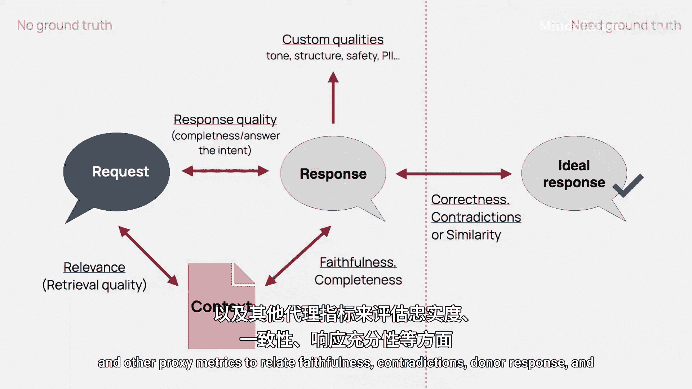

# 008：6.1 检索增强生成系统评估方法与指标详解 🧠

在本节课中，我们将要学习如何评估检索增强生成系统。我们将探讨RAG的核心概念、如何分别评估其检索和生成部分，以及如何有效地使用合成数据。本节是一个核心概念的理论介绍，我们还有一个单独的实践教程。

## 什么是RAG？🤔

RAG的核心思想是为大语言模型提供其在训练期间未学习到的知识访问权限。例如，如果你正在创建一个客户支持聊天机器人，你会让它访问你的帮助文章，以便系统可以利用这些信息来构建回答。

RAG由两部分组成：
*   **R** 代表**检索**：这是搜索答案的部分。
*   **G** 代表**生成**：这是LLM处理找到的信息以形成最终回答的部分。

当然，流程可以更复杂，例如可以重写查询、提供额外来源或多步骤处理。但本质上，这是一个两步工作流：**先查找，后生成**。

## 为何要分别评估？🔍

为了评估一个RAG系统，分别审视这两个部分通常是有意义的。
1.  首先，你需要确保**搜索功能正常工作**，能够找到应该找到的信息。
2.  其次，你需要确保能够**生成符合标准的回答**。

当然，你也可以只查看最终结果，并根据其正确性进行判断。但有时分别查看两部分有助于更有效地进行调试。例如，你可能会发现LLM在编造回答，实际上是因为你无法找到有助于回答查询的信息；或者你找到了信息，但LLM没有正确处理它。

上一节我们介绍了RAG的基本概念和评估思路，本节中我们来看看具体的评估方法。

## 评估检索部分 📚

检索评估不是一个新问题，信息检索领域已有数十年的历史，并有标准的评估方法。

### 基于基准数据集的评估

以下是标准做法：
*   创建一个**基准数据集**：对于每个查询，提供一组包含该查询答案的文档。
*   然后，你可以使用诸如 **Precision@K** 或 **Recall@K** 等指标来测试是否能实际找到这些文档。

一旦建立了这样的数据集，它实际上非常可重用。有了它，你就可以在无需额外成本或设置的情况下运行评估。然而，创建这些数据可能非常耗时。想象一下，如果你有一个问题，需要找到所有包含该问题答案的文档。如果你能做到，那很好。但有时你做不到，尤其是在实验不同分块策略时，甚至你寻找内容的定义也可能在变化。

### 基于人工标注的评估

另一种方法是**人工标注**。在这种情况下，你无需预先准备数据集，而是直接评估你得到的结果。许多公司，甚至谷歌，都采用这种方法。他们有成文的指南（长达150多页），向人工评估员解释如何评估搜索结果。你可以做类似的事情：查看给定查询检索到的每个文本块，并为其打上标签，如“相关”、“不相关”或“部分相关”，然后汇总多个查询的结果。然而，这是手动的，需要花费时间进行实际审查。

### 基于LLM的自动化评估

这里有一个有趣的转折：**你可以让LLM为你执行标注**。基本上，你可以创建一个LLM评判员来评估你检索到的文本块的相关性。搜索引擎最近也开始这样做。例如，微软有一篇关于必应如何做到这一点的论文。如果你采用这种方式，你可以运行大量自动化评估，然后汇总多个查询的结果。例如，检查**至少有一个相关结果被检索到的查询所占的比例**。

这种方法在运行实验时很有用，例如比较不同的向量数据库或搜索策略。在监控期间也很有用，例如，你可以查看是否存在相关性较低的查询，这可能指向你知识库中的空白。

此外，如果你的RAG系统只返回一个上下文（可能包含几个小文本块），你可以一起评估它们。基本上，你可以让LLM查看上下文并询问：“这个上下文中的信息是否足以回答用户提出的问题？”这将是一个**上下文质量评判员**。

## 评估生成部分 ✍️

现在让我们看看第二部分：生成。假设你找到了一些相关上下文，并将其传递给LLM以形成对用户查询的最终回答。现在你需要评估这个最终回答是否良好。根据你是在进行离线评估还是在线评估，有两种方法。

### 离线评估（实验或回归测试）

在进行实验或回归测试前的离线评估时，你可以使用通常的基准数据。在这种情况下，你创建包含预期问题和该问题良好答案的数据，然后将你的RAG系统给出的答案与这些预期答案进行比较。你可以使用语义相似度，或创建一个用于正确性的LLM评判员，或者专门为矛盾创建一个LLM评判员。这取决于你如何构建基准数据集。

创建这些测试数据集可能很耗时。但对于RAG，你实际上有一个捷径。在这种情况下，你已经有了一个知识库，你计划用它来创建你的RAG系统。你实际上可以**使用同一个知识库来创建你的基准数据集**。在这种情况下，你翻转这个过程：首先从这个知识库中提取文本块，然后让LLM根据这个上下文来构建可回答的问题。这样你就创建了问答对，之后你可以审查并创建你的基准数据。当然，这仍然需要一些人工整理，但比手动编写所有内容要快得多。

### 在线评估（生产环境）

现在，让我们谈谈当系统处于生产环境时的情况。在这种情况下，你没有参考答案，但你仍然可以评估相当多的事情。实际上，与许多其他LLM应用相比，RAG能评估的更多。使用RAG，你不仅有最终答案，还有用于构建这个答案的上下文。

以下是你可以查看的内容：
*   **忠实度/真实性**：你可以检查最终答案是否与检索到的上下文相矛盾。你可以创建一个LLM评判员，或者将语义相似度作为一个代理指标。
*   **完整性**：答案是否使用了上下文中的所有信息？
*   **帮助性**：它是否回答了用户的最终意图？
*   **语气/风格**：它是否符合你的企业指南和预期用例？
*   **结构性检查**：例如，验证你的答案是否在预期长度内，是否包含所有必要的免责声明，是否总是包含链接等等。这些是领域检查，因此很容易验证。

**补充说明**：由于RAG系统是面向外部的，进行一些压力测试或对抗性测试是有意义的。
*   你可以关注**质量**：例如，提出一些你知道知识库中没有答案的问题，然后检查LLM是否回答“我不知道”而不是编造答案。
*   或者你可以抛出一些已知的陷阱，例如关于已停产产品或某些过去产品版本的信息。
*   你还可以测试**越狱**。如果你的系统处理敏感数据，或者可能通过RAG系统访问到一些敏感信息，你绝对可以对此进行测试。

## 总结 📝

本节课中我们一起学习了如何评估RAG系统。总结一下，要评估一个RAG系统，你可以同时关注检索质量和生成质量，并分别评估它们。这在两种情况下对你都有意义。在两种情况下，你都可以对照基准数据进行评估，或者使用LLM评判员和其他代理指标来评估忠实度、矛盾、语气、回答长度等。

现在我们已经涵盖了一些理论，让我们在接下来的教程中看看如何将其应用到实践中。