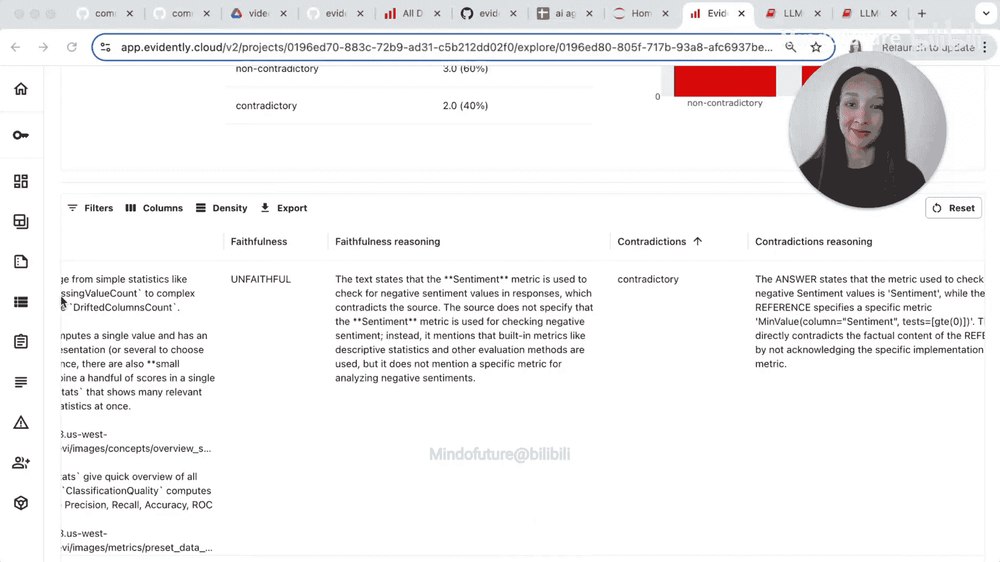

# 009：构建与评估检索增强生成系统 🧠


在本教程中，我们将学习如何构建一个检索增强生成系统，并重点评估其答案的**正确性**和**忠实性**。我们将从生成测试数据集开始，逐步搭建系统，最终通过自动化评估报告来检验系统质量，确保其在接触真实用户前达到可靠标准。


---

## 项目初始化与测试数据生成 📁

上一节我们介绍了本教程的目标，本节我们将从创建项目并生成测试数据开始。遵循测试驱动开发理念，我们首先需要一个地方来存储测试数据和后续的质量报告。

以下是创建项目并生成问答对测试数据的步骤：

1.  在Evidently界面中创建一个新项目，例如命名为“RAG_QA_Test”。
2.  在项目中，导航到“数据集”部分，点击“生成数据集”按钮。
3.  选择“从文档生成问答对”选项，因为我们正在构建RAG系统。
4.  上传你的文档（例如公司政策或支持指南的文本），并为数据集命名（如“test_qa”）。
5.  设置生成数量（例如10对），并使用集成的LLM（需配置API密钥）来生成问题及其对应的**参考答案**。由于答案直接来自文档，我们可以确信其正确性。
6.  生成后，手动审查并筛选出最相关、高质量的问答对，形成最终的测试数据集。

```python
# 示例：在代码中加载已生成的测试数据集
from evidently.client import EvidentlyClient

client = EvidentlyClient(api_key="your_api_key")
dataset = client.get_dataset(dataset_id="your_dataset_id")
test_df = dataset.to_pandas()
```

现在，我们拥有了一个包含`问题`和`参考答案`的测试数据集，为后续评估奠定了基础。

---

## 构建RAG系统 ⚙️

有了测试数据集后，本节我们来看看如何构建一个基础的检索增强生成系统。该系统主要包含三个部分：文档加载与向量化、相关性检索以及答案生成。

首先，我们需要导入必要的库并设置环境。

```python
import random
import requests
import time
import os
from langchain.document_loaders import TextLoader
from langchain.text_splitter import CharacterTextSplitter
from langchain.embeddings import OpenAIEmbeddings
from langchain.vectorstores import FAISS
from langchain.chat_models import ChatOpenAI

# 初始化客户端
openai_api_key = os.getenv("OPENAI_API_KEY")
embeddings = OpenAIEmbeddings(openai_api_key=openai_api_key)
llm = ChatOpenAI(model_name="gpt-3.5-turbo", openai_api_key=openai_api_key)
```

接下来，我们实现三个核心函数：

1.  **创建向量库**：从在线文档加载文本，分割成块，并生成嵌入向量。
    ```python
    def create_vector_store(doc_url):
        # 下载文档内容
        response = requests.get(doc_url)
        text = response.text
        
        # 分割文本
        text_splitter = CharacterTextSplitter(chunk_size=1000, chunk_overlap=200)
        docs = text_splitter.split_text(text)
        
        # 生成向量存储
        vectorstore = FAISS.from_texts(docs, embeddings)
        return vectorstore
    ```

2.  **检索相关上下文**：根据用户查询，从向量库中查找最相似的文本块。
    ```python
    def search_documents(query, vectorstore, k=5):
        # 执行相似性搜索
        docs = vectorstore.similarity_search(query, k=k)
        # 合并检索到的文本块作为上下文
        context = "\n".join([doc.page_content for doc in docs])
        return context
    ```

3.  **生成答案**：结合检索到的上下文和问题，使用LLM生成最终答案。
    ```python
    def generate_response(question, context, model="gpt-3.5-turbo"):
        prompt = f"""请基于以下上下文回答问题。如果上下文不包含答案，请说“根据上下文无法回答”。
        上下文：{context}
        问题：{question}
        答案："""
        response = llm.predict(prompt)
        return response
    ```

系统搭建完成后，我们可以使用测试数据集中的问题来运行它，生成`检索上下文`和`生成答案`，为评估做好准备。

---

## 评估RAG系统：正确性与忠实性 📊

上一节我们构建了RAG系统，本节中我们来看看如何系统地评估它的输出质量。我们将重点关注两个核心维度：**正确性**（答案是否准确）和**忠实性**（答案是否严格基于检索到的上下文）。

我们不依赖耗时的手动检查，而是利用Evidently的LLM评估功能来自动化这个过程。以下是评估步骤：

1.  **准备评估数据集**：将测试数据集中的`问题`、`参考答案`与RAG系统生成的`上下文`和`生成答案`组合在一起。
    ```python
    # 假设 test_df 包含‘question’和‘reference_answer’
    contexts = []
    generated_answers = []
    
    for q in test_df['question']:
        ctx = search_documents(q, vectorstore)
        ans = generate_response(q, ctx)
        contexts.append(ctx)
        generated_answers.append(ans)
    
    test_df['context'] = contexts
    test_df['generated_answer'] = generated_answers
    ```

2.  **定义评估指标（Judges）**：
    *   **忠实性评估**：使用预置的`FaithfulnessLMEvaluation`，检查`生成答案`是否忠于`检索上下文`，防止幻觉。
    *   **正确性/一致性评估**：创建一个自定义的`ContradictionCheck`，比较`生成答案`与`参考答案`在语义上是否矛盾。
        ```python
        from evidently.metrics.llm import FaithfulnessLMEvaluation, CustomLMEvaluation
        
        contradiction_prompt = """
        请判断“生成答案”与“参考答案”在语义上是否矛盾。
        仅从以下选项中选择一个作为最终判断：
        - contradictory (矛盾)
        - non-contradictory (不矛盾)
        - unknown (无法判断)
        
        参考答案：{reference_answer}
        生成答案：{generated_answer}
        判断：
        """
        
        contradiction_check = CustomLMEvaluation(
            name="contradiction_check",
            prompt_template=contradiction_prompt,
            choices=["contradictory", "non-contradictory", "unknown"]
        )
        ```

3.  **生成评估报告**：在数据集上运行这些评估指标，并生成可视化报告。
    ```python
    from evidently.report import Report
    from evidently.metrics.llm import LLMEvaluationResults
    
    report = Report(metrics=[FaithfulnessLMEvaluation(), contradiction_check])
    report.run(current_data=test_df)
    
    # 将报告保存或上传至Evidently Cloud进行查看
    report.save_html("rag_evaluation_report.html")
    ```

报告将清晰展示有多少答案是不忠实的或与参考答案矛盾的，并可以按这些指标排序，方便我们快速定位问题案例。

---

## 分析与迭代 🔄

获得评估报告后，本节我们将学习如何分析结果并指导系统优化。报告不仅提供总体统计，更是我们调试和改进的路线图。

以下是基于报告结果可以采取的后续步骤：

1.  **定位问题**：在Evidently报告中，点击表格表头，按“忠实性”或“矛盾性”排序，快速找到失败的案例。
2.  **深入分析**：逐个检查失败案例。例如，一个“不忠实”的答案可能源于检索到了不相关的上下文，或者LLM忽略了上下文而进行了虚构。
3.  **提出假设并测试**：根据分析形成假设。例如：
    *   **假设1**：检索到的文档块（chunk）数量（k值）不合适。
    *   **假设2**：文本分割时块大小（chunk_size）或重叠区（overlap）需要调整。
    *   **假设3**：提示词（prompt）需要优化以更强调基于上下文回答。
4.  **迭代优化**：调整上述参数，重新运行RAG系统生成答案，并再次执行评估。比较不同参数配置下的评估报告，选择质量最高的配置。

通过这种“构建-评估-分析-迭代”的循环，你可以数据驱动地优化RAG系统的各个组件，从而在部署前构建出最可靠的版本。

---

## 总结 🎯

本节课中我们一起学习了构建和评估检索增强生成系统的完整流程。

我们首先使用Evidently生成了高质量的问答对测试数据集。接着，我们构建了一个包含文档检索与答案生成的基础RAG系统。然后，我们引入了**忠实性**和**正确性**作为核心评估维度，并利用自动化评估工具生成了详细的质量报告。最后，我们探讨了如何根据报告分析问题并迭代优化系统。



掌握这套方法，你可以在将RAG系统交付给真实用户之前，系统地验证和提升其可靠性，确保它能够提供既准确又忠于源信息的回答。