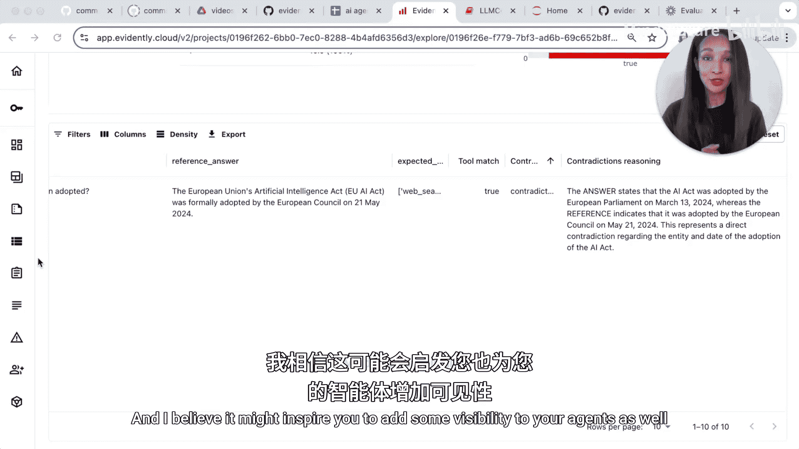

# 010：构建与评估人工智能体 🛠️


在本节课中，我们将学习如何评估一个使用工具（如文件存储、网络搜索或计算机操作）的人工智能体。你将构建一个模拟的AI代理，生成一个小型测试集，并逐步学习如何评估AI代理回答的质量。同时，我们还将测量AI代理的实际行为，例如它执行了多少步骤、使用了哪些工具以及消耗了多少内容。总的来说，目标是使代理的行为变得合理且可衡量。

## 准备工作 🛠️

上一节我们介绍了课程目标，本节中我们来看看如何搭建评估环境。我们将使用OpenAI的Agents库来构建代理，并使用Evidently AI进行追踪和评估。

首先，需要安装必要的库。如果你之前没有使用过，请先安装它们。

```python
# 导入必要的库
from agents import AgentRunner, WebSearchTool
from evidently import trace_it
from evidently.mouth import *  # 假设这是导入Evidently相关模块的示意代码
import openai
```

接下来，创建客户端实例。

```python
# 创建Evidently客户端和OpenAI客户端
evidently_client = ...  # 初始化Evidently客户端
openai_client = openai.OpenAI(api_key="your_api_key")
```

## 构建AI代理 🤖

现在，让我们构建一个简单的AI代理。我们的主要目的是评估，因此代理的功能会保持简洁。

```python
# 创建一个AI代理
agent = AgentRunner(
    name="assistant",
    instructions="你是一个乐于助人的助手。",
    model="gpt-4",
    tools=[WebSearchTool()]  # 允许代理使用网络搜索工具
)
```

代理构建完成后，我们可以进行一次试运行，以确保其正常工作。

```python
# 进行一次试运行（注意在Jupyter Notebook中使用异步模式）
question = "伦敦今天的天气怎么样？"
result = await agent.run(question, sync_mode=False)  # 使用异步模式
print(result.final_output)
```

运行后，我们可以查看结果对象，它包含了许多有用信息，如最终答案、使用的工具、消耗的令牌数等。

```python
# 打印代理响应的详细信息
print(f"最终答案: {result.final_output}")
print(f"使用的工具: {result.tools_used}")
print(f"输入令牌数: {result.usage.input_tokens}")
print(f"输出令牌数: {result.usage.output_tokens}")
```

## 准备测试数据集 📊

为了系统性地评估代理，我们需要一个包含问题和参考答案的测试集。关键在于，对于某些问题，代理可能需要使用网络搜索工具，而对于另一些则不需要。我们将评估代理的答案是否正确，以及工具使用是否恰当。

以下是测试数据集的一个示例：

```python
# 示例测试数据集
questions = [
    "什么是Hugging Face？",
    "ChatGPT的最新版本是什么？",
    "AI法案是什么时候通过的？"
]
reference_answers = [
    "Hugging Face是一个专注于自然语言处理的AI社区和平台。",
    "ChatGPT的最新版本需要查询网络获取。",
    "AI法案于2024年3月通过。"
]
expected_tools = [
    [],  # 回答“什么是Hugging Face？”可能不需要工具
    ["web_search"],  # 回答“ChatGPT的最新版本是什么？”需要网络搜索
    ["web_search"]   # 回答“AI法案是什么时候通过的？”需要网络搜索
]
```

我们可以将这些数据整理成一个Pandas DataFrame，以便后续处理。

```python
import pandas as pd

validation_df = pd.DataFrame({
    'question': questions,
    'reference_answer': reference_answers,
    'expected_tools': expected_tools
})
```

## 追踪代理行为 🔍

为了评估代理，我们需要追踪它在回答每个问题时的行为。我们将使用装饰器来记录关键信息。

首先，定义一个函数来向代理提问并收集统计信息。

```python
@trace_it
async def ask_question(question: str):
    """
    向代理提问并收集响应的统计信息。
    """
    try:
        response = await agent.run(question, sync_mode=False)
        stats = extract_agent_stats(response)
        return response.final_output, stats
    except Exception as e:
        raise e
```

接下来，定义一个函数从代理的响应中提取关键统计信息，如令牌使用情况和工具列表。

```python
@trace_it
def extract_agent_stats(response):
    """
    从代理响应中提取统计信息。
    """
    total_input_tokens = 0
    total_output_tokens = 0
    tools_used = []
    
    for step in response.steps:
        total_input_tokens += step.usage.input_tokens
        total_output_tokens += step.usage.output_tokens
        if step.tool_used:
            tools_used.append(step.tool_used)
    
    stats = {
        'input_tokens': total_input_tokens,
        'output_tokens': total_output_tokens,
        'tools_used': list(set(tools_used)),  # 去重
        'steps_taken': len(response.steps)
    }
    return stats
```

## 运行评估并生成报告 📈

现在，我们可以使用测试数据集来运行评估。首先，向代理提问所有问题并收集结果。

```python
# 运行评估
results = []
for q in validation_df['question']:
    answer, stats = await ask_question(q)
    results.append({
        'question': q,
        'generated_answer': answer,
        **stats
    })

# 将结果转换为DataFrame
results_df = pd.DataFrame(results)
```

然后，将生成的结果与验证数据集合并，以便进行对比分析。

```python
# 合并结果和验证数据
evaluation_df = pd.merge(results_df, validation_df, on='question', how='left')
```

接下来，定义评估标准。我们将检查两个方面：
1.  **工具使用是否正确**：代理是否使用了预期的工具。
2.  **答案是否矛盾**：生成的答案与参考答案是否存在矛盾。

以下是定义评估标准的代码：

```python
# 定义“答案无矛盾”评估标准
contradiction_check = PromptTemplate(
    id="contradiction_check",
    template="判断以下两个陈述是否相互矛盾。陈述A: {reference_answer}。陈述B: {generated_answer}。如果矛盾，返回True，否则返回False。"
)

# 定义“工具匹配”评估标准
tool_match_check = ItemMatchDescriptor(
    search_in='tools_used',  # 在‘tools_used’列中搜索
    expected_items='expected_tools',  # 预期的工具列表
    match_all=True  # 要求匹配所有预期工具
)

# 组合评估标准
descriptors = [tool_match_check, contradiction_check]
```

最后，使用Evidently生成评估报告。

```python
# 创建评估数据集
eval_dataset = EvaluationDataset(
    data=evaluation_df,
    data_definition=DataDefinition(),
    descriptors=descriptors
)

# 生成报告
report = eval_dataset.generate_report()
report.upload_to_project(project_id="your_project_id")
```

报告生成后，你可以在Evidently的界面中查看详细结果，包括哪些问题的工具使用不正确，哪些答案存在矛盾，并可以深入查看具体的追踪信息以进行问题诊断。

## 总结 📝

本节课中，我们一起学习了如何构建和评估一个使用工具的人工智能体。我们首先搭建了评估环境并构建了一个简单的AI代理。然后，我们准备了测试数据集，定义了评估标准，并通过追踪代理行为来收集关键指标。最后，我们使用Evidently生成了详细的评估报告，从而能够量化代理的表现并识别需要改进的领域。



通过本教程，你应该能够为自己的AI代理添加可见性和可衡量性，从而更好地理解和优化其行为。