# 1：如何注册免费生成式AI训练营 🚀

在本教程中，我们将一步步学习如何注册ExamPro提供的免费生成式AI训练营。整个过程从访问注册页面开始，到完成账户创建与信息填写结束，无需支付任何费用。

## 访问注册页面

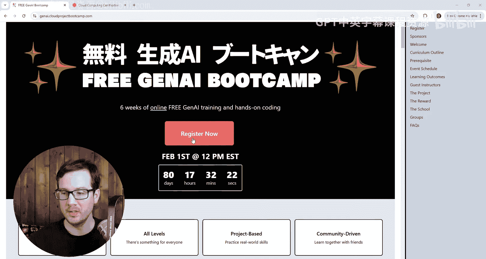

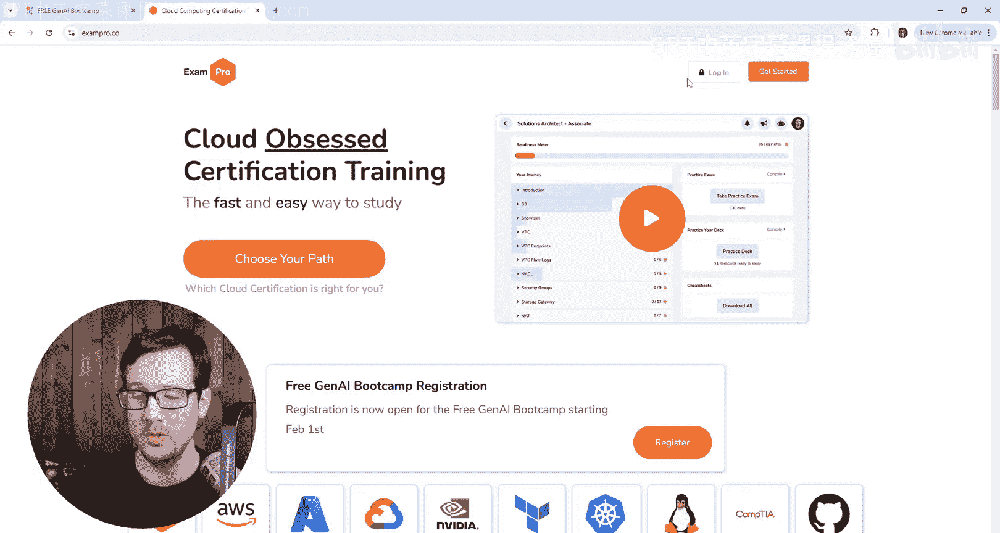

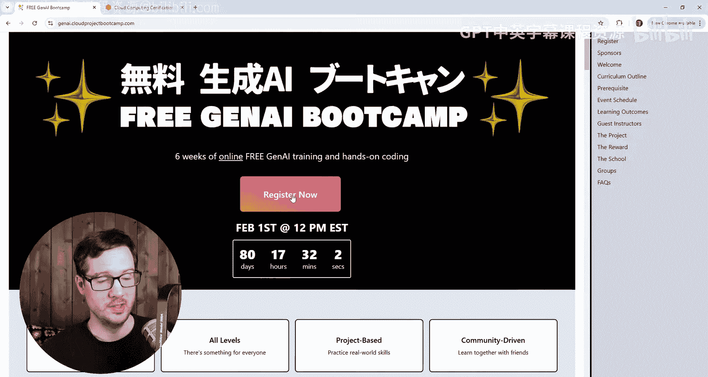

首先，你需要访问训练营的官方注册页面。网址是 `jennyi cloud project bootc com`。你也可以通过ExamPro的主网站进行注册。

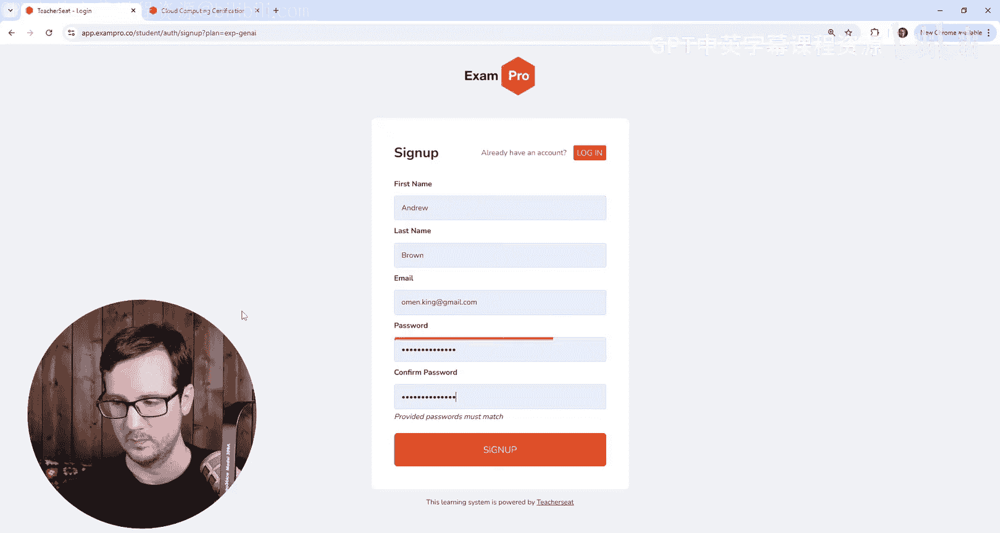

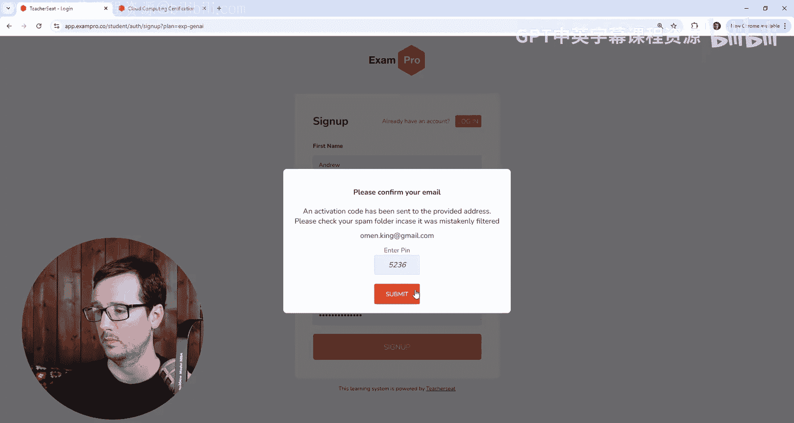

如果你已有ExamPro账户，可以直接登录。本教程将演示如何从头创建一个新账户。

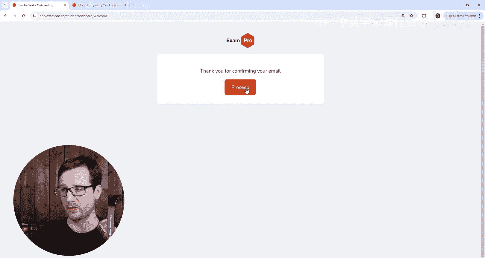

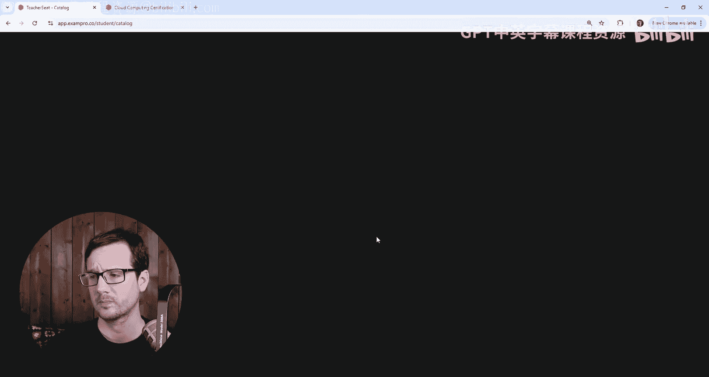

无论点击页面上的哪个注册链接，最终都会跳转到同一个注册表单。

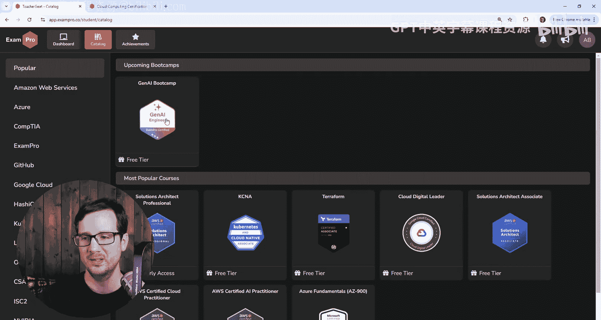

## 创建新账户

点击“立即注册”按钮。确认页面顶部的计划名称显示为“EXP Jennyi”，以确保进入正确的注册流程。

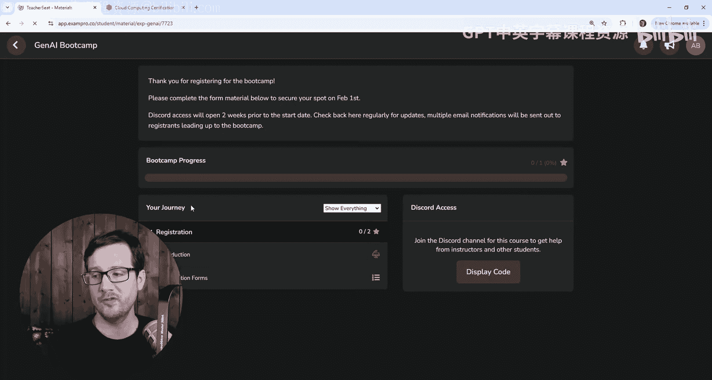

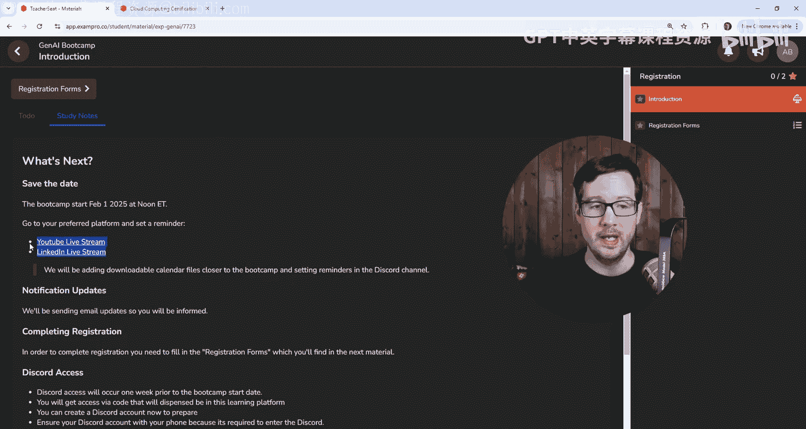

接下来，使用一个有效的电子邮箱地址创建新账户。建议使用个人邮箱以便接收相关通知。

在密码设置环节，请确保两次输入的密码完全一致。系统会进行验证。

账户创建后，系统会向你的邮箱发送一个验证码（PIN）。你需要登录邮箱查收这封邮件。

将收到的PIN码输入到注册页面的对应位置，然后点击提交。

验证成功后，页面会提示“感谢确认，请继续”。你可以选择偏好的界面主题（例如深色模式）。

## 激活训练营计划

注册完成后，页面可能不会直接跳转到训练营计划。你可以在网站首页或“Bootcamp”栏目下找到名为“Free GenAI Bootcamp”的计划。

点击进入该计划详情页。你需要在此页面确认接受价格为 **$0.00** 的订单。**请注意，此过程无需输入任何信用卡信息。**

确认后，即可正式加入生成式AI训练营。

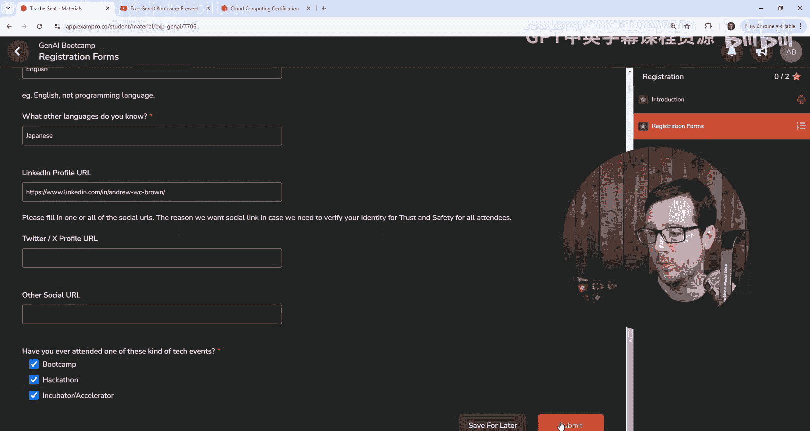

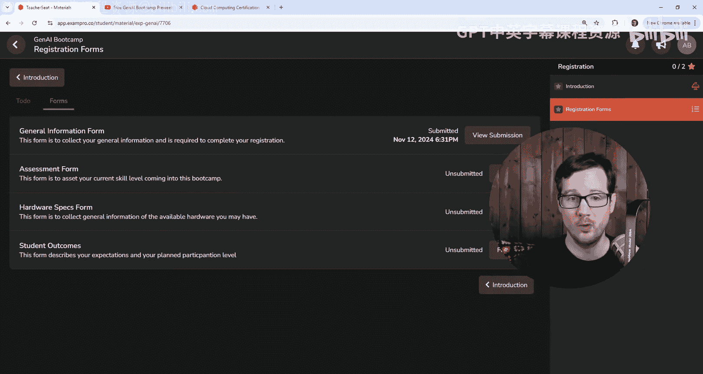

## 完成注册表单

成功加入训练营后，为了完善注册信息，你需要填写一系列表单。以下是需要完成的四个表单及其简要说明。

### 1. 基本信息表单
此表单用于收集你的个人与职业背景信息。
*   **公司/组织与职位**：填写你当前的就职信息。
*   **经验水平**：选择最符合你当前职业水平的选项。
*   **时区**：根据你所在的地理位置选择对应的时区，重点是时区偏移量（如UTC-5）。
*   **国家/地区**：从列表中选择你所在的地区。
*   **语言技能**：告知我们你掌握的语言，这有助于我们未来开发多语言学习应用。
*   **社交媒体资料**：**必须至少提供一项**（如LinkedIn、Twitter等）。这主要用于建立信任与安全保障，确保账户可追溯。这些信息也便于讲师在与你交流前了解背景。

### 2. 技能评估表单
此表单用于了解你在相关技术领域的熟练程度。
*   请根据你的实际情况，对以下技能进行评级：
    *   容器技术（如Docker）
    *   AWS云服务
    *   GCP（Google云平台）
    *   Python编程
    *   硬件知识
    *   机器学习（ML）
    *   前端开发
    *   后端开发
*   你还可以填写已获得的相关认证（如AI-900、AZ-900等）。

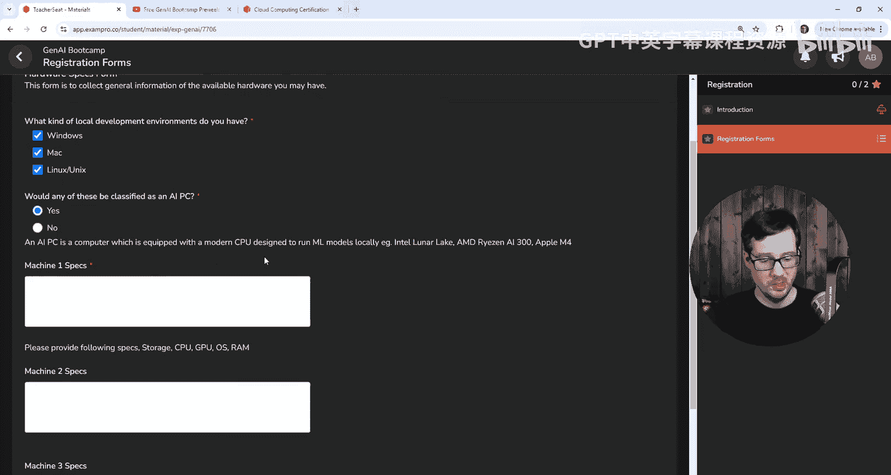

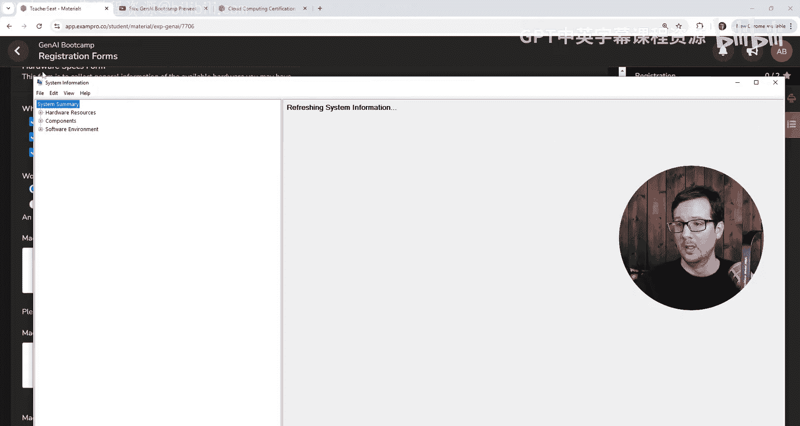

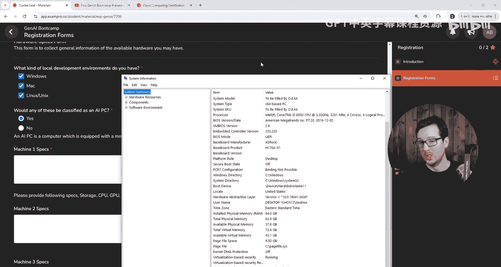

### 3. 硬件配置表单
此表单用于收集你本地机器的硬件信息，因为课程不仅涉及云平台，也可能包含本地环境操作。
*   请选择你使用的操作系统类型（Windows, macOS, Linux）。
*   **必须至少填写一项设备的详细配置**，包括：
    *   操作系统版本（如Windows 10）
    *   显卡型号（如NVIDIA RTX 3060）
    *   CPU型号与代际（如Intel Core i5-6500）
    *   内存大小（如64 GB RAM）
*   了解你的硬件配置有助于我们提供更具针对性的指导。

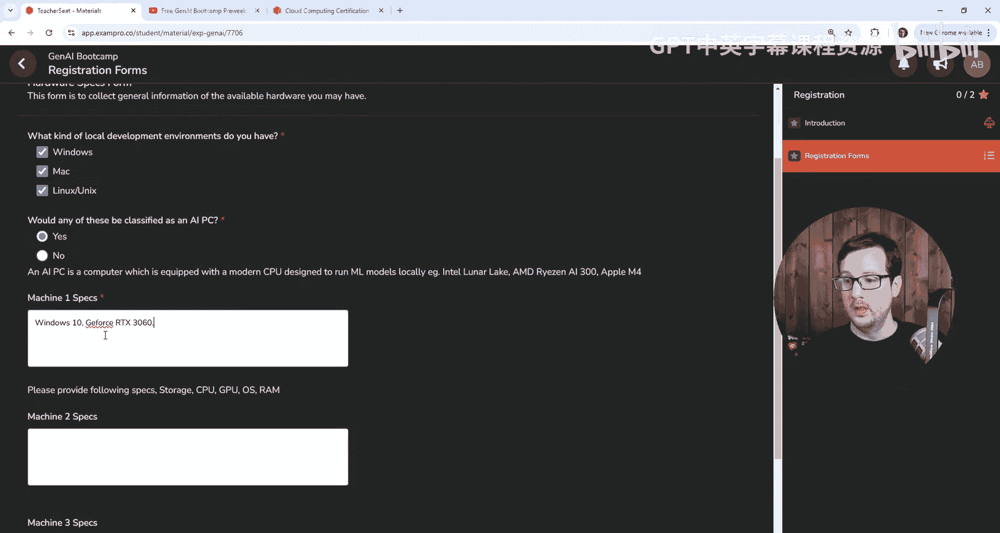

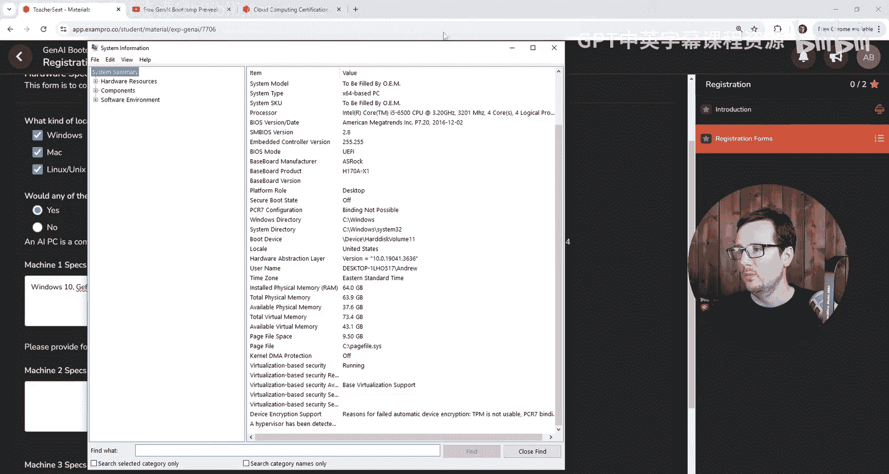

### 4. 学习目标表单
此表单用于了解你的参与计划与期望。
*   请告知我们你计划参与哪些活动：
    *   是否加入课程Discord社区？
    *   是否计划将结业项目放入个人简历？
    *   是否希望接受作业批改以获得结业证书或数字徽章？

提交完所有四个表单后，你的注册流程就全部完成了。

## 总结

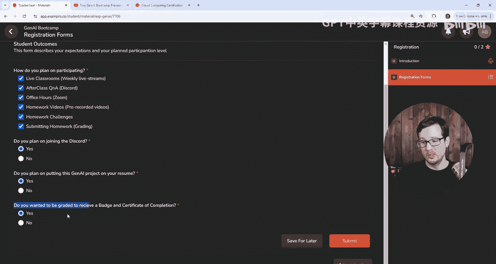

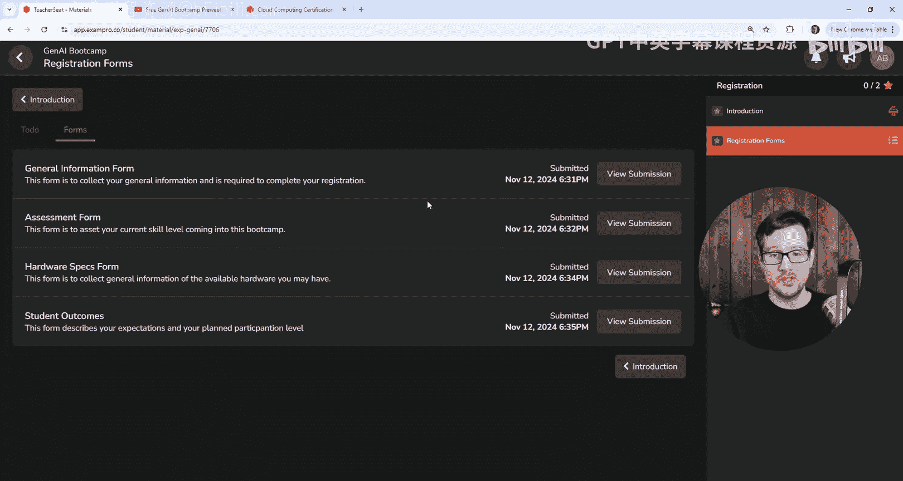

本节课中，我们一起学习了注册免费生成式AI训练营的完整流程。关键步骤包括：访问官方页面创建账户，通过邮箱验证激活账户，在网站内找到并激活免费的训练营计划，最后完成四个必要的注册信息表单。现在，你已经成功注册，可以开始你的生成式AI学习之旅了。