# 3：-03-Free GenAI Bootcamp Preweek

## 概述

在本节课中，我们将一起了解生成式AI训练营的总体安排、核心规则、学习目标以及如何为接下来的学习做好准备。课程将涵盖训练营的结构、学习方法、作业提交方式以及如何利用社区资源。

---

## 欢迎与介绍

大家好，我是Andrew Brown，欢迎来到免费的生成式AI训练营。我们为这个训练营准备了六个月，现在正式启动。

让我介绍一下我们的客座讲师，然后我们将快速进入幻灯片，帮助大家做好准备。

*   **Roa Shaa**：我是一名机器学习工程师，主要服务于美国市场，日常工作就是帮助企业构建机器学习解决方案。
*   **Chris Williams**：我是HashiCorp北美区的开发者关系经理，帮助人们利用Terraform等工具进入基础设施即代码领域。在这里，我将扮演企业架构师的角色，回答关于架构模式和用例的问题。
*   **Shea**：大家好，我是Shala。我在这里担任学生倡导者。我喜欢和大家一起学习，所以如果你遇到任何问题，或者感到不知所措，请随时联系我。我们会一起克服困难，享受学习过程。

如果我们的进度出现问题，Shala会帮助调整节奏。Roa在机器学习和AI方面有深厚的背景，我们将把很多专业问题交给她。Chris是我们的解决方案架构师。而我，将扮演开发者和协调者的角色。

---

## 训练营基本信息

### 什么是免费生成式AI训练营？

这是一个为期六周、基于项目的学习计划。这意味着我们将围绕一个真实的商业用例来构建项目。

*   **直播时间**：每周六中午（美国东部时间）。
*   **作业**：每次直播后，我会发布额外的视频和材料。你需要观看并完成作业，提交后我们会进行评分。
*   **数字徽章**：完成作业并通过评分，你将获得数字徽章。

这个训练营对大家是免费的，但对我而言并非零成本。感谢我们的赞助商**Intel**，他们承担了费用，使得这个原本可能非常昂贵的课程变得触手可及。如果你正在犹豫是否参加，答案是肯定的。抓住这个免费学习的机会。

### 自带账户与设备

这是一个“自带账户”的训练营。你需要使用自己的电脑和云账户。我们不会提供沙箱环境，但会尽可能提供免费或低成本的选项指导。最好的学习方式是使用你已有的工具，因为训练营结束后，你将继续使用它们。

### 注册与数字徽章

如果你想获得数字徽章，**必须**在ExamPro.co上注册。如果没有注册，你将无法提交作业、获得评分、领取数字徽章，也无法访问Discord社区。注册是免费的，需要填写一些基本信息，以便我们更好地了解你，并据此调整课程内容。

### 商业用例场景

每个大型训练营我们都围绕一个真实世界的项目展开。本次的场景是：你被一家语言学习学校聘为AI工程师，旨在增强参加教师主导课程学生的学习体验。

我构建了一个**语言学习门户**，我们将为其添加生成式AI功能。我们将创建一系列作为学生学习活动的项目，并让这家公司准备好提供生产级的生成式AI服务。

这个场景源于我个人的真实经历——我正在跟随一位日语老师学习日语，并尝试在课程间隙构建一些辅助工具，这让我深入接触了生成式AI。

**关于语言选择**：示例中使用了日语，因为它是一门非常复杂、适合我们用例的语言。但**你可以选择任何你想学习的口语**（不是编程语言）。只要它是口语即可。

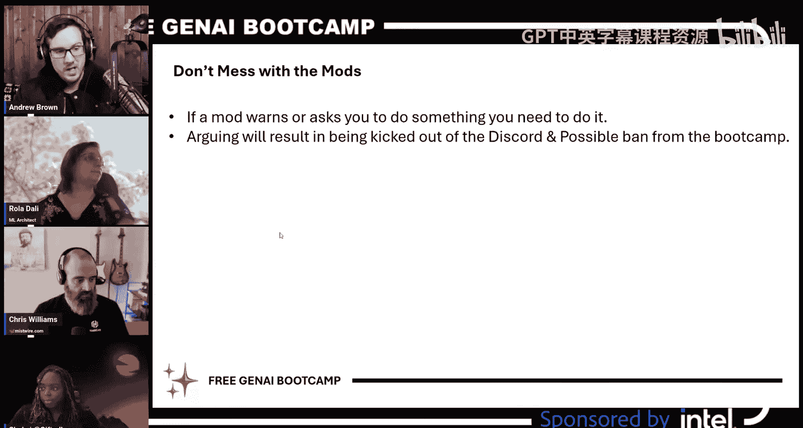

---

## 学习路径与先决条件

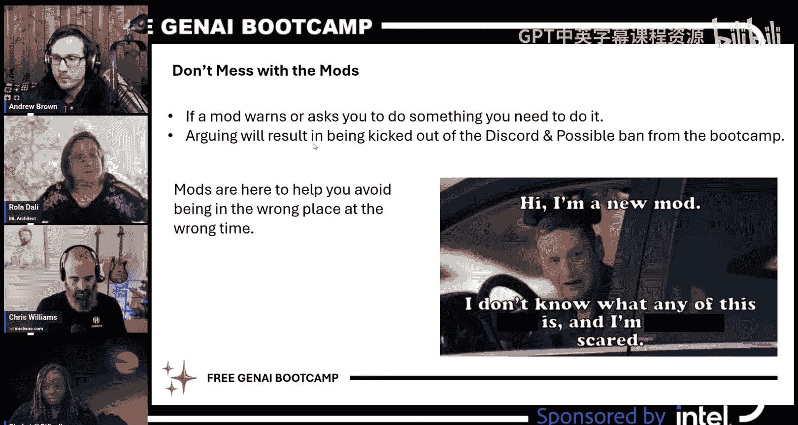

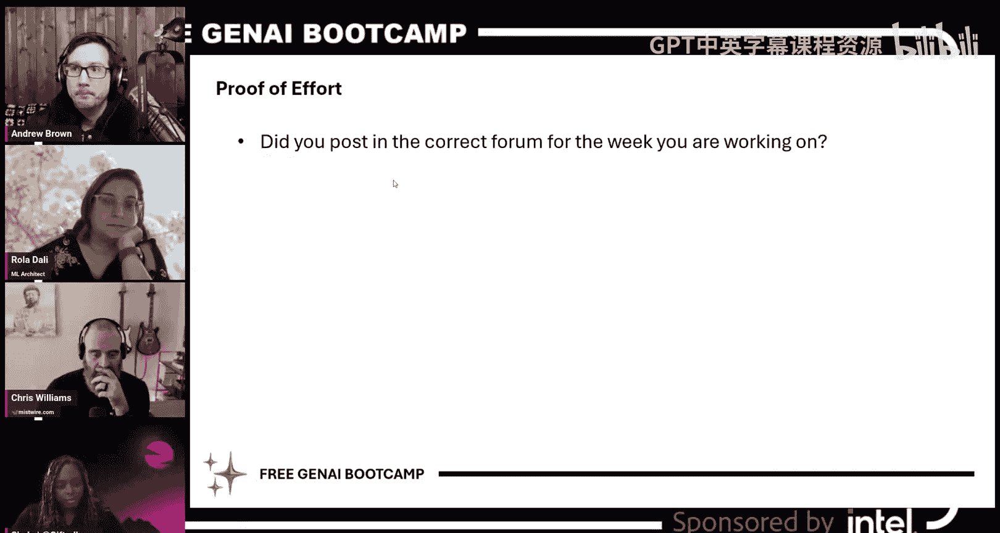

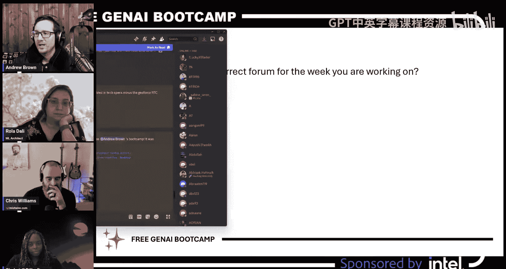

### 先决知识

有学员问是否需要先决知识。我们有一个先修课程：**生成式AI基础**。这是一个22小时的免费课程，你可以选择付费获得认证（费用将用于为本地儿童购买STEM设备），但观看课程本身是免费的。

设置这个长课程的目的是为了让大家广泛接触术语和工具，建立信心和舒适感。你不需要100%完成它，只需完成足够的部分即可。如果觉得训练营有难度，可以随时回顾这些材料。

### 日程安排

*   **直播**：每周六中午12点至下午2点（美国东部时间）。
*   **课后问答**：每次直播后，我们会在Discord进行30分钟的问答环节。这是一个更直接的互动机会。
*   **办公时间**：我会在六周内分散安排办公时间，并尽量调整以适应不同学员的时间。这是你与我实时排查问题的好机会。
*   **作业与提交**：每周会有视频和作业发布。你需要每周提交作业，最好在下一次课前完成。我们看重的是你的学习过程和技能展示。

---

## 核心学习理念：边过河边搭桥

这是一个非常重要的理念，它为整个训练营定下了基调：**边过河边搭桥**。

这意味着直播内容可能不会100%完整或完美，但这没关系。重要的是，我们利用实时可用的资源展示我们能做什么。我们不会进行加速或过度美化。如果我们无法在现场解决或弄清楚某些问题，我会通过后续视频跟进。

如果出现了新兴技术（比如最近热议的DeepSeek），我们会将其纳入课程。嘉宾讲师可能会有变动，项目范围也可能会根据时间进行调整。就像真实的公司项目一样，我们开始时可能有宏大的目标，然后根据实际情况调整范围。

**失败并不重要，重要的是通过经验增长领域知识并获得技术确定性**。这两点也是我评分和评估你技能时最看重的。

---

## 硬件与本地部署

本次训练营与以往不同，虽然主要涉及云技术，但我强烈建议你**尽可能使用本地硬件**。因为生成式AI既可以在云端使用，也可以在本地运行。我希望为你提供所有可能的成功路径。

我个人拥有从老式电脑、Mac M1到现代AI PC开发套件等多种硬件。无论你有什么设备，都可以尝试。关键在于记录你能做什么、不能做什么，这正是我们试图构建的领域知识的一部分。

---

## Discord社区与行为准则

### 加入Discord

如果你还没有加入Discord，并且遇到邀请链接问题，请发送邮件至 `support@exampro.co`。提供你在ExamPro注册时使用的邮箱或用户ID，我的团队会帮助你加入。Discord对于营造安全、无机器人的社区环境至关重要。

### 社区规则

以下是Discord社区的一些重要规则：

1.  **保持专业性**：Discord不是技术交友或约会平台。请避免私下联系他人，将交流保持在公共频道。
2.  **提问时展示努力**：提问时，请提供你已尝试过的步骤和结论，而不仅仅是说“它不工作”。
3.  **在正确的频道提问**：根据你正在进行的周数，在对应的频道（如 `#preweek`, `#week-01`）中提问。
4.  **提供清晰的代码和截图**：提供代码时，请使用Markdown格式和语法高亮。截图应来自电脑，而非手机拍摄（除非是启动画面等无法截屏的情况）。
5.  **阅读手册**：常见问题、大纲、行为准则等都已文档化。请在提问前先查阅相关资源。
6.  **尊重版主**：如果版主发出警告或提出要求，请配合。他们的职责是帮助你避免陷入麻烦。

对于非常严重的问题（如违反行为准则），请发送邮件至 `support@exampro.co`。对于ExamPro平台的技术问题，也请发送邮件至该地址。

---

## 作业、评分与徽章

### “我们展示，你选择”模型

由于生成式AI市场非常新且不成熟，我们采用 **“我们展示，你选择”** 模型。

这意味着我们将展示多种生成式AI的实现方法、工具和技术。你需要根据自己的**时间投入、成本考虑、技术复杂度和特定需求**，选择最适合你的最优解决方案。

与以往训练营不同，这次我们不会规定你必须使用某种特定工具。这给了你更多自由，但也需要你更多地思考。**只要方案对你有用，它就是可行的**。在这个尚未成熟的领域，除了像Roa这样的专家，没有绝对的“错误”方式。

### 日志记录与评分重点

在日志记录和评分中，最重要的是**通过经验增长领域知识和获得技术确定性**。

我不追求最炫酷的演示，而是看重你是否记录了学习过程。即使你失败了，只要记录了原因和尝试，这就是成功的经验，因为它扩展了领域知识，为后来者铺平了道路。


**日志应包含**：
*   **假设**：你计划做什么，预期结果是什么。
*   **技术不确定性**：你不确定什么（例如，能否在特定硬件上运行某个模型）。
*   **技术实现探索**：你尝试了哪些方法。
*   **最终观察与结果**：你的发现和结论。

**避免在日志中记录**：
*   对技术术语的基本解释（这是LLM擅长的事）。
*   过于常规的步骤。

### 如何脱颖而出

如果你想获得更高的评级（如红队级别），可以尝试以下方式：
*   明确你的作业挑战。
*   尝试建议之外的挑战（例如，使用Toki Pona语言）。
*   制作视频展示你的成果。
*   撰写博客文章分享可复现的经验。
*   积极参与Discord和直播评论。
*   按时提交日志。

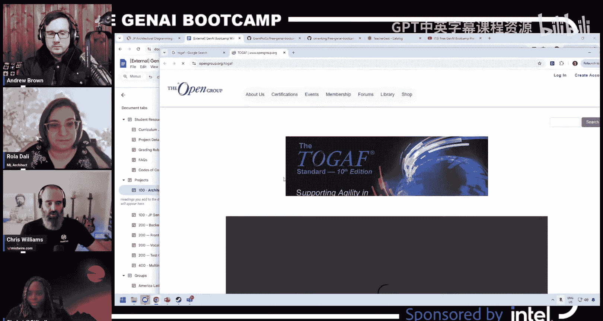

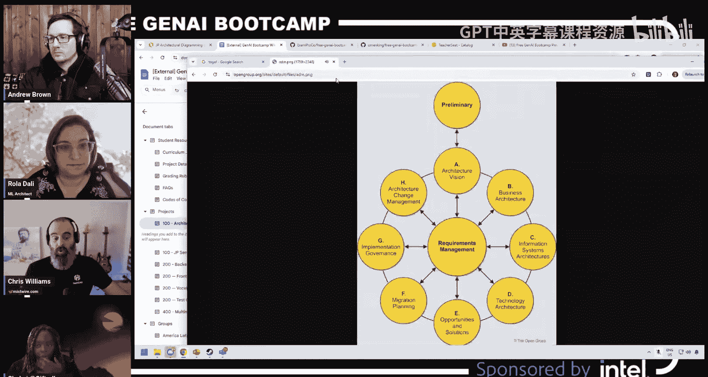

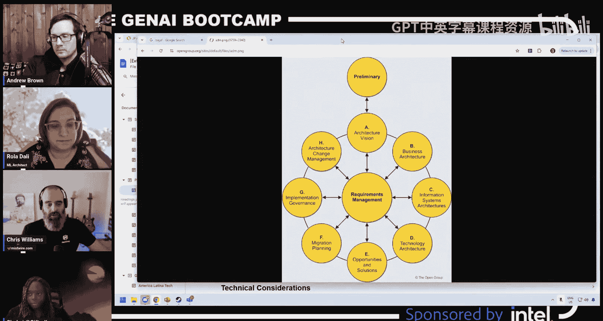

### 徽章等级

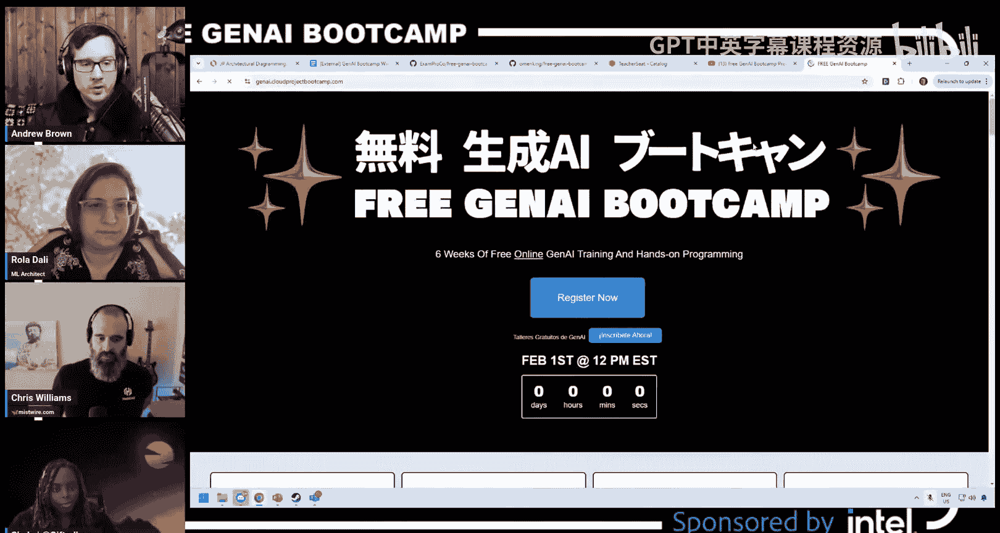

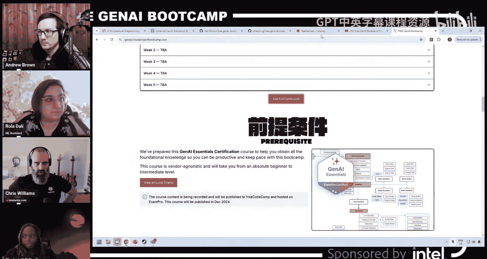

我们有四个徽章等级：蓝队、青队、金队、红队。如果你达到红队级别，我们将寄送一张实体收藏卡。同时，也会有适合LinkedIn的常规样式徽章。

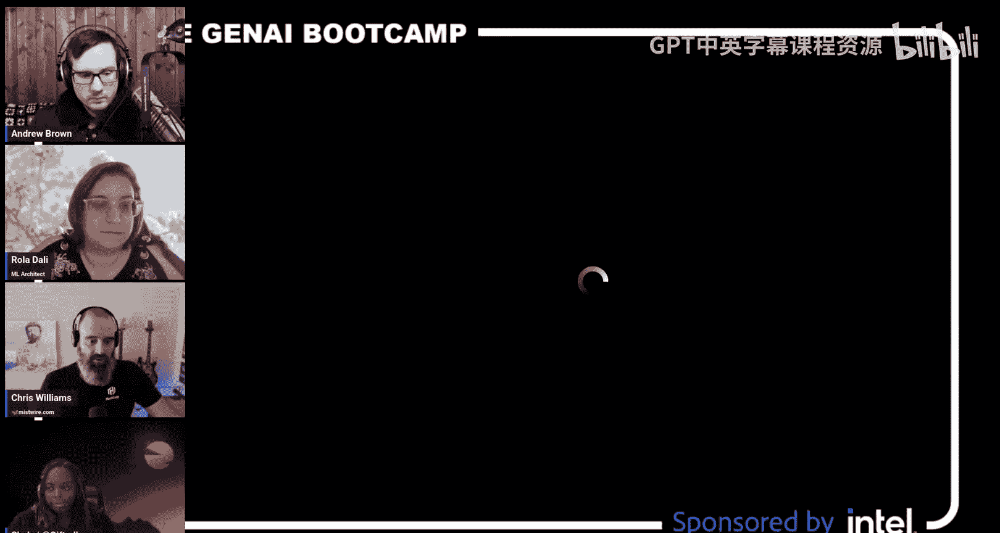

---

## 特别小组

我们有两个特别小组，旨在为特定群体提供更好的支持和交流空间：

*   **She Clouds**：这是一个Discord内的私密频道，仅限女性加入。它有更严格的行为准则，旨在帮助科技领域的女性建立联系、互相支持。
*   **GenAI Español**：这是一个西班牙语频道和独立的直播流（每周六下午3点东部时间）。这是第一年开设西班牙语组，我们对此非常期待。西班牙语学员可以在这里用母语交流和学习。

---

## 常见问题解答

以下是针对一些常见问题的解答：

*   **没有完成先修课程，能跟上吗？** 先修课程不是硬性要求，它是为了让你接触术语和工具。如果觉得训练营有难度，可以随时回去参考。
*   **中途加入可以吗？** 可以，请尽量按时提交作业。我们预见到有人会晚加入，并为此预留了时间，但请不要落后太多。
*   **觉得太难了，应该放弃吗？** 这是一个面向所有水平的训练营。如果觉得太难，尽你所能即可。即使只是旁听和尝试理解，也会对你有所帮助。
*   **如何加入Discord？** 你必须先注册。链接在ExamPro平台生成。如果遇到问题，请联系 `support@exampro.co`。
*   **错过直播怎么办？** 所有直播都会被录制并稍后提供。这对于需要字幕的学员也是必要的。
*   **Baco是谁？** 我们一般不讨论Baco。（这是一个内部玩笑）

---

## 生成式AI系统架构入门

上一节我们介绍了训练营的整体安排，本节中，我们来看看生成式AI系统的核心架构组件。这将帮助我们为实际构建项目打下基础。

首先，我们需要区分**预测性机器学习**和**生成式AI**。

*   **预测性ML**：包括监督学习、无监督学习和强化学习算法。模型规模通常在数千到数百万参数之间。
*   **生成式AI**：生成新内容的一类模型。模型规模通常达到数十亿甚至数万亿参数，能产生开放式的答案，并且通常使用已有的基础模型。

**主要选择考虑因素**：
*   **规模与成本**：生成式AI模型更大，计算成本和资源需求更高。
*   **启动速度**：使用现成的基础模型，生成式AI通常能更快启动。
*   **定制化**：预测性ML更适合为特定数据训练定制模型；生成式AI则更多是在基础模型上进行调用和优化。

假设我们已经确定需要生成式AI，接下来让我们看看如何架构这样一个系统。

以下是构建生成式AI系统时可能涉及的核心组件，我们将从简单到复杂逐步构建：

### 1. 基础：模型调用
最基本的系统包含一个生成式AI模型。用户查询模型提供商（如通过OpenAI、Anthropic或AWS Bedrock）的模型，并获得响应。这个系统已经可以完成总结、问答等许多任务。
```
用户 -> [模型提供商] -> 响应
```

### 2. 添加上下文增强（如RAG）
如果你的领域比较专业，或者需要模型了解训练截止日期之后的信息，可以添加知识库和上下文增强系统。这通过检索增强生成技术实现，将外部知识注入到给模型的提示中。
```
用户 -> [知识库] -> [上下文增强] -> [模型] -> 响应
```

### 3. 添加护栏
出于合规和安全考虑，你可以添加输入和输出护栏。输入护栏可以控制哪些信息可以离开公司（例如，屏蔽个人身份信息）。输出护栏可以检查回答是否存在偏见、攻击性或不安全内容。
```
用户 -> [输入护栏] -> [上下文增强] -> [模型] -> [输出护栏] -> 响应
```

### 4. 添加路由与模型抽象
不同的模型擅长不同的任务（如推理、编码）。你可以添加一个抽象层（路由器和网关），根据问题类型动态调用最合适的模型。
```
用户 -> [路由器] -> [模型A / 模型B] -> 响应
```

### 5. 添加缓存
为了降低延迟和成本，可以在数据检索层或用户层面添加缓存。调用模型通常是系统中成本最高的部分，缓存能有效减少调用次数。
```
用户 -> [缓存] -> [系统各组件] -> 响应
```

### 6. 添加智能体
智能体是可以代表你执行操作的软件系统。例如，模型生成一个回答后，智能体可以根据这个回答去更新订单、发送邮件等。
```
用户 -> [系统] -> [模型] -> [智能体] -> 执行操作
```

### 7. 其他企业级组件
一个完整的生产级系统可能还包括：
*   身份验证与授权
*   状态与会话管理
*   监控与可观测性
*   流水线编排
*   人类反馈循环

理解每个组件的用途、优缺点以及你是否需要它们，是架构设计的关键。这就是“我们展示，你选择”的精髓——你可以根据需求选择系统的复杂度。

---

## 解决方案架构设计实践

上一节我们了解了生成式AI的组件，本节我们将把这些知识应用到我们的商业用例中，进行实际的解决方案架构设计。

在开始画图之前，我们需要建立一个共同的“词汇表”。架构设计通常分为三个层次，用于与不同层次的利益相关者沟通：

1.  **概念设计**：最高层次的图表，类似于“餐巾纸草图”，展示系统的主要组成部分和它们之间的高级关系。Roa之前展示的图表就是很好的概念设计。
2.  **逻辑设计**：更详细的蓝图，展示了组件如何连接，包括一些命名、测量和权重。它介于概念和物理设计之间。
3.  **物理设计**：最详细的图表，包含了所有服务的具体名称、IP地址、端口号等，是工程师实际部署的依据。

### 应用架构到语言学习门户

我们的项目是“语言学习门户”。让我们尝试为其创建不同层次的设计图。

**物理设计示例（已有）**：
这是一个非常详细的图表，展示了后端Flask API、前端React应用、SQLite数据库、具体的API路由和端口号。这对于开发者来说很清晰，但对于业务人员可能过于复杂。

**逻辑设计尝试**：
我们需要将物理设计抽象化。
*   用户与**前端学习门户**交互。
*   从前端，他们可以启动一个**学习活动**。
*   所有数据交互都通过一个**后端API**进行。
*   数据存储在一个**关系型单文件数据库**中。
*   学习活动可能拥有自己的后端和资源。

**概念设计探索**：
我们需要从业务角度思考。
*   **参与者**：学生、教师。
*   **核心平台**：语言学习门户。
*   **功能**：门户提供各种**学习活动**（如：句子构造器、写作练习、文本冒险游戏、沉浸式视频、视觉小说阅读器、口语学习工具等）。
*   **数据**：系统需要存储核心词汇（约2000个）、学生的学习进度和会话状态。
*   **扩展考虑**：未来可能添加支付网关、多租户支持等。

通过这样的讨论，我们明确了系统需要什么，以及生成式AI可以如何融入（例如，通过AI生成特定主题的词汇表并导入系统）。

---

## 生成式AI组件与我们的项目

现在，让我们聚焦于如何将生成式AI组件集成到我们的架构中。我们将绘制一个高层次的概念图来展示这些关系。

以下是一个可能的生成式AI子系统概念图组件：

```
                    +----------------------+
                    |   用户输入/查询       |
                    +----------+-----------+
                               |
                               v
                    +----------------------+
                    |  输入护栏/安全检查    |
                    +----------+-----------+
                               |
                               v
                    +----------------------+
                    |  上下文管理与增强     | <---+
                    |  (如：RAG检索知识)     |     |
                    +----------+-----------+     |
                               |                 |
                               v                 |
                    +----------------------+     |
                    |  流水线编排器         |     |
                    |  (模型选择、多步调用) |     |
                    +----------+-----------+     |
                               |                 |
                               v                 |
                    +----------------------+     |
+------------------>|   生成式AI模型       |     |
|                   |     (如：LLM)        |     |
|                   +----------+-----------+     |
|                              |                 |
|                              v                 |
|                   +----------------------+     |
|                   |  输出护栏/内容过滤    |     |
|                   +----------+-----------+     |
|                              |                 |
|                              v                 |
|                   +----------------------+     |
|                   |      最终响应         |     |
|                   +----------------------+     |
|                                                 |
|                   +----------------------+     |
|                   |      智能体          |     |
|                   |  (执行外部操作)      |     |
|                   +----------------------+     |
|                              ^                 |
|                              |                 |
+------------------------------+-----------------+
                               |
                    +----------------------+
                    |     工具/API调用     |
                    |  (如：数据库、互联网) |
                    +----------------------+
```

**组件说明**：
*   **生成式AI模型**：核心，如大语言模型，处理输入并生成输出。
*   **上下文管理**：格式化用户输入，注入额外信息（如从知识库检索的内容）。
*   **护栏**：确保输入输出的安全性与合规性。
*   **流水线编排器**：管理整个调用流程，可能涉及多个模型或步骤。
*   **智能体**：根据模型输出执行具体操作（如更新数据、调用外部API）。
*   **工具使用**：智能体可以调用的外部资源。

这个领域术语尚未完全统一，但理解这些核心概念将帮助你在选择工具和设计流程时更有把握。

---

## 本周作业

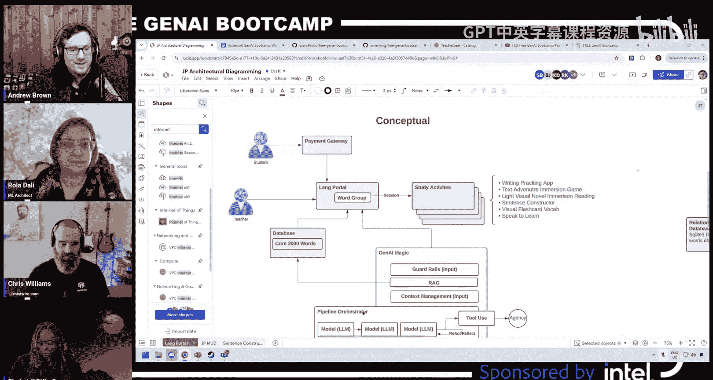

以下是为你准备的本周作业任务：


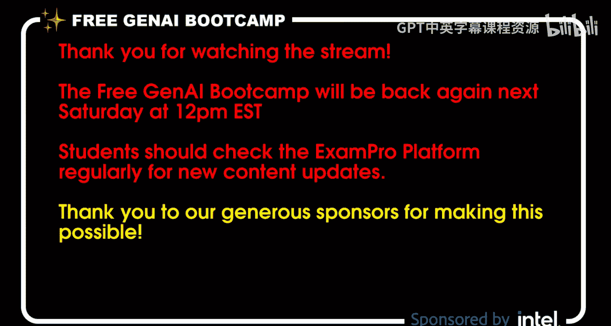

1.  **架构图练习**：
    *   **任务**：基于今天讨论的内容，为你设想的“语言学习门户”生成式AI功能绘制一张**概念架构图**。
    *