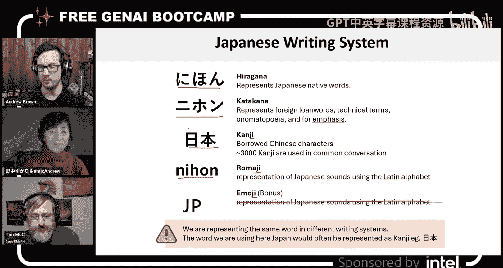
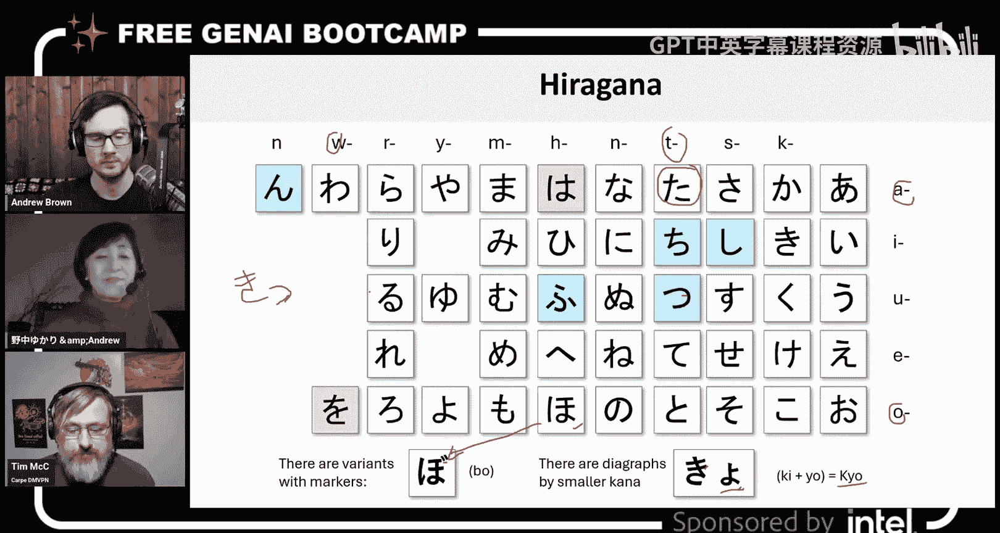
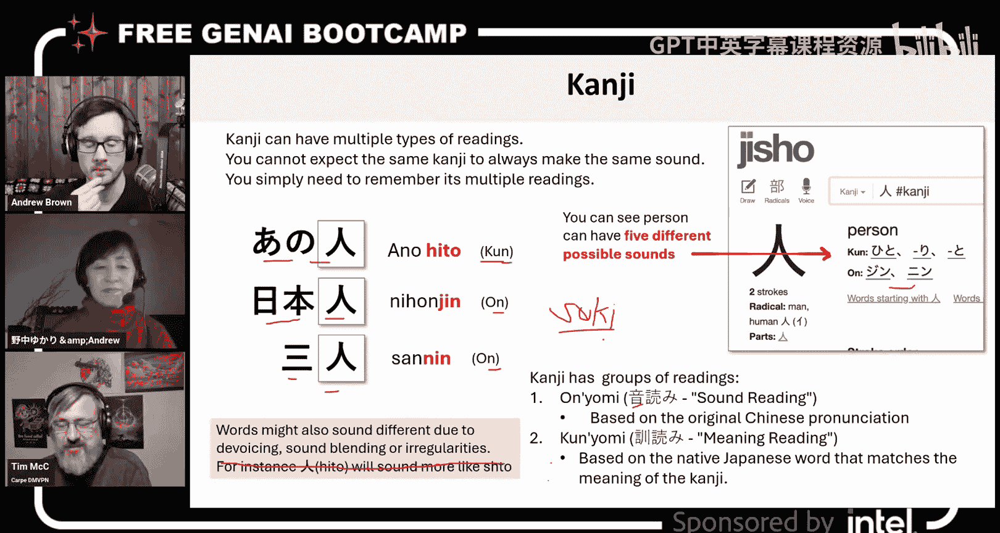
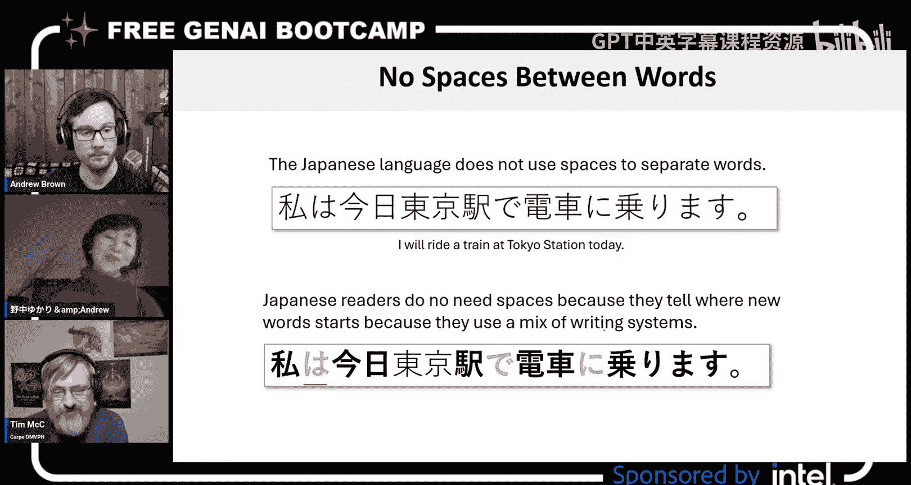
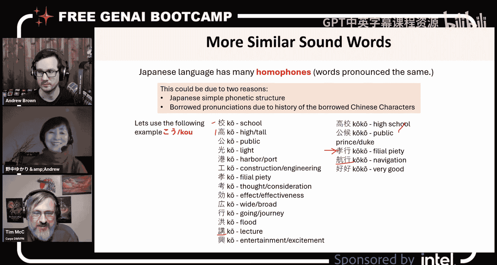
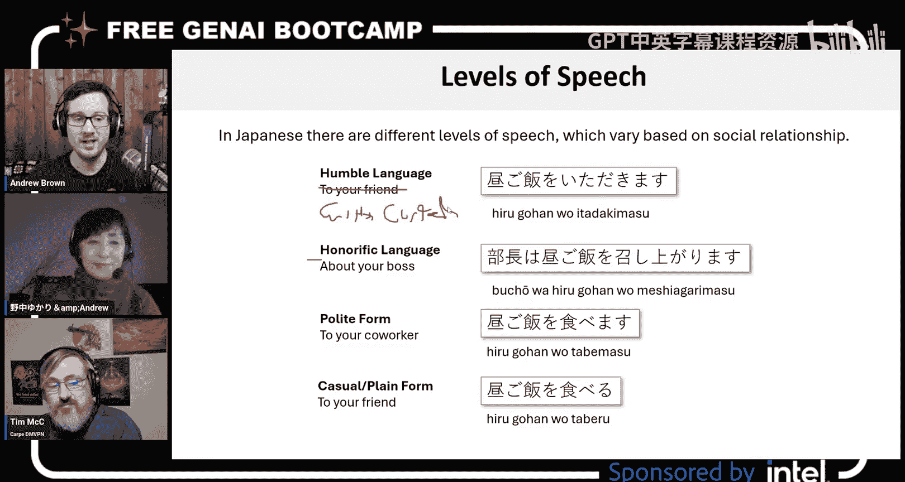

# 6：日语入门指南

在本节课中，我们将要学习日语的基础知识。日语作为本次训练营的目标语言，其高语境特性、复杂的书写系统以及丰富的语言特征，为生成式AI和大型语言模型的应用提供了一个绝佳的用例场景。我们将通过介绍日语的书写系统、发音规则、语法结构等核心概念，帮助你理解为何日语对于AI语言处理而言是一个有趣且富有挑战性的领域。

## 日语书写系统

日语拥有多个独特的书写系统，它们共同构成了日语的书面表达形式。理解这些系统是学习日语的第一步。

以下是日语中五种主要的书写系统：

1.  **平假名**：用于表示日语中的固有词汇和语法元素。
2.  **片假名**：主要用于表示外来词、技术术语和拟声词。
3.  **汉字**：借自中文的表意字符，每个字符通常具有含义和多种读音。
4.  **罗马字**：使用拉丁字母来拼写日语发音。
5.  **绘文字**：图形化的表情符号，用于表达情感或概念。

例如，表示“日本”这个词，在不同系统中的写法分别为：
*   平假名：**にほん**
*   片假名：**ニホン**
*   汉字：**日本**
*   罗马字：**Nihon**

## 平假名与片假名详解

上一节我们介绍了日语的五种书写系统，本节中我们来看看其中两个基础音节系统：平假名和片假名。

平假名和片假名都是表音文字，每个字符代表一个特定的音节（或称“拍”）。它们的元音系统相同，均为 **あ、い、う、え、お**。

平假名用于书写日语固有词汇和语法词（如助词）。其基本音节表遵循“辅音+元音”的规则，例如：
*   **か** 行：か (ka)、き (ki)、く (ku)、け (ke)、こ (ko)
*   **た** 行：た (ta)、ち (chi)、つ (tsu)、て (te)、と (to)

片假名主要用于书写外来语、拟声词或需要强调的词汇。其字符形状比平假名更为棱角分明。例如，“咖啡”这个词来自英语“coffee”，用片假名书写就是 **コーヒー**。

两个系统都存在一些特殊的发音规则：
*   **浊音与半浊音**：通过在字符右上角添加两点（浊点）或小圆圈（半浊点）来改变发音。例如，は (ha) 加两点变成ば (ba)，加圆圈变成ぱ (pa)。
*   **拗音**：由一个小写的や、ゆ、よ与一个辅音字符组合，形成一个音节。例如，きゃ (kya)、しゅ (shu)。
*   **促音**：用小写的つ表示，表示一个短暂的停顿。在罗马字中常写作双写后一个辅音的辅音字母，如`切符` (kippu)。

## 汉字与振假名

汉字是日语书写中最具挑战性的部分之一。一个汉字通常有**音读**和**训读**两种或多种读音。

*   **音读**：源自汉字传入日本时的汉语发音。
*   **训读**：是赋予该汉字的日语固有读音。

例如，汉字“人”有多种读音：
*   音读：**じん** (jin)，如`日本人` (Nihon-jin，日本人)
*   训读：**ひと** (hito)，如`あの人` (ano hito，那个人)

为了帮助阅读，日语中常使用**振假名**，即在汉字上方或旁边标注其读音的平假名。这在面向儿童或学习者的读物（如漫画）中非常常见。公式表示为：`汉字 (振假名)`，例如：**駅 (えき)**。

## 日语句子结构与助词

日语的基本语序是**主语-宾语-动词**，这与英语的“主语-动词-宾语”结构不同。例如，“我吃苹果”在日语中的语序是“我 苹果 吃”。

助词是日语语法的关键，它们附着在名词、短语后，标明其在句子中的语法功能（如主语、宾语、地点、工具等）。常见的助词包括：
*   **は**：提示主题。
*   **が**：表示主语。
*   **を**：表示动作的直接宾语。
*   **に**：表示时间、地点、方向或间接对象。
*   **で**：表示动作发生的地点或使用的手段。
*   **と**：表示共同行动者（和…一起）。
*   **の**：表示所有或修饰关系。

由于助词明确了单词的角色，日语句子中的词语顺序相对灵活，并且经常省略通过上下文可以理解的部分（如主语）。

## 同音词与敬语体系

日语由于音节数量相对有限，存在大量同音词。例如，发音为“こう”的单词可能有“校”（学校）、“講”（讲座）、“工”（工厂）、“港”（港口）等多种汉字写法。理解具体含义需要依赖上下文。

日语拥有复杂的敬语体系，用于根据社交关系（内外、上下、亲疏）调整说话方式。主要分为：
1.  **礼貌体**：以`です`、`ます`结尾，适用于一般社交场合。
2.  **尊敬语**：通过改变动词形式来抬高动作主体（对方或长辈）。
3.  **自谦语**：通过改变动词形式来降低动作主体（自己或己方），以表示对对方的尊重。

例如，表达“说”这个动作：
*   普通形：言う (iu)
*   礼貌体：言います (iimasu)
*   尊敬语：おっしゃる (ossharu)
*   自谦语：申し上げる (moushiageru)

---

本节课中我们一起学习了日语的基础概览，包括其多套书写系统（平假名、片假名、汉字等）、独特的**主语-宾语-动词**语序、定义句子成分关系的**助词**、因音节有限而产生的丰富**同音词**，以及根据社会关系变化的**敬语体系**。这些复杂的特性使得日语成为测试和提升生成式AI语言处理能力的绝佳用例。理解这些基础知识，将有助于我们在后续课程中更好地构建和评估面向日语学习的AI应用。