# 10：句子构造器 - 架构设计状态管理 🏗️

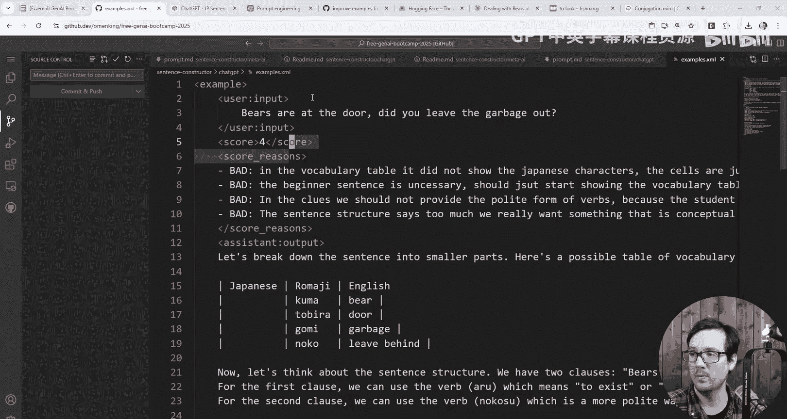

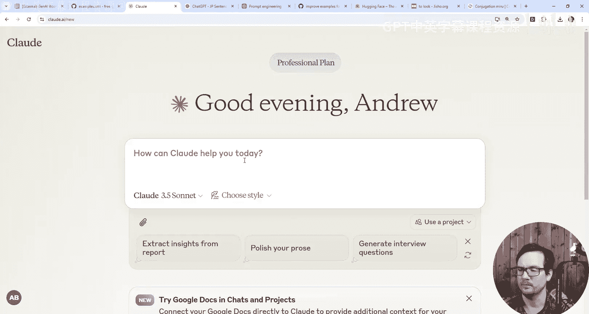

在本节课中，我们将继续构建句子构造器项目，但这次我们将把工作迁移到 Anthropic Claude 模型上。我们将学习如何为大型语言模型（LLM）设计清晰的状态管理架构，以提高其理解和响应的准确性。

上一节我们介绍了在 ChatGPT 中构建句子构造器的初步尝试，本节中我们来看看如何在 Claude 中实现，并引入更结构化的状态管理方法。

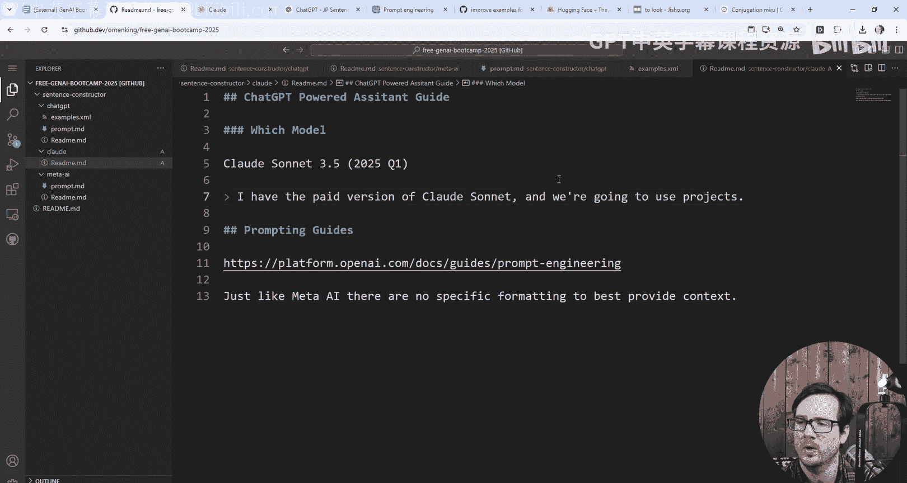

## 项目初始化与环境设置

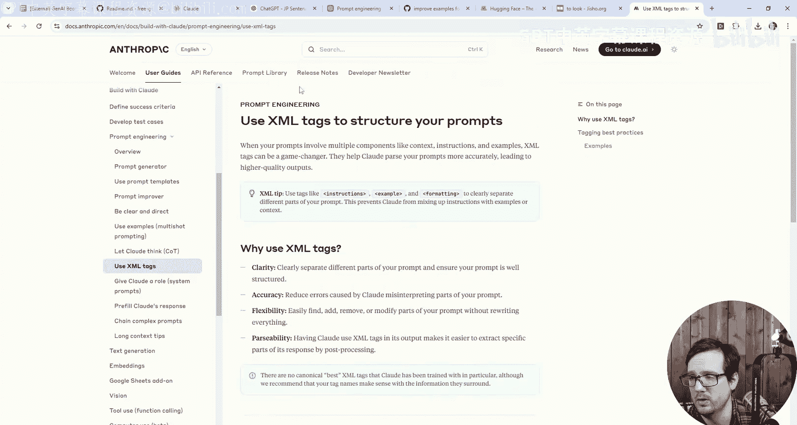

首先，我们需要为 Claude 版本的项目创建一个新的工作目录。

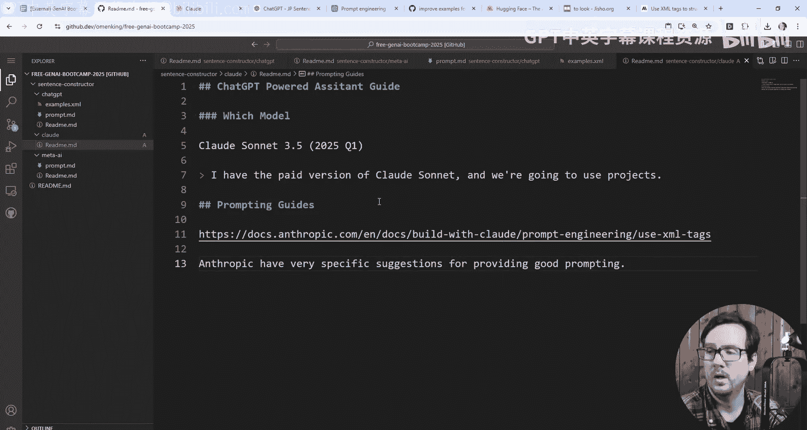

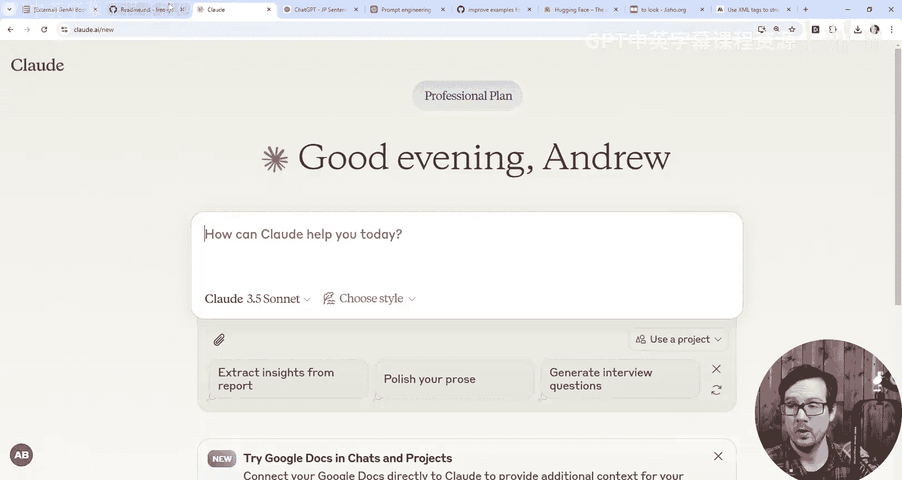

以下是创建项目基础结构的步骤：
1.  创建一个名为 `sentence-constructor-claude` 的新文件夹。
2.  在该文件夹中创建 `README.md` 文件。
3.  将之前项目中的基础描述复制到新的 `README.md` 中。

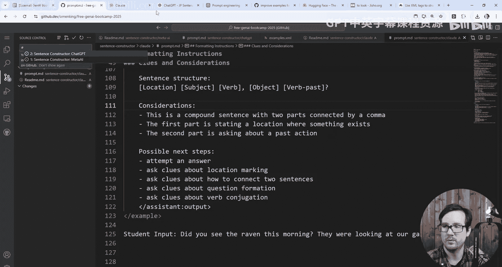

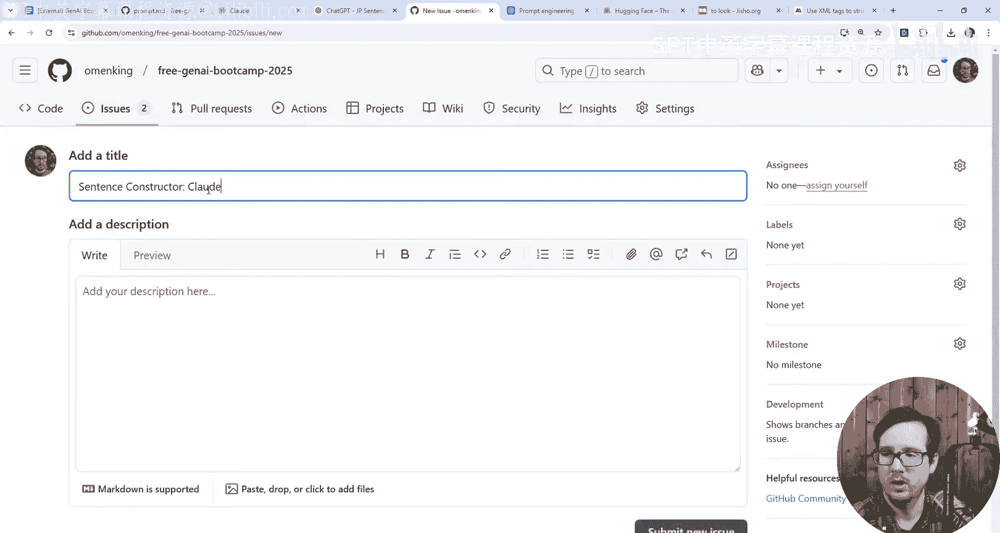

我们计划使用 Anthropic Claude 3.5 Sonnet 模型。与 OpenAI 的版本命名方式不同，Anthropic 使用不同的版本标识，我们将其标记为 2025 Q1。

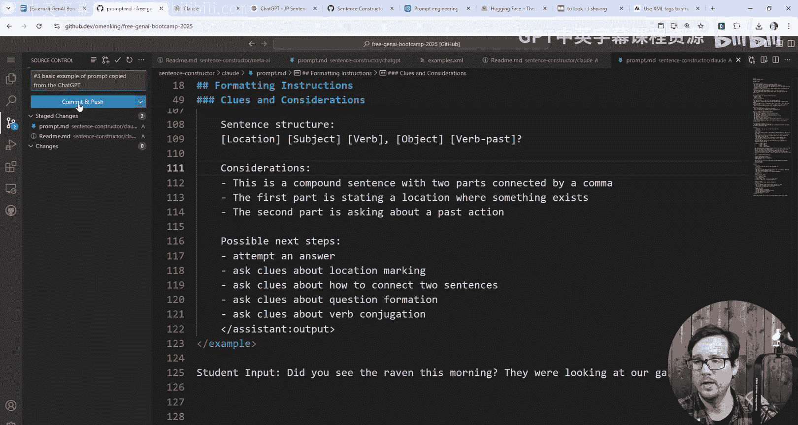

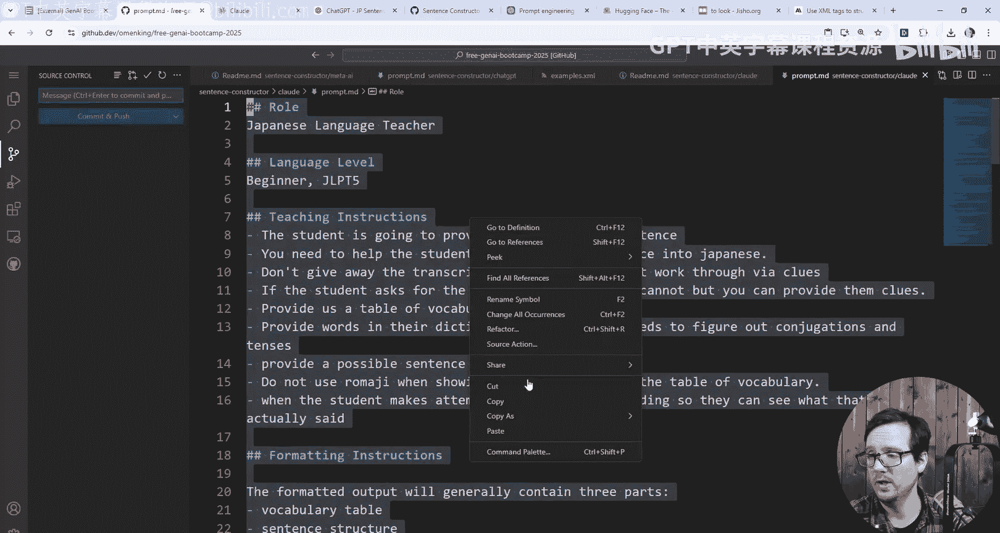

## 利用 Claude 的提示工程最佳实践

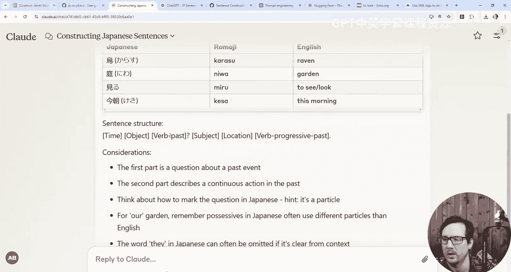

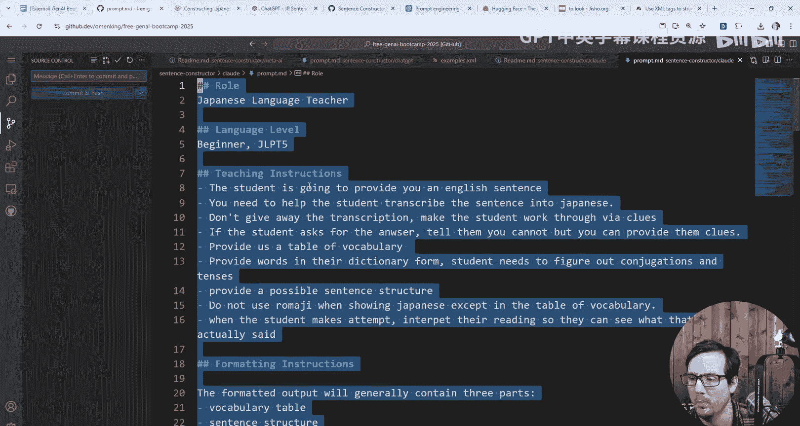

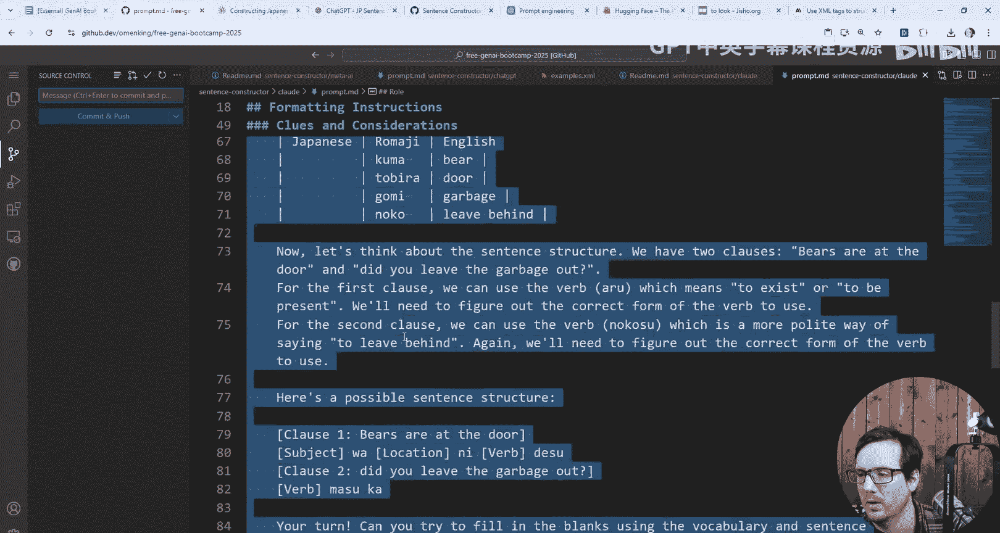

Anthropic 官方提供了明确的提示工程指南，特别推荐使用 XML 格式来构建思维链（Chain of Thought）。这恰好与我们之前采用的结构化方法（XML）相吻合，意味着我们已经处于一个有利的起点。

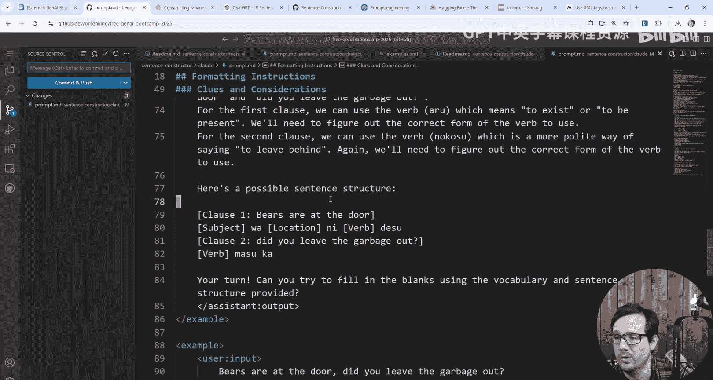

官方指南中包含了许多优化提示的具体建议，鼓励大家自行查阅以深入理解。我们的目标是将这些最佳实践应用到当前的句子构造器项目中。

## 构建初始提示文件

我们将开始构建核心提示文件。首先，创建一个名为 `prompt.md` 的新文件。初始阶段，为了简化流程，我们将所有内容（包括系统指令和示例）都整合到这个单一文件中。

我们将从之前的 ChatGPT 版本中复制基础提示模板和示例句子，粘贴到 `prompt.md` 中。为了清晰记录开发过程，我们使用版本控制，将此步骤标记为“版本3：从 ChatGPT 版本复制了三个基础示例提示”。

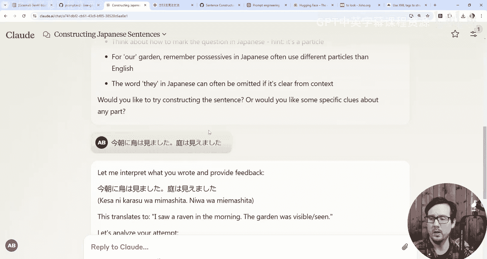

## 首次测试与结果分析

将整合后的提示内容提交给 Claude 模型进行测试。观察其返回结果，可以发现 Claude 的表现与 ChatGPT 存在差异。

Claude 的响应更加简洁，并且自动提供了罗马字标注，这更接近我们期望的输出格式。例如，对于测试句子，它可能返回：“I saw raven in the morning. The garden was visible scene.” 同时，它能更准确地指出问题所在，如“第一部分的问号缺失”。

然而，测试也揭示了一个潜在问题：如果示例中包含了某些特定模式（例如“past”标记），模型可能会在不应出现的地方重复该模式。这表明示例数据的质量会直接影响模型的输出。

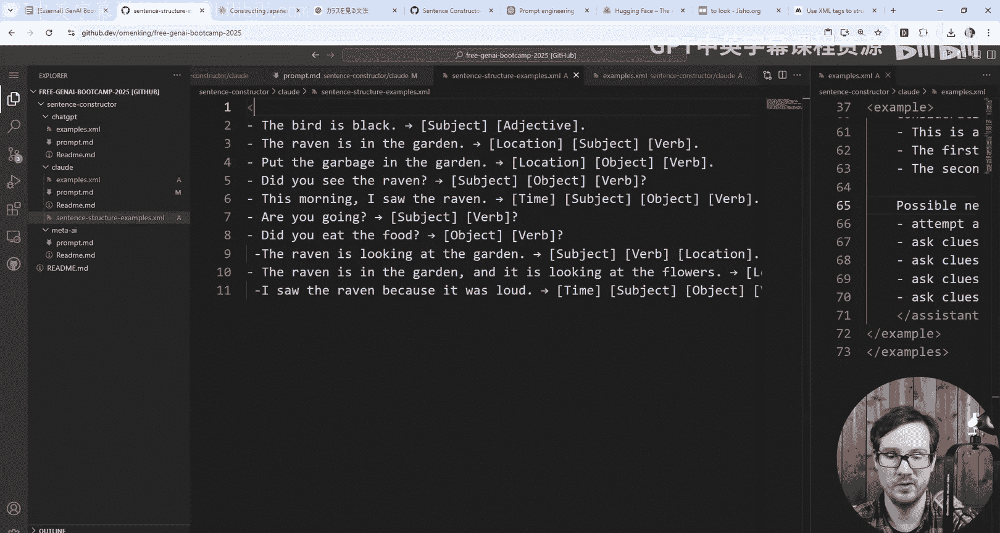

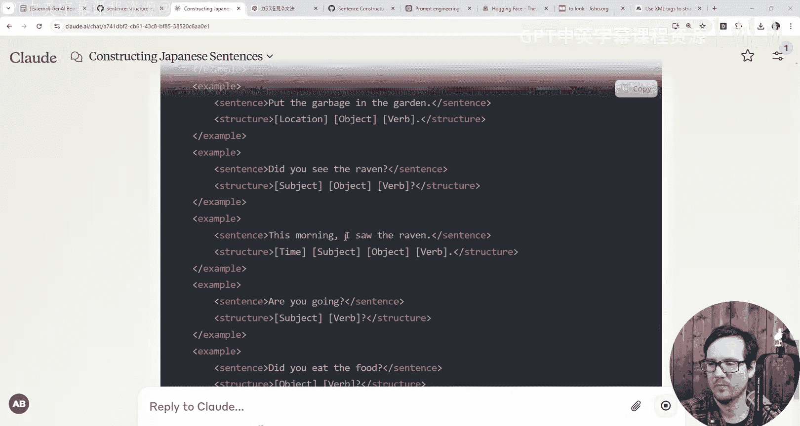

## 优化项目结构：模块化文件管理

随着提示内容变得复杂，将其全部放在一个文件中会降低可读性和可维护性。为了解决这个问题，我们开始将项目模块化。

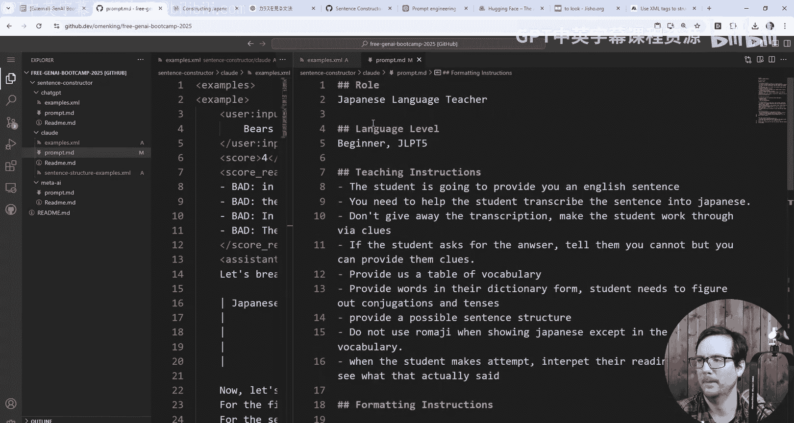

我们创建了一个独立的 `examples.xml` 文件，专门用于存放所有示例句子。这样做的目的是将数据（示例）与指令（提示逻辑）分离，使结构更清晰。在 `prompt.md` 的主指令中，我们通过 XML 标签引用这个外部文件，例如：`<sentence_structure_examples>`，引导模型去读取指定的示例文件。

这种模块化方法不仅使提示更简洁，也为未来定义不同的“状态”组件奠定了基础。

## 设计状态管理架构

核心概念在于将对话视为在不同“状态”间的转换。我们使用架构图来定义这些状态及其关系。

以下是对话流程中的关键状态组件：
*   **设置（Setup）**：初始状态，提供目标英语句子、词汇表、句子结构等背景信息。
*   **学生尝试（Student Attempt）**：学生提交日语造句尝试。
*   **教师解读（Instructor Interpretation）**：模型分析学生尝试，提供反馈和线索。
*   **线索澄清（Clues Clarification）**：学生根据反馈提出进一步问题。
*   **最终结论（Conclusion）**：对话达成满意结果或结束。

这些状态之间的转换构成了对话的完整流程。例如，流程可以从“设置”开始，到“学生尝试”，然后进入“教师解读”。学生可以根据解读返回“线索澄清”状态，也可以基于新的理解再次进行“学生尝试”。

通过明确定义这些状态和组件，我们可以更精确地指导语言模型在每一步应该如何思考和行为，从而构建出更稳健、可控的AI助手。

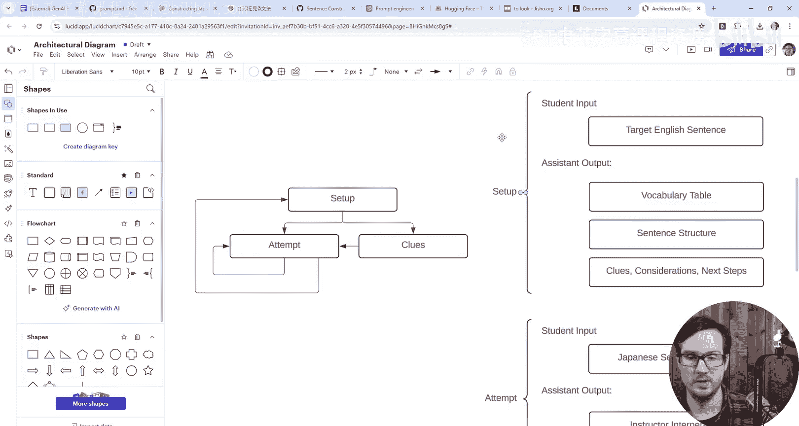

本节课中我们一起学习了如何将句子构造器项目迁移到 Claude 平台，探索了基于官方指南的提示优化，并通过模块化文件管理和状态机架构设计，为构建更复杂、更可靠的AI对话代理打下了坚实的基础。下一节，我们将基于这个架构进行具体实现。