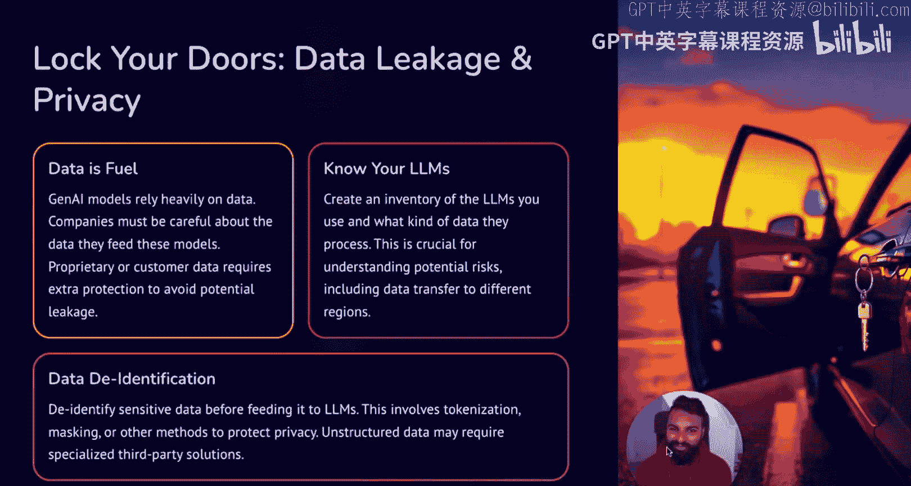
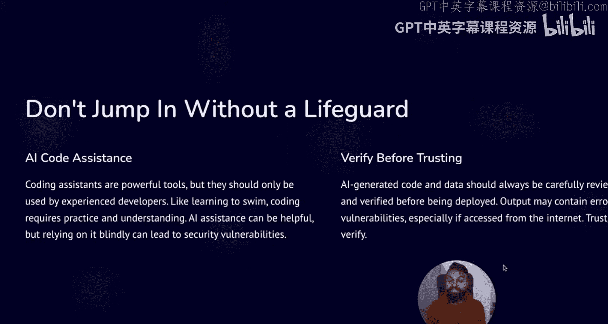
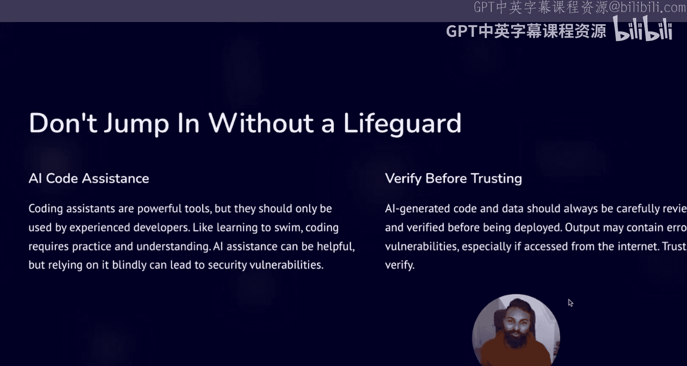

# 16：科技从业者必须了解的三大生成式AI安全秘密 🔐

在本节课中，我们将探讨当前生成式AI应用中的三个主要安全弱点。这些弱点尤其令处理敏感数据的科技公司感到担忧。了解这些风险，是安全利用AI技术的第一步。

---

## 1. 切勿将钥匙留在门口 🔑

上一节我们介绍了课程概述，本节中我们来看看第一个，也是最重要的安全弱点：数据泄露。

如果将AI比作推动业务发展的“交通工具”，那么数据就是驱动它前进的“燃料”。大多数公司，尤其是科技公司，最担心的问题就是数据泄露，因为数据是这些公司建立业务的核心。无论是Facebook、LinkedIn还是Airbnb，任何大型科技公司都依赖数据在竞争中脱颖而出。

因此，你必须清楚自己正在向这些大语言模型中输入何种数据。这也意味着你需要了解所使用的LLM模型。我们最近看到DeepSeek的例子，它实际上会将数据发送回中国的数据中心，这可能符合也可能不符合你所处理数据的法律要求。

以下是确保数据安全的关键步骤：
*   **识别敏感数据**：确保不要将敏感数据放入这些LLM模型中。
*   **实施数据脱敏**：如果必须使用，请考虑采用某种脱敏或匿名化处理，使实际数据无法被识别。例如，确保模型无法识别出其中包含本不应输入的驾驶证号码。

---

## 2. 没有救生员在场，切勿跳入海洋 🌊

上一节我们讨论了数据输入的风险，本节中我们来看看第二个弱点：对AI编码助手输出的盲目信任。

AI编码助手模型已经非常流行，这就像一片广阔的海洋，你必须选择适合你的那一个。你的团队成员和开发人员可能正在积极使用一个或多个此类编码助手。

现实情况是，尽管我们正处于“文本生成万物”的时代，但目前仍不能完全信任其产生的输出，你必须进行验证。这意味着，如果你的开发人员是初级人员或经验不足，我不建议将编码助手交给他们使用，因为现阶段依赖编码助手生成的代码，其质量可能达不到组织的要求。

此外，根据你的组织使用的编程语言，可能甚至没有对应的编码助手。如果你找到一个声称能做到的开源版本，你可能需要回到第一步，验证其背后的LLM模型。

我的建议是，如果你正在使用类似AI编码系统，请确保仅限资深开发人员访问。他们曾经历过“硬仗”，就像“救生员”一样，能够验证生成的代码不会暴露任何弱点，尤其是当应用程序将部署在互联网上时。

以下是使用编码助手的安全准则：
*   **限制访问权限**：仅允许有经验的资深开发人员使用。
*   **严格验证输出**：在将编码助手生成的代码复制粘贴到生产流水线之前，务必进行验证。

---

## 3. 保护好你的工作室 🛡️

上一节我们探讨了AI输出验证的重要性，本节中我们来看看第三个弱点：AI开发工具本身的安全漏洞。

如果你正在构建AI应用程序，无论是用于生成代码还是处理数据，你很可能会使用某种AI工作室或AI构建软件。这意味着你需要确保所使用的工具本身没有漏洞。

最近有两个例子：一个是深受数据科学家欢迎的工具Lightning AI（约有5000万人使用），它最近修复了一个漏洞；另一个是开源LLM模型DeepSeek，其R1模型也被发现存在一些安全漏洞。

因此，在开始深入AI领域之前，了解你所使用的AI构建工具以及实际使用的LLM模型是否存在安全弱点，是正确的做法。

---

## 总结与行动指南 ✅

本节课中，我们一起学习了生成式AI应用的三大安全弱点：数据泄露、对AI输出的盲目信任以及开发工具本身的漏洞。

利用所有这些信息，你可以为你所在科技公司即将开展的所有出色工作，构建一个安全的AI基础。具体行动可以很简单：

1.  **教育团队**：告知团队应输入何种数据，以及可以使用和不应使用哪些LLM模型。
2.  **实施安全控制**：确保你了解所使用的LLM模型或AI工作室中可能存在的安全漏洞。
3.  **保持关注**：这可能也是最重要的一点。AI领域日新月异，请密切关注这些公司发布的安全公告。

希望看完本视频后，你能够在不担心安全问题的前提下，充分利用AI的优势。