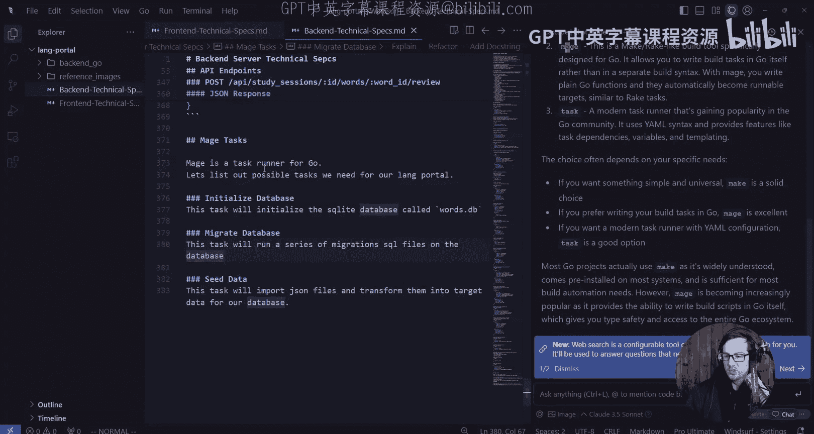
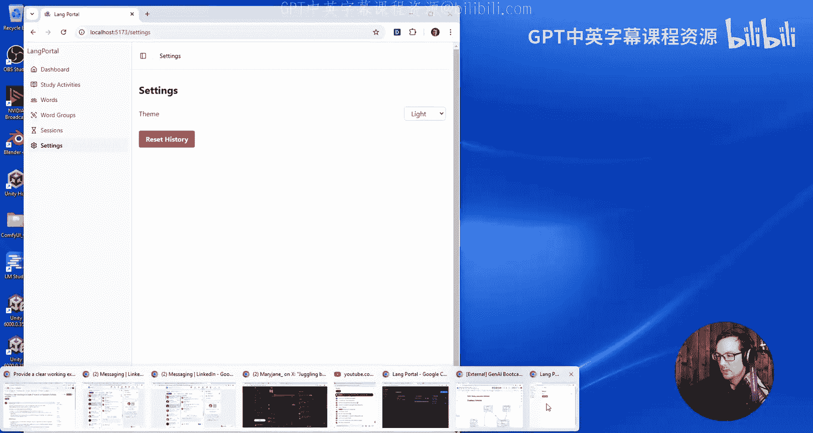
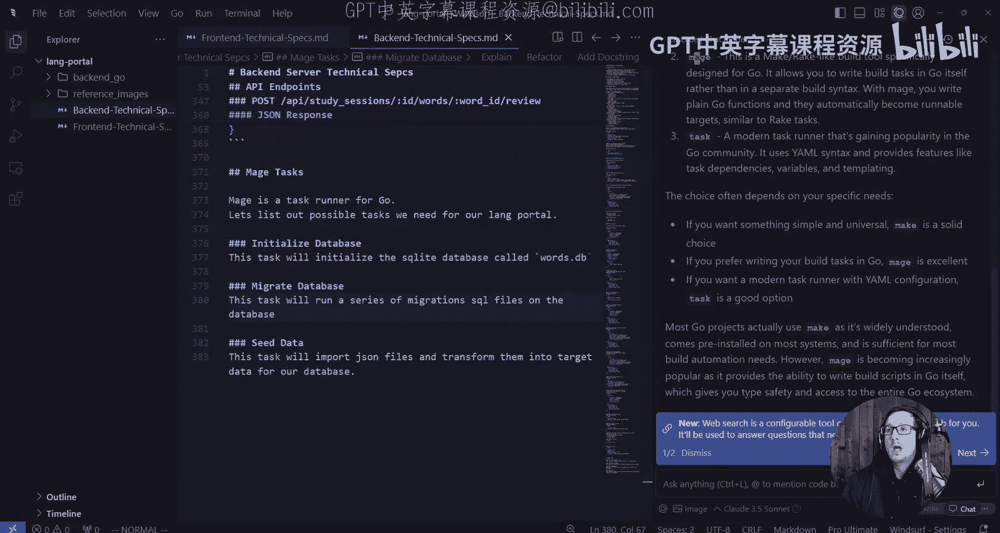
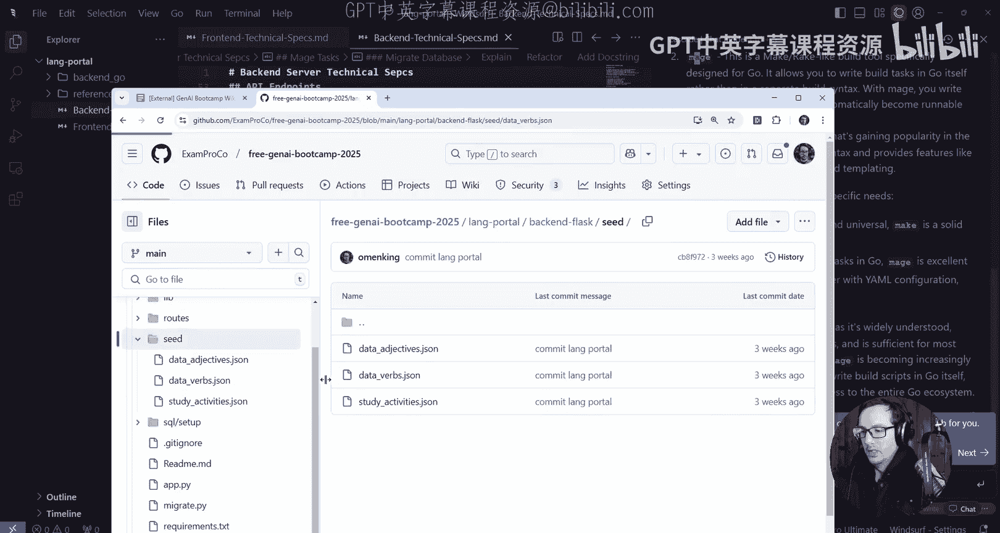
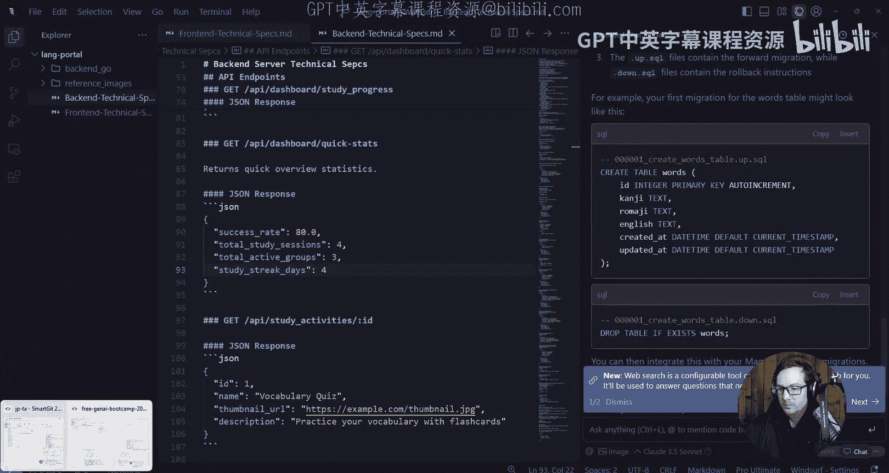
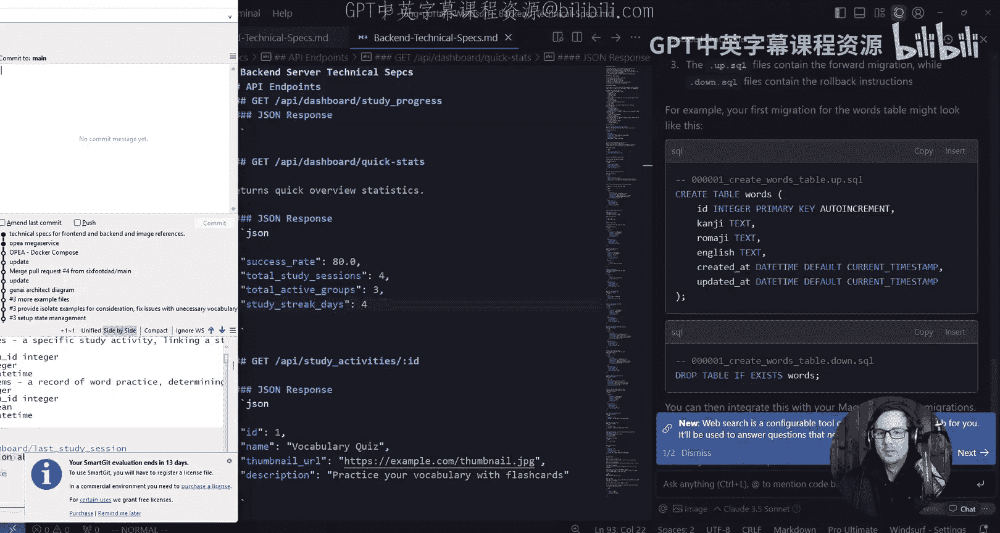
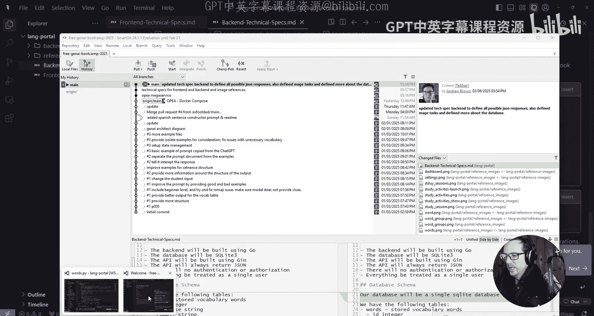
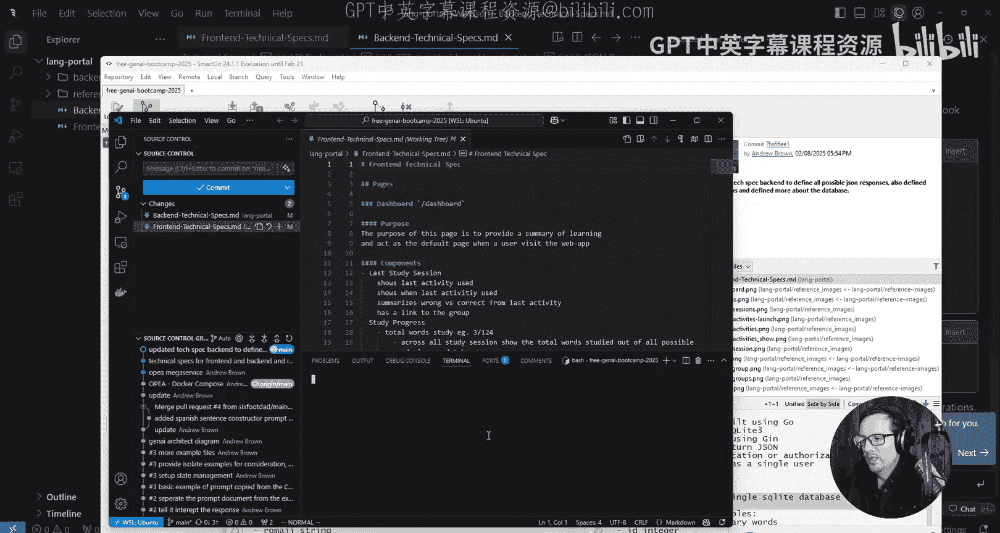
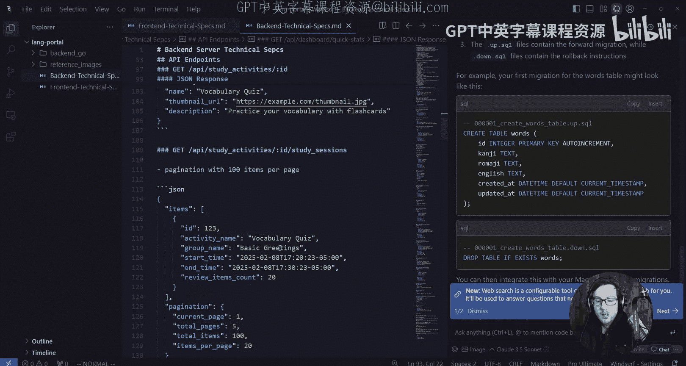

# 21：定义JSON响应与后台任务 🚀

在本节课中，我们将专注于为后端API定义清晰的JSON响应结构，并规划必要的后台任务。这是确保前后端顺畅通信、数据一致性的关键步骤。

## 概述

我们已经完成了前端和后端的基本架构。在开始具体实现后端逻辑之前，必须明确每个API端点将返回什么样的JSON数据。同时，我们还需要规划一些后台任务，例如数据库初始化和数据导入。本节课将详细定义这些内容。

## 定义API端点的JSON响应

上一节我们搭建了项目的基本框架，本节中我们来看看如何为每个API端点定义精确的JSON响应格式。清晰的接口定义是前后端协作的基石。

为了完成这项任务，我们使用AI工具分析了现有的后端技术规范文件，并逐一审查每个端点。

### 学习会话端点

以下是`/api/study-sessions` 端点预期的JSON响应结构。它返回最近学习会话的信息。

```json
{
  "id": 1,
  "group_id": 5,
  "created_at": "2023-10-27T10:00:00Z",
  "study_activity_group": "词汇复习"
}
```
我们移除了多余的嵌套层，使数据结构更加扁平，便于前端处理和SQL查询。

### 学习进度端点

接下来是`/api/study-progress` 端点。前端将根据返回的总词汇数和已学词汇数来计算进度条。

```json
{
  "total_words_reviewed": 150,
  "total_words_available": 500,
  "mastered_words": 75,
  "recent_accuracy": 0.85
}
```
请注意，`mastery_progress` 字段可以从其他两个值推断出来，因此无需单独返回。

### 快速统计端点

`/api/quick-stats` 端点提供应用的概览数据。

```json
{
  "total_words": 1000,
  "total_groups": 20,
  "mastered_words": 300,
  "recent_accuracy": 0.88
}
```

### 学习活动端点

`/api/study-activities` 端点返回分页的学习活动列表。为了保持一致性，我们将列表项统一命名为 `items`。

```json
{
  "items": [
    {
      "id": 101,
      "activity_name": "今日测试",
      "group_name": "基础词汇"
    }
  ],
  "page": 1,
  "per_page": 20,
  "total": 45
}
```

### 创建学习活动端点

`POST /api/study-activities` 端点用于创建新的学习活动。其请求参数和响应如下。

**请求参数：**
- `group_id`: `integer`

**响应JSON：**
```json
{
  "id": 102,
  "group_id": 5
}
```
创建成功后，主要返回新活动的ID以供后续使用。

### 词汇相关端点

`/api/words` 端点返回词汇列表。目前我们暂不处理词汇的“词性”部分，这可能会由专门的打字练习应用来处理。

```json
{
  "items": [
    {
      "id": 5001,
      "japanese": "こんにちは",
      "romaji": "konnichiwa",
      "english": "hello",
      "correct_count": 12
    }
  ],
  "page": 1,
  "per_page": 100,
  "total": 1200
}
```

### 分组相关端点

`/api/groups` 和 `/api/groups/{id}/words` 端点分别返回所有分组和指定分组下的词汇。

**分组列表响应：**
```json
{
  "items": [
    {
      "id": 1,
      "name": "日常用语",
      "stats": {
        "word_count": 50
      }
    }
  ]
}
```

**分组词汇响应：**
```json
{
  "items": [
    {
      "id": 5001,
      "japanese": "ありがとう",
      "romaji": "arigatou",
      "english": "thank you"
    }
  ]
}
```
分组名称在另一个端点中已可获取，因此在此处省略以避免冗余。

### 学习会话详情端点

`/api/study-sessions/{id}` 端点返回特定学习会话的详细信息，包括其包含的词汇。

```json
{
  "id": 30,
  "activity_name": "单元测验",
  "group_name": "动词变形",
  "start_time": "2023-10-27T14:30:00Z",
  "end_time": "2023-10-27T15:00:00Z",
  "review_items": [
    {
      "word_id": 5001,
      "japanese": "食べる",
      "english": "to eat",
      "was_correct": true
    }
  ],
  "stats": {
    "total": 20,
    "correct": 18
  }
}
```

### 提交答案端点

`POST /api/study-sessions/{id}/answer` 端点用于提交单词答案。

**请求参数：**
- `word_id`: `integer`
- `is_correct`: `boolean`

**响应JSON：**
```json
{
  "success": true,
  "word_id": 5001,
  "session_id": 30
}
```





### 重置历史端点





`POST /api/reset-history` 端点用于重置用户的学习历史。

```json
{
  "success": true,
  "message": "学习历史已重置"
}
```

## 规划后台任务

定义完API接口后，我们需要规划一些不直接通过API调用，但对应用运行至关重要的后台任务或脚本。我们将使用Go语言的`Mage`作为任务运行器。

以下是需要实现的主要任务：





### 1. 初始化数据库
此任务将初始化一个名为 `words.db` 的SQLite数据库文件，并运行一系列迁移脚本。
- **数据库位置**: 位于Go后端项目的根目录。
- **迁移文件**: 存放在 `migrations/` 文件夹下，并按文件名顺序执行（例如 `001_create_tables.sql`）。

### 2. 导入种子数据
此任务将JSON格式的种子数据导入数据库，并转换为目标结构。
- **种子文件**: 存放在 `seeds/` 文件夹中。
- **数据结构示例**:
```json
{
  "group_name": "问候语",
  "words": [
    {
      "japanese": "おはよう",
      "romaji": "ohayou",
      "english": "good morning"
    }
  ]
}
```
- **任务描述**: 任务将指定每个种子文件及其对应的目标单词分组。



## 总结



本节课中我们一起学习了如何为后端API定义精确的JSON响应格式，并规划了必要的后台任务。我们逐一审查了每个端点，确保返回的数据结构清晰、扁平且符合前端需求。同时，我们确定了使用`Mage`来管理数据库初始化和数据导入等任务。



现在，我们拥有了完整的后端技术规范，为下一步的具体代码实现打下了坚实的基础。在接下来的课程中，我们将开始着手实现这些定义好的接口和任务。