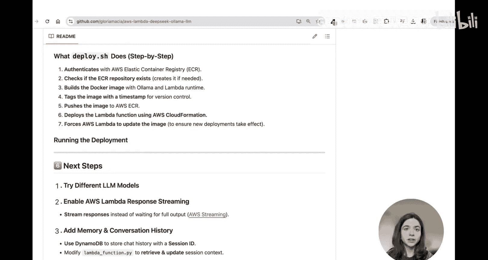
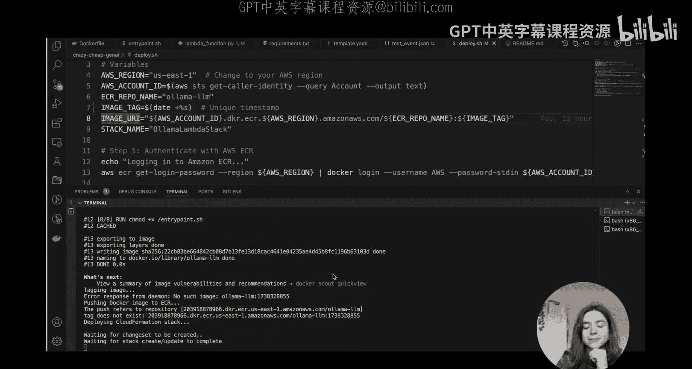
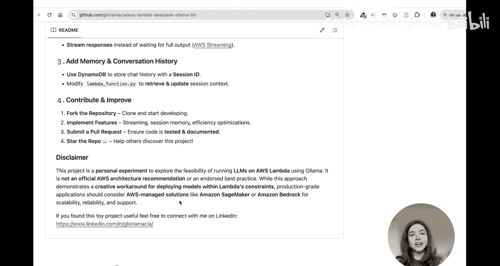

# 25：在AWS Lambda中部署DeepSeek模型 🚀

在本教程中，我们将学习如何通过一种巧妙的方式，在AWS Lambda中部署Ollama模型。我们将以DeepSeek模型为例，探索如何在Lambda的内存和存储限制内运行大型语言模型。

## 概述

我们将介绍如何利用AWS Lambda的临时存储和最大资源配置，结合Ollama的轻量级模型，在无服务器环境中运行LLM。核心在于使用Docker容器、调整模型路径以及利用运行时接口客户端来桥接请求。

---

## 模型选择与Ollama基础

上一节我们概述了项目目标，本节中我们来看看具体的模型选择和Ollama平台的基本使用。

首先，访问Ollama官网可以找到许多能在本地运行的模型。我们将重点关注DeepSeek模型系列。

请注意，DeepSeek R1拥有670亿参数，这个规模显然无法放入Lambda的10GB内存限制中。因此，我们需要寻找更小的模型。

以下是可选的模型类型：
*   **标准模型**：如DeepSeek R1，参数量大，不适合Lambda环境。
*   **精简模型**：这些是经过优化的小型模型，在显著降低计算开销的同时，保留了大部分核心能力。

我成功放入Lambda内存的最大模型是80亿参数的版本。这就是我们将要拉取的模型。

接下来，快速浏览Ollama的API文档，因为后续我们会频繁使用它。关键点包括：
*   我们将使用生成聊天补全端点。
*   可以在此处控制流式输出的开启与关闭。
*   通过指定模型名称来拉取模型。
*   注意，Ollama不仅支持其Hub上的现有模型，还允许你创建并绑定自己的模型，这大大扩展了可能性。

---

## 代码部署与执行

现在我们已经了解了模型和工具，本节将指导你如何部署和运行代码。

执行我们的Lambda函数后，可以看到模型成功返回了答案。我还想展示我们是如何充分利用AWS Lambda的所有可用内存的。

接下来，查看调用日志。

在日志中，注意我们是如何拉取DeepSeek模型的。然后加载模型，看到模型已成功加载的响应，最后是Lambda处理我们测试事件的实际调用记录。

既然你已经看到它能工作，以下是你自己运行所需的代码。向下滚动，可以找到部署说明。

只需运行 `deploy.sh` 脚本即可。这非常简单，因为我已将一切编写为基础设施即代码。

再向下滚动，它会确切告诉你脚本在做什么。部署脚本首先使用ECR进行身份验证，并检查存储库是否已存在。第一次运行时它不存在，因此会为你创建一个。然后，它在本地构建Docker镜像并将其推送到新创建的ECR仓库。

镜像被打上时间戳标签，这样每当有新镜像被推送时，Lambda会自动获取它。

现在我们的镜像已在ECR中，我们可以部署CloudFormation模板，该模板将创建一个使用该镜像的Lambda函数。你可以在本地运行脚本，完成后，我将展示已部署的CloudFormation堆栈。

CloudFormation堆栈现在处于“CREATE_COMPLETE”状态。如果我们点击“资源”选项卡，你会注意到创建了两个资源：一是我们的Lambda函数，二是Lambda函数需要用来写入日志的执行角色。

点击Lambda函数，会跳转到Lambda函数控制台。请注意，它实际上是从ECR获取我们的镜像。点击该镜像，可以看到ECR仓库的名称与我们在CloudFormation模板中定义的完全一致，并且我们的镜像带有时间戳标签。

回到Lambda函数控制台并检查日志，你会发现一些有趣的事情。首先，模型第一次运行时，因为Docker镜像中不存在，所以需要拉取，这需要一些时间，函数经历冷启动。

然而，在后续的调用中，当Lambda函数处于“热”状态时，模型已经下载完毕，存在于缓存中，Ollama服务器只需加载它，因此速度会快得多。

因此，你可以考虑一些聪明的策略，例如预置Lambda函数或使用预热器来保持Lambda函数处于活跃状态，从而避免用户经历冷启动。

在我的脚本中，另一个有趣的点是添加了剩余磁盘空间的报告。我使用了Lambda提供的最大10GB临时存储。在代码末尾，一旦模型被拉取，我会要求报告可用空间。这很有用，因为虽然Lambda开箱即用地提供了内存使用量，但它不会报告剩余可用空间。通过添加这几行代码，我可以告诉你哪些模型能够放入，因为如果你尝试从Ollama拉取的模型太大，无法放入这10GB空间，你会在这里看到错误，并且会更快地达到内存限制。

---

## 工作原理与实现技巧

上一节我们部署并观察了运行过程，本节我们来深入理解其工作原理和实现的关键技巧。

如我所提到的，我们使用的是精简模型，它们是LLM的较小优化版本，在显著降低计算开销的同时保留了大部分能力，这使其成为无服务器执行的理想选择。而Ollama使我们能够高效地在本地部署大语言模型。

这里的巧妙之处在于，我们没有使用本地计算机，而是使用了AWS Lambda。

为了实现这一点，我们需要几个巧妙的技巧。首先，我们将Lambda的资源限制增加到最大值。我使用了Lambda可用的最大内存和最大临时存储。存储是临时的，这很重要，因为你无法将已拉取模型的Lambda镜像直接放入临时存储；如果你想将其放在临时存储上，需要在函数运行时进行。

其次，我将超时设置为5分钟，这绰绰有余。但如果你因为拉取非常大的模型而遇到超时限制，可能需要考虑增加超时时间。

我做的第二个技巧是确保Ollama服务器使用Lambda函数的临时存储，即更改模型路径。你会在我的代码中再次看到这一点。第一次运行需要一些时间，因为模型正在被拉取，你会经历冷启动，但从那以后，函数就已经是“热”的了。

第三个技巧是使用一个Python库，名为`aws-lambda-ric`。本质上你需要知道的是，Lambda容器不会自动运行Python脚本，这不是它们与Lambda处理程序交互的预期方式。我们使用这个聪明的库创建一个运行时接口客户端，允许我们在Lambda内部启动一个HTTP服务器，以桥接请求。在我们的例子中，它只是一个测试事件，但它可以是一个像API Gateway这样的API，将请求发送到我们的Lambda。然后，在运行Ollama服务器时，它保持Lambda进程存活。你会看到，在我们的Docker镜像的最后，运行了一个名为`entrypoint.sh`的脚本。

本质上，它在后台启动Ollama服务器，这非常重要，因为然后Lambda运行时将在前台调用函数。函数所做的是等待请求。

这里有一个API使用示例，展示了如何发送测试事件以及它应该返回的响应。

---

## 扩展可能性与免责声明

我们已经掌握了核心部署方法，本节将探讨一些可能的扩展方向，并了解本项目的定位。

你可以尝试以下几件事：尝试其他LLM。我展示的是DeepSeek，但你可以尝试Llama模型、Mistral或Gemma。本质上，任何在Ollama Hub上可用的模型，甚至是你自己的模型。

其次，我尚未实现让Lambda响应流式输出，但这实际上是可能的。因此，如果有人想尝试这个改动，我在这里链接了一篇博客文章。

第三，目前我们的Lambda没有记忆功能，因此每次调用都是独立的，不记得之前的对话历史。但这可以实现，例如，如果你使用DynamoDB来存储会话ID。所以，如果你希望改进当前代码，这是一个可能的增强方向。

如果你希望进行任何这些更改，欢迎为代码库做贡献，提交功能请求或拉取请求。

最后但同样重要的是，如果你喜欢这个代码，请给它一个星标。

我想以一份免责声明结束本视频：这是一个个人实验，旨在探索使用Ollama在AWS Lambda上运行LLM的可行性。这不是官方的AWS架构建议，也绝不是认可的最佳实践。

虽然这种方法展示了在Lambda限制内以极其廉价的方式部署模型的创造性解决方案，但对于生产级应用程序，你应该考虑AWS托管解决方案，如Amazon SageMaker或Amazon Bedrock，因为它们提供了更好的可扩展性、可靠性和支持。

如果你觉得这个实验项目有用，欢迎在LinkedIn上与我联系，我非常有兴趣了解你构建了什么。

---

## 总结

在本节课中，我们一起学习了如何在AWS Lambda上部署Ollama模型，特别是DeepSeek的精简版本。我们涵盖了从模型选择、代码部署、工作原理到潜在扩展的完整流程。关键点包括：利用Lambda的最大资源配置、使用临时存储存放模型、通过`aws-lambda-ric`库桥接请求，以及理解冷启动与热状态的性能差异。这是一个展示无服务器环境运行LLM可能性的创意实验，为轻量级、低成本的原型开发提供了思路。