# 27：OPEA 代码详解

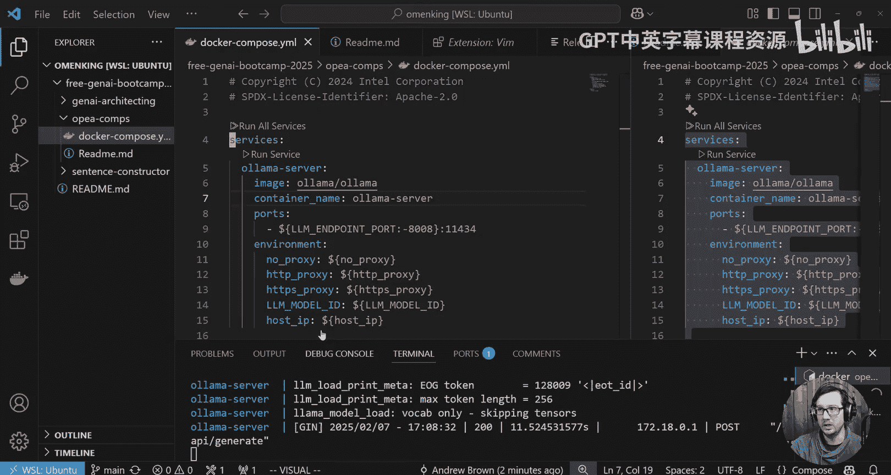

## 概述

在本节中，我们将深入探讨 OPEA 项目中 LLM 微服务的代码结构。我们将了解如何配置和运行该服务，特别是它与不同后端（如 TGI、vLLM 和 Ollama）的兼容性问题。我们将通过分析代码和文档来理清其工作原理。

## 当前运行环境

上一节我们成功启动了 Ollama 服务。现在，我们需要在其前端部署一个服务来与之交互。

我们的 Ollama 服务器正在运行。接下来，我们需要在其前端部署一个服务。

## 探索 LLM 微服务

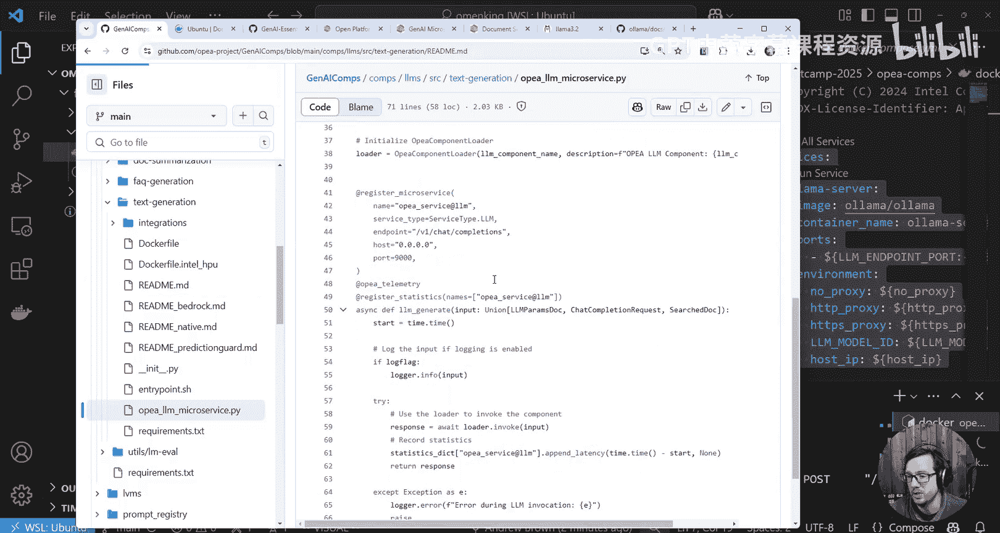

以下是可用的微服务选项：

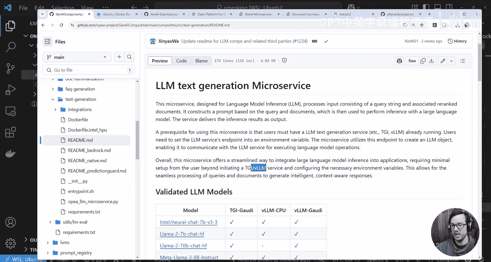

*   **LLM 微服务**：利用 LangChain 实现摘要策略，并使用文本生成接口在 Intel Gaudi2 或 Xeon 处理器上促进 LLM 交互。可以设置后端为 TGI 或 vLLM。
*   **VLM 微服务**：专注于多模态任务，如图像问答，由 vLLM 驱动。

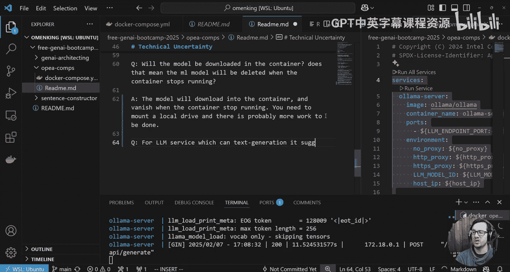

我们关注的是 **LLM 微服务**，因为它处理文本生成，这是我们当前的需求。

## 分析 LLM 微服务代码

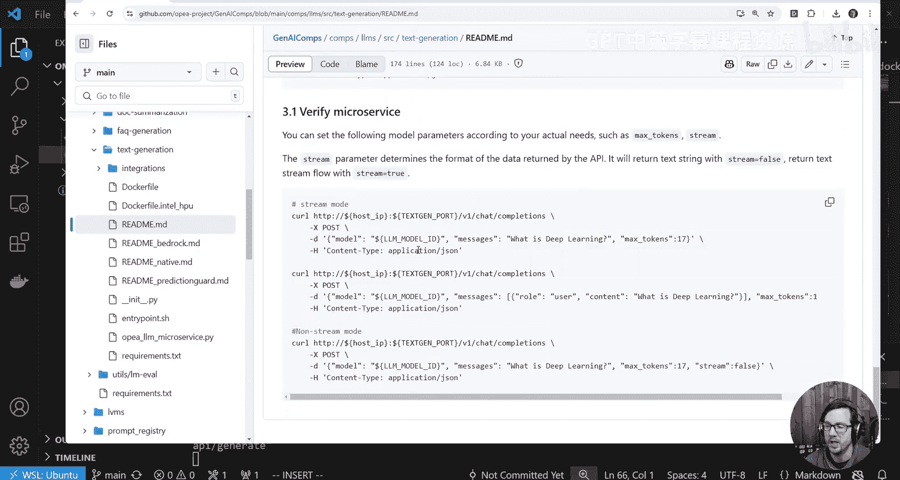

我们进入 `llms` 目录查看其源代码。关键文件包括 `Dockerfile` 和入口点脚本。

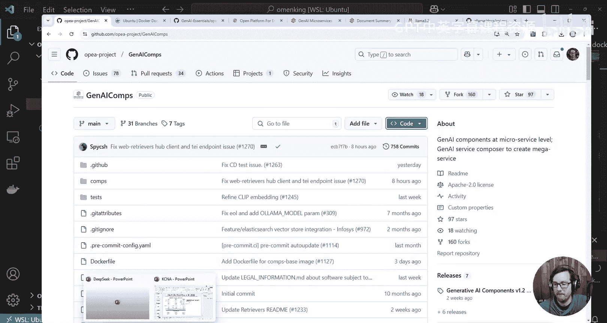

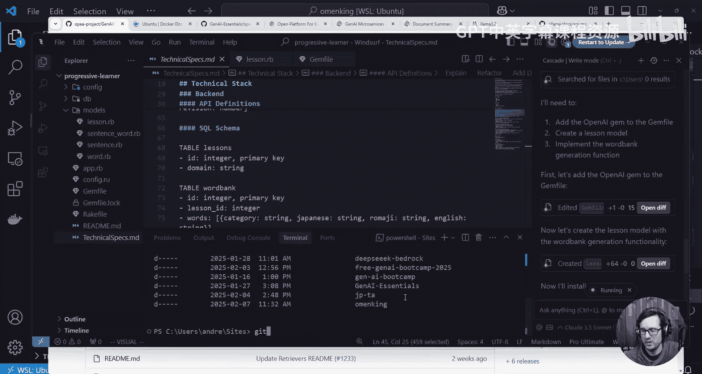

`Dockerfile` 显示它基于 `python:slim` 镜像，安装必要的库，并最终执行 `endpoint.sh` 脚本。

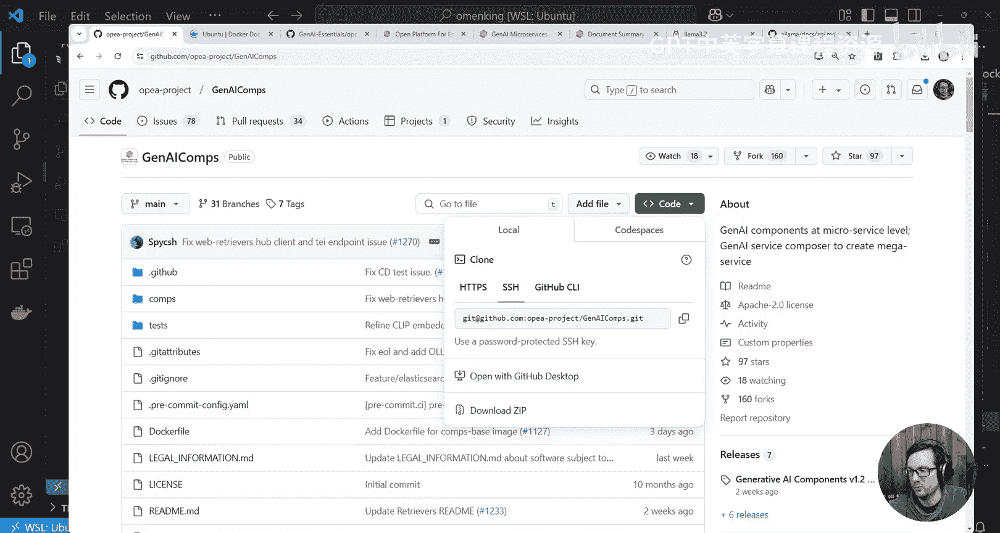

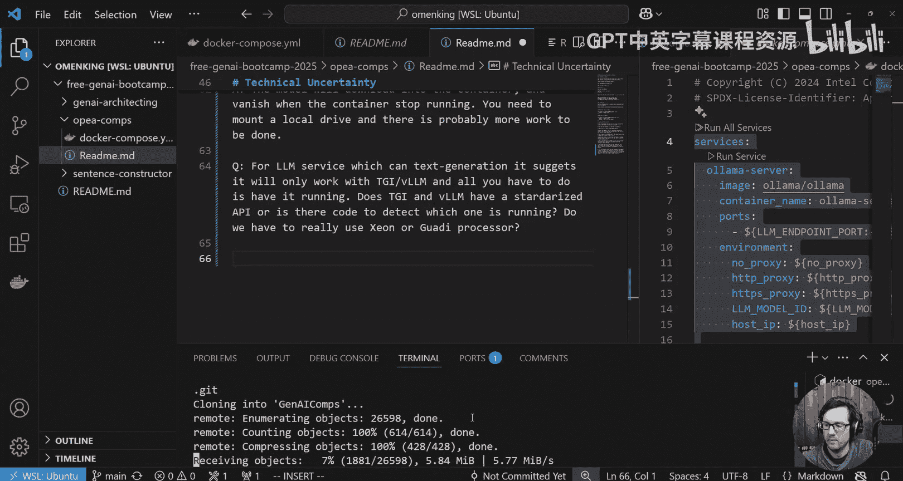

`endpoint.sh` 脚本启动了 `OPA-LLM-Microservice`。查看其内容，我们发现它设置了开放遥测（一种开源监控工具）和 API 协议模板。

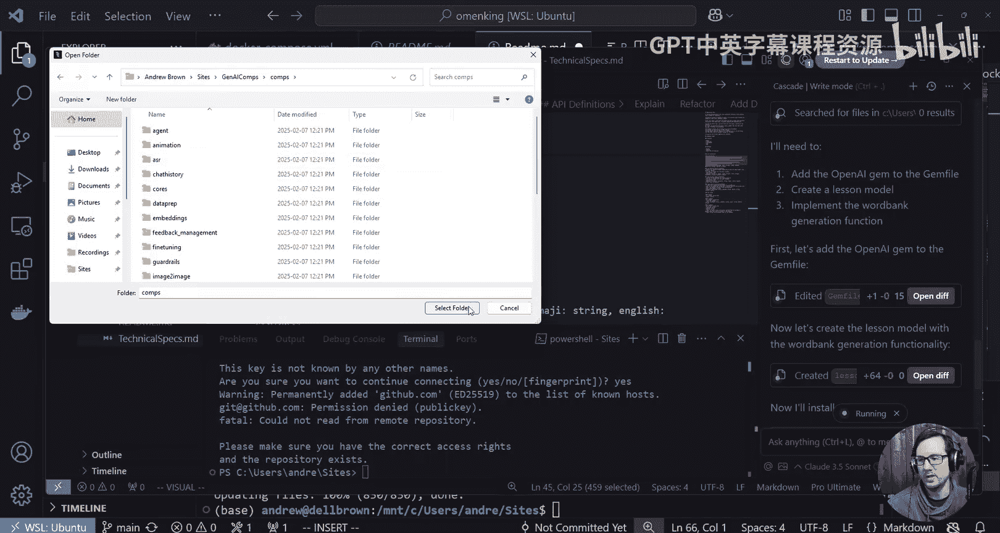

核心问题是：**该服务如何连接到后端 LLM 服务？**

阅读 `README.md` 发现，该微服务的前提是必须有一个 LLM 文本生成服务（TGI 或 vLLM）已经在运行。用户需要将 LLM 服务的端点地址设置为环境变量 `ENDPOINT`。

代码中，在 `service.py` 文件里，我们看到了一个 `get_llm_endpoint` 函数，它从环境变量读取端点地址，默认端口是 `8080`。

## 关键问题：API 兼容性

文档指出该服务仅适用于 TGI 或 vLLM。但我们需要验证：**Ollama 的 API 是否与 TGI/vLLM 兼容？**

为了回答这个问题，我们进行了调研。VLLM、TGI 和 Ollama 都提供了 API。关键在于它们的 API 模式是否相似或相同。

根据调研，VLLM、TGI 和 Ollama 都致力于提供与 **OpenAI 风格 API** 的兼容性。这意味着它们的基本调用方式（如 `/v1/completions` 或 `/v1/chat/completions`）是相似的。

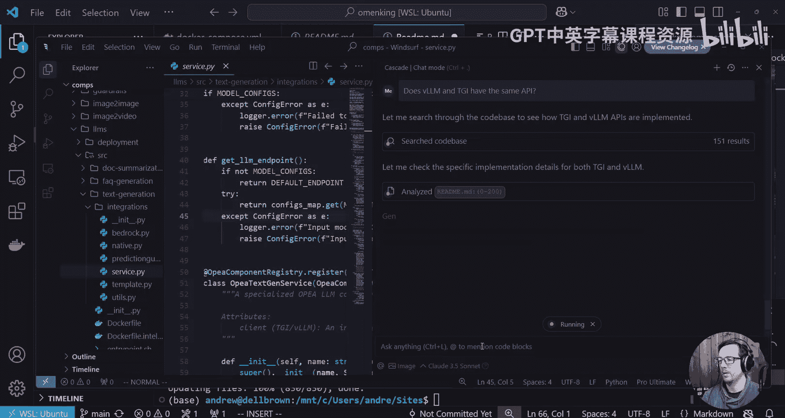

理论上，如果它们都遵循相似的标准，那么 LLM 微服务应该也能与 Ollama 后端协同工作，只需将端点指向 Ollama 服务器即可。

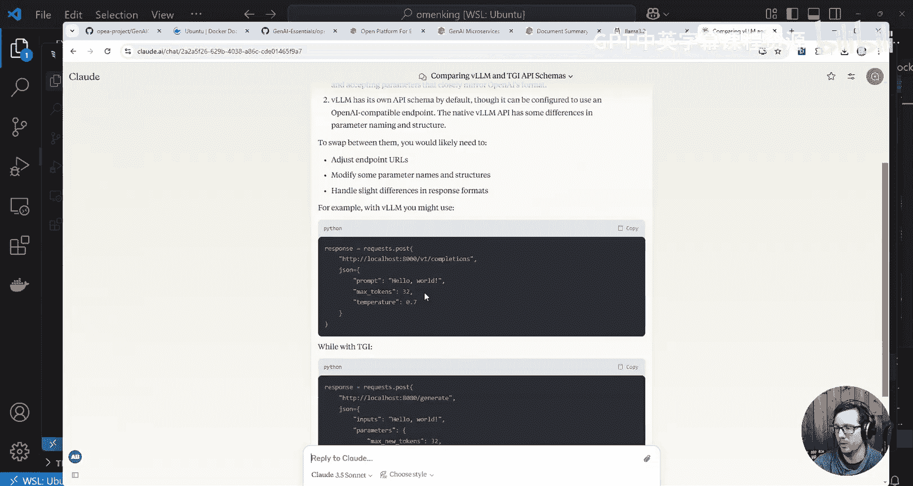

## 使用工具辅助代码分析

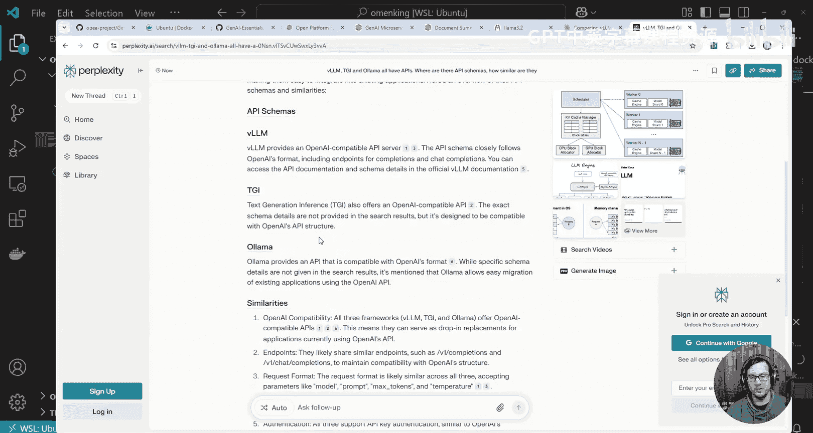

为了更高效地理解代码依赖，我们使用了 Windsurf（一个 AI 编程助手）来分析项目结构。

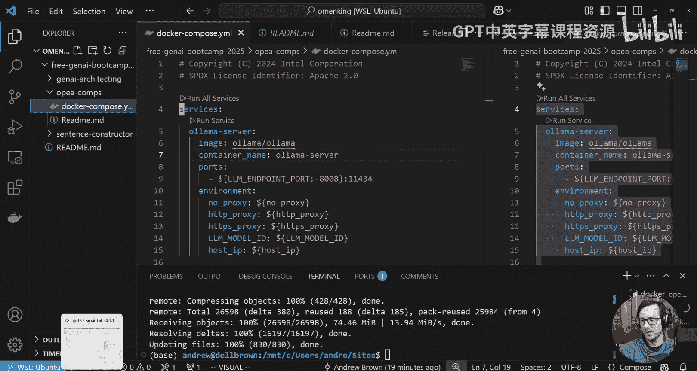

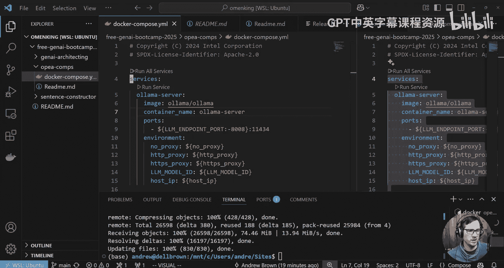

我们向 Windsurf 提问：“运行 `llms` 目录下的代码，最少需要引入哪些其他目录？”

分析表明，除了 `llms` 本身，很可能还需要引入 `cores` 目录，因为它包含像 `OPAComponentCore` 这样的核心组件。这提示我们，如果要单独构建或运行此微服务，需要考虑其内部依赖。

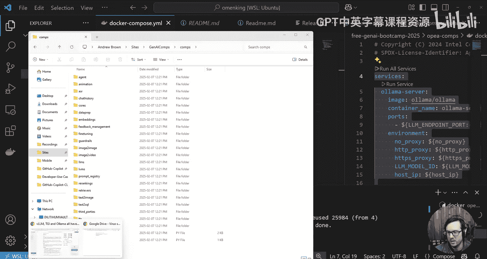

## 架构思考与后续步骤

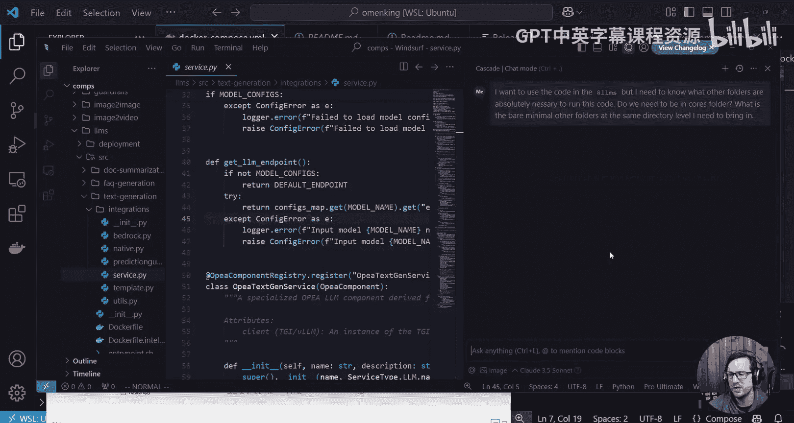

OPEA 的架构文档提到，可以使用 `@register_microservice` 装饰器来创建微服务。这引发了一个新问题：当我们运行这个 Python 文件时，它是会直接启动服务，还是会协调启动多个容器？

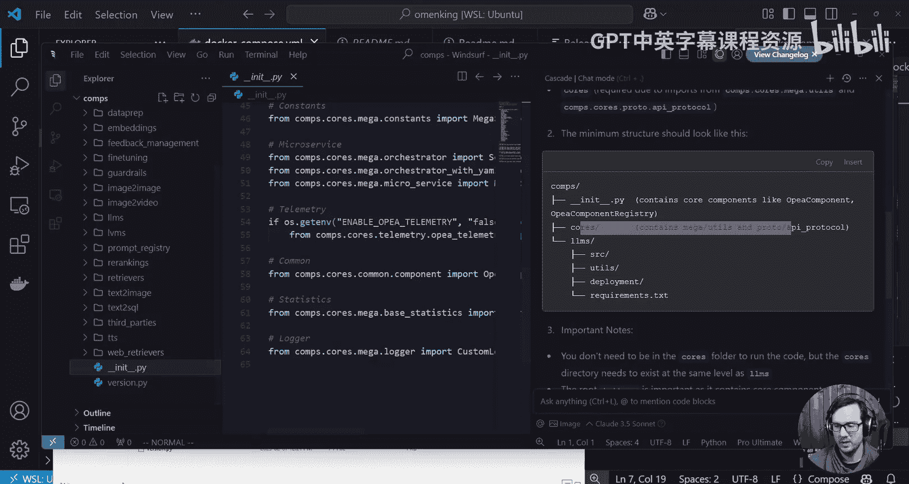

目前的信息不足以直接得出结论。一种可行的方式是尝试实际配置并运行这个 LLM 微服务，将 `ENDPOINT` 环境变量指向我们正在运行的 Ollama 服务（例如 `http://localhost:11434`），然后观察其行为。这将是最直接的验证方法。

## 总结

本节课我们一起学习了以下内容：

1.  **回顾了 OPEA 项目中的 LLM 微服务**，其作用是作为各种后端 LLM 服务（如 TGI、vLLM）的统一前端。
2.  **分析了该服务的代码结构**，包括 Dockerfile 和启动脚本，并找到了配置后端端点的关键位置。
3.  **探讨了核心的 API 兼容性问题**。通过调研，我们了解到 TGI、vLLM 和 Ollama 都倾向于支持 OpenAI 兼容的 API，这为使用 Ollama 作为后端提供了可能性。
4.  **演示了如何使用 AI 编程助手（Windsurf）** 来快速分析代码依赖和项目结构。
5.  **明确了下一步行动**：通过实际配置和运行 LLM 微服务，并指向 Ollama 后端，来验证其兼容性和运行方式。

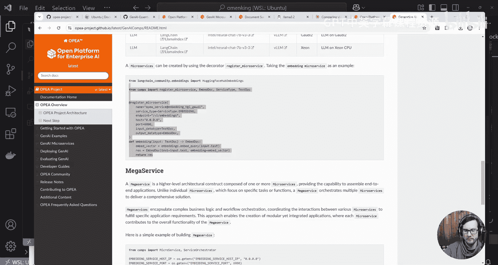

本节的重点在于代码探索和问题分析，这是开发过程中解决集成难题的典型工作流程。