# 30：第一周作业提交示例 📝

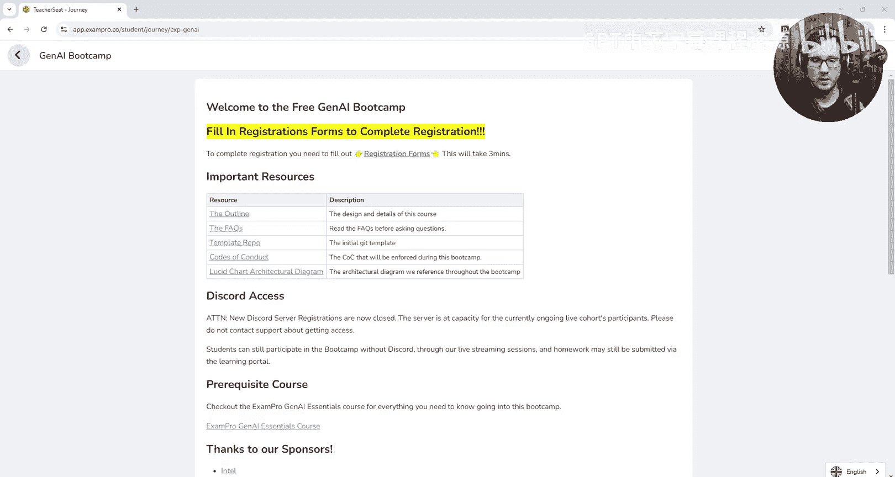

在本节课中，我们将学习如何正确提交第一周的作业。通过观看Andrew Brown的演示，你将了解提交作业的完整流程、需要填写的内容以及助教在评估时关注的重点。

---

## 概述

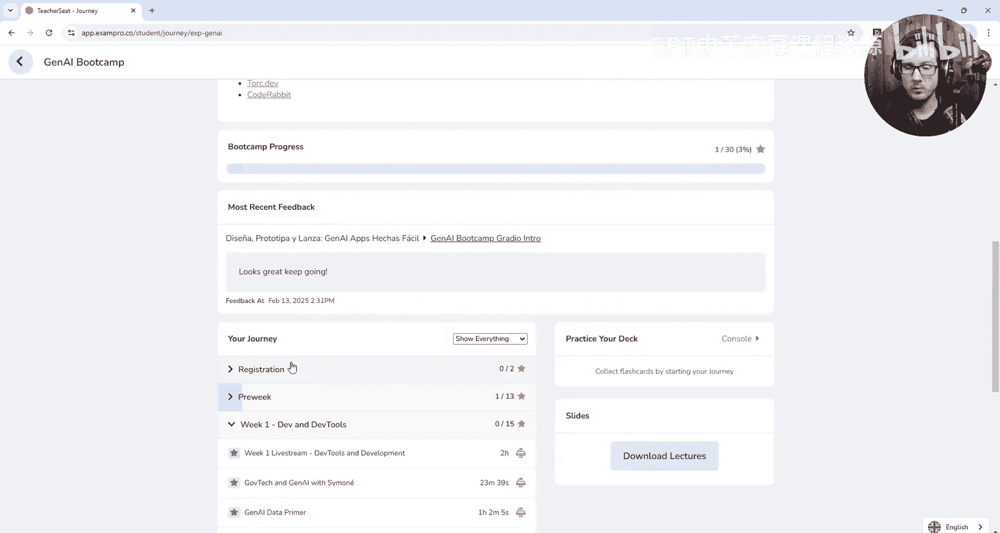

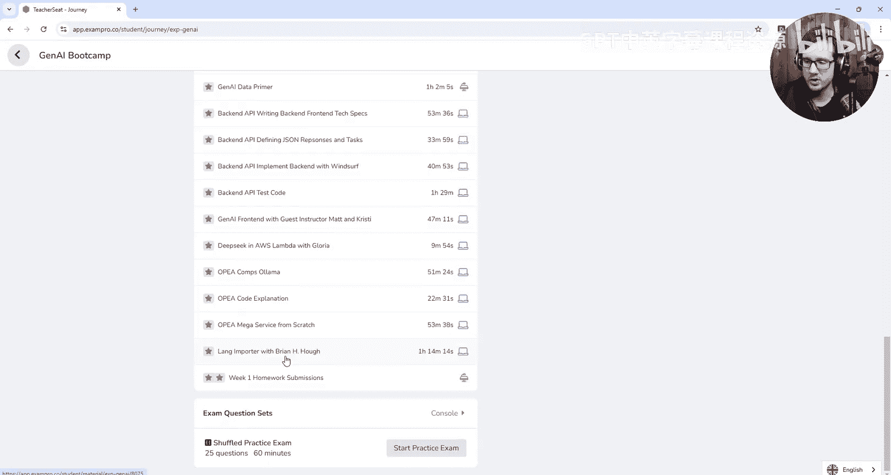

本节课演示了如何填写第一周的作业提交表单。提交内容需要涵盖你在本周完成的主要任务，包括后端API实现、前端开发、词汇导入工具以及OPA（开放策略代理）的实现尝试。即使某些任务未完全完成，诚实地描述你的进展和遇到的挑战也同样重要。

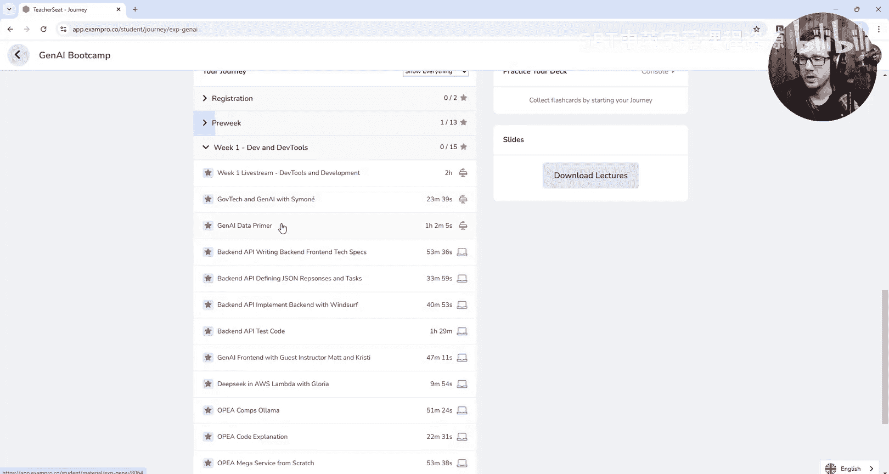

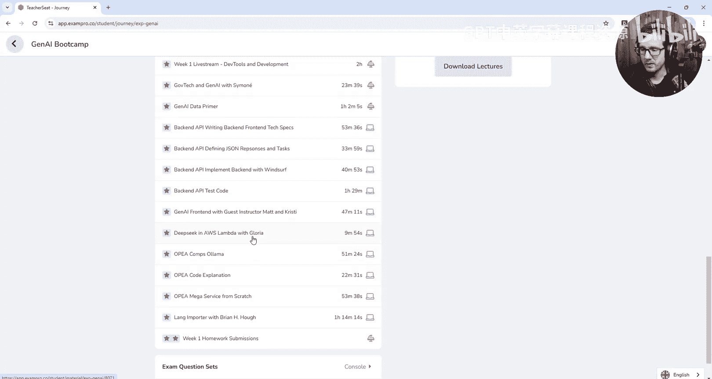

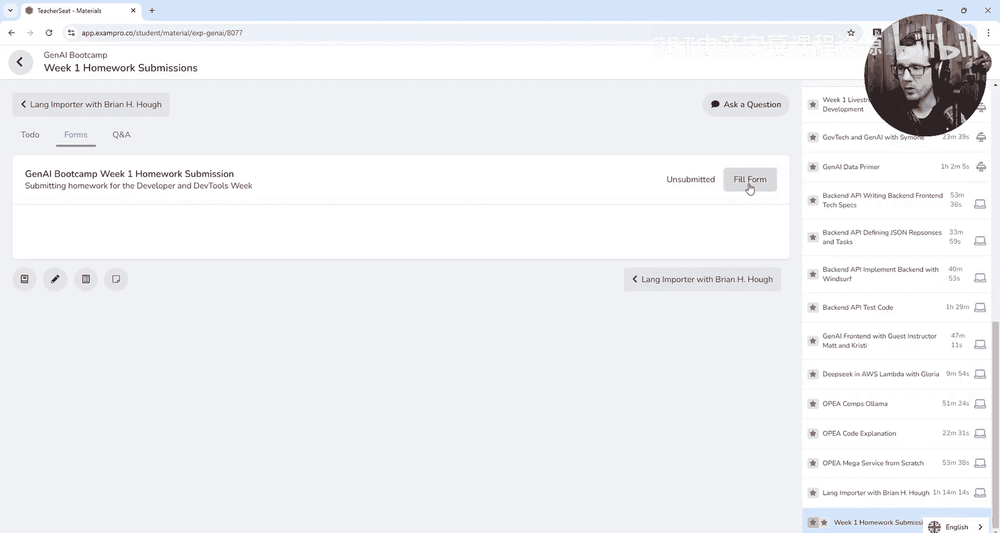

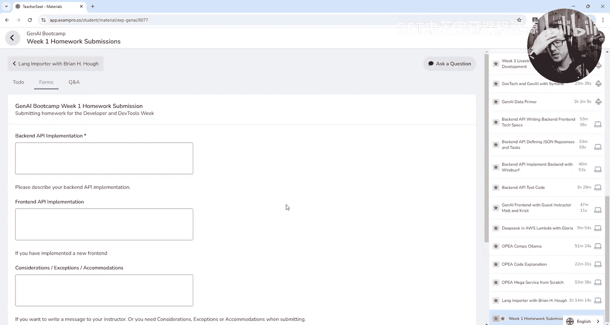

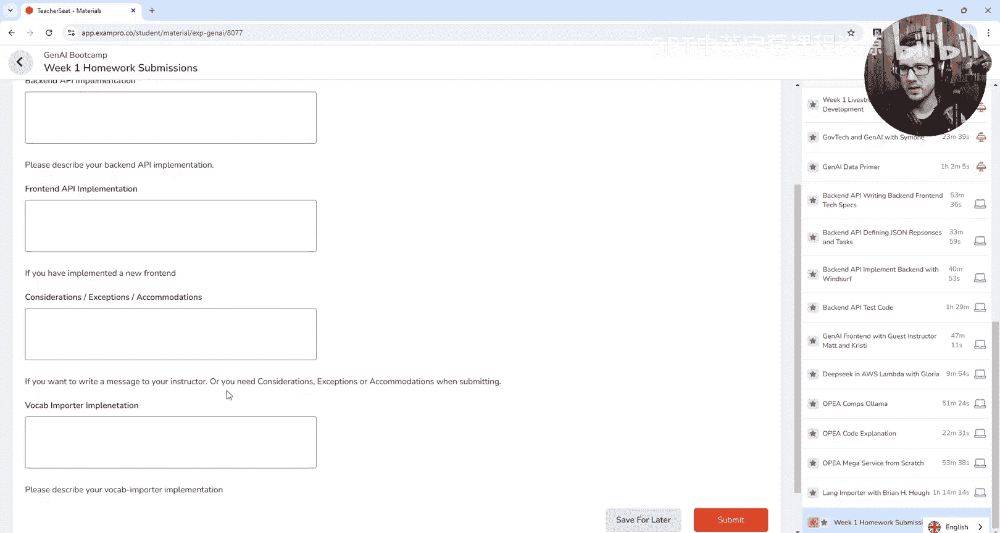

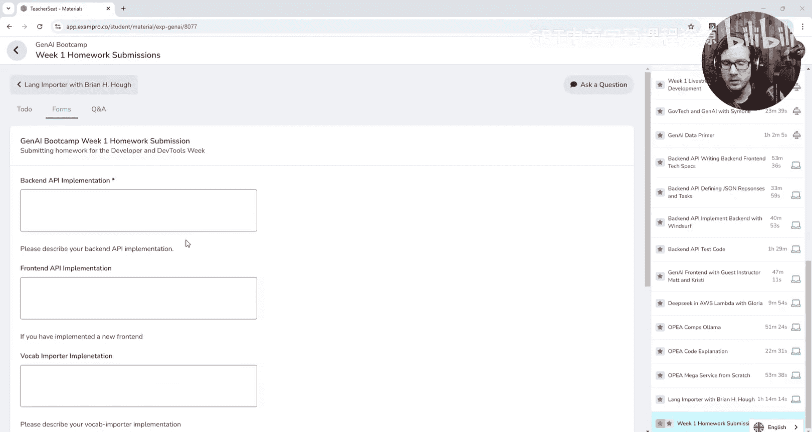

## 作业提交流程

首先，你需要访问课程平台上的“作业提交”区域。第一周包含多项任务，例如政府技术数据入门等。请确保你已经观看了所有相关视频，因为系统会记录你的观看进度，这也是评估的一部分。

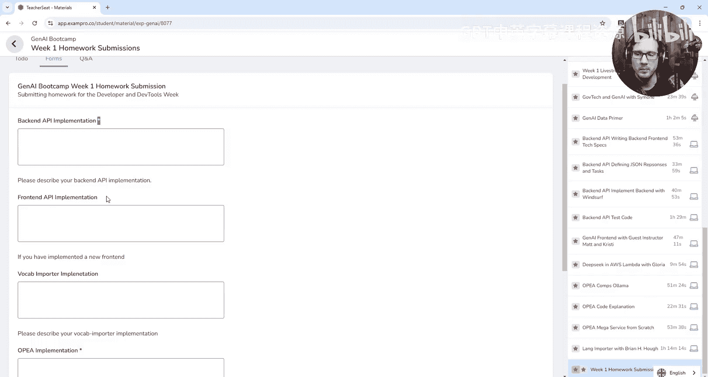

以下是提交表单中需要填写的几个核心部分，我们将逐一进行说明。

## 各部分填写指南

### 1. 后端API实现

在这一部分，你需要描述你如何实现或修改了后端API。重点在于说明你做了哪些与示例代码不同的事情，或者你如何完善了缺失的端点。

**示例填写：**
*   **我做了什么：** 我使用Golang和Gin框架，从头开始重新实现了整个后端API。
*   **遇到的问题与解决：** 我注意到原始实现中的API路径不一致，因此我对其进行了标准化处理，确保了所有API的一致性。
*   **测试：** 我使用Ruby和RSpec编写了测试套件，以确保生成的代码功能符合预期。
*   **方法反思：** 我尝试使用Windsurf，一次性输入完整的技术规格文档来生成整个后端。然而，在后续生成测试代码时，AI发现了许多后端API生成阶段引入的错误。因为我详细定义了每个端点及其预期的JSON输出，所以我对生成的测试的准确性有较强信心。

**关于使用原有Flask后端：**
如果你选择继续使用课程最初提供的Flask后端，可能会发现某些端点缺失。这是因为在课程进行中，一些端点被移除了。为了解决这个问题，你可以：
1.  自行修复或重新实现这些端点。
2.  或者，通过GitHub的提交历史，找到并下载包含完整端点的早期版本代码。你可以在项目仓库中浏览历史提交，找到合适的版本并下载其代码快照。

---

### 2. 前端实现

这部分描述你构建前端的经历。即使没有完全重写，也可以分享你使用工具生成代码并手动调整的过程。

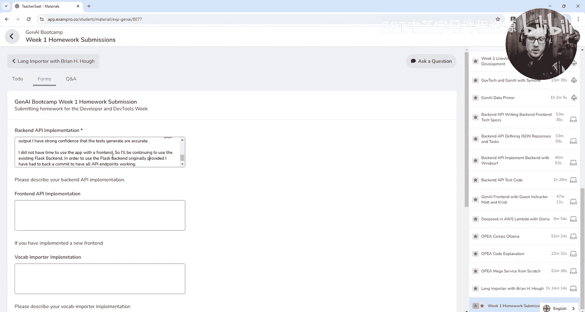

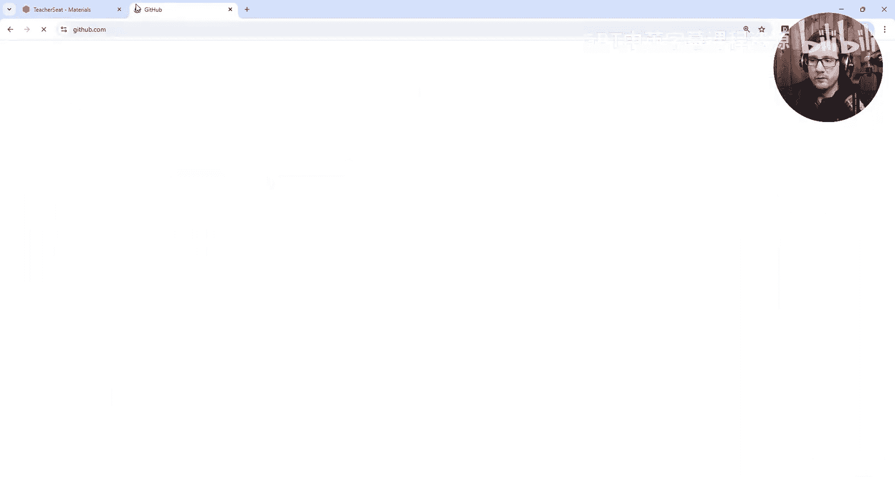

**示例填写：**
*   **我做了什么：** 我编写了前端技术规格文档，并使用Lovable.dev来生成前端代码。
*   **体验与调整：** Lovable完成得不错，但工作流程有些令人沮丧。因此，我将生成的代码下载到Windsurf中，并手动完成了剩余的实现。
*   **工具对比：** 我认为如果拥有Lovable的付费版本，或许通过大量对话迭代也能完成。但将后端API代码放在Windsurf的同一个项目中，允许它交叉引用代码，这大大提升了效率。

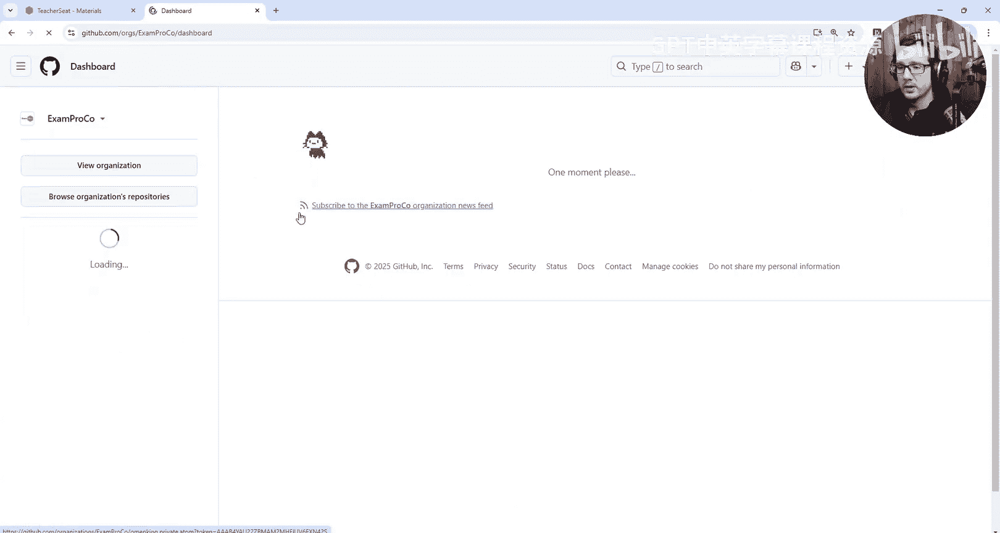

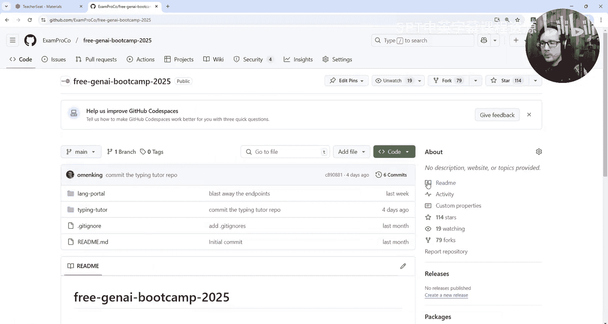

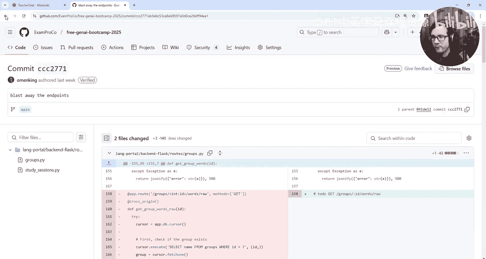

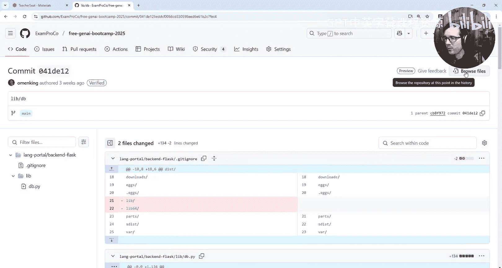

---

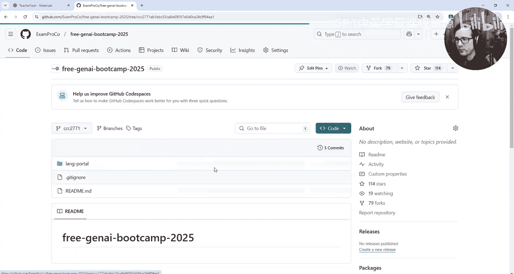

### 3. 词汇导入工具

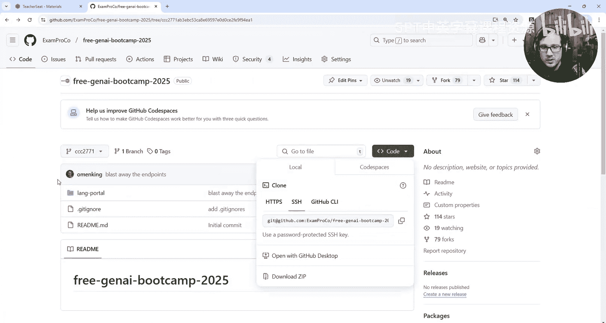

描述你创建或实验词汇导入工具的过程。分享你的设计思路、使用的工具以及遇到的局限性。

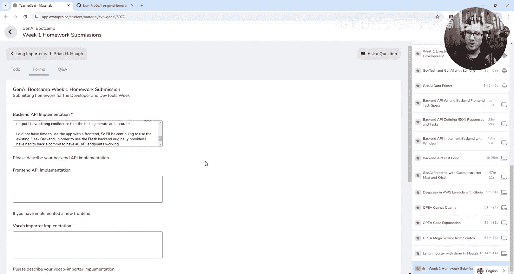

**示例填写：**
*   **我做了什么：** 我与Brian合作，使用Replit创建了一个词汇导入工具，专注于生成核心2000词汇列表。
*   **方法：** 我从一个Anki卡片组中提取了词汇表，我的工具能够将这些词汇进行分类。
*   **遇到的挑战：** 我无法使用Claude 3.5模型获得良好的主题分组效果。因此，这个项目未能完成。这个任务可能更适合由人类来完成。

---

### 4. OPA 实现

对于开放策略代理的实现，重点在于汇报你的进展程度，即使没有完全成功也没关系。

**示例填写：**
*   **进展：** 我成功运行了Ollama容器。
*   **遇到的问题：** 在实现Mega Service时遇到了困难。代码在技术上可以运行，但处理程序的实现需要更深入的思考。
*   **结论：** 如果能完成那部分实现，我将拥有一个可工作的Mega Service。

---

### 5. 其他考虑与说明

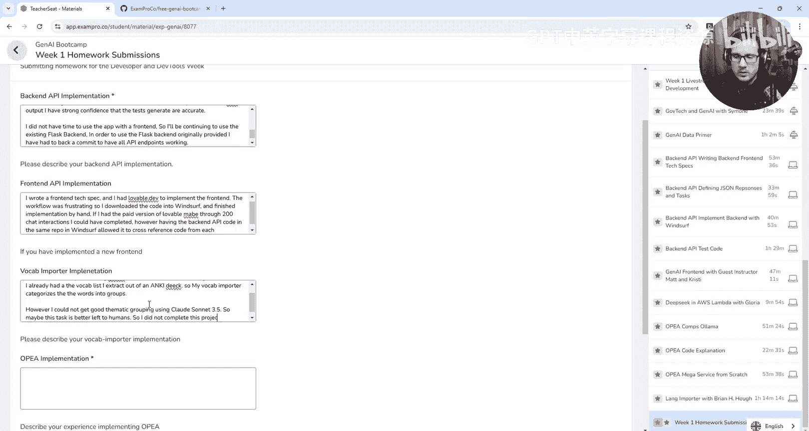

这是一个可选但建议填写的部分。如果你在本周学习中遇到任何特殊困难、需要额外考虑的情况，或者希望助教在评分时注意的事项，请在此处说明。

---

## 总结

本节课中，我们一起学习了第一周作业的标准提交格式。关键点在于：
1.  **清晰描述**：对每个任务，清楚地说明你做了什么、使用了什么工具、遇到了什么问题以及如何解决的。
2.  **诚实汇报**：即使任务没有全部完成，汇报你的尝试和遇到的障碍同样有价值。
3.  **利用资源**：如果需要使用课程的原始代码，可以通过Git历史记录获取早期版本。
4.  **填写可选字段**：在“考虑与说明”部分提供额外信息，有助于助教更好地理解你的情况。

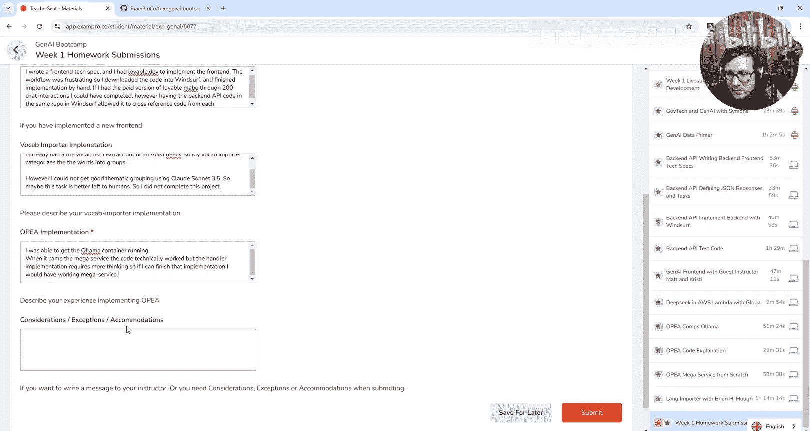

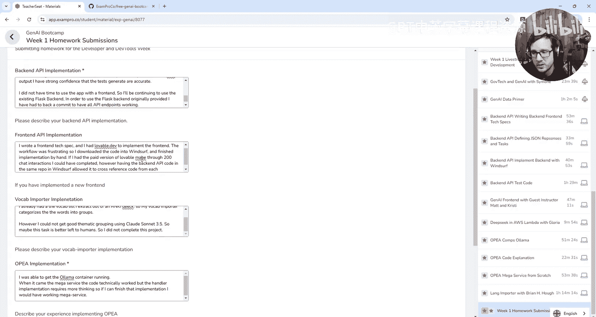

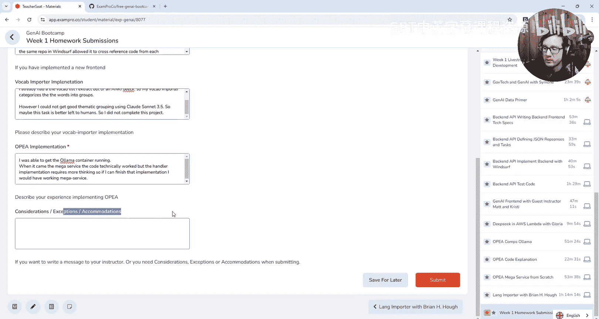

完成填写后，提交表单即可。助教会定期进行作业评估，随着课程推进，评估将覆盖所有学员。现在，你可以根据这个示例，去完成并提交你自己的第一周作业了。