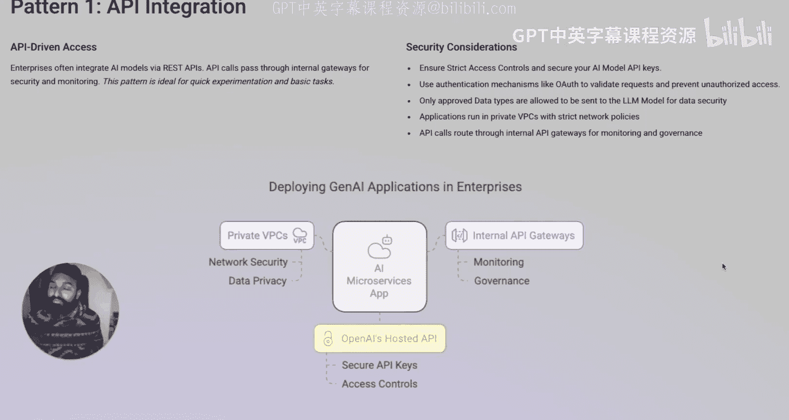
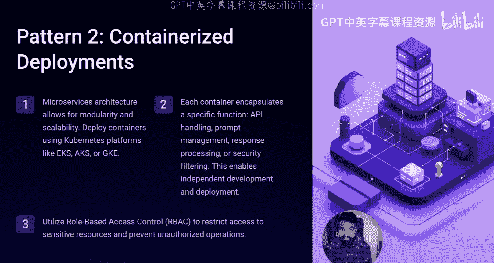
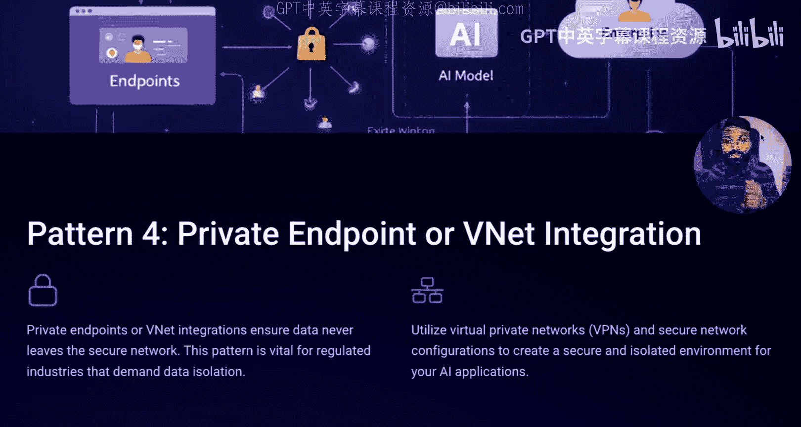
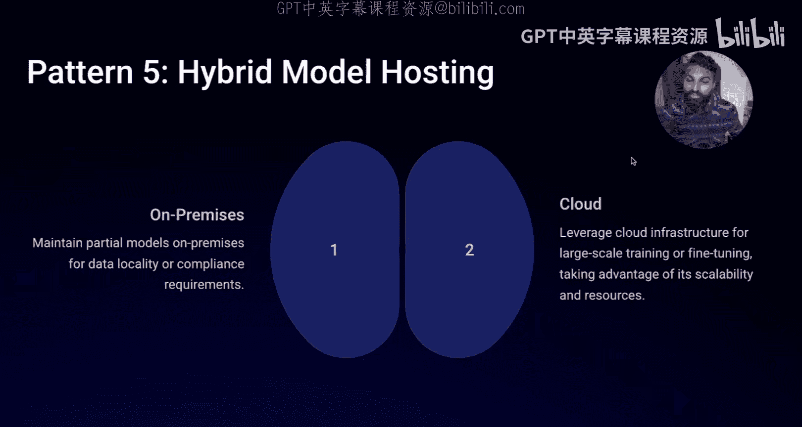

# 31：2025年顶尖公司如何部署AI 🚀

在本节课中，我们将学习企业在2025年部署生成式AI或通用AI应用程序时，最常采用的五种主要部署模式。我们将逐一探讨每种模式的核心架构、应用场景以及必须考虑的安全要素。

## 概述

企业部署AI应用并非只有一种方式。根据数据敏感性、计算需求和安全策略的不同，可以选择不同的架构模式。理解这些模式有助于我们为项目选择最合适、最安全的部署方案。

## 五种核心AI部署模式

以下是企业在部署AI应用程序时最常采用的五种模式。

### 1. API集成模式

大多数AI应用，甚至是生成式AI应用，都以微服务的形式创建。这意味着它们主要通过**API**（应用程序编程接口）进行工作。

根据应用部署位置的不同（例如在私有网络的虚拟网络内，或允许访问互联网以连接云端服务），应用主要通过**REST API**进行通信，并涉及API网关、网络组件和访问密钥等。

**安全考量：**
*   **严格的访问控制**：控制谁可以访问AI应用，包括最终用户、后端工作人员以及可能被允许访问的第三方。
*   **API密钥管理**：大多数大语言模型需要通过API密钥进行身份验证。
*   **内部托管**：企业通常将应用后端托管在私有虚拟云网络中，并设置严格的网络策略，仅允许来自已知IP地址的流量。
*   **持续监控**：需要持续监控安全异常或模型行为异常。

上一节我们介绍了通过API集成外部服务的模式，接下来我们看看将应用封装在本地运行的另一种方式。

### 2. 容器化应用模式

许多AI应用采用容器化方法。例如，你可能希望在本地运行一个大语言模型，并将其整个应用容器化，以便部署到任何地方。

这通常用于实验阶段，例如使用Hugging Face等平台的模型，在将应用部署到企业环境之前，先在本地验证其有效性。这些容器最初可能运行在个人笔记本电脑上。

**安全考量：**
*   **本地容器**：如果容器仅运行在个人电脑上，安全考量主要限于该设备本身。
*   **部署到环境**：当容器化应用准备部署到开发或测试环境时，安全考量的重点回归到**身份与访问管理**（谁可以访问模型和数据）以及所用数据的合规性。

容器化提供了灵活性，但对于无需管理服务器的场景，企业可能会选择更轻量的模式。

### 3. 无服务器架构模式

有时，由于不想托管应用服务器，你可能会选择无服务器架构。但因为使用生成式AI或AI应用涉及大量数据处理（这可能不完全适合无服务器模型），此模式通常会演变。

在这种模式下，你可能有一个**Lambda函数**或云函数来处理所有API请求，后端则连接一个数据库（例如**向量数据库**），用于存储处理前和处理后的数据。

**安全考量：**
*   **API访问密钥**的安全。
*   **数据库本身的安全**与访问控制。
*   **数据安全**：确保数据在传输中、静态存储时以及被访问时的全程安全，尤其是在进行批量数据处理时。

无服务器架构简化了运维，但当你需要完全掌控模型和数据，同时利用云服务的强大算力时，另一种模式更为合适。

### 4. 私有端点模式

当你使用Azure、AWS或GCP等云服务来托管自己的大语言模型，而不想自建基础设施时（例如使用Bedrock服务），可以采用私有端点模式。

大多数云托管的大语言模型都提供私有端点。你可以创建一个私有虚拟网络与该服务交互，在云服务中进行所有实验。

**安全考量：**
*   **身份**：谁有访问权限是最重要的。
*   **数据**：传输的数据类型、数据的安全加密管理以及整个数据生命周期的治理。

以上模式主要基于云端，但当数据极其敏感或本地拥有强大算力时，企业会采用混合策略。

### 5. 混合模式

混合模式是指同时利用本地和云端的优势。你可能因为拥有本地强大的计算资源，或者所使用的数据性质过于敏感而无法上云，从而选择此模式。

技术上，你可以使用云提供商托管的大语言模型服务，但将数据保留在本地。许多企业级应用可能都属于此类，你可以在其基础上构建微服务或无服务器架构。

**安全考量：**
*   安全主要依赖于**网络部分**，包括网络访问控制和数据访问权限。核心依然是**身份**和**数据**两大要素。

## 总结

本节课我们一起学习了2025年企业部署AI应用程序的五种主要模式：**API集成**、**容器化应用**、**无服务器架构**、**私有端点**和**混合模式**。每种模式都有其适用的场景和独特的安全考量重点，但身份验证与数据安全始终是贯穿所有模式的核心。理解这些模式是设计和构建安全、高效的AI应用试点或项目的基础。