# 33：使用MediaPipe进行美式手语字母拼写识别

## 概述

在本节课中，我们将学习Rob Koch和Kemalcan如何构建一个能够识别美式手语字母的计算机视觉项目。我们将了解从数据收集、处理、模型选择到最终实现实时检测的完整流程，并探讨其中遇到的技术挑战与解决方案。

## 项目背景与动机

大家好，我是Andrew Brown，欢迎来到免费生成式AI训练营。今天我们请到了Rob和Kemalcan，他们将为我们展示一个非常酷的项目。

在深入了解项目之前，我们先请Rob和Kemalcan向训练营的学员们介绍一下自己。

Rob，你先开始吧。

大家好，我是Rob Koch。我在Slalom咨询公司担任数据工程主管。我在这里工作了两年半，主要从事数据和机器学习项目的技术咨询。我住在华盛顿州西雅图地区。很高兴来到这里，感谢邀请我和Kemalcan。

我将简要介绍我们在做什么，然后交给他来讲解。同时，我也是AWS数据英雄，和Andrew Brown一样对这个领域很熟悉。谢谢大家，现在让Kemalcan介绍自己。

大家好，我叫Kemalcan。我也是Slalom的高级工程师，和Rob一起工作。今天能成为免费生成式AI训练营的一部分，我感到非常兴奋。

好的，我想我们现在可以从技术解释开始了，Rob。

很好。我最初对这个领域可以说是一无所知。机器学习和技术领域非常令人兴奋，能够进行探索和尝试，无论是遇到瓶颈还是一些令人沮丧的事情，都是我们工作的一部分。我们将带大家了解我们如何走到今天这一步——让计算机识别手语。我们会分享沿途发现的一些有趣的事情、遇到的障碍以及我们是如何克服其中一些困难的。我们还没有达到100%的完美，但已经取得了一些进展。当然，市面上有其他专业公司从事这类活动，他们的工作远超我们这里的业余项目。但我想说的是，关键在于这是一个旅程，充满乐趣和挑战。与社区互动也非常酷，这就是我们在这里的原因。

我想先介绍一下背景，我们使用的编码和框架不仅适用于手语识别，也可能用于基于手势的计算等其他场景。这里的工具同样可以用于与计算机进行指令沟通。

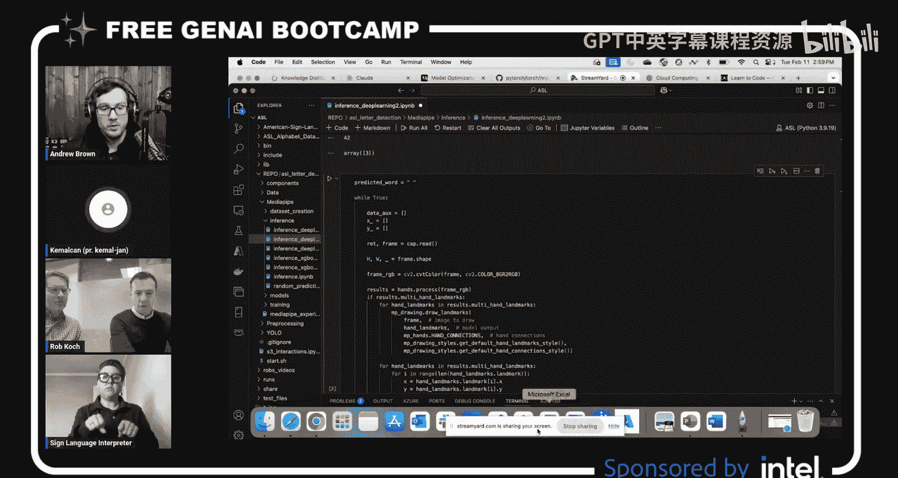

因此，动机不仅在于手语识别或翻译，还在于许多其他基于手势的应用。

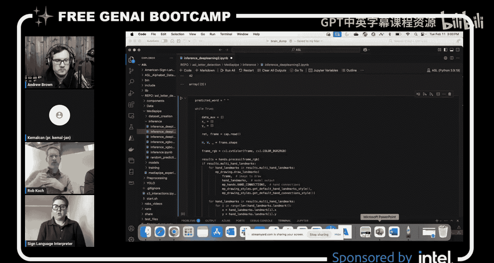

我们最初从美式手语字母开始。我向Kemalcan提出了一个想法，说我想做手语识别，大家都很兴奋能参与这个旅程。那么，也许你可以解释一下最开始你做了什么，你是如何启动这个项目的？

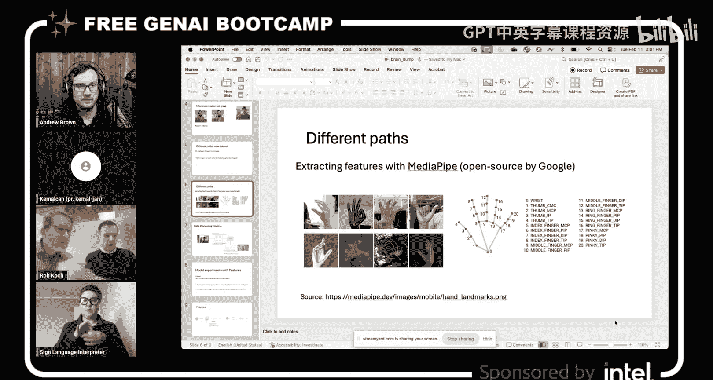

我最初对美式手语字母的了解非常有限。我首先询问的是，美式手语中每个字母是否都有一个对应的手势表达，以及是否有任何字母需要多个动作而不是一个静态图像。最终，我知道我们需要处理视频。但我最初是将其视为帧或图片，而不是视频来处理。因此，了解这一点很重要。结果发现，例如字母J和Z是通过多个动作来表示的，而其余24个字母则通过一个静态图像来表示。当然，为了理解这个领域，我还问了许多其他问题。但我们立即投入了工作，我们希望快速创建、快速失败，然后继续前进，这是最初的目标。

是的，完全正确。Kemalcan做的第一件事就是向我要一些视频。我们需要训练数据，以及可以标注的数据。我们做了一些数据训练。我们需要这些数据来帮助我们取得进展，包括用于训练和测试的数据。我们联系了云原生计算基金会的一些优秀成员，特别是其中的聋哑或听力障碍工作组。我询问了几位成员是否愿意给我发送一些他们的视频。我请每个人都拼写字母A到Z。我收集了来自不同人在不同环境下的所有视频，然后交给Kemalcan进行处理。那么，你拿到这些视频后做了什么？

我们首先非常幸运能有这些视频，因为它们是真实的视频，而不是玩具数据集。是的，我们需要更多数据。所以，我们首先从这些视频开始，将它们切分成多个字母片段。我们需要做的另一件事是创建数据增强。例如，字母L可以这样表示，也可以那样表示。所以，对一张图像进行旋转、翻转、改变颜色、添加色差或改变其结构是至关重要的。因为这有助于我们从一张图像创建多张图像。

这是我们的起点。一旦我们觉得这足够好，可以应用到模型上，我们就开始设计流程管道，应用不同的模型并进行实验，这是初始阶段。

如果可以的话，我可以继续。

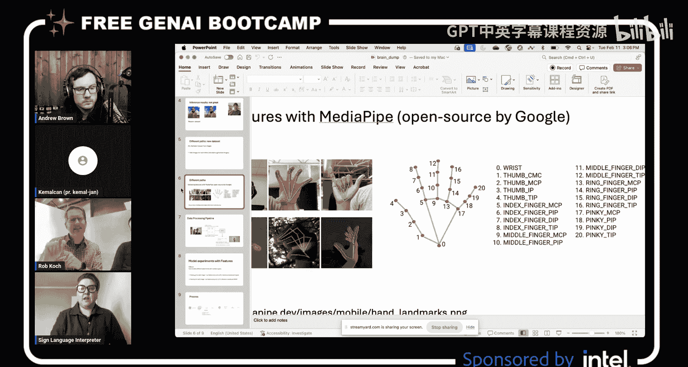

请继续，随意讲。

你尝试了不同的模型，然后创建了我们发现效果不错的一个，对吧？然后这些模型能够获取手的形状，所以它是在观察手的形状之类的东西吗？除了你已经提到的，你还使用了其他特定的东西来帮助实现这一点吗？我知道我们在数据集方面遇到的一些挑战是数据量的问题，特定手势的数据量本身就不多，而且现成的数据也不多，所以这是我们面临的一些挑战，对吧？你拥有的数据集视频数据量确实不足。

是的，非常正确。数据量可能只有大约10个视频，数据量不够，所以我们需要用网上找到的数据来补充。我们在网上找到了三个数据集。我们将所有数据混合在一起。最初，我想用那些视频作为测试数据集。然后我混合了所有数据，尝试了不同的方法。但最初的模型失败了，幸运的是失败得很快。它们在推理阶段表现不佳，所以我们认为这主要是因为数据集中数据的数量不足。我们总共有4000张图像，用于字母表中的26个类别标签，这还不够。

我们寻找更大的数据集和不同的方法，开始思考我们能做什么。最终，我们找到了另一个包含增强数据的数据集。换句话说，一张图像可以以多种方式表示，无论是低质量还是高质量等等。

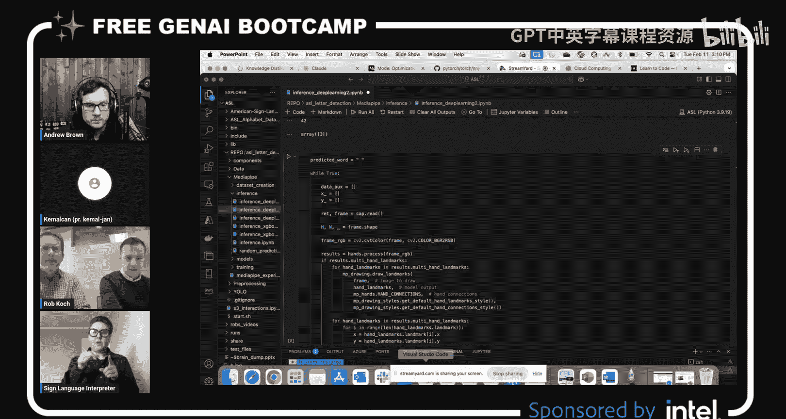

所以，就像那个数据有很多变体，但我想最初的原因是你想看看用你自己的数据集在最低限度下能做什么，然后在那之后发现不够，所以你才需要获取更多数据，对吗？

是的，我们用我们的数据集尝试的结果在某些情况下不够好。有些字母甚至没有被识别出来，或者没有被检测到。所以我们知道我们需要更多数据，我们需要更多多样化的数据。

当你提供原始数据集时，你在指导过程中没有意识到需要数据的多样性吗？还是你最初收集回来的数据就是你当时拥有的全部？

这是我们最初手头的数据。我们的数据足够多样化，但显然我们需要更多。这就是为什么我们试图寻找更大、更好的数据集。

原始数据集是视频格式，对吧？那么这些其他数据集是视频还是图像？你是否需要将原始视频转换成图像来标准化数据？

是的，每个视频都有每秒帧数。基于这个数字，我们从那些视频中提取图像帧并使用它们。当然，这有一个完整的流程，我们对它们进行了增强和标准化，调整大小等等。这是最初的几次实验。

一旦我们觉得，好的，我们有足够的数据集了，大约每个字母有7000张图像，相当多了。这足够好了，让我们找出不同的方法或路径来提高准确性并继续前进。

我们很幸运地找到了一个名为MediaPipe的开源库。MediaPipe来自谷歌，是他们开发的。它有多个版本，但其中一个版本可以从任何图像中提取手部图像。识别它，并给出手上的21个点。对于每个点，它提供X、Y和Z坐标数据点。因此，对于一只手，我们有21乘以3，63个数据点来表示手上的这些点。

这些点对应骨骼或任何物理结构吗？还是更像是它们能提供的网格形状？

这是一个很好的问题。据我了解，他们对此没有明确说明。我实际上可以展示一下。

那太好了，让我们看看。

所以请记住，美式手语是一种空间语言，它依赖于周围的空间。所以当我们打手势时，你会处理很多背景“噪音”。比如我穿的这件衬衫，你可以认为是“有噪音的”，而我身后的白墙则不那么“有噪音”。如果我在这里打字母A，我的一半手在墙上，另一半手在我的衬衫背景上。所以很多媒体库在处理这种特定场景时都很困难，学习如何在框内识别手的位置。如果墙的颜色和我的手一样，计算机也很难识别。幸运的是，我们有一个可用的库，叫做MediaPipe，就像Kemalcan刚才在屏幕上展示的。还有其他开源版本，比如RTM pose，我们还没有在这里实验过。但我们只是选择了最容易实现的方法来使用这个库，你可以看到手部以及它如何检测手上的所有不同点。

所以MediaPipe在这方面帮助很大，那是增强吗？我用这个词正确吗？增强你的手部形状以找到其上的各种线条，所以那效果很好。

是的，正如你所看到的，每个手指有五个点，加上手掌底部的一个点。因此总共有21个点，每个点都有X、Y和Z坐标。

在这个阶段，我们称之为特征提取或特征工程。我们不再需要处理帧数据和那些巨大的矩阵，我们只有每张图像的特征。在某些情况下，图像中有多只手，因此我们每张图像有多个这样的数组。剩下的实际上是纯粹的机器学习。一旦我们有了巨大的数据集，当然，我们以某种格式保存它，不再处理图像。从那时起，我们应用了提升方法和装袋方法，比如随机森林，我们使用了XGBoost，以及我提到的深度学习模型PyTorch。

我们进行了一些讨论，比如一些朋友建议我们坚持使用随机森林，因为这里没有模式。但我认为我们的特征对PyTorch模型来说很好，然而，我在最初的实验中又错了。PyTorch模型甚至没有给出好的结果。

因为，正如我所说，每个点坐标都有X、Y和Z点。Z坐标没有给我们有意义的信息，它没有给出信号，完全是噪音。因为Z，你可以想象，与图片的深度有关，我们没有空间数据。换句话说，例如，假设这是一台相机，我正在做字母B的手势，没有一张图片是从手的多个空间区域拍摄的。因此，那个Z是无关紧要的。

这似乎是一个两部分的问题，因为我想Rob之前提到过这一点，但真正重要的是源图像——退一步说——必须在环境中，并且必须以那种方式被检测，因为这就是网络摄像头将要看到的样子。我脑子里一直有个问题，那就是你为什么没有考虑使用合成数据，意思是使用手的3D模型，而不是获取真实图像？3D模型可以是你需要的所有姿势，但正如Rob指出的，你需要在真实环境中，因为如果你的手举起来，手是白色的，背景也是白色的，部分被遮挡了怎么办？我们看到MediaPipe正在绘制这些位置和线条，我假设我们有那些数据点，就像它在计算说这个数据点很可能在空间的这个位置。有没有其他方法可以检测手，或者这基本上是解决这个问题的自然方式？我知道有些方法他们直接查看像素，进行某种计算机视觉检测，但我想我的想法是，除了这些线条或顶点之外，还有没有其他替代方案？这真的是正确的方法吗？

是的，这是个很好的问题，请继续。

通过手动的手部形状，我们让机器决定它是什么形状，对吧？一开始他们在这方面遇到了很多困难。例如，如果你拼写A像这样，然后T像这样，拇指夹在两个手指之间，然后S在这里，所以A、T和S的手形非常相似。

所以我们注意到，这对于没有MediaPipe帮助来标注和识别那些明显差异的机器学习库来说是一个挑战——我的拇指在哪里，我的拇指相对于我的手的位置在哪里？M和N可能也会非常困难，对吧？

有了MediaPipe，它完成了所有困难的工作，可以说它已经包含了多年的编程经验，所有这些都已经集成到他们的库中，这使得我们更容易训练模型。因为它观察手上的每一个点，就像Kemalcan提到的21个点，所以它识别这些不同的点，并将它们输入模型，并在此基础上训练数据集。现在我们必须依赖数据源，而无法将其恢复到一亿张图像，对吧？我们可以使用MediaPipe，我有点想说它是一种捷径，我不知道这是否是最好的描述方式，但也许有点像捷径。

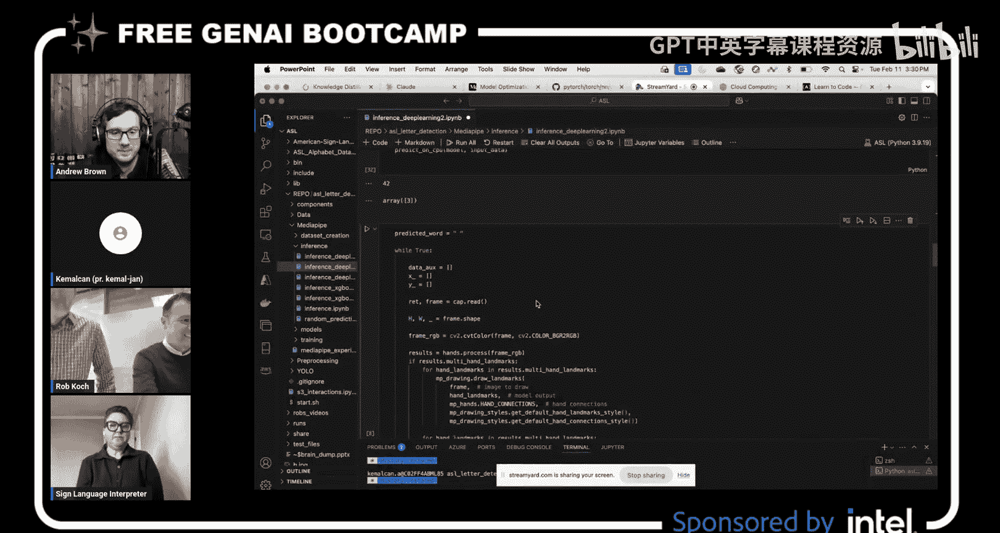

是的，是的，这是一种捷径，它肯定将问题的这一部分外包给了MediaPipe。一旦我们有了特征，我们实际上不想在检测手上花费更多时间。但是，在一些图片中，MediaPipe无法检测到手，即使有手存在。这种情况很少见，我们只是没有将它们包含在我们的数据集中。我们将它们保存在某个地方，以便检查寻找不同的模式。如果我们想探究为什么MediaPipe在那里无法检测到手，这仍然需要一些工作。但我们没有花时间去调查和优化它。

我想可能有一个足够好的方法，因为如果你有流媒体视频，你的手在移动，你不需要100%地检测到它，所以你怎么知道最终结果是什么？因为它总是在实时计算，所以你很有可能得到正确的结果，所以你只需要获得一定百分比的正确率。

是的，正确。百分比出现在两个地方。首先，你设置MediaPipe时，有一个百分比，如果你有30%的把握就检测手，否则就不检测。你可以更改那个百分比。第二个百分比，当然，你可以将其应用于机器学习模型，基于概率。

一旦我们应用机器学习模型，正如你将在演示中看到的，比如我会拼写“WELCOME”中的“WE”，手在移动。模型非常快地检测每一帧，所以它实际上检测到W和E之间的不同字母。

这是一个后处理问题，我们以不同的方式处理了它。到目前为止，我向模型解释了一切，所以我们训练了模型，使用PyTorch，然后我说，好的，让我们进行一些推理，看看感觉如何。使用X、Y、Z三个坐标时，效果不好，但只使用X、Y时效果完美——不，不是完美，但很好，足够好，对吧？是的，是的，是的。

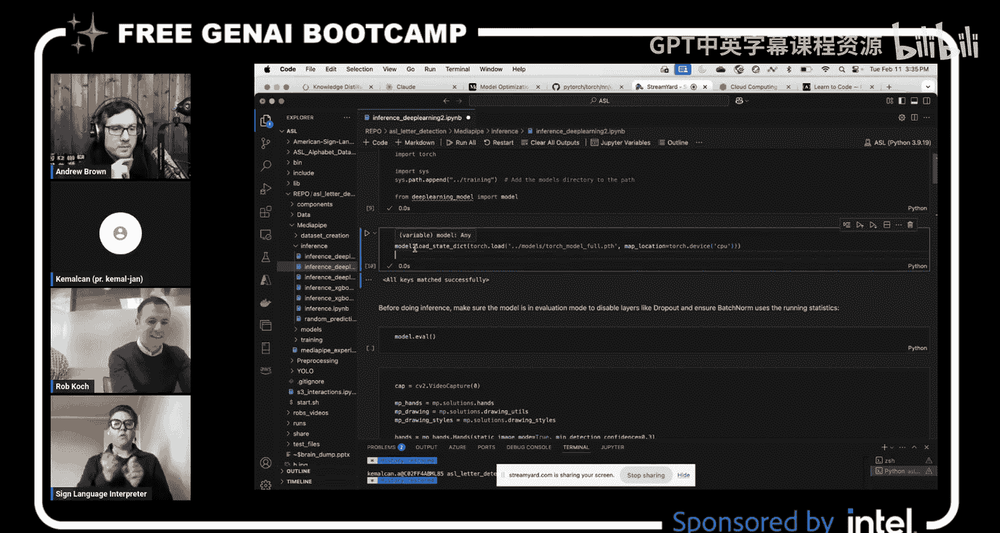

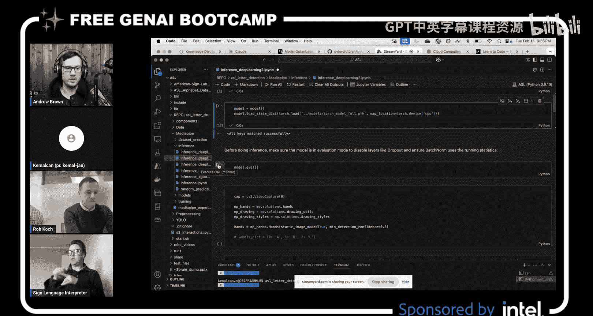

他们没有看到。我可以继续。

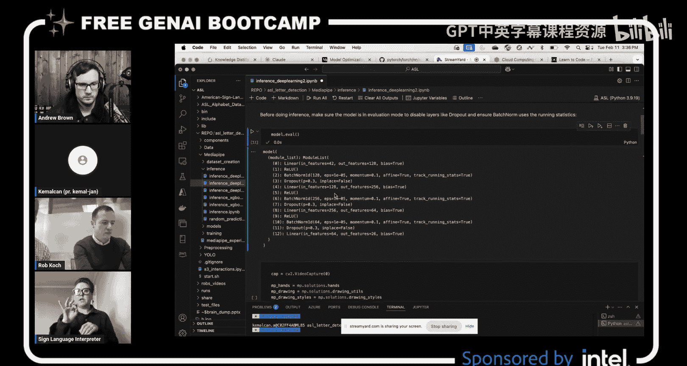

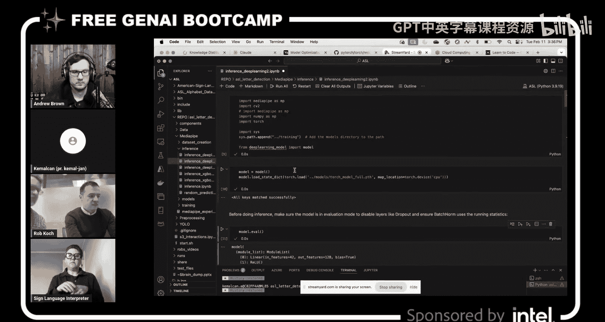

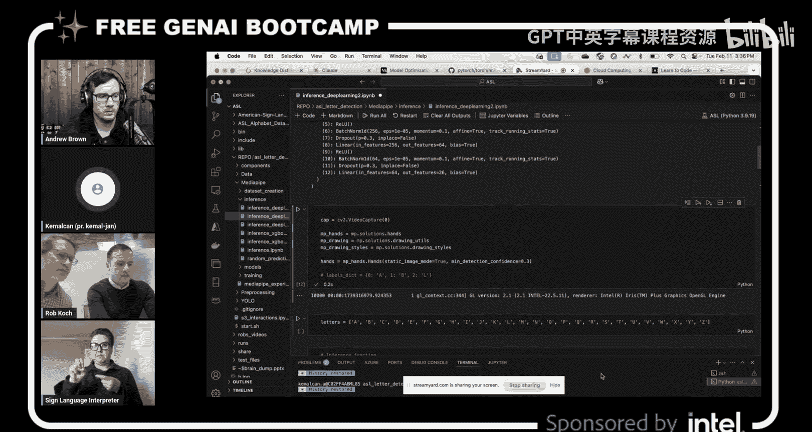

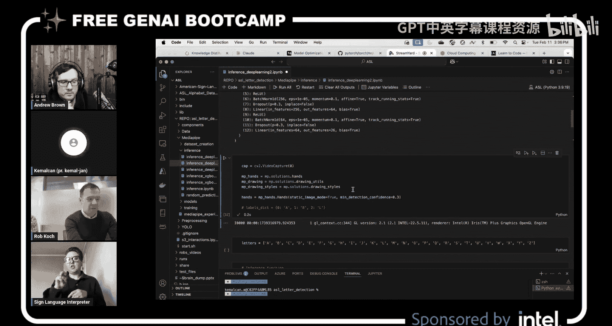

所以，是的，另一件事是涉及很多数学或后处理，就像Kemalcan刚才谈到的，从W拼写到E，它会捕捉每秒的每一帧。我的意思是那是很多帧，对吧？所以我们谈论的是每秒30到24帧，取决于你的摄像头。所以当你从W过渡到E时，MediaPipe和我们的模型会错误地识别那些字母，我们会说类似“哦，我们还没告诉你字母呢”这样的话。所以从W到E，并试图找出另一个字母，它试图在过渡期间找到它认为是O或B或其他什么字母，即使时间很短。所以我们试图弄清楚如何识别哪个是正确的，以及保留哪一个。这就是后处理挑战的所在。所以Kemalcan将在我们深入之前带我们了解一下。问题是，你有MediaPipe，MediaPipe正在生成这些顶点的空间位置数据，然后你必须获取这些数据并将其输入到某个东西中，这个东西正在预测它是什么。我猜那个预测模型就是你构建的模型，它有一个置信度分数。那么，也许置信度会影响你如何权衡它是否是一个字母？或者你是否查看过去或之前相近的帧来更好地确定它？也许我有点超前了，但你会解释所有这些，但这就是我脑子里想的。所以我会让你按你的节奏来，抱歉。

这是一个很好的观点。想象一下查看前一帧，那是我们的解决方案，但在我们到达那里之前，是的，对于每一个预测都有概率分数。我们最初尝试使用它。我们尝试的事情之一是，假设最可能的字母是W，它的百分比是40%，第二个可能的字母是S，或者假设是U，对吧？假设是20%。我们尝试应用一个阈值。我们说，如果第一个的概率是第二个的两倍大，就给我们一个估计，否则就不给。我们尝试了类似的不同方法。但不幸的是，没有一种使用概率的方法解决了我们的问题。我们的问题是帧的数量以及模型预测的速度，因为手在变化。我们不是静态图像，对吧？就像“WE”，当我移动我的手时，中间可能有五个不同的字母。

但一旦我们对模型感到满意，我们可以在后处理中解决这个问题，就像你说的，查看之前的帧是一个好主意。我们所做的是，正如你现在在屏幕上看到的，对于每一帧，假设一个30秒的视频有900帧（假设每秒30帧）。对于每一帧，我们做了一个估计。我们以W开始，假设我们要拼写“WELCOME”中的“W”，W出现了20次，然后应该转到E，下一个字母，但中间有B，中间有S，那是不同的字母。

抱歉，快速问一下，这个应用是否超越了仅仅检测字母，它实际上会检测单词吗？这是我们的目标。

好的，因为就像我还没见过——也许Rob知道我在说什么——但这肯定是改天再讨论的话题。我们肯定在尝试做模型之类的事情，那里有很多静态图像，并且有许多手语可以识别，但有很多活动部件，对吧？所以如果你这样开车，你向前移动，或者你要去某个地方，你实际上是从这里到那里移动，而字母更多的是静态的，就在一个地方，但我们确实遇到了两个相邻字母涉及移动的问题。所以这是我们改天要解决的问题，对吧？

我正要说，如果你解决了它，因为它很难。我可以想到所有活动部件，但我见过很多检测静态图像的演示，就像老式照片，我们必须站得非常稳。就像站得非常稳，给我们看你有的字母，它会检测到，对吧？现在我们到了第二步，就像，好的，我们可以在运动中检测它。现在是第三步，就像，让我们得到一个单词。得到一个单词，那会很酷。能够拼写单词。抱歉，是的。

这很难，是的，这很难。

是的，所以我只是在想，也许你可以解释一下我们是如何做后处理部分的。

是的，对于后处理部分，正如我所说，对于每一帧，我们都有估计预测。我们查看预测发生变化的地方。我们丢弃了每一个预测次数少于10次的字母。因为很明显，存在过渡性的字母，就像手在字母之间变化，手正在变化，这就是正在发生的事情，所以我们丢弃了那些，这就是我们解决问题的方式。

所以如果我这样打W，你可以看到这是一个W。你知道，你看到了进来的百分比，如果你这样打W，或者这样打，检测到W的概率会更低吗？因为它向前倾斜，或者在中间向上，或者向下降低到E。所以如果是一个W，像这样直接打，你在模型中看到的百分比是多少？

这很难回答，当然每个字母都不同。模型在进行预测时，实际上并不只给出一个预测，它给出26个预测，并为这26个预测中的每一个给出一个概率。抱歉，只是为了帮助训练营的学员们，26是因为有26个字母，所以每个字母都有一个置信度分数。你可能有一个像M和N这样的字母，它们可能都有很高的置信度分数，因为它们太相似了，然后你可能有一些像A可能更接近，其他的则不然，抱歉，是的。

是的，正确。模型输出每个标签的置信度分数或概率，并实际上返回所有标签及其关联的概率。但我们所说的预测是概率最高的那个，对吧？所以，回到你的问题，实际上我们可以看到每个标签的置信度分数。

所以想象一下，你有像我有10000个字母的东西，假设在另一个字母表中，那么模型必须学习，模型能处理学习所有这些吗？如果你要为每个字母和10000个字母表中的字母想出概率分数，假设是这种情况，它会给模型带来太大压力吗？还是一旦你训练了它，它就会没事？

可能需要更大的架构，是的，实际上。对于深度学习模型，你甚至不需要训练模型，因为当你创建模型时，只要有足够的节点，它为每个节点关联随机权重。它已经准备好进行预测，不需要训练。

我想到的另一件事是，你知道一个字母有它是什么的置信度，但有一个字母的形状正在形成中。所以如果有关于那个的数据会很有趣，但我想那很难，因为当你从一个手势变形到另一个手势时，你怎么知道手在哪里？所以就像你甚至不能真正有那种过渡期，因为你必须知道你是从哪个手势到另一个手势。我只是说，就像一个常见的故事，这个人开始形成字母W，这是在中间阶段，你怎么知道？因为它是基于手在手势之前的位置形状，但也许我们钻得太深，太超前了。但当我想到LLM时，他们谈论预测事物，他们谈论整个句子的上下文，他们向前向后看单词，就像他们理解它的上下文，我想也许如果你把每一帧都输入进去——我不是说我们在做LLM——但你把数据输入进去，每一帧，它就能弄清楚上下文，但我可以看出这对于手语来说构建这样的模型真的非常非常困难，对吧？

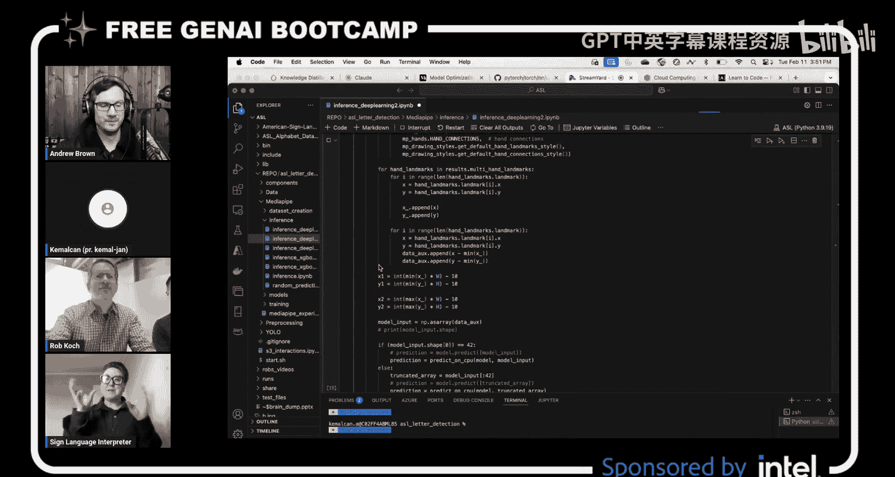

非常