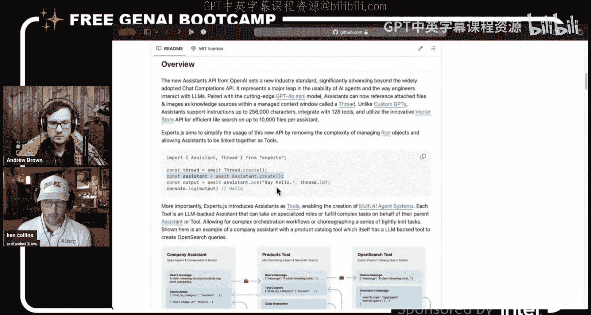
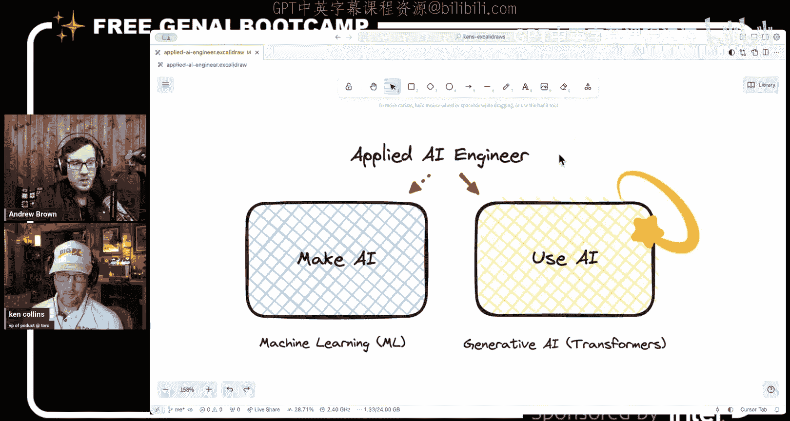

# 34：应用AI工程师职业指南

## 概述

在本节课中，我们将与Ken Collins一起探讨如何将你在本训练营中学到的技能，与AI领域或生成式AI领域可能的职位相匹配。我们将重点关注职业发展方面，了解公司真正需要什么样的应用AI工程师，以及如何有效地展示你的技能以获得理想的工作。

---

## 课程内容

### 应用AI工程师的角色定义

大家好，我是Andrew Brown，欢迎来到免费的生成式AI训练营。今天我们请到了Ken Collins，我们将做一些不同的事情，因为我们将专注于职业方面，将我们在这里学到的技能与你在AI领域或生成式AI领域可能获得的职位相匹配。我们稍后会看到这一点，但我想先交给Ken，让他介绍一下自己。

谢谢Andrew。我们是老朋友了，我们都是AWS英雄，我们都有编织得很好的毯子。我今天没穿我的，因为我家很暖和。我们有着相同的背景。对于那些可能没见过我的人来说，我叫Ken Collins，目前是Torque的产品副总裁。Torque是一个人才市场和员工扩充平台，最近被一家更大的公司Ronst Digital收购。这是一家非常大的全球化公司，我们有很多机会，并且可能对人们能够创建个人资料、分享更多关于自己的信息并找到适合他们的工作有独特的看法。我认为这非常独特，就是能够构建关于你自己的丰富数据，以不同的方式表达自己，不仅仅是过去的简历，而且我们正在用AI构建一项非常酷的技术来帮助从围栏的另一边找到你。从根本上说，我从事这个有趣的招聘或人才云业务大约有四、五个月了，我认为我对这一切如何改变并变得更好有一些非常有趣的想法，尤其是在AI的帮助下。

我认为真正有趣的是，你之前的背景是首席工程师，所以你来自一个非常技术性的角色，现在你在另一边告诉我们，实际上事情是如何发生的，因为我们这边的很多人都在说，我如何展示我的技能，公司到底想要什么？如果你只在一家公司工作，这很难，因为你只知道那家公司想要什么，但现在你在招聘方，所以我觉得你拥有丰富的知识要与我们分享，我希望训练营的学员们能真正专注于这些信息。

是的，这有点奇怪，Andrew。我的意思是，我一直追溯到很久以前，比如我做了很长时间的平面设计师，然后是一家新媒体或广告公司的客户主管，后来又是一家电子商务公司的营销总监。所以我带来了很多奇怪的技能，但现在我已经完成了大约15年左右的软件开发生涯，我很兴奋能回到另一边和领导层，尝试以全新的视角将这一切结合起来。为了让大家了解背景，我今天要做的一件事是，我们将一起回顾我看到和应用的一些东西，以及我在寻找AI工程师时看重什么。我认为这可能与市场有很大的不同，因为我刚刚完成了一些招聘，为我的团队招聘了一组新成员，以推动Torque业务比我们今天更进一步，甚至更超前。

但AI变化如此之快，行业里发生了太多事情，我基本上想要一个新团队来构建原型，让我们比潜在位置提前大约六个月，然后在这个过程中设计出正确的产品来达到目标。找到人才相当困难，我认为我们可以通过技术变革做很多事情，但我认为今天真正酷的是分享我一直在寻找的很多东西，我在人才市场上看到的，以及我认为对你们团队来说是一个独特的机会，可以抓住一些我认为很重要的技能，这将使他们……我认为每个人都觉得他们想要10年的经验，但我认为AI的一个很酷的事情是，它真的颠覆了很多事情，你现在比以往任何时候都更有机会去追求这些我认为非常重要的技能，然后乘着这股浪潮，获得你以前可能认为无法获得的工作。我认为机会是巨大的，如果你能掌握这些技能并以正确的方式推广它们，那么你就能真正与公司正在寻找的东西保持一致。

有趣的是，我总是想起90年代初或80年代开发者或游戏行业人士的故事，听他们讲述在事物还不存在的时代是如何想出技术解决方案的。很多时候他们想出的解决方案并不完美，但他们想出的解决方案是别人没有做的。所以就好像他们想出了一个不完美的方案，别人复制了那个不完美的方案，然后最终变成了它应有的最终迭代。但没有什么能阻止他们说“哦，这不是正确的方法，我们只是要这样做，因为我们不知道更好的方法”，而且直到有人说它是错的之前，它都是正确的。即使我回顾我在Ruby on Rails方面的背景，我想Ken你也有一些Ruby on Rails的经验，对吧？是的，我在这里轻描淡写了，Ken真的很懂Ruby on Rails。所以你知道，我在2005年进入了那个领域，当时我想学习如何在这个新的构建框架中构建应用程序，有一些开源项目，比如Mafisto，那是一个基于Rails平台构建的v平台。你知道，我唯一能弄清楚如何构建生产应用程序的方法，因为那是SourceForge上唯一开源的，我不得不仔细研究它，它一团糟，但我当时不知道那是一团糟，我只是尽我所能让它工作。然后回想起来，你会说“哦，正确的道路是如此明显”。所以我想强调一下现在存在的机会，在这个训练营中，我们正在实时改变技术，因为像DeepSeek出现了，每个人都在问“DeepSeek重要吗？”，我说“我不知道，但我们要试试看”，你明白我的意思吗？或者每两秒钟就有东西在变化。我的意思是，会有一些基础或概念性的信息会伴随我们，但也会有一些东西我们会不断抛弃，我们会从一艘船跳到另一艘船。但是，是的，我真的很兴奋看到你带来了什么，我认为你为我们准备了一个非常互动的演示，所以我们让你分享屏幕，看看你的内容。

---

### 应用AI工程师的技能要求

好的，让我们开始吧。这有点不寻常，我也以创建非常简洁的幻灯片而闻名，这些幻灯片讲述了一个故事，但我最近一直很喜欢使用Excalidraw，因为我最近发现可以在VS Code中使用Excalidraw扩展。所以你可以基本上签入，你可以只用本地文件。你可以去Excalidraw.com，有一个Chrome扩展，你可以在浏览器本地存储中保存某些文件，并且有一些非常好的……它只是一个非常好的工具。事实上，你可以下载这些文件并放入git仓库进行版本控制，然后你基本上可以在VS Code中使用整个Excalidraw界面和扩展。我在这个标签页上。

Ken，你知道这对我来说在我的预备周会非常有用，因为我创建了一堆图表和Lucid图表，你必须付费，如果你想要版本控制，你必须付费，而你刚刚免费得到了它。但是听我说完，对于训练营的学员来说，他们已经知道这个了，但我们必须分享一个链接，这样他们才能看到它，另一个Andrew分享链接时，他分享了编辑链接。所以我的所有图表都被弄得一团糟，然后出现了一些我从未见过的新图表，所以我不得不全部重做。我当时就在想，有什么解决方案可以让我免费或付费，他们可以下载它，而你刚刚给我看了一些东西，所以我想也许这就是我明天用来重做所有图表的东西，如果你说我可以在仓库中下载并展示给我们看的话，这就是我要做的。

我以前做过长达一小时的关于惊人技术的演讲，我停止讲话后的第一个问题总是“你在编辑器中使用什么主题？”。我们先把这个说清楚，对吧？我在这里使用Cursor，因为我非常酷，每个人都应该使用Cursor，我认为。好的，让我们从头开始。这是我招聘的职位，叫做应用AI工程师。Andrew，你和我讨论过这个问题，什么是好的职位名称？我认为很多公司都在招聘AI工程师，我在前面加了“应用”，因为如果你去看我的博客，它叫“Unremarkable AI”，我试图教人们，或者至少分享我的故事是，我没有机器学习背景，没有数据科学背景，我甚至不擅长Excel表格，对吧？但Google Sheets你擅长，对吧？我不……嗯，Google Sheets更容易使用，Excel就像一层又一层的遗留Windows，你必须导航，但对不起，是的。我甚至不会说我擅长Google Sheets，对吧？就像我只是那种工程师，我不构建函数或其他类似的东西，我只是试图创造性地思考问题。

所以我认为困难的事情是，你和我讨论过这个，我们叫它AI实践者吗？我喜欢“应用”这个词。所以我是一个实践者，我鼓励其他人也倾向于这一边。但我认为今天市场有趣的一点是，如果你去看看各种公司招聘AI工程师的职位描述，他们在广告中，如果你看技能要求，他们谈论的是制造AI。而我想谈论的是使用AI方面的机会，我认为招聘经理对这方面所需的技能重视不够，以及当你在许多不同的公司内部应用AI时，从应用实践者的角度做惊人工作的机会。我们应该明确的是，训练营专注于使用AI组件，而制造AI，那就像Guess Director Roa，他是神经科学博士，从头开始构建模型，那是他们会雇佣的人，那些是筹集了数亿资金的公司，非常专注于这项任务，但只是为了澄清这一点，对不起。

是的，如果你制造AI，并且这就是你做的，我认为你很棒，我们需要你。我认为在右边有机会，那是我操作的右边，我认为那边有更多的机会。但我们需要人们来制造这类东西，并且在使用AI的过程中，有时你可能需要做更多偏向制造的事情，也许你是在处理小型语言模型，但这有点像走过那条路，就像你出去申请工作时通常会看到的那样，你遇到这些招聘经理，他们正在制定这些非常倾向于制造AI类别的职位机会，你会看到像Python这样的东西，你会看到像TensorFlow或PyTorch这样的东西，他们会认为这很重要，因为你想做一些微调，你甚至可能看到一些我们需要你有经验与某种架构或熟悉数据管道。这里的想法是，这可以追溯到2023年，这是一种不匹配，我认为在技能方面，因为很多时候当你进入这些工作，我也被告知这一点，你最终会像，嘿，你知道，地毯被抽走了，你只需要使用AI，对吧？我不知道这是否是你底部的一个小笑话，但YOLO是一项实际的技术吗？

好的，所以YOLO是我在几次面试中看到的，我相信你可以称它为一种分割模型，它很旧，不是基于Transformer构建的，它基本上只是老式的数学。我不知道该怎么称呼它，但你知道，我会看那个，他们会谈论他们使用YOLO的经验，我会说，嗯，你为什么不用Meta的新Segment Anything模型V2，它显然非常惊人，基于Transformer，而且是免费的，他们会说我从来没听说过。我认为发生的情况是，当你学到一些东西并且它有效时，你不一定会进行双重检查，对吧？YOLO大概有10年了，我认为也许三年前它非常重要，但现在不是了，对吧？而且我认为招聘经理也不知道这一点，他们会谈论卷积神经网络和自然语言处理，但想法是，当他们说AI工程师时，他们真的不知道他们在招聘什么，他们列出的是关于制造AI的技能。所以当他们说数据管道时，对他们来说这很重要，因为当你制造AI时，你需要有很多经验，要么从数据湖移动数据，要么以我可能甚至没有正确术语描述的方式将这些数据输入进去，但这些事情根本不重要，而且通常你会发现他们基本上会对你进行某种“地毯式抽离”，他们会说，好吧，你真的需要坐在这里做这些事情，就像我们不需要你微调模型，我们只需要你使用像OpenAI或Amazon Bedrock这样的推理平台。

所以你是说职位描述说的是制造AI，但他们实际上想要使用AI，那么这是否意味着我们应该对制造AI的东西有肤浅的知识来勾选那些框，但实际上拥有实用技能？嗯，我会告诉你。你知道，一些候选人在我早期面试时，当我坐下来和他们聊15分钟时，我会描述，嘿，你知道这个角色是关于使用AI与制造AI的，他们会……我承认他们只是关键词堆砌，只是为了通过招聘经理或类似的东西。所以我认为我建议的是，我将与你们分享，职位机会与我作为真正的招聘应用AI工程师所寻找的东西之间存在脱节。这意味着那里存在潜在风险，对吧？因为为了通过那些甚至不理解这一点的人，那将具有挑战性。所以我没有解决方案。嗯，我的解决方案是偶然的，但我们教人们的方式是，在制造AI方面，我们确实会教一些这些东西，比如我们不会深入，我只是说，是的，你知道也许Rola会向我们展示如何使用PyTorch构建一个非常基本的神经网络，比如CNN，我们不会成为专家，但我们会接触它，我们可以稍微谈论一下，但真的，我不希望人们试图构建东西，但至少了解底层是什么，然后我们在那里有重点。所以我觉得，你知道，如果有人看到这些东西，他们可以说，是的，我接触过这些东西，不，我不是像Rola那样的神经科学家AI工程师，可以制造，但你知道也许那可能会帮助他们，我不知道。

是的，我发现，当我在面试人们时，你知道，他们来自Python背景，他们会知道所有这些，然后我会问他们一些问题，比如，假设我们有一个基于GPT-4的系统，并假设我们有一个好的框架，比如LangChain或Vercel AI SDK，然后我不会给出答案，但我会说，我们必须通过……我们必须削减成本并增加延迟，他们给出的第一个答案是，好吧，让我们开始微调，因为对他们来说，Python和这边所有的技能都是锤子，我遇到的每个问题都是钉子，答案是，不，你只需将模型从GPT-4换成像Claude Haiku或Gemini Flash 2.0这样的东西，就能获得大约三倍的性能和可能10倍的成本节省，你不需要做任何那些事情，这是一行代码的改变，对吧？所以取决于你的提示工程，但就像，每个人都会情境化，如果你把这种Python包袱，如果你把所有其他东西带到应用AI工程中，有机会，是的，拥有像这些是什么的基础知识是好的，但是，从招聘的角度来看，当事情落到实处时，很多时候这些人……我不是说我不鼓励雇佣Python人员，但当你问他们问题时，他们只是带着那种Python和经验，哦，微调，你知道，这就是我们要解决这个问题的方法，我说，嗯，如果他们给你三天时间，也许你必须更快地微调，那么然后呢？如果我们雇佣别人，我们必须传递那个，就像有很多事情可能很困难。这就像当我们想为这个训练营建立营销网站时，我当时对Vercel没有太多经验，但现在有了，我听说它非常容易使用，我用了它，它瞬间就部署了，我说，哦，太好了，它在几秒钟内解决了我的业务用例。对我来说，这比……在某个时候确实有成本因素，你确实想知道你的技术路径，并且拥有这些东西作为可能的选项是很好的，如果你需要走那条路的话，但你知道这只是关于考试，你知道当我们谈论布局时，有马、斑马和大象，如果答案是斑马，这是一个奇特的答案，一个复杂的答案，那将是走向制造AI的一边，而马的选项可能只是像换掉模型，选择马，对吧？是的。

所以那里存在脱节，我会说，我认为这在某个时候会自我修正，人们会开始尝试弄清楚，至少在我正在构建的平台中，我们将尝试让人们很容易找到这种不匹配，知道他们可以指出这一点。在招聘中，你总是在寻找紫色松鼠，对吧？紫色松鼠是高度专业化的人，拥有你想要的每一个框里的所有技能，不仅仅是软技能，还有硬技能、文化契合度等等。所以我认为技术将使这个问题消失，那些不知道他们实际需要看到什么技能的招聘经理将只是一个暂时的问题，但这是当今市场的一个问题。所以基本上我们需要一个应用程序，让他们可以在上面向左滑动或向右滑动。我试着想过，我从未用过，但我是说，在招聘方浏览资料并这样做，作为一个视觉画面，对我来说会非常有趣。

所以有那些应用程序，也许你是在招聘招聘人员。哦，当然，即使是蓝领工作，它们也非常受欢迎。嗯，好的。我认为我们的Home Depot也推出了一个。所以我想我们可以做的，Andrew，是我可以稍微浏览一下，对吧？所以这有点模糊，对吧？这些技能，比如提示工程，如何使用推理平台，如何运行评估，这本质上是工程师在不同方法论中的单元测试，云开发技能，模型能力和选择，这就是马，对吧？只是能够理解现有的模型，它们之间的权衡，比如是否所有模型都有结构化输出，我们称之为能力之类的东西。再次，制造AI的人谈论Llama，但当你问关于如何让Llama进行结构化输出之类的难题时，我们会在SageMaker上托管它吗？你要扩展它吗？结果变成了难题。我们与你唯一的分歧是，我还有一个额外的东西要看，那就是他们是否了解如何运行模型，假设你想部署到云中，在那里它是云原生的，不一定必须是Kubernetes，但假设你想在未来拥有完全的技术灵活性，如果你必须走那条路，你了解运行这些模型的硬件要求吗？所以我通过如何用你自己的硬件运行本地LLM来类比理解这一点，但在实践中，我几乎总是从无服务器云的东西开始，因为它很容易上手。所以这不是我早期会说的，但更像是可能的技术路径，我会把它加进去。对不起。

我也很喜欢那个，是的，因为最终我认为小型模型和部署到平台会变得更容易做到，即使在无服务器模型中，它们也可以缩放到零。嗯，这是我的推测性想法，只是相信那是一条开放的技术路径，以防它发生。是的，所以对我来说，在招聘应用AI工程师时，真正重要的一点是复合AI。我相信这只是多智能体系统的重新命名，对我来说这非常重要，对吧？就像我在这里稍微谈到的，你如何拥有模型能力和选择，这很重要，因为很少有一个特定的智能体用例只用一个模型，对吧？也许你在做一些总结，非常常见的事情，你可以用一个模型做到，但通常当你试图解决复杂的业务问题，尤其是那些复制人类正在做的事情时，你将需要创建一个具有不同组件的智能体系统。所以再次，我认为这是多智能体系统或混合专家的重新命名，我们以前都听说过，但我认为复合AI最近说得很多，我在这里做的是，我稍微谈了一下它的历史。所以如果这是我的博客“Unremarkable AI”，对不起，但退一步说，复合AI是一个术语，意思是像在你的工作流程中专用的专用解决方案。是的，所以这里的每一个框都代表一个单独的模型，整体上这个东西基本上是一个AI组件或一个智能体，对吧？所以想法是，你会换出模型，我会谈谈底部的这个紫色条，对我来说它代表共享内存。

但如果你想看看多智能体系统的历史，我写了一点。基本上它有点像AutoGPT或CrewAI，它叫experts.js，它本质上做的是将OpenAI助手缝合在一起，这与他们的聊天补全API不同，基本上助手API看起来有点不同，对吧？你必须创建一个实例化的助手，你必须给那个助手一个线程来交谈，当然，与所有OpenAI模型一样，它们有非常好的工具调用能力。所以这里的想法是，假设你正在构建一个聊天机器人，不建议聊天机器人是最终要不断构建的东西，更不显眼的是它们下面让它们工作的东西，那些才是你真正需要掌握的技能，而不仅仅是停留在聊天机器人上。但在这个例子中，想象一个公司助手聊天机器人，想法是，为了让这个助手，产品工具，成为最好的商品销售助手，它不需要有另一个助手的上下文，那个助手可能堆叠在下面，比如销售助手或订单退款助手之类的。想法是，通过专业化，你最终得到基本上不同的智能体，对吧？所以多智能体系统通常被认为是，你如何以有意义的方式将这些更大的助手或副驾驶缝合在一起。这相当困难，对吧？就像在这个框架中，experts.js帮助你做到这一点，它有一些巧妙的功能，比如它帮助进行线程管理，这可以管理对话状态，它解决了一些问题，但也创造了其他问题，你必须以一种方式流动信息，你会得到像级联效应，这有点困难，尤其是从聊天机器人界面来看，但你知道，那就是多智能体系统过去的样子，以及我们现在用复合AI的样子，它看起来更像这样，对吧？我认为这更符合逻辑，我以前构建过这样的系统，这更有意义。

在你继续之前，先谈谈多智能体系统，如果那些上过我的GenAI Essentials课程的人回想一下，当我们使用CrewAI时，我制作了一个关于如何制作智能体工作流的视频，Ken提到的这个其他系统叫做experts.js，是你做的