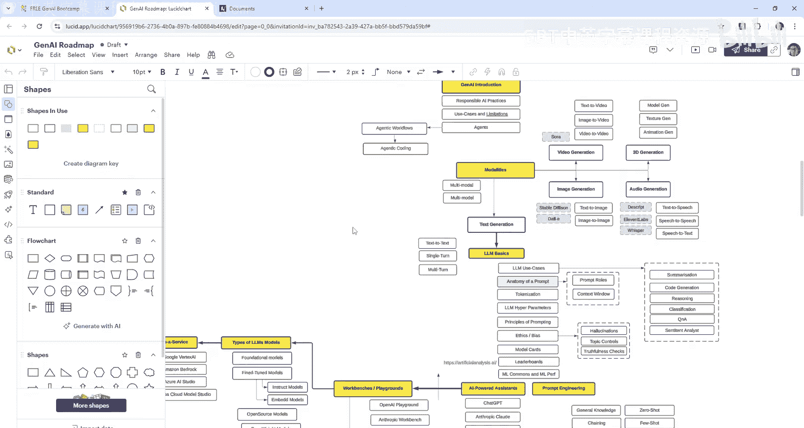
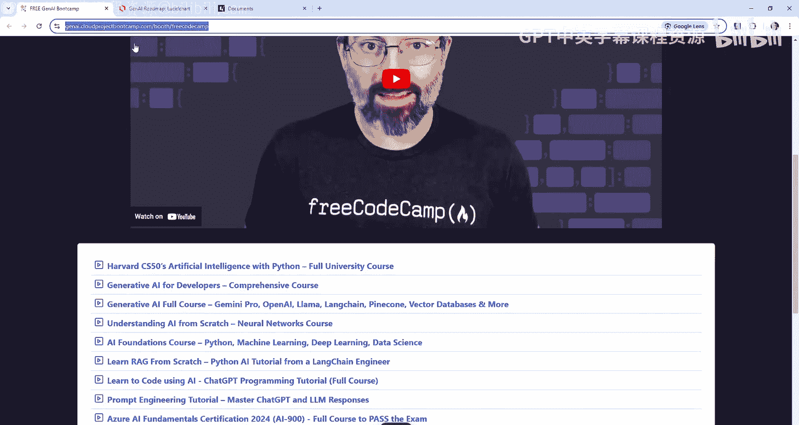
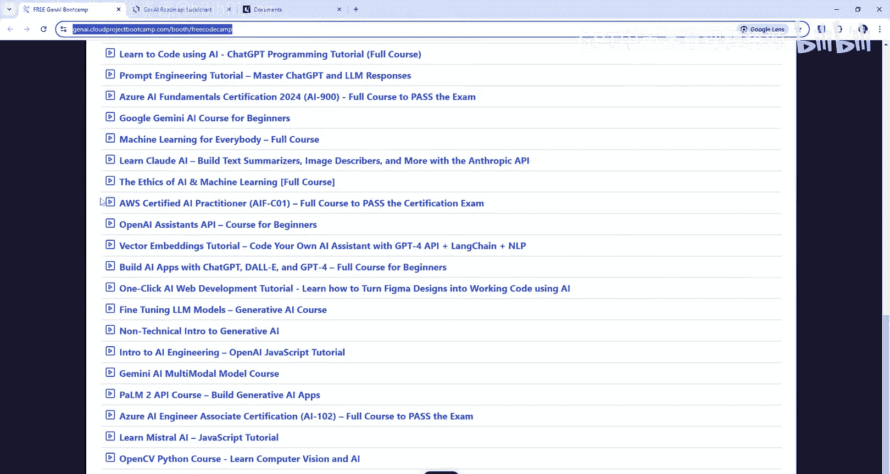
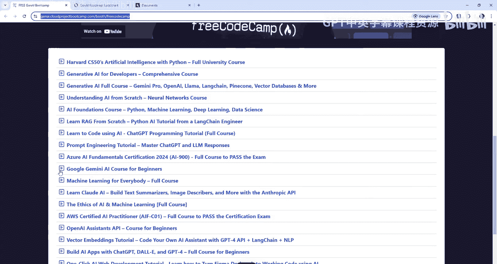
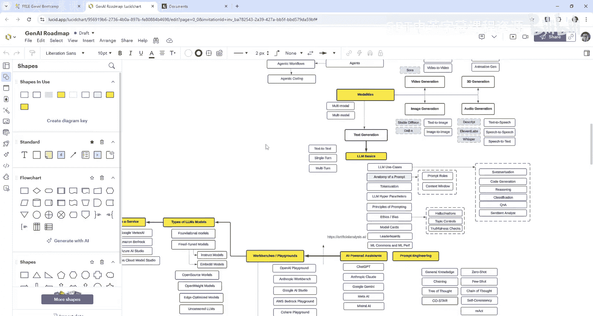
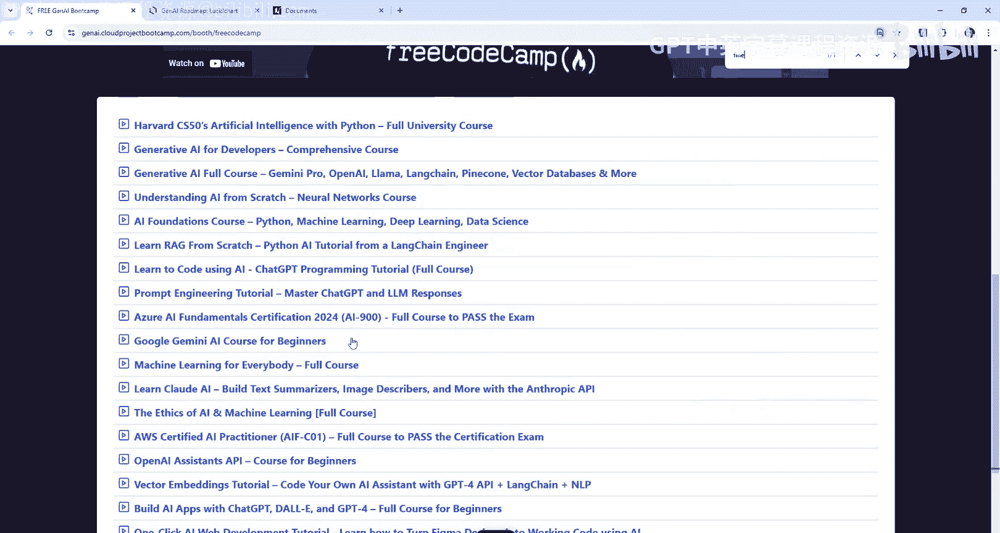
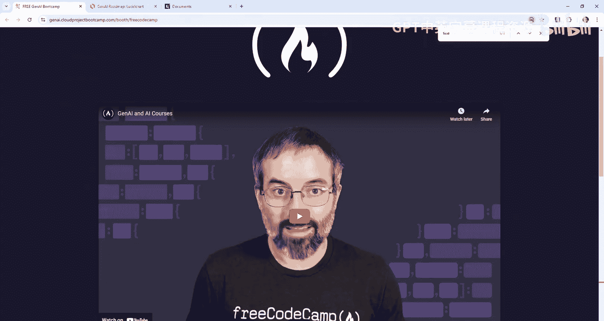

# 38：补充学习资源指南 🧭

在本节课中，我们将介绍如何获取和使用额外的学习资源，以弥补课程中因时间限制未能深入讲解的部分，并帮助你更好地准备生成式AI认证考试。

上一节我们介绍了课程的核心内容，本节中我们来看看如何利用外部资源进行补充学习。主讲人Angie Brown指出，由于时间限制，部分主题（如模型微调）未能详细展开。因此，她与freeCodeCamp合作整理了一份资源列表，供学员查漏补缺，确保学习成功。

## 资源列表与获取方式 📚

以下是补充资源的获取途径和主要内容介绍。

**资源列表的访问地址为：** `https://jenny-cloudpro-bootcamp.com/for-freecodecamp`

该页面汇集了多种主题的学习资料，未来还会持续更新。

## 核心主题资源示例 🎯

以下是一些关键主题的补充资源示例，你可以根据自身需求选择学习。

*   **模型微调**：课程中未深入讲解模型微调，你可以在此资源列表中找到相关的专门教程。
*   **谷歌AI产品**：关于谷歌的生成式AI产品与服务，列表中也提供了丰富的学习资料。
*   **主讲人其他视频**：列表中包含Angie Brown本人的其他教学视频，可以作为课程的延伸。

## 学习建议 💡

我们建议你充分利用这些资源进行准备。请根据个人知识薄弱环节，从列表中选择相应的材料进行学习，以巩固知识体系，为认证考试或实际应用打下坚实基础。

本节课中我们一起学习了如何访问和使用《生成式AI训练营》的官方补充资源列表。通过利用这些额外的学习材料，你可以更全面地掌握生成式AI知识，填补课程中未详尽涉及的内容空白，从而更自信地应对学习挑战和认证考试。