# 41：创建Torc开发者个人资料 🧑‍💻

在本节课中，我们将学习如何在Torc开发者网站上创建并完善一个专业的开发者个人资料。Torc是一个AI驱动的平台，旨在帮助开发者与潜在的工作机会建立联系。我们将从注册账号开始，逐步完成个人资料的填写，包括技能、工作经验、薪资期望等关键信息。

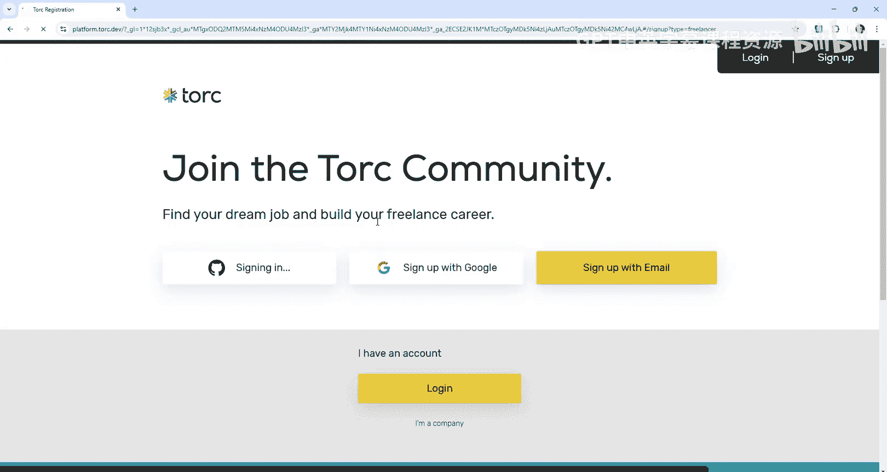

---

## 注册账号与初始设置

首先，我们需要访问Torc开发者网站并创建一个新账户。点击页面顶部的“注册”按钮。

有多种注册方式可供选择，例如通过GitHub账户进行快速注册。选择GitHub方式并授权连接，系统将自动创建您的个人资料。

注册完成后，平台会引导您进入初始设置流程。

## 导入简历或手动填写

初始设置的第一步是选择如何填充个人资料。您有两个选择：

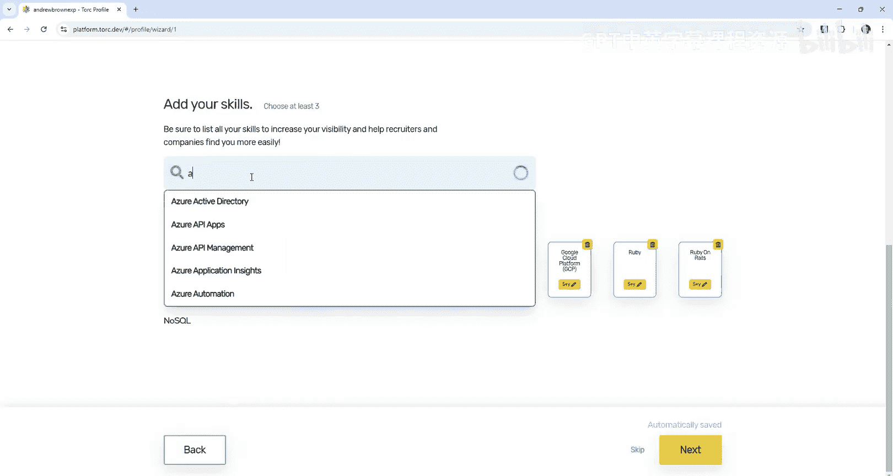

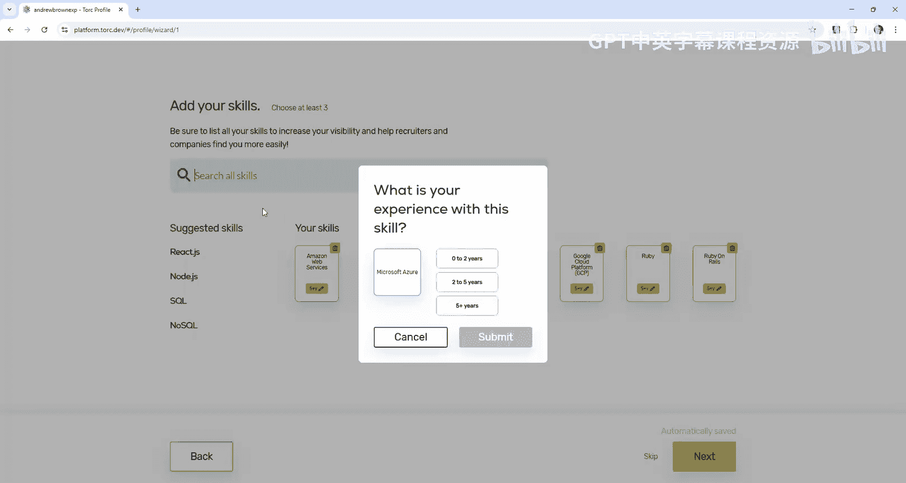

*   **上传简历**：上传您的简历文件，系统将自动提取并填充您的技能和工作经验等信息。这可以节省大量时间。
*   **手动填写**：如果您选择跳过上传，则需要手动填写所有信息。

在本教程中，为了演示完整流程，我们选择“跳过”并手动填写。

## 选择角色与技能

上一节我们完成了初始设置，本节中我们来看看如何定义您的专业角色和技能。

接下来，系统会要求您选择最能描述您身份的角色。例如，您可以选择“全栈开发者”和“AI工程师”。选择后点击“下一步”。

随后，您需要列出您的技能。详细列出所有相关技能可以增加您的可见度，帮助招聘方更容易地找到您。

以下是添加技能的方法：
*   在输入框中键入技能名称，如 `Ruby on Rails`，系统会提供匹配项。
*   为每项技能选择对应的熟练年限，例如 `5+ years`。
*   您可以添加多项技能，如 `AWS`、`Google Cloud Platform`、`Azure` 等。

完成技能添加后，点击“下一步”。

## 语言能力与工作偏好

现在，我们来设置语言能力和工作偏好。

在语言部分，系统可能会根据您连接的GitHub资料自动推断您的语言水平，例如“英语流利”、“日语基础”等。请根据实际情况确认或修改。

在工作偏好部分，您需要提供以下信息：
*   **工作类型**：选择您寻找的工作类型，如 `全职`、`兼职` 或 `开放接收机会`。
*   **可开始工作时间**：注明您需要多长的通知期，或选择 `无需通知期`。
*   **期望年薪**：请输入您期望的美元年薪。如果您不确定市场行情，可以参考行业报告或使用AI工具进行查询。例如，对于一名拥有15-20年经验的全栈开发者，年薪范围可能在 `$150,000` 到 `$200,000` 之间。

填写完毕后，点击“下一步”。

## 完善个人详细信息

接下来是完善个人详细信息的环节。

您需要填写以下内容：
*   **所在地**：输入您所在的城市。如果平台列表中没有您所在的小城镇，可以选择最近的主要城市。
*   **LinkedIn个人资料链接**：提供您的LinkedIn主页URL。
*   **个人简介标题**：提供一个简洁有力的标题来概括自己，例如 `“云计算讲师”` 或 `“全栈技术专家”`。
*   **个人总结**：这是自我介绍的机会。简要说明您的工作年限、专注领域、担任过的角色（如 `CTO`、`首席工程师`、`解决方案架构师`）以及您的核心优势（如 `提供技术指导`、`领导项目`、`按时交付`）。您也可以加入一些个人兴趣。
*   **联系方式**：检查并确认系统从LinkedIn导入的电话号码等信息（注意保护隐私，必要时可模糊处理）。
*   **社交媒体链接**：可选择性添加您的 `Twitter`、`Stack Overflow`、`个人作品集网站` 等链接。

完成所有信息填写后，点击“完成”。

## 查看与优化个人资料

最后，让我们查看生成的个人资料并进行优化。

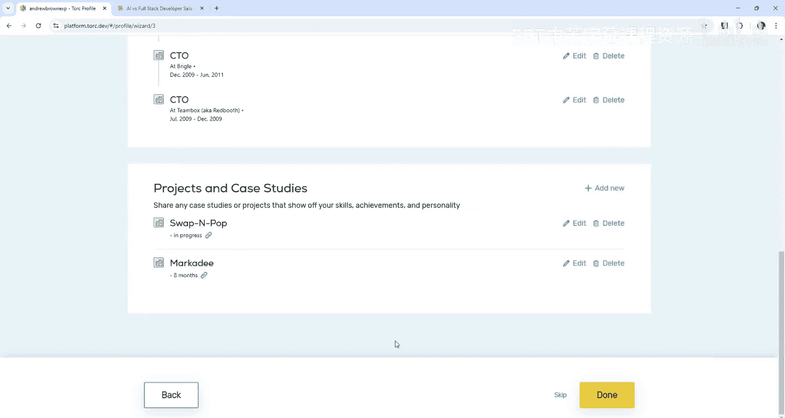

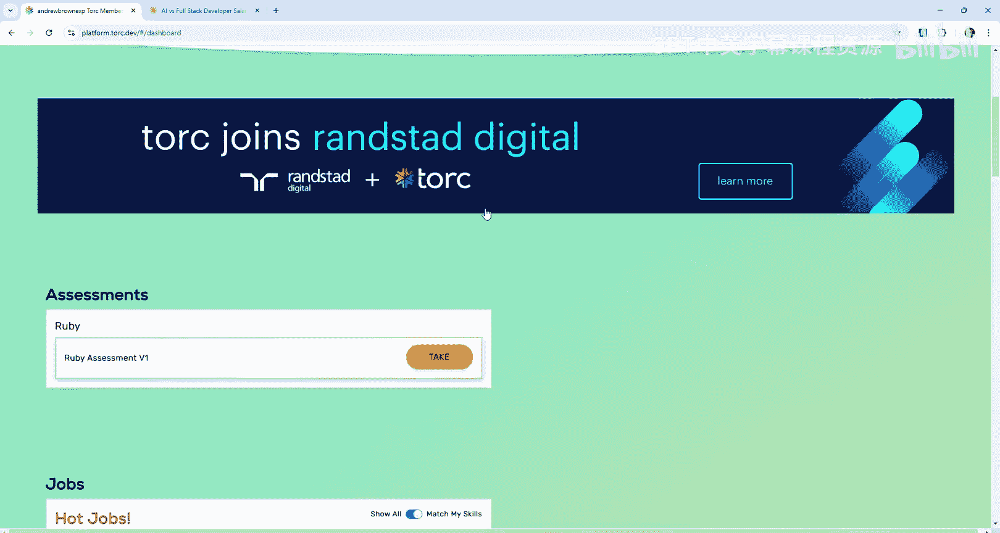

您的个人资料页面将展示以下信息：
*   **GitHub活动概览**：显示您常用的编程语言，如 `Ruby`、`JavaScript`。
*   **工作经历与描述**：从LinkedIn导入的过往工作经历。
*   **项目展示**：您参与过的项目列表。
*   **语言技能**：您填写的语言能力。
*   **技能标签**：您添加的所有技能。
*   **个人链接**：您提供的社交媒体和网站链接。

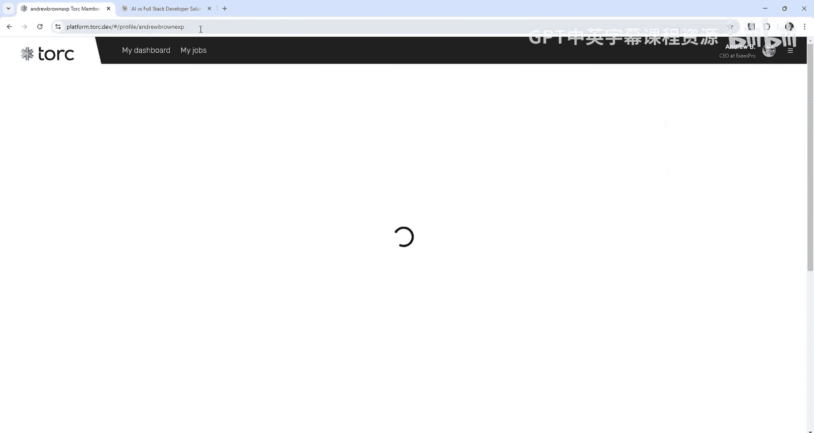

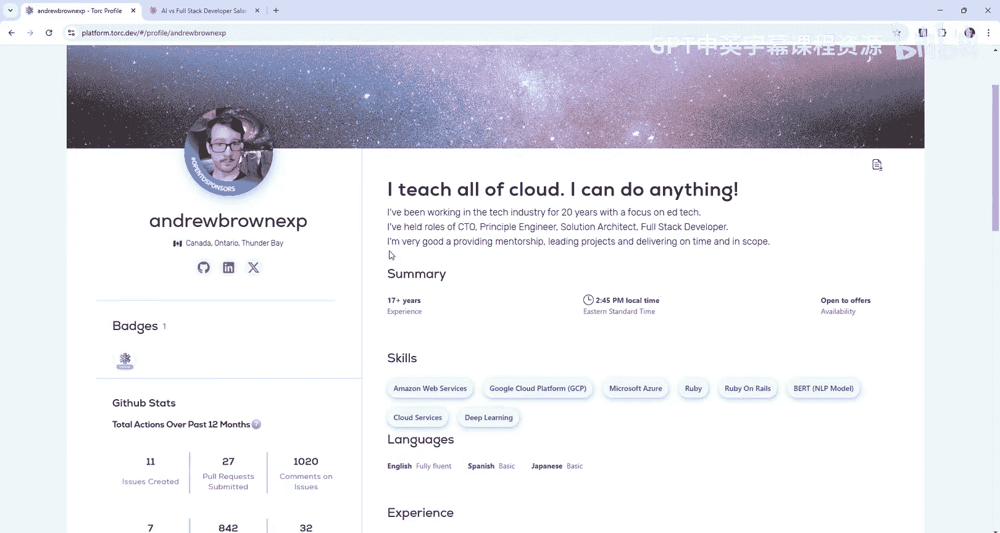

请仔细检查所有信息，确保其准确性和时效性。例如，工作经验年限可能需要根据您的实际职业生涯起点进行更新。

您还可以通过完成平台提供的技能评估（如 `Ruby` 评估）来进一步增强个人资料的竞争力。

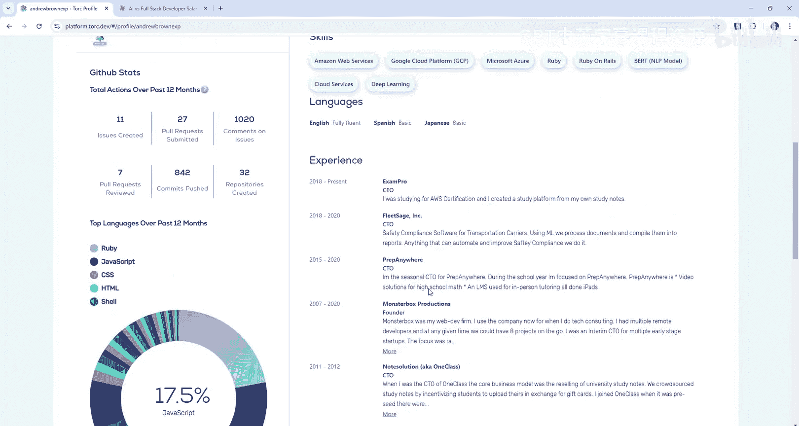

---

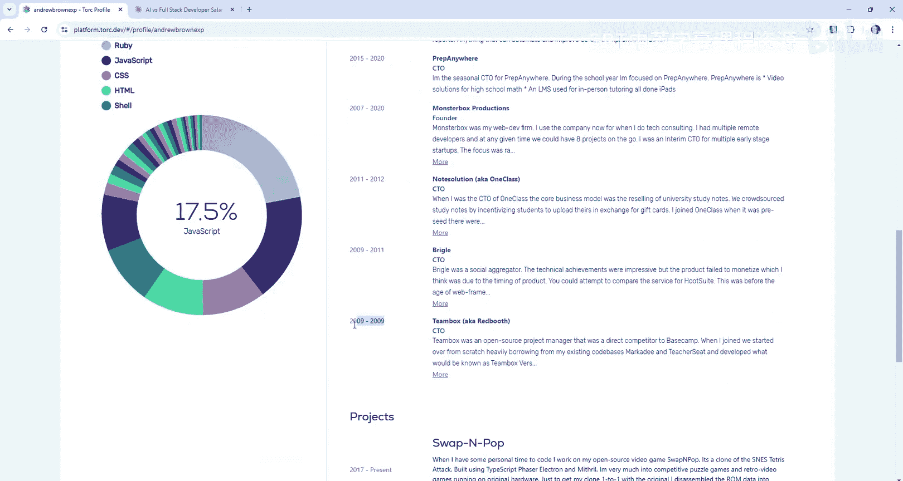

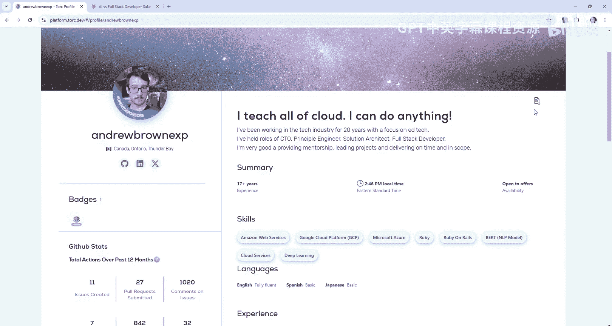

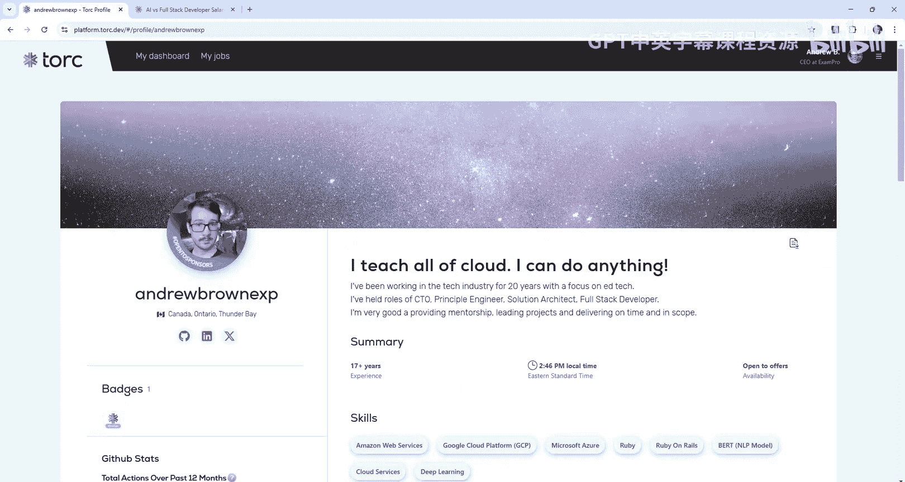

本节课中我们一起学习了如何在Torc平台上从零开始创建一份专业的开发者个人资料。关键步骤包括：注册账号、选择填充方式、定义角色与技能、设置工作偏好、完善详细信息，以及最终查看和优化资料。一份完整、准确的个人资料能显著提高您被合适工作机会发现的可能性。