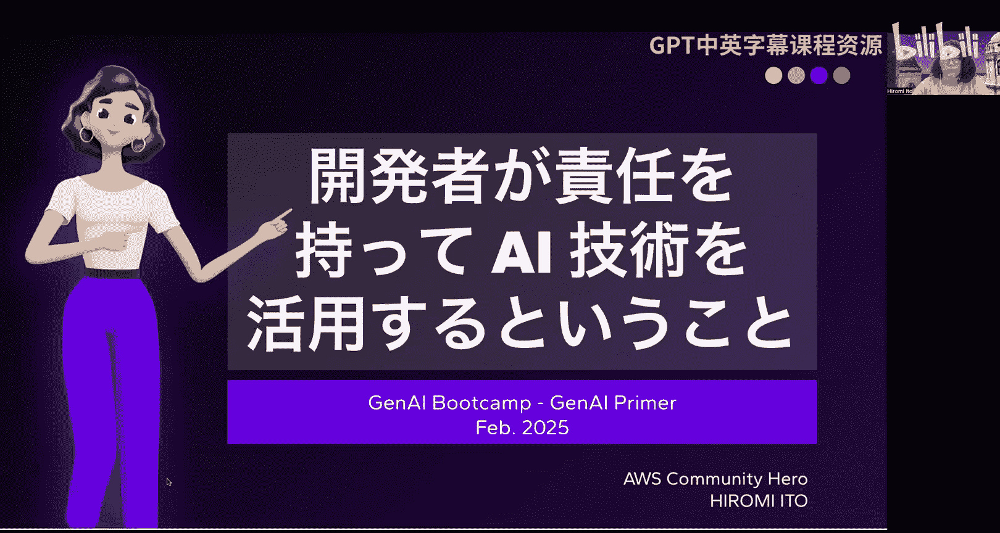
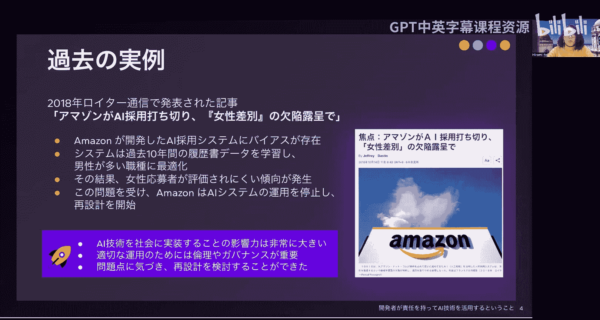
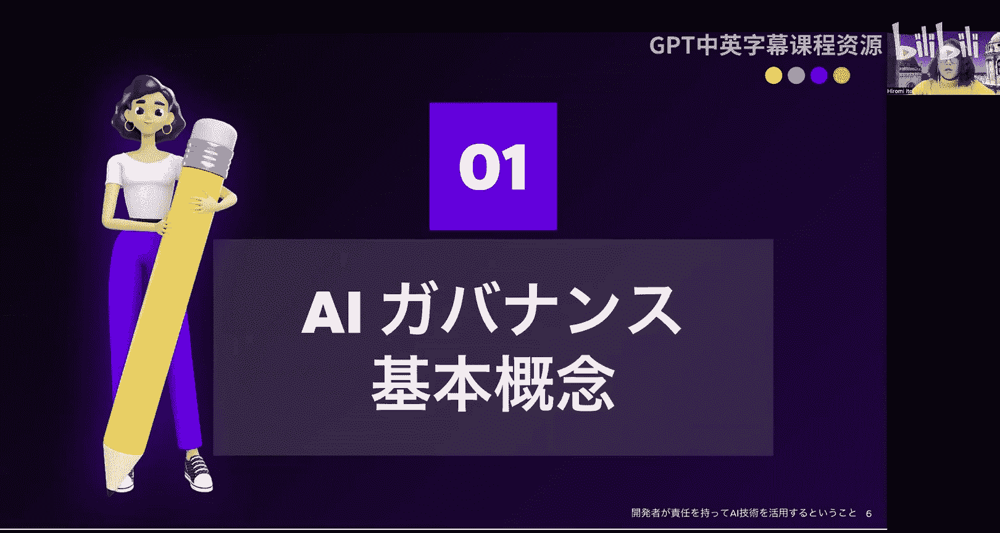
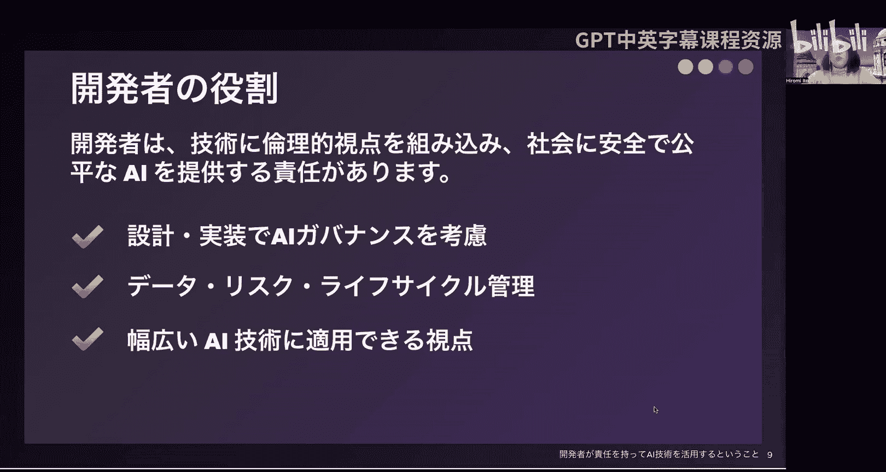
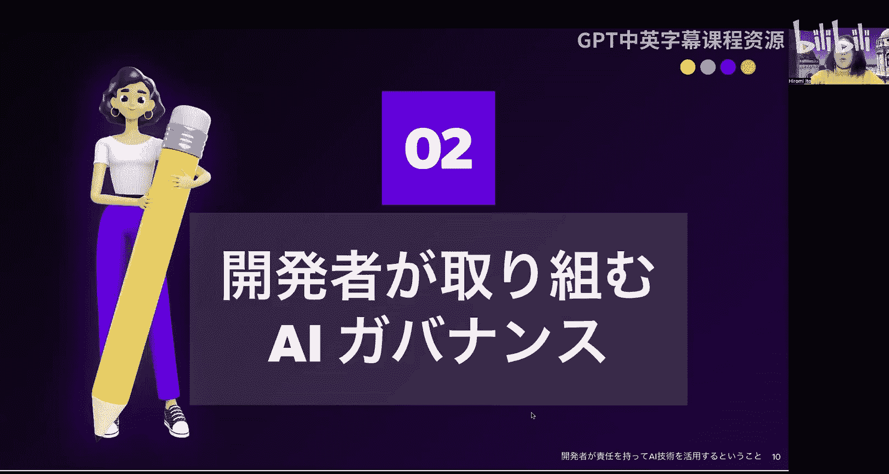
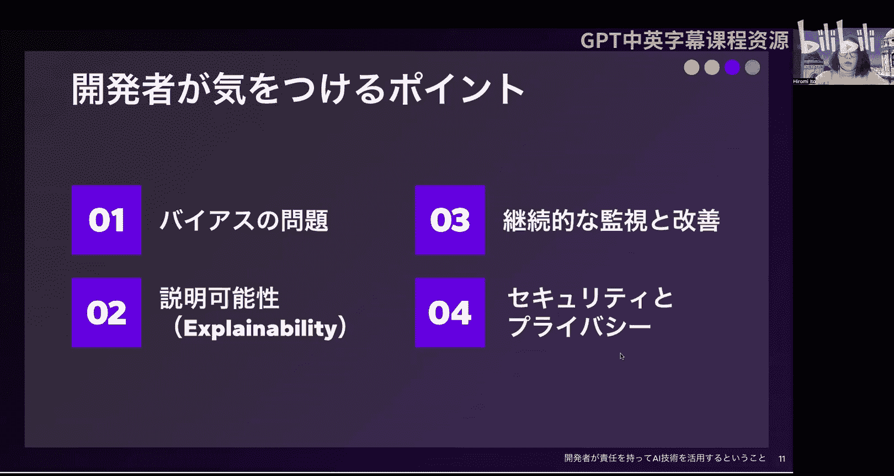
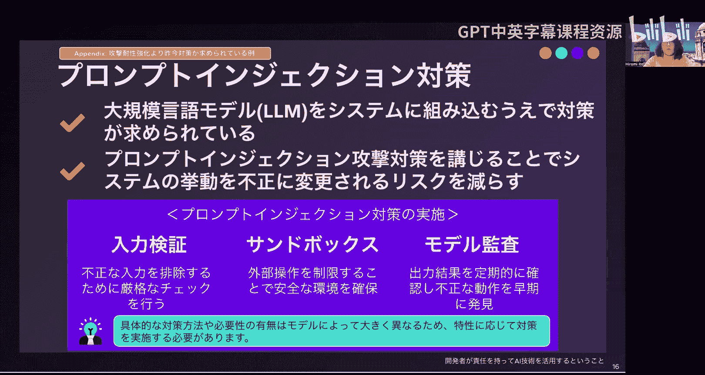
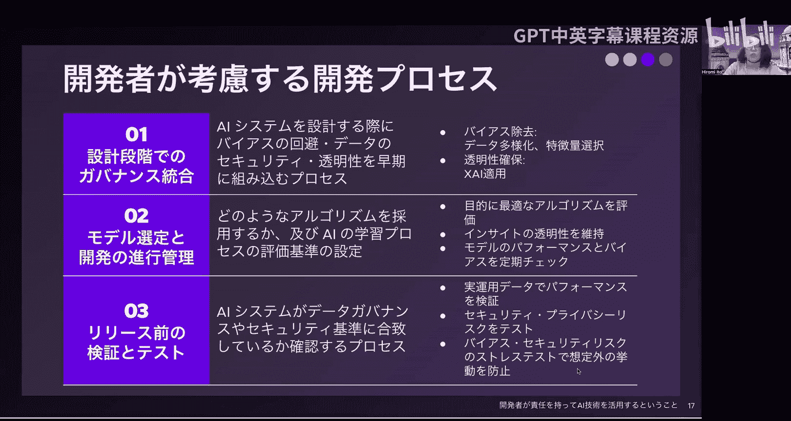
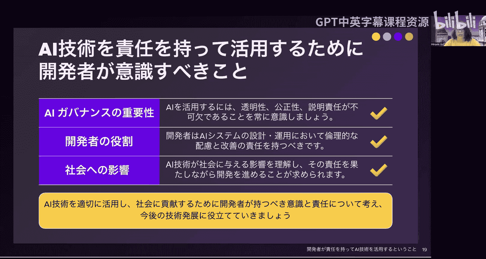

# 42：开发者如何负责任地运用AI技术

在本节课中，我们将学习开发者如何负责任地运用AI技术。我们将通过实际案例引入，探讨AI治理的基本概念、核心原则，并重点介绍开发者在实践中需要注意的关键点与流程。

## 引言与案例

大家好，本次的主题是“开发者如何负责任地运用AI技术”。

在进入正题之前，我们先通过一个实例来共同思考。这个例子是2018年路透社报道的一则新闻：亚马逊因招聘系统存在性别歧视缺陷而停止使用。亚马逊开发的招聘系统在评估候选人时，被发现对女性候选人存在偏见。AI系统学习了过去十年的简历数据，结果被优化为偏向男性占主导的职位，导致女性申请人更难获得青睐。因此，亚马逊停止了该AI系统的使用，并考虑重新设计。

这个案例让我们强烈感受到，将技术应用于社会时影响力巨大，而恰当的伦理和治理至关重要。能够发现问题并考虑重新设计，这本身是一件好事。

## 讲师介绍

我是伊藤博美。自2014年以来，我不仅在日本，也在国内外以数据用户群体为中心，积极参与技术社区的创立、运营和演讲等活动。

接下来，我们进入正题。首先，介绍AI治理的基本概念。

## AI治理的基本概念与原则

AI治理，简而言之，是为了创建安全、公平的AI技术服务和产品而制定的规则和思维方式。如果不加以重视，就可能像开头案例那样，产生意想不到的负面影响。作为开发者，为了防患于未然，引入AI治理至关重要。

上一节我们介绍了AI治理的概念，本节中我们来看看其基本原则。

以下是AI治理的三个基本原则：

1.  **透明性**：AI如何进行决策，这一点对开发者和用户来说必须能够理解。例如，如果AI为何做出特定推荐成为一个“黑箱”，就难以被信任和使用。因此，需要利用可解释AI等技术，明确决策过程。
2.  **公平性**：AI不应带有偏见，应为所有人提供公平的结果。例如，在招聘或贷款审批中使用AI时，需要努力消除数据偏差，避免对特定性别或种族产生不利结果。
3.  **问责制**：必须明确谁对AI产生的结果负责。例如，如果AI做出错误判断，却没有修正机制，问题就无法解决。明确责任归属，才能实现安全可靠的AI应用。

总而言之，为了恰当运用AI，必须认真考虑并实践这三大原则。

## 开发者的核心角色

AI治理不仅仅是制定方针和规则，更要求开发者在系统设计和实现阶段就积极贯彻这些原则。开发者需要将伦理考量融入技术，努力为社会和用户提供安全、公平的结果。

接下来，我们将焦点放在开发者身上，探讨更广泛的议题，包括数据治理、风险管理以及AI的整个生命周期，而不仅限于当前热门的大语言模型或图像识别。

## 开发者需关注的四大要点

对于开发者需要关注的重点，我们将其归纳为四大类：偏见问题、可解释性、持续监控与改进、安全与隐私。

### 1. 偏见问题

偏见问题是指，如果数据本身带有偏见（如开篇案例中的性别偏见），AI的判断也会反映这种偏见。为了防止这种情况，收集多样化数据并持续监控至关重要。

以下是应对偏见问题的两个关键措施：

*   **收集多样化数据**：不要依赖单一数据集，应收集覆盖多种属性（如性别、种族、年龄等）的数据。
*   **定期监控与评估**：检测数据中潜在的偏差，定期监控AI的判断，确保其不产生偏见，并进行反馈调整。

市场上有多种用于偏见管理和性能监控的工具，开发者需要根据项目需求和规模，选择合适的工具组合使用。

### 2. 可解释性

让用户能够理解AI的判断过程，直接关系到系统的可信度。例如，在信用审核中，可能需要解释AI为何做出某项决定。确保AI决策过程的可理解性，即“可解释性”，非常重要。

以下是确保可解释性的两种方法：

*   **选择透明模型**：避免使用“黑箱”AI，选择能够理解结论推导过程的模型。例如，决策树或回归分析等模型，能明确显示各因素的影响，是透明度较高的选择。
*   **实现解释工具**：为用户提供理解AI判断理由的工具。例如，使用可解释的可视化仪表板，或展示特定预测结果影响因素的说明功能，能帮助用户更安心地使用AI。

通过确保可解释性，AI的决策过程将变得更加透明和可信。

### 3. 持续监控与改进

AI系统在启动后也需要持续改进。由于运行中可能出现变化，定期的性能检查和算法再评估不可或缺。AI系统并非构建完成就一劳永逸，持续的监控和改进至关重要。

以下是两个需要考虑的要点：

*   **运行数据追踪**：监控AI在生产环境中的性能，发现数据变化和算法改进点。例如，定期检查预测精度是否下降、是否出现偏见。
*   **定期更新与反馈**：建立持续改进的流程，定期对AI进行再训练或调整。利用新数据和反馈更新模型，可以保持其准确性和公平性。

通过持续监控和改进，AI系统才能长期提供可靠的高性能。

### 4. 安全与隐私

AI系统处理的数据和结果得到恰当保护，对于建立用户信任至关重要。发生安全漏洞或隐私侵犯会损害企业或开发者的信誉。为了安全运行AI系统，数据保护不可或缺。

以下是三项关键的安全措施：

*   **数据加密**：在存储和传输时对数据进行加密，防止第三方未经授权的访问。例如，使用AES等加密技术。
*   **访问控制**：严格管理对数据和系统的访问权限，确保只有必要人员才能访问。这可以防止数据泄露或误操作。
*   **隐私保护**：处理个人信息时，必须遵守GDPR等相关法规。例如，征得用户同意后收集数据，并妥善删除不必要的个人数据。

实施这些措施可以增强AI系统的安全性，确保其可靠运行。

**补充：针对提示词注入的防护**

这里特别补充一点，尤其是将大语言模型集成到系统中时，需要防范“提示词注入”攻击。这种攻击通过向AI系统输入恶意指令，试图操控其行为。

以下是针对提示词注入的三项防护措施：

*   **输入验证**：执行严格的检查以排除恶意输入。例如，检测特定的攻击模式，并阻止可能对AI产生不良影响的输入。
*   **引入沙箱环境**：限制外部操作，确保运行环境安全。例如，限制AI访问非预期的API或系统，以减轻滥用风险。
*   **模型审计**：定期检查AI的行为，及早发现异常。例如，持续验证AI对特定提示词是否会产生异常回答。

需要注意的是，具体防护措施的必要性和方法因模型而异。即使是基于同一预训练模型，经过不同微调后行为也可能不同，因此需要根据模型特性采取相应措施。

## 开发流程中的关键考虑

上一节我们讨论了开发者需关注的要点，本节我们来看看在开发流程中需要考虑的三个阶段。

以下是开发者在流程中应重点关注的三个阶段：

1.  **设计阶段的治理整合**：在设计AI系统时，早期就将偏见规避、数据安全和透明性等考量融入流程。例如，在数据收集和预处理阶段就采用消除偏见的方法，并应用可解释AI的方法来确保决策透明。
2.  **模型选择与开发管理**：设定AI学习过程的评估标准，选择合适的算法。在评估哪种算法最符合目标时，要保持AI所提供洞察的透明性。同时，定期检查模型的性能和偏见。
3.  **发布前的验证与测试**：基于实际运行数据验证AI性能，并测试安全与隐私风险。特别是要进行针对偏见和安全风险的“压力测试”，以防止出现预期外的行为。

## 总结

本节课中，我们一起学习了安全且负责任地运用AI技术的重要要点。

最后，总结一下开发者应牢记的三点：

1.  **AI治理的重要性**：运用AI时，透明性、公平性和问责制不可或缺。牢记这些原则，才能构建值得信赖的AI系统。
2.  **开发者的角色**：开发者需要在设计和运营中进行伦理考量，并始终承担持续改进的责任。通过适当的监控和调整，避免AI做出错误判断。
3.  **对社会的影响**：必须理解技术对社会可能产生的影响，并在此过程中履行责任进行开发。要特别注意避免误用或因偏见导致不公平的判断。

恰当运用AI技术，为社会做出贡献，思考我们应具备何种意识和责任，这是至关重要的第一步。希望我们能共同为未来的技术发展贡献力量。

感谢聆听。