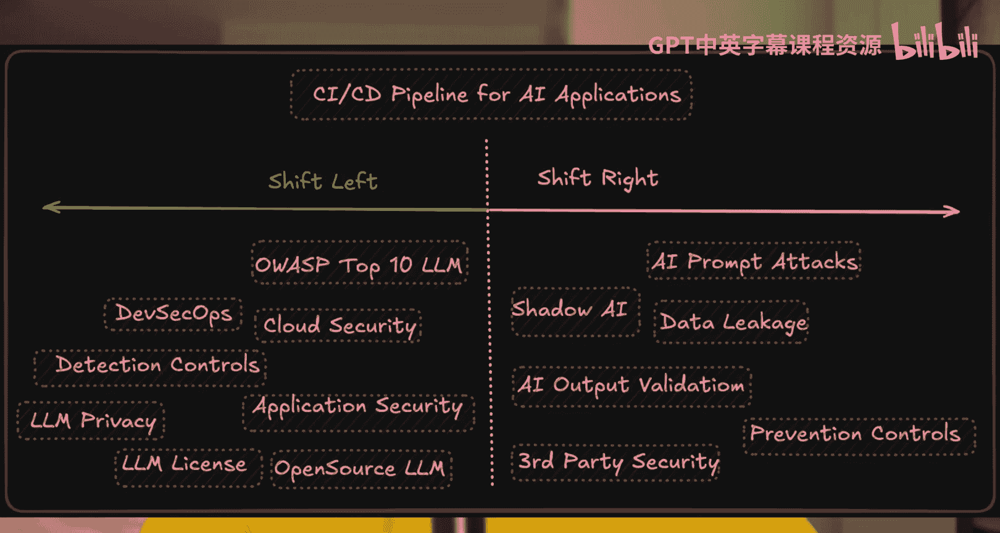
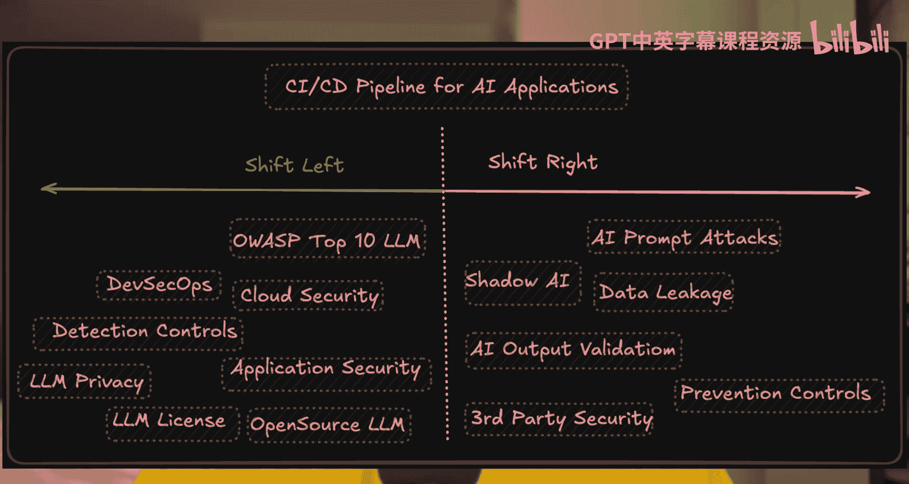

# 43：2025年需避免的两大AI安全误区 🔒

在本节课中，我们将探讨审视AI安全的两种核心视角。理解这两种视角对于保护您的系统免受攻击至关重要。

## 概述

AI安全主要可以从两个方向进行审视。如果忽略了这两个方向，您的系统可能会面临巨大的安全风险。

## 审视AI安全的两种方式

上一节我们概述了课程目标，本节中我们来看看具体是哪两种方式。下图清晰地展示了这两种不同的安全关注点：

### 1. 运行时安全（右侧）

如果您已经在生产环境中运行了许多AI应用程序，那么您真正需要关心的是AI的**运行时安全**。这涉及到应用程序在实际运行过程中面临的安全威胁与防护。

后续会有专门的深度视频详细讲解此话题，但其核心就是处理应用程序上线后的安全问题。

### 2. 部署前安全（左侧）

这与运行时安全不同，属于**部署前**的安全范畴，也是许多团队长期实践的工作。

如果您正在使用AI应用程序，那么您需要重点关注的是整个AI能力集成与部署的**管道安全**。

以下是此类安全关注的两种常见情况：

*   应用程序通过API调用外部的大语言模型（如OpenAI、Anthropic或DeepSeek）。
*   您试图将安全性集成到**原生内置AI功能**的应用程序中。

对于后一种情况，了解**大语言模型十大安全风险**（OWASP Top 10 for LLM）将有助于您更好地把握安全要点。

## 是否存在第三种方式？

目前，确保AI安全主要围绕上述两种视角。如果您认为存在第三种重要的安全方式，欢迎在评论区分享您的见解。

## 总结

本节课中我们一起学习了AI安全的两个关键切入点：**运行时安全**和**部署前安全**。明确您的应用处于哪个阶段，有助于集中资源应对最相关的安全挑战。希望本课能帮助您为所在组织做出更明智的AI安全决策。

我们下期视频再见。