# 44：使用CodeRabbit生成PR审查 👨‍💻🤖

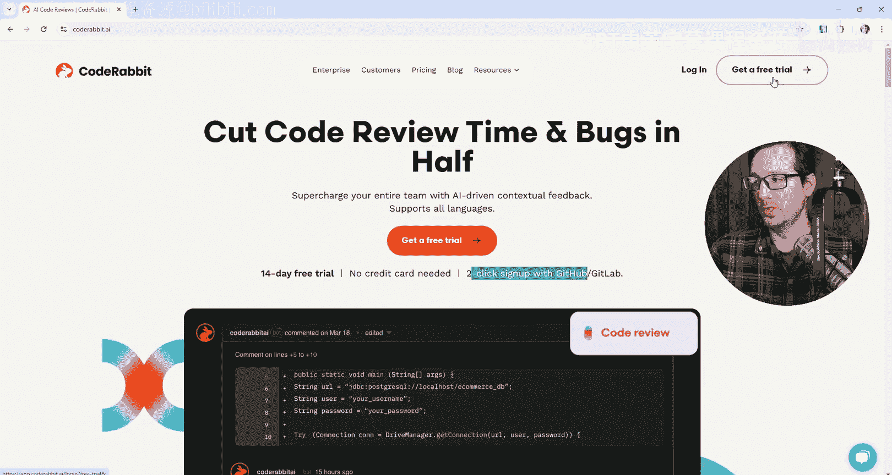

## 概述
在本节课中，我们将学习如何使用CodeRabbit这一AI驱动的代码审查工具。我们将从创建免费试用账户开始，逐步完成配置，并最终通过一个实际的代码变更来体验其自动生成Pull Request（PR）审查报告的功能。

## 创建CodeRabbit账户 🆓

上一节我们介绍了课程目标，本节中我们来看看如何开始使用CodeRabbit。首先需要创建一个免费试用账户。

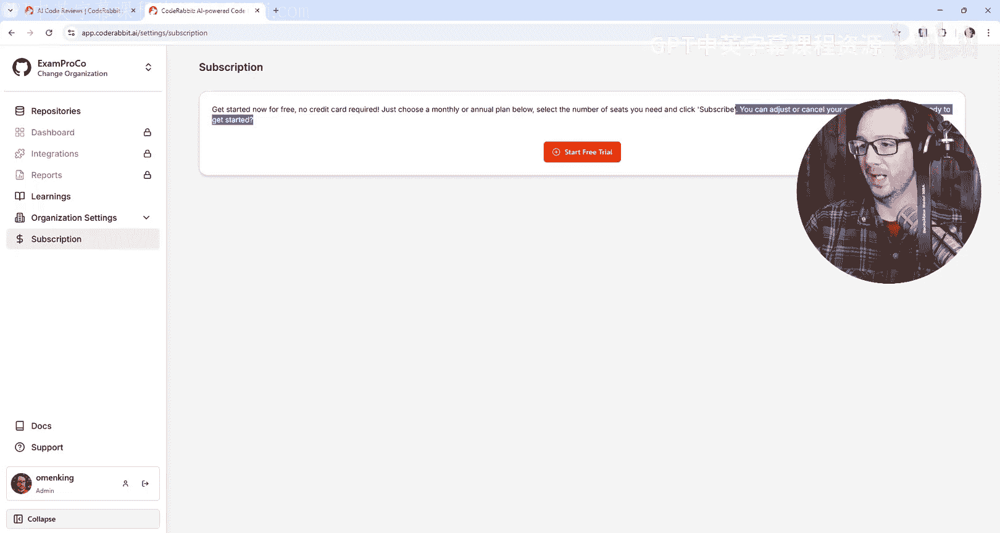

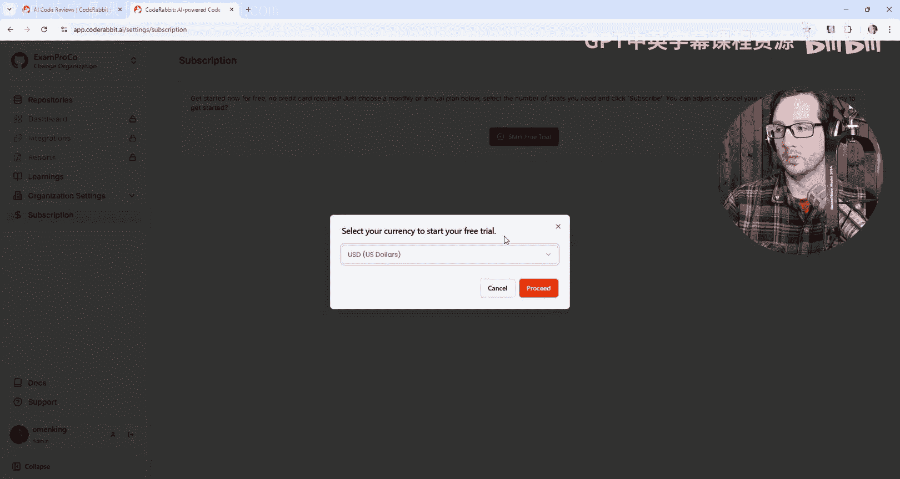

CodeRabbit提供14天免费试用，无需信用卡。注册过程只需点击两次。注册需要使用GitHub、GitLab或Azure DevOps账户。本次演示将使用GitHub。

以下是注册步骤：
1.  访问CodeRabbit网站。
2.  点击页面右上角或中间的“Get Started”按钮。
3.  在注册选项中选择“GitHub”。
4.  授权CodeRabbit访问你的GitHub账户。它只需要只读权限和你的邮箱地址。
5.  创建一个新的组织或选择现有组织。

注册完成后，你会进入CodeRabbit仪表板。初始状态下，一些高级功能可能显示为锁定状态，这是因为我们尚未激活14天免费试用版的Pro计划。

## 激活Pro计划试用 🔓

上一节我们完成了账户注册，本节中我们来看看如何解锁全部功能。

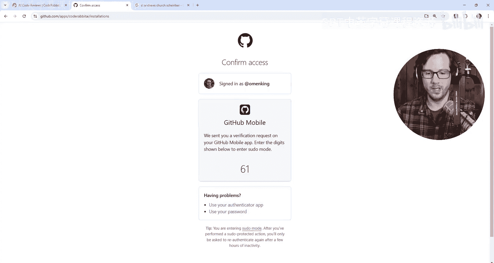

虽然界面提示“升级到Pro计划”，但CodeRabbit明确提供了无需信用卡的14天免费试用。我们需要通过特定路径激活它。

以下是激活步骤：
1.  在CodeRabbit仪表板中，点击左侧菜单的“Subscription”（订阅）。
2.  页面会提示“免费开始，无需信用卡”。
3.  选择月度或年度计划（试用期间不会收费）。
4.  选择席位数量（例如1个开发者）。
5.  点击“Subscribe”（订阅）按钮。
6.  在后续的账单信息页面填写信息（所有信息均为可选，包括账单地址）。
7.  最终确认订阅，整个过程不会要求输入信用卡信息。

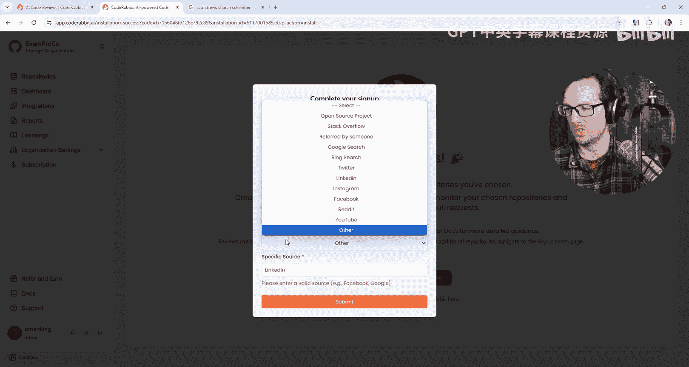

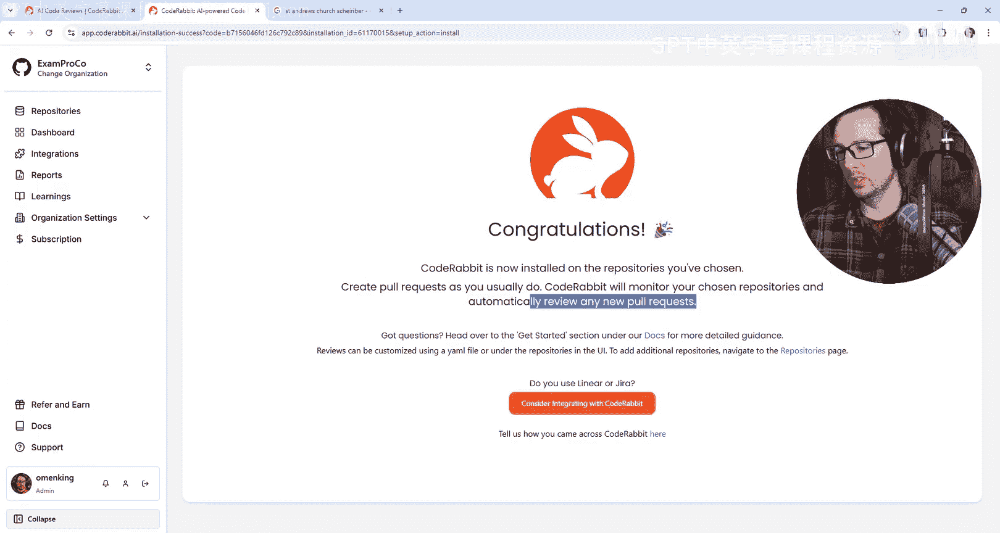

激活成功后，仪表板中的所有功能锁都会消失，表示Pro计划试用已生效。

## 连接代码仓库 🔗

现在我们已经拥有完整功能的账户，接下来需要将CodeRabbit连接到我们想要审查的代码仓库。

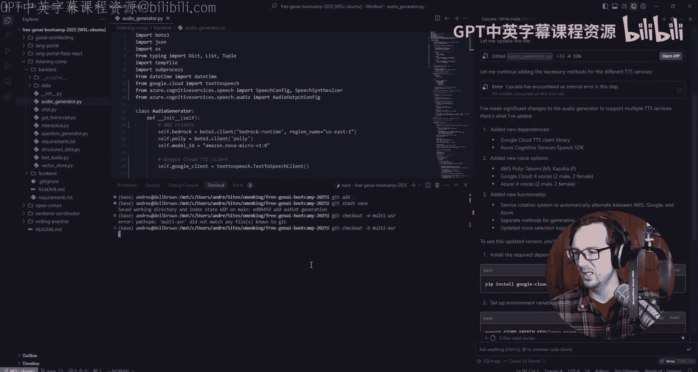

CodeRabbit支持连接GitHub、GitLab、Bitbucket等平台的仓库。连接后，工具将开始监控所选仓库的新拉取请求。

以下是连接仓库的步骤：
1.  在CodeRabbit仪表板中，点击“Repositories”（仓库）。
2.  点击“Add Repository”（添加仓库）。
3.  选择你的代码托管平台（例如GitHub）。
4.  在授权页面，选择你想要连接的特定仓库。建议出于安全考虑，只授权必要的仓库，而非所有仓库。
5.  完成授权。

**重要提示**：连接后，请确保在CodeRabbit界面顶部左侧选择了正确的组织。工具可能默认显示其他组织，如果看不到你刚连接的仓库，请检查并切换组织。

## 创建并提交一个拉取请求（PR） 🛠️

CodeRabbit的核心功能是自动审查PR。要看到它的实际效果，我们需要先创建一个包含代码变更的PR。

在本例中，我们将修改一个音频生成器的代码，为其添加对Azure和Google Cloud语音服务的支持，而原本它只支持AWS Polly服务。

以下是创建PR的步骤：
1.  在本地代码库中，创建一个新的功能分支。
    ```bash
    git checkout -b multi-asr
    ```
2.  实现代码变更（例如，扩展`AudioGenerator`类以集成多个TTS服务提供商）。
3.  将变更提交到新分支。
    ```bash
    git add .
    git commit -m "更新代码以支持多个ASR系统"
    ```
4.  将分支推送到远程仓库。
    ```bash
    git push origin multi-asr
    ```
5.  在GitHub上，基于`multi-asr`分支向主分支（如`main`）创建一个新的Pull Request。
6.  **关键点**：创建PR时，可以故意不填写描述，以测试CodeRabbit自动生成摘要的能力。

## 查看AI生成的PR审查报告 📋

PR创建后，CodeRabbit会自动检测并开始分析。几分钟后，它将在PR的评论区生成详细的审查报告。

报告通常包含以下几个核心部分：

**1. PR摘要**
即使提交者没有填写描述，CodeRabbit也会自动生成一个清晰的功能摘要。例如：
> “新功能：通过集成Google Cloud和Azure扩展了文本转语音能力。增强的语音选择现在为音频体验提供了更丰富的选项。引入了灵活的服务轮换机制以无缝利用可用提供商。”

**2. 变更总结**
报告会列出被修改的文件，并总结每个文件的主要变更。例如：
> “该PR更新了AudioGenerator类，以在AWS Polly之外支持额外的文本转语音服务。它现在使用各自的SDK和环境变量初始化Google Cloud TTS和Azure TTS的客户端。”

**3. 序列图**
CodeRabbit的一个特色功能是生成**序列图**，以可视化代码的执行流程。
```
sequenceDiagram
    participant User
    participant AudioGenerator
    participant TTSService

    User->>AudioGenerator: generate_audio(text, service)
    alt service == "aws"
        AudioGenerator->>TTSService: call_aws_polly(text)
    else service == "google"
        AudioGenerator->>TTSService: call_google_tts(text)
    else service == "azure"
        AudioGenerator->>TTSService: call_azure_tts(text)
    end
    TTSService-->>AudioGenerator: audio_data
    AudioGenerator-->>User: audio_file
```
这张图清晰地展示了根据不同的服务参数，代码如何选择不同的TTS提供商路径。

**4. 报告与洞察**
除了单次PR审查，CodeRabbit还提供更宏观的“报告”功能。
*   **每日/每周报告**：可以配置定期（如每日）通过Slack、Discord、Teams或邮件发送团队开发活动摘要。这对于管理者了解团队进度非常有用。
*   **分组查看**：报告可以按仓库、团队或开发者进行分组，从不同维度查看贡献和变更。

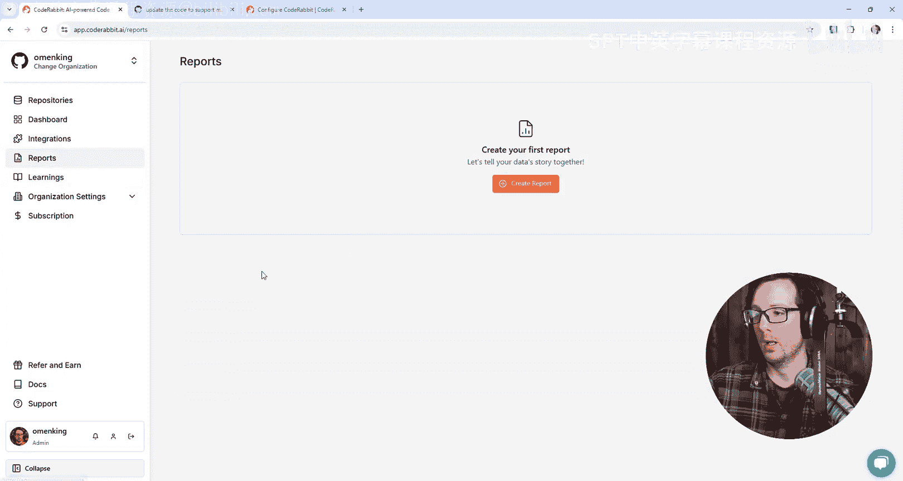

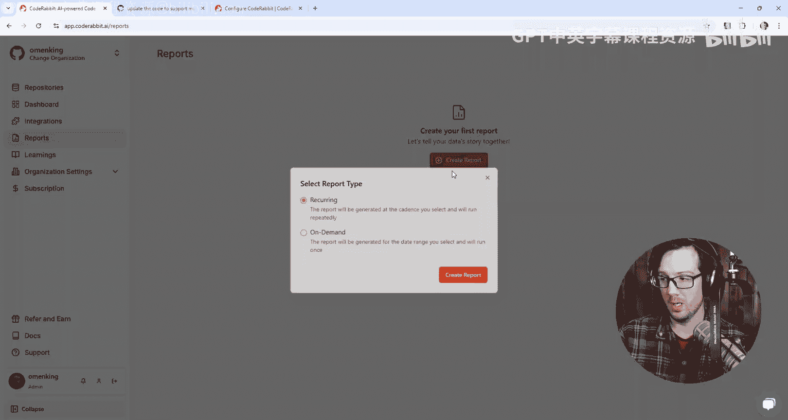

## 总结 🎯

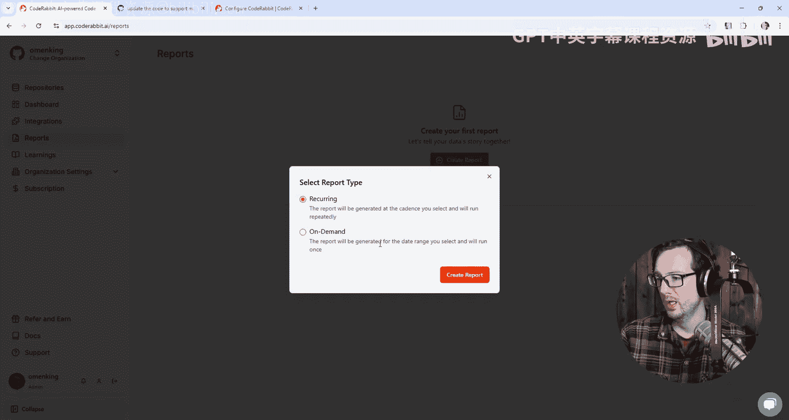

本节课中我们一起学习了如何使用CodeRabbit进行AI辅助的代码审查。

我们从注册无需信用卡的14天免费试用开始，逐步完成了账户配置、仓库连接。然后，我们通过一个实际的代码变更创建了PR，并观察了CodeRabbit如何自动生成包含**摘要**、**变更总结**和**序列图**的详细审查报告。最后，我们还了解了其**团队报告**功能，它能帮助管理者跟踪项目进展。

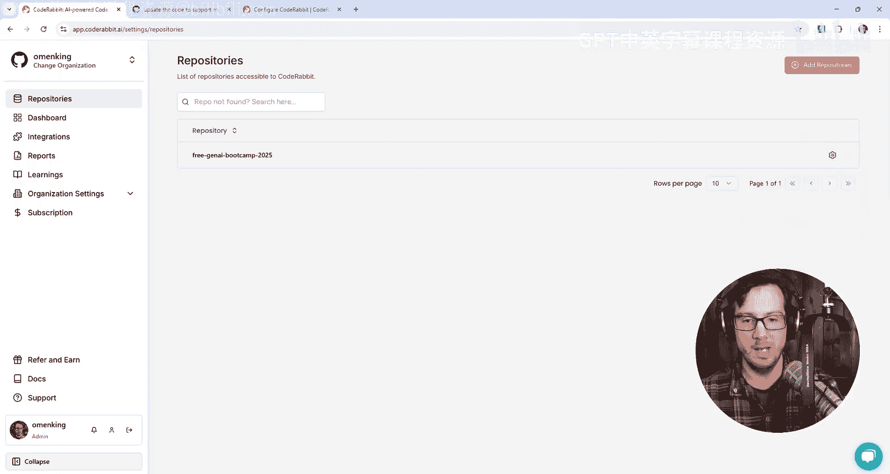

CodeRabbit的价值在于它能将代码变更快速转化为易于理解的叙述和图表，节省了人工编写审查摘要的时间，尤其适用于需要处理大量PR的团队。随着使用时间增长，其AI代理还能不断学习，提供更精准的洞察。